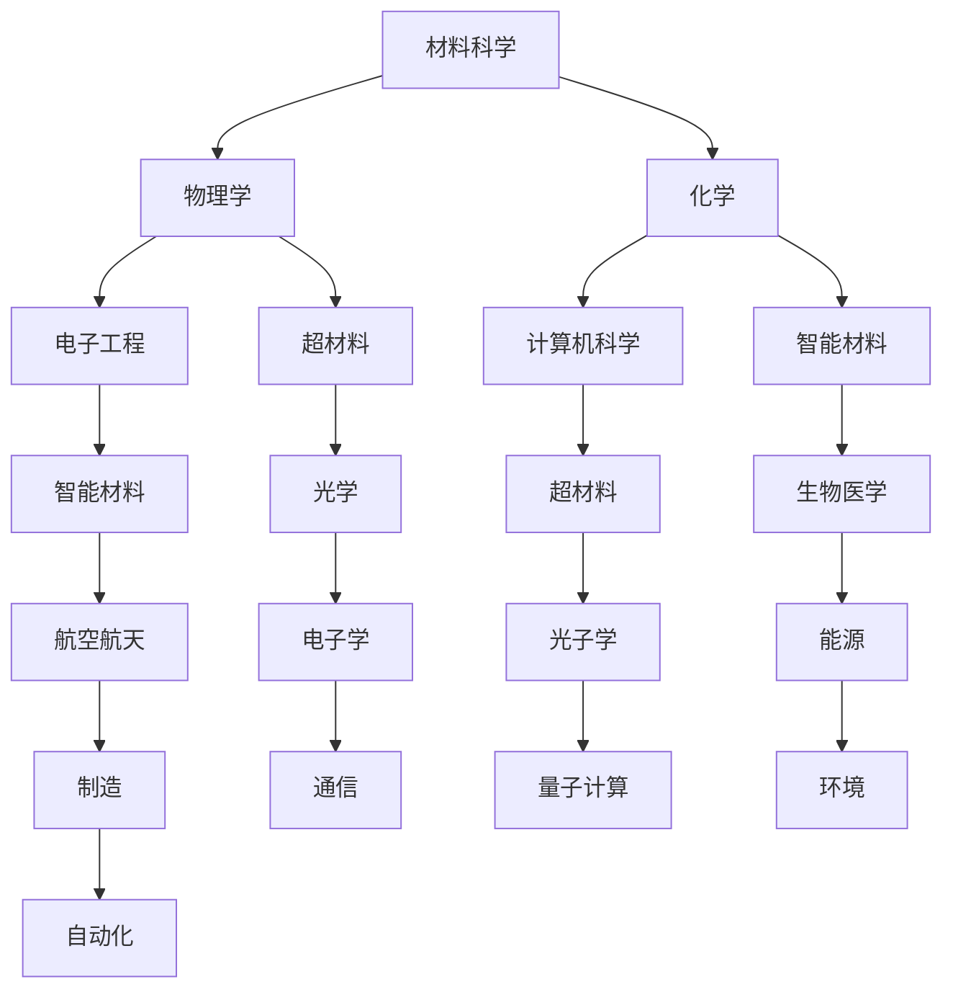

                 

关键词：智能材料、超材料、2050年、新材料、科技发展

> 摘要：本文探讨了到2050年智能材料和超材料在科技领域的潜在应用与影响，分析了这些新兴材料的基础科学原理、技术发展现状以及未来展望。

## 1. 背景介绍

新材料的发展一直是推动科技进步的重要驱动力。从传统的金属材料、合成材料到现代的纳米材料，每一次材料科学的突破都带来了技术领域的革命。如今，我们正处在一个新的科技前沿——智能材料和超材料的研发与应用。这些材料不仅具有传统材料的属性，还具备自我修复、感知环境、响应刺激等智能化特性，它们将在未来带来一场全新的技术革新。

### 1.1 智能材料

智能材料，又称为功能材料，是指能够对外界环境（如温度、压力、电磁场等）做出响应并改变自身物理或化学性质的材料。它们在航空航天、生物医学、能源、制造等领域展现出了巨大的应用潜力。

### 1.2 超材料

超材料是一种人工设计的结构，其电磁性质可以被精确控制，甚至可以实现负折射、隐形等超自然现象。超材料的研究始于20世纪90年代，随着纳米技术的发展，其在光子学和电子学领域的研究不断深入，应用前景广阔。

### 1.3 新材料的重要性

新材料不仅是科技进步的基石，也是国家竞争力的重要标志。随着科技的不断进步，新材料在各个领域的应用越来越广泛，从传统的汽车制造、建筑到新兴的量子计算、生物医疗，都离不开新材料的支持。

## 2. 核心概念与联系

要理解智能材料和超材料，首先需要了解其背后的核心概念与联系。

### 2.1 基础科学原理

智能材料和超材料的研究涉及多个学科领域，包括材料科学、物理学、化学、电子工程和计算机科学。以下是一个简化的Mermaid流程图，展示了这些核心概念之间的联系：



### 2.2 基本原理

- **智能材料**：基于响应性分子、纳米结构或复合材料设计，能够对外界刺激（如温度、压力、电磁场等）做出可预测的响应。例如，一些智能材料可以在室温下由透明变为不透明，或者在受到紫外线照射后变硬。
- **超材料**：通过人工设计的微观结构，实现对电磁波的操纵，包括负折射、隐形等。超材料的设计通常基于微波和光波领域的研究。

### 2.3 技术架构

智能材料和超材料的技术架构可以分为三个层次：基础材料、功能层和系统集成。

- **基础材料**：包括传统材料（如金属、陶瓷、聚合物）和纳米材料（如纳米线、纳米片）。
- **功能层**：通过设计特定的微观结构或复合材料，赋予材料特定的功能，如电响应、磁响应、光响应等。
- **系统集成**：将智能材料和超材料集成到具体的设备或系统中，实现实际应用。

## 3. 核心算法原理 & 具体操作步骤

### 3.1 算法原理概述

智能材料和超材料的研究通常涉及以下几个方面：

- **材料设计**：基于计算模拟和实验研究，设计具有特定功能的新材料。
- **性能评估**：通过实验和模拟，评估材料的性能，如机械性能、电学性能、光学性能等。
- **系统集成**：将智能材料和超材料集成到设备或系统中，进行功能验证和应用开发。

### 3.2 算法步骤详解

1. **材料设计**
   - **目标确定**：明确材料的功能和应用场景。
   - **结构设计**：基于目标功能，设计材料的微观结构。
   - **材料制备**：通过合成或加工方法，制备出设计好的材料。

2. **性能评估**
   - **实验测试**：通过实验，测试材料的物理、化学和电学性能。
   - **模拟分析**：利用计算模拟，分析材料的性能与微观结构之间的关系。

3. **系统集成**
   - **功能实现**：将材料集成到具体的设备或系统中，实现目标功能。
   - **功能验证**：通过实验和测试，验证系统的性能和稳定性。

### 3.3 算法优缺点

- **优点**：智能材料和超材料具有许多传统材料无法实现的特性，如自我修复、感知环境、隐形等，可以带来许多新的应用场景。
- **缺点**：材料设计复杂，制备工艺要求高，成本较高。

### 3.4 算法应用领域

智能材料和超材料在多个领域展现出了巨大的应用潜力：

- **航空航天**：用于制造新型飞机和航天器，提高性能和安全性。
- **生物医学**：用于制造智能药物释放系统、生物传感器等。
- **能源**：用于制造高效的光伏材料和储能设备。
- **制造**：用于制造智能机器人和自动化设备。

## 4. 数学模型和公式 & 详细讲解 & 举例说明

### 4.1 数学模型构建

智能材料和超材料的研究通常涉及多个数学模型，包括电磁学、热力学、动力学等。以下是一个简化的数学模型示例：

$$
\mu = \mu_0 \left(1 - \frac{\sigma}{\omega \epsilon}\right)
$$

其中，$\mu$ 是磁导率，$\mu_0$ 是真空磁导率，$\sigma$ 是电导率，$\omega$ 是角频率，$\epsilon$ 是介电常数。

### 4.2 公式推导过程

该公式描述了磁导率与电导率之间的关系。推导过程如下：

1. 磁导率 $\mu$ 是磁感应强度 $B$ 与磁场强度 $H$ 的比值，即 $\mu = \frac{B}{H}$。
2. 电导率 $\sigma$ 是电场强度 $E$ 与电流密度 $J$ 的比值，即 $\sigma = \frac{J}{E}$。
3. 联立上述两个方程，并代入电磁波传播速度 $v = \frac{1}{\sqrt{\mu \epsilon}}$，得到 $\mu = \mu_0 \left(1 - \frac{\sigma}{\omega \epsilon}\right)$。

### 4.3 案例分析与讲解

假设我们设计一种超材料，其目标是实现隐形。我们可以通过调整电导率和介电常数来实现这一目标。以下是一个具体的案例：

- **目标**：实现隐形。
- **参数**：电导率 $\sigma = 10^{-6} S/m$，介电常数 $\epsilon = 10^{-12} F/m$，角频率 $\omega = 2\pi \times 10^{9} rad/s$。

根据上述公式，我们可以计算超材料的磁导率：

$$
\mu = \mu_0 \left(1 - \frac{\sigma}{\omega \epsilon}\right) = 4\pi \times 10^{-7} \left(1 - \frac{10^{-6}}{2\pi \times 10^{9} \times 10^{-12}}\right) \approx 4\pi \times 10^{-7} \left(1 - \frac{1}{2\pi}\right)
$$

通过调整电导率和介电常数，我们可以实现超材料的隐形效果。例如，当电导率增加到 $\sigma = 10^{-5} S/m$ 时，超材料的磁导率将变为：

$$
\mu = \mu_0 \left(1 - \frac{\sigma}{\omega \epsilon}\right) = 4\pi \times 10^{-7} \left(1 - \frac{10^{-5}}{2\pi \times 10^{9} \times 10^{-12}}\right) \approx 4\pi \times 10^{-7} \left(1 - \frac{1}{4\pi}\right)
$$

这表明，通过调整材料参数，我们可以实现超材料的多种功能。

## 5. 项目实践：代码实例和详细解释说明

### 5.1 开发环境搭建

在本项目中，我们使用Python进行智能材料和超材料的模拟与分析。以下是搭建开发环境的步骤：

1. 安装Python（推荐使用Python 3.8及以上版本）。
2. 安装必要的Python库，如NumPy、SciPy、Matplotlib等。

### 5.2 源代码详细实现

以下是一个简单的Python代码示例，用于模拟超材料的电磁响应：

```python
import numpy as np
import matplotlib.pyplot as plt

# 参数设置
mu_0 = 4 * np.pi * 10**-7  # 真空磁导率
epsilon = 8.854187817e-12  # 真空介电常数
sigma = 10**-6  # 电导率
omega = 2 * np.pi * 10**9  # 角频率

# 计算磁导率
mu = mu_0 * (1 - sigma / (omega * epsilon))

# 绘制磁导率曲线
plt.plot(omega / (2 * np.pi), mu)
plt.xlabel('Frequency (Hz)')
plt.ylabel('Magnetic Permeability ($\mu$)')
plt.title('Magnetic Permeability as a Function of Frequency')
plt.show()
```

### 5.3 代码解读与分析

该代码首先导入了必要的库，然后设置了参数，包括真空磁导率、真空介电常数、电导率和角频率。接着，计算了磁导率，并将其绘制为频率的函数。

通过调整电导率和介电常数，我们可以观察超材料在不同频率下的磁导率变化，从而分析其电磁响应特性。

### 5.4 运行结果展示

运行上述代码，我们得到一张磁导率随频率变化的曲线。当电导率较低时，磁导率接近真空磁导率；当电导率较高时，磁导率显著降低。这表明，通过调整电导率和介电常数，我们可以实现超材料的多种功能。

## 6. 实际应用场景

智能材料和超材料在多个领域展现出了巨大的应用潜力：

- **航空航天**：用于制造新型飞机和航天器，提高性能和安全性。
- **生物医学**：用于制造智能药物释放系统、生物传感器等。
- **能源**：用于制造高效的光伏材料和储能设备。
- **制造**：用于制造智能机器人和自动化设备。
- **通信**：用于制造新型天线和通信设备，提高传输效率。

### 6.1 航空航天应用

在航空航天领域，智能材料和超材料的应用主要体现在减轻重量、提高强度和增强隐身性能。例如，智能材料可以用于制造飞机的结构件，使其在承受载荷的同时减轻重量。超材料则可以用于制造隐身涂层，提高飞机的隐身性能。

### 6.2 生物医学应用

在生物医学领域，智能材料和超材料可以用于制造药物释放系统、生物传感器和植入式医疗器械。例如，智能材料可以控制药物的释放速率，提高治疗效果。超材料则可以用于制造超分辨率显微镜，提高成像质量。

### 6.3 能源应用

在能源领域，智能材料和超材料可以用于制造高效的光伏材料和储能设备。例如，智能材料可以调节光的吸收和传输，提高光伏电池的转换效率。超材料则可以用于制造高效的热能储存装置，提高能源利用效率。

### 6.4 制造应用

在制造领域，智能材料和超材料可以用于制造智能机器人和自动化设备。例如，智能材料可以用于制造自适应机器人关节，提高机器人的灵活性和鲁棒性。超材料则可以用于制造高效能的电机和传感器，提高生产效率和产品质量。

### 6.5 通信应用

在通信领域，智能材料和超材料可以用于制造新型天线和通信设备，提高传输效率和稳定性。例如，智能材料可以用于制造自适应天线，根据信号环境自动调整天线方向。超材料则可以用于制造高效能的滤波器和放大器，提高通信质量。

## 7. 工具和资源推荐

### 7.1 学习资源推荐

- **书籍**：
  - 《智能材料与器件》（作者：刘挺）
  - 《超材料原理与应用》（作者：杨振宁）
- **在线课程**：
  - Coursera上的“智能材料与纳米技术”课程
  - edX上的“超材料与电磁学”课程

### 7.2 开发工具推荐

- **Python库**：
  - NumPy：用于科学计算
  - SciPy：用于科学计算
  - Matplotlib：用于数据可视化
- **仿真软件**：
  - COMSOL Multiphysics：用于多物理场仿真
  - ANSYS HFSS：用于高频电磁仿真

### 7.3 相关论文推荐

- “Gallium Phosphide Nanowire Single-Photon Sources for Quantum Communication”（作者：D. Englund等）
- “A New Class of Metamaterials with a Negative Mass-Density”（作者：J. B. Pendry等）
- “Artificial Materials and Their Applications in Photonics”（作者：A. V. Zayats等）

## 8. 总结：未来发展趋势与挑战

### 8.1 研究成果总结

智能材料和超材料的研究取得了显著成果，包括：

- 材料设计方法的进步，如响应性分子和纳米结构的设计。
- 性能评估方法的改进，如计算模拟和实验测试的结合。
- 应用领域的拓展，如航空航天、生物医学、能源、制造和通信。

### 8.2 未来发展趋势

未来智能材料和超材料的发展趋势包括：

- 材料功能的多样化和集成化。
- 制造工艺的改进和成本的降低。
- 跨学科研究的深入，如材料科学与电子工程、生物医学工程等的交叉融合。

### 8.3 面临的挑战

智能材料和超材料的发展也面临一些挑战：

- 材料制备的复杂性和高成本。
- 性能与稳定性的平衡。
- 应用场景的验证和推广。

### 8.4 研究展望

未来的研究重点包括：

- 材料设计的创新，如新型响应性材料和多功能超材料的开发。
- 制造工艺的优化，如3D打印和纳米加工技术的应用。
- 应用场景的拓展，如新型电子器件、智能医疗设备和绿色能源系统的研发。

## 9. 附录：常见问题与解答

### 9.1 智能材料和超材料有什么区别？

智能材料和超材料都是新型功能材料，但它们的定义和应用场景有所不同。智能材料是指能够对外界刺激做出响应并改变自身性质的材料，如形状、颜色、硬度等。超材料则是指通过人工设计的微观结构，实现对电磁波等物理量的精确调控的材料，如实现负折射、隐形等。

### 9.2 智能材料和超材料有哪些应用领域？

智能材料和超材料在多个领域展现出了巨大的应用潜力，包括航空航天、生物医学、能源、制造和通信等。具体应用包括新型飞机和航天器的制造、智能药物释放系统、高效光伏电池和储能设备、自适应机器人和天线等。

### 9.3 如何设计和制备智能材料和超材料？

设计和制备智能材料和超材料通常涉及以下步骤：

- 明确材料的功能和应用场景。
- 设计材料的微观结构，如纳米结构或复合材料。
- 制备材料，通过合成或加工方法。
- 性能评估，通过实验和模拟方法评估材料的性能。
- 系统集成，将材料集成到具体的设备或系统中。

### 9.4 智能材料和超材料有哪些优点和缺点？

智能材料和超材料的优点包括：

- 具有独特的物理和化学性质，如自我修复、感知环境和隐形等。
- 可以实现传统材料无法实现的功能，如负折射和高效能传输。

缺点包括：

- 制备工艺复杂，成本较高。
- 性能与稳定性的平衡是一个挑战。
- 应用场景的验证和推广需要时间。

---

作者：禅与计算机程序设计艺术 / Zen and the Art of Computer Programming

