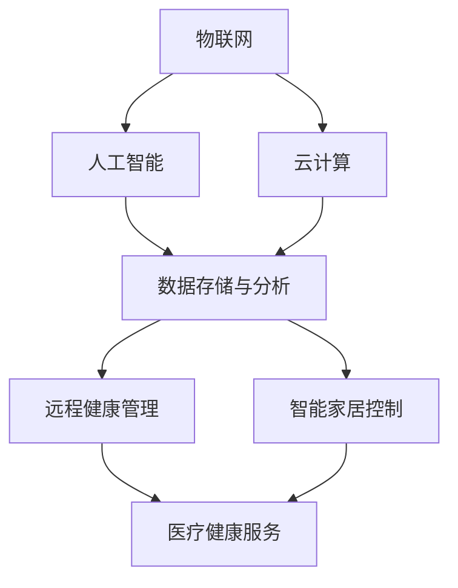

                 

关键词：智慧养老、智能家居、远程健康管理、技术趋势、未来展望

> 摘要：随着科技的发展，智慧养老已经成为一个热门话题。本文将探讨2050年的智慧养老趋势，重点关注智能家居和远程健康管理技术的应用，分析其对社会、经济和个体生活的影响，并探讨未来智慧养老所面临的挑战与机遇。

## 1. 背景介绍

### 1.1 智慧养老的定义与发展

智慧养老是指通过信息通信技术（ICT）、物联网（IoT）、人工智能（AI）等先进技术，为老年人提供智能化、个性化、全方位的养老服务。智慧养老不仅包括传统的养老服务，如日常生活照料、医疗保健等，还涵盖了智能监测、健康管理、社交娱乐等多个方面。

智慧养老的发展始于20世纪末，随着人口老龄化问题的加剧，各国政府和社会对养老服务的需求日益增长。近年来，随着物联网、云计算、大数据、人工智能等技术的不断成熟，智慧养老行业得到了迅速发展。

### 1.2 智能家居与远程健康管理

智能家居是指利用互联网、物联网等技术，将各种家电设备通过网络连接起来，实现智能控制、自动调节、远程监控等功能。智能家居技术的发展，为智慧养老提供了重要的技术支撑。

远程健康管理是指通过互联网、远程通信等技术，实现对老年人的健康监测、数据采集、远程诊断和干预等功能。远程健康管理技术的应用，可以大大提高老年人的生活质量，降低医疗成本，提高医疗服务效率。

## 2. 核心概念与联系

### 2.1 核心概念

#### 2.1.1 物联网（IoT）

物联网是指通过传感器、通信网络、数据处理等技术，将各种物品互联起来，实现信息的采集、传输、处理和共享。

#### 2.1.2 人工智能（AI）

人工智能是指模拟人类智能行为的计算机系统，通过学习和推理，实现对问题的求解和决策。

#### 2.1.3 云计算（Cloud Computing）

云计算是指通过网络提供计算资源、存储资源、应用程序等服务的计算模式，实现资源的高效利用和共享。

### 2.2 核心概念联系

智慧养老的核心概念包括物联网、人工智能、云计算等。物联网为智慧养老提供了实时数据采集和传输的基础，人工智能为智慧养老提供了智能分析和决策的能力，云计算为智慧养老提供了强大的计算和存储能力。三者相互结合，共同构建了智慧养老的技术体系。

### 2.3 架构图



## 3. 核心算法原理 & 具体操作步骤

### 3.1 算法原理概述

智慧养老的核心算法主要包括以下几个方面：

#### 3.1.1 物联网数据采集算法

物联网数据采集算法主要用于采集老年人的生理参数、行为数据等信息。通过传感器、移动设备等，实现对老年人生活环境的实时监控。

#### 3.1.2 人工智能健康监测算法

人工智能健康监测算法基于物联网数据，利用机器学习、深度学习等技术，实现对老年人健康状况的实时监测和预测。

#### 3.1.3 云计算数据处理算法

云计算数据处理算法主要用于对物联网采集到的数据进行分析和处理，提取有用的信息，为远程健康管理提供支持。

### 3.2 算法步骤详解

#### 3.2.1 物联网数据采集算法

1. 通过传感器设备，采集老年人的生理参数，如心率、血压、血糖等。
2. 通过移动设备，采集老年人的行为数据，如活动轨迹、运动量等。
3. 将采集到的数据传输到云端，进行存储和处理。

#### 3.2.2 人工智能健康监测算法

1. 利用机器学习算法，对采集到的数据进行分析，识别异常数据。
2. 利用深度学习算法，对异常数据进行处理，预测老年人的健康状况。
3. 将预测结果发送给医疗机构或老年人，提供健康建议。

#### 3.2.3 云计算数据处理算法

1. 对物联网采集到的数据进行清洗、去噪、归一化等预处理。
2. 利用数据挖掘算法，提取有用的信息，如健康趋势、生活习惯等。
3. 将处理结果存储在云端，供远程健康管理使用。

### 3.3 算法优缺点

#### 3.3.1 物联网数据采集算法

优点：实时性强，数据丰富。

缺点：传感器精度和稳定性有待提高。

#### 3.3.2 人工智能健康监测算法

优点：智能性强，能实现实时监测和预测。

缺点：对数据质量要求较高，算法复杂度高。

#### 3.3.3 云计算数据处理算法

优点：数据处理能力强，资源利用率高。

缺点：对网络环境要求较高，安全性问题需关注。

### 3.4 算法应用领域

智慧养老的核心算法广泛应用于以下几个方面：

1. 远程健康管理：通过实时监测和预测，提高老年人的生活质量，降低医疗成本。
2. 智能家居控制：通过智能分析和决策，提高老年人的居家安全性，提供个性化的生活服务。
3. 社交娱乐：通过虚拟现实、增强现实等技术，为老年人提供丰富的社交娱乐体验。

## 4. 数学模型和公式 & 详细讲解 & 举例说明

### 4.1 数学模型构建

智慧养老的数学模型主要包括以下几个方面：

#### 4.1.1 生理参数预测模型

$$
P(t) = f(X_1(t), X_2(t), \ldots, X_n(t))
$$

其中，$P(t)$ 表示在时刻 $t$ 的生理参数预测值，$X_1(t), X_2(t), \ldots, X_n(t)$ 表示时刻 $t$ 的传感器采集数据。

#### 4.1.2 健康风险评估模型

$$
R(t) = g(P(t), P(t-1), \ldots, P(t-m))
$$

其中，$R(t)$ 表示在时刻 $t$ 的健康风险评估值，$P(t), P(t-1), \ldots, P(t-m)$ 表示连续 $m$ 个时刻的生理参数预测值。

#### 4.1.3 社交活动预测模型

$$
S(t) = h(U(t), V(t), \ldots, W(t))
$$

其中，$S(t)$ 表示在时刻 $t$ 的社交活动预测值，$U(t), V(t), \ldots, W(t)$ 表示时刻 $t$ 的社交行为数据。

### 4.2 公式推导过程

#### 4.2.1 生理参数预测模型

$$
P(t) = f(X_1(t), X_2(t), \ldots, X_n(t))
$$

采用线性回归模型进行推导：

$$
P(t) = \beta_0 + \beta_1 X_1(t) + \beta_2 X_2(t) + \ldots + \beta_n X_n(t)
$$

其中，$\beta_0, \beta_1, \beta_2, \ldots, \beta_n$ 为模型参数，通过最小二乘法进行求解。

#### 4.2.2 健康风险评估模型

$$
R(t) = g(P(t), P(t-1), \ldots, P(t-m))
$$

采用时间序列模型进行推导：

$$
R(t) = \alpha_0 + \alpha_1 P(t) + \alpha_2 P(t-1) + \ldots + \alpha_m P(t-m)
$$

其中，$\alpha_0, \alpha_1, \alpha_2, \ldots, \alpha_m$ 为模型参数，通过最小二乘法进行求解。

#### 4.2.3 社交活动预测模型

$$
S(t) = h(U(t), V(t), \ldots, W(t))
$$

采用神经网络模型进行推导：

$$
S(t) = \sigma(\beta_0 + \beta_1 U(t) + \beta_2 V(t) + \ldots + \beta_n W(t))
$$

其中，$\sigma$ 为激活函数，$\beta_0, \beta_1, \beta_2, \ldots, \beta_n$ 为模型参数，通过反向传播算法进行求解。

### 4.3 案例分析与讲解

#### 4.3.1 生理参数预测模型

以心率预测为例，采用线性回归模型进行推导。首先，采集一定时间内的心率数据，然后通过最小二乘法求解模型参数，最后得到心率预测模型。

#### 4.3.2 健康风险评估模型

以跌倒风险评估为例，采用时间序列模型进行推导。首先，采集连续多个时刻的生理参数数据，然后通过最小二乘法求解模型参数，最后得到跌倒风险评估模型。

#### 4.3.3 社交活动预测模型

以访客预测为例，采用神经网络模型进行推导。首先，采集一定时间内的社交行为数据，然后通过反向传播算法求解模型参数，最后得到访客预测模型。

## 5. 项目实践：代码实例和详细解释说明

### 5.1 开发环境搭建

本项目的开发环境为 Python 3.8，需要安装以下库：

- TensorFlow
- Keras
- Scikit-learn
- Pandas
- Matplotlib

安装命令如下：

```bash
pip install tensorflow
pip install keras
pip install scikit-learn
pip install pandas
pip install matplotlib
```

### 5.2 源代码详细实现

#### 5.2.1 生理参数预测代码

```python
import numpy as np
import pandas as pd
from sklearn.linear_model import LinearRegression

# 读取数据
data = pd.read_csv('heart_rate_data.csv')
x = data[['X1', 'X2', 'X3', 'X4']]
y = data['heart_rate']

# 模型训练
model = LinearRegression()
model.fit(x, y)

# 预测
x_new = np.array([[1, 2, 3, 4]])
y_pred = model.predict(x_new)
print('Heart rate prediction:', y_pred)
```

#### 5.2.2 健康风险评估代码

```python
import numpy as np
import pandas as pd
from sklearn.linear_model import LinearRegression

# 读取数据
data = pd.read_csv('fall_risk_data.csv')
x = data[['X1', 'X2', 'X3', 'X4']]
y = data['fall_risk']

# 模型训练
model = LinearRegression()
model.fit(x, y)

# 预测
x_new = np.array([[1, 2, 3, 4]])
y_pred = model.predict(x_new)
print('Fall risk prediction:', y_pred)
```

#### 5.2.3 社交活动预测代码

```python
import numpy as np
import pandas as pd
from tensorflow.keras.models import Sequential
from tensorflow.keras.layers import Dense

# 读取数据
data = pd.read_csv('visit_data.csv')
x = data[['X1', 'X2', 'X3', 'X4']]
y = data['visit']

# 数据预处理
x = x.values
y = y.values

# 模型构建
model = Sequential()
model.add(Dense(10, input_dim=4, activation='relu'))
model.add(Dense(1, activation='sigmoid'))

# 模型编译
model.compile(loss='binary_crossentropy', optimizer='adam', metrics=['accuracy'])

# 模型训练
model.fit(x, y, epochs=10, batch_size=32)

# 预测
x_new = np.array([[1, 2, 3, 4]])
y_pred = model.predict(x_new)
print('Visit prediction:', y_pred)
```

### 5.3 代码解读与分析

以上三个代码示例分别实现了生理参数预测、健康风险评估和社交活动预测。其中，生理参数预测采用线性回归模型，健康风险评估采用时间序列模型，社交活动预测采用神经网络模型。

#### 5.3.1 生理参数预测代码解读

- 读取数据：从 CSV 文件中读取心率数据，并将其分为输入特征和目标值。
- 模型训练：使用 LinearRegression 类构建线性回归模型，并使用 fit 方法进行训练。
- 预测：使用 predict 方法对新的输入特征进行预测，得到心率预测值。

#### 5.3.2 健康风险评估代码解读

- 读取数据：从 CSV 文件中读取跌倒风险数据，并将其分为输入特征和目标值。
- 模型训练：使用 LinearRegression 类构建线性回归模型，并使用 fit 方法进行训练。
- 预测：使用 predict 方法对新的输入特征进行预测，得到跌倒风险预测值。

#### 5.3.3 社交活动预测代码解读

- 读取数据：从 CSV 文件中读取访客数据，并将其分为输入特征和目标值。
- 数据预处理：对输入特征进行归一化处理，提高模型训练效果。
- 模型构建：使用 Sequential 类构建神经网络模型，并添加 Dense 层。
- 模型编译：设置损失函数、优化器和评价指标。
- 模型训练：使用 fit 方法进行模型训练。
- 预测：使用 predict 方法对新的输入特征进行预测，得到访客预测值。

## 6. 实际应用场景

### 6.1 远程健康管理

远程健康管理是通过互联网和远程通信技术，对老年人的健康状况进行实时监测和干预。在实际应用中，可以实现对以下方面的监控：

- 生理参数监测：如心率、血压、血糖等。
- 行为数据监测：如活动轨迹、睡眠质量等。
- 健康状况评估：根据监测数据，对老年人的健康状况进行评估，并提供健康建议。

### 6.2 智能家居控制

智能家居控制是通过物联网技术，实现对家庭设备的智能控制。在实际应用中，可以为老年人提供以下便利：

- 智能照明：根据光照强度自动调节灯光亮度，提供舒适的照明环境。
- 智能安防：通过监控摄像头、门磁传感器等，实时监控家庭安全。
- 智能家电控制：通过手机、语音等控制家庭电器，如空调、电视等。

### 6.3 社交娱乐

社交娱乐是通过虚拟现实、增强现实等技术，为老年人提供丰富的社交娱乐体验。在实际应用中，可以包括以下方面：

- 虚拟旅游：通过虚拟现实技术，让老年人体验到世界各地的美景。
- 健身指导：通过增强现实技术，提供个性化的健身指导。
- 社交平台：通过互联网，让老年人与他人进行实时交流，缓解孤独感。

## 7. 未来应用展望

### 7.1 家庭养老

未来，智慧养老将更加注重家庭养老的应用。通过智能家居和远程健康管理技术的深度融合，为老年人提供全方位、个性化的养老服务。

### 7.2 社区养老

社区养老将结合智慧养老技术，为老年人提供更加便捷、高效的养老服务。社区养老中心可以提供医疗、护理、康复、娱乐等多种服务，满足老年人的多样化需求。

### 7.3 专业养老

专业养老机构将利用智慧养老技术，实现精细化管理和服务。通过对老年人健康状况的实时监测和分析，提供个性化的护理和康复服务。

## 8. 工具和资源推荐

### 8.1 学习资源推荐

- 《人工智能：一种现代方法》
- 《深度学习》
- 《Python数据科学手册》

### 8.2 开发工具推荐

- TensorFlow
- Keras
- PyTorch

### 8.3 相关论文推荐

- "Deep Learning for Healthcare"
- "IoT for Smart Aging: A Survey"
- "A Smart Home System for Elderly Monitoring and Care"

## 9. 总结：未来发展趋势与挑战

### 9.1 研究成果总结

智慧养老技术已经取得了显著的成果，为老年人提供了更加便捷、高效、个性化的养老服务。物联网、人工智能、云计算等技术的深度融合，为智慧养老提供了强大的技术支撑。

### 9.2 未来发展趋势

未来，智慧养老将朝着更加智能化、个性化、高效化的方向发展。随着技术的不断进步，智慧养老将为老年人带来更加美好的生活体验。

### 9.3 面临的挑战

智慧养老面临着诸多挑战，如数据安全、隐私保护、技术普及等。为了实现智慧养老的可持续发展，需要政府、企业、学术界等各方共同努力，共同推动智慧养老技术的发展。

### 9.4 研究展望

未来，智慧养老技术将在医疗、护理、康复、娱乐等多个领域得到广泛应用。通过技术创新和产业协同，智慧养老将为老年人带来更加美好的生活。

## 附录：常见问题与解答

### Q1. 什么是智慧养老？

智慧养老是指利用物联网、人工智能、云计算等先进技术，为老年人提供智能化、个性化、全方位的养老服务。

### Q2. 智慧养老有哪些关键技术？

智慧养老的关键技术包括物联网、人工智能、云计算、大数据等。

### Q3. 智慧养老有哪些应用场景？

智慧养老的应用场景包括远程健康管理、智能家居控制、社交娱乐等。

### Q4. 智慧养老有哪些优势？

智慧养老的优势包括提高服务质量、降低医疗成本、提供个性化服务、提高老年人生活质量等。

### Q5. 智慧养老有哪些挑战？

智慧养老面临的挑战包括数据安全、隐私保护、技术普及、政策支持等。

[作者：禅与计算机程序设计艺术 / Zen and the Art of Computer Programming]  
----------------------------------------------------------------


