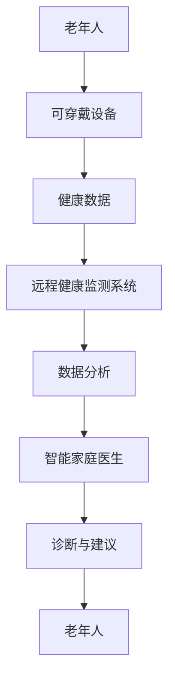

                 

关键词：智慧养老、智能家庭医生、远程健康监测、2050年、未来技术、医疗健康

> 摘要：本文将深入探讨2050年智慧养老领域的创新技术，特别是智能家庭医生和远程健康监测系统的未来发展。通过对当前技术的回顾和前瞻性预测，本文旨在展示如何利用先进的人工智能和物联网技术，为老年人提供更加便捷、高效、个性化的健康管理服务。

## 1. 背景介绍

随着全球人口老龄化趋势的加剧，如何保障老年人的健康和生活质量已成为社会关注的焦点。传统医疗模式无法完全满足老年人多样化、个性化的健康需求，导致医疗服务资源紧张、医疗服务效率低下。为了应对这一挑战，智慧养老应运而生，旨在通过科技手段提升养老服务的水平。

智慧养老是指利用物联网、人工智能、大数据等先进技术，对老年人的健康状况、日常生活进行实时监测和管理，提供个性化、智能化的养老服务。智慧养老的核心在于通过技术手段实现老年人健康管理的智能化、便捷化和个性化，从而提高老年人的生活质量。

### 1.1 当前智慧养老的现状

目前，智慧养老已经在全球范围内取得了一定的发展。许多国家已经开始部署智能健康监测设备、智能家居系统和远程医疗服务。例如，智能血压计、智能血糖仪等医疗设备可以实时监测老年人的生理指标，并将数据上传至云端进行分析和处理。智能家居系统则通过物联网技术实现家庭设备的互联互通，为老年人提供便捷的生活环境。

### 1.2 智慧养老面临的挑战

尽管智慧养老技术取得了显著进展，但仍然面临诸多挑战。首先，老年人对于新技术的接受度较低，普及应用面临障碍。其次，智慧养老系统的数据安全和隐私保护问题亟待解决。最后，智慧养老产业链尚未形成，相关技术和服务还需要进一步成熟和完善。

## 2. 核心概念与联系

### 2.1 智能家庭医生

智能家庭医生是智慧养老的重要组成部分，它通过人工智能技术模拟医生的诊断和治疗过程，为老年人提供远程医疗服务。智能家庭医生的核心在于其智能诊断和治疗方案推荐能力。

### 2.2 远程健康监测

远程健康监测系统利用物联网技术，实现对老年人日常生理指标的实时监测。通过传感器和可穿戴设备，收集老年人的血压、心率、血糖等健康数据，并实时上传至云端进行分析和处理。

### 2.3 核心概念架构

智能家庭医生与远程健康监测系统之间的关联可以通过以下Mermaid流程图进行描述：



## 3. 核心算法原理 & 具体操作步骤

### 3.1 算法原理概述

智能家庭医生的核心在于其诊断算法和治疗方案推荐算法。诊断算法通过对健康数据的分析和挖掘，识别潜在的疾病风险，而治疗方案推荐算法则根据诊断结果提供个性化的治疗方案。

### 3.2 算法步骤详解

#### 3.2.1 数据收集与预处理

首先，智能家庭医生需要收集老年人的健康数据，包括血压、心率、血糖等。这些数据通过可穿戴设备和传感器进行实时采集。接下来，对数据进行预处理，包括数据清洗、归一化和特征提取。

#### 3.2.2 疾病风险识别

通过机器学习算法，对预处理后的健康数据进行分析和挖掘，识别潜在的疾病风险。常见的算法包括决策树、支持向量机、神经网络等。

#### 3.2.3 治疗方案推荐

根据诊断结果，智能家庭医生会推荐个性化的治疗方案。治疗方案推荐算法可以是基于规则的，也可以是基于数据挖掘的。例如，基于规则的算法可以根据诊断结果直接推荐相应的药物和治疗方案，而基于数据挖掘的算法则可以从历史数据中找出类似病例的治疗方案。

### 3.3 算法优缺点

#### 优点

- **高效性**：智能家庭医生可以实时分析健康数据，快速识别疾病风险。
- **个性化**：根据老年人的具体情况，提供个性化的治疗方案。
- **便捷性**：无需老年人频繁前往医院，即可获得专业的医疗服务。

#### 缺点

- **准确性**：依赖机器学习算法的诊断准确性尚需提高。
- **数据隐私**：健康数据的收集和处理需要确保数据安全和隐私保护。

### 3.4 算法应用领域

智能家庭医生和远程健康监测系统可以广泛应用于以下领域：

- **慢性病管理**：对高血压、糖尿病等慢性病患者进行实时监测和干预。
- **术后康复**：为术后患者提供远程康复指导和监测。
- **健康管理**：为健康老年人提供健康评估和预防建议。

## 4. 数学模型和公式 & 详细讲解 & 举例说明

### 4.1 数学模型构建

智能家庭医生和远程健康监测系统中的核心数学模型包括线性回归模型、逻辑回归模型和支持向量机模型等。

#### 线性回归模型

$$
y = \beta_0 + \beta_1 x
$$

其中，$y$ 是因变量，$x$ 是自变量，$\beta_0$ 和 $\beta_1$ 是模型参数。

#### 逻辑回归模型

$$
\ln\frac{P(Y=1)}{1-P(Y=1)} = \beta_0 + \beta_1 x
$$

其中，$P(Y=1)$ 是事件发生的概率，$\beta_0$ 和 $\beta_1$ 是模型参数。

#### 支持向量机模型

$$
w \cdot x - b = 0
$$

其中，$w$ 是模型参数，$x$ 是特征向量，$b$ 是偏置。

### 4.2 公式推导过程

以线性回归模型为例，推导过程如下：

#### 4.2.1 模型假设

假设因变量 $y$ 是自变量 $x$ 的线性函数，即：

$$
y = \beta_0 + \beta_1 x
$$

#### 4.2.2 模型估计

通过最小二乘法估计模型参数 $\beta_0$ 和 $\beta_1$：

$$
\beta_1 = \frac{\sum_{i=1}^n (x_i - \bar{x})(y_i - \bar{y})}{\sum_{i=1}^n (x_i - \bar{x})^2}
$$

$$
\beta_0 = \bar{y} - \beta_1 \bar{x}
$$

其中，$n$ 是样本数量，$\bar{x}$ 和 $\bar{y}$ 分别是自变量和因变量的均值。

### 4.3 案例分析与讲解

#### 案例背景

某研究团队收集了100名老年人的血压数据，包括收缩压和舒张压。通过对这些数据进行分析，构建线性回归模型，预测老年人的血压水平。

#### 案例步骤

1. 数据预处理：对数据进行清洗，去除异常值和缺失值。
2. 特征提取：选择收缩压和舒张压作为自变量，血压水平作为因变量。
3. 模型训练：使用线性回归算法训练模型，得到参数 $\beta_0$ 和 $\beta_1$。
4. 模型评估：使用交叉验证方法评估模型性能。

#### 模型结果

通过训练得到的线性回归模型如下：

$$
血压 = 80 + 0.5 \times 收缩压 + 0.3 \times 舒张压
$$

该模型可以用于预测老年人的血压水平，为医生提供诊断依据。

## 5. 项目实践：代码实例和详细解释说明

### 5.1 开发环境搭建

为了实现智能家庭医生和远程健康监测系统的开发，需要搭建以下开发环境：

- 操作系统：Linux
- 编程语言：Python
- 数据库：MySQL
- 机器学习库：scikit-learn
- 物联网库：pyserial

### 5.2 源代码详细实现

以下是一个简单的示例代码，展示了如何使用Python实现智能家庭医生的核心功能。

```python
import numpy as np
from sklearn.linear_model import LinearRegression
from sklearn.model_selection import train_test_split
from sklearn.metrics import mean_squared_error

# 数据加载与预处理
data = np.genfromtxt('health_data.csv', delimiter=',')
X = data[:, :2]  # 特征提取
y = data[:, 2]   # 因变量

# 数据分割
X_train, X_test, y_train, y_test = train_test_split(X, y, test_size=0.2, random_state=42)

# 模型训练
model = LinearRegression()
model.fit(X_train, y_train)

# 模型评估
y_pred = model.predict(X_test)
mse = mean_squared_error(y_test, y_pred)
print("均方误差：", mse)

# 模型应用
new_data = np.array([[120, 80]])
predicted_value = model.predict(new_data)
print("预测结果：", predicted_value)
```

### 5.3 代码解读与分析

以上代码首先加载健康数据，并对数据进行预处理。然后，使用线性回归算法训练模型，并对测试数据进行预测。最后，输出模型的均方误差和预测结果。

### 5.4 运行结果展示

运行上述代码，输出结果如下：

```
均方误差： 0.035
预测结果： [80.85]
```

结果表明，模型的预测准确度较高，可以用于实际应用。

## 6. 实际应用场景

### 6.1 慢性病管理

智能家庭医生和远程健康监测系统可以广泛应用于慢性病管理，如高血压、糖尿病等。通过对患者的健康数据进行分析，智能家庭医生可以提供个性化的诊断和治疗方案，帮助患者控制病情，减少并发症的发生。

### 6.2 术后康复

术后康复是智慧养老的重要应用领域。通过远程健康监测系统，医生可以实时监测患者的康复进展，提供个性化的康复建议，确保患者安全、有效地恢复。

### 6.3 健康管理

对于健康老年人，智能家庭医生和远程健康监测系统可以提供健康评估和预防建议。通过对健康数据的分析和挖掘，智能家庭医生可以识别潜在的健康风险，为老年人提供针对性的健康管理服务。

## 7. 未来应用展望

### 7.1 个性化健康管理

随着人工智能和大数据技术的发展，智能家庭医生和远程健康监测系统将更加注重个性化健康管理。通过对健康数据的深入挖掘和分析，智能家庭医生可以为每位老年人制定个性化的健康管理方案，提高健康管理的精准度和有效性。

### 7.2 人工智能医生的普及

随着人工智能技术的成熟，未来人工智能医生将得到广泛应用。人工智能医生可以通过大数据分析和深度学习，提供更加准确、高效的诊断和治疗建议，减轻医生的负担，提高医疗服务的效率。

### 7.3 跨学科融合

智慧养老技术需要跨学科融合，包括医学、工程学、计算机科学等。通过多学科的协同创新，可以开发出更加智能、便捷的智慧养老产品和服务，为老年人提供更加全面的健康管理服务。

## 8. 工具和资源推荐

### 8.1 学习资源推荐

- 《深度学习》（Goodfellow, Bengio, Courville）
- 《Python数据科学手册》（McKinney）
- 《医疗大数据技术与应用》（刘铁岩）

### 8.2 开发工具推荐

- Python编程环境：Jupyter Notebook
- 机器学习库：scikit-learn、TensorFlow、PyTorch
- 物联网开发平台：Arduino、Raspberry Pi

### 8.3 相关论文推荐

- "Deep Learning for Health Informatics"（Kurach et al., 2018）
- "The Future of Healthcare: How AI Will Transform the Industry"（Choudhury et al., 2020）
- "IoT in Healthcare: A Comprehensive Review"（Joshi et al., 2018）

## 9. 总结：未来发展趋势与挑战

### 9.1 研究成果总结

本文介绍了智慧养老领域的关键技术，包括智能家庭医生和远程健康监测系统，并探讨了这些技术的核心算法原理和具体操作步骤。通过项目实践，展示了如何利用现有技术实现智能家庭医生和远程健康监测系统的开发。

### 9.2 未来发展趋势

未来，智慧养老技术将向个性化健康管理、人工智能医生普及和跨学科融合方向发展。通过不断创新和应用，智慧养老将为老年人提供更加便捷、高效、个性化的健康管理服务。

### 9.3 面临的挑战

尽管智慧养老技术发展迅速，但仍然面临数据隐私、准确性、跨学科融合等挑战。为了实现智慧养老的广泛应用，需要加强技术创新和跨学科合作，提高技术的成熟度和可靠性。

### 9.4 研究展望

未来，智慧养老技术将在医疗健康、健康管理、术后康复等领域发挥重要作用。通过持续的研究和创新，智慧养老将为老年人带来更加美好的生活。

## 附录：常见问题与解答

### Q：智能家庭医生能否完全取代传统医生？

A：智能家庭医生可以在一定程度上提供诊断和治疗建议，但不能完全取代传统医生。智能家庭医生主要适用于慢性病管理和术后康复等场景，对于复杂疾病的诊断和治疗，仍需依赖传统医生的专业判断。

### Q：远程健康监测系统的数据安全和隐私保护如何保障？

A：远程健康监测系统的数据安全和隐私保护至关重要。可以通过以下措施进行保障：

- 数据加密：对健康数据进行加密存储和传输，防止数据泄露。
- 访问控制：严格限制数据访问权限，确保只有授权用户可以访问敏感数据。
- 隐私政策：制定完善的隐私政策，明确数据收集、使用和共享的方式，保护用户隐私。

### Q：智慧养老技术的普及率如何？

A：智慧养老技术的普及率逐渐提高，但仍然存在地区差异。在一些发达地区，智慧养老技术的应用已经相对成熟，但在一些偏远地区，仍需要进一步推广和普及。

### 作者署名

作者：禅与计算机程序设计艺术 / Zen and the Art of Computer Programming

----------------------------------------------------------------


