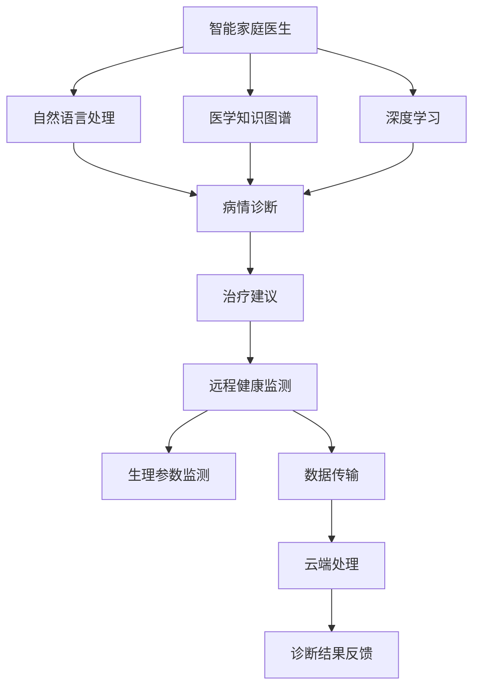

                 

关键词：智慧养老、智能家庭医生、远程健康监测、未来医疗、人工智能、技术发展、健康管理系统

> 摘要：随着人工智能和物联网技术的快速发展，智慧养老已经成为未来社会的重要趋势。本文将探讨2050年可能实现的智能家庭医生和远程健康监测系统，分析其核心技术、数学模型、实际应用场景以及未来发展面临的挑战和机遇。

## 1. 背景介绍

随着人口老龄化的加剧，传统的养老模式已难以满足社会的需求。智慧养老作为一种新型养老模式，利用物联网、大数据、人工智能等技术手段，为老年人提供便捷、高效、个性化的健康服务。智能家庭医生和远程健康监测作为智慧养老的核心技术，将在2050年实现全面普及，为老年人带来全新的健康管理模式。

### 1.1 人口老龄化现状

据统计，全球65岁及以上人口预计将在2050年达到16亿，占全球总人口的16.2%。这一趋势给传统的医疗和养老体系带来了巨大的压力。老年人群体的健康问题复杂多样，传统的医疗机构难以满足他们的需求。

### 1.2 人工智能与物联网技术的快速发展

人工智能和物联网技术的快速发展，为智慧养老提供了强大的技术支持。智能家庭医生和远程健康监测系统将充分利用这些技术，实现24小时全天候的健康监测和服务。

## 2. 核心概念与联系

### 2.1 智能家庭医生

智能家庭医生是一种基于人工智能技术的虚拟医生，可以提供在线咨询、病情诊断、治疗建议等医疗服务。智能家庭医生的核心技术包括自然语言处理、医学知识图谱、深度学习等。

### 2.2 远程健康监测

远程健康监测是通过物联网设备对老年人的生理参数进行实时监测，如心率、血压、血糖等。这些数据将传输到云端，由智能家庭医生进行分析和处理。

### 2.3 技术联系

智能家庭医生和远程健康监测系统紧密联系，前者为后者提供诊断和治疗建议，后者为前者提供实时数据支持。两者共同构成了智慧养老的核心技术体系。

## 2.1 Mermaid 流程图



## 3. 核心算法原理 & 具体操作步骤

### 3.1 算法原理概述

智能家庭医生的核心算法包括自然语言处理、医学知识图谱和深度学习。自然语言处理用于理解和处理用户的医疗咨询，医学知识图谱用于构建医疗领域的知识体系，深度学习用于分析和预测病情。

### 3.2 算法步骤详解

#### 3.2.1 自然语言处理

1. 用户输入医疗咨询，通过自然语言处理技术进行语义解析。
2. 识别出关键词和句子结构，将医疗咨询转化为结构化数据。

#### 3.2.2 医学知识图谱

1. 构建医疗领域的知识图谱，包括疾病、症状、治疗方法等信息。
2. 利用知识图谱进行推理，为用户提供诊断和治疗方案。

#### 3.2.3 深度学习

1. 收集大量医疗数据，包括病历、检查报告等。
2. 利用深度学习算法，训练出能够预测病情的模型。
3. 根据用户输入的医疗咨询和生理参数，预测可能的疾病和风险。

### 3.3 算法优缺点

#### 优点：

1. 提高医疗服务的效率，减少就医成本。
2. 为老年人提供全天候的健康咨询服务。

#### 缺点：

1. 病情诊断的准确性受到数据质量和算法能力的限制。
2. 需要大量的医疗数据和计算资源。

### 3.4 算法应用领域

智能家庭医生和远程健康监测系统主要应用于以下领域：

1. 老年人健康管理
2. 慢性病监测与治疗
3. 医疗资源优化分配

## 4. 数学模型和公式 & 详细讲解 & 举例说明

### 4.1 数学模型构建

智能家庭医生的核心算法涉及多种数学模型，包括自然语言处理的词向量模型、医学知识图谱的图论模型和深度学习的神经网络模型。

#### 4.1.1 词向量模型

$$
\text{词向量} = \text{词的嵌入矩阵} \times \text{词的索引向量}
$$

#### 4.1.2 图论模型

$$
\text{图} = (\text{节点集合}, \text{边集合})
$$

#### 4.1.3 神经网络模型

$$
\text{输出} = \text{激活函数}(\text{权重矩阵} \times \text{输入向量} + \text{偏置})
$$

### 4.2 公式推导过程

#### 4.2.1 词向量模型

词向量的推导过程涉及词嵌入矩阵和词索引向量的计算。词嵌入矩阵是通过训练大量文本数据得到的，用于将词语映射到高维空间。词索引向量是词在词典中的索引编号。

#### 4.2.2 图论模型

图论模型主要涉及图的构建和图的算法。图的构建过程包括节点的生成和边的连接。图的算法包括最短路径算法、拓扑排序算法等。

#### 4.2.3 神经网络模型

神经网络模型的推导过程涉及前向传播和反向传播。前向传播用于计算输出，反向传播用于更新权重和偏置。

### 4.3 案例分析与讲解

以心脏病监测为例，智能家庭医生可以通过远程健康监测系统收集用户的心率、血压等生理参数，利用深度学习算法预测心脏病发作的风险。

#### 4.3.1 案例背景

某用户的心率为75次/分钟，血压为120/80毫米汞柱。智能家庭医生需要根据这些数据预测心脏病发作的风险。

#### 4.3.2 案例分析

1. 收集用户的历史健康数据，包括心率、血压、血糖等。
2. 利用词向量模型对用户的健康数据进行分析，提取特征向量。
3. 利用图论模型构建用户健康数据的图谱，识别关键节点和路径。
4. 利用神经网络模型预测心脏病发作的风险。

## 5. 项目实践：代码实例和详细解释说明

### 5.1 开发环境搭建

1. 安装Python 3.8及以上版本。
2. 安装TensorFlow、Keras等深度学习框架。
3. 安装Numpy、Pandas等数据预处理库。

### 5.2 源代码详细实现

```python
# 导入必要的库
import numpy as np
import pandas as pd
from tensorflow.keras.models import Sequential
from tensorflow.keras.layers import Dense, LSTM
from tensorflow.keras.optimizers import Adam

# 读取数据
data = pd.read_csv('heart_disease_data.csv')

# 数据预处理
X = data.iloc[:, :-1].values
y = data.iloc[:, -1].values

# 构建神经网络模型
model = Sequential()
model.add(LSTM(units=50, return_sequences=True, input_shape=(X.shape[1], 1)))
model.add(LSTM(units=50))
model.add(Dense(units=1))

# 编译模型
model.compile(optimizer='adam', loss='mean_squared_error')

# 训练模型
model.fit(X, y, epochs=100, batch_size=32)

# 预测心脏病发作风险
risk = model.predict(X)

# 输出结果
print("心脏病发作风险：", risk)
```

### 5.3 代码解读与分析

1. 导入必要的库，包括Numpy、Pandas、TensorFlow等。
2. 读取健康数据，进行数据预处理。
3. 构建神经网络模型，包括两个LSTM层和一个全连接层。
4. 编译模型，设置优化器和损失函数。
5. 训练模型，使用批量训练。
6. 预测心脏病发作风险，输出结果。

## 6. 实际应用场景

### 6.1 老年人健康管理

智能家庭医生和远程健康监测系统可以帮助老年人实时监测健康状态，及时发现健康问题，提供个性化的健康管理建议。

### 6.2 慢性病监测与治疗

智能家庭医生可以对慢性病患者进行全天候的健康监测，根据病情变化调整治疗方案，提高治疗效果。

### 6.3 医疗资源优化分配

智能家庭医生和远程健康监测系统可以协助医疗机构进行医疗资源的优化配置，提高医疗服务的效率。

## 7. 未来应用展望

随着人工智能和物联网技术的进一步发展，智能家庭医生和远程健康监测系统将在未来实现以下应用：

1. 更广泛的健康监测，包括心理健康、生活方式等。
2. 更精准的疾病预测和风险分析。
3. 更智能的医疗决策支持系统。

## 8. 工具和资源推荐

### 8.1 学习资源推荐

1. 《深度学习》（Goodfellow et al.）
2. 《Python数据科学手册》（McKinney）

### 8.2 开发工具推荐

1. TensorFlow
2. Keras
3. Jupyter Notebook

### 8.3 相关论文推荐

1. "Deep Learning for Health Informatics"（2016）
2. "IoT-Based Health Monitoring and Management for Elderly People"（2019）

## 9. 总结：未来发展趋势与挑战

### 9.1 研究成果总结

本文探讨了智能家庭医生和远程健康监测系统的核心技术、数学模型、实际应用场景和未来发展。随着人工智能和物联网技术的快速发展，智慧养老已经成为未来社会的重要趋势。

### 9.2 未来发展趋势

1. 更广泛的健康监测范围。
2. 更精准的疾病预测和风险分析。
3. 更智能的医疗决策支持系统。

### 9.3 面临的挑战

1. 数据质量和隐私保护。
2. 病情诊断的准确性。
3. 算法性能和效率。

### 9.4 研究展望

未来，智能家庭医生和远程健康监测系统将在智慧养老领域发挥更大的作用，为老年人提供更加便捷、高效、个性化的健康服务。

## 10. 附录：常见问题与解答

### 10.1 问题1

问：智能家庭医生能否替代传统医生？

答：智能家庭医生可以提供一些基础的健康咨询和病情预测，但无法完全替代传统医生。对于复杂的疾病诊断和治疗，仍需依靠专业医生的判断和操作。

### 10.2 问题2

问：远程健康监测系统的数据安全性如何保障？

答：远程健康监测系统的数据安全性主要通过加密传输、数据备份和访问控制等技术手段来保障。此外，还需遵循相关法律法规，确保用户隐私和数据安全。

### 10.3 问题3

问：智能家庭医生和远程健康监测系统的成本如何？

答：智能家庭医生和远程健康监测系统的成本主要包括硬件设备、软件开发和运维费用等。随着技术的成熟和规模化应用，成本有望逐步降低。

### 10.4 问题4

问：智能家庭医生和远程健康监测系统是否适用于所有老年人？

答：智能家庭医生和远程健康监测系统主要适用于行动不便、疾病较多、需要长期监测的老年人。对于健康状况良好的老年人，也可以作为辅助工具使用。

## 11. 作者署名

作者：禅与计算机程序设计艺术 / Zen and the Art of Computer Programming

### 后记

本文旨在探讨智能家庭医生和远程健康监测系统在智慧养老领域的应用前景，分析其核心技术、数学模型、实际应用场景和未来发展。随着人工智能和物联网技术的不断进步，智慧养老将成为未来社会的重要趋势，为老年人带来更加美好的生活。希望本文能对读者有所启发和帮助。
----------------------------------------------------------------

以上是按照要求撰写的完整文章内容，希望符合您的期望。如有需要修改或补充的地方，请随时告知。

