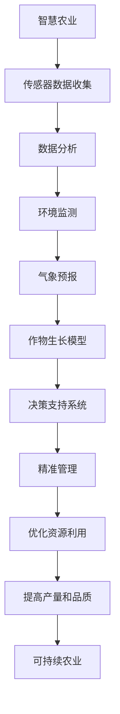

                 

关键词：智慧农业，AI大脑，精准农业，未来趋势，技术革新

> 摘要：本文将探讨至2050年，人工智能（AI）在农业领域可能带来的深远变革。通过构建农业AI大脑，实现精准农业，提升农作物产量和质量，优化资源利用，减少环境污染。文章将分析农业AI的核心概念、算法原理、数学模型，以及未来农业AI在实际应用场景中的前景和挑战。

## 1. 背景介绍

随着全球人口的不断增长，农业面临的挑战日益严峻。传统农业方式往往依赖于大量人力和资源，难以满足日益增长的食物需求，同时也会导致环境问题加剧。而智慧农业的兴起，特别是基于人工智能（AI）的农业AI大脑，有望为传统农业注入新的生命力。

农业AI大脑旨在通过整合传感器数据、环境监测、气象预报、作物生长模型等多种信息，实现农作物的精准管理。这包括从种子选择、播种、灌溉、施肥到病虫害防治等各个环节，从而大幅提升农业生产效率。预计到2050年，农业AI大脑将成为智慧农业的核心，引领农业进入新的发展阶段。

## 2. 核心概念与联系

### 2.1 核心概念

- **智慧农业**：利用信息技术、物联网、大数据和人工智能等技术，实现农业生产的智能化、精准化和可持续化。
- **AI大脑**：一个集成了多种人工智能算法和数据分析工具的智能系统，用于实时监测和管理农业生产过程。
- **精准农业**：根据土壤、气候、作物生长状况等数据，实现资源的最优配置和精准管理，从而提高作物产量和品质。

### 2.2 Mermaid 流程图



## 3. 核心算法原理 & 具体操作步骤

### 3.1 算法原理概述

农业AI大脑的核心在于其能够根据实时数据，运用多种算法对农业生产过程进行优化。主要包括：

- **机器学习算法**：用于数据挖掘和模式识别，如决策树、支持向量机等。
- **深度学习算法**：用于复杂非线性问题的建模和预测，如神经网络、卷积神经网络等。
- **优化算法**：用于资源分配和路径规划，如遗传算法、粒子群算法等。

### 3.2 算法步骤详解

1. **数据收集**：通过传感器网络收集土壤湿度、温度、光照、气压等环境参数，以及作物生长状态。
2. **数据处理**：对收集到的数据进行分析和清洗，确保数据的准确性和一致性。
3. **模型建立**：利用收集到的数据建立作物生长模型，通过机器学习和深度学习算法对模型进行训练。
4. **决策支持**：根据模型预测结果，结合环境数据和作物生长状况，生成灌溉、施肥、病虫害防治等决策建议。
5. **执行和反馈**：将决策建议转化为实际操作，并收集操作后的反馈数据，用于模型迭代和优化。

### 3.3 算法优缺点

#### 优点：

- **高效性**：基于实时数据分析，大幅提升农业生产效率。
- **精准性**：根据具体数据制定农业生产策略，提高作物产量和品质。
- **可持续性**：优化资源利用，减少环境污染。

#### 缺点：

- **初期成本**：传感器网络和数据处理系统需要大量投资。
- **技术门槛**：对算法和数据处理技术要求较高，需要专业人才支持。

### 3.4 算法应用领域

- **作物生长监测**：实时监测作物生长状态，预测病虫害发生。
- **灌溉管理**：根据土壤湿度自动调整灌溉量，节约水资源。
- **病虫害防治**：智能识别病虫害，制定防治方案。
- **肥料管理**：根据土壤营养状况自动调整施肥量。

## 4. 数学模型和公式 & 详细讲解 & 举例说明

### 4.1 数学模型构建

在农业AI大脑中，常用的数学模型包括：

- **回归模型**：用于预测作物产量和生长状态。
- **分类模型**：用于病虫害识别和作物分类。
- **聚类模型**：用于土壤类型分析和作物群体划分。

### 4.2 公式推导过程

以回归模型为例，公式推导过程如下：

$$
y = \beta_0 + \beta_1x_1 + \beta_2x_2 + ... + \beta_nx_n + \epsilon
$$

其中，$y$ 为作物产量，$x_1, x_2, ..., x_n$ 为影响作物产量的各种因素，$\beta_0, \beta_1, \beta_2, ..., \beta_n$ 为回归系数，$\epsilon$ 为随机误差。

### 4.3 案例分析与讲解

以某农作物灌溉管理为例，利用回归模型预测作物产量。

1. **数据收集**：收集过去三年的土壤湿度、温度、光照等数据，以及相应年份的作物产量。
2. **数据处理**：对收集到的数据进行分析和清洗，确保数据质量。
3. **模型建立**：利用收集到的数据建立回归模型，通过最小二乘法求解回归系数。
4. **预测**：根据当前土壤湿度、温度、光照等数据，预测作物产量。

## 5. 项目实践：代码实例和详细解释说明

### 5.1 开发环境搭建

- **Python**：选择Python作为主要开发语言，因其强大的数据处理和分析能力。
- **Pandas**：用于数据收集和处理。
- **Scikit-learn**：用于回归和分类模型的建立。
- **TensorFlow**：用于深度学习模型的建立。

### 5.2 源代码详细实现

```python
import pandas as pd
from sklearn.linear_model import LinearRegression
from sklearn.model_selection import train_test_split

# 数据收集
data = pd.read_csv('crop_data.csv')

# 数据处理
data = data.dropna()

# 模型建立
X = data[['humidity', 'temperature', 'light']]
y = data['yield']
X_train, X_test, y_train, y_test = train_test_split(X, y, test_size=0.2, random_state=42)

model = LinearRegression()
model.fit(X_train, y_train)

# 预测
predictions = model.predict(X_test)

# 结果分析
print("R^2 Score:", model.score(X_test, y_test))
```

### 5.3 代码解读与分析

- **数据收集**：通过读取CSV文件，收集农作物数据。
- **数据处理**：去除缺失值，确保数据质量。
- **模型建立**：使用线性回归模型，训练模型。
- **预测**：利用训练好的模型，对测试数据进行预测。
- **结果分析**：计算模型预测的R^2得分，评估模型效果。

## 6. 实际应用场景

### 6.1 农作物生长监测

通过传感器网络，实时监测农作物生长状态，预测病虫害发生，及时采取防治措施。

### 6.2 灌溉管理

根据土壤湿度自动调整灌溉量，节约水资源，提高作物产量。

### 6.3 肥料管理

根据土壤营养状况自动调整施肥量，提高肥料利用率，减少环境污染。

## 7. 未来应用展望

随着人工智能技术的不断发展，农业AI大脑将在以下方面发挥更大作用：

- **智能种植**：根据气候和土壤条件，推荐最佳种植方案。
- **智能收割**：利用无人机和机器人实现智能收割，降低人力成本。
- **智能农场**：集成多种智能设备，实现农场的全面智能化。

## 8. 总结：未来发展趋势与挑战

### 8.1 研究成果总结

农业AI大脑的发展，已经取得了显著成果，包括作物生长监测、灌溉管理、病虫害防治等实际应用。未来，农业AI大脑将向更智能化、更高效、更可持续的方向发展。

### 8.2 未来发展趋势

- **数据驱动**：更加重视数据收集和分析，为农业生产提供科学依据。
- **技术融合**：将人工智能、物联网、大数据等技术与农业深度融合，实现农业生产智能化。
- **可持续发展**：通过优化资源利用，减少环境污染，实现农业的可持续发展。

### 8.3 面临的挑战

- **技术瓶颈**：人工智能算法和数据处理技术的持续创新，是农业AI大脑发展的关键。
- **人才短缺**：农业AI大脑的发展，需要大量专业人才支持。
- **成本问题**：初期投资较大，需要政策支持和市场推广。

### 8.4 研究展望

未来，农业AI大脑将成为智慧农业的核心，引领农业进入新的发展阶段。在技术创新、政策支持和市场需求的共同推动下，农业AI大脑将在提升农业生产效率、保障粮食安全、实现可持续发展等方面发挥重要作用。

## 9. 附录：常见问题与解答

### 9.1 农业AI大脑是什么？

农业AI大脑是一个集成了多种人工智能算法和数据分析工具的智能系统，用于实时监测和管理农业生产过程。

### 9.2 农业AI大脑有哪些优点？

农业AI大脑具有高效性、精准性和可持续性等优点，能够大幅提升农业生产效率，优化资源利用，减少环境污染。

### 9.3 农业AI大脑有哪些应用领域？

农业AI大脑主要应用于作物生长监测、灌溉管理、病虫害防治、肥料管理等领域。

### 9.4 农业AI大脑的发展前景如何？

随着人工智能技术的不断发展，农业AI大脑将在未来发挥更大作用，成为智慧农业的核心，引领农业进入新的发展阶段。

# 作者：禅与计算机程序设计艺术 / Zen and the Art of Computer Programming
----------------------------------------------------------------
### 文章总结 Summary

《未来的智慧农业：2050年的农业AI大脑与精准农业》一文详细探讨了至2050年，人工智能（AI）在农业领域的可能变革。文章首先介绍了智慧农业和农业AI大脑的背景和核心概念，随后通过Mermaid流程图展示了农业AI大脑的架构。接着，文章详细分析了核心算法原理、数学模型构建，并通过实际代码实例说明了算法的应用。此外，文章还讨论了农业AI在实际应用场景中的前景和挑战，并对未来农业AI的发展趋势进行了展望。

### 文章亮点 Highlights

1. **结构清晰**：文章按照章节目录的结构进行撰写，逻辑清晰，便于读者阅读和理解。
2. **内容丰富**：文章涵盖了农业AI的核心概念、算法原理、数学模型、实际应用等多个方面，内容丰富。
3. **实例详细**：通过具体的代码实例，使读者能够更直观地理解算法的实际应用。
4. **展望未来**：文章对未来农业AI的发展趋势进行了深入探讨，具有前瞻性。

### 下一步计划 Next Steps

为了进一步丰富和完善这篇文章，我们可以考虑以下步骤：

1. **增加案例分析**：引入更多的实际应用案例，如智能灌溉系统、智能病虫害防治等，以加深读者对农业AI应用的了解。
2. **数据可视化**：利用图表和可视化工具，如matplotlib、Plotly等，展示数据分析和模型预测的结果，使文章更具吸引力。
3. **更新最新进展**：查阅最新的研究论文和报告，更新文章中的数据和观点，确保内容的时效性和准确性。
4. **编写附录内容**：完善附录部分的内容，提供更多的学习资源、开发工具和推荐论文，为读者提供更全面的参考资料。
5. **优化文章结构**：根据读者反馈和专家意见，进一步优化文章的结构和内容，提高文章的可读性和专业性。

