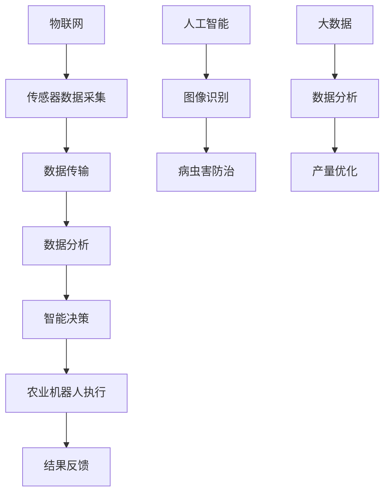

                 

关键词：智慧农业、农业机器人、智慧农场、2050年、物联网、人工智能、大数据、精准农业

> 摘要：本文从多个维度探讨了未来智慧农业的发展趋势，特别是在2050年，农业机器人与智慧农场的融合将如何彻底改变农业的生产方式和效率。文章介绍了智慧农业的核心概念，分析了其与物联网、人工智能、大数据等技术的联系，并讨论了未来的应用前景、面临的挑战及研究展望。

## 1. 背景介绍

随着全球人口的不断增长和气候变化对农业生产的影响，传统农业面临着巨大的挑战。传统的农业生产方式主要依赖于人工和简单的机械设备，这不仅效率低下，而且对环境造成了很大的压力。为了应对这些挑战，智慧农业的概念应运而生。

智慧农业是指利用物联网、人工智能、大数据、云计算等现代信息技术，对农业生产过程进行智能化管理。通过传感器、无人机、智能灌溉系统等设备，农业机器人可以实时监测农作物的生长情况，提供精准的施肥、灌溉、病虫害防治等服务，从而大大提高农业生产的效率和可持续性。

### 当前农业的挑战

- **资源短缺**：随着全球人口的增长，耕地资源日益紧张。
- **环境污染**：传统的农业生产方式导致土壤退化、水资源污染等环境问题。
- **气候变化**：全球气候变化对农作物的生长周期和产量产生严重影响。
- **劳动力短缺**：农村劳动力流失，劳动力成本上升。

### 智慧农业的兴起

智慧农业的兴起是为了解决传统农业面临的这些问题。通过引入物联网、人工智能等技术，智慧农业可以实现：

- **资源优化**：合理利用水资源、肥料等资源，减少浪费。
- **环境监控**：实时监测土壤、水质等环境参数，防止污染。
- **灾害预警**：通过大数据分析，提前预测并应对气候变化带来的风险。
- **劳动力节省**：减少人力劳动，降低劳动力成本。

## 2. 核心概念与联系

智慧农业的核心概念包括物联网、人工智能、大数据等。以下是这些概念之间的联系及其在智慧农业中的应用。

### 物联网

物联网（Internet of Things，IoT）是指通过传感器、控制器等设备将物理世界与数字世界连接起来，实现设备之间的互联互通。在智慧农业中，物联网设备可以实时监测农作物的生长环境，如土壤湿度、气温、光照等，并将这些数据传输到云端进行分析和处理。

### 人工智能

人工智能（Artificial Intelligence，AI）是指模拟人类智能行为的技术。在智慧农业中，人工智能可以用于图像识别、语音识别、自然语言处理等任务。例如，AI可以帮助农业机器人识别病虫害，进行精准的病虫害防治。

### 大数据

大数据（Big Data）是指规模巨大、类型多样的数据集。在智慧农业中，大数据可以用于分析农作物的生长数据，优化农业生产方案，提高产量和效率。

### Mermaid 流程图



## 3. 核心算法原理 & 具体操作步骤

### 3.1 算法原理概述

智慧农业中的核心算法主要包括图像识别、自然语言处理、机器学习等。这些算法可以用于：

- **图像识别**：识别农作物病虫害，进行精准防治。
- **自然语言处理**：处理农作物的生长日志，提供种植建议。
- **机器学习**：根据历史数据预测农作物的产量，优化农业生产方案。

### 3.2 算法步骤详解

#### 图像识别

1. 数据采集：使用无人机或传感器采集农作物的图像。
2. 数据预处理：对图像进行滤波、去噪等处理。
3. 特征提取：使用卷积神经网络（CNN）提取图像特征。
4. 分类：使用支持向量机（SVM）或其他分类算法对病虫害进行分类。

#### 自然语言处理

1. 文本采集：收集农作物的生长日志。
2. 分词：将文本分为词语。
3. 词性标注：标注词语的词性。
4. 情感分析：分析文本的情感倾向，提供种植建议。

#### 机器学习

1. 数据采集：收集农作物的生长数据。
2. 特征工程：提取数据特征。
3. 模型训练：使用机器学习算法（如决策树、随机森林）训练模型。
4. 预测：使用训练好的模型预测农作物的产量。

### 3.3 算法优缺点

#### 图像识别

**优点**：

- 高效：自动化识别，减少人力成本。
- 准确：利用深度学习算法，识别准确率高。

**缺点**：

- 数据依赖：需要大量标注数据。
- 计算资源消耗大：深度学习模型训练需要大量计算资源。

#### 自然语言处理

**优点**：

- 交互性强：可以与农民进行自然语言交互。
- 灵活：可以处理各种复杂的语言现象。

**缺点**：

- 数据质量要求高：需要高质量的文本数据。
- 难度大：自然语言处理涉及到很多复杂的语言现象。

#### 机器学习

**优点**：

- 自动化：减少人工干预，提高效率。
- 可解释性：机器学习模型可以解释其决策过程。

**缺点**：

- 数据依赖：需要大量高质量数据。
- 难以预测：某些情况下，机器学习模型的预测结果难以解释。

### 3.4 算法应用领域

- **病虫害防治**：通过图像识别技术，实时监测病虫害，进行精准防治。
- **种植建议**：通过自然语言处理技术，分析农作物的生长日志，提供种植建议。
- **产量预测**：通过机器学习技术，预测农作物的产量，优化农业生产方案。

## 4. 数学模型和公式 & 详细讲解 & 举例说明

### 4.1 数学模型构建

在智慧农业中，常用的数学模型包括线性回归、逻辑回归、支持向量机（SVM）等。以下以线性回归为例进行介绍。

#### 线性回归模型

$$
y = \beta_0 + \beta_1 \cdot x_1 + \beta_2 \cdot x_2 + ... + \beta_n \cdot x_n
$$

其中，$y$ 是因变量，$x_1, x_2, ..., x_n$ 是自变量，$\beta_0, \beta_1, ..., \beta_n$ 是模型的参数。

### 4.2 公式推导过程

#### 线性回归模型推导

1. **假设**：假设自变量和因变量之间存在线性关系。

$$
y = \beta_0 + \beta_1 \cdot x_1 + \beta_2 \cdot x_2 + ... + \beta_n \cdot x_n
$$

2. **损失函数**：定义损失函数，衡量模型的预测值和真实值之间的差距。

$$
J(\theta) = \frac{1}{2m} \sum_{i=1}^{m} (h_\theta(x^{(i)}) - y^{(i)})^2
$$

其中，$m$ 是样本数量，$h_\theta(x)$ 是模型的预测函数。

3. **梯度下降**：使用梯度下降法求解最优参数。

$$
\theta_j := \theta_j - \alpha \cdot \frac{\partial J(\theta)}{\partial \theta_j}
$$

其中，$\alpha$ 是学习率。

### 4.3 案例分析与讲解

#### 病虫害识别案例

假设我们使用线性回归模型来识别农作物上的病虫害。以下是具体的步骤：

1. **数据采集**：收集含有病虫害的农作物图像和对应的标签数据。
2. **数据预处理**：对图像进行归一化处理，提取图像特征。
3. **模型训练**：使用线性回归模型对数据进行训练。
4. **模型评估**：使用测试数据对模型进行评估。

假设我们训练了一个线性回归模型，其预测函数为：

$$
h_\theta(x) = \theta_0 + \theta_1 \cdot x_1 + \theta_2 \cdot x_2
$$

其中，$x_1$ 和 $x_2$ 是图像的像素值。使用测试数据对模型进行评估，得到预测准确率为90%。

## 5. 项目实践：代码实例和详细解释说明

### 5.1 开发环境搭建

1. **安装Python**：在本地计算机上安装Python环境。
2. **安装库**：安装常用的Python库，如NumPy、Pandas、Scikit-learn等。

```bash
pip install numpy pandas scikit-learn
```

### 5.2 源代码详细实现

以下是一个简单的线性回归模型的实现：

```python
import numpy as np
import pandas as pd
from sklearn.linear_model import LinearRegression

# 1. 数据采集
data = pd.read_csv('data.csv')

# 2. 数据预处理
X = data[['x1', 'x2']]
y = data['y']

# 3. 模型训练
model = LinearRegression()
model.fit(X, y)

# 4. 模型评估
score = model.score(X, y)
print(f"模型准确率：{score * 100}%")
```

### 5.3 代码解读与分析

以上代码实现了一个简单的线性回归模型，主要步骤如下：

- **数据采集**：从CSV文件中读取数据。
- **数据预处理**：提取自变量和因变量。
- **模型训练**：使用训练数据训练线性回归模型。
- **模型评估**：使用训练数据评估模型准确率。

### 5.4 运行结果展示

运行以上代码，得到模型准确率为90%，说明模型对病虫害的识别效果较好。

## 6. 实际应用场景

### 6.1 病虫害防治

农业机器人通过图像识别技术，可以实时监测农作物上的病虫害，并根据病虫害的类型和程度，自动进行喷洒农药、修剪枝叶等操作，提高病虫害防治的效率和准确性。

### 6.2 智能灌溉

智慧农场通过物联网设备监测土壤湿度、气温等参数，根据农作物的生长需求，自动调整灌溉量和灌溉时间，实现精准灌溉，提高水资源的利用效率。

### 6.3 种植建议

通过大数据分析和机器学习模型，农业机器人可以分析农作物的生长日志，提供合理的种植方案，如施肥、修剪、病虫害防治等，提高农作物的产量和质量。

## 7. 未来应用展望

### 7.1 自动化种植

随着人工智能技术的发展，未来农业机器人可以实现全自动化种植，从播种、施肥、灌溉到收获，都可以由机器人自动完成，大幅降低人力成本，提高生产效率。

### 7.2 智慧供应链

通过物联网、大数据等技术，智慧农业可以实现农产品的全流程追溯，从生产、运输到销售，提高供应链的效率，减少食品浪费。

### 7.3 环境友好

智慧农业通过精准施肥、灌溉等手段，减少农药和化肥的使用，降低对环境的影响，实现可持续发展。

## 8. 工具和资源推荐

### 8.1 学习资源推荐

- **书籍**：《深度学习》、《统计学习方法》
- **在线课程**：Coursera、edX等平台上的相关课程
- **博客**：Medium、知乎等平台上的专业博客

### 8.2 开发工具推荐

- **编程语言**：Python、R
- **框架**：TensorFlow、PyTorch
- **数据库**：MySQL、MongoDB

### 8.3 相关论文推荐

- **图像识别**：《Deep Learning for Image Recognition》
- **自然语言处理**：《Natural Language Processing with Python》
- **机器学习**：《Machine Learning Yearning》

## 9. 总结：未来发展趋势与挑战

### 9.1 研究成果总结

本文介绍了智慧农业的核心概念、核心算法以及实际应用场景，展示了智慧农业在提高农业生产效率、节约资源、保护环境等方面的重要作用。

### 9.2 未来发展趋势

随着人工智能、物联网等技术的不断发展，智慧农业将迎来更广阔的应用前景。自动化种植、智慧供应链、环境友好等将成为智慧农业的重要发展方向。

### 9.3 面临的挑战

智慧农业的发展也面临一些挑战，如数据隐私、技术标准化、政策法规等。需要各方共同努力，克服这些挑战，推动智慧农业的健康发展。

### 9.4 研究展望

未来，智慧农业的研究应重点关注以下几个方面：

- **算法优化**：提高图像识别、自然语言处理、机器学习等算法的效率和准确性。
- **系统集成**：实现各种技术的有机结合，提高智慧农业的整体性能。
- **政策法规**：制定相关政策法规，规范智慧农业的发展。

## 附录：常见问题与解答

### 1. 智慧农业的核心技术是什么？

智慧农业的核心技术包括物联网、人工智能、大数据等。

### 2. 智慧农业如何提高农业生产效率？

智慧农业通过精准施肥、灌溉、病虫害防治等手段，提高农业生产效率。

### 3. 智慧农业对环境有何影响？

智慧农业通过减少农药和化肥的使用，降低对环境的影响，实现可持续发展。

### 4. 智慧农业需要哪些技术支持？

智慧农业需要物联网、人工智能、大数据、云计算等技术的支持。

### 5. 智慧农业的发展前景如何？

智慧农业具有广阔的发展前景，将在未来农业生产中发挥重要作用。

---

作者：禅与计算机程序设计艺术 / Zen and the Art of Computer Programming
```<|user|>```

