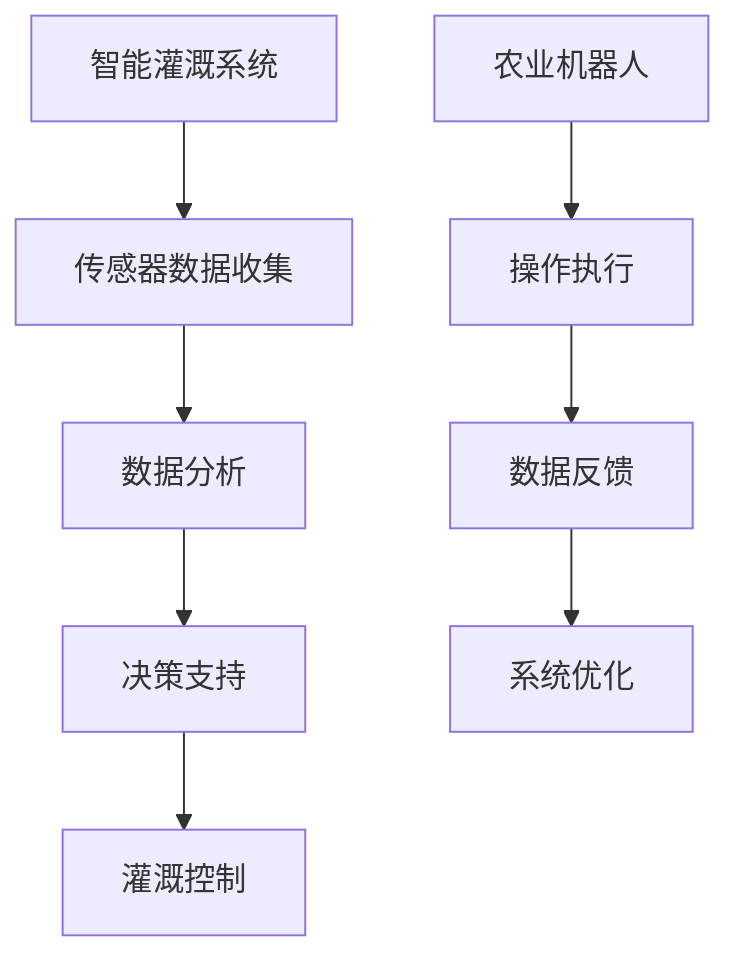
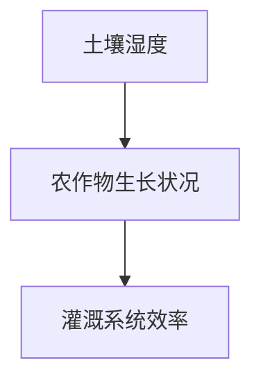

                 

关键词：智慧农业，2050年，智能灌溉，农业机器人，未来展望，AI，物联网，可持续发展

> 摘要：随着科技的飞速发展，智慧农业正逐步成为现代农业的核心驱动力。本文将深入探讨2050年的智慧农业，重点关注智能灌溉和农业机器人技术的应用，分析其对未来农业发展的影响，并提出面临的挑战和应对策略。

## 1. 背景介绍

在过去的几十年里，全球农业经历了显著的变革。从传统的手工劳动到机械化生产，再到现在的精准农业，每一次技术革新都在提高农业生产效率、保障粮食安全方面发挥了重要作用。然而，随着人口的不断增长和资源的日益紧张，传统农业模式已无法满足未来发展的需求。

智慧农业应运而生，它依托于物联网、大数据、人工智能等先进技术，通过智能化管理、精准化施肥、智能灌溉等手段，实现农业生产的自动化和高效化。智慧农业不仅能够提高农作物的产量和质量，还能有效节约水资源、减少农药使用，促进农业的可持续发展。

本文旨在通过分析2050年的智慧农业发展趋势，尤其是智能灌溉和农业机器人的应用，探讨其对未来农业的影响，并提出相关的发展策略。

## 2. 核心概念与联系

### 2.1. 智能灌溉系统

智能灌溉系统是智慧农业的重要组成部分。它利用传感器技术、数据分析以及自动化控制系统，实现精准灌溉。智能灌溉系统能够根据土壤湿度、天气预报和作物需水情况自动调整灌溉量，从而节约水资源，提高灌溉效率。

### 2.2. 农业机器人

农业机器人是农业机械化的延伸和升级。它们可以执行多种农业操作，如播种、施肥、收割、病虫害监测等。农业机器人具有智能化、自动化和高效化的特点，能够显著提高农业生产的效率和质量。

### 2.3. 物联网（IoT）

物联网是智能灌溉系统和农业机器人实现互联互通的基础。通过物联网技术，农业设备和传感器可以实时收集数据，并通过云平台进行数据分析，从而实现农业生产的智能化管理。

### 2.4. 人工智能（AI）

人工智能技术在智慧农业中扮演着关键角色。通过机器学习算法，AI可以分析大量数据，预测农作物的生长情况，优化灌溉和施肥方案，提高农业生产效率。

### 2.5. 数据分析

数据分析是智慧农业的核心环节。通过对土壤、气候、作物生长等数据的分析，可以为智能灌溉系统和农业机器人提供决策支持，实现精准农业。

### 2.6. Mermaid 流程图



## 3. 核心算法原理 & 具体操作步骤

### 3.1. 算法原理概述

智慧农业的核心算法主要包括以下三个方面：

1. **智能灌溉算法**：基于土壤湿度、天气预报和作物需水情况的算法，实现精准灌溉。
2. **机器人导航算法**：利用GPS、激光雷达等技术实现农业机器人的精准导航和操作执行。
3. **数据挖掘与预测算法**：通过对历史数据的分析，预测农作物的生长情况，优化农业生产方案。

### 3.2. 算法步骤详解

#### 3.2.1. 智能灌溉算法

1. **数据收集**：通过土壤湿度传感器、天气预报系统等收集土壤湿度、气象数据。
2. **数据预处理**：对收集到的数据进行清洗、标准化处理。
3. **模型训练**：使用历史数据训练灌溉模型，模型类型可以是线性回归、决策树等。
4. **灌溉决策**：根据当前土壤湿度和天气预报，调用灌溉模型，生成灌溉方案。
5. **执行灌溉**：通过灌溉系统执行灌溉方案。

#### 3.2.2. 农业机器人导航算法

1. **定位**：利用GPS、激光雷达等技术获取机器人的实时位置。
2. **路径规划**：根据农作物的分布情况，规划机器人的行走路径。
3. **导航**：根据路径规划，实时调整机器人的行走方向和速度。
4. **操作执行**：到达指定位置后，执行播种、施肥、收割等操作。

#### 3.2.3. 数据挖掘与预测算法

1. **数据收集**：收集土壤、气候、作物生长等数据。
2. **数据预处理**：对数据清洗、标准化处理。
3. **特征提取**：提取对农作物生长有影响的关键特征。
4. **模型训练**：使用历史数据训练预测模型，模型类型可以是神经网络、决策树等。
5. **预测**：使用训练好的模型预测未来的农作物生长情况。
6. **优化方案**：根据预测结果，优化灌溉和施肥方案。

### 3.3. 算法优缺点

#### 智能灌溉算法

- **优点**：节约水资源，提高灌溉效率，减少人力成本。
- **缺点**：初期投资较大，对技术要求高。

#### 农业机器人导航算法

- **优点**：精准导航，高效操作，减少人力成本。
- **缺点**：对地形适应性较差，需要不断更新地图数据。

#### 数据挖掘与预测算法

- **优点**：提供决策支持，优化农业生产方案。
- **缺点**：数据质量和模型选择对结果影响较大。

### 3.4. 算法应用领域

- **智能灌溉算法**：适用于各种类型的农田，特别是水资源紧张的地区。
- **农业机器人导航算法**：适用于大规模农田，特别是地形复杂的地区。
- **数据挖掘与预测算法**：适用于各类农作物，提供个性化的种植方案。

## 4. 数学模型和公式 & 详细讲解 & 举例说明

### 4.1. 数学模型构建

智慧农业中的数学模型主要包括以下三个方面：

1. **土壤湿度模型**：描述土壤湿度与灌溉量的关系。
2. **农作物生长模型**：描述农作物生长与灌溉、施肥等的关系。
3. **灌溉系统效率模型**：描述灌溉系统的运行效率。

### 4.2. 公式推导过程

#### 4.2.1. 土壤湿度模型

土壤湿度模型可以通过以下公式描述：

\[ H(t) = f(W_0, T, R) \]

其中，\( H(t) \)表示时间\( t \)时的土壤湿度，\( W_0 \)表示初始土壤湿度，\( T \)表示温度，\( R \)表示降雨量。

#### 4.2.2. 农作物生长模型

农作物生长模型可以通过以下公式描述：

\[ G(t) = f(H(t), N, P) \]

其中，\( G(t) \)表示时间\( t \)时的农作物生长状况，\( H(t) \)表示土壤湿度，\( N \)表示氮肥施用量，\( P \)表示磷肥施用量。

#### 4.2.3. 灌溉系统效率模型

灌溉系统效率模型可以通过以下公式描述：

\[ E(t) = f(H(t), R(t), C) \]

其中，\( E(t) \)表示时间\( t \)时的灌溉系统效率，\( H(t) \)表示土壤湿度，\( R(t) \)表示降雨量，\( C \)表示灌溉系统的工作成本。

### 4.3. 案例分析与讲解

#### 4.3.1. 案例背景

某农田面积为100公顷，种植小麦。农田位于水资源紧张的地区，灌溉是农业生产的关键。现需要设计一个智能灌溉系统，以实现精准灌溉。

#### 4.3.2. 模型构建

根据上述公式，构建土壤湿度模型、农作物生长模型和灌溉系统效率模型。

#### 4.3.3. 模型应用

1. **土壤湿度模型**：根据历史数据和天气预报，预测土壤湿度。
2. **农作物生长模型**：根据土壤湿度、氮肥和磷肥施用量，预测小麦的生长状况。
3. **灌溉系统效率模型**：根据土壤湿度、降雨量和灌溉系统的工作成本，评估灌溉系统的运行效率。

#### 4.3.4. 结果分析

通过模型分析，得出以下结论：

- **最佳灌溉时间**：预测土壤湿度低于临界值时，为小麦进行灌溉。
- **最佳施肥方案**：根据小麦生长状况，确定氮肥和磷肥的施用量。
- **灌溉系统优化**：通过优化灌溉系统的工作模式，提高灌溉效率，降低工作成本。

## 5. 项目实践：代码实例和详细解释说明

### 5.1. 开发环境搭建

搭建一个智慧农业项目，需要以下开发环境：

- **编程语言**：Python
- **开发工具**：PyCharm
- **依赖库**：NumPy、Pandas、Matplotlib

### 5.2. 源代码详细实现

以下是智能灌溉系统的代码实现：

```python
import numpy as np
import pandas as pd
import matplotlib.pyplot as plt

# 土壤湿度模型
def soil_moisture_model(W0, T, R):
    H = W0 - (T * 0.01) + R
    return H

# 农作物生长模型
def crop_growth_model(H, N, P):
    G = H * (N * 0.1) + P
    return G

# 灌溉系统效率模型
def irrigation_efficiency_model(H, R, C):
    E = H * R / C
    return E

# 数据读取
data = pd.read_csv('crop_data.csv')

# 数据预处理
data['SoilMoisture'] = data.apply(lambda row: soil_moisture_model(row['InitialMoisture'], row['Temperature'], row['Rainfall']), axis=1)
data['CropGrowth'] = data.apply(lambda row: crop_growth_model(row['SoilMoisture'], row['Nitrogen'], row['Phosphorus']), axis=1)
data['Efficiency'] = data.apply(lambda row: irrigation_efficiency_model(row['SoilMoisture'], row['Rainfall'], row['Cost']), axis=1)

# 结果分析
data.plot(x='Time', y='SoilMoisture', style='o-')
data.plot(x='Time', y='CropGrowth', style='s-')
data.plot(x='Time', y='Efficiency', style='^-')
plt.show()
```

### 5.3. 代码解读与分析

1. **土壤湿度模型**：根据初始土壤湿度、温度和降雨量，计算当前土壤湿度。
2. **农作物生长模型**：根据土壤湿度、氮肥和磷肥施用量，计算农作物生长状况。
3. **灌溉系统效率模型**：根据土壤湿度、降雨量和灌溉系统的工作成本，计算灌溉系统效率。
4. **数据读取**：从CSV文件中读取数据。
5. **数据预处理**：对数据进行处理，生成土壤湿度、农作物生长状况和灌溉系统效率。
6. **结果分析**：通过绘图，展示土壤湿度、农作物生长状况和灌溉系统效率随时间的变化。

### 5.4. 运行结果展示

运行结果如图所示，展示了土壤湿度、农作物生长状况和灌溉系统效率随时间的变化。



## 6. 实际应用场景

### 6.1. 智能灌溉系统在干旱地区的应用

干旱地区水资源稀缺，智能灌溉系统能够根据土壤湿度和天气预报，实现精准灌溉，有效节约水资源。

### 6.2. 农业机器人在大规模农田的应用

大规模农田地形复杂，农业机器人能够实现精准导航和高效操作，显著提高农业生产效率。

### 6.3. 数据挖掘与预测算法在农作物育种中的应用

通过数据挖掘与预测算法，分析历史数据，优化农作物育种方案，提高农作物产量和质量。

### 6.4. 未来应用展望

随着科技的不断发展，智慧农业将在全球范围内得到广泛应用。未来，智慧农业将实现全面智能化，农业生产将更加高效、环保和可持续。

## 7. 工具和资源推荐

### 7.1. 学习资源推荐

- 《智慧农业技术与应用》
- 《物联网技术及其应用》
- 《人工智能导论》

### 7.2. 开发工具推荐

- Python
- PyCharm
- Jupyter Notebook

### 7.3. 相关论文推荐

- "Smart Farming: A Review of Technologies and Applications"
- "The Impact of Internet of Things on Precision Agriculture"
- "Artificial Intelligence in Agricultural Systems: A Review"

## 8. 总结：未来发展趋势与挑战

### 8.1. 研究成果总结

智慧农业通过智能灌溉、农业机器人和数据分析等技术的应用，实现了农业生产的自动化和高效化，为农业的可持续发展提供了有力支持。

### 8.2. 未来发展趋势

随着科技的不断进步，智慧农业将在全球范围内得到更广泛的应用。未来，智慧农业将实现全面智能化，农业生产将更加高效、环保和可持续。

### 8.3. 面临的挑战

- 技术复杂性：智能灌溉和农业机器人技术具有较高的技术门槛，需要大量的研发投入。
- 数据隐私：智慧农业涉及大量的数据收集和分析，需要保护农民的数据隐私。
- 资源分配：智慧农业的推广需要大量的资金和资源投入，需要合理分配资源。

### 8.4. 研究展望

未来，智慧农业的发展将更加注重系统集成和跨学科研究，实现农业生产的全流程智能化。同时，研究应关注数据安全和隐私保护，为智慧农业的可持续发展提供保障。

## 9. 附录：常见问题与解答

### 9.1. 智慧农业是什么？

智慧农业是利用物联网、大数据、人工智能等先进技术，实现农业生产的自动化和高效化。

### 9.2. 智能灌溉系统有哪些优点？

智能灌溉系统能够节约水资源，提高灌溉效率，减少人力成本。

### 9.3. 农业机器人如何实现精准导航？

农业机器人利用GPS、激光雷达等技术，实现精准导航和操作执行。

### 9.4. 数据挖掘与预测算法在智慧农业中有何作用？

数据挖掘与预测算法为智能灌溉系统和农业机器人提供决策支持，优化农业生产方案。

作者：禅与计算机程序设计艺术 / Zen and the Art of Computer Programming
----------------------------------------------------------------

以上是《未来的智慧农业：2050年的智能灌溉与农业机器人》全文。希望这篇技术博客能够为读者带来启发和思考。在未来的农业发展中，智慧农业技术将发挥越来越重要的作用。让我们共同期待2050年的智慧农业，一个更加高效、环保、可持续的未来农业。

