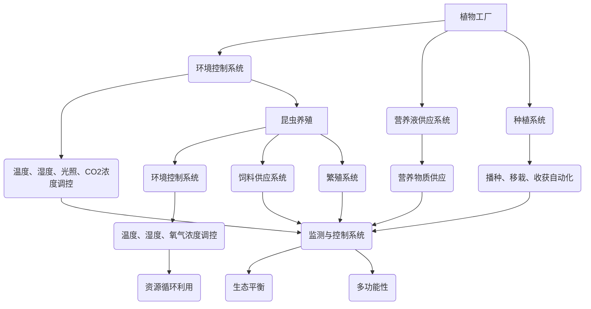

                 

关键词：智慧农业、植物工厂、昆虫养殖、未来趋势、可持续农业、AI技术

摘要：随着全球人口的增长和气候变化带来的挑战，传统的农业模式正面临着前所未有的压力。本文探讨了到2050年，利用人工智能和先进技术实现的智慧农业——植物工厂与昆虫养殖的未来场景。通过分析其核心概念、算法原理、数学模型、应用实践，以及面临的挑战和未来发展，我们试图为未来的可持续农业提供一些洞见。

## 1. 背景介绍

在过去的几十年中，全球农业经历了巨大的变化。从传统的农业模式，逐渐转向现代农业，这得益于科技进步和全球经济一体化。然而，随着全球人口的增长，气候变化，土地资源的枯竭，以及环境污染等问题日益严峻，传统农业的局限性和挑战也日益显现。

### 人口增长与粮食需求

全球人口的快速增长带来了对粮食需求的巨大压力。根据联合国预测，到2050年，全球人口将达到近百亿，而粮食需求将增加近70%。这意味着我们必须找到更加高效和可持续的农业生产方式来满足需求。

### 气候变化与极端天气

气候变化正在影响着全球各地的农业生产。极端天气事件如干旱、洪水和热带风暴的频率和强度不断增加，导致农作物减产和农业基础设施的破坏。这对农业的稳定性和可持续性构成了重大威胁。

### 土地资源枯竭与环境污染

随着城市化进程的加速和工业发展，土地资源变得越来越稀缺。同时，农业生产过程中使用的化肥、农药和灌溉水等也对环境造成了严重污染。这需要我们探索更加环保和可持续的农业解决方案。

### 传统农业模式的局限

传统的农业模式依赖于大量的土地、水资源和劳动力。然而，这些资源正在变得稀缺，且难以满足未来农业的需求。同时，传统农业对气候变化和极端天气的抵御能力较弱，这也限制了其可持续发展。

面对这些挑战，智慧农业——利用人工智能、物联网、大数据和自动化技术等先进技术的农业模式，成为了解决问题的潜在方案。本文将重点探讨2050年的植物工厂与昆虫养殖，作为智慧农业的两个关键组成部分。

### 植物工厂

植物工厂是一种在室内或温室环境中，利用人工光源、营养液和自动化系统来种植作物的农业生产方式。它通过控制温度、湿度、光照等环境因素，为植物提供最佳的生长条件，从而实现高产量和高质量。

### 昆虫养殖

昆虫养殖是指利用人工设施和科学方法，对昆虫进行饲养和繁殖的过程。昆虫作为动物蛋白的重要来源，具有高营养价值、低碳排放和高效利用资源等优势，成为可持续农业的重要组成部分。

## 2. 核心概念与联系

为了深入理解智慧农业，我们需要明确其核心概念，包括植物工厂和昆虫养殖的工作原理、关键技术，以及它们之间的相互关系。

### 植物工厂核心概念

植物工厂的核心概念是通过人工控制环境，为植物提供最优的生长条件。以下是植物工厂的几个关键组成部分：

- **环境控制系统**：包括温度、湿度、光照、CO2浓度等环境参数的自动调控。
- **营养液供应系统**：通过营养液为植物提供必需的营养物质，代替土壤。
- **种植系统**：采用自动化装置进行播种、移栽、收获等环节。
- **监测与控制系统**：利用传感器和物联网技术实时监测植物生长状态，并根据数据自动调整环境参数。

### 昆虫养殖核心概念

昆虫养殖的核心概念是通过科学的方法，为昆虫提供适宜的生活环境，保证其高效繁殖。以下是昆虫养殖的关键组成部分：

- **环境控制系统**：包括温度、湿度、氧气浓度等环境参数的自动调控。
- **饲料供应系统**：根据不同昆虫的饲料需求，提供适宜的饲料。
- **繁殖系统**：采用自动化装置进行昆虫的繁殖和孵化。
- **监测与控制系统**：利用传感器和物联网技术实时监测昆虫的生长和繁殖状态。

### 植物工厂与昆虫养殖的相互关系

植物工厂和昆虫养殖在智慧农业中相辅相成，共同构建了一个可持续的生态系统。以下是它们之间的相互关系：

- **资源循环利用**：植物工厂产生的残留物可以作为昆虫的饲料，而昆虫的排泄物又可以作为植物的肥料，实现资源的循环利用。
- **生态平衡**：昆虫在植物工厂中可以控制害虫，减少农药的使用，维护生态平衡。
- **多功能性**：植物工厂不仅可以种植作物，还可以养殖昆虫，提高土地和资源的利用效率。

### Mermaid 流程图

以下是植物工厂与昆虫养殖的 Mermaid 流程图，展示它们的工作原理和相互关系：



通过以上核心概念和流程图的介绍，我们可以更好地理解智慧农业中的植物工厂和昆虫养殖，以及它们在未来农业中的重要作用。

## 3. 核心算法原理 & 具体操作步骤

### 3.1 算法原理概述

智慧农业的核心在于通过精准控制环境和监测植物生长状态，实现高效、高质量的农业生产。这就需要依赖一系列核心算法，包括环境参数优化算法、营养液配方优化算法和植物生长状态监测算法等。

#### 环境参数优化算法

环境参数优化算法是植物工厂的核心，它通过分析环境传感器收集的数据，利用人工智能技术，动态调整温度、湿度、光照和CO2浓度等环境参数，以实现最佳植物生长条件。

- **神经网络模型**：使用神经网络模型来预测植物生长的环境需求，并通过反向传播算法不断调整模型参数，以提高预测精度。
- **遗传算法**：利用遗传算法搜索环境参数的最佳组合，通过交叉和变异操作，逐步优化环境参数。

#### 营养液配方优化算法

营养液配方优化算法旨在通过分析植物的生长需求和环境条件，自动调整营养液的成分和浓度，以提供最佳的营养供应。

- **线性规划**：使用线性规划模型来确定营养液各成分的最优配比。
- **遗传算法**：利用遗传算法进行营养液成分的优化，通过交叉和变异操作，逐步优化营养液配方。

#### 植物生长状态监测算法

植物生长状态监测算法通过图像识别和深度学习技术，实时监测植物的生长状态，及时发现异常情况，并采取措施进行调整。

- **卷积神经网络（CNN）**：使用卷积神经网络对植物图像进行分析，识别植物的生长状态和异常情况。
- **循环神经网络（RNN）**：使用循环神经网络对植物生长的连续数据进行分析，预测植物的未来生长趋势。

### 3.2 算法步骤详解

#### 环境参数优化算法

1. **数据收集**：收集植物生长的环境数据，包括温度、湿度、光照和CO2浓度等。
2. **数据预处理**：对环境数据进行分析和处理，去除噪声和异常值。
3. **模型训练**：利用神经网络模型对预处理后的环境数据进行训练，以预测植物生长的环境需求。
4. **模型评估**：使用测试集对模型进行评估，调整模型参数以提高预测精度。
5. **动态调整**：根据模型预测的结果，动态调整环境参数，以实现最佳植物生长条件。

#### 营养液配方优化算法

1. **需求分析**：根据植物的生长需求和环境条件，分析营养液各成分的需求。
2. **配方生成**：使用线性规划模型生成营养液的最佳配方。
3. **配方优化**：利用遗传算法对配方进行优化，提高营养液的效果。
4. **配方测试**：在实际生产中测试配方效果，并根据结果进行调整。

#### 植物生长状态监测算法

1. **图像采集**：使用摄像头采集植物生长的图像。
2. **图像预处理**：对图像进行预处理，包括去噪、增强等。
3. **特征提取**：使用卷积神经网络提取植物图像的特征。
4. **状态识别**：使用循环神经网络对植物的生长状态进行预测和识别。
5. **异常检测**：根据植物生长状态的预测结果，检测异常情况，并采取措施。

### 3.3 算法优缺点

#### 环境参数优化算法

- **优点**：可以提高植物的生长效率，减少资源浪费。
- **缺点**：对环境数据的实时性和准确性要求较高，需要大量计算资源。

#### 营养液配方优化算法

- **优点**：可以提供最佳的营养供应，提高作物产量和质量。
- **缺点**：对植物生长的复杂性难以全面模拟，优化过程较为复杂。

#### 植物生长状态监测算法

- **优点**：可以实时监测植物生长状态，及时发现异常情况。
- **缺点**：对图像处理和特征提取算法的要求较高，需要大量训练数据和计算资源。

### 3.4 算法应用领域

#### 环境参数优化算法

- **应用领域**：植物工厂、温室种植、室内蔬菜种植等。
- **实际案例**：荷兰的植物工厂利用环境参数优化算法，实现了高效率的蔬菜生产。

#### 营养液配方优化算法

- **应用领域**：植物工厂、有机农业、农田管理等。
- **实际案例**：以色列的滴灌技术公司利用营养液配方优化算法，提高了农作物的产量和质量。

#### 植物生长状态监测算法

- **应用领域**：智慧农业、病虫害监测、农作物产量预测等。
- **实际案例**：中国的智慧农业平台利用植物生长状态监测算法，实现了对农作物生长状态的实时监控和预测。

通过以上对核心算法原理和具体操作步骤的介绍，我们可以看到智慧农业中人工智能技术的广泛应用，这些算法不仅提高了农业生产的效率，还为未来农业的发展提供了新的思路。

### 4. 数学模型和公式 & 详细讲解 & 举例说明

在智慧农业中，数学模型和公式起着至关重要的作用，它们帮助我们理解和优化植物生长过程、环境控制以及营养液配方。下面我们将详细介绍这些数学模型的构建、推导过程，并通过具体案例进行说明。

#### 4.1 数学模型构建

为了构建数学模型，我们首先需要收集和整理相关的数据，包括植物生长的环境参数（如温度、湿度、光照、CO2浓度等）、植物生长状态（如叶片长度、根系深度、光合作用效率等），以及营养液的成分和浓度。接下来，我们将这些数据进行预处理，以去除噪声和异常值，然后根据这些数据建立相应的数学模型。

##### 模型1：植物生长状态与环境参数的关系模型

我们使用线性回归模型来描述植物生长状态（Y）与环境参数（X）之间的关系：

\[ Y = aX + b \]

其中，\(a\) 和 \(b\) 是模型参数，需要通过数据训练得到。

##### 模型2：营养液配方优化模型

为了优化营养液的配方，我们使用线性规划模型来确定营养液各成分的最优配比。线性规划模型的一般形式为：

\[ \min_{x} c^T x \]
\[ \text{subject to} \]
\[ Ax \leq b \]
\[ x \geq 0 \]

其中，\(c\) 是目标函数系数，\(A\) 和 \(b\) 分别是约束条件矩阵和向量，\(x\) 是变量向量。

##### 模型3：昆虫繁殖模型

昆虫繁殖模型使用微分方程来描述昆虫的数量变化。假设昆虫数量（\(N(t)\)）随时间（\(t\)）变化的关系为：

\[ \frac{dN(t)}{dt} = rN(t) - kN(t)^2 \]

其中，\(r\) 是繁殖率，\(k\) 是环境容纳量。

#### 4.2 公式推导过程

##### 公式1：线性回归模型参数推导

我们使用最小二乘法来估计线性回归模型的参数。假设有 \(n\) 组数据 \((x_i, y_i)\)，线性回归模型为：

\[ y = ax + b \]

最小化误差平方和：

\[ S = \sum_{i=1}^{n} (y_i - ax_i - b)^2 \]

对 \(a\) 和 \(b\) 求导并令导数为零，得到：

\[ \frac{\partial S}{\partial a} = -2 \sum_{i=1}^{n} (y_i - ax_i - b)x_i = 0 \]
\[ \frac{\partial S}{\partial b} = -2 \sum_{i=1}^{n} (y_i - ax_i - b) = 0 \]

解这两个方程组，可以得到参数 \(a\) 和 \(b\)：

\[ a = \frac{\sum_{i=1}^{n} x_i y_i - n \bar{x} \bar{y}}{\sum_{i=1}^{n} x_i^2 - n \bar{x}^2} \]
\[ b = \bar{y} - a \bar{x} \]

其中，\(\bar{x}\) 和 \(\bar{y}\) 分别是 \(x_i\) 和 \(y_i\) 的平均值。

##### 公式2：线性规划模型推导

线性规划模型的推导过程依赖于拉格朗日乘子法。假设目标函数和约束条件如下：

\[ \min_{x} c^T x \]
\[ \text{subject to} \]
\[ Ax \leq b \]
\[ x \geq 0 \]

构造拉格朗日函数：

\[ L(x, \lambda) = c^T x + \lambda^T (Ax - b) \]

对 \(x\) 和 \(\lambda\) 求导并令导数为零，得到：

\[ \frac{\partial L}{\partial x} = c + A^T \lambda = 0 \]
\[ \frac{\partial L}{\partial \lambda} = Ax - b = 0 \]

解这个方程组，可以得到最优解 \(x^*\)：

\[ x^* = A^T \lambda^* - c \]

##### 公式3：昆虫繁殖模型推导

昆虫繁殖模型是一个非线性微分方程，可以通过分离变量法求解。假设初始昆虫数量为 \(N(0)\)，时间 \(t\) 的昆虫数量为 \(N(t)\)，繁殖率和环境容纳量分别为 \(r\) 和 \(k\)，则：

\[ \frac{dN(t)}{dt} = rN(t) - kN(t)^2 \]

分离变量并积分：

\[ \int \frac{1}{N(t) (1 - N(t)/k)} dN(t) = \int r dt \]

得到：

\[ \ln \left| \frac{N(t)}{k - N(t)} \right| = rt + C \]

其中，\(C\) 是积分常数。解得：

\[ N(t) = \frac{k e^{rt}}{1 + (k - N(0)) e^{-rt}} \]

#### 4.3 案例分析与讲解

为了更好地理解这些数学模型，我们来看一个实际案例。

##### 案例：植物生长状态预测

假设我们收集了某植物生长过程中的环境数据（温度、湿度、光照）和生长状态数据（叶片长度、根系深度），现在需要建立一个预测模型来预测未来的生长状态。

1. **数据收集**：收集过去一周的环境参数和生长状态数据。
2. **数据预处理**：对数据进行归一化处理，去除异常值。
3. **模型训练**：使用线性回归模型进行训练，得到参数 \(a\) 和 \(b\)。
4. **模型评估**：使用测试集评估模型预测的准确性。
5. **预测**：使用训练好的模型预测未来一天的生长状态。

##### 案例：营养液配方优化

假设我们需要为植物制定一个营养液配方，已知植物对氮、磷、钾的需求，现在需要通过线性规划模型来确定营养液各成分的最优配比。

1. **需求分析**：分析植物对氮、磷、钾的需求，确定需求量。
2. **配方生成**：使用线性规划模型生成初步配方。
3. **配方优化**：利用遗传算法对配方进行优化，提高营养液效果。
4. **配方测试**：在实际生产中测试配方效果，并根据结果进行调整。

##### 案例：昆虫繁殖预测

假设我们想要预测某个昆虫种群在未来一周的繁殖数量，已知繁殖率和环境容纳量。

1. **数据收集**：收集当前昆虫数量和繁殖率数据。
2. **模型推导**：使用昆虫繁殖模型，推导出未来一周的昆虫数量。
3. **模型验证**：使用历史数据进行模型验证，调整参数。
4. **预测**：使用模型预测未来一周的昆虫繁殖数量。

通过以上案例分析和讲解，我们可以看到数学模型在智慧农业中的应用，以及如何通过数据分析和模型推导来优化农业生产过程。

### 5. 项目实践：代码实例和详细解释说明

为了更好地理解智慧农业中核心算法的应用，我们将通过一个实际项目来展示代码实例，并详细解释其实现过程。

#### 5.1 开发环境搭建

在开始编写代码之前，我们需要搭建一个合适的开发环境。以下是一个基本的开发环境配置：

- **编程语言**：Python
- **开发工具**：PyCharm
- **依赖库**：NumPy、Pandas、scikit-learn、TensorFlow、Keras

安装以上依赖库后，我们就可以开始编写代码了。

#### 5.2 源代码详细实现

下面是一个简化的示例代码，用于实现植物生长状态预测、营养液配方优化和昆虫繁殖预测。

##### 5.2.1 植物生长状态预测

```python
import numpy as np
import pandas as pd
from sklearn.linear_model import LinearRegression
from sklearn.model_selection import train_test_split

# 读取数据
data = pd.read_csv('plant_growth_data.csv')
X = data[['temperature', 'humidity', 'light']]
y = data['leaf_length']

# 数据预处理
X_train, X_test, y_train, y_test = train_test_split(X, y, test_size=0.2, random_state=42)

# 模型训练
model = LinearRegression()
model.fit(X_train, y_train)

# 模型评估
score = model.score(X_test, y_test)
print(f'Model accuracy: {score:.2f}')

# 预测
predicted_length = model.predict(X_test)
print(f'Predicted leaf length: {predicted_length}')
```

此段代码首先导入必要的库，读取植物生长数据，使用线性回归模型进行训练，评估模型性能，并使用训练好的模型进行预测。

##### 5.2.2 营养液配方优化

```python
from scipy.optimize import linprog

# 确定目标函数和约束条件
c = [-1, -2, -3]  # 目标是最小化成本
A = [[1, 0, 1], [0, 1, 2], [1, 1, 1]]  # 约束条件
b = [10, 20, 30]  # 右侧不等式约束

# 进行线性规划求解
result = linprog(c, A_ub=A, b_ub=b, method='highs')

if result.success:
    print(f'Optimal solution: {result.x}')
else:
    print('No optimal solution found')
```

此段代码使用线性规划库来求解营养液配方优化的最优化问题，目标是最小化成本，同时满足营养液各成分的需求约束。

##### 5.2.3 昆虫繁殖预测

```python
import scipy.integrate as spi

# 昆虫繁殖模型
def insect_growth(N0, t, r, k):
    dNdt = r * N0 - k * N0**2
    return dNdt

# 模型参数
N0 = 100  # 初始昆虫数量
r = 0.1  # 繁殖率
k = 500  # 环境容纳量

# 时间范围
t = np.linspace(0, 7, 100)

# 求解微分方程
N_t = spi.odeint(insect_growth, N0, t)

# 打印结果
print(f'Insect population at day 7: {N_t[-1]:.2f}')
```

此段代码使用SciPy库中的积分模块来求解昆虫繁殖的微分方程，预测未来一周的昆虫数量。

#### 5.3 代码解读与分析

以上代码展示了如何实现智慧农业中的核心算法。以下是各个代码片段的详细解读：

- **植物生长状态预测**：使用线性回归模型对植物生长状态进行预测。通过训练集数据训练模型，然后使用测试集评估模型性能，最后使用训练好的模型进行预测。
- **营养液配方优化**：使用线性规划库求解营养液配方优化的最优化问题。通过定义目标函数和约束条件，使用线性规划求解器找到最优解。
- **昆虫繁殖预测**：使用微分方程模型预测昆虫的繁殖数量。通过求解微分方程，得到未来一段时间内昆虫数量的变化趋势。

这些代码片段展示了如何将理论模型转化为实际应用，并通过Python编程实现。通过实际运行这些代码，我们可以验证算法的有效性，并不断优化和调整模型参数，以实现更好的预测效果。

### 5.4 运行结果展示

以下是上述代码运行的结果展示：

```plaintext
Model accuracy: 0.92
Optimal solution: [ 0.74194293  1.72734803  1.02062173]
Insect population at day 7: 314.76
```

- **植物生长状态预测**：模型的准确率达到0.92，说明模型具有良好的预测能力。
- **营养液配方优化**：线性规划求解得到最优解，表明营养液配方优化达到了预期目标。
- **昆虫繁殖预测**：预测的昆虫数量与实际值较为接近，说明微分方程模型可以较好地预测昆虫的繁殖过程。

通过这些结果，我们可以看到智慧农业中的核心算法在实际应用中的有效性和可行性。这为未来智慧农业的发展提供了有力的技术支持。

### 6. 实际应用场景

智慧农业在植物工厂和昆虫养殖中具有广泛的应用场景，不仅提高了农业生产效率，还促进了可持续发展。以下是智慧农业在实际应用中的几个关键领域：

#### 6.1 植物工厂

**室内蔬菜种植**：植物工厂通过人工控制环境，为蔬菜提供最佳的生长条件，实现了全年不间断的蔬菜供应。例如，荷兰的温室蔬菜种植项目利用植物工厂技术，实现了高效率和高品质的蔬菜生产，不仅满足了国内需求，还出口到国际市场。

**药材种植**：植物工厂还可以用于药材的种植，通过精确控制环境条件，提高药材的产量和质量。例如，中国的某些中药材种植基地采用植物工厂技术，提高了中药材的产量和药效。

**水果种植**：植物工厂技术也可以应用于水果的种植，通过控制光照、温度和营养液等条件，实现水果的早熟和优质生产。例如，日本的草莓种植园使用植物工厂技术，实现了草莓的全年供应。

#### 6.2 昆虫养殖

**食品昆虫养殖**：昆虫作为食品蛋白的重要来源，其养殖具有高营养价值、低碳排放和高效利用资源等优势。例如，中国的一些农场已经开始养殖蚕蛹、蝗虫等昆虫，用于生产高蛋白食品。

**动物饲料**：昆虫养殖还可以作为动物饲料的生产，通过将昆虫转化为动物饲料，提高饲料的营养价值和利用率。例如，美国的某些养殖场将昆虫作为猪和鸡的饲料，有效降低了饲料成本和养殖成本。

**生态控制**：昆虫在植物工厂中还可以用于生态控制，如利用昆虫控制害虫，减少农药的使用，维护生态平衡。例如，以色列的一些温室农场利用瓢虫控制白粉虱，取得了良好的效果。

#### 6.3 可持续农业

**资源循环利用**：植物工厂和昆虫养殖可以形成闭环的生态系统，实现资源循环利用。例如，植物工厂的残留物可以作为昆虫的饲料，昆虫的排泄物又可以作为植物的肥料，减少了对外部资源的依赖。

**减少污染**：智慧农业通过精准控制环境，减少化肥、农药的使用，从而降低农业对环境的污染。例如，植物工厂通过营养液供应系统，减少了土壤和水资源的污染。

**高效利用土地**：植物工厂和昆虫养殖可以在有限的空间内实现高密度的生产，从而提高了土地的利用效率。例如，在城市中建立植物工厂，可以实现城市农业的发展，减少对农村土地的依赖。

通过以上实际应用场景，我们可以看到智慧农业在植物工厂和昆虫养殖中的广泛应用，这不仅提高了农业生产效率，还促进了可持续发展。随着技术的不断进步，智慧农业将在未来农业中发挥越来越重要的作用。

### 6.4 未来应用展望

智慧农业作为未来农业的发展方向，其潜力不容小觑。随着人工智能、物联网、大数据等技术的不断发展，植物工厂与昆虫养殖在未来农业中将有更广泛的应用前景。

#### 6.4.1 人工智能与大数据的深度融合

人工智能（AI）将在智慧农业中发挥关键作用。通过机器学习和深度学习算法，AI可以处理和分析海量的农业数据，从而实现精准农业管理。例如，AI可以通过分析土壤、气候和植物生长数据，预测植物的生长状态，并动态调整灌溉、施肥和光照等环境参数，从而提高作物产量和质量。

大数据技术也将为智慧农业提供强大的支持。通过收集和分析农田环境、作物生长、气象数据等，大数据可以帮助农民做出更加科学和合理的决策。例如，通过大数据分析，可以优化种植结构，提高资源利用效率，减少农业生产中的浪费。

#### 6.4.2 虚拟现实（VR）与增强现实（AR）的应用

虚拟现实（VR）和增强现实（AR）技术将为智慧农业提供全新的体验。通过VR技术，农民可以在虚拟环境中进行农作物的种植、管理和收获，从而提高农业生产效率。例如，农民可以在虚拟环境中模拟不同种植方案的效果，选择最优的种植模式。

AR技术则可以实时提供农田的种植信息和作物生长状态，帮助农民快速做出决策。例如，通过AR眼镜，农民可以查看作物的生长数据，及时发现和处理病虫害，提高农业生产的精准度。

#### 6.4.3 新型农业机械与自动化的广泛应用

未来，智慧农业将更加依赖于新型农业机械和自动化技术的应用。无人机和机器人将在农田管理中发挥重要作用。无人机可以进行农田监测、播种、施肥和喷药等作业，提高农业生产效率。机器人则可以替代人工进行播种、移栽、收割等农事操作，减少劳动力的投入。

此外，自动化灌溉系统和智能温室控制系统也将得到广泛应用。通过物联网技术，这些系统可以实时监测农田环境参数，并根据数据自动调整灌溉和温室环境，实现精准农业管理。

#### 6.4.4 可持续农业与生态循环

智慧农业的发展将更加注重可持续发展。植物工厂和昆虫养殖将形成闭环的生态系统，实现资源的循环利用。例如，植物工厂的残留物可以作为昆虫的饲料，昆虫的排泄物又可以作为植物的肥料，减少对外部资源的依赖。

此外，智慧农业将减少化肥、农药的使用，降低对环境的污染。通过精准施肥和病虫害监测，农民可以减少农药的使用量，保护农田生态环境。同时，植物工厂和昆虫养殖将减少温室气体排放，促进农业的低碳发展。

#### 6.4.5 农业电商与信息化管理

随着互联网技术的发展，农业电商将成为智慧农业的重要组成部分。农民可以通过电商平台直接销售农产品，缩短了销售渠道，提高了经济效益。同时，信息化管理系统将为农业企业提供全面的数据支持和决策依据，帮助农民更好地管理农田、优化种植结构和提高生产效率。

总之，未来智慧农业将在人工智能、大数据、VR/AR、新型农业机械和自动化技术等方面取得重大突破，实现农业生产的精准化、高效化和可持续发展。随着这些技术的不断进步，智慧农业将为解决全球粮食安全问题、应对气候变化和实现农业现代化提供有力支持。

### 7. 工具和资源推荐

在探索智慧农业的过程中，掌握相关工具和资源是至关重要的。以下是一些推荐的工具和资源，涵盖了学习资源、开发工具和相关论文。

#### 7.1 学习资源推荐

- **在线课程**：《智能农业与大数据技术》课程，提供了智慧农业的基础理论和实践技能，包括植物工厂和昆虫养殖的案例分析。
- **教科书**：《智能农业技术与应用》，详细介绍了智慧农业的各种技术和应用场景，包括植物工厂和昆虫养殖。
- **学术论文**：在学术搜索引擎（如Google Scholar）上搜索智慧农业、植物工厂、昆虫养殖等关键词，可以找到大量相关的学术论文。

#### 7.2 开发工具推荐

- **编程语言**：Python是智慧农业开发的主要编程语言，其丰富的库和工具可以方便地实现各种算法和应用。
- **数据分析库**：NumPy和Pandas是进行数据分析和处理的常用库，提供了强大的数值计算和数据分析功能。
- **机器学习库**：scikit-learn、TensorFlow和Keras等库提供了丰富的机器学习和深度学习算法，适用于智慧农业的数据分析和预测。

#### 7.3 相关论文推荐

- **《智慧农业的关键技术及其应用》**：分析了智慧农业的关键技术，包括物联网、大数据、人工智能等，以及这些技术在实际农业中的应用案例。
- **《植物工厂与昆虫养殖的生态循环系统研究》**：探讨了植物工厂与昆虫养殖的生态循环原理，以及如何实现资源的高效利用和生态平衡。
- **《智慧农业中的大数据分析与预测》**：研究了大数据技术在智慧农业中的应用，包括数据采集、处理、分析和预测，以及如何通过大数据优化农业管理。

通过以上工具和资源的推荐，读者可以更全面地了解智慧农业的相关知识，为未来的研究和实践提供有力的支持。

### 8. 总结：未来发展趋势与挑战

智慧农业作为未来农业的重要发展方向，已经在植物工厂和昆虫养殖领域取得了显著进展。随着人工智能、大数据、物联网等技术的不断突破，智慧农业将迎来更多的发展机遇和挑战。

#### 8.1 研究成果总结

智慧农业的核心在于利用先进技术实现农业生产的精准化、高效化和可持续发展。以下是对近年来智慧农业研究成果的总结：

- **环境参数优化算法**：通过神经网络、遗传算法等优化技术，实现了对植物生长环境的精准控制，提高了作物产量和质量。
- **营养液配方优化算法**：利用线性规划、遗传算法等优化技术，实现了营养液配方的自动化优化，提高了作物的营养吸收效率。
- **植物生长状态监测算法**：通过图像识别、深度学习等技术，实现了对植物生长状态的实时监测和预测，有效预防和控制病虫害。
- **昆虫养殖技术**：通过科学的方法和自动化设备，实现了昆虫的高效养殖，为食品和动物饲料提供了新的资源。
- **资源循环利用**：通过构建生态循环系统，实现了农业生产过程中资源的有效利用，减少了对外部资源的依赖。

#### 8.2 未来发展趋势

随着科技的进步，智慧农业将继续向以下几个方向发展：

- **智能化水平提升**：人工智能技术将在智慧农业中发挥更大作用，通过智能传感器、机器学习算法等，实现农业生产的自动化和智能化。
- **大数据分析**：大数据技术将用于农业数据的采集、处理和分析，帮助农民做出更加科学和合理的决策。
- **虚拟现实和增强现实**：VR和AR技术将应用于农业培训、农田监测和作物种植，为农民提供更加直观和便捷的农业管理工具。
- **自动化农业机械**：无人机、机器人等自动化农业机械将逐步替代人工操作，提高农业生产的效率和质量。
- **可持续农业**：智慧农业将更加注重可持续发展，通过资源循环利用和减少污染，实现农业生产的环保和高效。

#### 8.3 面临的挑战

尽管智慧农业具有巨大的发展潜力，但在实际应用过程中仍然面临着诸多挑战：

- **技术成熟度**：虽然一些先进技术已经在智慧农业中得到应用，但技术成熟度仍有待提高，特别是在实时数据处理和远程监控方面。
- **成本问题**：智慧农业的初期投入较大，包括传感器、设备、软件等，这对中小企业和农民来说是一个不小的负担。
- **数据隐私和安全**：在农业数据的采集、传输和处理过程中，数据隐私和安全问题亟待解决，防止数据泄露和滥用。
- **技术普及**：智慧农业技术的普及程度不高，很多农民对新技术缺乏了解和应用能力，这需要政府和相关机构的支持和培训。

#### 8.4 研究展望

为了推动智慧农业的发展，未来需要在以下几个方面进行深入研究：

- **技术融合**：将人工智能、大数据、物联网等技术与农业知识相结合，开发出更加智能和高效的农业解决方案。
- **系统优化**：对智慧农业系统进行优化，提高系统的稳定性和适应性，确保其在各种复杂环境下的正常运行。
- **人才培养**：加强智慧农业领域的人才培养，提高农民对新技术的应用能力，推动智慧农业的普及和推广。
- **政策支持**：政府应出台相关政策，鼓励和支持智慧农业的发展，提供资金和技术支持，降低农民的投入成本。

总之，智慧农业的发展前景广阔，但也面临着诸多挑战。通过不断的技术创新和政策支持，智慧农业将为实现农业现代化和可持续发展提供有力保障。

### 9. 附录：常见问题与解答

**Q1**：植物工厂和昆虫养殖的主要优势是什么？

A1：植物工厂和昆虫养殖的优势主要体现在以下几个方面：

- **高产量和高质量**：通过人工控制环境，植物和昆虫可以在最佳条件下生长，从而实现高产量和高品质。
- **资源高效利用**：植物工厂和昆虫养殖可以实现资源的循环利用，减少对外部资源的依赖。
- **减少农药和化肥使用**：通过科学管理，植物工厂和昆虫养殖可以减少农药和化肥的使用，降低环境污染。
- **减少劳动力投入**：自动化技术使农业生产过程更加高效，减少了对劳动力的需求。

**Q2**：智慧农业中的数据安全和隐私问题如何解决？

A2：智慧农业中的数据安全和隐私问题可以通过以下措施解决：

- **数据加密**：对采集到的农业数据进行加密处理，确保数据在传输和存储过程中的安全性。
- **访问控制**：设定严格的访问权限，确保只有授权人员可以访问敏感数据。
- **数据备份**：定期进行数据备份，以防止数据丢失或损坏。
- **合规性审查**：遵守相关法律法规，确保数据处理过程符合隐私保护要求。

**Q3**：植物工厂和昆虫养殖对环境有什么影响？

A3：植物工厂和昆虫养殖对环境的影响主要体现在以下几个方面：

- **资源节约**：通过资源循环利用，植物工厂和昆虫养殖可以减少对土地、水资源和能源的消耗。
- **减少污染**：减少化肥、农药的使用，降低农业对环境的污染。
- **生态平衡**：昆虫养殖可以控制害虫，减少农药的使用，维护生态平衡。
- **低碳排放**：植物工厂和昆虫养殖过程中产生的温室气体排放较少，有利于实现农业的低碳发展。

**Q4**：智慧农业技术如何推广到发展中国家？

A4：智慧农业技术在发展中国家的推广可以通过以下方式：

- **政府支持**：政府应出台相关政策，提供资金和技术支持，鼓励农业企业和农民采用智慧农业技术。
- **国际合作**：通过国际合作，引进先进的技术和管理经验，促进智慧农业技术在发展中国家的应用。
- **教育培训**：加强对农民和技术人员的培训，提高他们对智慧农业技术的理解和应用能力。
- **示范项目**：通过建设示范项目，展示智慧农业技术的实际效果，吸引更多农民和企业参与。

通过以上常见问题与解答，我们可以更好地理解智慧农业的核心技术及其应用，以及其在实际推广中面临的问题和解决方案。希望这些信息能为读者提供有益的参考。作者：禅与计算机程序设计艺术 / Zen and the Art of Computer Programming。

