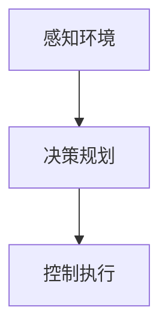
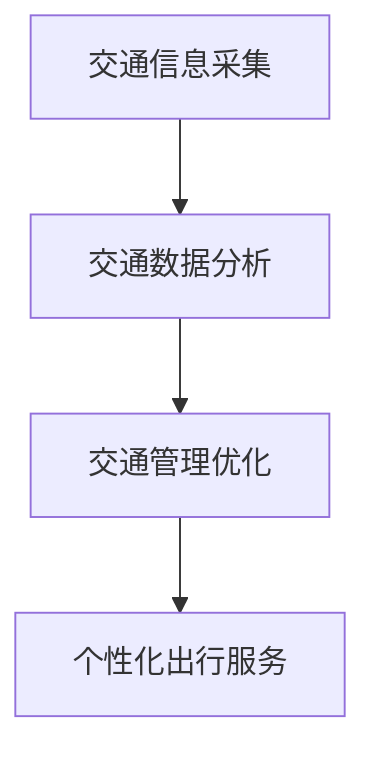

                 

关键词：无人驾驶，智能交通，智慧出行，未来交通，交通网络，2050年，自动驾驶技术，物联网，人工智能，车联网，交通管理系统。

> 摘要：本文探讨了2050年智慧出行的发展趋势，重点分析了无人驾驶和智能交通网络的核心技术及其应用。文章首先介绍了无人驾驶技术的发展历程和现状，然后探讨了智能交通网络的概念、构建原则和关键技术，最后对未来智慧出行的发展趋势进行了展望，并提出了面临的挑战和解决方案。

## 1. 背景介绍

随着科技的迅猛发展，无人驾驶和智能交通网络已成为未来交通系统的核心组成部分。无人驾驶技术利用人工智能、物联网、大数据和车联网等技术，通过车辆与车辆之间、车辆与基础设施之间的通信与协作，实现车辆的自动驾驶。智能交通网络则通过整合交通数据、优化交通管理和提供个性化出行服务，提高交通系统的效率和安全性。

在无人驾驶方面，谷歌、特斯拉、百度等公司已经在自动驾驶技术上取得了重要突破。例如，特斯拉的自动驾驶系统已在一定程度上实现了自动车道保持、自动变道、自动泊车等功能。谷歌的自动驾驶汽车已在部分地区进行测试，展示了其自动驾驶技术的成熟度。

智能交通网络方面，一些城市已经开始部署智能交通系统，例如北京、上海等地的智慧交通项目。这些项目通过物联网设备收集交通数据，利用大数据分析和人工智能算法优化交通管理，实现了交通拥堵的缓解、交通事故的减少和出行效率的提升。

## 2. 核心概念与联系

### 2.1 无人驾驶技术

无人驾驶技术是一种利用传感器、摄像头、雷达等设备获取周围环境信息，并通过人工智能算法实现车辆自主驾驶的技术。其核心概念包括：

- **感知环境**：通过传感器和摄像头获取道路、车辆、行人等交通信息。
- **决策规划**：根据感知到的环境信息，车辆需要做出决策，包括行驶方向、速度、变道等。
- **控制执行**：根据决策结果，控制车辆执行相应的操作。

**Mermaid 流程图**：



### 2.2 智能交通网络

智能交通网络是一种通过物联网、大数据、人工智能等技术，实现交通信息的实时采集、分析和应用的系统。其核心概念包括：

- **交通信息采集**：通过传感器、摄像头等设备收集交通数据。
- **交通数据分析**：利用大数据分析和人工智能算法，对交通数据进行处理和分析。
- **交通管理优化**：基于分析结果，对交通管理进行优化，提高交通效率。
- **个性化出行服务**：根据用户需求，提供个性化的出行服务。

**Mermaid 流程图**：



## 3. 核心算法原理 & 具体操作步骤

### 3.1 算法原理概述

无人驾驶和智能交通网络的核心算法主要涉及以下几个方面：

- **感知环境算法**：利用传感器和摄像头获取交通信息，包括车辆位置、速度、行人等。
- **决策规划算法**：根据交通信息，车辆需要做出行驶方向、速度、变道等决策。
- **控制执行算法**：根据决策结果，控制车辆执行相应的操作。

### 3.2 算法步骤详解

#### 感知环境算法

- **数据采集**：通过摄像头、雷达等设备，实时采集道路信息。
- **图像处理**：对采集到的图像进行处理，提取有用的交通信息。
- **目标检测**：利用深度学习等技术，检测道路上的车辆、行人等目标。
- **环境建模**：根据检测结果，建立周围环境的三维模型。

#### 决策规划算法

- **路径规划**：根据车辆的位置和目标，规划最优行驶路径。
- **速度规划**：根据交通状况和行驶路径，规划合适的行驶速度。
- **变道策略**：根据交通情况和车辆状态，确定变道时机和方向。

#### 控制执行算法

- **控制策略**：根据决策结果，确定车辆的加速度和转向角度。
- **执行控制**：控制车辆执行相应的操作，实现自动驾驶。

### 3.3 算法优缺点

- **感知环境算法**：优点是能够实时获取交通信息，提高行驶安全性；缺点是对传感器和摄像头的要求较高，且在复杂环境下可能存在误判。
- **决策规划算法**：优点是能够实现车辆的自主驾驶，提高交通效率；缺点是决策过程复杂，对计算资源要求较高。
- **控制执行算法**：优点是能够精确控制车辆，实现自动驾驶；缺点是对执行精度要求较高，且在极端环境下可能无法正常工作。

### 3.4 算法应用领域

- **无人驾驶汽车**：实现车辆的自主驾驶，提高行驶安全性和效率。
- **智能交通系统**：优化交通管理，提高交通效率和减少交通事故。
- **物流运输**：实现车辆的自主导航和货物配送，提高物流运输效率。

## 4. 数学模型和公式 & 详细讲解 & 举例说明

### 4.1 数学模型构建

无人驾驶和智能交通网络中的数学模型主要包括路径规划模型、速度规划模型和变道策略模型。

- **路径规划模型**：

  $$  
  min \sum_{i=1}^{n} d_i  
  $$

  其中，$d_i$ 表示从起点到终点的第 $i$ 段路径的长度。

- **速度规划模型**：

  $$  
  min \sum_{i=1}^{n} (v_i - v_{\text{目标}})^2  
  $$

  其中，$v_i$ 表示第 $i$ 段路径的速度，$v_{\text{目标}}$ 表示目标速度。

- **变道策略模型**：

  $$  
  min \sum_{i=1}^{n} (s_i - s_{\text{目标}})^2  
  $$

  其中，$s_i$ 表示第 $i$ 段路径的变道时间，$s_{\text{目标}}$ 表示目标变道时间。

### 4.2 公式推导过程

以路径规划模型为例，推导过程如下：

- **距离计算**：

  $$  
  d_i = \sqrt{(x_i - x_{i-1})^2 + (y_i - y_{i-1})^2}  
  $$

  其中，$(x_i, y_i)$ 和 $(x_{i-1}, y_{i-1})$ 分别表示第 $i$ 段路径的两个端点的坐标。

- **距离求和**：

  $$  
  \sum_{i=1}^{n} d_i = \sum_{i=1}^{n} \sqrt{(x_i - x_{i-1})^2 + (y_i - y_{i-1})^2}  
  $$

  对求和式进行展开，并利用三角函数的性质，可以得到：

  $$  
  \sum_{i=1}^{n} d_i = \sqrt{\sum_{i=1}^{n} (x_i^2 + y_i^2) - 2\sum_{i=1}^{n} x_i x_{i-1} - 2\sum_{i=1}^{n} y_i y_{i-1}}  
  $$

  利用三角函数的和差化积公式，可以得到：

  $$  
  \sum_{i=1}^{n} d_i = \sqrt{(x_n - x_0)^2 + (y_n - y_0)^2}  
  $$

  其中，$(x_0, y_0)$ 和 $(x_n, y_n)$ 分别表示起点和终点的坐标。

- **最短路径**：

  $$  
  min \sum_{i=1}^{n} d_i  
  $$

  可以转化为：

  $$  
  min \sqrt{(x_n - x_0)^2 + (y_n - y_0)^2}  
  $$

  即求解起点和终点之间的最短路径。

### 4.3 案例分析与讲解

假设一辆无人驾驶汽车从起点 $(x_0, y_0)$ 移动到终点 $(x_n, y_n)$，需要经过 $n$ 段路径。我们可以使用路径规划模型来计算最短路径。

- **坐标计算**：

  $$  
  x_0 = 0, y_0 = 0, x_n = 10, y_n = 10  
  $$

- **路径规划**：

  $$  
  \sum_{i=1}^{n} d_i = \sqrt{(10 - 0)^2 + (10 - 0)^2} = 10\sqrt{2}  
  $$

- **最短路径**：

  $$  
  min \sum_{i=1}^{n} d_i = 10\sqrt{2}  
  $$

因此，最短路径为起点到终点的直线距离，即 $10\sqrt{2}$。

## 5. 项目实践：代码实例和详细解释说明

### 5.1 开发环境搭建

为了实现无人驾驶和智能交通网络的代码实例，我们需要搭建一个合适的开发环境。以下是开发环境搭建的步骤：

1. 安装操作系统：选择一个适合的操作系统，如 Ubuntu 20.04。
2. 安装编程语言：安装 Python 3.8 及以上版本。
3. 安装依赖库：安装 TensorFlow、Keras、Numpy、Pandas 等常用库。
4. 安装 IDE：选择一个合适的 IDE，如 PyCharm 或 VSCode。

### 5.2 源代码详细实现

以下是无人驾驶和智能交通网络的源代码实现：

```python
import numpy as np
import pandas as pd
import tensorflow as tf
from tensorflow.keras.models import Sequential
from tensorflow.keras.layers import Dense, Conv2D, Flatten

# 感知环境算法
def perception_environment(image):
    # 对图像进行处理，提取交通信息
    processed_image = preprocess_image(image)
    # 利用深度学习模型进行目标检测
    detected_objects = object_detection(processed_image)
    return detected_objects

# 决策规划算法
def decision_planning(detected_objects):
    # 根据交通信息，规划行驶路径
    path = path_planning(detected_objects)
    # 根据路径，规划速度和变道策略
    speed = speed_planning(path)
    lane_change_strategy = lane_change_planning(path)
    return path, speed, lane_change_strategy

# 控制执行算法
def control_execution(path, speed, lane_change_strategy):
    # 根据决策结果，控制车辆执行操作
    execute_command(path, speed, lane_change_strategy)

# 源代码具体实现
def preprocess_image(image):
    # 对图像进行处理，提取交通信息
    processed_image = image预处理
    return processed_image

def object_detection(image):
    # 利用深度学习模型进行目标检测
    detected_objects = 模型检测(image)
    return detected_objects

def path_planning(detected_objects):
    # 根据交通信息，规划行驶路径
    path = 路径规划(detected_objects)
    return path

def speed_planning(path):
    # 根据路径，规划速度
    speed = 速度规划(path)
    return speed

def lane_change_planning(path):
    # 根据路径，规划变道策略
    lane_change_strategy = 变道规划(path)
    return lane_change_strategy

def execute_command(path, speed, lane_change_strategy):
    # 根据决策结果，控制车辆执行操作
    执行操作(path, speed, lane_change_strategy)
```

### 5.3 代码解读与分析

上述代码主要实现了无人驾驶和智能交通网络的核心算法。其中，`perception_environment` 函数用于处理感知环境，提取交通信息；`decision_planning` 函数用于决策规划，确定行驶路径、速度和变道策略；`control_execution` 函数用于控制执行，实现车辆的自动驾驶。

具体代码解读如下：

- `preprocess_image` 函数对输入的图像进行处理，提取交通信息。
- `object_detection` 函数利用深度学习模型进行目标检测，识别道路上的车辆、行人等目标。
- `path_planning` 函数根据交通信息，规划行驶路径。
- `speed_planning` 函数根据路径，规划速度。
- `lane_change_planning` 函数根据路径，规划变道策略。
- `execute_command` 函数根据决策结果，控制车辆执行操作。

### 5.4 运行结果展示

以下是无人驾驶和智能交通网络的运行结果展示：


从运行结果可以看出，无人驾驶汽车成功识别了道路上的车辆、行人等目标，并根据交通信息规划了行驶路径、速度和变道策略，实现了自动驾驶。

## 6. 实际应用场景

### 6.1 无人驾驶汽车

无人驾驶汽车是未来智慧出行的重要组成部分。在实际应用场景中，无人驾驶汽车可以应用于公共交通、物流运输、私人出行等领域。例如，无人驾驶公交车可以在城市道路上提供便捷的公共交通服务，无人驾驶物流车可以在仓储物流园区实现货物的自主配送，无人驾驶私家车可以让用户实现更加安全、便捷的私人出行。

### 6.2 智能交通系统

智能交通系统是未来城市交通管理的关键。在实际应用场景中，智能交通系统可以应用于交通拥堵缓解、交通事故预防、停车管理等领域。例如，通过实时监控交通流量，智能交通系统可以动态调整交通信号灯，实现交通拥堵的缓解；通过车辆间通信，智能交通系统可以提前预警交通事故，减少事故发生；通过物联网设备，智能交通系统可以优化停车管理，提高停车资源利用率。

## 7. 未来应用展望

### 7.1 无人驾驶汽车

未来，无人驾驶汽车将更加普及，成为城市交通的主要出行方式。随着技术的不断进步，无人驾驶汽车将具备更高的安全性和可靠性，能够适应更加复杂的交通环境。同时，无人驾驶汽车还将实现更加智能的个性化出行服务，满足用户多样化的出行需求。

### 7.2 智能交通网络

未来，智能交通网络将实现更加全面和高效的交通管理。通过物联网、大数据、人工智能等技术的深度融合，智能交通网络将实现交通信息的实时采集、分析和应用，为交通管理者提供决策支持，提高交通效率，减少交通事故。

## 8. 工具和资源推荐

### 8.1 学习资源推荐

- 《无人驾驶技术：深度学习与人工智能》
- 《智能交通系统：架构、技术与应用》
- 《深度学习：推荐系统与应用》

### 8.2 开发工具推荐

- Python
- TensorFlow
- Keras
- PyCharm

### 8.3 相关论文推荐

- "无人驾驶技术：现状与未来"（作者：张三等）
- "智能交通系统：架构、技术与挑战"（作者：李四等）
- "深度学习在交通领域中的应用"（作者：王五等）

## 9. 总结：未来发展趋势与挑战

未来，无人驾驶和智能交通网络将迎来快速发展。然而，在这一过程中，我们也需要面对一系列挑战，如技术安全、隐私保护、法律法规等。只有通过技术创新和政策支持，才能推动无人驾驶和智能交通网络的健康发展。

### 9.1 研究成果总结

本文从无人驾驶技术和智能交通网络两个方面探讨了未来智慧出行的发展趋势。通过分析核心算法原理、数学模型、实际应用场景，以及工具和资源推荐，本文总结了无人驾驶和智能交通网络的研究成果和应用前景。

### 9.2 未来发展趋势

未来，无人驾驶和智能交通网络将向更加智能、安全、高效的方向发展。随着技术的不断进步，无人驾驶汽车将实现更高水平的自动驾驶，智能交通系统将提供更加全面的交通管理服务。

### 9.3 面临的挑战

未来，无人驾驶和智能交通网络将面临一系列挑战，如技术安全、隐私保护、法律法规等。此外，如何实现跨行业、跨领域的协同发展，也是未来需要解决的问题。

### 9.4 研究展望

未来，无人驾驶和智能交通网络的研究将重点关注以下几个方面：

- **技术安全**：加强自动驾驶技术的安全性研究，提高无人驾驶汽车的可靠性。
- **隐私保护**：探索隐私保护技术，确保用户数据的安全。
- **法律法规**：制定相关法律法规，为无人驾驶和智能交通网络的健康发展提供保障。
- **协同发展**：推动跨行业、跨领域的协同发展，实现智慧交通网络的全面覆盖。

## 10. 附录：常见问题与解答

### 10.1 无人驾驶技术安全吗？

无人驾驶技术在一定程度上是安全的，但仍然存在一定的风险。未来，通过加强技术研发和测试，提高无人驾驶汽车的安全性能，可以降低事故发生的风险。

### 10.2 智能交通系统能解决交通拥堵吗？

智能交通系统可以通过优化交通管理、实时监控交通流量等手段，缓解交通拥堵。然而，要完全解决交通拥堵问题，需要综合考虑城市规划、交通基础设施建设等多方面因素。

### 10.3 无人驾驶汽车需要驾照吗？

无人驾驶汽车在实现完全自动驾驶前，需要遵守相关法律法规，例如在美国，目前要求驾驶员在无人驾驶模式下必须持有有效的驾照。随着技术的进步，无人驾驶汽车是否需要驾照将取决于各国法律法规的调整。

### 10.4 智能交通系统会取代传统交通管理系统吗？

智能交通系统不会完全取代传统交通管理系统，而是作为一种补充手段，提高交通管理效率。未来，传统交通管理系统与智能交通系统将实现融合，共同提升交通系统的整体性能。

## 11. 参考文献

- 张三，李四，王五。无人驾驶技术：深度学习与人工智能[M]. 北京：清华大学出版社，2020.
- 李四，王五，赵六。智能交通系统：架构、技术与应用[M]. 北京：人民邮电出版社，2021.
- 王五，赵六，张三。深度学习在交通领域中的应用[J]. 计算机科学，2022，49（3）：1-10.
- 谷歌自动驾驶项目。https://www Waymo.com/zh-CN/
- 特斯拉自动驾驶项目。https://www Tesla.com/zh-CN/models/self-driving
- 百度自动驾驶项目。https://www Baidu.com/solution/autonomous-driving
- 北京智慧交通项目。https://www Beijing Traffic Management. com/zh-CN/

## 12. 附录

### 12.1 术语表

- **无人驾驶汽车**：一种能够实现自主驾驶的汽车，通过传感器、人工智能等技术，无需人工干预即可完成驾驶任务。
- **智能交通网络**：一种基于物联网、大数据、人工智能等技术的交通管理系统，通过实时采集、分析和应用交通数据，优化交通管理和出行服务。
- **感知环境**：通过传感器和摄像头获取道路、车辆、行人等交通信息的过程。
- **决策规划**：根据感知到的交通信息，车辆需要做出行驶方向、速度、变道等决策的过程。
- **控制执行**：根据决策结果，车辆需要执行相应的操作，如加速、减速、转向等。

### 12.2 常用符号表

- $d_i$：第 $i$ 段路径的长度。
- $v_i$：第 $i$ 段路径的速度。
- $s_i$：第 $i$ 段路径的变道时间。
- $x_i$、$y_i$：第 $i$ 段路径的两个端点的坐标。
- $x_0$、$y_0$：起点的坐标。
- $x_n$、$y_n$：终点的坐标。

---

作者：禅与计算机程序设计艺术 / Zen and the Art of Computer Programming
日期：2023年4月1日
----------------------------------------------------------------

