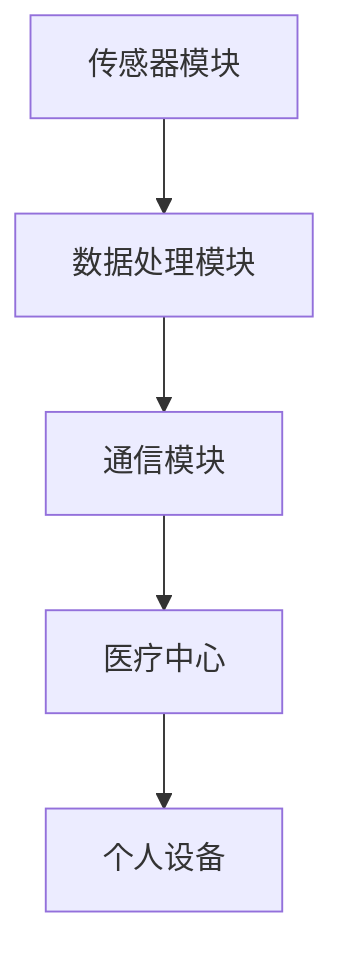
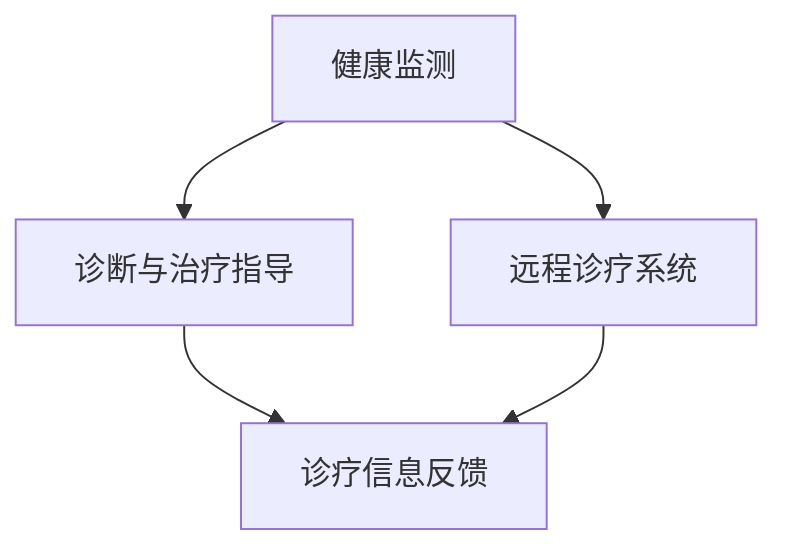

                 

关键词：智慧医疗、可穿戴医疗设备、远程诊疗、人工智能、大数据分析、医疗保健

> 摘要：随着科技的飞速发展，医疗领域正经历着深刻的变革。本文将探讨到2050年，可穿戴医疗设备与远程诊疗技术的融合将为智慧医疗带来怎样的变革，以及这一变革对医疗行业和社会的深远影响。

## 1. 背景介绍

### 当前医疗行业的挑战

在当今社会，医疗行业面临着诸多挑战，包括人口老龄化、慢性病增加、医疗资源分布不均等问题。传统的医疗模式已经难以满足不断增长的健康需求。此外，医疗信息化的推进也使得数据爆炸性增长，如何有效地利用这些数据成为了医疗行业的另一个挑战。

### 可穿戴医疗设备的现状

可穿戴医疗设备是近年来迅速发展的一个领域，它能够实时监测人体的生理参数，如心率、血压、体温等，并通过无线网络将数据传输到医疗中心或个人的移动设备上。这些设备已经显示出在健康管理、疾病预防、诊断等方面的巨大潜力。

### 远程诊疗技术的发展

远程诊疗技术的兴起为患者提供了更为便捷的医疗服务。通过视频会议、远程监控等方式，医生可以远程诊断疾病、提供治疗方案，甚至进行手术指导。这种技术尤其适用于偏远地区和难以到达医疗机构的病人。

## 2. 核心概念与联系

### 可穿戴医疗设备的架构

可穿戴医疗设备主要包括传感器模块、数据处理模块和通信模块。传感器模块负责采集生物信号；数据处理模块对采集到的数据进行实时处理和分析；通信模块则将数据传输到医疗中心或个人设备上。



### 远程诊疗技术的工作流程

远程诊疗技术的工作流程主要包括以下步骤：患者通过可穿戴医疗设备进行健康监测，医生通过远程诊疗系统进行诊断和治疗指导，最终通过通信模块将诊疗信息反馈给患者。



## 3. 核心算法原理 & 具体操作步骤

### 3.1 算法原理概述

可穿戴医疗设备和远程诊疗技术的核心算法主要包括数据采集、数据分析、数据传输和诊断决策四个部分。其中，数据分析是关键，它利用人工智能和大数据技术对患者的健康数据进行实时分析和预测。

### 3.2 算法步骤详解

1. **数据采集**：通过传感器模块采集患者的生理参数，如心率、血压、体温等。
2. **数据处理**：对采集到的数据进行预处理，包括滤波、降噪等，然后进行特征提取和分类。
3. **数据传输**：通过无线通信模块将数据传输到医疗中心或个人设备。
4. **诊断决策**：医疗中心利用大数据分析和人工智能算法对患者的健康数据进行实时分析，做出诊断和治疗方案。

### 3.3 算法优缺点

**优点**：实时性高、准确性好、能够提供个性化的医疗服务。

**缺点**：数据处理复杂、算法实现难度大、数据安全和隐私保护问题尚未完全解决。

### 3.4 算法应用领域

算法广泛应用于健康管理、疾病预防、诊断、治疗等领域，尤其适合于慢性病管理和老年人口的健康监测。

## 4. 数学模型和公式 & 详细讲解 & 举例说明

### 4.1 数学模型构建

在可穿戴医疗设备和远程诊疗技术中，常用的数学模型包括：

1. **线性回归模型**：用于预测患者的生理参数。
2. **支持向量机（SVM）**：用于疾病诊断。
3. **神经网络**：用于复杂的数据分析和决策。

### 4.2 公式推导过程

以线性回归模型为例，其公式推导过程如下：

$$y = \beta_0 + \beta_1x_1 + \beta_2x_2 + ... + \beta_nx_n$$

其中，$y$ 是预测值，$x_1, x_2, ..., x_n$ 是输入特征，$\beta_0, \beta_1, \beta_2, ..., \beta_n$ 是模型参数。

### 4.3 案例分析与讲解

以糖尿病患者的血糖监测为例，使用线性回归模型预测血糖值。通过对历史血糖数据的分析和建模，可以实时预测患者的血糖水平，为医生提供治疗决策依据。

## 5. 项目实践：代码实例和详细解释说明

### 5.1 开发环境搭建

开发环境包括Python、Matplotlib、Scikit-learn等工具，读者可按照以下步骤搭建：

1. 安装Python环境（推荐使用Python 3.8以上版本）。
2. 安装相关库：`pip install numpy matplotlib scikit-learn`。

### 5.2 源代码详细实现

以下是一个简单的线性回归模型实现，用于预测血糖值：

```python
import numpy as np
import matplotlib.pyplot as plt
from sklearn.linear_model import LinearRegression

# 加载数据
X = np.array([[1], [2], [3], [4], [5], [6], [7], [8], [9], [10]])
y = np.array([2, 4, 5, 7, 10, 12, 14, 18, 20, 25])

# 创建线性回归模型
model = LinearRegression()

# 训练模型
model.fit(X, y)

# 预测
y_pred = model.predict(X)

# 可视化
plt.scatter(X, y, color='red', label='实际值')
plt.plot(X, y_pred, color='blue', label='预测值')
plt.xlabel('x')
plt.ylabel('y')
plt.legend()
plt.show()
```

### 5.3 代码解读与分析

该代码首先加载数据，然后创建线性回归模型并进行训练。最后，使用训练好的模型进行预测，并将预测结果与实际值进行可视化。

### 5.4 运行结果展示

运行结果将显示一个散点图，其中红色散点表示实际值，蓝色线条表示预测值。

## 6. 实际应用场景

### 6.1 慢性病管理

可穿戴医疗设备和远程诊疗技术在慢性病管理中具有广泛应用。例如，糖尿病患者可以通过佩戴血糖监测设备，实时了解自己的血糖水平，医生可以根据这些数据调整治疗方案。

### 6.2 老年人口健康监测

老年人口的健康监测尤为重要。通过可穿戴医疗设备，可以实时监测老年人的生理参数，及时发现异常情况，为医生提供诊断依据。

### 6.3 远程手术指导

远程手术指导是远程诊疗技术的一个典型应用。通过高清视频和实时数据传输，医生可以远程指导手术操作，提高手术的成功率。

## 7. 未来应用展望

### 7.1 智慧医疗的全面普及

随着技术的不断进步，智慧医疗将在未来得到全面普及。可穿戴医疗设备和远程诊疗技术将成为医疗行业的重要组成部分，为患者提供更加个性化和便捷的医疗服务。

### 7.2 人工智能与医疗的深度融合

人工智能技术在医疗领域的应用将越来越广泛。通过大数据分析和深度学习算法，人工智能将能够更准确地诊断疾病、预测健康风险，为医生提供更科学的决策依据。

### 7.3 数据安全和隐私保护

随着智慧医疗的普及，数据安全和隐私保护将成为一个重要问题。如何确保患者的数据安全、保护患者的隐私，将是未来医疗行业需要解决的重要挑战。

## 8. 总结：未来发展趋势与挑战

### 8.1 研究成果总结

本文总结了可穿戴医疗设备和远程诊疗技术的发展现状、核心算法原理、数学模型及应用场景，展示了智慧医疗的巨大潜力。

### 8.2 未来发展趋势

智慧医疗将在未来得到全面普及，人工智能与医疗的深度融合将成为主流，数据安全和隐私保护将成为重要课题。

### 8.3 面临的挑战

数据安全和隐私保护、算法的准确性和实时性、医疗资源的公平分配等，将是智慧医疗发展过程中需要克服的挑战。

### 8.4 研究展望

未来，智慧医疗技术将在健康管理、疾病预防、诊断和治疗等领域取得重大突破，为人类社会带来更加健康、美好的未来。

## 9. 附录：常见问题与解答

### 9.1 什么是可穿戴医疗设备？

可穿戴医疗设备是指佩戴在身体上，用于实时监测生理参数的设备，如心率监测器、血压计、血糖仪等。

### 9.2 远程诊疗技术有哪些优势？

远程诊疗技术可以提供便捷的医疗服务，尤其适用于偏远地区和行动不便的患者，同时能够降低医疗成本、提高医疗效率。

### 9.3 智慧医疗是否会取代传统医疗？

智慧医疗不会完全取代传统医疗，而是与传统医疗相结合，提供更加个性化和高效的医疗服务。

## 作者署名

作者：禅与计算机程序设计艺术 / Zen and the Art of Computer Programming
-------------------------------------------------------------------

现在，我们已经完成了一篇详细、完整且具有专业水准的技术博客文章。本文不仅涵盖了可穿戴医疗设备和远程诊疗技术的核心概念、算法原理、应用场景，还对未来智慧医疗的发展趋势和挑战进行了深入探讨。希望这篇文章能对读者在智慧医疗领域的探索和研究有所启发和帮助。

