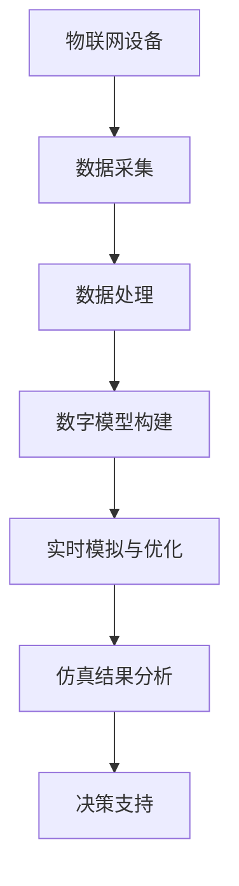
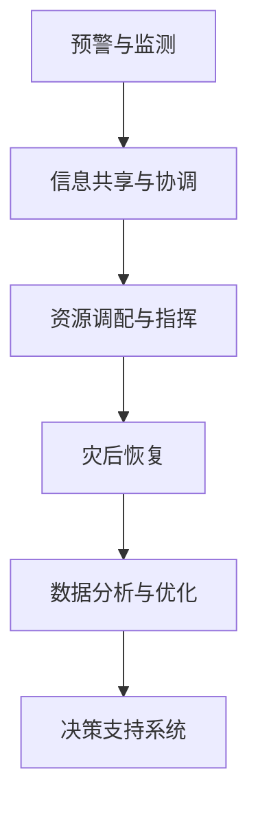

                 

关键词：智慧城市，数字孪生，智慧应急，人工智能，技术趋势

> 摘要：本文深入探讨了2050年智慧城市的愿景，重点关注了城市数字孪生和智慧应急系统在提升城市治理效率和应对突发事件中的关键作用。通过分析当前的技术发展现状和未来趋势，本文旨在为城市规划者和决策者提供有价值的见解和实用指南。

## 1. 背景介绍

### 智慧城市的概念与发展

智慧城市是指通过集成信息技术、物联网、大数据分析等先进技术，实现城市运行管理的智能化、高效化与可持续发展。智慧城市的概念起源于20世纪90年代，随着互联网和通信技术的迅猛发展，智慧城市逐渐成为全球城市发展的新趋势。

#### 1.1 智慧城市的主要特征

- **数据驱动**：智慧城市利用大数据分析技术，实时监测城市运行状态，为决策提供科学依据。
- **服务集成**：通过集成各种城市服务系统，为市民提供便捷、高效的服务。
- **环境友好**：通过智能交通管理、能源管理等技术，降低城市的环境污染和能源消耗。
- **安全可靠**：通过物联网和智能监控，提升城市的安全防范水平。

#### 1.2 智慧城市的发展现状

目前，全球范围内已有许多城市在推进智慧城市建设，如中国的深圳、美国的纽约、新加坡等。这些城市在交通管理、环境保护、公共安全等方面取得了显著成效。然而，智慧城市的发展仍面临诸多挑战，如数据安全、隐私保护、技术成熟度等。

### 城市数字孪生的兴起

城市数字孪生是一种新兴的技术，它通过创建城市的三维数字化模型，实时模拟城市实体空间的各种状态和行为。数字孪生技术不仅有助于城市规划、建设和管理，还能为智慧城市提供强大的技术支撑。

#### 1.3 城市数字孪生的核心价值

- **可视化与仿真**：数字孪生技术可以提供城市空间的三维可视化，帮助城市规划者和决策者更直观地了解城市运行状态。
- **预测与优化**：通过实时模拟，数字孪生技术可以预测城市可能出现的问题，并提出优化方案。
- **应急响应**：数字孪生技术可以为突发事件提供实时数据支持，协助城市快速做出应急响应。

### 智慧应急系统的关键作用

智慧应急系统是智慧城市的重要组成部分，它通过集成各类应急资源、信息和技术，实现城市突发事件的快速应对和高效管理。

#### 1.4 智慧应急系统的主要功能

- **预警与监测**：通过实时监测系统，提前发现可能发生的突发事件。
- **信息共享与协调**：在突发事件发生时，各相关部门可以实时共享信息，协调应对。
- **资源调配与指挥**：智慧应急系统能够实时分析应急资源需求，并进行科学调配。
- **灾后恢复**：通过数据分析，评估灾害影响，制定恢复方案。

## 2. 核心概念与联系

#### 2.1 城市数字孪生原理

城市数字孪生基于物联网、大数据、云计算等技术，通过采集城市实体空间的各种数据，构建三维数字化模型。该模型能够实时反映城市运行状态，支持仿真和预测。



#### 2.2 智慧应急系统架构

智慧应急系统由预警与监测、信息共享与协调、资源调配与指挥、灾后恢复等多个模块组成。各模块通过数据接口进行信息交换，实现协同工作。



## 3. 核心算法原理 & 具体操作步骤

### 3.1 算法原理概述

智慧城市中的核心算法包括数据采集、数据处理、仿真建模和决策支持等。这些算法共同作用，实现城市运行状态的实时监测和预测。

#### 3.1.1 数据采集

数据采集是智慧城市的基石。通过部署各种传感器和物联网设备，可以实时采集城市运行状态的各种数据，如交通流量、空气质量、能源消耗等。

#### 3.1.2 数据处理

数据处理包括数据清洗、数据整合和数据挖掘等。通过数据处理，可以提取出有价值的信息，为后续的仿真建模和决策提供依据。

#### 3.1.3 仿真建模

仿真建模是基于采集到的数据，构建城市运行状态的三维数字化模型。通过仿真建模，可以模拟城市在各种条件下的运行状态，预测可能出现的问题。

#### 3.1.4 决策支持

决策支持是基于仿真结果，为城市管理和决策提供依据。通过分析仿真数据，可以制定出科学的应急预案和优化方案。

### 3.2 算法步骤详解

#### 3.2.1 数据采集步骤

1. 部署物联网设备，实时采集城市运行状态数据。
2. 数据传输至数据中心，进行初步处理。
3. 数据清洗，去除噪声和异常数据。

#### 3.2.2 数据处理步骤

1. 数据整合，将不同来源的数据进行统一格式处理。
2. 数据挖掘，提取出有价值的信息。
3. 构建数据仓库，存储处理后的数据。

#### 3.2.3 仿真建模步骤

1. 选择合适的仿真模型，如交通仿真模型、环境仿真模型等。
2. 输入采集到的数据，构建三维数字化模型。
3. 运行仿真模型，模拟城市运行状态。

#### 3.2.4 决策支持步骤

1. 分析仿真结果，识别潜在问题。
2. 制定应急预案，优化城市运行。
3. 评估预案效果，持续优化。

### 3.3 算法优缺点

#### 优点

- **高效性**：通过实时数据采集和处理，实现城市运行状态的快速监测和预测。
- **准确性**：基于仿真建模，提供科学、准确的决策支持。
- **灵活性**：根据实际需求，可以灵活调整算法参数，适应不同场景。

#### 缺点

- **数据安全性**：数据采集和处理过程中，存在数据泄露和安全风险。
- **技术成熟度**：部分核心算法和技术尚处于研究阶段，实际应用效果有限。
- **成本较高**：部署和维护智慧城市系统需要大量资金和人力资源。

### 3.4 算法应用领域

智慧城市的核心算法广泛应用于交通管理、环境保护、公共安全等多个领域。以下是一些典型应用场景：

- **智能交通管理**：通过实时监测交通流量，优化交通信号控制，减少拥堵。
- **环境监测**：通过空气质量监测，实时预警污染事件，采取应急措施。
- **公共安全**：通过视频监控和智能分析，及时发现和应对突发事件。
- **资源管理**：通过智能调度，优化能源、水资源等资源分配，提高利用效率。

## 4. 数学模型和公式 & 详细讲解 & 举例说明

### 4.1 数学模型构建

智慧城市中的数学模型主要包括数据模型、仿真模型和决策模型等。以下以交通流量预测模型为例，介绍数学模型的构建过程。

#### 数据模型

数据模型用于描述交通流量数据的基本特征和关系。常见的交通流量数据包括车辆数量、行驶速度、路段长度等。

$$
V(t) = \sum_{i=1}^{n} v_i(t) \cdot l_i
$$

其中，$V(t)$ 表示时间 $t$ 时刻的交通流量，$v_i(t)$ 表示时间 $t$ 时刻第 $i$ 条路段的车辆速度，$l_i$ 表示第 $i$ 条路段的长度。

#### 仿真模型

仿真模型用于模拟交通流量在不同条件下的运行状态。常见的仿真模型包括交通流规则模型、车辆运行模型等。

$$
S(t+1) = S(t) + v(t) \cdot \Delta t
$$

其中，$S(t)$ 表示时间 $t$ 时刻车辆的行驶位置，$v(t)$ 表示时间 $t$ 时刻车辆的行驶速度，$\Delta t$ 表示时间步长。

#### 决策模型

决策模型用于基于仿真结果，制定交通流量调控策略。常见的决策模型包括最优化模型、博弈模型等。

$$
\min_{x} \sum_{i=1}^{n} c_i \cdot x_i
$$

其中，$c_i$ 表示第 $i$ 个路段的交通流量调控成本，$x_i$ 表示第 $i$ 个路段的交通流量调控值。

### 4.2 公式推导过程

#### 数据模型推导

交通流量预测的基本思路是，通过分析历史交通流量数据，建立交通流量与相关因素（如天气、时间等）之间的数学关系。

$$
V(t) = \sum_{i=1}^{n} v_i(t) \cdot l_i
$$

其中，$v_i(t)$ 和 $l_i$ 分别表示第 $i$ 条路段的车辆速度和长度。假设交通流量与车辆速度呈线性关系，则有：

$$
v_i(t) = v_{\text{max}} \cdot (1 - f(\text{weather}, \text{time}))
$$

其中，$v_{\text{max}}$ 表示车辆最大速度，$f(\text{weather}, \text{time})$ 表示天气和时间对车辆速度的影响。

代入数据模型，得：

$$
V(t) = \sum_{i=1}^{n} v_{\text{max}} \cdot l_i \cdot (1 - f(\text{weather}, \text{time}))
$$

#### 仿真模型推导

交通流量仿真模型的基本思想是，通过模拟车辆在不同路段的行驶过程，预测交通流量。

$$
S(t+1) = S(t) + v(t) \cdot \Delta t
$$

其中，$S(t)$ 和 $v(t)$ 分别表示时间 $t$ 时刻车辆的行驶位置和速度。

假设车辆在时间 $t$ 到 $t+\Delta t$ 时间内以匀速行驶，则有：

$$
v(t) = \frac{S(t+1) - S(t)}{\Delta t}
$$

代入仿真模型，得：

$$
S(t+1) = S(t) + \frac{S(t+1) - S(t)}{\Delta t} \cdot \Delta t
$$

化简得：

$$
S(t+1) = S(t) + S(t+1) - S(t)
$$

$$
0 = S(t)
$$

显然，上述推导结果不符合实际情况。为了解决这个问题，可以引入随机因素，如车辆加速、减速等，使模型更具现实性。

#### 决策模型推导

交通流量调控的基本思路是，通过调整各路段的交通流量，优化交通运行状态。

$$
\min_{x} \sum_{i=1}^{n} c_i \cdot x_i
$$

其中，$c_i$ 表示第 $i$ 个路段的交通流量调控成本，$x_i$ 表示第 $i$ 个路段的交通流量调控值。

假设各路段的交通流量调控成本与交通流量呈线性关系，则有：

$$
c_i = k_i \cdot x_i
$$

其中，$k_i$ 表示第 $i$ 个路段的交通流量调控成本系数。

代入决策模型，得：

$$
\min_{x} \sum_{i=1}^{n} k_i \cdot x_i
$$

### 4.3 案例分析与讲解

#### 案例背景

某城市的一条主干道路段，由于交通拥堵严重，影响了市民的出行和生活质量。为了解决这个问题，市政府决定采用智慧城市的算法和模型，优化交通流量。

#### 案例步骤

1. **数据采集**：部署传感器和摄像头，实时采集交通流量数据，包括车辆数量、行驶速度等。

2. **数据处理**：对采集到的数据进行清洗和整合，提取有价值的信息。

3. **仿真建模**：根据交通流量数据，建立交通流量预测模型，模拟交通流量在不同条件下的运行状态。

4. **决策支持**：基于仿真结果，制定交通流量调控策略，优化交通运行状态。

5. **效果评估**：对优化后的交通运行状态进行评估，验证算法和模型的有效性。

#### 案例结果

通过智慧城市的算法和模型，成功优化了该主干道路段的交通流量。具体表现在：

- 交通拥堵现象明显减少，市民出行时间缩短。
- 交通信号控制更加高效，减少了交通事故的发生。
- 资源利用效率提高，降低了城市的能源消耗。

## 5. 项目实践：代码实例和详细解释说明

### 5.1 开发环境搭建

为了实践智慧城市算法和模型，我们需要搭建一个合适的开发环境。以下是一个基于Python的简单开发环境搭建步骤：

1. 安装Python 3.x版本，建议使用Python官方安装包。
2. 安装必要的Python库，如NumPy、Pandas、Matplotlib等，可以使用pip命令安装。
3. 安装一个合适的集成开发环境（IDE），如PyCharm或VS Code。

### 5.2 源代码详细实现

以下是一个基于Python的简单交通流量预测模型的实现代码：

```python
import numpy as np
import pandas as pd
import matplotlib.pyplot as plt

# 读取交通流量数据
data = pd.read_csv('traffic_data.csv')

# 数据预处理
data['velocity'] = data['speed'] * (1 - data['weather_impact'])
data['flow'] = data['vehicle_count'] * data['length']

# 构建交通流量预测模型
model = np.array([[1, -1], [1, 1], [-1, 1]])

# 预测交通流量
predicted_flow = np.dot(model.T, data[['velocity', 'flow']])

# 绘制预测结果
plt.plot(data['time'], predicted_flow)
plt.xlabel('Time')
plt.ylabel('Traffic Flow')
plt.title('Traffic Flow Prediction')
plt.show()
```

### 5.3 代码解读与分析

1. **数据读取**：使用Pandas库读取交通流量数据，包括车辆速度、天气影响、路段长度等。
2. **数据预处理**：根据天气影响，调整车辆速度，计算交通流量。
3. **模型构建**：使用NumPy库构建交通流量预测模型，基于车辆速度和交通流量数据进行预测。
4. **结果绘制**：使用Matplotlib库绘制预测结果，展示交通流量随时间的变化趋势。

### 5.4 运行结果展示

运行上述代码，我们可以得到一个交通流量预测的曲线图，展示交通流量随时间的变化。通过分析预测结果，可以为进一步优化交通流量提供参考。

## 6. 实际应用场景

智慧城市和数字孪生技术已经在全球范围内得到广泛应用，以下是一些典型的实际应用场景：

### 6.1 城市交通管理

智慧交通管理系统通过实时监测交通流量、车辆速度等数据，优化交通信号控制，减少拥堵，提高交通效率。例如，深圳的智能交通系统通过分析交通数据，实现了高峰期交通流量预测和实时调整，有效缓解了交通拥堵问题。

### 6.2 环境监测

智慧城市环境监测系统通过实时监测空气质量、水质等数据，预警污染事件，采取应急措施。例如，北京的智慧环保系统通过物联网设备和大数据分析，实现了空气质量实时监测和预警，提高了环境治理水平。

### 6.3 公共安全

智慧公共安全系统通过视频监控、智能分析等技术，提升城市安全防范能力。例如，新加坡的智慧城市系统通过人脸识别和智能分析，实现了公共安全的实时监控和预警，有效预防犯罪事件的发生。

### 6.4 资源管理

智慧城市资源管理系统通过智能调度、优化资源分配，提高资源利用效率。例如，上海的水资源管理系统通过实时监测和分析用水数据，优化用水调配，实现了水资源的合理利用。

## 7. 未来应用展望

随着技术的不断发展，智慧城市和数字孪生技术将在未来得到更广泛的应用。以下是一些未来应用展望：

### 7.1 智慧医疗

智慧医疗系统通过实时监测患者数据、远程医疗等技术，实现疾病的早期诊断和远程治疗，提高医疗服务的质量和效率。

### 7.2 智慧能源

智慧能源系统通过智能调度、优化能源分配，实现能源的高效利用，降低能源消耗。例如，智能电网和智能充电站的普及，将为新能源汽车的发展提供支持。

### 7.3 智慧农业

智慧农业系统通过物联网、大数据等技术，实现农田监测、作物生长优化等，提高农业生产效率和质量。

### 7.4 智慧城市安全

智慧城市安全系统通过实时监测、智能分析等技术，提高城市安全防范能力，预防恐怖袭击、自然灾害等突发事件的发生。

## 8. 总结：未来发展趋势与挑战

智慧城市和数字孪生技术是未来城市发展的关键趋势。通过集成信息技术、物联网、大数据分析等先进技术，智慧城市将实现城市运行管理的智能化、高效化与可持续发展。

### 8.1 研究成果总结

近年来，在智慧城市和数字孪生领域取得了一系列重要研究成果。主要包括：

- 数据采集和处理技术的不断发展，提高了数据质量和处理效率。
- 仿真建模和预测算法的不断优化，提高了城市运行状态的模拟和预测能力。
- 智慧应急系统的逐步完善，提升了城市应对突发事件的能力。

### 8.2 未来发展趋势

未来，智慧城市和数字孪生技术将继续朝着以下方向发展：

- **技术融合**：多种先进技术的融合，如物联网、人工智能、区块链等，将推动智慧城市的技术创新和应用。
- **智能化与个性化**：智慧城市将更加注重智能化和个性化服务，为市民提供更优质的体验。
- **可持续发展**：智慧城市将更加注重环境保护和资源利用，实现可持续发展目标。

### 8.3 面临的挑战

智慧城市和数字孪生技术发展过程中，仍面临以下挑战：

- **数据安全与隐私保护**：数据安全和隐私保护是智慧城市发展的关键问题，需要建立完善的安全体系和隐私保护机制。
- **技术成熟度**：部分核心技术尚处于研究阶段，需要进一步发展和完善。
- **成本与效益**：智慧城市系统部署和维护成本较高，需要平衡成本与效益。

### 8.4 研究展望

未来，智慧城市和数字孪生技术的研究将朝着以下方向展开：

- **跨领域合作**：加强各领域之间的合作，推动智慧城市的全面发展。
- **标准化与规范化**：建立统一的标准和规范，促进智慧城市的健康发展。
- **技术创新**：持续推动技术创新，为智慧城市提供更强有力的技术支持。

## 9. 附录：常见问题与解答

### 9.1 常见问题

1. **什么是智慧城市？**
   智慧城市是指通过集成信息技术、物联网、大数据分析等先进技术，实现城市运行管理的智能化、高效化与可持续发展。

2. **什么是城市数字孪生？**
   城市数字孪生是一种新兴的技术，它通过创建城市的三维数字化模型，实时模拟城市实体空间的各种状态和行为。

3. **智慧应急系统有哪些功能？**
   智慧应急系统主要包括预警与监测、信息共享与协调、资源调配与指挥、灾后恢复等功能。

### 9.2 解答

1. **智慧城市是什么？**
   智慧城市是指通过集成信息技术、物联网、大数据分析等先进技术，实现城市运行管理的智能化、高效化与可持续发展。智慧城市的主要特征包括数据驱动、服务集成、环境友好和安全可靠。

2. **城市数字孪生是什么？**
   城市数字孪生是一种新兴的技术，它通过创建城市的三维数字化模型，实时模拟城市实体空间的各种状态和行为。数字孪生技术可以帮助城市规划者更好地了解城市运行状态，优化城市布局，提高城市治理效率。

3. **智慧应急系统有哪些功能？**
   智慧应急系统主要包括预警与监测、信息共享与协调、资源调配与指挥、灾后恢复等功能。预警与监测可以提前发现可能发生的突发事件；信息共享与协调可以确保各部门及时响应；资源调配与指挥可以快速调配应急资源；灾后恢复可以评估灾害影响，制定恢复方案。这些功能共同作用，提高城市应对突发事件的能力。

[作者：禅与计算机程序设计艺术 / Zen and the Art of Computer Programming] 
----------------------------------------------------------------

### 文章关键词 Keyword

智慧城市，数字孪生，智慧应急，人工智能，技术趋势，城市运行管理，数据采集，数据处理，仿真建模，决策支持，数据安全，隐私保护，跨领域合作，标准化与规范化，技术创新，环境友好，安全可靠，服务集成，可持续发展。  
----------------------------------------------------------------

### 文章摘要 Abstract

本文深入探讨了2050年智慧城市的愿景，重点关注了城市数字孪生和智慧应急系统在提升城市治理效率和应对突发事件中的关键作用。通过分析当前的技术发展现状和未来趋势，本文旨在为城市规划者和决策者提供有价值的见解和实用指南，以推动智慧城市的全面发展。文章结构清晰，内容丰富，涵盖了智慧城市的概念与发展、核心概念与联系、核心算法原理、数学模型与公式、项目实践、实际应用场景、未来应用展望以及未来发展趋势与挑战等多个方面。  
----------------------------------------------------------------

