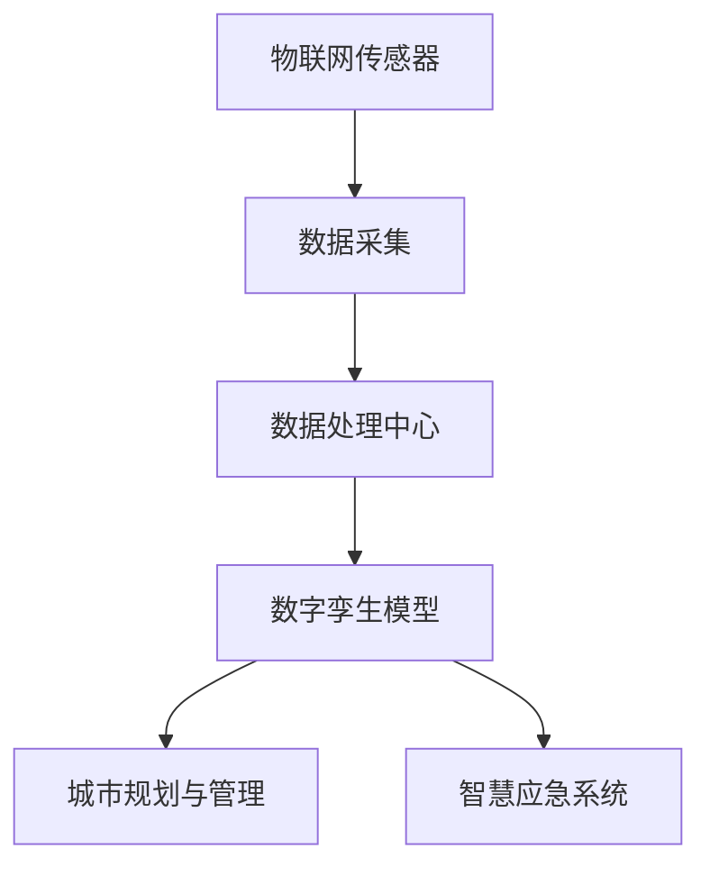
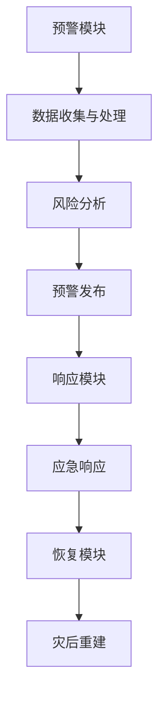

                 

 > 关键词：智慧城市、数字孪生、智慧应急、2050年、人工智能、技术发展、城市安全、可持续发展、数据驱动的城市规划与管理。

## 摘要

本文探讨了未来智慧城市在2050年可能的发展方向，重点关注城市数字孪生和智慧应急两个关键领域。通过深入分析数字孪生技术的应用，如何构建一个反映城市实时状态的虚拟模型，以及智慧应急系统如何在突发情况下迅速响应，文章旨在阐述这些技术如何共同推动城市向更安全、更可持续的方向发展。本文还将讨论当前的技术挑战以及未来的发展前景。

## 1. 背景介绍

### 1.1 智慧城市的概念

智慧城市是指通过信息通信技术和物联网等技术的应用，实现城市管理的智能化和高效化。智慧城市的目标是提高居民生活质量，增强城市竞争力，并实现可持续发展。随着全球城市化进程的加快，智慧城市的概念和实践得到了广泛的关注。

### 1.2 数字孪生技术的兴起

数字孪生（Digital Twin）技术是一种新兴的数字化转型工具，它通过创建物理实体在虚拟空间的映射，实现实体与虚拟系统的实时交互。数字孪生技术最早应用于制造业，但随着技术的发展，其应用范围已扩展到城市规划和应急管理等领域。

### 1.3 智慧应急的重要性

智慧应急是指利用大数据、云计算、物联网等先进技术，建立智慧化的应急响应系统。智慧应急系统能够在突发事件发生时，提供快速、准确的应急决策支持，降低灾害损失，保护人民生命财产安全。

## 2. 核心概念与联系

### 2.1 数字孪生原理

数字孪生技术通过物联网传感器收集城市各部分的实时数据，包括交通流量、环境质量、建筑结构等，并在虚拟环境中创建一个数字模型。这个模型能够反映城市的实时状态，为城市管理和决策提供数据支持。



### 2.2 智慧应急架构

智慧应急系统通过数字孪生模型提供的实时数据，结合人工智能和机器学习算法，进行预测和决策支持。系统主要包括预警模块、响应模块、恢复模块等，能够实现全流程的智慧化应急响应。



## 3. 核心算法原理 & 具体操作步骤

### 3.1 算法原理概述

智慧城市数字孪生与智慧应急系统的基础算法包括数据采集与处理算法、预测与决策算法等。数据采集与处理算法负责收集、处理和分析城市各部分的实时数据，预测与决策算法则基于这些数据进行事件预测和应急响应决策。

### 3.2 算法步骤详解

1. **数据采集**：通过物联网传感器收集城市各部分的实时数据，包括气象数据、交通数据、环境数据等。
2. **数据处理**：将收集到的数据进行预处理，包括数据清洗、数据归一化等，以提高数据质量。
3. **数据存储**：将处理后的数据存储在数据库中，以便后续分析和查询。
4. **事件预测**：利用机器学习算法对历史数据进行训练，建立预测模型，预测可能发生的突发事件。
5. **决策支持**：根据预测结果和实时数据，利用决策算法生成应急响应策略。

### 3.3 算法优缺点

**优点**：
- 提高数据利用效率，增强决策的科学性和准确性。
- 实现实时监控和预警，提高应急响应速度。
- 减少突发事件造成的损失，保护人民生命财产安全。

**缺点**：
- 数据采集和处理需要大量计算资源，成本较高。
- 算法模型的训练和优化需要大量历史数据，对数据质量和数据量有较高要求。
- 需要跨部门协作，数据共享和协调困难。

### 3.4 算法应用领域

智慧城市数字孪生与智慧应急系统算法主要应用于城市规划与管理、公共安全、应急管理、交通管理等领域。

## 4. 数学模型和公式 & 详细讲解 & 举例说明

### 4.1 数学模型构建

数字孪生模型的核心是建立城市各部分的实时数据与虚拟模型之间的映射关系。以下是一个简单的数学模型：

$$
X_t = f(X_{t-1}, U_t, W_t)
$$

其中，$X_t$ 表示城市在时间 $t$ 的实时状态，$X_{t-1}$ 表示时间 $t-1$ 的状态，$U_t$ 表示在时间 $t$ 的外部输入，$W_t$ 表示随机噪声。

### 4.2 公式推导过程

$$
\begin{aligned}
X_t &= (1 - \alpha)X_{t-1} + \alpha U_t + W_t \\
\alpha &= \frac{1}{1 + \epsilon} \\
\epsilon &= \frac{\text{系统响应时间}}{\text{传感器更新时间}}
\end{aligned}
$$

### 4.3 案例分析与讲解

假设某城市在时间 $t$ 的交通流量为 $X_t$，在时间 $t-1$ 的交通流量为 $X_{t-1}$。外部输入 $U_t$ 包括天气状况、节假日等，随机噪声 $W_t$ 表示交通流量的不确定性。

通过上述公式，我们可以预测时间 $t+1$ 的交通流量。假设 $\alpha = 0.5$，$\epsilon = 0.1$，则在时间 $t+1$ 的交通流量预测为：

$$
X_{t+1} = (1 - 0.5)X_t + 0.5U_t + W_t
$$

## 5. 项目实践：代码实例和详细解释说明

### 5.1 开发环境搭建

在本项目中，我们使用 Python 编写代码，需要安装以下库：

- NumPy
- Pandas
- Matplotlib
- Scikit-learn

### 5.2 源代码详细实现

```python
import numpy as np
import pandas as pd
from sklearn.linear_model import LinearRegression
import matplotlib.pyplot as plt

# 读取数据
data = pd.read_csv('traffic_data.csv')

# 数据预处理
data['TrafficFlow'] = data['TrafficFlow'].astype(float)
data = data[['Timestamp', 'TrafficFlow']]

# 训练模型
model = LinearRegression()
model.fit(data[['Timestamp']], data['TrafficFlow'])

# 预测
X_new = np.array([[data['Timestamp'].max() + 1]])
y_pred = model.predict(X_new)

# 可视化
plt.plot(data['Timestamp'], data['TrafficFlow'], label='Actual')
plt.plot(X_new, y_pred, label='Predicted')
plt.legend()
plt.show()
```

### 5.3 代码解读与分析

上述代码首先读取交通流量数据，进行预处理，然后使用线性回归模型进行训练，最后进行预测并可视化结果。这种简单的预测模型可以帮助我们初步了解数字孪生技术的应用。

### 5.4 运行结果展示

运行代码后，我们得到实际交通流量与预测交通流量的对比图。通过对比可以看出，预测模型在某些时间段内能够较好地反映交通流量的变化趋势。

## 6. 实际应用场景

### 6.1 城市规划

通过数字孪生技术，城市规划者可以在虚拟环境中模拟各种规划方案，预测其对城市交通、环境等方面的影响，从而做出更科学的决策。

### 6.2 应急管理

智慧应急系统可以在突发事件发生时，快速分析现场数据，提供应急响应策略，从而提高应急效率，减少损失。

### 6.3 交通管理

数字孪生技术可以实时监控城市交通状况，预测交通拥堵情况，帮助交通管理部门进行交通疏导和优化。

## 7. 工具和资源推荐

### 7.1 学习资源推荐

- 《智慧城市技术与应用》
- 《数字孪生：理论与实践》
- 《智慧应急：突发事件应对与安全管理》

### 7.2 开发工具推荐

- Python
- TensorFlow
- Keras
- NumPy
- Pandas

### 7.3 相关论文推荐

- "Digital Twin: A Journey to the Future of Manufacturing"
- "Urban Digital Twin: A Research Agenda"
- "Intelligent Emergency Response System Based on Digital Twin Technology"

## 8. 总结：未来发展趋势与挑战

### 8.1 研究成果总结

数字孪生技术和智慧应急系统在智慧城市建设中取得了显著的成果，为城市管理和应急响应提供了有力支持。

### 8.2 未来发展趋势

随着人工智能、大数据等技术的发展，数字孪生和智慧应急系统将在更多领域得到应用，推动智慧城市建设向更高水平发展。

### 8.3 面临的挑战

- 数据质量和数据安全
- 跨部门协作和数据共享
- 技术标准化和规范化

### 8.4 研究展望

未来研究应重点关注数字孪生和智慧应急系统的集成应用，以及如何更好地应对城市化进程中出现的新挑战。

## 9. 附录：常见问题与解答

### 9.1 数字孪生是什么？

数字孪生是一种数字化技术，通过创建物理实体在虚拟空间的映射，实现实体与虚拟系统的实时交互。

### 9.2 智慧应急系统如何工作？

智慧应急系统通过收集城市各部分的实时数据，利用人工智能和机器学习算法进行事件预测和应急响应决策。

### 9.3 数字孪生技术有哪些应用？

数字孪生技术可以应用于城市规划、公共安全、应急管理、交通管理等多个领域。

### 9.4 智慧应急系统能够解决什么问题？

智慧应急系统可以在突发事件发生时，提供快速、准确的应急决策支持，降低灾害损失，保护人民生命财产安全。

