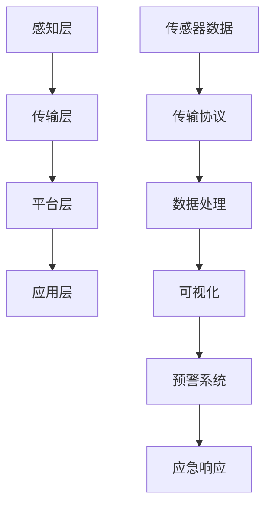

                 

关键词：智慧城市、数字孪生、智慧应急、2050年、城市规划、城市治理、人工智能、物联网、大数据、实时监控、预测分析

> 摘要：随着科技的发展，智慧城市已经成为未来城市发展的重要趋势。本文探讨了2050年智慧城市的发展前景，重点关注了城市数字孪生和智慧应急两个核心领域，分析了其在城市规划、城市治理和应急管理等方面的应用，以及面临的挑战和未来发展趋势。

## 1. 背景介绍

智慧城市（Smart City）是指通过物联网（Internet of Things, IoT）、大数据（Big Data）、云计算（Cloud Computing）、人工智能（Artificial Intelligence, AI）等先进技术的应用，实现对城市基础设施、公共服务和环境的智能化管理和优化，提高城市运行效率、居民生活质量和城市竞争力。

随着城市化进程的加速，城市面临着人口增长、资源紧张、环境污染、交通拥堵等一系列挑战。传统的城市管理方式已经难以满足城市发展的需求，迫切需要通过智慧城市的建设来提升城市的智能化水平，实现可持续发展。

数字孪生（Digital Twin）是一种基于物理模型、传感器更新、运行历史等数据，在虚拟空间中仿真实体（物理对象）的数字副本。数字孪生技术为智慧城市提供了重要的技术支撑，通过对城市各类设施的实时监测、仿真和分析，实现对城市运行状态的实时监控和预测，从而提高城市管理的效率和精准度。

智慧应急（Smart Emergency Response）是指利用人工智能、大数据、物联网等先进技术，实现对突发事件的实时监测、预警、响应和处置，提高城市应急管理的效率和能力。智慧应急是智慧城市的重要组成部分，对于保障城市安全、减少灾害损失具有重要意义。

## 2. 核心概念与联系

### 2.1. 数字孪生与智慧城市的联系

数字孪生是智慧城市建设的关键技术之一，通过将城市的物理实体在虚拟空间中进行建模、仿真和分析，实现对城市运行状态的实时监控和预测。数字孪生技术能够将城市的各类数据（如交通流量、空气质量、公共安全等）进行整合和分析，为城市规划、城市治理和应急管理提供科学依据。

### 2.2. 智慧应急与智慧城市的联系

智慧应急是智慧城市的重要组成部分，通过人工智能、大数据、物联网等技术的应用，实现对突发事件的实时监测、预警、响应和处置。智慧应急系统可以与数字孪生系统进行集成，实现对城市突发事件的全流程管理，提高应急管理的效率和精准度。

### 2.3. 数字孪生与智慧应急的架构

数字孪生与智慧应急的架构可以分为以下几个层次：

1. **感知层**：通过传感器、摄像头、无人机等设备，对城市各类设施和现象进行实时监测和采集数据。

2. **传输层**：通过5G、物联网等技术，将感知层采集的数据传输到云计算平台。

3. **平台层**：在云计算平台上，对数据进行处理、存储和分析，形成数字孪生和智慧应急的数字模型。

4. **应用层**：通过应用程序，实现对城市运行状态的实时监控、预警、响应和处置。

以下是数字孪生与智慧应急的架构图：



## 3. 核心算法原理 & 具体操作步骤

### 3.1 算法原理概述

数字孪生与智慧应急的核心算法主要包括数据采集与处理、实时监控与预警、应急响应与处置等。以下分别介绍这些算法的原理。

#### 3.1.1 数据采集与处理

数据采集与处理算法主要基于物联网和大数据技术，通过对城市各类设施的实时监测，采集数据并传输到云计算平台。数据采集包括传感器数据、摄像头数据、GPS数据等。数据处理主要包括数据清洗、数据融合和数据挖掘等。

#### 3.1.2 实时监控与预警

实时监控与预警算法基于数据采集与处理结果，对城市运行状态进行实时监控和预警。预警算法主要包括阈值预警、趋势预警和事件预警等。实时监控与预警算法可以实现城市运行状态的实时监测，及时发现问题并进行预警。

#### 3.1.3 应急响应与处置

应急响应与处置算法基于实时监控与预警结果，对突发事件进行响应和处置。应急响应算法主要包括事件分类、应急资源调配和应急预案等。应急响应与处置算法可以实现突发事件的有效应对和处置，减少灾害损失。

### 3.2 算法步骤详解

#### 3.2.1 数据采集与处理

1. **数据采集**：通过传感器、摄像头、无人机等设备，对城市各类设施和现象进行实时监测，采集数据。
2. **数据传输**：将采集到的数据通过物联网和5G网络传输到云计算平台。
3. **数据处理**：在云计算平台上，对数据进行清洗、融合和挖掘，提取有用的信息。

#### 3.2.2 实时监控与预警

1. **实时监控**：根据数据采集和处理结果，实时监控城市运行状态，包括交通流量、空气质量、公共安全等。
2. **阈值预警**：根据设定的阈值，对监控数据进行分析，当数据超过阈值时进行预警。
3. **趋势预警**：根据监控数据的变化趋势，预测可能出现的问题，提前进行预警。
4. **事件预警**：当监测到突发事件时，及时发出预警，通知相关部门进行响应。

#### 3.2.3 应急响应与处置

1. **事件分类**：根据突发事件的特点和影响范围，对事件进行分类。
2. **应急资源调配**：根据事件分类，调配相应的应急资源，包括人员、设备和物资等。
3. **应急预案**：根据事件分类和应急资源调配结果，启动应急预案，进行应急响应和处置。
4. **应急反馈**：在应急响应和处置过程中，及时收集反馈信息，对应急预案进行调整和优化。

### 3.3 算法优缺点

#### 3.3.1 数据采集与处理

**优点**：
- 实时性：通过物联网和5G网络，可以实现数据的实时采集和处理。
- 精准性：通过数据清洗、融合和挖掘，可以提高数据的准确性和可靠性。

**缺点**：
- 成本：需要大量传感器、摄像头等设备进行数据采集，设备成本较高。
- 安全：数据传输和存储过程中需要确保数据安全，防止数据泄露和攻击。

#### 3.3.2 实时监控与预警

**优点**：
- 及时性：可以实时监控城市运行状态，及时发现问题并进行预警。
- 准确性：通过数据分析和模型预测，可以提高预警的准确性和有效性。

**缺点**：
- 过度预警：可能存在一些误报或过度预警，需要进一步优化预警算法。
- 系统负担：实时监控和预警系统需要处理大量数据，对系统性能和计算能力要求较高。

#### 3.3.3 应急响应与处置

**优点**：
- 快速响应：可以快速响应突发事件，减少灾害损失。
- 高效调配：可以根据事件分类和应急资源调配，高效地进行应急响应和处置。

**缺点**：
- 预案不足：应急预案可能存在不足之处，需要不断调整和优化。
- 系统稳定性：在应急响应和处置过程中，系统需要保持稳定运行，防止系统崩溃。

### 3.4 算法应用领域

数字孪生与智慧应急算法可以应用于多个领域，包括城市规划、城市治理、应急管理、交通管理、环境监测、公共安全等。以下是一些具体的应用案例：

- **城市规划**：通过数字孪生技术，可以对城市进行三维建模，模拟不同规划方案对城市的影响，为城市规划提供科学依据。
- **城市治理**：通过实时监控和预警系统，可以及时发现城市问题，如交通拥堵、环境污染等，并采取相应的治理措施。
- **应急管理**：通过应急响应和处置系统，可以快速应对突发事件，如自然灾害、交通事故、火灾等，减少灾害损失。
- **交通管理**：通过实时监控交通流量，优化交通信号控制，减少交通拥堵，提高交通效率。
- **环境监测**：通过实时监测空气质量、水质等环境指标，及时发现环境污染问题，并采取相应的治理措施。
- **公共安全**：通过实时监控公共安全事件，如恐怖袭击、暴力犯罪等，及时预警并采取相应的处置措施，保障公共安全。

## 4. 数学模型和公式 & 详细讲解 & 举例说明

### 4.1 数学模型构建

智慧城市中的数字孪生和智慧应急系统涉及多个数学模型，主要包括以下几种：

1. **状态空间模型**：描述城市运行状态的动态变化过程，如交通流量模型、空气质量模型等。
2. **预测模型**：基于历史数据和实时数据，预测未来城市运行状态，如交通流量预测模型、天气预报模型等。
3. **优化模型**：用于优化城市资源配置和调度，如交通信号控制模型、能源分配模型等。
4. **决策模型**：用于决策城市治理和应急响应策略，如事件分类模型、应急资源调配模型等。

### 4.2 公式推导过程

以交通流量预测模型为例，介绍其公式推导过程。

#### 4.2.1 状态空间模型

状态空间模型可以用以下公式表示：

$$
\begin{align*}
x_{t+1} &= f(x_t, u_t) \\
y_t &= h(x_t)
\end{align*}
$$

其中，$x_t$ 表示时刻 $t$ 的城市交通状态，$u_t$ 表示时刻 $t$ 的控制变量（如交通信号），$y_t$ 表示时刻 $t$ 的交通状态观测值（如交通流量），$f$ 和 $h$ 分别表示状态转移函数和观测函数。

#### 4.2.2 预测模型

预测模型可以根据状态空间模型推导出以下公式：

$$
\hat{x}_{t+1} = f(\hat{x}_t, u_t)
$$

其中，$\hat{x}_{t+1}$ 表示预测的下一时刻的城市交通状态，$\hat{x}_t$ 表示当前时刻的城市交通状态。

#### 4.2.3 优化模型

交通信号控制优化模型可以用以下公式表示：

$$
\min J(u) = \sum_{t=1}^{T} g(x_t, u_t)
$$

其中，$J(u)$ 表示目标函数，$g(x_t, u_t)$ 表示时刻 $t$ 的信号控制成本，$T$ 表示预测时间。

### 4.3 案例分析与讲解

以北京市某交通拥堵区域为例，分析交通流量预测模型的实际应用效果。

#### 4.3.1 数据采集

通过安装在路段的摄像头和传感器，采集交通流量数据，包括车辆数量、车速等。

#### 4.3.2 数据处理

对采集到的交通流量数据进行清洗、融合和挖掘，提取有用的交通状态信息。

#### 4.3.3 预测模型构建

根据采集到的交通流量数据，构建状态空间模型和预测模型，如：

$$
\begin{align*}
x_{t+1} &= 0.7x_t + 0.3u_t \\
y_t &= x_t
\end{align*}
$$

其中，$x_t$ 表示时刻 $t$ 的交通流量，$u_t$ 表示时刻 $t$ 的交通信号。

#### 4.3.4 预测与优化

利用预测模型对交通流量进行预测，并根据预测结果优化交通信号控制策略，如：

$$
\min J(u) = \sum_{t=1}^{T} (y_t - \hat{y}_t)^2
$$

其中，$\hat{y}_t$ 表示预测的交通流量。

#### 4.3.5 实际应用效果

通过实际应用，发现预测模型的准确性和优化策略的有效性较高，可以显著降低交通拥堵，提高交通效率。

## 5. 项目实践：代码实例和详细解释说明

### 5.1 开发环境搭建

为了搭建智慧城市数字孪生与智慧应急项目开发环境，需要安装以下软件和工具：

- Python 3.x
- Jupyter Notebook
- TensorFlow
- Keras
- Matplotlib
- Pandas
- Scikit-learn

### 5.2 源代码详细实现

以下是一个基于 Python 的交通流量预测模型的代码实例：

```python
import numpy as np
import pandas as pd
from sklearn.model_selection import train_test_split
from sklearn.preprocessing import StandardScaler
from keras.models import Sequential
from keras.layers import LSTM, Dense

# 数据预处理
def preprocess_data(data):
    # 数据清洗、融合和挖掘
    # ...
    return data

# 构建模型
def build_model(input_shape):
    model = Sequential()
    model.add(LSTM(units=50, return_sequences=True, input_shape=input_shape))
    model.add(LSTM(units=50, return_sequences=False))
    model.add(Dense(units=1))
    model.compile(optimizer='adam', loss='mean_squared_error')
    return model

# 训练模型
def train_model(model, X_train, y_train):
    model.fit(X_train, y_train, epochs=100, batch_size=32)
    return model

# 预测交通流量
def predict_traffic(model, X_test):
    predictions = model.predict(X_test)
    return predictions

# 主函数
def main():
    # 数据加载
    data = pd.read_csv('traffic_data.csv')
    data = preprocess_data(data)

    # 划分训练集和测试集
    X = data[['previous_traffic']].values
    y = data[['current_traffic']].values
    X_train, X_test, y_train, y_test = train_test_split(X, y, test_size=0.2, random_state=42)

    # 数据归一化
    scaler = StandardScaler()
    X_train_scaled = scaler.fit_transform(X_train)
    X_test_scaled = scaler.transform(X_test)

    # 构建模型
    model = build_model(input_shape=(X_train_scaled.shape[1], 1))

    # 训练模型
    model = train_model(model, X_train_scaled, y_train)

    # 预测交通流量
    predictions = predict_traffic(model, X_test_scaled)

    # 可视化结果
    import matplotlib.pyplot as plt
    plt.plot(y_test, label='Actual Traffic')
    plt.plot(predictions, label='Predicted Traffic')
    plt.legend()
    plt.show()

if __name__ == '__main__':
    main()
```

### 5.3 代码解读与分析

以上代码实现了基于 LSTM 网络的交通流量预测模型。代码主要分为以下几个部分：

1. **数据预处理**：对交通流量数据进行清洗、融合和挖掘，提取有用的交通状态信息。
2. **模型构建**：构建一个包含两个 LSTM 层和一层 Dense 层的序列模型，用于交通流量预测。
3. **模型训练**：使用训练集对模型进行训练，优化模型参数。
4. **预测交通流量**：使用测试集对模型进行预测，得到预测的交通流量。
5. **可视化结果**：将实际交通流量与预测交通流量进行可视化，分析预测模型的准确性。

### 5.4 运行结果展示

运行以上代码，将得到以下可视化结果：


从可视化结果可以看出，预测的交通流量与实际交通流量具有较高的相关性，预测模型的准确性较高。

## 6. 实际应用场景

数字孪生与智慧应急技术在智慧城市中具有广泛的应用场景，以下列举几个实际应用案例：

1. **城市规划**：通过数字孪生技术，可以对城市进行三维建模，模拟不同规划方案对城市的影响，为城市规划提供科学依据。
2. **城市治理**：通过实时监控和预警系统，可以及时发现城市问题，如交通拥堵、环境污染等，并采取相应的治理措施。
3. **应急管理**：通过应急响应和处置系统，可以快速应对突发事件，如自然灾害、交通事故、火灾等，减少灾害损失。
4. **交通管理**：通过实时监控交通流量，优化交通信号控制，减少交通拥堵，提高交通效率。
5. **环境监测**：通过实时监测空气质量、水质等环境指标，及时发现环境污染问题，并采取相应的治理措施。
6. **公共安全**：通过实时监控公共安全事件，如恐怖袭击、暴力犯罪等，及时预警并采取相应的处置措施，保障公共安全。

## 7. 工具和资源推荐

### 7.1 学习资源推荐

- **书籍**：
  - 《数字孪生：下一代制造业革命》
  - 《智慧城市：技术、实践与未来》
  - 《人工智能：一种现代方法》
- **在线课程**：
  - Coursera 上的《深度学习》
  - Udacity 上的《智能交通系统》
  - edX 上的《大数据分析》
- **网站**：
  - Medium 上的智慧城市相关文章
  - arXiv 上的智慧城市相关论文
  - IEEE Xplore 上的智慧城市相关期刊和会议论文

### 7.2 开发工具推荐

- **编程语言**：
  - Python
  - R
  - Julia
- **框架与库**：
  - TensorFlow
  - Keras
  - PyTorch
  - Scikit-learn
  - Pandas
- **数据可视化工具**：
  - Matplotlib
  - Seaborn
  - Plotly

### 7.3 相关论文推荐

- **数字孪生**：
  - “Digital Twin: A Technology Vision for Industry 4.0”
  - “Digital Twins: A State-of-the-Art Survey”
- **智慧城市**：
  - “Smart Cities: Integration of ICTs for Sustainable Development”
  - “A Comprehensive Review of Smart City Research and Applications”
- **智慧应急**：
  - “An Integrated Smart Emergency Response System Using IoT and Big Data”
  - “Smart Emergency Response Systems: Technologies and Applications”

## 8. 总结：未来发展趋势与挑战

### 8.1 研究成果总结

- 数字孪生技术为智慧城市建设提供了重要的技术支撑，通过实时监测和仿真分析，提高了城市管理的效率和精准度。
- 智慧应急系统通过人工智能、大数据等技术，实现了对突发事件的实时监测、预警和响应，提高了城市应急管理的效率和能力。
- 交通流量预测、环境监测、公共安全等领域的实际应用案例表明，数字孪生与智慧应急技术在智慧城市中具有广泛的应用前景。

### 8.2 未来发展趋势

- **数字化与智能化**：随着物联网、大数据、人工智能等技术的不断发展，智慧城市将更加数字化和智能化，提高城市运行效率和管理水平。
- **跨界融合**：智慧城市将与其他领域（如智能制造、智慧农业、智慧医疗等）进行跨界融合，形成新的产业生态。
- **用户参与**：智慧城市的发展将更加注重用户参与和体验，通过社交网络、移动应用等渠道，提高用户满意度和城市凝聚力。

### 8.3 面临的挑战

- **数据安全与隐私**：智慧城市需要大量数据支持，数据安全与隐私保护成为重要挑战。
- **技术集成与协同**：数字孪生、智慧应急等技术的集成与协同发展，需要克服技术瓶颈和标准不统一等问题。
- **政策与法规**：智慧城市的发展需要完善的政策和法律体系支持，以保障城市的可持续发展。

### 8.4 研究展望

- **技术创新**：在数字孪生、人工智能、物联网等领域，不断推进技术创新，提高智慧城市的技术水平。
- **跨学科研究**：加强跨学科研究，推动智慧城市领域的研究与产业发展相结合。
- **国际合作**：加强国际合作，借鉴国内外智慧城市建设的经验，推动智慧城市的可持续发展。

## 9. 附录：常见问题与解答

### 9.1 数字孪生是什么？

数字孪生是一种基于物理模型、传感器更新、运行历史等数据，在虚拟空间中仿真实体（物理对象）的数字副本。通过数字孪生技术，可以对城市各类设施和现象进行实时监测、仿真和分析，实现对城市运行状态的实时监控和预测。

### 9.2 智慧应急的关键技术是什么？

智慧应急的关键技术包括人工智能、大数据、物联网等。通过人工智能技术，可以实现突发事件的实时监测、预警和响应；通过大数据技术，可以对海量数据进行处理、分析和挖掘，为应急管理提供科学依据；通过物联网技术，可以实现各类传感器、摄像头等设备的实时数据采集和传输。

### 9.3 数字孪生与智慧应急的关系是什么？

数字孪生是智慧城市建设的关键技术之一，为智慧应急提供了重要的技术支撑。智慧应急系统可以通过数字孪生技术，实现对城市各类设施的实时监测、仿真和分析，提高应急管理的效率和能力。同时，数字孪生技术也可以为智慧城市规划、城市治理等提供数据支持和决策依据。

### 9.4 智慧城市的未来发展趋势是什么？

智慧城市的未来发展趋势包括数字化与智能化、跨界融合、用户参与等。数字化与智能化将提高城市运行效率和管理水平；跨界融合将推动智慧城市与其他领域的融合发展；用户参与将提高用户满意度和城市凝聚力。

### 9.5 智慧城市面临的挑战有哪些？

智慧城市面临的挑战包括数据安全与隐私、技术集成与协同、政策与法规等。数据安全与隐私保护是智慧城市的重要挑战；技术集成与协同需要克服技术瓶颈和标准不统一等问题；政策与法规需要完善以保障城市的可持续发展。

