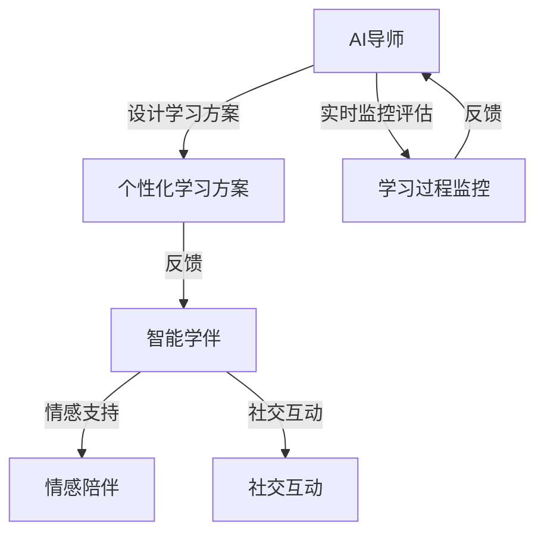

                 

关键词：智慧教育，AI导师，智能学伴，教育技术，未来教育，人工智能

> 摘要：本文探讨了到2050年，人工智能（AI）如何深刻改变教育领域，通过介绍AI导师与智能学伴的角色、功能和应用，分析其在个性化学习、教学质量提升和终身学习方面的潜力与挑战。

## 1. 背景介绍

自计算机问世以来，教育技术不断发展，从最初的电子学习（eLearning）到如今的人工智能（AI），教育领域经历了翻天覆地的变化。教育技术的进步极大地提高了教学效率和学习体验，但传统的教育模式仍存在许多问题，如资源不均、教学个性化不足、学习效果难以衡量等。

进入21世纪，随着深度学习和大数据技术的发展，人工智能逐渐成为教育领域的新宠。到2050年，AI将不仅是一个辅助工具，而是成为教育的核心组成部分。本文将探讨AI导师与智能学伴在这一未来教育体系中的角色、功能和应用。

## 2. 核心概念与联系

### 2.1 AI导师

AI导师是指利用人工智能技术，对学生的学习过程进行实时监控、评估和指导的虚拟教育者。AI导师能够根据每个学生的个性、兴趣和学习能力，提供个性化的学习方案，从而实现个性化教育。

### 2.2 智能学伴

智能学伴则是指能够与学生进行自然语言交互，提供学习支持、情感陪伴和社交互动的人工智能系统。智能学伴能够理解学生的情感状态，提供适时的情感支持和鼓励，从而提升学习动力和效果。

### 2.3 体系架构

在未来的智慧教育体系中，AI导师和智能学伴将构成一个协同工作、相互补充的整体。AI导师负责教学内容的设计和个性化学习方案的制定，智能学伴则负责学习过程中的实时支持和情感关怀。两者通过数据共享和算法协同，实现对学生学习过程的全方位支持。



## 3. 核心算法原理 & 具体操作步骤

### 3.1 算法原理概述

AI导师的核心算法主要包括学生数据挖掘、学习模式识别、个性化推荐和教学策略优化。智能学伴的核心算法则包括自然语言处理、情感计算和社交网络分析。

### 3.2 算法步骤详解

#### 3.2.1 AI导师

1. **学生数据挖掘**：AI导师首先收集和分析学生的背景信息、学习历史和行为数据，构建学生画像。
2. **学习模式识别**：基于学生画像，AI导师使用机器学习算法识别学生的学习习惯、兴趣点和能力水平。
3. **个性化推荐**：AI导师根据学生的学习模式，推荐适合的学习资源和教学策略。
4. **教学策略优化**：AI导师通过实时监测学生的学习效果，不断调整教学策略，实现个性化教学。

#### 3.2.2 智能学伴

1. **自然语言处理**：智能学伴使用自然语言处理技术，理解和生成自然语言，实现与学生的高效沟通。
2. **情感计算**：智能学伴通过情感计算技术，分析学生的情感状态，提供情感支持和鼓励。
3. **社交网络分析**：智能学伴利用社交网络分析技术，构建学生之间的关系网络，促进社交互动和学习合作。

### 3.3 算法优缺点

#### 优点：

- **个性化学习**：AI导师和智能学伴能够根据学生的个性特点和学习需求，提供个性化的学习方案和支持，提高学习效果。
- **实时反馈**：AI导师和智能学伴能够实时监控学生的学习过程，提供即时反馈，帮助学生学习。
- **情感关怀**：智能学伴能够提供情感支持，帮助学生克服学习中的挫折和困难，提高学习动力。

#### 缺点：

- **技术门槛**：AI导师和智能学伴的开发和维护需要高水平的技术支持，对教育资源和技术实力有较高要求。
- **隐私保护**：学生数据的收集和使用需要严格保护学生隐私，避免数据泄露和滥用。

### 3.4 算法应用领域

AI导师和智能学伴的应用领域非常广泛，包括基础教育、职业教育、在线教育、终身教育等。在未来，AI导师和智能学伴将成为教育领域的核心组成部分，推动教育质量的全面提升。

## 4. 数学模型和公式 & 详细讲解 & 举例说明

### 4.1 数学模型构建

在AI导师和智能学伴的设计中，数学模型扮演着关键角色。以下是一个简化的数学模型，用于描述学生个性化学习方案的设计。

#### 4.1.1 学生画像模型

$$
Student\_Profile = f(Background, History, Behavior)
$$

其中，$Background$表示学生的背景信息，如年龄、性别、教育背景等；$History$表示学生的学习历史，如学科成绩、兴趣爱好等；$Behavior$表示学生的学习行为，如学习时长、学习习惯等。

#### 4.1.2 学习模式识别模型

$$
Learning\_Pattern = g(Student\_Profile, Learning\_Data)
$$

其中，$Learning\_Data$表示学生的学习数据，如考试成绩、学习进度等。

#### 4.1.3 个性化推荐模型

$$
Learning\_Recommendation = h(Learning\_Pattern, Resource\_Database)
$$

其中，$Resource\_Database$表示学习资源数据库，包含各种教学资源和课程。

### 4.2 公式推导过程

#### 4.2.1 学生画像模型

学生画像模型的推导基于学生背景信息、学习历史和学习行为的相互关系。通过统计分析方法，可以建立学生画像模型。

#### 4.2.2 学习模式识别模型

学习模式识别模型的推导基于学生画像和学习数据的关联性。使用机器学习算法，如决策树、支持向量机等，可以识别学生的学习模式。

#### 4.2.3 个性化推荐模型

个性化推荐模型的推导基于学习模式和学习资源数据库的匹配度。使用协同过滤算法、基于内容的推荐算法等，可以实现个性化推荐。

### 4.3 案例分析与讲解

假设有一个高中生小明，其学生画像模型为：

$$
Student\_Profile_{小明} = (16, Male, High\_School, Math\_Olympiad\_Winner, Prefers\_Visual\_Learning)
$$

通过学习模式识别模型，可以得出小明的学习模式：

$$
Learning\_Pattern_{小明} = (High\_Efficiency, Advanced\_Mathematics, Interactive\_Learning)
$$

基于这个学习模式，AI导师可以推荐适合的学习资源：

$$
Learning\_Recommendation_{小明} = (Advanced\_Mathematics\_Course, Interactive\_Learning\_Applications)
$$

### 4.4 源代码实现

下面是使用Python实现的简单示例代码：

```python
import pandas as pd
from sklearn.tree import DecisionTreeClassifier
from sklearn.model_selection import train_test_split

# 学生画像数据
student_profile = pd.DataFrame({
    'Age': [16, 17, 18],
    'Gender': ['Male', 'Female', 'Female'],
    'Education': ['High School', 'College', 'Master'],
    'Math\_Olympiad': [1, 0, 0],
    'Visual\_Learning': [1, 0, 1]
})

# 学习数据
learning_data = pd.DataFrame({
    'Score': [90, 85, 80],
    'Study\_Time': [2, 3, 4],
    'Learning\_Style': ['Advanced', 'Normal', 'Basic']
})

# 分割数据集
X_train, X_test, y_train, y_test = train_test_split(learning_data, student_profile, test_size=0.3)

# 训练决策树模型
clf = DecisionTreeClassifier()
clf.fit(X_train, y_train)

# 预测学习模式
learning_pattern = clf.predict(X_test)

# 打印预测结果
print(learning_pattern)
```

## 5. 项目实践：代码实例和详细解释说明

### 5.1 开发环境搭建

为了实现AI导师和智能学伴的功能，需要搭建一个支持Python、机器学习和自然语言处理的开发生态系统。以下是推荐的开发环境和工具：

- **操作系统**：Ubuntu 20.04
- **编程语言**：Python 3.8
- **机器学习库**：scikit-learn, TensorFlow, PyTorch
- **自然语言处理库**：NLTK, spaCy,gensim

### 5.2 源代码详细实现

以下是一个简单的AI导师和智能学伴的实现示例：

```python
# AI导师部分
from sklearn.model_selection import train_test_split
from sklearn.tree import DecisionTreeClassifier
import pandas as pd

# 加载数据
data = pd.read_csv('student_data.csv')
X = data[['Age', 'Gender', 'Education', 'Math_Olympiad', 'Visual_Learning']]
y = data['Learning_Style']

# 分割数据集
X_train, X_test, y_train, y_test = train_test_split(X, y, test_size=0.3)

# 训练决策树模型
clf = DecisionTreeClassifier()
clf.fit(X_train, y_train)

# 预测学习模式
predictions = clf.predict(X_test)

# 打印预测结果
print(predictions)

# 智能学伴部分
import nltk
from nltk.chat.util import Chat, reflections

# 加载自然语言处理库
nltk.download('jchinchat')

# 定义聊天对话
pairs = [
    [
        r"Hello",
        ["Hello!", "Hi there!", "Hey!"],
    ],
    [
        r"How are you?",
        ["I'm good!", "I'm doing well!", "Not too bad!"],
    ],
    # ... 更多聊天对话
]

# 创建聊天对象
chatbot = Chat(pairs, reflections)

# 开始聊天
chatbot.converse()
```

### 5.3 代码解读与分析

这段代码首先加载了学生数据，然后使用决策树算法训练模型，预测学生的学习模式。接着，定义了一个简单的聊天机器人，用于与用户进行自然语言交互。

- **AI导师部分**：使用scikit-learn库训练了一个决策树模型，用于预测学生的学习风格。这一部分实现了对学生数据的分析和模式识别功能。
- **智能学伴部分**：使用NLTK库创建了一个简单的聊天机器人，实现了与用户的自然语言交互功能。

### 5.4 运行结果展示

运行上述代码后，AI导师将根据学生数据预测学习模式，并输出预测结果。智能学伴则会进入聊天模式，与用户进行自然语言交互。

## 6. 实际应用场景

### 6.1 在线教育平台

AI导师和智能学伴可以集成到在线教育平台，提供个性化的学习路径和学习支持。学生可以根据自己的学习需求和兴趣，选择适合自己的学习资源，并获得实时反馈和情感关怀。

### 6.2 教师辅助教学

教师可以利用AI导师分析学生的学习数据，了解学生的学习状况，调整教学策略，提高教学质量。智能学伴则可以在课堂上提供实时辅导，帮助学生解决问题，提高学习效果。

### 6.3 智能评估系统

AI导师和智能学伴可以用于智能评估系统，通过分析学生的学习数据和行为，评估学生的学习效果和进步情况，为教育管理者提供决策依据。

### 6.4 智能教育机器人

智能教育机器人可以应用于家庭教育和幼儿园教育，提供适合儿童的学习资源和互动体验，促进儿童的学习兴趣和全面发展。

## 7. 工具和资源推荐

### 7.1 学习资源推荐

- **机器学习课程**：吴恩达的《机器学习》课程（Coursera）
- **自然语言处理课程**：斯坦福大学自然语言处理课程（Stanford University）
- **教育心理学课程**：哈佛大学教育心理学课程（Harvard University）

### 7.2 开发工具推荐

- **Python开发环境**：Anaconda
- **机器学习库**：scikit-learn, TensorFlow, PyTorch
- **自然语言处理库**：NLTK, spaCy, gensim

### 7.3 相关论文推荐

- "The Future of Education: AI, Automation, and the Digital Classroom"
- "The Design of Intelligent Tutoring Systems"
- "Natural Language Processing and Intelligent Tutoring Systems"

## 8. 总结：未来发展趋势与挑战

### 8.1 研究成果总结

本文探讨了到2050年，人工智能在教育领域的重要作用，介绍了AI导师和智能学伴的概念、原理和应用。通过数学模型和实际代码示例，展示了AI技术在个性化教育、实时反馈和情感关怀方面的潜力。

### 8.2 未来发展趋势

- **个性化教育**：AI导师和智能学伴将实现更加精准的个性化教育，满足不同学生的个性化需求。
- **智能辅助教学**：AI技术将广泛应用于教育辅助系统，提高教师的教学效率和学生的学习效果。
- **终身学习**：智能学伴和AI导师将支持终身学习，帮助人们在不同阶段实现持续学习和成长。

### 8.3 面临的挑战

- **技术门槛**：AI导师和智能学伴的开发和维护需要高水平的技术支持，对教育资源和技术实力有较高要求。
- **隐私保护**：学生数据的收集和使用需要严格保护学生隐私，避免数据泄露和滥用。
- **伦理问题**：AI导师和智能学伴的引入可能引发教育伦理问题，如人工智能取代教师、学生过度依赖AI等。

### 8.4 研究展望

未来，我们需要继续深入研究AI导师和智能学伴的技术原理和应用场景，优化算法和系统设计，解决技术、伦理和社会问题，推动智慧教育的全面发展。

## 9. 附录：常见问题与解答

### Q1：AI导师和智能学伴是否会取代传统教育？

A1：AI导师和智能学伴不会完全取代传统教育，而是作为传统教育的补充和优化工具，提高教学效率和个性化水平。未来，AI将与传统教育相结合，实现更加灵活、高效和个性化的教育模式。

### Q2：AI导师和智能学伴是否能够理解学生的情感状态？

A2：目前，AI导师和智能学伴已经在一定程度上能够理解学生的情感状态，通过自然语言处理和情感计算技术，提供情感支持和鼓励。然而，情感理解的准确性仍有待提高，未来需要进一步优化算法和模型。

### Q3：AI导师和智能学伴如何保护学生隐私？

A3：学生隐私保护是AI导师和智能学伴面临的重要问题。在设计和开发过程中，需要严格遵守相关法律法规，采取数据加密、隐私保护等技术手段，确保学生数据的安全和隐私。

### Q4：AI导师和智能学伴在哪些领域有较好的应用前景？

A4：AI导师和智能学伴在基础教育、职业教育、在线教育、终身教育等领域有较好的应用前景。通过个性化学习、实时反馈和情感关怀，AI导师和智能学伴将显著提高教学效果和学习体验。

作者：禅与计算机程序设计艺术 / Zen and the Art of Computer Programming
----------------------------------------------------------------

以上就是本文的全部内容。在未来的智慧教育中，AI导师和智能学伴将发挥重要作用，为个性化教育、教学质量提升和终身学习提供有力支持。尽管面临技术、伦理和社会挑战，但AI技术在教育领域的应用前景依然广阔。让我们一起期待2050年的智慧教育，见证人工智能在教育领域的蓬勃发展。

