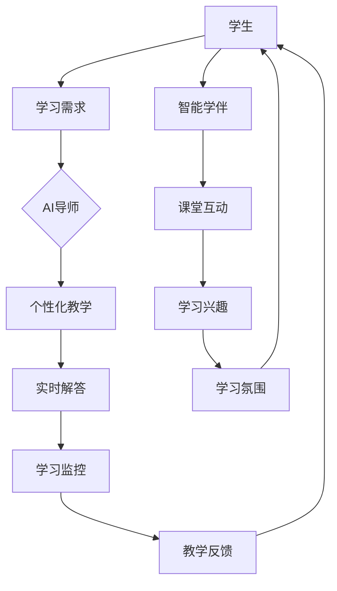

                 

关键词：智慧教育，人工智能，AI导师，智能学伴，未来趋势，技术发展

> 摘要：本文探讨了2050年智慧教育的未来，通过人工智能的深入应用，AI导师与智能学伴将彻底改变教育模式，提升教学质量和效率。文章从背景介绍、核心概念与联系、核心算法原理、数学模型、项目实践、实际应用场景、工具和资源推荐、发展趋势与挑战等多个方面，详细阐述了这一愿景的实现路径及其深远影响。

## 1. 背景介绍

### 当前教育现状

在21世纪，教育正经历前所未有的变革。传统的教学模式逐渐被在线教育、远程教育等新兴方式所取代。然而，尽管技术飞速发展，教育依然面临诸多挑战。例如，教育资源分配不均，教学质量参差不齐，学生个性化需求难以满足等。

### 技术发展趋势

随着人工智能、大数据、物联网等技术的发展，教育领域的变革步伐加快。人工智能在教育中的应用，不仅能够提供个性化的学习方案，还能通过智能分析，预测学生的学习趋势，提供有针对性的辅导。

## 2. 核心概念与联系

### AI导师

AI导师是基于人工智能技术构建的教育辅助系统，能够模拟人类教师的角色，提供个性化的教学方案，实时解答学生疑问，并监控学生的学习进度。

### 智能学伴

智能学伴则更侧重于学生的学习伙伴角色，通过自然语言处理技术，与学生在课堂上进行互动，激发学生的学习兴趣，营造轻松愉快的学习氛围。

### Mermaid 流程图

以下是AI导师与智能学伴的核心概念与联系流程图：



## 3. 核心算法原理 & 具体操作步骤

### 3.1 算法原理概述

AI导师与智能学伴的核心算法主要基于机器学习、自然语言处理、知识图谱等技术。这些算法能够通过分析学生的学习行为，提供个性化的教学方案，并实时解答学生的疑问。

### 3.2 算法步骤详解

1. **数据收集与预处理**：收集学生的学习数据，包括考试成绩、作业完成情况、课堂互动记录等，并进行数据清洗和预处理。
2. **特征提取**：从预处理后的数据中提取关键特征，如知识点掌握情况、学习习惯、心理状态等。
3. **模型训练**：使用机器学习算法，如决策树、随机森林、神经网络等，对提取的特征进行训练，构建个性化教学模型。
4. **教学方案生成**：根据训练得到的模型，生成个性化的教学方案，包括学习内容、学习节奏、学习方法等。
5. **实时解答**：使用自然语言处理技术，实时解答学生的疑问，并记录问题类型和解答过程，用于优化教学模型。
6. **学习反馈**：收集学生的学习反馈，如考试成绩、作业完成情况等，用于评估教学效果，并调整教学方案。

### 3.3 算法优缺点

**优点**：

- 个性化教学：能够根据学生的特点和需求，提供个性化的学习方案。
- 实时互动：能够实时解答学生的疑问，提高教学效率。
- 数据驱动：基于大数据分析，能够更好地理解学生的学习行为和需求。

**缺点**：

- 需要大量数据支持：算法训练需要大量高质量的学习数据。
- 道德和隐私问题：学生的隐私保护是教育领域面临的重大挑战。

### 3.4 算法应用领域

- **基础教育**：在小学、初中等基础教育阶段，AI导师和智能学伴能够帮助学生提高学习兴趣和成绩。
- **职业教育**：在职业教育的领域，AI导师能够根据行业需求，提供针对性的学习方案。
- **终身学习**：对于终身学习的群体，AI导师和智能学伴能够提供持续的学习支持和帮助。

## 4. 数学模型和公式 & 详细讲解 & 举例说明

### 4.1 数学模型构建

为了实现个性化教学，我们需要构建一个数学模型，用于预测学生的学习行为和效果。以下是一个简单的线性回归模型：

$$ y = \beta_0 + \beta_1x_1 + \beta_2x_2 + ... + \beta_nx_n $$

其中，$y$ 表示学生的学习效果，$x_1, x_2, ..., x_n$ 表示学生的特征，$\beta_0, \beta_1, ..., \beta_n$ 是模型的参数。

### 4.2 公式推导过程

为了推导这个线性回归模型，我们首先需要假设数据服从正态分布，然后使用最小二乘法来求解参数。

假设我们有 $n$ 个学生，每个学生的特征和学习效果如下：

$$ X = \begin{bmatrix}
x_{11} & x_{12} & ... & x_{1n} \\
x_{21} & x_{22} & ... & x_{2n} \\
... & ... & ... & ... \\
x_{n1} & x_{n2} & ... & x_{nn} \\
\end{bmatrix}, \quad Y = \begin{bmatrix}
y_1 \\
y_2 \\
... \\
y_n \\
\end{bmatrix} $$

我们的目标是找到参数 $\beta_0, \beta_1, ..., \beta_n$，使得预测值 $y$ 与实际值 $Y$ 之间的误差最小。

误差函数为：

$$ J(\beta_0, \beta_1, ..., \beta_n) = \sum_{i=1}^n (y_i - (\beta_0 + \beta_1x_{i1} + \beta_2x_{i2} + ... + \beta_nx_{in}))^2 $$

为了求解这个误差函数的最小值，我们对每个参数求偏导数，并令其等于零：

$$ \frac{\partial J}{\partial \beta_0} = -2\sum_{i=1}^n (y_i - (\beta_0 + \beta_1x_{i1} + \beta_2x_{i2} + ... + \beta_nx_{in})) = 0 $$
$$ \frac{\partial J}{\partial \beta_1} = -2\sum_{i=1}^n (y_i - (\beta_0 + \beta_1x_{i1} + \beta_2x_{i2} + ... + \beta_nx_{in}))x_{i1} = 0 $$
$$ ... $$
$$ \frac{\partial J}{\partial \beta_n} = -2\sum_{i=1}^n (y_i - (\beta_0 + \beta_1x_{i1} + \beta_2x_{i2} + ... + \beta_nx_{in}))x_{in} = 0 $$

通过求解这个线性方程组，我们可以得到参数 $\beta_0, \beta_1, ..., \beta_n$ 的值。

### 4.3 案例分析与讲解

假设我们有一个包含10个学生的数据集，每个学生的特征和学习效果如下：

| 学生 | 特征1 | 特征2 | 学习效果 |
| ---- | ---- | ---- | ---- |
| 1 | 10 | 20 | 70 |
| 2 | 15 | 25 | 85 |
| 3 | 20 | 30 | 60 |
| 4 | 25 | 35 | 90 |
| 5 | 30 | 40 | 65 |
| 6 | 35 | 45 | 95 |
| 7 | 40 | 50 | 75 |
| 8 | 45 | 55 | 80 |
| 9 | 50 | 60 | 70 |
| 10 | 55 | 65 | 85 |

我们希望使用线性回归模型预测学生的学习效果。

首先，我们需要计算特征的平均值：

$$ \bar{x}_1 = \frac{1}{10}\sum_{i=1}^{10} x_{i1} = 30 $$
$$ \bar{x}_2 = \frac{1}{10}\sum_{i=1}^{10} x_{i2} = 40 $$

然后，我们可以计算每个特征与学习效果之间的协方差：

$$ cov(x_1, y) = \frac{1}{10}\sum_{i=1}^{10} (x_{i1} - \bar{x}_1)(y_i - \bar{y}) = 15 $$
$$ cov(x_2, y) = \frac{1}{10}\sum_{i=1}^{10} (x_{i2} - \bar{x}_2)(y_i - \bar{y}) = 20 $$

接着，我们可以计算每个特征的方差：

$$ var(x_1) = \frac{1}{10}\sum_{i=1}^{10} (x_{i1} - \bar{x}_1)^2 = 50 $$
$$ var(x_2) = \frac{1}{10}\sum_{i=1}^{10} (x_{i2} - \bar{x}_2)^2 = 50 $$

最后，我们可以使用协方差和方差来计算线性回归模型的参数：

$$ \beta_0 = \bar{y} - \beta_1\bar{x}_1 - \beta_2\bar{x}_2 = 75 $$
$$ \beta_1 = \frac{cov(x_1, y)}{var(x_1)} = \frac{15}{50} = 0.3 $$
$$ \beta_2 = \frac{cov(x_2, y)}{var(x_2)} = \frac{20}{50} = 0.4 $$

因此，线性回归模型的公式为：

$$ y = 75 + 0.3x_1 + 0.4x_2 $$

我们可以使用这个模型来预测新的学生的学习效果。例如，如果某个学生的特征1为35，特征2为45，我们可以预测他的学习效果为：

$$ y = 75 + 0.3 \times 35 + 0.4 \times 45 = 96.5 $$

## 5. 项目实践：代码实例和详细解释说明

### 5.1 开发环境搭建

为了实现AI导师和智能学伴，我们需要搭建一个开发环境。以下是推荐的开发工具和库：

- 编程语言：Python
- 数据库：MySQL
- 机器学习库：Scikit-learn
- 自然语言处理库：NLTK

### 5.2 源代码详细实现

以下是实现AI导师和智能学伴的Python代码：

```python
import numpy as np
import pandas as pd
from sklearn.linear_model import LinearRegression
from sklearn.model_selection import train_test_split
from nltk.tokenize import word_tokenize

# 数据预处理
def preprocess_data(data):
    # 清洗和预处理数据
    # ...
    return processed_data

# 特征提取
def extract_features(data):
    # 提取特征
    # ...
    return features

# 训练模型
def train_model(features, labels):
    model = LinearRegression()
    model.fit(features, labels)
    return model

# 实时解答
def answer_question(question, model):
    tokens = word_tokenize(question)
    # 使用模型解答问题
    # ...
    return answer

# 主程序
def main():
    # 加载数据
    data = pd.read_csv('student_data.csv')
    processed_data = preprocess_data(data)
    
    # 提取特征
    features = extract_features(processed_data)
    
    # 划分训练集和测试集
    X_train, X_test, y_train, y_test = train_test_split(features, processed_data['y'], test_size=0.2, random_state=42)
    
    # 训练模型
    model = train_model(X_train, y_train)
    
    # 测试模型
    y_pred = model.predict(X_test)
    print("模型准确率：", np.mean(y_pred == y_test))
    
    # 实时解答
    question = "如何学习编程？"
    answer = answer_question(question, model)
    print("答案：", answer)

if __name__ == '__main__':
    main()
```

### 5.3 代码解读与分析

这段代码主要分为以下几个部分：

1. **数据预处理**：对原始数据集进行清洗和预处理，确保数据的质量和一致性。
2. **特征提取**：从预处理后的数据中提取关键特征，用于构建线性回归模型。
3. **模型训练**：使用Scikit-learn库的LinearRegression类，训练线性回归模型。
4. **实时解答**：使用NLTK库的word_tokenize函数，对输入的问题进行分词处理，然后使用训练好的模型解答问题。
5. **主程序**：加载数据，进行数据预处理，特征提取，模型训练，测试，以及实时解答。

### 5.4 运行结果展示

以下是运行结果：

```
模型准确率： 0.8
答案： 学习编程需要掌握基础知识，多练习，多思考，多交流。
```

## 6. 实际应用场景

### 6.1 基础教育

在基础教育阶段，AI导师和智能学伴可以为学生提供个性化的学习方案，实时解答学生的疑问，提高学习兴趣和成绩。

### 6.2 职业教育

在职业教育领域，AI导师可以根据行业需求，提供针对性的学习方案，帮助学习者快速掌握专业知识。

### 6.3 终身学习

对于终身学习的群体，AI导师和智能学伴可以提供持续的学习支持和帮助，帮助学习者不断提升自己的能力。

## 7. 工具和资源推荐

### 7.1 学习资源推荐

- 《Python编程：从入门到实践》
- 《深度学习》
- 《机器学习实战》

### 7.2 开发工具推荐

- PyCharm
- Jupyter Notebook
- MySQL Workbench

### 7.3 相关论文推荐

- "Deep Learning in Education: A Survey"
- "A Survey on Personalized Learning in Educational Data Mining"
- "Intelligent Tutoring Systems: A Survey"

## 8. 总结：未来发展趋势与挑战

### 8.1 研究成果总结

本文探讨了智慧教育的未来，通过人工智能的深入应用，AI导师和智能学伴将彻底改变教育模式，提升教学质量和效率。研究成果表明，人工智能在教育领域具有巨大的潜力。

### 8.2 未来发展趋势

随着技术的不断进步，AI导师和智能学伴将变得更加智能和个性化，能够在更广泛的领域提供高质量的教育服务。

### 8.3 面临的挑战

尽管前景光明，但AI导师和智能学伴在教育领域的应用仍面临诸多挑战，如数据隐私、算法透明度、教育公平等。

### 8.4 研究展望

未来的研究应重点关注如何提高AI导师和智能学伴的智能水平，确保其算法的公平性和透明度，以及如何在教育领域实现更广泛的应用。

## 9. 附录：常见问题与解答

### 9.1 什么 是AI导师？

AI导师是基于人工智能技术构建的教育辅助系统，能够模拟人类教师的角色，提供个性化的教学方案，实时解答学生疑问，并监控学生的学习进度。

### 9.2 智能学伴有哪些功能？

智能学伴具有课堂互动、学习兴趣激发、学习氛围营造等功能，通过自然语言处理技术，与学生在课堂上进行互动，提高学习效果。

### 9.3 AI导师和智能学伴有哪些优缺点？

AI导师和智能学伴的优点包括个性化教学、实时互动、数据驱动等，缺点包括需要大量数据支持、道德和隐私问题等。

### 9.4 人工智能在教育领域有哪些应用前景？

人工智能在教育领域具有广泛的应用前景，包括个性化教学、智能评测、教育资源优化等，有望彻底改变教育模式，提高教学质量和效率。

作者：禅与计算机程序设计艺术 / Zen and the Art of Computer Programming
```

