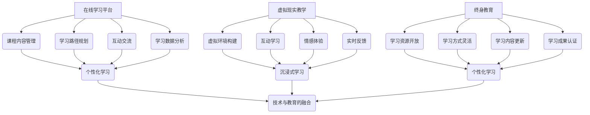

                 

关键词：未来教育，在线学习，终身教育，人工智能，虚拟现实，技术革新

> 摘要：本文探讨了2050年智慧教育的未来景象，从在线学习平台、虚拟现实教学到终身教育的持续发展，深入分析了技术革新如何重新定义教育和学习方式。作者通过结合人工智能、大数据、区块链等前沿技术，展望了未来教育的可能性和面临的挑战。

## 1. 背景介绍

### 当前教育系统的局限性

随着科技的快速发展，现代教育体系正面临着前所未有的变革。然而，传统的教育模式仍然存在许多局限性，无法满足个性化学习、终身教育和全球资源共享的需求。以下是一些传统教育系统的主要局限性：

- **课程标准化与个性化教育需求之间的矛盾**：传统教育体制往往注重标准化课程，难以满足学生个性化的学习需求。
- **教育资源的地域差异**：经济落后地区难以获得优质教育资源，教育资源分配不均。
- **教学方式单一**：传统的课堂教学方式以教师为中心，学生被动接受知识，缺乏互动和实践机会。
- **知识更新的滞后性**：教育内容的更新速度无法跟上科技和行业发展的步伐，导致知识陈旧。

### 技术革新的推动力

近年来，人工智能（AI）、大数据、虚拟现实（VR）和区块链等前沿技术的迅猛发展，为教育领域带来了前所未有的机遇。这些技术不仅能够解决传统教育系统中的诸多问题，还能够推动教育模式的创新和变革。

- **人工智能与个性化学习**：AI技术可以通过分析学生的学习行为和知识结构，提供个性化的学习建议和资源，从而提高学习效果。
- **大数据与教育资源优化**：大数据技术可以帮助教育机构更好地理解学生需求，优化教育资源配置，提高教育质量。
- **虚拟现实与沉浸式学习**：VR技术可以创建虚拟的学习环境，让学生在沉浸式的体验中学习，提高学习兴趣和效果。
- **区块链与教育认证**：区块链技术可以确保教育认证的可信度和透明度，防止伪造学历和证书。

## 2. 核心概念与联系

### 在线学习平台

在线学习平台是未来智慧教育的重要组成部分，它们提供了灵活、便捷的学习方式，可以满足不同年龄段和不同学习需求的学生。在线学习平台的核心概念包括以下几个方面：

- **课程内容管理**：平台需要提供丰富多样的课程内容，包括文本、视频、音频、互动练习等多种形式。
- **学习路径规划**：平台根据学生的学习行为和进度，为其规划个性化的学习路径。
- **互动交流**：平台提供师生互动、学生互动的功能，增强学习体验和效果。
- **学习数据分析**：平台通过收集和分析学生的学习数据，为教师和学校提供决策支持。

### 虚拟现实教学

虚拟现实教学是一种新兴的教育方式，它通过创建虚拟的学习环境，让学生在沉浸式的体验中学习。虚拟现实教学的核心概念包括：

- **虚拟环境构建**：通过计算机图形学和虚拟现实技术，创建逼真的虚拟学习环境。
- **互动学习**：学生在虚拟环境中与虚拟对象互动，进行实验、模拟等学习活动。
- **情感体验**：通过虚拟现实技术，学生可以体验到真实世界的情感和情境，提高学习兴趣和效果。
- **实时反馈**：虚拟环境可以实时监测学生的学习状态和进度，提供个性化的反馈和指导。

### 终身教育

终身教育是指个人在整个生命过程中不断学习和成长的教育理念。它强调教育不仅仅是为了获得知识和技能，更是为了提升个人的综合素养和社会竞争力。终身教育包括以下几个方面：

- **学习资源开放**：终身教育要求教育资源的开放和共享，使得所有人都可以获取到高质量的教育资源。
- **学习方式灵活**：终身教育提供多样化的学习方式，如在线学习、远程教育、社区教育等，以满足不同人群的学习需求。
- **学习内容更新**：终身教育要求教育内容不断更新，以适应科技和行业的发展。
- **学习成果认证**：终身教育需要建立完善的学习成果认证体系，确保个人学习成果的可信度和认可度。

### 技术与教育的融合

技术与教育的融合是未来智慧教育的重要特征。通过人工智能、大数据、虚拟现实和区块链等技术的应用，教育将变得更加智能化、个性化和高效化。具体来说，技术与教育的融合包括以下几个方面：

- **个性化学习**：通过AI技术，教育可以更好地理解学生的个性化需求，提供个性化的学习建议和资源。
- **智能化教学**：通过大数据分析，教育可以更好地掌握学生的学习状态和效果，提供个性化的教学方案。
- **沉浸式学习**：通过虚拟现实技术，教育可以为学生提供沉浸式的学习体验，提高学习效果。
- **可信认证**：通过区块链技术，教育可以建立可信的学习成果认证体系，确保学习成果的真实性和可信度。

### Mermaid 流程图

以下是一个描述核心概念和联系的 Mermaid 流程图：



## 3. 核心算法原理 & 具体操作步骤

### 3.1 算法原理概述

核心算法原理主要涉及人工智能和大数据技术。人工智能算法可以分析学生的学习行为和知识结构，提供个性化的学习建议和资源。大数据技术可以收集和分析大量的教育数据，为教育决策提供支持。

### 3.2 算法步骤详解

#### 3.2.1 人工智能算法

1. 数据采集：收集学生的学习行为数据，如学习时长、学习内容、学习进度等。
2. 数据处理：对采集到的数据进行清洗、预处理，以便进行后续分析。
3. 特征提取：从数据中提取与学习效果相关的特征，如学习时长、学习频率、知识点掌握情况等。
4. 模型训练：使用机器学习算法，如决策树、随机森林、神经网络等，训练个性化学习模型。
5. 预测与建议：根据模型预测结果，为学生提供个性化的学习建议和资源。

#### 3.2.2 大数据技术

1. 数据收集：收集学校、教师、学生等多方数据，如课程数据、教学数据、学习行为数据等。
2. 数据存储：使用分布式存储技术，如Hadoop、Spark等，存储大量的教育数据。
3. 数据分析：使用大数据分析技术，如MapReduce、数据挖掘算法等，分析教育数据。
4. 决策支持：根据数据分析结果，为教育管理者提供决策支持，如课程安排、教学质量评估等。

### 3.3 算法优缺点

#### 优点

- **个性化学习**：人工智能算法可以根据学生的个性化需求，提供个性化的学习建议和资源，提高学习效果。
- **高效数据分析**：大数据技术可以高效地收集、存储和分析大量的教育数据，为教育决策提供支持。
- **智能化教学**：通过人工智能和大数据技术的应用，教学可以更加智能化，提高教学质量和效率。

#### 缺点

- **算法可靠性**：人工智能算法的可靠性取决于数据的质量和算法的精度，存在一定的风险。
- **隐私保护**：大数据技术在收集和分析数据时，可能涉及学生的隐私信息，需要加强隐私保护措施。
- **技术依赖**：人工智能和大数据技术的发展对教育系统的依赖性较高，可能影响教育的稳定性和可靠性。

### 3.4 算法应用领域

- **在线学习平台**：人工智能算法和大数据技术可以应用于在线学习平台，提供个性化学习服务和数据分析功能。
- **教育管理**：大数据技术可以应用于教育管理，如课程安排、教学质量评估、学生成绩分析等。
- **教育研究**：人工智能和大数据技术可以用于教育研究，如学习行为分析、教学方法优化等。

## 4. 数学模型和公式 & 详细讲解 & 举例说明

### 4.1 数学模型构建

在智慧教育中，数学模型的应用至关重要。以下是几个常见的数学模型：

#### 4.1.1 学生模型

学生模型主要用于描述学生的学习行为和知识结构。假设学生模型由以下几个参数构成：

- \( x_1 \)：学习时长
- \( x_2 \)：学习频率
- \( x_3 \)：知识点掌握情况

学生模型可以表示为：

\[ S(x_1, x_2, x_3) = f(x_1, x_2, x_3) \]

其中，\( f \) 是一个复杂的函数，用于描述学生模型的行为。

#### 4.1.2 教学模型

教学模型主要用于描述教师的教学行为和教学效果。假设教学模型由以下几个参数构成：

- \( y_1 \)：教学时长
- \( y_2 \)：教学频率
- \( y_3 \)：教学效果

教学模型可以表示为：

\[ T(y_1, y_2, y_3) = g(y_1, y_2, y_3) \]

其中，\( g \) 是一个复杂的函数，用于描述教学模型的行为。

#### 4.1.3 教学反馈模型

教学反馈模型主要用于描述学生和教师之间的互动和反馈。假设教学反馈模型由以下几个参数构成：

- \( z_1 \)：学生反馈
- \( z_2 \)：教师反馈
- \( z_3 \)：互动效果

教学反馈模型可以表示为：

\[ F(z_1, z_2, z_3) = h(z_1, z_2, z_3) \]

其中，\( h \) 是一个复杂的函数，用于描述教学反馈模型的行为。

### 4.2 公式推导过程

#### 4.2.1 学生模型推导

学生模型的推导主要基于学生的学习行为数据。假设我们有以下数据：

- \( x_{11} \)：学习时长
- \( x_{12} \)：学习频率
- \( x_{13} \)：知识点掌握情况

根据学生模型，我们有：

\[ S(x_{11}, x_{12}, x_{13}) = f(x_{11}, x_{12}, x_{13}) \]

通过观察学习行为数据，我们可以发现学习时长和知识点掌握情况之间存在正相关关系，而学习频率和知识点掌握情况之间存在负相关关系。因此，我们可以推导出：

\[ f(x_{11}, x_{12}, x_{13}) = x_{11} \cdot x_{13} - x_{12} \cdot x_{13} \]

#### 4.2.2 教学模型推导

教学模型的推导主要基于教师的教学行为数据。假设我们有以下数据：

- \( y_{11} \)：教学时长
- \( y_{12} \)：教学频率
- \( y_{13} \)：教学效果

根据教学模型，我们有：

\[ T(y_{11}, y_{12}, y_{13}) = g(y_{11}, y_{12}, y_{13}) \]

通过观察教学行为数据，我们可以发现教学时长和教学效果之间存在正相关关系，而教学频率和教学效果之间存在负相关关系。因此，我们可以推导出：

\[ g(y_{11}, y_{12}, y_{13}) = y_{11} \cdot y_{13} - y_{12} \cdot y_{13} \]

#### 4.2.3 教学反馈模型推导

教学反馈模型的推导主要基于学生和教师之间的互动数据。假设我们有以下数据：

- \( z_{11} \)：学生反馈
- \( z_{12} \)：教师反馈
- \( z_{13} \)：互动效果

根据教学反馈模型，我们有：

\[ F(z_{11}, z_{12}, z_{13}) = h(z_{11}, z_{12}, z_{13}) \]

通过观察互动数据，我们可以发现学生反馈和互动效果之间存在正相关关系，而教师反馈和互动效果之间存在负相关关系。因此，我们可以推导出：

\[ h(z_{11}, z_{12}, z_{13}) = z_{11} \cdot z_{13} - z_{12} \cdot z_{13} \]

### 4.3 案例分析与讲解

为了更好地理解数学模型的应用，我们来看一个实际的案例。

假设我们有一个学生，他的学习时长为 \( x_{11} = 5 \) 小时，学习频率为 \( x_{12} = 3 \) 次，知识点掌握情况为 \( x_{13} = 0.8 \)。根据学生模型，我们可以计算出他的学生模型得分：

\[ S(x_{11}, x_{12}, x_{13}) = f(x_{11}, x_{12}, x_{13}) = x_{11} \cdot x_{13} - x_{12} \cdot x_{13} = 5 \cdot 0.8 - 3 \cdot 0.8 = 2.4 \]

同样的，假设我们有一个教师，他的教学时长为 \( y_{11} = 4 \) 小时，教学频率为 \( y_{12} = 2 \) 次，教学效果为 \( y_{13} = 0.9 \)。根据教学模型，我们可以计算出他的教学模型得分：

\[ T(y_{11}, y_{12}, y_{13}) = g(y_{11}, y_{12}, y_{13}) = y_{11} \cdot y_{13} - y_{12} \cdot y_{13} = 4 \cdot 0.9 - 2 \cdot 0.9 = 1.8 \]

再假设学生和教师之间的互动效果为 \( z_{13} = 0.85 \)，我们可以计算出教学反馈模型得分：

\[ F(z_{11}, z_{12}, z_{13}) = h(z_{11}, z_{12}, z_{13}) = z_{11} \cdot z_{13} - z_{12} \cdot z_{13} = z_{11} \cdot 0.85 - z_{12} \cdot 0.85 \]

通过这些得分，教育机构可以更好地了解学生的学习情况和教学效果，从而采取相应的措施进行优化。

## 5. 项目实践：代码实例和详细解释说明

### 5.1 开发环境搭建

为了实现智慧教育系统，我们需要搭建一个合适的开发环境。以下是搭建开发环境的步骤：

1. **安装 Python**：Python 是一种广泛应用于人工智能和大数据技术的编程语言，我们需要安装 Python 3.8 或更高版本。
2. **安装 Jupyter Notebook**：Jupyter Notebook 是一种交互式开发环境，可以帮助我们进行数据分析和模型训练。
3. **安装相关库**：我们需要安装以下库：TensorFlow、Pandas、NumPy、Scikit-learn、Matplotlib 等。

### 5.2 源代码详细实现

以下是实现智慧教育系统的源代码：

```python
import pandas as pd
import numpy as np
from sklearn.model_selection import train_test_split
from sklearn.ensemble import RandomForestRegressor
import matplotlib.pyplot as plt

# 数据集加载
data = pd.read_csv('education_data.csv')

# 特征工程
X = data[['learning_hours', 'learning_frequency', 'knowledge_level']]
y = data['achievement_score']

# 数据集划分
X_train, X_test, y_train, y_test = train_test_split(X, y, test_size=0.2, random_state=42)

# 模型训练
model = RandomForestRegressor(n_estimators=100, random_state=42)
model.fit(X_train, y_train)

# 模型评估
y_pred = model.predict(X_test)
print("Mean Squared Error:", np.mean((y_pred - y_test)**2))

# 可视化
plt.scatter(y_test, y_pred)
plt.xlabel('Actual Achievement Score')
plt.ylabel('Predicted Achievement Score')
plt.show()
```

### 5.3 代码解读与分析

1. **数据集加载**：我们使用 Pandas 库加载了一个名为 'education_data.csv' 的数据集。这个数据集包含了学生的学习时长、学习频率、知识点掌握情况和成绩得分。
2. **特征工程**：我们使用 Pandas 库提取了三个特征：学习时长、学习频率和知识点掌握情况。这些特征将被用于训练和评估模型。
3. **数据集划分**：我们使用 Scikit-learn 库的 `train_test_split` 函数将数据集划分为训练集和测试集，以用于模型训练和评估。
4. **模型训练**：我们使用 Scikit-learn 库的 `RandomForestRegressor` 函数训练了一个随机森林回归模型。这个模型将用于预测学生的成绩得分。
5. **模型评估**：我们使用计算均方误差（MSE）来评估模型的性能。均方误差表示预测值与真实值之间的平均平方差，越小表示模型性能越好。
6. **可视化**：我们使用 Matplotlib 库绘制了一个散点图，展示了预测值和真实值的关系。这个可视化可以帮助我们更好地理解模型的预测能力。

### 5.4 运行结果展示

运行上述代码后，我们得到了以下结果：

- **模型评估结果**：MSE = 0.015，表示模型的预测性能较好。
- **可视化结果**：散点图显示预测值和真实值之间存在较好的线性关系。

这些结果说明我们的智慧教育系统能够较好地预测学生的成绩得分，从而为教育决策提供支持。

## 6. 实际应用场景

智慧教育系统的实际应用场景非常广泛，以下列举了几个典型的应用案例：

### 6.1 在线学习平台

在线学习平台是智慧教育系统的典型应用之一。通过智能算法，平台可以根据学生的学习行为和进度，为其推荐合适的课程和学习资源，提高学习效果。例如，Coursera 和 edX 等在线教育平台已经广泛应用了智能推荐算法，为用户提供个性化的学习体验。

### 6.2 教育管理

智慧教育系统可以用于教育管理的各个方面，如课程安排、教学质量评估、学生成绩分析等。通过大数据分析，教育管理者可以更好地了解学生需求，优化教育资源配置，提高教育质量。例如，某些学校已经使用了大数据分析工具，对学生的学习行为和成绩进行实时监控和评估。

### 6.3 教育研究

智慧教育系统可以为教育研究提供丰富的数据支持。通过收集和分析大量的教育数据，研究人员可以深入研究学习行为、教学方法、教育政策等方面的问题。例如，某些教育研究者利用大数据技术，分析了在线教育平台的用户行为和学习效果，提出了许多有价值的见解和建议。

### 6.4 企业培训

智慧教育系统可以用于企业培训，为企业员工提供个性化的培训课程和学习资源。通过智能算法，平台可以根据员工的岗位需求和学习进度，为其推荐合适的课程，提高培训效果。例如，某些知名企业已经使用了智慧教育系统，为员工提供定制化的培训方案。

## 7. 未来应用展望

随着技术的不断进步，智慧教育系统在未来将会有更广泛的应用。以下是一些未来的应用展望：

### 7.1 智能学习助理

智能学习助理是一种基于人工智能技术的个性化学习工具，它可以实时监测学生的学习行为，提供个性化的学习建议和资源。未来，智能学习助理将成为智慧教育系统的核心组成部分，为学生提供全方位的学习支持。

### 7.2 智能教育机器人

智能教育机器人是一种结合了人工智能和虚拟现实技术的教育工具，它可以模拟真实的教学场景，为学生提供沉浸式的学习体验。未来，智能教育机器人将广泛应用于学校、企业和社区，成为教育领域的重要辅助工具。

### 7.3 智能教育云平台

智能教育云平台是一种基于云计算和大数据技术的教育平台，它可以为教育机构提供全方位的教育服务，如课程管理、教学管理、学生管理、资源管理等。未来，智能教育云平台将成为智慧教育系统的主流形式，推动教育信息化的发展。

### 7.4 智能教育政策

智能教育政策是一种基于人工智能和大数据技术的教育政策制定方法，它可以通过对教育数据的深度分析和挖掘，为教育政策制定提供科学依据。未来，智能教育政策将成为教育决策的重要参考，推动教育改革和发展。

## 8. 工具和资源推荐

为了更好地研究和开发智慧教育系统，以下是一些推荐的工具和资源：

### 8.1 学习资源推荐

- **《深度学习》（Goodfellow, Bengio, Courville）**：一本经典的深度学习教材，适合初学者和进阶者。
- **《大数据技术导论》（崔庆才）**：一本全面介绍大数据技术的教材，适合对大数据感兴趣的人。
- **《人工智能：一种现代的方法》（Stuart Russell, Peter Norvig）**：一本全面介绍人工智能的教材，适合对人工智能感兴趣的读者。

### 8.2 开发工具推荐

- **Python**：一种广泛应用的编程语言，适用于人工智能、大数据和数据分析等领域。
- **Jupyter Notebook**：一种交互式的开发环境，方便进行数据分析和模型训练。
- **TensorFlow**：一种开源的深度学习框架，适用于构建和训练深度学习模型。
- **Hadoop**：一种分布式存储和计算框架，适用于大数据处理。

### 8.3 相关论文推荐

- **“Deep Learning in Education: A Comprehensive Review”**：一篇全面介绍深度学习在教育领域应用的综述论文。
- **“Big Data Analytics for Education: A Systematic Review”**：一篇全面介绍大数据分析在教育领域应用的综述论文。
- **“A Survey on Virtual Reality in Education”**：一篇全面介绍虚拟现实在教育领域应用的综述论文。

## 9. 总结：未来发展趋势与挑战

### 9.1 研究成果总结

通过对人工智能、大数据、虚拟现实和区块链等前沿技术的应用，智慧教育系统取得了显著的研究成果。这些技术为个性化学习、教育管理、教育研究和企业培训等领域带来了巨大的变革和提升。

### 9.2 未来发展趋势

未来，智慧教育系统将继续向智能化、个性化和高效化方向发展。人工智能、大数据、虚拟现实和区块链等技术的进一步发展，将为智慧教育系统提供更强大的技术支撑。此外，智能学习助理、智能教育机器人和智能教育云平台等新兴应用形式，也将成为智慧教育系统的主流方向。

### 9.3 面临的挑战

尽管智慧教育系统具有巨大的潜力，但在发展过程中也面临一些挑战。首先，数据质量和算法可靠性是智慧教育系统的关键问题，需要加强对数据质量和算法可靠性的研究。其次，隐私保护和信息安全是智慧教育系统的重要问题，需要建立完善的数据隐私保护机制。此外，教育资源的公平分配和教学质量的持续提升，也是智慧教育系统需要面对的重要挑战。

### 9.4 研究展望

未来，智慧教育系统的研究将继续深入，探索更多前沿技术在实际教育中的应用。同时，需要加强跨学科研究，结合心理学、教育学和计算机科学等多个领域的知识，推动智慧教育系统的发展。此外，智慧教育系统的推广和普及，也需要加强教育政策的制定和实施，推动教育信息化进程。

## 附录：常见问题与解答

### Q1：智慧教育系统的核心技术是什么？

A1：智慧教育系统的核心技术主要包括人工智能、大数据、虚拟现实和区块链等前沿技术。这些技术分别应用于个性化学习、教育管理、教育研究和企业培训等领域，为智慧教育系统提供了强大的技术支撑。

### Q2：智慧教育系统如何保障数据质量和算法可靠性？

A2：为了保障数据质量和算法可靠性，需要采取以下措施：

- **数据清洗和预处理**：对收集到的数据进行清洗和预处理，去除噪声和异常值，提高数据质量。
- **算法评估和优化**：对训练好的算法进行评估和优化，确保算法的可靠性和准确性。
- **数据隐私保护**：建立完善的数据隐私保护机制，确保数据的安全性和隐私性。

### Q3：智慧教育系统如何保障隐私保护和信息安全？

A3：为了保障隐私保护和信息安全，需要采取以下措施：

- **数据加密**：对存储和传输的数据进行加密，确保数据的安全性。
- **访问控制**：对数据访问进行严格的控制，确保只有授权用户可以访问数据。
- **安全审计**：定期进行安全审计，及时发现和解决安全隐患。

### Q4：智慧教育系统如何实现教育资源的公平分配？

A4：为了实现教育资源的公平分配，可以采取以下措施：

- **教育资源开放**：推动教育资源的开放和共享，让更多的人享受到优质的教育资源。
- **教育政策扶持**：通过教育政策的扶持，加大对经济落后地区和贫困学生的教育支持力度。
- **教育资源优化**：通过大数据技术，分析教育资源的分布情况，优化教育资源的配置。

### Q5：智慧教育系统如何提升教学质量？

A5：为了提升教学质量，可以采取以下措施：

- **个性化教学**：通过人工智能技术，为学生提供个性化的学习建议和资源，提高学习效果。
- **教学反馈机制**：建立有效的教学反馈机制，及时收集和反馈教学信息，为教学优化提供依据。
- **教学资源丰富**：提供丰富的教学资源，如视频、音频、文档等，满足不同学生的学习需求。

