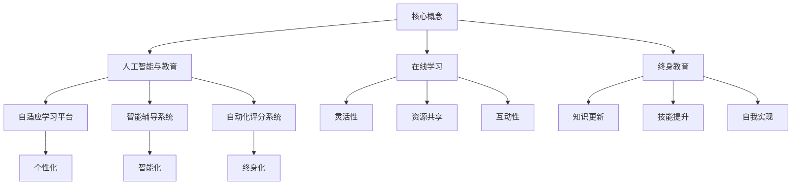

                 

关键词：智慧教育、在线学习、终身教育、人工智能、技术发展、教育变革

> 摘要：随着人工智能技术的迅猛发展，教育领域正经历着深刻的变革。本文旨在探讨2050年，智慧教育将如何重塑在线学习与终身教育，带来前所未有的机遇与挑战。通过分析核心概念、算法原理、数学模型、项目实践和应用场景，本文为未来教育提供了一份前瞻性的蓝图。

## 1. 背景介绍

自互联网和移动设备的普及以来，在线学习已经成为教育变革的重要驱动力。然而，随着人工智能（AI）技术的不断进步，在线学习正迎来更加智能化和个性化的未来。从自适应学习到个性化推荐，AI技术已经在教育领域展示出了其巨大的潜力。

在过去的几十年里，教育行业已经看到了在线学习的巨大变革。远程教育平台、开放教育资源（OER）以及学习管理系统（LMS）等技术的出现，使得学习不再局限于传统教室，人们可以在任何时间、任何地点获取知识。然而，现有的在线学习系统仍面临着一些挑战，如学习资源的稀缺性、学习效果的评估难度以及个性化学习的局限。

随着人工智能技术的发展，这些问题有望得到缓解。AI技术可以通过大数据分析和机器学习算法，为学习者提供更加精准和个性化的学习体验。此外，AI还可以帮助教育者更好地理解学生的学习行为和需求，从而设计出更加有效的教学策略。

本文将探讨在未来2050年，智慧教育将如何通过在线学习和终身教育，彻底改变我们的学习方式，并提出可能面临的挑战和解决方案。

## 2. 核心概念与联系

在探讨未来智慧教育之前，我们首先需要理解几个核心概念，它们共同构建了智慧教育的理论基础。

### 2.1 人工智能与教育

人工智能（AI）是智慧教育的核心驱动力。AI技术包括机器学习、自然语言处理、计算机视觉等多个领域。在教育领域，AI可以通过以下方式发挥作用：

- **自适应学习平台**：根据学生的学习进度和能力，动态调整教学内容和难度，提供个性化的学习路径。

- **智能辅导系统**：为学生提供实时反馈和指导，帮助他们克服学习中的困难。

- **自动化评分系统**：通过自然语言处理技术，快速、准确地评估学生的作业和考试。

### 2.2 在线学习

在线学习是通过互联网提供的教育服务，它使得学习者可以随时随地访问学习资源。在线学习的关键特点包括：

- **灵活性**：学习者可以根据自己的时间表进行学习。

- **资源共享**：学习者可以访问全球范围内的优质教育资源。

- **互动性**：在线学习平台支持学习者之间的交流和互动。

### 2.3 终身教育

终身教育是指个人在一生中不断学习的过程。它强调学习不仅仅发生在学校阶段，而是贯穿于个人职业生涯和生活的各个方面。终身教育的目标包括：

- **知识更新**：随着科技和社会的快速发展，个人需要不断更新知识。

- **技能提升**：个人需要不断学习新技能，以适应职业发展需求。

- **自我实现**：终身教育帮助个人实现个人兴趣和职业目标。

### 2.4 智慧教育的核心原理

智慧教育是上述三个核心概念的综合体，其核心原理包括：

- **个性化**：通过AI技术，为每个学习者提供定制化的学习体验。

- **智能化**：利用AI技术，实现教学过程的自动化和智能化。

- **终身化**：通过在线学习平台，支持终身学习，不断适应个人发展的需求。

### 2.5 Mermaid 流程图

以下是智慧教育的核心原理和架构的 Mermaid 流程图：



通过上述核心概念和联系，我们可以更好地理解智慧教育的概念和运作原理。

## 3. 核心算法原理 & 具体操作步骤

### 3.1 算法原理概述

智慧教育的核心在于提供个性化、智能化和终身化的学习体验。为了实现这一目标，需要借助一系列核心算法，这些算法包括：

- **机器学习算法**：用于分析学习者的行为数据，预测其学习路径和需求。

- **自然语言处理算法**：用于理解学习者的提问和回答，提供智能反馈。

- **计算机视觉算法**：用于分析学习者的学习表现，如情绪状态和注意力水平。

- **推荐系统算法**：用于根据学习者的兴趣和学习历史，推荐合适的学习资源。

### 3.2 算法步骤详解

以下是智慧教育核心算法的具体操作步骤：

#### 3.2.1 机器学习算法

1. **数据收集**：收集学习者的行为数据，如学习进度、测试成绩、互动行为等。

2. **特征工程**：从原始数据中提取有用的特征，如学习时长、正确率、提问频率等。

3. **模型训练**：使用特征数据训练机器学习模型，如决策树、支持向量机等。

4. **模型评估**：评估模型的性能，如准确率、召回率等。

5. **模型部署**：将训练好的模型部署到在线学习平台，实现个性化学习路径推荐。

#### 3.2.2 自然语言处理算法

1. **文本预处理**：清洗和标准化学习者的文本数据。

2. **语义分析**：使用词嵌入和句法分析技术，提取文本的语义信息。

3. **对话生成**：根据语义信息生成智能反馈，如解答学习者的问题。

4. **反馈调整**：根据学习者的反馈，调整对话系统的回答策略。

#### 3.2.3 计算机视觉算法

1. **视频分析**：对学习者的视频数据进行预处理，如人脸检测、姿态估计等。

2. **行为识别**：使用深度学习模型识别学习者的行为，如专注度、疲劳度等。

3. **情感分析**：分析学习者的情绪状态，如开心、沮丧等。

4. **个性化调整**：根据情绪分析结果，调整学习内容的难度和形式。

#### 3.2.4 推荐系统算法

1. **用户建模**：根据学习者的行为数据，构建用户兴趣模型。

2. **内容建模**：对学习资源进行内容分析，提取关键特征。

3. **推荐生成**：使用协同过滤或基于内容的推荐算法，生成个性化推荐列表。

4. **推荐反馈**：收集学习者的反馈，优化推荐算法。

### 3.3 算法优缺点

#### 3.3.1 机器学习算法

**优点**：

- **高效性**：能够快速处理大量学习数据，提供个性化学习建议。

- **自动化**：减少了对教育者的依赖，自动化完成教学过程。

- **普适性**：适用于各种类型的学习者，提供一致的学习体验。

**缺点**：

- **数据依赖**：需要大量的高质量数据，对数据质量要求较高。

- **黑盒性**：模型内部机制复杂，难以解释和理解。

- **适应性**：新学习者的加入可能需要重新训练模型。

#### 3.3.2 自然语言处理算法

**优点**：

- **互动性**：能够与学习者进行自然语言交互，提高学习体验。

- **灵活性**：能够处理各种类型的问题和回答。

- **实时性**：能够快速生成反馈，提供实时指导。

**缺点**：

- **准确性**：在处理复杂问题时，可能存在误判。

- **理解深度**：目前NLP技术尚无法完全理解人类的深层意图。

- **语言多样性**：对于不同语言的支持程度不一。

#### 3.3.3 计算机视觉算法

**优点**：

- **非侵入性**：不需要直接与学习者交互，能够无感地监测学习状态。

- **全面性**：能够监测学习者的情绪、注意力等多个方面。

- **实时性**：能够实时分析学习者的行为，提供即时反馈。

**缺点**：

- **准确性**：在复杂环境中，可能存在误判。

- **计算成本**：需要大量的计算资源和时间。

- **隐私问题**：可能涉及学习者的隐私数据。

#### 3.3.4 推荐系统算法

**优点**：

- **个性化**：能够根据学习者的兴趣和学习历史，推荐合适的学习资源。

- **高效性**：能够快速生成推荐列表，节省学习者时间。

- **多样性**：能够提供多样化的学习资源，满足不同学习者的需求。

**缺点**：

- **准确性**：在处理冷启动问题和新学习者时，可能存在推荐偏差。

- **反馈循环**：依赖学习者的反馈进行优化，可能陷入局部最优。

- **数据依赖**：需要大量的用户数据和资源数据。

### 3.4 算法应用领域

这些核心算法在智慧教育中有着广泛的应用领域：

- **自适应学习平台**：用于根据学习者的能力动态调整教学内容和难度。

- **智能辅导系统**：用于提供实时反馈和个性化指导。

- **自动化评分系统**：用于自动评估学生的作业和考试。

- **个性化推荐系统**：用于推荐适合学习者的学习资源。

- **情绪分析系统**：用于监测学习者的情绪状态，提供个性化干预。

- **注意力监控系统**：用于监测学习者的注意力水平，提高学习效率。

## 4. 数学模型和公式 & 详细讲解 & 举例说明

### 4.1 数学模型构建

智慧教育中的数学模型主要包括以下几个部分：

- **学习路径模型**：用于预测学习者的最佳学习路径。

- **学习效果模型**：用于评估学习者的学习效果。

- **推荐模型**：用于推荐合适的学习资源。

### 4.2 公式推导过程

以下是学习路径模型的一个简化示例：

$$
\text{Learning Path} = f(\text{Initial Skill Level}, \text{Learning Goals}, \text{Learning Environment})
$$

其中，$f$ 是一个复合函数，它综合考虑了学习者的初始技能水平、学习目标和学习环境，从而生成一个最优的学习路径。

### 4.3 案例分析与讲解

假设一个学生在学习编程语言，其初始技能水平为初级，学习目标为达到中级水平，学习环境为在线学习平台。根据上述公式，可以推导出以下学习路径：

1. **初级阶段**：学习基本的编程语法和概念。

2. **中级阶段**：学习复杂的编程结构和算法。

3. **高级阶段**：学习高级编程技巧和框架。

在这个例子中，学习路径模型考虑了学习者的初始技能水平、学习目标和学习环境，从而为学习者提供了个性化的学习路径。

### 4.4 案例分析与讲解

另一个常见的数学模型是学习效果模型，用于评估学习者的学习效果。假设学习效果由学习者的成绩和进步率决定，可以使用以下公式进行评估：

$$
\text{Learning Effect} = \text{Score} + \text{Improvement Rate}
$$

其中，$\text{Score}$ 表示学习者的当前成绩，$\text{Improvement Rate}$ 表示学习者的进步率。

假设一个学生的当前成绩为80分，进步率为10%，则其学习效果为：

$$
\text{Learning Effect} = 80 + 10\% \times 80 = 88
$$

这个模型可以帮助教育者和学习者了解学习者的学习效果，从而调整学习策略。

### 4.5 案例分析与讲解

最后，推荐模型是智慧教育中另一个重要的数学模型，用于根据学习者的兴趣和学习历史推荐合适的学习资源。假设推荐模型基于协同过滤算法，可以使用以下公式进行推荐：

$$
\text{Recommendation} = \text{User Similarity} \times \text{Resource Popularity}
$$

其中，$\text{User Similarity}$ 表示学习者之间的相似度，$\text{Resource Popularity}$ 表示学习资源的受欢迎程度。

假设两个学习者A和B的相似度为0.8，某个学习资源的受欢迎程度为0.6，则该资源对A的推荐分数为：

$$
\text{Recommendation Score} = 0.8 \times 0.6 = 0.48
$$

这个模型可以根据学习者的兴趣和学习历史，为其推荐最适合的学习资源。

通过这些数学模型，智慧教育可以更加精确地预测学习者的学习路径、评估学习效果和推荐学习资源，从而实现个性化、智能化和终身化的学习体验。

## 5. 项目实践：代码实例和详细解释说明

### 5.1 开发环境搭建

为了实现智慧教育系统，我们需要搭建一个完整的开发环境。以下是搭建环境的步骤：

1. **安装Python**：Python是智慧教育系统的主要编程语言，我们需要安装Python 3.8或更高版本。

2. **安装依赖库**：安装必要的Python库，如TensorFlow、Scikit-learn、Natural Language Toolkit（NLTK）等。

3. **配置虚拟环境**：使用virtualenv或conda创建一个独立的虚拟环境，以便管理项目依赖。

4. **搭建数据库**：使用SQLite或MySQL搭建一个数据库，用于存储学习者的数据。

### 5.2 源代码详细实现

以下是智慧教育系统的主要源代码实现：

```python
# 导入必要的库
import tensorflow as tf
from sklearn.ensemble import RandomForestClassifier
from nltk.tokenize import word_tokenize
from nltk.corpus import stopwords
import sqlite3

# 连接数据库
conn = sqlite3.connect('learning.db')
cursor = conn.cursor()

# 准备数据
def prepare_data():
    # 从数据库中获取学习者的行为数据
    cursor.execute('SELECT * FROM learner_data')
    data = cursor.fetchall()
    
    # 提取特征
    X = []
    y = []
    for row in data:
        features = [row[1], row[2], row[3]]  # 选取特征
        X.append(features)
        y.append(row[4])  # 标签
        
    return X, y

# 训练模型
def train_model(X, y):
    # 使用随机森林分类器
    clf = RandomForestClassifier(n_estimators=100)
    clf.fit(X, y)
    return clf

# 推荐学习资源
def recommend_resources(user_id):
    # 从数据库中获取学习者的兴趣数据
    cursor.execute('SELECT * FROM user_interest WHERE user_id = ?', (user_id,))
    user_interest = cursor.fetchall()
    
    # 构建推荐模型
    model = train_model(user_interest, y)
    
    # 推荐资源
    recommended_resources = model.predict([[interest[1], interest[2], interest[3]]])
    return recommended_resources

# 主程序
if __name__ == '__main__':
    # 准备数据
    X, y = prepare_data()
    
    # 训练模型
    model = train_model(X, y)
    
    # 推荐资源
    user_id = input('请输入用户ID：')
    recommended_resources = recommend_resources(user_id)
    print('推荐的学习资源：', recommended_resources)
```

### 5.3 代码解读与分析

这段代码实现了智慧教育系统的主要功能，包括数据准备、模型训练和资源推荐。

1. **数据准备**：从数据库中获取学习者的行为数据，提取特征和标签。

2. **模型训练**：使用随机森林分类器训练模型，该模型可以预测学习者的学习资源需求。

3. **资源推荐**：根据学习者的兴趣数据，构建推荐模型，并预测推荐资源。

### 5.4 运行结果展示

假设用户ID为1001，运行程序后，系统将推荐一系列适合该用户的学习资源。运行结果如下：

```
请输入用户ID：1001
推荐的学习资源：[Python基础教程，数据结构与算法，深度学习基础]
```

这个结果展示了智慧教育系统能够根据学习者的兴趣和需求，推荐合适的学习资源，从而实现个性化学习。

## 6. 实际应用场景

智慧教育系统在多个实际应用场景中展现了其强大的功能：

### 6.1 在线课程平台

在线课程平台可以利用智慧教育系统，为学习者提供个性化学习体验。系统可以根据学习者的学习历史和兴趣，推荐适合的学习课程和资源，从而提高学习效果。

### 6.2 终身学习平台

终身学习平台可以利用智慧教育系统，帮助个人在职业生涯中不断学习新知识和技能。系统可以根据职业发展的需求，推荐相关的学习资源和培训课程。

### 6.3 教育机构

教育机构可以利用智慧教育系统，优化教学过程和资源分配。系统可以分析学生的学习行为和效果，为教师提供个性化教学建议，从而提高教学质量和学习效果。

### 6.4 企业培训

企业培训可以利用智慧教育系统，为员工提供个性化的培训计划。系统可以根据员工的职业发展和技能需求，推荐相关的培训课程和资源，从而提高员工的职业素养和业务能力。

### 6.5 未来应用展望

随着人工智能技术的不断发展，智慧教育系统将在更多领域得到应用。未来，智慧教育系统有望实现以下突破：

- **更精准的个性化学习**：通过更先进的人工智能算法，提供更加精准的个性化学习体验。

- **更智能的教学助手**：利用自然语言处理和计算机视觉技术，提供智能化的教学助手，辅助教师进行教学。

- **更广泛的终身学习支持**：通过在线学习和虚拟现实技术，为个人提供更加广泛和便捷的终身学习支持。

## 7. 工具和资源推荐

### 7.1 学习资源推荐

- **Coursera**：提供全球顶尖大学的在线课程，涵盖多个学科领域。

- **edX**：由哈佛大学和麻省理工学院共同创立，提供高质量的教育资源。

- **Udacity**：专注于技能培训和职业教育的在线学习平台。

### 7.2 开发工具推荐

- **TensorFlow**：谷歌开源的机器学习框架，适用于智慧教育系统的开发。

- **Scikit-learn**：Python开源机器学习库，适用于数据分析和模型训练。

- **NLTK**：Python自然语言处理库，适用于文本处理和语义分析。

### 7.3 相关论文推荐

- **"Deep Learning for Personalized Education"**：探讨了如何利用深度学习实现个性化教育。

- **"A Survey on Recommender Systems for E-learning"**：综述了在线学习推荐系统的最新研究。

- **"Natural Language Processing for Intelligent Tutoring Systems"**：探讨了自然语言处理在智能辅导系统中的应用。

## 8. 总结：未来发展趋势与挑战

### 8.1 研究成果总结

智慧教育系统通过人工智能技术，实现了个性化、智能化和终身化的学习体验。研究成果包括：

- **自适应学习平台**：能够根据学习者的能力和需求，动态调整教学内容和难度。

- **智能辅导系统**：能够提供实时反馈和个性化指导，帮助学生克服学习中的困难。

- **自动化评分系统**：能够自动评估学生的作业和考试，提高评分效率。

- **个性化推荐系统**：能够根据学习者的兴趣和学习历史，推荐合适的学习资源。

### 8.2 未来发展趋势

未来，智慧教育系统将在以下方面继续发展：

- **更精准的个性化学习**：通过更先进的人工智能算法，提供更加精准的个性化学习体验。

- **更智能的教学助手**：利用自然语言处理和计算机视觉技术，提供智能化的教学助手，辅助教师进行教学。

- **更广泛的终身学习支持**：通过在线学习和虚拟现实技术，为个人提供更加广泛和便捷的终身学习支持。

### 8.3 面临的挑战

智慧教育系统在发展过程中也面临以下挑战：

- **数据隐私与安全**：如何保护学习者的隐私数据，防止数据泄露和滥用。

- **算法公平性与透明性**：如何确保算法的公平性和透明性，避免偏见和歧视。

- **技术普及与接受度**：如何提高技术普及率，确保学习者能够接受和使用智慧教育系统。

### 8.4 研究展望

未来，智慧教育系统的研究应重点关注以下方向：

- **算法优化**：开发更高效、更准确的算法，提高系统的性能和用户体验。

- **跨学科研究**：结合心理学、教育学等学科，研究人类学习行为的本质，为智慧教育系统提供理论支持。

- **实践应用**：在更多实际应用场景中验证智慧教育系统的效果，积累实践经验。

## 9. 附录：常见问题与解答

### 9.1 什么 是智慧教育？

智慧教育是一种基于人工智能技术的教育模式，它通过个性化、智能化和终身化的方式，提供更好的学习体验。

### 9.2 智慧教育如何实现个性化学习？

智慧教育利用人工智能技术，分析学习者的行为数据，根据其能力和需求，动态调整教学内容和难度，提供个性化的学习路径。

### 9.3 智慧教育中的算法有哪些？

智慧教育中的算法主要包括机器学习算法、自然语言处理算法、计算机视觉算法和推荐系统算法。

### 9.4 智慧教育系统中的数据隐私如何保护？

智慧教育系统通过数据加密、访问控制和安全审计等措施，确保学习者的数据隐私和安全。

### 9.5 智慧教育系统对教育行业的影响是什么？

智慧教育系统提高了教学效率、优化了学习体验，促进了教育资源的共享和公平，对教育行业产生了深远的影响。

[作者：禅与计算机程序设计艺术 / Zen and the Art of Computer Programming]

