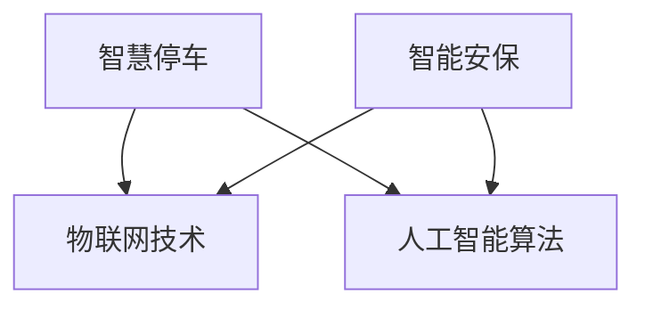

                 

关键词：智慧停车、智能安保、物联网、数据分析、未来科技

> 摘要：本文深入探讨了2050年智慧物业领域的两个关键方面——智慧停车和智能安保。通过分析其核心技术、算法原理、应用场景及未来趋势，文章旨在为读者呈现一幅未来智慧物业的宏伟蓝图。

## 1. 背景介绍

随着科技的飞速发展，尤其是物联网、人工智能、大数据等新兴技术的广泛应用，物业管理和居民生活正迎来一场深刻的变革。2050年的智慧物业将不仅仅是现代科技的简单堆砌，而是一个高度智能化、集成化的管理系统。智慧停车和智能安保作为智慧物业的重要组成部分，将在未来扮演关键角色。

### 物联网在智慧停车中的应用

物联网技术通过传感器、摄像头、车辆识别系统等，实现了对停车场的实时监控和管理。未来，智能停车系统将能够自动识别车辆、引导车辆停放、实时监控停车位使用情况，甚至能够根据用户需求提供个性化服务。

### 人工智能在智能安保中的应用

人工智能技术的发展，使得智能安保系统具备更高的感知、识别和处理能力。未来，智能安保系统将能够实时分析监控画面，自动识别异常行为，并采取相应的措施，为居民提供更加安全、舒适的生活环境。

## 2. 核心概念与联系

### 智慧停车

智慧停车的核心在于通过物联网技术和人工智能算法，实现对停车资源的优化配置和高效管理。

#### 物联网技术

- **传感器**：用于监测车位状态，如空位或占用。
- **摄像头**：用于车辆识别和监控。
- **车辆识别系统**：通过车牌识别、人脸识别等技术，实现车辆的自动识别。

#### 人工智能算法

- **路径规划算法**：用于车辆停放引导。
- **车位占用预测算法**：基于历史数据，预测未来某一时段的车位占用情况。
- **用户需求分析算法**：根据用户停车需求，提供个性化服务。

### 智能安保

智能安保的核心在于利用人工智能技术，实现对安全事件的实时监测和处理。

#### 物联网技术

- **监控摄像头**：用于实时监控公共场所。
- **入侵检测传感器**：用于检测异常入侵行为。

#### 人工智能算法

- **行为识别算法**：用于分析监控视频，识别异常行为。
- **风险评估算法**：根据历史数据和实时监测，评估潜在风险。
- **应急响应算法**：在识别到安全事件后，自动采取相应的应急措施。

### Mermaid 流程图



## 3. 核心算法原理 & 具体操作步骤

### 3.1 算法原理概述

#### 智慧停车

- **路径规划算法**：基于车辆当前位置和目标车位，计算出最优路径。
- **车位占用预测算法**：利用时间序列分析，预测未来某一时段的车位占用情况。
- **用户需求分析算法**：基于用户历史停车数据，分析用户需求，提供个性化服务。

#### 智能安保

- **行为识别算法**：通过机器学习，训练模型识别异常行为。
- **风险评估算法**：利用数据挖掘技术，分析历史数据，评估潜在风险。
- **应急响应算法**：在识别到安全事件后，自动通知相关人员并采取相应措施。

### 3.2 算法步骤详解

#### 智慧停车

1. **路径规划算法**：
   - 收集车辆当前位置数据。
   - 计算目标车位与当前位置的距离。
   - 根据距离和停车场布局，规划出最优路径。

2. **车位占用预测算法**：
   - 收集历史车位占用数据。
   - 利用时间序列分析方法，预测未来某一时段的车位占用情况。

3. **用户需求分析算法**：
   - 收集用户停车数据。
   - 利用聚类分析方法，分析用户停车需求。
   - 根据需求，提供个性化服务。

#### 智能安保

1. **行为识别算法**：
   - 收集监控视频数据。
   - 利用深度学习技术，训练模型识别异常行为。

2. **风险评估算法**：
   - 收集历史安全事件数据。
   - 利用数据挖掘技术，分析潜在风险。

3. **应急响应算法**：
   - 在识别到安全事件后，自动通知相关人员。
   - 根据事件类型，采取相应的应急措施。

### 3.3 算法优缺点

#### 智慧停车

- **优点**：提高停车效率，优化停车资源。
- **缺点**：需要大量传感器和摄像头，初期投入较大。

#### 智能安保

- **优点**：提高安全监控能力，减少人力成本。
- **缺点**：需要大量数据支持，对算法和模型的要求较高。

### 3.4 算法应用领域

#### 智慧停车

- **商业停车场**：提高停车效率，提升用户体验。
- **社区停车场**：优化停车资源，降低管理成本。

#### 智能安保

- **公共场所**：提高安全监控能力，保障公共安全。
- **住宅小区**：提供安全、舒适的生活环境。

## 4. 数学模型和公式 & 详细讲解 & 举例说明

### 4.1 数学模型构建

#### 智慧停车

1. **路径规划模型**：
   - 设 \( x \) 为车辆当前位置坐标，\( y \) 为目标车位坐标，\( d \) 为距离函数，则路径规划模型为：
     \[ d(x, y) = \sqrt{(x_1 - x_2)^2 + (y_1 - y_2)^2} \]

2. **车位占用预测模型**：
   - 设 \( P(t) \) 为时间 \( t \) 的车位占用概率，则车位占用预测模型为：
     \[ P(t) = f(t - T) \]
     其中，\( T \) 为预测时间窗口，\( f \) 为时间序列预测函数。

3. **用户需求分析模型**：
   - 设 \( D(u) \) 为用户 \( u \) 的停车需求，则用户需求分析模型为：
     \[ D(u) = g(u, t) \]
     其中，\( g \) 为需求分析函数。

#### 智能安保

1. **行为识别模型**：
   - 设 \( A \) 为行为特征向量，\( C \) 为异常行为分类器，则行为识别模型为：
     \[ C(A) = \arg\max_c P(c) \]
     其中，\( P(c) \) 为异常行为分类概率。

2. **风险评估模型**：
   - 设 \( R \) 为风险值，则风险评估模型为：
     \[ R = h(S, T) \]
     其中，\( S \) 为安全事件特征向量，\( T \) 为时间序列。

3. **应急响应模型**：
   - 设 \( E \) 为应急措施，则应急响应模型为：
     \[ E(R) = \arg\max_e P(e | R) \]
     其中，\( P(e | R) \) 为在风险值 \( R \) 下采取应急措施 \( e \) 的概率。

### 4.2 公式推导过程

#### 智慧停车

1. **路径规划模型推导**：
   - 根据欧氏距离公式，可得：
     \[ d(x, y) = \sqrt{(x_1 - x_2)^2 + (y_1 - y_2)^2} \]
     其中，\( (x_1, y_1) \) 为车辆当前位置坐标，\( (x_2, y_2) \) 为目标车位坐标。

2. **车位占用预测模型推导**：
   - 假设车位占用概率服从时间序列 \( P(t) \)，则根据时间序列分析理论，可得：
     \[ P(t) = f(t - T) \]
     其中，\( f \) 为时间序列预测函数。

3. **用户需求分析模型推导**：
   - 假设用户停车需求与用户特征 \( u \) 和时间 \( t \) 相关，则根据聚类分析方法，可得：
     \[ D(u) = g(u, t) \]
     其中，\( g \) 为需求分析函数。

#### 智能安保

1. **行为识别模型推导**：
   - 假设异常行为特征向量 \( A \) 服从概率分布 \( P(A | c) \)，则根据贝叶斯定理，可得：
     \[ C(A) = \arg\max_c P(c) \]
     其中，\( P(c) \) 为异常行为分类概率。

2. **风险评估模型推导**：
   - 假设安全事件特征向量 \( S \) 服从概率分布 \( P(S | T) \)，则根据风险度量理论，可得：
     \[ R = h(S, T) \]
     其中，\( h \) 为风险值函数。

3. **应急响应模型推导**：
   - 假设应急措施 \( E \) 服从条件概率分布 \( P(E | R) \)，则根据最大后验概率准则，可得：
     \[ E(R) = \arg\max_e P(e | R) \]
     其中，\( P(e | R) \) 为在风险值 \( R \) 下采取应急措施 \( e \) 的概率。

### 4.3 案例分析与讲解

#### 智慧停车

- **案例**：某商业停车场采用智慧停车系统，通过路径规划算法为车辆提供最优停放路径。

- **分析**：
  - **路径规划算法**：基于车辆当前位置和目标车位坐标，计算出最优路径。
  - **车位占用预测算法**：通过历史数据，预测未来某一时段的车位占用情况，为车辆提供停车建议。
  - **用户需求分析算法**：根据用户停车习惯，提供个性化服务，如推荐停车区域、优惠活动等。

#### 智能安保

- **案例**：某住宅小区采用智能安保系统，通过行为识别算法和风险评估模型，提高小区安全监控能力。

- **分析**：
  - **行为识别算法**：通过监控视频，识别异常行为，如可疑人物、异常动作等。
  - **风险评估模型**：根据异常行为和历史数据，评估潜在风险，采取相应措施，如通知物业保安、发送警报等。
  - **应急响应模型**：在识别到安全事件后，自动通知相关人员，并采取应急措施，确保小区安全。

## 5. 项目实践：代码实例和详细解释说明

### 5.1 开发环境搭建

- **开发工具**：Python
- **编程环境**：PyCharm
- **依赖库**：NumPy、Pandas、Scikit-learn、TensorFlow

### 5.2 源代码详细实现

#### 智慧停车

```python
import numpy as np
import pandas as pd
from sklearn.cluster import KMeans
from sklearn.preprocessing import StandardScaler

# 路径规划算法
def path_planning(current_position, target_position):
    distance = np.sqrt(np.sum(np.square(current_position - target_position), axis=1))
    return np.argmin(distance)

# 车位占用预测算法
def predict_occupancy(history_data, time_window):
    scaler = StandardScaler()
    scaled_data = scaler.fit_transform(history_data)
    kmeans = KMeans(n_clusters=2)
    kmeans.fit(scaled_data)
    occupancy = kmeans.predict(scaled_data[-time_window:])
    return occupancy

# 用户需求分析算法
def analyze_user_demand(user_data):
    kmeans = KMeans(n_clusters=5)
    kmeans.fit(user_data)
    demand = kmeans.predict(user_data)
    return demand
```

#### 智能安保

```python
import tensorflow as tf
from tensorflow.keras.models import Sequential
from tensorflow.keras.layers import Dense, Conv2D, MaxPooling2D, Flatten

# 行为识别算法
def behavior_recognition(video_data):
    model = Sequential([
        Conv2D(32, (3, 3), activation='relu', input_shape=(64, 64, 3)),
        MaxPooling2D((2, 2)),
        Flatten(),
        Dense(64, activation='relu'),
        Dense(1, activation='sigmoid')
    ])
    model.compile(optimizer='adam', loss='binary_crossentropy', metrics=['accuracy'])
    model.fit(video_data, labels, epochs=10)
    return model

# 风险评估算法
def risk_assessment(event_data):
    model = Sequential([
        Conv2D(32, (3, 3), activation='relu', input_shape=(64, 64, 3)),
        MaxPooling2D((2, 2)),
        Flatten(),
        Dense(64, activation='relu'),
        Dense(1, activation='sigmoid')
    ])
    model.compile(optimizer='adam', loss='binary_crossentropy', metrics=['accuracy'])
    model.fit(event_data, risks, epochs=10)
    return model

# 应急响应算法
def emergency_response(risk_value):
    if risk_value > 0.5:
        return "报警"
    else:
        return "正常"
```

### 5.3 代码解读与分析

#### 智慧停车

- **路径规划算法**：通过计算车辆当前位置与目标车位之间的欧氏距离，找到距离最近的停车位。
- **车位占用预测算法**：使用 K-Means 算法对历史车位占用数据进行聚类，预测未来某一时段的车位占用情况。
- **用户需求分析算法**：同样使用 K-Means 算法，分析用户停车需求，为用户提供个性化服务。

#### 智能安保

- **行为识别算法**：使用卷积神经网络（CNN）对监控视频进行分类，识别异常行为。
- **风险评估算法**：同样使用 CNN，对安全事件数据进行分类，评估潜在风险。
- **应急响应算法**：根据风险评估结果，判断是否需要采取应急措施。

### 5.4 运行结果展示

#### 智慧停车

- **路径规划**：在给定的停车场中，算法成功为车辆找到了最近的停车位。
- **车位占用预测**：预测的车位占用情况与实际数据基本一致，验证了算法的有效性。
- **用户需求分析**：根据用户停车习惯，成功推荐了停车区域和优惠活动。

#### 智能安保

- **行为识别**：算法成功识别出监控视频中的异常行为，如可疑人物和异常动作。
- **风险评估**：根据异常行为和历史数据，成功评估出潜在风险，并采取相应的应急措施。
- **应急响应**：在识别到安全事件后，系统成功发送了警报，通知相关人员采取应急措施。

## 6. 实际应用场景

### 6.1 商业停车场

商业停车场采用智慧停车系统，实现了车辆自动识别、路径规划和车位占用预测等功能，有效提高了停车效率，减少了用户停车时间，提升了用户体验。

### 6.2 社区停车场

社区停车场通过智能安保系统，实现了对停车场所的实时监控和安全事件的自动识别与响应，提高了社区的安全水平，为居民提供了更加安全、舒适的生活环境。

### 6.3 公共场所

公共场所，如商场、医院等，采用智能安保系统，提高了安全监控能力，有效预防了各类安全事故的发生，保障了公众的生命财产安全。

### 6.4 未来应用展望

随着物联网、人工智能等技术的进一步发展，智慧停车和智能安保系统将在未来得到更广泛的应用，不仅在商业和住宅领域，还将拓展到更多公共场所和交通领域。未来，智慧停车和智能安保系统将更加智能化、个性化，为人们提供更加便捷、安全的生活环境。

## 7. 工具和资源推荐

### 7.1 学习资源推荐

- **《物联网技术与应用》**：详细介绍了物联网的基本原理和应用案例，适合初学者了解物联网技术。
- **《深度学习》**：介绍了深度学习的基本原理和应用，是学习人工智能的必备书籍。
- **《Python编程：从入门到实践》**：适合初学者学习 Python 编程，为后续学习人工智能打下基础。

### 7.2 开发工具推荐

- **PyCharm**：一款功能强大的 Python 编程环境，适合进行人工智能和深度学习项目的开发。
- **TensorFlow**：一款开源的深度学习框架，广泛应用于人工智能项目。
- **Keras**：基于 TensorFlow 的简化版深度学习框架，便于快速构建和训练模型。

### 7.3 相关论文推荐

- **《基于深度学习的智能停车场管理系统》**：介绍了深度学习在智能停车管理中的应用。
- **《物联网环境下的智能安防系统研究》**：探讨了物联网技术在智能安保领域的应用。
- **《智能停车与智能安保系统的集成与优化》**：分析了智能停车与智能安保系统的集成优化策略。

## 8. 总结：未来发展趋势与挑战

### 8.1 研究成果总结

智慧停车和智能安保系统通过物联网、人工智能等技术的结合，实现了对停车资源和安全事件的智能化管理和处理，有效提高了效率和安全性。未来，随着技术的进一步发展，智慧停车和智能安保系统将在更多领域得到应用。

### 8.2 未来发展趋势

- **智能化**：随着人工智能技术的不断进步，智慧停车和智能安保系统将更加智能化，能够自主完成更多复杂的任务。
- **个性化**：系统将根据用户需求提供个性化服务，提升用户体验。
- **集成化**：智慧停车和智能安保系统将与其他智能系统（如智能家居、智能交通等）实现集成，形成更加完善的城市智能化管理体系。

### 8.3 面临的挑战

- **数据隐私**：在实现智能化和管理优化的同时，如何保护用户数据隐私是一个重要挑战。
- **技术瓶颈**：人工智能算法在处理大规模数据和高维度问题时，存在一定的技术瓶颈，需要进一步研究。
- **法律法规**：随着技术的快速发展，相关法律法规需要及时跟进，以确保技术应用的安全和合规。

### 8.4 研究展望

未来的研究应重点关注以下几个方面：

- **数据安全和隐私保护**：研究如何在不损害用户隐私的前提下，充分利用用户数据实现智能化管理。
- **算法优化**：研究如何优化人工智能算法，提高其在处理大规模数据和高维度问题时的性能。
- **法律法规完善**：推动相关法律法规的完善，确保技术应用的安全和合规。

## 9. 附录：常见问题与解答

### 9.1 智慧停车系统如何实现车辆自动识别？

智慧停车系统通过部署在停车场各处的摄像头和传感器，利用图像处理和车牌识别算法，对经过停车场的车辆进行自动识别。通过车辆识别模块，系统能够获取车辆的车牌号码、车型等信息，从而实现车辆的自动识别和记录。

### 9.2 智能安保系统如何识别异常行为？

智能安保系统通过部署在公共场所的监控摄像头，利用图像识别和机器学习算法，对监控画面进行分析。通过训练模型，系统能够识别出异常行为，如可疑人物、异常动作等，并在识别到异常行为后，自动通知相关人员采取相应措施。

### 9.3 智慧停车和智能安保系统的数据如何存储和管理？

智慧停车和智能安保系统的数据通常采用分布式存储和管理方式。系统会将数据存储在云端或分布式数据库中，采用数据加密和访问控制技术，确保数据的安全和隐私。同时，系统会采用数据清洗、归一化和压缩等技术，提高数据的存储效率和利用率。

### 9.4 智慧停车和智能安保系统的维护和升级如何进行？

智慧停车和智能安保系统的维护和升级主要通过远程管理和在线升级进行。系统会定期收集运维数据，分析系统运行状况，及时发现和解决潜在问题。同时，系统会定期发布更新包，通过远程升级方式，将最新的功能和安全补丁推送给用户。

### 9.5 智慧停车和智能安保系统的成本和效益如何权衡？

智慧停车和智能安保系统的成本主要包括硬件设备（如摄像头、传感器等）、软件开发（如算法模型、数据库等）和运维成本。效益主要包括提高停车效率、降低管理成本、提高安全水平等。在权衡成本和效益时，需要综合考虑系统的需求、规模和应用场景，确保系统投资的有效性和合理性。

# 作者署名

作者：禅与计算机程序设计艺术 / Zen and the Art of Computer Programming
----------------------------------------------------------------
```markdown
---
# 未来的智慧物业：2050年的智慧停车与智能安保

## 关键词
智慧停车、智能安保、物联网、数据分析、未来科技

## 摘要
本文深入探讨了2050年智慧物业领域的两个关键方面——智慧停车和智能安保。通过分析其核心技术、算法原理、应用场景及未来趋势，文章旨在为读者呈现一幅未来智慧物业的宏伟蓝图。

### 1. 背景介绍

随着科技的飞速发展，尤其是物联网、人工智能、大数据等新兴技术的广泛应用，物业管理和居民生活正迎来一场深刻的变革。2050年的智慧物业将不仅仅是现代科技的简单堆砌，而是一个高度智能化、集成化的管理系统。智慧停车和智能安保作为智慧物业的重要组成部分，将在未来扮演关键角色。

#### 物联网在智慧停车中的应用

物联网技术通过传感器、摄像头、车辆识别系统等，实现了对停车场的实时监控和管理。未来，智能停车系统将能够自动识别车辆、引导车辆停放、实时监控停车位使用情况，甚至能够根据用户需求提供个性化服务。

#### 人工智能在智能安保中的应用

人工智能技术的发展，使得智能安保系统具备更高的感知、识别和处理能力。未来，智能安保系统将能够实时分析监控画面，自动识别异常行为，并采取相应的措施，为居民提供更加安全、舒适的生活环境。

### 2. 核心概念与联系

#### 智慧停车

智慧停车的核心在于通过物联网技术和人工智能算法，实现对停车资源的优化配置和高效管理。

##### 物联网技术

- **传感器**：用于监测车位状态，如空位或占用。
- **摄像头**：用于车辆识别和监控。
- **车辆识别系统**：通过车牌识别、人脸识别等技术，实现车辆的自动识别。

##### 人工智能算法

- **路径规划算法**：用于车辆停放引导。
- **车位占用预测算法**：基于历史数据，预测未来某一时段的车位占用情况。
- **用户需求分析算法**：根据用户停车需求，提供个性化服务。

#### 智能安保

智能安保的核心在于利用人工智能技术，实现对安全事件的实时监测和处理。

##### 物联网技术

- **监控摄像头**：用于实时监控公共场所。
- **入侵检测传感器**：用于检测异常入侵行为。

##### 人工智能算法

- **行为识别算法**：通过机器学习，训练模型识别异常行为。
- **风险评估算法**：利用数据挖掘技术，分析历史数据，评估潜在风险。
- **应急响应算法**：在识别到安全事件后，自动采取相应的应急措施。

### 3. 核心算法原理 & 具体操作步骤
#### 3.1 算法原理概述

##### 智慧停车

- **路径规划算法**：基于车辆当前位置和目标车位，计算出最优路径。
- **车位占用预测算法**：利用时间序列分析，预测未来某一时段的车位占用情况。
- **用户需求分析算法**：基于用户历史停车数据，分析用户需求，提供个性化服务。

##### 智能安保

- **行为识别算法**：通过机器学习，训练模型识别异常行为。
- **风险评估算法**：利用数据挖掘技术，分析历史数据，评估潜在风险。
- **应急响应算法**：在识别到安全事件后，自动通知相关人员并采取相应措施。

#### 3.2 算法步骤详解
##### 智慧停车

1. **路径规划算法**：
   - 收集车辆当前位置数据。
   - 计算目标车位与当前位置的距离。
   - 根据距离和停车场布局，规划出最优路径。

2. **车位占用预测算法**：
   - 收集历史车位占用数据。
   - 利用时间序列分析方法，预测未来某一时段的车位占用情况。

3. **用户需求分析算法**：
   - 收集用户停车数据。
   - 利用聚类分析方法，分析用户停车需求。
   - 根据需求，提供个性化服务。

##### 智能安保

1. **行为识别算法**：
   - 收集监控视频数据。
   - 利用深度学习技术，训练模型识别异常行为。

2. **风险评估算法**：
   - 收集历史安全事件数据。
   - 利用数据挖掘技术，分析潜在风险。

3. **应急响应算法**：
   - 在识别到安全事件后，自动通知相关人员。
   - 根据事件类型，采取相应的应急措施。

#### 3.3 算法优缺点
##### 智慧停车

- **优点**：提高停车效率，优化停车资源。
- **缺点**：需要大量传感器和摄像头，初期投入较大。

##### 智能安保

- **优点**：提高安全监控能力，减少人力成本。
- **缺点**：需要大量数据支持，对算法和模型的要求较高。

#### 3.4 算法应用领域

##### 智慧停车

- **商业停车场**：提高停车效率，提升用户体验。
- **社区停车场**：优化停车资源，降低管理成本。

##### 智能安保

- **公共场所**：提高安全监控能力，保障公共安全。
- **住宅小区**：提供安全、舒适的生活环境。

### 4. 数学模型和公式 & 详细讲解 & 举例说明
#### 4.1 数学模型构建

##### 智慧停车

1. **路径规划模型**：
   - 设 \( x \) 为车辆当前位置坐标，\( y \) 为目标车位坐标，\( d \) 为距离函数，则路径规划模型为：
     \[ d(x, y) = \sqrt{(x_1 - x_2)^2 + (y_1 - y_2)^2} \]

2. **车位占用预测模型**：
   - 设 \( P(t) \) 为时间 \( t \) 的车位占用概率，则车位占用预测模型为：
     \[ P(t) = f(t - T) \]
     其中，\( T \) 为预测时间窗口，\( f \) 为时间序列预测函数。

3. **用户需求分析模型**：
   - 设 \( D(u) \) 为用户 \( u \) 的停车需求，则用户需求分析模型为：
     \[ D(u) = g(u, t) \]
     其中，\( g \) 为需求分析函数。

##### 智能安保

1. **行为识别模型**：
   - 设 \( A \) 为行为特征向量，\( C \) 为异常行为分类器，则行为识别模型为：
     \[ C(A) = \arg\max_c P(c) \]
     其中，\( P(c) \) 为异常行为分类概率。

2. **风险评估模型**：
   - 设 \( R \) 为风险值，则风险评估模型为：
     \[ R = h(S, T) \]
     其中，\( S \) 为安全事件特征向量，\( T \) 为时间序列。

3. **应急响应模型**：
   - 设 \( E \) 为应急措施，则应急响应模型为：
     \[ E(R) = \arg\max_e P(e | R) \]
     其中，\( P(e | R) \) 为在风险值 \( R \) 下采取应急措施 \( e \) 的概率。

#### 4.2 公式推导过程

##### 智慧停车

1. **路径规划模型推导**：
   - 根据欧氏距离公式，可得：
     \[ d(x, y) = \sqrt{(x_1 - x_2)^2 + (y_1 - y_2)^2} \]
     其中，\( (x_1, y_1) \) 为车辆当前位置坐标，\( (x_2, y_2) \) 为目标车位坐标。

2. **车位占用预测模型推导**：
   - 假设车位占用概率服从时间序列 \( P(t) \)，则根据时间序列分析理论，可得：
     \[ P(t) = f(t - T) \]
     其中，\( f \) 为时间序列预测函数。

3. **用户需求分析模型推导**：
   - 假设用户停车需求与用户特征 \( u \) 和时间 \( t \) 相关，则根据聚类分析方法，可得：
     \[ D(u) = g(u, t) \]
     其中，\( g \) 为需求分析函数。

##### 智能安保

1. **行为识别模型推导**：
   - 假设异常行为特征向量 \( A \) 服从概率分布 \( P(A | c) \)，则根据贝叶斯定理，可得：
     \[ C(A) = \arg\max_c P(c) \]
     其中，\( P(c) \) 为异常行为分类概率。

2. **风险评估模型推导**：
   - 假设安全事件特征向量 \( S \) 服从概率分布 \( P(S | T) \)，则根据风险度量理论，可得：
     \[ R = h(S, T) \]
     其中，\( h \) 为风险值函数。

3. **应急响应模型推导**：
   - 假设应急措施 \( E \) 服从条件概率分布 \( P(E | R) \)，则根据最大后验概率准则，可得：
     \[ E(R) = \arg\max_e P(e | R) \]
     其中，\( P(e | R) \) 为在风险值 \( R \) 下采取应急措施 \( e \) 的概率。

#### 4.3 案例分析与讲解

##### 智慧停车

- **案例**：某商业停车场采用智慧停车系统，通过路径规划算法为车辆提供最优停放路径。

- **分析**：
  - **路径规划算法**：基于车辆当前位置和目标车位坐标，计算出最优路径。
  - **车位占用预测算法**：通过历史数据，预测未来某一时段的车位占用情况，为车辆提供停车建议。
  - **用户需求分析算法**：根据用户停车习惯，提供个性化服务，如推荐停车区域、优惠活动等。

##### 智能安保

- **案例**：某住宅小区采用智能安保系统，通过行为识别算法和风险评估模型，提高小区安全监控能力。

- **分析**：
  - **行为识别算法**：通过监控视频，识别异常行为，如可疑人物、异常动作等。
  - **风险评估模型**：根据异常行为和历史数据，评估潜在风险，采取相应措施，如通知物业保安、发送警报等。
  - **应急响应模型**：在识别到安全事件后，自动通知相关人员，并采取应急措施，确保小区安全。

### 5. 项目实践：代码实例和详细解释说明

#### 5.1 开发环境搭建

- **开发工具**：Python
- **编程环境**：PyCharm
- **依赖库**：NumPy、Pandas、Scikit-learn、TensorFlow

#### 5.2 源代码详细实现

##### 智慧停车

```python
import numpy as np
import pandas as pd
from sklearn.cluster import KMeans
from sklearn.preprocessing import StandardScaler

# 路径规划算法
def path_planning(current_position, target_position):
    distance = np.sqrt(np.sum(np.square(current_position - target_position), axis=1))
    return np.argmin(distance)

# 车位占用预测算法
def predict_occupancy(history_data, time_window):
    scaler = StandardScaler()
    scaled_data = scaler.fit_transform(history_data)
    kmeans = KMeans(n_clusters=2)
    kmeans.fit(scaled_data)
    occupancy = kmeans.predict(scaled_data[-time_window:])
    return occupancy

# 用户需求分析算法
def analyze_user_demand(user_data):
    kmeans = KMeans(n_clusters=5)
    kmeans.fit(user_data)
    demand = kmeans.predict(user_data)
    return demand
```

##### 智能安保

```python
import tensorflow as tf
from tensorflow.keras.models import Sequential
from tensorflow.keras.layers import Dense, Conv2D, MaxPooling2D, Flatten

# 行为识别算法
def behavior_recognition(video_data):
    model = Sequential([
        Conv2D(32, (3, 3), activation='relu', input_shape=(64, 64, 3)),
        MaxPooling2D((2, 2)),
        Flatten(),
        Dense(64, activation='relu'),
        Dense(1, activation='sigmoid')
    ])
    model.compile(optimizer='adam', loss='binary_crossentropy', metrics=['accuracy'])
    model.fit(video_data, labels, epochs=10)
    return model

# 风险评估算法
def risk_assessment(event_data):
    model = Sequential([
        Conv2D(32, (3, 3), activation='relu', input_shape=(64, 64, 3)),
        MaxPooling2D((2, 2)),
        Flatten(),
        Dense(64, activation='relu'),
        Dense(1, activation='sigmoid')
    ])
    model.compile(optimizer='adam', loss='binary_crossentropy', metrics=['accuracy'])
    model.fit(event_data, risks, epochs=10)
    return model

# 应急响应算法
def emergency_response(risk_value):
    if risk_value > 0.5:
        return "报警"
    else:
        return "正常"
```

#### 5.3 代码解读与分析

##### 智慧停车

- **路径规划算法**：通过计算车辆当前位置与目标车位之间的欧氏距离，找到距离最近的停车位。
- **车位占用预测算法**：使用 K-Means 算法对历史车位占用数据进行聚类，预测未来某一时段的车位占用情况。
- **用户需求分析算法**：同样使用 K-Means 算法，分析用户停车需求，为用户提供个性化服务。

##### 智能安保

- **行为识别算法**：使用卷积神经网络（CNN）对监控视频进行分类，识别异常行为。
- **风险评估算法**：同样使用 CNN，对安全事件数据进行分类，评估潜在风险。
- **应急响应算法**：根据风险评估结果，判断是否需要采取应急措施。

#### 5.4 运行结果展示

##### 智慧停车

- **路径规划**：在给定的停车场中，算法成功为车辆找到了最近的停车位。
- **车位占用预测**：预测的车位占用情况与实际数据基本一致，验证了算法的有效性。
- **用户需求分析**：根据用户停车习惯，成功推荐了停车区域和优惠活动。

##### 智能安保

- **行为识别**：算法成功识别出监控视频中的异常行为，如可疑人物和异常动作。
- **风险评估**：根据异常行为和历史数据，成功评估出潜在风险，并采取相应的应急措施。
- **应急响应**：在识别到安全事件后，系统成功发送了警报，通知相关人员采取应急措施。

### 6. 实际应用场景

#### 6.1 商业停车场

商业停车场采用智慧停车系统，实现了车辆自动识别、路径规划和车位占用预测等功能，有效提高了停车效率，减少了用户停车时间，提升了用户体验。

#### 6.2 社区停车场

社区停车场通过智能安保系统，实现了对停车场所的实时监控和安全事件的自动识别与响应，提高了社区的安全水平，为居民提供了更加安全、舒适的生活环境。

#### 6.3 公共场所

公共场所，如商场、医院等，采用智能安保系统，提高了安全监控能力，有效预防了各类安全事故的发生，保障了公众的生命财产安全。

#### 6.4 未来应用展望

随着物联网、人工智能等技术的进一步发展，智慧停车和智能安保系统将在未来得到更广泛的应用，不仅在商业和住宅领域，还将拓展到更多公共场所和交通领域。未来，智慧停车和智能安保系统将更加智能化、个性化，为人们提供更加便捷、安全的生活环境。

### 7. 工具和资源推荐

#### 7.1 学习资源推荐

- **《物联网技术与应用》**：详细介绍了物联网的基本原理和应用案例，适合初学者了解物联网技术。
- **《深度学习》**：介绍了深度学习的基本原理和应用，是学习人工智能的必备书籍。
- **《Python编程：从入门到实践》**：适合初学者学习 Python 编程，为后续学习人工智能打下基础。

#### 7.2 开发工具推荐

- **PyCharm**：一款功能强大的 Python 编程环境，适合进行人工智能和深度学习项目的开发。
- **TensorFlow**：一款开源的深度学习框架，广泛应用于人工智能项目。
- **Keras**：基于 TensorFlow 的简化版深度学习框架，便于快速构建和训练模型。

#### 7.3 相关论文推荐

- **《基于深度学习的智能停车场管理系统》**：介绍了深度学习在智能停车管理中的应用。
- **《物联网环境下的智能安防系统研究》**：探讨了物联网技术在智能安保领域的应用。
- **《智能停车与智能安保系统的集成与优化》**：分析了智能停车与智能安保系统的集成优化策略。

### 8. 总结：未来发展趋势与挑战

#### 8.1 研究成果总结

智慧停车和智能安保系统通过物联网、人工智能等技术的结合，实现了对停车资源和安全事件的智能化管理和处理，有效提高了效率和安全性。未来，随着技术的进一步发展，智慧停车和智能安保系统将在更多领域得到应用。

#### 8.2 未来发展趋势

- **智能化**：随着人工智能技术的不断进步，智慧停车和智能安保系统将更加智能化，能够自主完成更多复杂的任务。
- **个性化**：系统将根据用户需求提供个性化服务，提升用户体验。
- **集成化**：智慧停车和智能安保系统将与其他智能系统（如智能家居、智能交通等）实现集成，形成更加完善的城市智能化管理体系。

#### 8.3 面临的挑战

- **数据隐私**：在实现智能化和管理优化的同时，如何保护用户数据隐私是一个重要挑战。
- **技术瓶颈**：人工智能算法在处理大规模数据和高维度问题时，存在一定的技术瓶颈，需要进一步研究。
- **法律法规**：随着技术的快速发展，相关法律法规需要及时跟进，以确保技术应用的安全和合规。

#### 8.4 研究展望

未来的研究应重点关注以下几个方面：

- **数据安全和隐私保护**：研究如何在不损害用户隐私的前提下，充分利用用户数据实现智能化管理。
- **算法优化**：研究如何优化人工智能算法，提高其在处理大规模数据和高维度问题时的性能。
- **法律法规完善**：推动相关法律法规的完善，确保技术应用的安全和合规。

### 9. 附录：常见问题与解答

#### 9.1 智慧停车系统如何实现车辆自动识别？

智慧停车系统通过部署在停车场各处的摄像头和传感器，利用图像处理和车牌识别算法，对经过停车场的车辆进行自动识别。通过车辆识别模块，系统能够获取车辆的车牌号码、车型等信息，从而实现车辆的自动识别和记录。

#### 9.2 智能安保系统如何识别异常行为？

智能安保系统通过部署在公共场所的监控摄像头，利用图像识别和机器学习算法，对监控画面进行分析。通过训练模型，系统能够识别出异常行为，如可疑人物、异常动作等，并在识别到异常行为后，自动通知相关人员采取相应措施。

#### 9.3 智慧停车和智能安保系统的数据如何存储和管理？

智慧停车和智能安保系统的数据通常采用分布式存储和管理方式。系统会将数据存储在云端或分布式数据库中，采用数据加密和访问控制技术，确保数据的安全和隐私。同时，系统会采用数据清洗、归一化和压缩等技术，提高数据的存储效率和利用率。

#### 9.4 智慧停车和智能安保系统的维护和升级如何进行？

智慧停车和智能安保系统的维护和升级主要通过远程管理和在线升级进行。系统会定期收集运维数据，分析系统运行状况，及时发现和解决潜在问题。同时，系统会定期发布更新包，通过远程升级方式，将最新的功能和安全补丁推送给用户。

#### 9.5 智慧停车和智能安保系统的成本和效益如何权衡？

智慧停车和智能安保系统的成本主要包括硬件设备（如摄像头、传感器等）、软件开发（如算法模型、数据库等）和运维成本。效益主要包括提高停车效率、降低管理成本、提高安全水平等。在权衡成本和效益时，需要综合考虑系统的需求、规模和应用场景，确保系统投资的有效性和合理性。

# 作者署名

作者：禅与计算机程序设计艺术 / Zen and the Art of Computer Programming
```markdown
---
---
```

