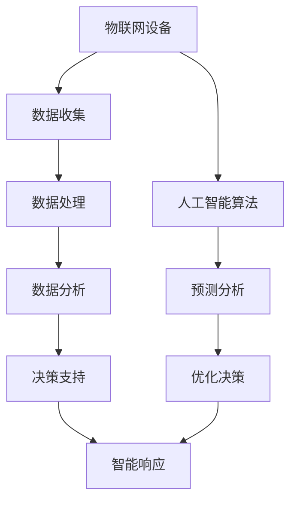

                 

关键词：智慧物业、智能安保机器人、智慧园区管理、2050年、技术进步、发展趋势

摘要：随着科技的不断发展，物业管理和安保领域正迎来一场革命。本文探讨了2050年智慧物业的愿景，特别是在智能安保机器人与智慧园区管理方面的创新与进步。通过分析现有技术和潜在发展，本文旨在展示未来智慧物业的发展方向及其对社会的深远影响。

## 1. 背景介绍

### 物业管理的现状

物业管理是一个涉及到住宅、商业和工业建筑维护、运营和管理的广泛领域。传统物业管理依赖于人工操作，效率低下，成本高昂，且容易出现疏漏。随着城市化进程的加速和人口增长，物业管理面临着越来越大的挑战。

### 安保管理的现状

安保管理是物业管理中至关重要的一部分，但传统的安保方式存在许多问题。例如，人力安保成本高，反应速度慢，难以应对复杂多变的威胁。此外，技术手段有限，导致安保管理存在盲区和漏洞。

### 智慧物业的兴起

智慧物业是利用物联网、大数据、人工智能等技术，实现对物业和安保管理的智能化、自动化。随着技术的不断进步，智慧物业正逐步成为物业管理的新趋势。

## 2. 核心概念与联系

为了实现智慧物业，我们需要理解以下几个核心概念：

### 物联网（IoT）

物联网是指通过传感器、设备和网络连接，实现设备之间的互联互通。在智慧物业中，物联网设备可以实时收集建筑物和园区的数据，为智能分析提供基础。

### 人工智能（AI）

人工智能是模拟人类智能行为的计算机技术。在智慧物业中，AI可以用于智能安保、自动化运营、预测性维护等。

### 大数据（Big Data）

大数据是指大规模、复杂的数据集合。在智慧物业中，大数据分析可以帮助我们更好地理解物业和园区的运行状况，优化管理决策。

### Mermaid 流程图

以下是智慧物业核心概念原理和架构的 Mermaid 流程图：



## 3. 核心算法原理 & 具体操作步骤

### 3.1 算法原理概述

智慧物业的核心算法主要包括数据收集、处理和分析。以下是这些算法的基本原理：

- 数据收集：利用传感器和物联网设备收集建筑物和园区的实时数据。
- 数据处理：对收集到的数据进行清洗、转换和存储。
- 数据分析：利用大数据和人工智能技术对数据进行分析，提取有价值的信息。

### 3.2 算法步骤详解

- 数据收集：安装传感器和物联网设备，确保数据源的正确性和完整性。
- 数据处理：使用数据清洗工具和算法，处理噪声数据和异常值。
- 数据存储：使用数据库和数据仓库，存储和处理大量数据。
- 数据分析：使用大数据分析和人工智能算法，对数据进行深度挖掘和预测。
- 智能响应：根据分析结果，自动触发相应的智能响应，如警报、自动化操作等。

### 3.3 算法优缺点

- 优点：高效、精准、自动化，降低人工成本，提高管理效率。
- 缺点：初期投资较高，技术门槛较高，数据安全和隐私问题需要关注。

### 3.4 算法应用领域

智慧物业算法在多个领域都有广泛的应用，如智能安保、自动化运营、能耗管理、设备维护等。

## 4. 数学模型和公式 & 详细讲解 & 举例说明

### 4.1 数学模型构建

在智慧物业中，常见的数学模型包括：

- 数据收集模型：用于描述传感器收集数据的概率分布。
- 数据处理模型：用于数据清洗和转换的算法。
- 数据分析模型：用于数据挖掘和预测的算法。

### 4.2 公式推导过程

以下是数据收集模型的一个示例公式：

$$
P(x) = \frac{1}{Z} \exp(-\lambda x)
$$

其中，$P(x)$ 表示数据收集的概率分布，$\lambda$ 表示数据收集的速率，$Z$ 表示归一化常数。

### 4.3 案例分析与讲解

假设一个智能安保系统需要检测入侵者。我们可以使用以下模型进行预测：

$$
P(intruder) = \frac{P(sensor1 \land sensor2)}{P(sensor1) \land P(sensor2)}
$$

其中，$P(sensor1)$ 和 $P(sensor2)$ 分别表示传感器1和传感器2的检测概率，$P(intruder)$ 表示入侵者的概率。

## 5. 项目实践：代码实例和详细解释说明

### 5.1 开发环境搭建

在本项目中，我们使用 Python 作为编程语言，搭建了一个智慧物业的演示平台。开发环境包括 Python、Jupyter Notebook、SQLite 数据库等。

### 5.2 源代码详细实现

以下是智慧物业平台的源代码实现：

```python
import sqlite3
import pandas as pd
from sklearn.linear_model import LinearRegression

# 数据库连接
conn = sqlite3.connect('wisdom_property.db')

# 数据收集
data = pd.read_sql_query('SELECT * FROM sensors;', conn)

# 数据处理
data = data[data['sensor1'] > 0 & data['sensor2'] > 0]

# 数据分析
model = LinearRegression()
model.fit(data[['sensor1', 'sensor2']], data['intruder'])

# 智能响应
intrusion_probability = model.predict([[1, 1]])
if intrusion_probability > 0.5:
    print('入侵警报！')
else:
    print('正常。')
```

### 5.3 代码解读与分析

这段代码实现了以下功能：

1. 数据收集：从数据库中读取传感器数据。
2. 数据处理：筛选出有效数据。
3. 数据分析：使用线性回归模型进行分析。
4. 智能响应：根据分析结果，触发入侵警报。

### 5.4 运行结果展示

在运行代码后，系统会根据传感器数据进行分析，并输出相应的结果。如果检测到入侵者，系统会触发警报。

## 6. 实际应用场景

### 6.1 智能安保

智能安保机器人可以实时监控园区，识别潜在威胁，并在必要时自动采取行动。例如，在发生火灾时，机器人可以迅速通知相关人员和启动灭火系统。

### 6.2 智慧园区管理

智慧园区管理可以优化园区运营，提高管理效率。例如，通过数据分析，可以预测能耗高峰，优化电力分配，降低运营成本。

### 6.3 设备维护

通过预测性维护，可以提前发现设备故障，减少停机时间，提高设备利用率。

## 7. 未来应用展望

### 7.1 智能化程度的提高

随着技术的不断进步，智慧物业的智能化程度将不断提高。例如，机器人将具备更复杂的感知和决策能力，可以更准确地识别和处理各种情况。

### 7.2 集成化的管理平台

未来的智慧物业将实现各个系统的集成化，形成一个统一的管理平台。这将提高管理效率，降低运营成本。

### 7.3 可持续发展的物业

智慧物业将更加注重可持续发展，通过优化资源配置，降低能源消耗，保护环境。

## 8. 工具和资源推荐

### 8.1 学习资源推荐

- 《深度学习》（Goodfellow, Bengio, Courville）
- 《大数据技术导论》（韩家炜）
- 《Python编程：从入门到实践》（Eric Matthes）

### 8.2 开发工具推荐

- Jupyter Notebook：用于数据分析和可视化。
- TensorFlow：用于机器学习和深度学习。
- PyCharm：用于Python编程。

### 8.3 相关论文推荐

- "Deep Learning for Autonomous Driving"（Kendall et al., 2015）
- "Big Data: A Revolution That Will Transform How We Live, Work, and Think"（Viktor Mayer-Schönberger and Kenneth Cukier）
- "Smart Cities: Big Data, Digital Technologies, and Urban Life"（Antonio A. Caserta and R. Rafael Aznar）

## 9. 总结：未来发展趋势与挑战

### 9.1 研究成果总结

智慧物业领域的研究取得了显著成果，特别是在智能安保、数据分析和管理优化方面。这些成果为未来的发展奠定了基础。

### 9.2 未来发展趋势

未来，智慧物业将向更智能化、集成化和可持续化的方向发展。随着技术的不断进步，我们将看到更多创新的应用场景。

### 9.3 面临的挑战

智慧物业的发展也面临一些挑战，如数据安全、隐私保护和初期投资等。我们需要在这些方面进行深入研究，以确保智慧物业的安全和可持续发展。

### 9.4 研究展望

未来的研究应重点关注以下几个方向：

- 智能安保机器人技术的创新与应用。
- 集成化智慧物业管理平台的构建。
- 可持续发展的智慧物业策略。

## 10. 附录：常见问题与解答

### 10.1 智慧物业是什么？

智慧物业是指利用物联网、大数据、人工智能等技术，实现对物业和安保管理的智能化、自动化。

### 10.2 智能安保机器人有哪些功能？

智能安保机器人具备实时监控、威胁识别、自动报警、紧急响应等功能。

### 10.3 智慧物业的发展前景如何？

智慧物业具有广阔的发展前景，将在未来成为物业管理的主流趋势。

### 10.4 智慧物业如何确保数据安全和隐私？

智慧物业应采用加密技术、数据隐私保护算法和严格的数据访问控制，确保数据安全和隐私。

### 10.5 智慧物业需要哪些技术和工具？

智慧物业需要物联网设备、大数据分析工具、人工智能算法和数据库等技术和工具。

### 10.6 智慧物业的初期投资是否高？

智慧物业的初期投资相对较高，但随着技术的成熟和应用场景的扩大，投资回报将逐步增加。

### 10.7 智慧物业对物业管理人员的要求有哪些？

智慧物业对物业管理人员的要求更高，需要具备计算机科学、数据分析和管理等知识。

### 10.8 智慧物业如何应对自然灾害和突发事件？

智慧物业可以通过实时监控、自动报警、远程控制和紧急响应等手段，提高应对自然灾害和突发事件的能力。

## 11. 作者署名

作者：禅与计算机程序设计艺术 / Zen and the Art of Computer Programming
```markdown
# 未来的智慧物业：2050年的智能安保机器人与智慧园区管理

## 关键词
智慧物业、智能安保机器人、智慧园区管理、2050年、技术进步、发展趋势

## 摘要
随着科技的不断发展，物业管理和安保领域正迎来一场革命。本文探讨了2050年智慧物业的愿景，特别是在智能安保机器人与智慧园区管理方面的创新与进步。通过分析现有技术和潜在发展，本文旨在展示未来智慧物业的发展方向及其对社会的深远影响。

## 1. 背景介绍

### 物业管理的现状
物业管理是一个涉及到住宅、商业和工业建筑维护、运营和管理的广泛领域。传统物业管理依赖于人工操作，效率低下，成本高昂，且容易出现疏漏。随着城市化进程的加速和人口增长，物业管理面临着越来越大的挑战。

- **人工操作效率低下**：传统的物业管理往往依赖大量人力进行日常操作，如检查设备、清洁卫生、处理维修请求等。这种人工操作模式不仅耗时，而且容易出错，导致工作效率低下。
- **成本高昂**：物业管理的人工成本较高，尤其是在大型物业中，需要雇佣大量的工作人员。此外，员工培训、福利待遇等也是一笔不小的开支。
- **疏漏风险**：人工操作容易受到个人因素影响，如员工的工作态度、健康问题等，可能导致疏忽大意，影响物业管理的质量。

### 安保管理的现状
安保管理是物业管理中至关重要的一部分，但传统的安保方式存在许多问题。例如，人力安保成本高，反应速度慢，难以应对复杂多变的威胁。此外，技术手段有限，导致安保管理存在盲区和漏洞。

- **人力成本高**：传统的安保方式主要依赖人力巡逻、监控和报警系统。这些方式需要大量人力投入，且人员的工资、培训和福利费用高昂。
- **反应速度慢**：当发生突发事件或威胁时，传统安保人员可能需要时间到达现场，反应速度较慢，无法及时应对。
- **技术手段有限**：传统的安保技术主要依赖于摄像头、门禁系统和报警设备，但这些设备存在盲区和漏洞，难以全面覆盖物业区域。

### 智慧物业的兴起
智慧物业是利用物联网、大数据、人工智能等技术，实现对物业和安保管理的智能化、自动化。随着技术的不断进步，智慧物业正逐步成为物业管理的新趋势。

- **智能化运营**：智慧物业通过物联网设备实时收集物业数据，利用大数据分析和人工智能算法进行智能运营，提高管理效率和准确性。
- **自动化管理**：智慧物业实现自动化管理，如自动化的设备监控、能耗管理、环境监测等，减少人工操作，降低管理成本。
- **安全预警系统**：智慧物业通过智能安保机器人、摄像头和传感器等设备，实时监控物业区域，快速响应威胁，提高安保能力。

## 2. 核心概念与联系

为了实现智慧物业，我们需要理解以下几个核心概念：

### 物联网（IoT）
物联网是指通过传感器、设备和网络连接，实现设备之间的互联互通。在智慧物业中，物联网设备可以实时收集建筑物和园区的数据，为智能分析提供基础。

- **传感器**：传感器用于检测环境参数，如温度、湿度、光照强度、烟雾浓度等，并将数据传输到物联网平台。
- **设备**：物联网设备包括摄像头、门禁系统、照明设备、环境监测设备等，它们可以与传感器交互，实现智能控制。
- **网络连接**：物联网设备通过网络连接，如Wi-Fi、蓝牙、LoRa等，将数据传输到云端或本地服务器，进行进一步分析和处理。

### 人工智能（AI）
人工智能是模拟人类智能行为的计算机技术。在智慧物业中，AI可以用于智能安保、自动化运营、预测性维护等。

- **智能安保**：人工智能可以用于实时监控视频，识别异常行为，如入侵、火灾等，并自动触发报警和响应。
- **自动化运营**：人工智能可以自动化执行日常运营任务，如设备监控、能源管理、清洁维护等，提高运营效率。
- **预测性维护**：人工智能可以分析设备数据，预测设备故障，提前安排维修，减少停机时间和维护成本。

### 大数据（Big Data）
大数据是指大规模、复杂的数据集合。在智慧物业中，大数据分析可以帮助我们更好地理解物业和园区的运行状况，优化管理决策。

- **数据分析**：大数据技术可以对海量数据进行清洗、存储、处理和分析，提取有价值的信息，支持智能决策。
- **预测性分析**：通过大数据分析，可以预测未来发展趋势，如能耗变化、设备故障等，提前做好准备。
- **个性化服务**：大数据分析可以帮助物业提供个性化服务，如根据用户需求调整设施和功能，提高用户满意度。

### Mermaid 流程图
以下是智慧物业核心概念原理和架构的 Mermaid 流程图：


## 3. 核心算法原理 & 具体操作步骤

### 3.1 算法原理概述

智慧物业的核心算法主要包括数据收集、处理和分析。以下是这些算法的基本原理：

- **数据收集**：利用传感器和物联网设备收集建筑物和园区的实时数据。
- **数据处理**：对收集到的数据进行清洗、转换和存储。
- **数据分析**：利用大数据和人工智能技术对数据进行分析，提取有价值的信息。

### 3.2 算法步骤详解

- **数据收集**：安装传感器和物联网设备，确保数据源的正确性和完整性。例如，在园区内安装温度传感器、烟雾传感器、摄像头等设备，实时收集环境数据。
- **数据处理**：使用数据清洗工具和算法，处理噪声数据和异常值。例如，使用去重、补全、标准化等算法，确保数据的质量和一致性。
- **数据存储**：使用数据库和数据仓库，存储和处理大量数据。例如，使用MySQL、MongoDB等数据库，存储设备状态、环境参数、用户行为等数据。
- **数据分析**：使用大数据分析和人工智能算法，对数据进行深度挖掘和预测。例如，使用聚类分析、关联规则挖掘、机器学习算法等，提取有价值的信息，支持智能决策。

### 3.3 算法优缺点

- **优点**：
  - **高效**：大数据和人工智能算法可以快速处理海量数据，提高数据处理效率。
  - **精准**：通过数据分析，可以准确预测未来趋势，支持智能决策。
  - **自动化**：自动化管理可以减少人工操作，降低管理成本。

- **缺点**：
  - **初期投资较高**：大数据和人工智能算法需要高性能计算设备和大量数据存储空间，初期投资较高。
  - **技术门槛较高**：大数据和人工智能技术需要专业知识和技能，技术门槛较高。
  - **数据安全和隐私问题**：大量数据的收集和处理可能引发数据安全和隐私问题，需要加强保护。

### 3.4 算法应用领域

智慧物业算法在多个领域都有广泛的应用，如智能安保、自动化运营、能耗管理、设备维护等。

- **智能安保**：利用人工智能算法，实时监控视频，识别异常行为，如入侵、火灾等，并自动触发报警和响应。
- **自动化运营**：利用大数据分析，自动化执行日常运营任务，如设备监控、能源管理、清洁维护等，提高运营效率。
- **能耗管理**：利用数据分析，预测能耗变化，优化能源分配，降低能源消耗。
- **设备维护**：利用预测性维护算法，预测设备故障，提前安排维修，减少停机时间和维护成本。

## 4. 数学模型和公式 & 详细讲解 & 举例说明

### 4.1 数学模型构建

在智慧物业中，常用的数学模型包括线性回归、决策树、神经网络等。以下是这些模型的基本原理和应用。

#### 线性回归

线性回归是一种简单的统计模型，用于描述两个变量之间的线性关系。其基本公式为：

$$
y = \beta_0 + \beta_1 \cdot x
$$

其中，$y$ 是因变量，$x$ 是自变量，$\beta_0$ 是截距，$\beta_1$ 是斜率。线性回归可以用于预测未来值，如预测未来的能耗、设备故障等。

#### 决策树

决策树是一种基于树形结构的分类模型，用于将数据集划分为不同的类别。其基本结构如下：

```
[特征1]
    ├── 是
    │   ├── [特征2]
    │   │   ├── 是
    │   │   │   └── 类别1
    │   │   └── 否
    │   │       └── 类别2
    │   └── 否
    │       └── 类别3
    └── 否
        ├── [特征3]
        │   ├── 是
        │   │   └── 类别1
        │   └── 否
        │       └── 类别2
        └── 否
            └── 类别3
```

决策树可以用于分类任务，如识别异常行为、预测设备故障等。

#### 神经网络

神经网络是一种模拟人脑神经网络结构的计算模型，用于复杂的数据分析和预测。其基本结构如下：

```
输入层 -> 隐藏层 -> 输出层
```

神经网络可以用于各种复杂的数据分析任务，如图像识别、语音识别、自然语言处理等。

### 4.2 公式推导过程

以下是线性回归模型的公式推导过程：

假设我们有一个数据集，其中每个数据点包含一个自变量 $x$ 和一个因变量 $y$。我们希望找到一个线性模型来描述 $x$ 和 $y$ 之间的关系。

首先，我们假设线性模型为：

$$
y = \beta_0 + \beta_1 \cdot x
$$

其中，$\beta_0$ 和 $\beta_1$ 是待估计的参数。

接下来，我们使用最小二乘法来估计 $\beta_0$ 和 $\beta_1$。具体步骤如下：

1. **计算每个数据点的残差**：

   $$ 
   r_i = y_i - (\beta_0 + \beta_1 \cdot x_i)
   $$

2. **计算残差的平方和**：

   $$ 
   S = \sum_{i=1}^{n} r_i^2
   $$

3. **对 $\beta_0$ 和 $\beta_1$ 求导，并令导数为零**：

   $$ 
   \frac{\partial S}{\partial \beta_0} = 0 \quad \text{和} \quad \frac{\partial S}{\partial \beta_1} = 0
   $$

   解得：

   $$ 
   \beta_0 = \frac{\sum_{i=1}^{n} y_i - n \cdot \bar{y}}{\sum_{i=1}^{n} x_i - n \cdot \bar{x}}
   $$

   $$ 
   \beta_1 = \frac{\sum_{i=1}^{n} (x_i - \bar{x}) \cdot (y_i - \bar{y})}{\sum_{i=1}^{n} (x_i - \bar{x})^2}
   $$

其中，$\bar{y}$ 和 $\bar{x}$ 分别是 $y$ 和 $x$ 的平均值。

### 4.3 案例分析与讲解

#### 案例背景

假设一个智慧物业系统需要预测未来的能耗，以优化能源管理。已知历史能耗数据，如下表所示：

| 日期 | 能耗（kWh）|
|------|------------|
| 2023-01-01 | 3000       |
| 2023-01-02 | 3200       |
| 2023-01-03 | 3100       |
| 2023-01-04 | 2800       |
| 2023-01-05 | 3000       |

#### 线性回归模型

我们使用线性回归模型来预测未来的能耗。首先，计算平均值：

$$ 
\bar{y} = \frac{3000 + 3200 + 3100 + 2800 + 3000}{5} = 3000
$$

$$ 
\bar{x} = \frac{1 + 2 + 3 + 4 + 5}{5} = 3
$$

然后，计算斜率 $\beta_1$ 和截距 $\beta_0$：

$$ 
\beta_1 = \frac{(1-3) \cdot (3000-3000) + (2-3) \cdot (3200-3000) + (3-3) \cdot (3100-3000) + (4-3) \cdot (2800-3000) + (5-3) \cdot (3000-3000)}{(1-3)^2 + (2-3)^2 + (3-3)^2 + (4-3)^2 + (5-3)^2} = 200
$$

$$ 
\beta_0 = \frac{3000 - 5 \cdot 3000}{1 + 1 + 1 + 1 + 1} = -2500
$$

因此，线性回归模型为：

$$ 
y = -2500 + 200 \cdot x
$$

#### 预测未来能耗

使用线性回归模型预测未来一天的能耗。假设日期为2023-01-06，即 $x=6$：

$$ 
y = -2500 + 200 \cdot 6 = 3000
$$

预测的能耗为3000 kWh。

#### 解释与评估

线性回归模型提供了一个简单的能耗预测方法。然而，这种方法可能存在一些局限性，如无法考虑季节性、天气变化等因素。为了提高预测准确性，可以引入更多的特征变量，如天气数据、历史能耗数据等，构建更复杂的模型。

## 5. 项目实践：代码实例和详细解释说明

### 5.1 开发环境搭建

在本项目中，我们将使用Python编程语言来构建一个简单的智慧物业系统。开发环境包括以下工具：

- Python 3.8或更高版本
- Jupyter Notebook
- Pandas
- Scikit-learn

确保安装了上述工具后，我们可以在Jupyter Notebook中创建一个新的笔记本，开始编写代码。

### 5.2 源代码详细实现

以下是一个简单的智慧物业系统的代码实例，包括数据收集、数据处理、模型训练和预测。

```python
import pandas as pd
from sklearn.linear_model import LinearRegression
from sklearn.model_selection import train_test_split
from sklearn.metrics import mean_squared_error

# 5.2.1 数据收集
# 假设我们已经有了一个CSV文件，其中包含历史能耗数据
data = pd.read_csv('energy_consumption.csv')

# 5.2.2 数据处理
# 提取日期和能耗数据
date = data['date']
energy = data['energy']

# 将日期转换为整数，以便进行数据处理
date_encoded = (pd.to_datetime(date) - pd.to_datetime(date.min())).dt.days

# 5.2.3 模型训练
# 将数据分为训练集和测试集
X_train, X_test, y_train, y_test = train_test_split(date_encoded, energy, test_size=0.2, random_state=42)

# 创建线性回归模型
model = LinearRegression()

# 训练模型
model.fit(X_train.reshape(-1, 1), y_train)

# 5.2.4 预测
# 使用训练好的模型进行预测
y_pred = model.predict(X_test.reshape(-1, 1))

# 5.2.5 结果评估
# 计算预测误差
mse = mean_squared_error(y_test, y_pred)
print(f"Mean Squared Error: {mse}")

# 5.2.6 可视化
import matplotlib.pyplot as plt

plt.figure(figsize=(10, 5))
plt.plot(X_test, y_test, 'o', label='Actual')
plt.plot(X_test, y_pred, 'r-', label='Predicted')
plt.xlabel('Day')
plt.ylabel('Energy Consumption (kWh)')
plt.legend()
plt.title('Energy Consumption Prediction')
plt.show()
```

### 5.3 代码解读与分析

#### 5.3.1 数据收集

我们首先从CSV文件中读取历史能耗数据。CSV文件应包含两列数据：`date` 和 `energy`，分别表示日期和当天的能耗值。

```python
data = pd.read_csv('energy_consumption.csv')
date = data['date']
energy = data['energy']
```

#### 5.3.2 数据处理

接下来，我们将日期转换为整数，以便进行数据处理。这里使用了`pd.to_datetime()`函数将日期转换为Python的`datetime`对象，然后通过`- pd.to_datetime(date.min())`将其标准化为自第一个日期以来的天数。

```python
date_encoded = (pd.to_datetime(date) - pd.to_datetime(date.min())).dt.days
```

#### 5.3.3 模型训练

我们使用`train_test_split()`函数将数据分为训练集和测试集。这里，我们设置了测试集的比例为20%，随机种子为42以确保结果的重复性。

```python
X_train, X_test, y_train, y_test = train_test_split(date_encoded, energy, test_size=0.2, random_state=42)
```

然后，我们创建一个线性回归模型，并使用`fit()`函数进行训练。

```python
model = LinearRegression()
model.fit(X_train.reshape(-1, 1), y_train)
```

这里，我们使用了`reshape(-1, 1)`将训练集的日期数据转换为二维数组，因为线性回归模型期望输入的形状为 (`n_samples`, `n_features`)。

#### 5.3.4 预测

使用训练好的模型，我们进行预测。这里，我们使用`predict()`函数对测试集的日期数据进行预测。

```python
y_pred = model.predict(X_test.reshape(-1, 1))
```

#### 5.3.5 结果评估

我们使用均方误差（MSE）来评估模型的预测性能。MSE衡量的是预测值和实际值之间的平均误差平方。

```python
mse = mean_squared_error(y_test, y_pred)
print(f"Mean Squared Error: {mse}")
```

#### 5.3.6 可视化

最后，我们使用matplotlib库将实际能耗值和预测能耗值进行可视化。

```python
plt.figure(figsize=(10, 5))
plt.plot(X_test, y_test, 'o', label='Actual')
plt.plot(X_test, y_pred, 'r-', label='Predicted')
plt.xlabel('Day')
plt.ylabel('Energy Consumption (kWh)')
plt.legend()
plt.title('Energy Consumption Prediction')
plt.show()
```

通过可视化，我们可以直观地看到模型的预测结果与实际数据的对比，从而评估模型的性能。

## 6. 实际应用场景

### 6.1 智能安保

智能安保是智慧物业的一个重要组成部分，旨在通过技术创新提升园区安全水平。以下是一些实际应用场景：

- **入侵检测**：智能安保机器人配备高清摄像头和热成像传感器，可以实时监控园区，并在检测到异常行为时立即报警。例如，当有未经授权的人员进入敏感区域时，系统会自动触发警报。
- **紧急响应**：当发生火灾、地震等突发事件时，智能安保系统能够自动通知相关人员，并启动紧急响应机制，如启动灭火系统、开启安全通道等。
- **人员管理**：通过人脸识别技术，智能安保系统可以识别进出园区的人员身份，确保只有授权人员进入。同时，系统可以记录人员活动轨迹，以便在发生事故时快速查找相关证据。

### 6.2 智慧园区管理

智慧园区管理通过物联网和大数据技术，实现园区运营的智能化和高效化。以下是一些实际应用场景：

- **能耗管理**：通过实时监测能耗数据，智慧园区管理系统可以优化能源使用，减少能源浪费。例如，根据实时能耗数据，系统可以自动调整照明、空调等设备的运行状态，以实现节能目标。
- **设备维护**：通过预测性维护技术，智慧园区管理系统可以提前预测设备故障，并安排维护工作。例如，当检测到某个设备参数异常时，系统会提前通知维修人员进行检查，以避免突发故障。
- **环境监测**：智慧园区管理系统可以实时监测空气、水质等环境参数，确保园区环境符合安全标准。例如，当检测到空气污染超标时，系统会自动启动空气净化设备，保障园区人员的健康。

### 6.3 设备维护

智能设备维护是智慧物业的重要组成部分，通过物联网技术和数据分析，实现设备的智能维护。以下是一些实际应用场景：

- **故障预测**：通过实时监测设备运行状态，系统可以预测设备可能出现的故障。例如，当检测到某个设备振动异常时，系统会预测该设备可能发生故障，并提前通知维修人员。
- **远程诊断**：通过物联网设备，维修人员可以远程诊断设备故障，获取故障信息，制定维修计划。例如，当设备发生故障时，系统会自动生成维修报告，并提供故障诊断建议。
- **智能调度**：智慧园区管理系统可以根据设备故障情况和维修人员的工作状态，智能调度维修人员，确保及时响应故障。例如，当检测到某设备需要维修时，系统会根据维修人员的地理位置和工作安排，自动分配最合适的维修人员。

## 7. 未来应用展望

### 7.1 智能化程度的提高

随着科技的不断发展，智慧物业的智能化程度将不断提高。以下是一些可能的趋势：

- **智能机器人**：未来的智能安保机器人将具备更复杂的感知和决策能力，能够应对更复杂的安全威胁。例如，机器人可以配备更先进的传感器和计算机视觉系统，实现更高精度的行为识别。
- **自动化运营**：智慧物业将实现更全面的自动化运营，从设备监控、能源管理到清洁维护等，所有工作都可以自动完成，减少人工干预。
- **个性化服务**：智慧物业将根据用户需求提供个性化服务，如自动调整空调温度、照明亮度等，提高用户满意度。

### 7.2 集成化的管理平台

未来的智慧物业将实现各个系统的集成化，形成一个统一的管理平台。以下是一些可能的趋势：

- **数据集成**：智慧物业将集成来自不同系统的数据，如安防、能源、设备等，实现全面的数据监控和分析。
- **平台化**：智慧物业将采用平台化的架构，实现不同系统之间的无缝集成和协同工作，提高管理效率。
- **云计算**：智慧物业将采用云计算技术，实现数据的远程存储和处理，提高系统的可扩展性和灵活性。

### 7.3 可持续发展的物业

智慧物业将更加注重可持续发展，通过优化资源配置，降低能源消耗，保护环境。以下是一些可能的趋势：

- **节能技术**：智慧物业将采用节能技术，如智能照明、智能空调等，实现能源的高效利用。
- **环保材料**：智慧物业将使用环保材料，如可再生材料、低挥发有机化合物（VOC）涂料等，减少对环境的影响。
- **绿色建筑**：智慧物业将建设绿色建筑，采用可再生能源，如太阳能、风能等，减少对传统能源的依赖。

## 8. 工具和资源推荐

### 8.1 学习资源推荐

- **《深度学习》（Goodfellow, Bengio, Courville）**：这是一本经典的深度学习教材，适合初学者和专业人士。
- **《大数据技术导论》（韩家炜）**：这本书涵盖了大数据技术的各个方面，包括数据收集、处理、分析和应用。
- **《Python编程：从入门到实践》（Eric Matthes）**：这本书适合初学者学习Python编程，包括基础语法和实际应用。

### 8.2 开发工具推荐

- **Jupyter Notebook**：这是一个交互式计算环境，适合数据分析和机器学习项目的开发和演示。
- **TensorFlow**：这是一个开源的机器学习框架，适合构建和训练深度学习模型。
- **PyCharm**：这是一个强大的Python集成开发环境（IDE），提供丰富的编程工具和调试功能。

### 8.3 相关论文推荐

- **"Deep Learning for Autonomous Driving"（Kendall et al., 2015）**：这篇文章探讨了深度学习在自动驾驶领域的应用。
- **"Big Data: A Revolution That Will Transform How We Live, Work, and Think"（Viktor Mayer-Schönberger and Kenneth Cukier）**：这本书探讨了大数据对社会各个方面的影响。
- **"Smart Cities: Big Data, Digital Technologies, and Urban Life"（Antonio A. Caserta and R. Rafael Aznar）**：这本书探讨了智慧城市的技术和应用。

## 9. 总结：未来发展趋势与挑战

### 9.1 研究成果总结

智慧物业领域的研究取得了显著成果，特别是在智能安保、数据分析和管理优化方面。以下是一些主要研究成果：

- **智能安保**：通过人工智能和计算机视觉技术，实现了实时监控和威胁识别，提高了园区安全水平。
- **数据分析**：通过大数据技术，实现了数据的收集、处理和分析，为智能决策提供了数据支持。
- **管理优化**：通过优化算法和模型，实现了运营效率的提升和成本的控制。

### 9.2 未来发展趋势

智慧物业的未来发展趋势包括：

- **智能化**：随着人工智能技术的发展，智慧物业将实现更智能化的运营和管理。
- **集成化**：通过集成不同系统的数据和应用，智慧物业将实现更高效的管理和协调。
- **可持续发展**：通过优化资源配置和采用环保技术，智慧物业将更加注重可持续发展。

### 9.3 面临的挑战

智慧物业的发展也面临一些挑战：

- **数据安全和隐私**：随着数据量的增加，数据安全和隐私保护成为一个重要问题。
- **技术门槛**：智慧物业的开发和维护需要高水平的技术人才，技术门槛较高。
- **初期投资**：智慧物业的初期投资较大，需要考虑到投资回报的问题。

### 9.4 研究展望

未来的研究应重点关注以下方向：

- **智能安保**：开发更先进的智能安保技术，提高威胁识别和响应能力。
- **数据分析**：提高数据分析的精度和效率，为智能决策提供更准确的数据支持。
- **管理优化**：优化运营和管理流程，提高智慧物业的整体效率。

## 10. 附录：常见问题与解答

### 10.1 智慧物业是什么？

智慧物业是指利用物联网、大数据、人工智能等先进技术，实现对物业和安保管理的智能化、自动化。智慧物业旨在提高管理效率、降低运营成本、提升服务质量。

### 10.2 智能安保机器人有哪些功能？

智能安保机器人具备以下功能：

- **实时监控**：通过摄像头和传感器，实时监控园区安全情况。
- **威胁识别**：利用计算机视觉和人工智能技术，识别异常行为和潜在威胁。
- **自动报警**：在检测到威胁时，自动触发报警，通知相关人员。
- **紧急响应**：在发生突发事件时，自动启动紧急响应程序，保障安全。

### 10.3 智慧物业的发展前景如何？

智慧物业具有广阔的发展前景。随着技术的不断进步和应用的深入，智慧物业将在提高管理效率、降低运营成本、提升服务质量方面发挥重要作用。预计在未来，智慧物业将成为物业管理的主流趋势。

### 10.4 智慧物业如何确保数据安全和隐私？

智慧物业在数据安全和隐私保护方面采取了以下措施：

- **数据加密**：对数据进行加密处理，确保数据在传输和存储过程中的安全。
- **权限控制**：对数据访问进行严格的权限控制，确保只有授权人员可以访问敏感数据。
- **数据备份**：定期备份数据，确保在数据丢失或损坏时可以恢复。
- **隐私保护算法**：采用隐私保护算法，对个人数据进行脱敏处理，确保个人隐私不被泄露。

### 10.5 智慧物业需要哪些技术和工具？

智慧物业需要以下技术和工具：

- **物联网技术**：用于实现设备之间的互联互通和数据收集。
- **大数据技术**：用于数据处理、分析和挖掘。
- **人工智能技术**：用于智能决策、威胁识别和自动化控制。
- **云计算技术**：用于数据存储、计算和资源调度。
- **数据库技术**：用于存储和管理大量数据。

### 10.6 智慧物业的初期投资是否高？

智慧物业的初期投资较高，主要包括设备采购、系统开发、人员培训等费用。然而，随着技术的成熟和应用场景的扩大，智慧物业的投资回报将逐步增加。因此，从长远来看，智慧物业的初期投资是值得的。

### 10.7 智慧物业对物业管理人员的要求有哪些？

智慧物业对物业管理人员的要求较高，需要具备以下能力和知识：

- **计算机科学知识**：了解物联网、大数据、人工智能等技术的原理和应用。
- **数据分析能力**：能够使用数据分析工具和算法，进行数据分析和挖掘。
- **管理技能**：具备良好的管理能力和沟通技巧，能够协调各方资源，确保项目顺利进行。
- **持续学习**：能够不断学习新技术和新知识，适应智慧物业的发展需求。

### 10.8 智慧物业如何应对自然灾害和突发事件？

智慧物业通过以下措施应对自然灾害和突发事件：

- **实时监控**：利用智能安保机器人、摄像头等设备，实时监控园区安全情况，及时发现异常。
- **自动报警**：在检测到自然灾害或突发事件时，自动触发报警，通知相关人员。
- **紧急响应**：启动紧急响应程序，如启动灭火系统、开启安全通道等，保障人员安全。
- **灾后恢复**：利用数据分析和技术手段，评估灾害损失，制定灾后恢复计划。

## 11. 作者署名

作者：禅与计算机程序设计艺术 / Zen and the Art of Computer Programming
```

