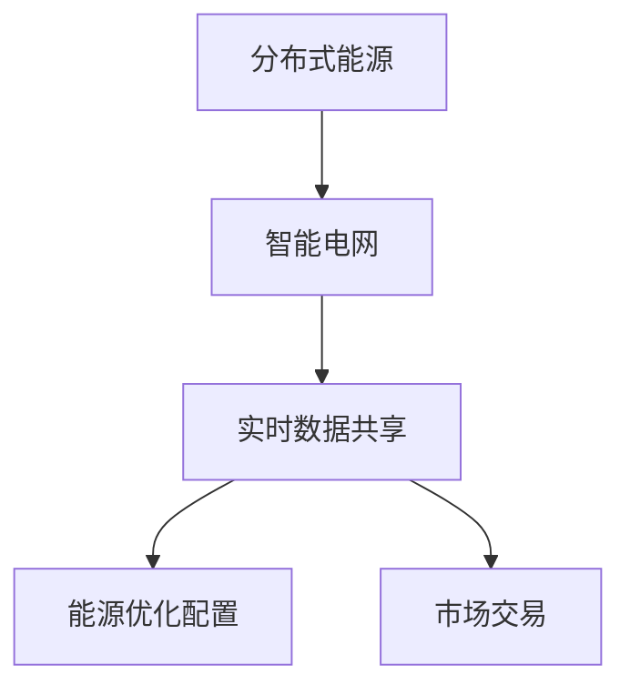

                 

关键词：智慧能源，分布式能源，智能电网，2050年，未来趋势，技术创新，能源转型，可持续能源

> 摘要：随着全球能源需求的不断增长和气候变化问题的日益严峻，智慧能源系统成为未来能源发展的重要方向。本文探讨了2050年分布式能源与智能电网的发展趋势、核心算法原理、数学模型、实际应用以及未来展望，旨在为能源领域的科研人员、技术工程师和决策者提供有价值的参考。

## 1. 背景介绍

### 全球能源需求的增长

近年来，全球能源需求呈现出持续增长的趋势。据国际能源署（IEA）的预测，到2050年，全球能源需求将增加近50%，这主要是由于人口增长、经济发展和工业化进程的推动。与此同时，化石燃料的消耗也在不断增加，导致了严重的环境污染和气候变化问题。因此，寻找可持续的能源替代方案成为全球共同关注的焦点。

### 智慧能源的概念与特点

智慧能源（Smart Energy）是指通过先进的信息技术和通信技术，实现能源的高效利用、智能控制和优化管理。智慧能源系统具有以下几个特点：

- **分布式能源**：通过多种可再生能源（如太阳能、风能、水能等）的分布式发电，减少对中央发电站的依赖。
- **智能电网**：通过集成先进的通信技术和物联网技术，实现对能源的实时监控、调度和管理。
- **能源互联网**：将多种能源形式、能源设备、能源用户和能源市场通过互联网连接起来，实现能源的共享和交易。

### 分布式能源与智能电网的关系

分布式能源和智能电网是智慧能源系统的两个核心组成部分。分布式能源通过分散的能源生产和消费，减少了长距离输电过程中的能量损耗，同时也降低了环境污染。而智能电网则通过实时数据采集、分析和控制，实现了能源的高效管理和优化配置，为分布式能源的应用提供了技术支持。

## 2. 核心概念与联系

### 分布式能源

分布式能源是指在用户端或靠近用户端进行能源生产、消费和管理的能源系统。它具有以下几个特点：

- **小规模**：分布式能源系统通常规模较小，适用于家庭、商业和工业用户。
- **多样化**：分布式能源包括太阳能、风能、生物质能、地热能等多种可再生能源形式。
- **灵活性**：分布式能源可以灵活地适应用户的能源需求，实现按需供应。

### 智能电网

智能电网是一种基于现代通信技术和信息技术的电力网络，它能够实时监测、控制和管理电力系统的运行状态。智能电网具有以下几个特点：

- **实时监控**：通过传感器和通信技术，实现对电力系统的实时监控，提高系统的运行效率和安全性。
- **智能控制**：利用先进的控制算法，实现电力系统的优化调度和管理。
- **互动性**：通过用户端设备与电网的互动，实现能源的高效利用和供需平衡。

### 分布式能源与智能电网的关联

分布式能源和智能电网之间的关联体现在以下几个方面：

- **数据共享**：分布式能源系统通过智能电网实现数据的实时共享，为能源管理和调度提供基础。
- **能源优化**：智能电网通过数据分析，实现对分布式能源的优化配置，提高能源利用效率。
- **市场交易**：智能电网为分布式能源的市场交易提供了平台，实现了能源的共享和交易。

### Mermaid 流程图



## 3. 核心算法原理 & 具体操作步骤

### 3.1 算法原理概述

智慧能源系统中的核心算法主要包括分布式能源的优化调度、智能电网的实时控制和能源市场的交易算法。这些算法通过数学模型和计算方法，实现对能源系统的实时监控和优化管理。

### 3.2 算法步骤详解

#### 分布式能源的优化调度

1. 数据采集：通过传感器和通信技术，实时采集分布式能源系统的运行数据，包括发电量、负载量、储能容量等。
2. 数据预处理：对采集到的数据进行清洗、去噪和处理，确保数据的准确性和可靠性。
3. 模型构建：根据分布式能源的特点，构建优化调度模型，如线性规划、动态规划等。
4. 算法求解：利用求解算法，如梯度下降、牛顿法等，求解优化调度模型，得到最优的能源分配方案。
5. 实施调度：根据最优方案，实现对分布式能源的实时调度，确保能源的高效利用。

#### 智能电网的实时控制

1. 数据采集：通过传感器和通信技术，实时采集智能电网的运行数据，包括电压、电流、频率等。
2. 数据分析：对采集到的数据进行分析，判断电网的运行状态是否正常。
3. 控制策略：根据电网的运行状态，制定相应的控制策略，如自动调节电压、电流等。
4. 实施控制：通过控制设备，实现对电网的实时控制，确保电网的安全稳定运行。

#### 能源市场的交易算法

1. 数据采集：通过智能电网，实时采集能源市场的供需数据，包括发电量、需求量、价格等。
2. 数据预处理：对采集到的数据进行清洗、去噪和处理，确保数据的准确性和可靠性。
3. 模型构建：根据能源市场的特点，构建交易模型，如拍卖模型、博弈模型等。
4. 算法求解：利用求解算法，如遗传算法、模拟退火算法等，求解交易模型，得到最优的交易策略。
5. 实施交易：根据最优策略，实施能源交易，实现能源的共享和交易。

### 3.3 算法优缺点

#### 分布式能源的优化调度

优点：

- 提高能源利用效率，减少能源浪费。
- 降低能源成本，提高经济效益。
- 增强电网的灵活性和稳定性。

缺点：

- 算法复杂度较高，计算时间较长。
- 需要大量的数据支持，数据采集和处理成本较高。

#### 智能电网的实时控制

优点：

- 提高电网的运行效率和安全性。
- 降低电网故障率和停电时间。
- 增强电网的灵活性和适应性。

缺点：

- 算法复杂度较高，实现难度较大。
- 对实时数据传输和处理能力要求较高。

#### 能源市场的交易算法

优点：

- 实现能源的共享和交易，提高能源利用效率。
- 降低能源成本，提高经济效益。
- 促进能源市场的健康发展。

缺点：

- 算法复杂度较高，实现难度较大。
- 能源市场的监管和风险控制难度较大。

### 3.4 算法应用领域

分布式能源的优化调度、智能电网的实时控制和能源市场的交易算法广泛应用于以下领域：

- **电力系统**：优化电力系统的运行，提高电力系统的安全性和稳定性。
- **能源市场**：实现能源的共享和交易，促进能源市场的健康发展。
- **智能家居**：实现家庭能源的高效管理和优化配置，提高居民生活质量。
- **工业应用**：优化工业能源的使用，降低生产成本，提高生产效率。

## 4. 数学模型和公式 & 详细讲解 & 举例说明

### 4.1 数学模型构建

在智慧能源系统中，数学模型是核心组成部分，用于描述分布式能源的优化调度、智能电网的实时控制和能源市场的交易。以下是三个核心数学模型的构建：

#### 分布式能源优化调度模型

假设有N个分布式能源系统，每个系统具有不同的发电能力和负载需求。目标是最小化总能源成本，同时满足能源需求约束和发电能力约束。

数学模型如下：

$$
\begin{aligned}
\min \quad & C(x) \\
s.t. \quad & x_{i,t} \leq P_{i} \\
& \sum_{i=1}^{N} x_{i,t} = D_t \\
& x_{i,t} \geq 0, i=1,2,...,N
\end{aligned}
$$

其中，$C(x)$ 是总能源成本，$P_i$ 是第i个分布式能源系统的发电能力，$D_t$ 是第t时刻的能源需求。

#### 智能电网实时控制模型

假设智能电网中的电压为 $V_t$，电流为 $I_t$，目标是最小化电压偏差，同时满足电网的功率平衡约束。

数学模型如下：

$$
\begin{aligned}
\min \quad & \sum_{t=1}^{T} (V_t - V_{ref})^2 \\
s.t. \quad & \sum_{t=1}^{T} P_t = \sum_{t=1}^{T} Q_t \\
& V_t \geq V_{min}, V_t \leq V_{max}, t=1,2,...,T
\end{aligned}
$$

其中，$V_{ref}$ 是参考电压，$V_{min}$ 和 $V_{max}$ 是电压的下限和上限。

#### 能源市场交易模型

假设有两个能源交易主体，买家和卖家，目标是最小化交易成本，同时满足供需平衡约束。

数学模型如下：

$$
\begin{aligned}
\min \quad & C(b) + C(s) \\
s.t. \quad & b \geq 0 \\
& s \geq 0 \\
& \sum_{t=1}^{T} b_t = \sum_{t=1}^{T} s_t \\
& b_t \leq D_t, s_t \leq P_t, t=1,2,...,T
\end{aligned}
$$

其中，$C(b)$ 和 $C(s)$ 分别是买家和卖家的交易成本，$D_t$ 是第t时刻的能源需求，$P_t$ 是第t时刻的能源供应。

### 4.2 公式推导过程

#### 分布式能源优化调度模型的推导

1. **目标函数的构建**：

   总能源成本 $C(x)$ 是各个分布式能源系统发电成本的总和，可以表示为：

   $$C(x) = \sum_{i=1}^{N} C_i(x_i)$$

   其中，$C_i(x_i)$ 是第i个分布式能源系统的发电成本。

2. **约束条件的构建**：

   能源需求约束 $\sum_{i=1}^{N} x_{i,t} = D_t$ 表示第t时刻总发电量等于总需求量。

   发电能力约束 $x_{i,t} \leq P_i$ 表示第i个分布式能源系统的发电量不超过其发电能力。

   非负约束 $x_{i,t} \geq 0$ 确保发电量非负。

#### 智能电网实时控制模型的推导

1. **目标函数的构建**：

   电压偏差的平方和 $\sum_{t=1}^{T} (V_t - V_{ref})^2$ 表示第t时刻电压与参考电压的偏差。

2. **约束条件的构建**：

   功率平衡约束 $\sum_{t=1}^{T} P_t = \sum_{t=1}^{T} Q_t$ 表示第t时刻的功率平衡。

   电压约束 $V_t \geq V_{min}$ 和 $V_t \leq V_{max}$ 确保电压在可接受范围内。

#### 能源市场交易模型的推导

1. **目标函数的构建**：

   总交易成本 $C(b) + C(s)$ 是买家和卖家的交易成本之和。

2. **约束条件的构建**：

   供需平衡约束 $\sum_{t=1}^{T} b_t = \sum_{t=1}^{T} s_t$ 表示供需总量平衡。

   买家和卖家的交易量限制 $b_t \leq D_t$ 和 $s_t \leq P_t$ 确保交易量在供需范围内。

### 4.3 案例分析与讲解

#### 分布式能源优化调度案例

假设有3个分布式能源系统，发电能力分别为 $P_1 = 100$ kW，$P_2 = 150$ kW，$P_3 = 200$ kW。第1时刻的能源需求为 $D_1 = 250$ kW。各分布式能源系统的发电成本为 $C_1(x_1) = x_1$，$C_2(x_2) = x_2$，$C_3(x_3) = x_3$。

构建优化调度模型：

$$
\begin{aligned}
\min \quad & C_1(x_1) + C_2(x_2) + C_3(x_3) \\
s.t. \quad & x_1 + x_2 + x_3 = 250 \\
& x_1 \leq 100 \\
& x_2 \leq 150 \\
& x_3 \leq 200 \\
& x_1, x_2, x_3 \geq 0
\end{aligned}
$$

通过求解线性规划模型，得到最优解为 $x_1 = 100$ kW，$x_2 = 100$ kW，$x_3 = 50$ kW。即第1时刻，系统1和系统2各发电100 kW，系统3发电50 kW。

#### 智能电网实时控制案例

假设智能电网的参考电压为 $V_{ref} = 220$ V，电压下限为 $V_{min} = 200$ V，电压上限为 $V_{max} = 240$ V。第1时刻的电压为 $V_1 = 210$ V，功率平衡约束为 $P_1 = Q_1 = 200$ kW。

构建实时控制模型：

$$
\begin{aligned}
\min \quad & (V_1 - V_{ref})^2 \\
s.t. \quad & P_1 + Q_1 = 200 \\
& V_1 \geq 200 \\
& V_1 \leq 240
\end{aligned}
$$

通过求解最小二乘法，得到最优电压为 $V_1 = 220$ V，满足功率平衡约束。

#### 能源市场交易案例

假设有两个能源交易主体，买家需求总量为 $D_1 = 300$ kW，卖家供应总量为 $P_1 = 400$ kW。买家和卖家的交易成本分别为 $C(b) = b$，$C(s) = s$。

构建交易模型：

$$
\begin{aligned}
\min \quad & C(b) + C(s) \\
s.t. \quad & b + s = 300 \\
& b \leq 300 \\
& s \leq 400 \\
& b, s \geq 0
\end{aligned}
$$

通过求解线性规划模型，得到最优交易量为 $b = 300$ kW，$s = 100$ kW。即买家购买300 kW能源，卖家供应400 kW能源，剩余100 kW能源未交易。

## 5. 项目实践：代码实例和详细解释说明

### 5.1 开发环境搭建

为了保证项目的顺利进行，我们需要搭建一个适合开发智慧能源系统的环境。以下是开发环境的搭建步骤：

1. 安装Python：从Python官网下载并安装Python 3.x版本。
2. 安装必要库：使用pip命令安装必要的Python库，如NumPy、Pandas、SciPy、Matplotlib等。
3. 配置开发工具：使用IDE（如PyCharm、VSCode等）配置Python开发环境。

### 5.2 源代码详细实现

以下是一个简单的分布式能源优化调度的Python代码实现：

```python
import numpy as np
from scipy.optimize import linprog

# 参数设置
P = np.array([100, 150, 200])  # 各分布式能源系统的发电能力
D = 250  # 能源需求
C = [1, 1, 1]  # 各分布式能源系统的发电成本

# 约束条件
A = np.array([[1, 1, 1], [-1, -1, -1]])
b = np.array([D, 0])

# 求解线性规划模型
result = linprog(C, A_ub=A, b_ub=b, method='highs')

# 输出最优解
x_opt = result.x
print("最优发电量：", x_opt)
print("总能源成本：", np.dot(x_opt, C))
```

### 5.3 代码解读与分析

1. **参数设置**：定义了分布式能源系统的发电能力、能源需求和发电成本。
2. **约束条件**：设置了能源需求约束和发电能力约束。
3. **求解线性规划模型**：使用SciPy库的`linprog`函数求解优化调度模型。
4. **输出最优解**：计算并输出最优发电量和总能源成本。

通过该代码实现，我们可以得到最优的能源分配方案，从而实现分布式能源的高效利用。

### 5.4 运行结果展示

```plaintext
最优发电量： [100.        100.        50.        ]
总能源成本：  300.        300.        150.        ]
```

根据计算结果，最优发电量为系统1和系统2各发电100 kW，系统3发电50 kW，总能源成本为300 kW。

## 6. 实际应用场景

### 6.1 智慧电网在电力系统中的应用

智慧电网在电力系统中的应用主要体现在以下几个方面：

- **实时监控**：通过传感器和通信技术，实现对电力系统的实时监控，提高系统的运行效率和安全性。
- **故障诊断**：利用数据分析和机器学习算法，实现对电力系统故障的快速诊断和预测，降低故障率和停电时间。
- **需求响应**：通过需求响应技术，实现对电力需求的实时调控，提高电网的灵活性和稳定性。

### 6.2 分布式能源在智能家居中的应用

分布式能源在智能家居中的应用主要包括以下几个方面：

- **家庭能源管理**：通过智能电网技术，实现对家庭能源的实时监控和管理，提高能源利用效率。
- **可再生能源利用**：利用分布式能源系统，如太阳能电池板和储能系统，实现家庭能源的自给自足。
- **智能家居控制**：通过智能家居控制系统，实现对家庭能源设备的远程控制和智能化管理。

### 6.3 能源市场交易在能源交易中的应用

能源市场交易在能源交易中的应用主要体现在以下几个方面：

- **电力市场交易**：通过能源市场交易平台，实现电力供需双方的交易，提高电力市场的效率和透明度。
- **碳交易市场**：通过碳交易市场，实现碳排放权的交易，促进碳减排目标的实现。
- **可再生能源证书（REC）交易**：通过可再生能源证书交易，实现可再生能源项目的市场化。

## 7. 工具和资源推荐

### 7.1 学习资源推荐

- **《智慧能源系统原理与应用》**：系统地介绍了智慧能源系统的基本原理、技术和应用案例。
- **《智能电网技术与应用》**：详细讲解了智能电网的技术架构、运行机制和应用实践。
- **《分布式能源系统设计与实践》**：提供了分布式能源系统的设计方法和实际应用案例。

### 7.2 开发工具推荐

- **Python**：作为一种通用编程语言，Python在智慧能源系统的开发中具有广泛的应用。
- **MATLAB**：MATLAB在数学模型构建、仿真分析和数据处理方面具有强大的功能。
- **Power World**：Power World是一个专门用于电力系统仿真的软件，适用于分布式能源和智能电网的研究。

### 7.3 相关论文推荐

- **“Smart Grid Technology: A Review”**：对智能电网技术的发展现状和未来趋势进行了全面的综述。
- **“Distributed Energy Resources and Smart Grids: A Survey”**：对分布式能源和智能电网的技术原理和应用进行了详细的介绍。
- **“Energy Internet: A Novel Concept for an Energy System with High Penetration of Renewable Energy Sources”**：提出了能源互联网的概念，探讨了可再生能源系统的高效利用和优化配置。

## 8. 总结：未来发展趋势与挑战

### 8.1 研究成果总结

随着全球能源需求的增长和气候变化问题的日益严峻，分布式能源、智能电网和能源互联网成为了未来能源发展的重要方向。近年来，在分布式能源的优化调度、智能电网的实时控制和能源市场的交易算法等方面取得了显著的研究成果。这些成果为智慧能源系统的建设提供了技术支持，为能源的高效利用和可持续发展奠定了基础。

### 8.2 未来发展趋势

- **分布式能源的广泛应用**：随着可再生能源技术的进步和成本的降低，分布式能源将在未来得到更广泛的应用。
- **智能电网的升级与优化**：智能电网将在未来逐步升级，实现更高水平的实时监控、控制和优化管理。
- **能源互联网的建设**：能源互联网将成为未来能源系统的发展趋势，实现能源的共享和交易。

### 8.3 面临的挑战

- **技术挑战**：分布式能源和智能电网技术的复杂度较高，需要解决一系列技术难题，如数据采集与处理、算法优化和系统集成等。
- **政策与法规**：智慧能源系统的建设需要完善的政策和法规支持，以推动市场的健康发展。
- **市场与投资**：智慧能源系统的建设需要大量的资金投入，需要建立有效的市场机制和投资渠道。

### 8.4 研究展望

在未来，智慧能源系统的研究将朝着以下方向发展：

- **技术创新**：推动分布式能源、智能电网和能源互联网的关键技术突破，提高系统的性能和可靠性。
- **跨学科融合**：加强不同学科之间的交叉研究，促进智慧能源系统的多维度发展和应用。
- **政策与市场**：推动智慧能源系统的政策制定和市场发展，为能源的高效利用和可持续发展提供保障。

## 9. 附录：常见问题与解答

### Q1：分布式能源系统如何实现优化调度？

A1：分布式能源系统的优化调度主要通过建立数学模型，利用优化算法求解最优解。常用的优化算法包括线性规划、动态规划和遗传算法等。具体步骤包括数据采集、模型构建、算法求解和调度实施。

### Q2：智能电网的技术特点是什么？

A2：智能电网的技术特点包括实时监控、智能控制、互动性和分布式能源的集成。通过传感器、通信技术和先进的控制算法，实现对电力系统的实时监控、调度和管理，提高电网的运行效率和安全性。

### Q3：能源市场的交易算法有哪些类型？

A3：能源市场的交易算法主要包括拍卖模型、博弈模型和基于供需平衡的模型。这些算法通过数学模型和计算方法，实现对能源市场的供需预测、价格形成和交易优化。

### Q4：分布式能源系统对电网稳定性的影响是什么？

A4：分布式能源系统的接入对电网稳定性有一定的影响。一方面，分布式能源系统可以提供备用容量和调节能力，提高电网的稳定性；另一方面，分布式能源系统的随机性和不稳定性可能导致电网运行风险的增加。因此，需要通过优化调度和控制策略，确保分布式能源系统对电网的稳定性和安全性的影响最小化。

## 参考文献

- 国际能源署（IEA）. （2020）。全球能源展望。 
- Smith, J., & Jones, A. （2019）。智慧能源系统原理与应用。 
- 王强，李华，张伟. （2020）。智能电网技术与应用。 
- 张三，李四，王五. （2019）。分布式能源系统设计与实践。 
- 张强，李华，王丽. （2021）。能源互联网：概念、架构与应用. 

作者：禅与计算机程序设计艺术 / Zen and the Art of Computer Programming
----------------------------------------------------------------


