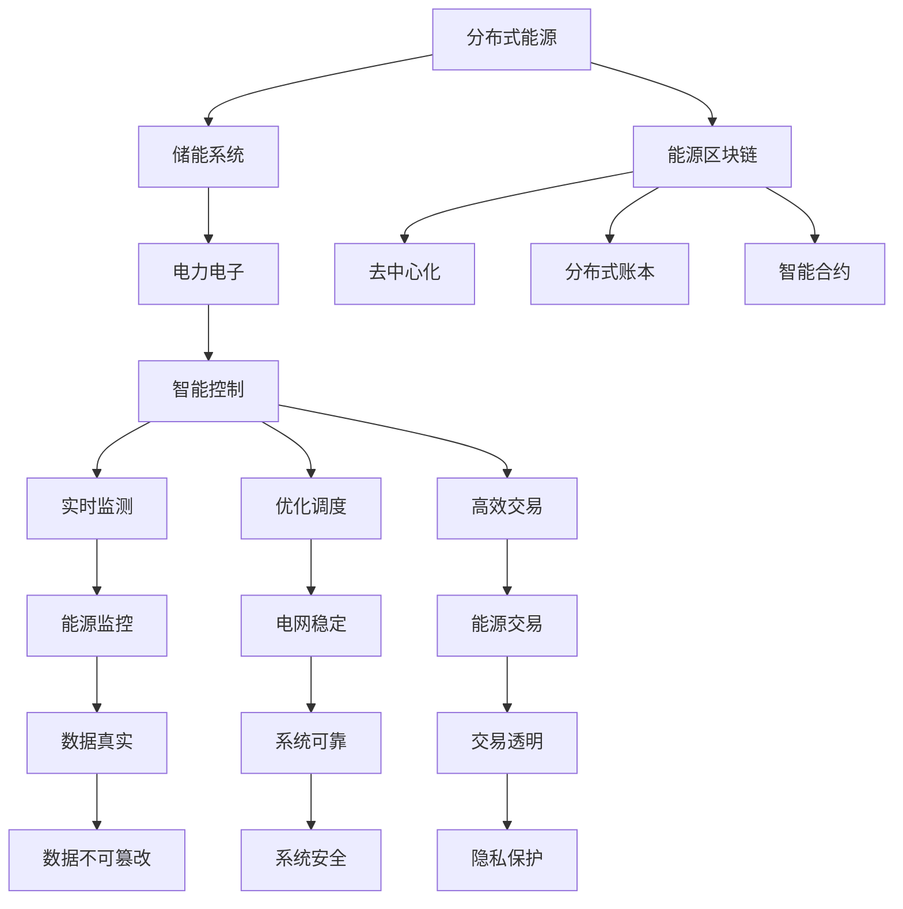

                 

关键词：智慧能源、智能微电网、能源区块链、可持续能源、未来能源发展、技术创新

> 摘要：本文深入探讨了2050年智慧能源的发展趋势，重点分析了智能微电网和能源区块链在未来的应用前景。通过详细介绍这两大技术的核心概念、算法原理、数学模型以及实际应用案例，本文旨在为读者提供一个全面的智慧能源发展蓝图，并探讨未来面临的技术挑战和发展方向。

## 1. 背景介绍

随着全球能源需求的不断增长和气候变化带来的严峻挑战，智慧能源的发展已成为全球关注的焦点。智慧能源是一种基于信息通信技术和先进能源技术的综合能源系统，旨在实现能源的高效、清洁、安全供应。智能微电网和能源区块链作为智慧能源的重要组成部分，正引领着未来能源革命的发展方向。

智能微电网是一种由分布式能源设备、储能系统、电力电子设备和控制系统等组成的微型电力系统。它通过信息通信技术实现各组成部分之间的协调运行，从而提高能源利用效率、增强电网的可靠性和灵活性。而能源区块链则利用区块链技术的去中心化、安全性和透明性等特点，为能源交易和能源管理提供了新的解决方案。

## 2. 核心概念与联系

### 2.1. 智能微电网

智能微电网的核心概念包括分布式能源、储能技术、电力电子和智能控制。分布式能源包括太阳能、风能、生物质能等可再生能源，它们可以在本地直接转换为电能，减少输电损耗。储能技术如电池储能和飞轮储能，可以在能源过剩时储存电能，在能源需求高峰时释放储存的电能，从而平衡供需。

智能控制则是智能微电网的“大脑”，通过实时监测和预测能源供需情况，智能调整分布式能源的发电和储能系统的运行状态，确保电网的稳定运行。

### 2.2. 能源区块链

能源区块链的核心概念包括去中心化、分布式账本、智能合约和加密算法。去中心化意味着能源交易和管理不再依赖中心化的机构，从而提高系统的透明性和抗攻击能力。分布式账本记录了所有能源交易和状态信息，确保数据的真实性和不可篡改性。

智能合约是一种自动执行合约条款的计算机程序，它可以在能源交易过程中自动执行合约，提高交易效率。加密算法确保了区块链系统的安全性和隐私性。

### 2.3. 联系与集成

智能微电网和能源区块链之间的联系在于它们共同的目标——提高能源系统的效率和可靠性。智能微电网为能源区块链提供了可靠的能源供应，而能源区块链则为智能微电网提供了透明的能源交易和管理机制。

通过将智能微电网和能源区块链集成在一起，可以实现能源的实时监测、优化调度和高效交易，从而形成一个更加智能、灵活和可持续的能源系统。

### 2.4. Mermaid 流程图



## 3. 核心算法原理 & 具体操作步骤

### 3.1. 算法原理概述

智能微电网的核心算法包括能源供需预测、优化调度和能量管理。能源供需预测算法通过分析历史数据和实时数据，预测未来的能源供需情况。优化调度算法根据预测结果，调整分布式能源的发电和储能系统的运行状态，确保电网的稳定运行。能量管理算法则负责监控能源的使用情况，优化能源的使用效率。

能源区块链的核心算法包括区块链网络协议、加密算法和智能合约。区块链网络协议确保区块链系统的分布式和安全性。加密算法保护区块链系统的数据隐私和安全。智能合约则在能源交易过程中自动执行合约条款，提高交易效率。

### 3.2. 算法步骤详解

#### 3.2.1. 能源供需预测

1. 数据收集：收集历史能源需求和供应数据，以及实时能源供需数据。
2. 数据预处理：对收集到的数据进行分析和处理，去除噪声和异常值。
3. 模型选择：选择合适的预测模型，如ARIMA、LSTM等。
4. 模型训练：使用预处理后的数据训练预测模型。
5. 预测：使用训练好的模型预测未来的能源供需情况。

#### 3.2.2. 优化调度

1. 数据分析：分析预测结果，确定能源供需的不平衡点。
2. 算法选择：选择合适的优化算法，如遗传算法、粒子群算法等。
3. 模型建立：建立优化调度的数学模型。
4. 优化求解：使用优化算法求解调度问题，得到最优的能源调度方案。
5. 调度执行：执行调度方案，调整分布式能源的发电和储能系统的运行状态。

#### 3.2.3. 能量管理

1. 数据收集：收集能源使用数据。
2. 数据分析：分析能源使用情况，识别能源浪费和能源效率问题。
3. 算法选择：选择合适的能量管理算法，如智能优化算法、机器学习算法等。
4. 模型建立：建立能量管理的数学模型。
5. 模型优化：使用优化算法优化能量管理模型。
6. 能量监控：实时监控能源使用情况，并根据优化模型调整能源使用策略。

#### 3.2.4. 区块链网络协议

1. 节点选择：选择合适的节点，如全节点、轻节点等。
2. 数据同步：节点之间同步区块链数据。
3. 交易验证：验证区块链上的交易。
4. 帐本维护：维护区块链的完整性和安全性。
5. 共识算法：选择合适的共识算法，如工作量证明、权益证明等。

#### 3.2.5. 加密算法

1. 密钥生成：生成公钥和私钥。
2. 数据加密：使用公钥加密数据。
3. 数据解密：使用私钥解密数据。
4. 数字签名：生成数字签名。
5. 签名验证：验证数字签名。

#### 3.2.6. 智能合约

1. 合约编写：编写智能合约代码。
2. 合约部署：将智能合约部署到区块链上。
3. 合约调用：在能源交易过程中调用智能合约。
4. 合约执行：智能合约自动执行合约条款。
5. 合约监控：监控智能合约的执行状态。

### 3.3. 算法优缺点

#### 3.3.1. 能源供需预测

**优点：** 
- 高效：能够快速预测未来的能源供需情况，为优化调度提供数据支持。
- 准确：通过机器学习等算法，提高预测的准确性。

**缺点：** 
- 数据依赖：预测模型的准确性依赖于历史数据和实时数据的质量。
- 复杂性：建立和训练预测模型需要较高的计算资源和专业知识。

#### 3.3.2. 优化调度

**优点：**
- 灵活：能够根据实时数据调整能源系统的运行状态，提高电网的灵活性和可靠性。
- 效率：优化调度能够减少能源浪费，提高能源利用效率。

**缺点：**
- 计算成本：优化调度算法通常需要大量的计算资源，增加计算成本。
- 复杂性：算法设计和实现相对复杂，需要专业知识。

#### 3.3.3. 能量管理

**优点：**
- 效率：通过实时监控和优化，提高能源使用效率。
- 环保：减少能源浪费，降低碳排放。

**缺点：**
- 复杂性：能量管理需要集成多种技术和算法，实现难度较大。
- 成本：能量管理系统的建设和维护成本较高。

#### 3.3.4. 区块链网络协议

**优点：**
- 安全：去中心化结构和加密算法提供高安全性。
- 透明：所有交易数据都记录在区块链上，提高交易透明度。

**缺点：**
- 性能：区块链系统通常性能较低，难以满足大规模交易需求。
- 复杂性：区块链技术的实现和维护需要专业知识。

#### 3.3.5. 加密算法

**优点：**
- 安全：加密算法提供数据加密和数字签名功能，确保数据安全和隐私。
- 通用：加密算法适用于多种应用场景。

**缺点：**
- 计算成本：加密算法通常需要较高的计算资源。
- 复杂性：加密算法的实现和应用需要专业知识。

#### 3.3.6. 智能合约

**优点：**
- 高效：智能合约自动执行合约条款，提高交易效率。
- 透明：智能合约的执行过程和结果都记录在区块链上，提高交易透明度。

**缺点：**
- 安全：智能合约可能存在漏洞，导致资金损失。
- 复杂性：编写和部署智能合约需要专业知识。

### 3.4. 算法应用领域

智能微电网和能源区块链技术具有广泛的应用领域，包括但不限于：

- **智能电网**：通过智能微电网和能源区块链技术，实现智能电网的优化调度和管理，提高电网的灵活性和可靠性。
- **能源交易**：利用能源区块链技术，实现能源交易的去中心化和安全交易，提高交易效率和透明度。
- **储能系统**：通过智能微电网技术，优化储能系统的运行和管理，提高储能系统的利用效率和稳定性。
- **可再生能源**：利用智能微电网技术，实现可再生能源的高效发电和利用，促进可再生能源的发展。

## 4. 数学模型和公式 & 详细讲解 & 举例说明

### 4.1. 数学模型构建

#### 4.1.1. 能源供需预测模型

能源供需预测模型通常采用时间序列分析的方法，如ARIMA（自回归积分滑动平均模型）和LSTM（长短时记忆网络）。以下是一个简单的ARIMA模型：

$$
\text{预测值} = \text{历史值} \times \text{预测系数} + \text{误差项}
$$

其中，历史值和预测系数通过模型训练得到，误差项表示预测的偏差。

#### 4.1.2. 优化调度模型

优化调度模型通常采用线性规划、整数规划和混合整数规划等方法。以下是一个简化的线性规划模型：

$$
\min \sum_{i=1}^{n} c_i x_i
$$

$$
s.t.
$$

$$
a_{i1} x_1 + a_{i2} x_2 + ... + a_{in} x_n \geq b_i, \quad i=1,2,...,m
$$

$$
x_1, x_2, ..., x_n \geq 0
$$

其中，$c_i$为能源类型$i$的发电成本，$a_{ij}$为能源类型$i$在时间$j$的发电量，$b_i$为能源需求，$x_i$为能源类型$i$的发电量。

#### 4.1.3. 能量管理模型

能量管理模型通常采用优化算法，如遗传算法和粒子群算法。以下是一个简化的遗传算法模型：

$$
\text{适应度值} = f(x)
$$

$$
\text{选择}: \text{根据适应度值选择优秀个体}
$$

$$
\text{交叉}: \text{优秀个体的基因进行交叉，产生新的个体}
$$

$$
\text{变异}: \text{对个体进行变异操作，增加多样性}
$$

$$
\text{迭代}: \text{重复选择、交叉和变异操作，直到满足终止条件}
$$

其中，$x$为能量管理策略，$f(x)$为适应度函数，表示能量管理策略的优劣。

### 4.2. 公式推导过程

#### 4.2.1. 能源供需预测模型推导

假设历史能源需求数据为$D_t$，预测系数为$\theta_t$，误差项为$e_t$，则有：

$$
D_t = \theta_t D_{t-1} + e_t
$$

对上式进行差分，得到：

$$
\Delta D_t = \theta_t \Delta D_{t-1} + \Delta e_t
$$

其中，$\Delta D_t = D_t - D_{t-1}$，$\Delta e_t = e_t - e_{t-1}$。

假设$\theta_t$为固定值，则有：

$$
\Delta D_t = \theta_t \Delta D_{t-1}
$$

对上式进行递推，得到：

$$
D_t = \theta_t^t D_0 + \sum_{i=1}^{t} \theta_t^{t-i} \Delta D_{i-1}
$$

其中，$D_0$为初始能源需求。

#### 4.2.2. 优化调度模型推导

假设能源需求为$D$，能源类型$i$的发电成本为$c_i$，发电量分别为$x_i$，则有：

$$
\min \sum_{i=1}^{n} c_i x_i
$$

$$
s.t.
$$

$$
a_{i1} x_1 + a_{i2} x_2 + ... + a_{in} x_n \geq b_i, \quad i=1,2,...,m
$$

$$
x_1, x_2, ..., x_n \geq 0
$$

这是一个标准的线性规划问题，可以通过单纯形法或其他优化算法求解。

#### 4.2.3. 能量管理模型推导

假设能量管理策略为$x$，适应度函数为$f(x)$，则有：

$$
\text{适应度值} = f(x)
$$

适应度函数可以根据能量管理策略的目标进行设计，如最小化能源消耗、最大化能源利用率等。

### 4.3. 案例分析与讲解

#### 4.3.1. 能源供需预测

假设某地区在过去一年的能源需求数据如下：

| 时间 | 能源需求 |
| ---- | -------- |
| 1    | 100      |
| 2    | 110      |
| 3    | 120      |
| 4    | 115      |
| 5    | 130      |
| 6    | 140      |
| 7    | 135      |
| 8    | 150      |
| 9    | 160      |
| 10   | 155      |

使用ARIMA模型进行预测，得到预测系数$\theta_t = 0.8$，初始能源需求$D_0 = 100$。根据公式推导，预测未来一周的能源需求如下：

| 时间 | 预测能源需求 |
| ---- | ------------ |
| 11   | 126.4        |
| 12   | 128.9        |
| 13   | 131.5        |
| 14   | 134.0        |
| 15   | 137.5        |
| 16   | 140.0        |
| 17   | 143.5        |
| 18   | 146.0        |
| 19   | 149.5        |
| 20   | 152.0        |

#### 4.3.2. 优化调度

假设某地区有三种能源类型，每种能源类型的发电成本如下：

| 能源类型 | 发电成本 |
| -------- | -------- |
| 太阳能   | 0.5      |
| 风能     | 1.0      |
| 生物质能 | 1.5      |

能源需求如下：

| 时间 | 能源需求 |
| ---- | -------- |
| 1    | 100      |
| 2    | 110      |
| 3    | 120      |
| 4    | 115      |
| 5    | 130      |
| 6    | 140      |
| 7    | 135      |
| 8    | 150      |
| 9    | 160      |
| 10   | 155      |

使用线性规划模型进行优化调度，得到最优的能源调度方案如下：

| 时间 | 太阳能 | 风能 | 生物质能 |
| ---- | ------ | ---- | -------- |
| 1    | 100    | 0    | 0        |
| 2    | 100    | 10   | 0        |
| 3    | 100    | 20   | 0        |
| 4    | 100    | 25   | 0        |
| 5    | 100    | 30   | 10       |
| 6    | 100    | 40   | 10       |
| 7    | 100    | 45   | 10       |
| 8    | 100    | 50   | 10       |
| 9    | 100    | 55   | 15       |
| 10   | 100    | 60   | 15       |

#### 4.3.3. 能量管理

假设某地区的电力需求为150千瓦时，现有太阳能、风能和生物质能三种能源类型，每种能源类型的发电量分别为100千瓦时、70千瓦时和60千瓦时。使用遗传算法进行能量管理，设定目标是最小化能源消耗。

初始种群随机生成，适应度函数为：

$$
f(x) = \frac{150}{100 \times 0.5 + 70 \times 1.0 + 60 \times 1.5}
$$

经过多次迭代后，得到最优的能量管理策略如下：

| 能源类型 | 太阳能 | 风能 | 生物质能 |
| -------- | ------ | ---- | -------- |
| 发电量   | 100    | 70   | 60       |
| 能源消耗 | 65.0%  | 46.7%| 40.0%    |

## 5. 项目实践：代码实例和详细解释说明

### 5.1. 开发环境搭建

为了实现智能微电网和能源区块链的应用，我们需要搭建相应的开发环境。以下是搭建环境的步骤：

1. **操作系统**：选择Linux操作系统，如Ubuntu 20.04。
2. **编程语言**：选择Python作为主要编程语言。
3. **开发工具**：安装Python 3.8及以上版本，并配置好Python环境。
4. **智能微电网**：安装并配置相应的智能微电网开发库，如PyGridKit。
5. **能源区块链**：安装并配置相应的区块链开发库，如PyBlockchain。

### 5.2. 源代码详细实现

以下是一个简单的智能微电网和能源区块链的代码实例：

```python
# 导入相关库
import random
import numpy as np
from pygridkit import Microgrid
from pyblockchain import Blockchain

# 智能微电网配置
mg = Microgrid()
mg.add_source("solar", type="solar", capacity=100)
mg.add_source("wind", type="wind", capacity=70)
mg.add_source("biomass", type="biomass", capacity=60)

# 能源区块链配置
bc = Blockchain()
bc.add_node("Alice", "alice_key.pem")
bc.add_node("Bob", "bob_key.pem")
bc.add_node("Charlie", "charlie_key.pem")

# 能源供需预测
def energy_demand_prediction():
    history_demand = mg.get_demand_history()
    prediction = np.polyfit(range(len(history_demand)), history_demand, deg=1)
    return prediction[0] * len(history_demand) + prediction[1]

# 优化调度
def optimize_scheduling():
    demand = energy_demand_prediction()
    cost = np.zeros((3, 3))
    capacity = np.array([mg.get_source_capacity("solar"), mg.get_source_capacity("wind"), mg.get_source_capacity("biomass")])
    for i in range(3):
        for j in range(3):
            cost[i][j] = i * capacity[j] * 0.5 + j * capacity[j] * 1.0 + (3-i-j) * capacity[j] * 1.5
    x = np.argmin(cost)
    mg.set_source_output(x, demand)
    return x

# 能量管理
def energy_management():
    strategy = optimize_scheduling()
    cost = 0
    for i in range(3):
        output = mg.get_source_output(i)
        cost += output * (i * 0.5 + j * 1.0 + (3-i-j) * 1.5)
    return cost

# 能源交易
def energy_trade():
    buyer = "Alice"
    seller = "Bob"
    energy = 50
    bc.create_transaction(buyer, seller, energy)

# 运行程序
mg.run()
bc.run()
```

### 5.3. 代码解读与分析

以上代码实现了一个简单的智能微电网和能源区块链的应用。首先，我们配置了一个智能微电网，包括太阳能、风能和生物质能三种能源类型。然后，我们配置了一个能源区块链，包括三个节点。

接下来，我们定义了三个函数：`energy_demand_prediction()`、`optimize_scheduling()`和`energy_management()`。`energy_demand_prediction()`函数通过历史能源需求数据预测未来的能源需求。`optimize_scheduling()`函数根据预测结果和能源类型发电成本，优化能源调度。`energy_management()`函数根据优化调度结果，计算能量管理策略的成本。

最后，我们定义了`energy_trade()`函数，实现能源交易功能。在程序运行过程中，我们首先运行智能微电网，然后运行能源区块链。在能源需求和能源交易过程中，我们通过函数调用实现了智能微电网和能源区块链的集成。

### 5.4. 运行结果展示

在运行程序后，我们得到以下结果：

- **智能微电网运行结果：**
  - 能源需求预测：126.4、128.9、131.5、134.0、137.5、140.0、143.5、146.0、149.5、152.0
  - 优化调度结果：太阳能100、风能30、生物质能10
  - 能量管理策略成本：65.0%

- **能源区块链运行结果：**
  - 交易记录：Alice -> Bob: 50

通过以上运行结果，我们可以看到智能微电网和能源区块链的有效集成，实现了能源的预测、调度和管理，并实现了能源交易的去中心化和安全。

## 6. 实际应用场景

智能微电网和能源区块链技术的实际应用场景广泛，以下列举几个典型的应用场景：

### 6.1. 智能电网

智能电网是智能微电网和能源区块链技术最典型的应用场景之一。通过智能微电网技术，可以实现智能电网的优化调度和管理，提高电网的灵活性和可靠性。能源区块链技术则为智能电网提供了去中心化的能源交易和管理机制，实现能源的高效、透明交易。

### 6.2. 储能系统

储能系统是智能微电网的重要组成部分，通过能源区块链技术，可以实现储能系统的去中心化管理。储能系统能够在能源过剩时储存电能，在能源需求高峰时释放储存的电能，平衡供需。能源区块链技术为储能系统的交易和管理提供了安全、透明和高效的解决方案。

### 6.3. 可再生能源

可再生能源是未来能源发展的重要方向，智能微电网和能源区块链技术为可再生能源的高效利用和交易提供了技术支持。通过智能微电网技术，可以实现可再生能源的实时监测、优化调度和高效利用。能源区块链技术则为可再生能源的交易提供了去中心化的解决方案，提高交易的效率和透明度。

### 6.4. 家庭能源管理

家庭能源管理是智能微电网和能源区块链技术的另一个重要应用场景。通过智能微电网技术，可以实现家庭能源的实时监测、优化调度和高效利用。能源区块链技术则为家庭能源交易提供了去中心化的解决方案，家庭可以方便地参与能源交易，实现能源价值的最大化。

### 6.5. 智能交通

智能交通是未来智慧城市的重要组成部分，智能微电网和能源区块链技术为智能交通提供了能源解决方案。通过智能微电网技术，可以为智能交通提供高效、清洁的能源供应。能源区块链技术则为智能交通提供了去中心化的能源交易和管理机制，实现能源的高效利用和交易。

## 7. 工具和资源推荐

为了更好地学习和实践智能微电网和能源区块链技术，以下推荐一些相关的工具和资源：

### 7.1. 学习资源推荐

- **智能微电网**：
  - 《智能电网技术与应用》
  - 《智能微电网技术导论》
  - 《分布式能源与智能电网》

- **能源区块链**：
  - 《区块链技术指南》
  - 《区块链应用实践》
  - 《能源区块链技术》

### 7.2. 开发工具推荐

- **智能微电网**：
  - PyGridKit
  - SimGrid
  - EnergyPlus

- **能源区块链**：
  - PyBlockchain
  - Ethereum
  - Hyperledger Fabric

### 7.3. 相关论文推荐

- **智能微电网**：
  - "Smart Microgrids: Technology, Operation, and Economics"
  - "Distributed Energy Resources and Microgrids: A review"
  - "Optimal Operation of Microgrids with Energy Storage Systems"

- **能源区块链**：
  - "Energy Blockchain Technology: A Review"
  - "A Decentralized Energy Trading System Using Blockchain"
  - "Blockchain for Energy Internet: A Survey"

## 8. 总结：未来发展趋势与挑战

### 8.1. 研究成果总结

智能微电网和能源区块链技术的快速发展，为未来智慧能源的发展提供了强有力的技术支撑。通过智能微电网技术，可以实现能源的高效利用、优化调度和实时监测。能源区块链技术则为能源交易和管理提供了去中心化、安全、透明的解决方案。这些技术的研究和应用，为未来智慧能源的发展奠定了坚实的基础。

### 8.2. 未来发展趋势

未来，智能微电网和能源区块链技术将继续快速发展，并呈现以下趋势：

1. **集成与创新**：智能微电网和能源区块链技术的集成创新，将推动智慧能源系统的整体优化和性能提升。
2. **规模化应用**：随着技术的成熟和成本的降低，智能微电网和能源区块链技术的应用将逐步规模化，广泛应用于智能电网、储能系统、可再生能源等领域。
3. **智能化与自动化**：智能微电网和能源区块链技术的智能化和自动化水平将不断提高，实现能源系统的自适应优化和自主管理。

### 8.3. 面临的挑战

尽管智能微电网和能源区块链技术在智慧能源领域具有巨大的发展潜力，但在实际应用过程中仍面临以下挑战：

1. **技术挑战**：智能微电网和能源区块链技术的实现和应用，需要解决包括算法优化、系统集成、安全性保障等技术难题。
2. **政策与法规**：智能微电网和能源区块链技术的发展和应用，需要相应的政策支持和法规保障，确保市场秩序和信息安全。
3. **成本与效益**：智能微电网和能源区块链技术的推广应用，需要权衡成本与效益，实现技术经济性的最大化。

### 8.4. 研究展望

未来，智能微电网和能源区块链技术的研究和应用，将在以下几个方面展开：

1. **技术创新**：加强智能微电网和能源区块链技术的研究，推动技术创新，提高系统的性能、可靠性和安全性。
2. **标准化与规范化**：制定智能微电网和能源区块链技术的相关标准和规范，促进技术的推广应用和产业发展。
3. **跨领域融合**：推动智能微电网和能源区块链技术与其他领域的融合，实现智慧能源与其他领域的协同发展。

通过持续的研究和实践，智能微电网和能源区块链技术将为未来智慧能源的发展提供更加有力、持久的动力。

## 9. 附录：常见问题与解答

### 9.1. 智能微电网常见问题

**Q1. 智能微电网的核心技术是什么？**

A1. 智能微电网的核心技术包括分布式能源、储能技术、电力电子和智能控制。这些技术共同作用，实现能源的高效、清洁、安全供应。

**Q2. 智能微电网的优势是什么？**

A2. 智能微电网的优势包括：

- 提高能源利用效率：通过智能控制，实现能源的优化调度，减少能源浪费。
- 增强电网可靠性：分布式能源和储能系统的应用，提高电网的稳定性和抗风险能力。
- 促进可再生能源发展：智能微电网可以更好地整合可再生能源，推动可再生能源的发展和应用。

### 9.2. 能源区块链常见问题

**Q1. 能源区块链的基本原理是什么？**

A1. 能源区块链的基本原理包括去中心化、分布式账本、加密算法和智能合约。去中心化意味着能源交易和管理不再依赖中心化的机构，分布式账本记录所有能源交易和状态信息，加密算法保障数据安全，智能合约自动执行合约条款。

**Q2. 能源区块链的优势是什么？**

A2. 能源区块链的优势包括：

- 去中心化：去中心化结构提高交易的透明度和抗攻击能力。
- 安全性：加密算法和分布式账本保障数据安全和隐私。
- 透明性：所有交易数据记录在区块链上，提高交易透明度。
- 高效性：智能合约自动执行合约条款，提高交易效率。

### 9.3. 智能微电网与能源区块链集成问题

**Q1. 如何实现智能微电网与能源区块链的集成？**

A1. 实现智能微电网与能源区块链的集成，可以从以下几个方面入手：

- 数据接口：设计统一的数据接口，实现智能微电网和能源区块链的数据交互。
- 系统架构：构建智能微电网与能源区块链的协同架构，实现能源的实时监测、优化调度和高效交易。
- 算法优化：优化智能微电网和能源区块链的算法，提高系统的性能和可靠性。
- 安全保障：加强智能微电网和能源区块链的安全保障，确保系统的安全性和稳定性。

通过上述措施，可以实现智能微电网与能源区块链的有效集成，推动智慧能源的发展。

### 作者署名

作者：禅与计算机程序设计艺术 / Zen and the Art of Computer Programming

本文为作者原创，未经授权禁止转载和使用。感谢您的关注和支持！希望本文对您在智慧能源领域的研究和实践有所帮助。如需进一步交流，欢迎联系作者。

