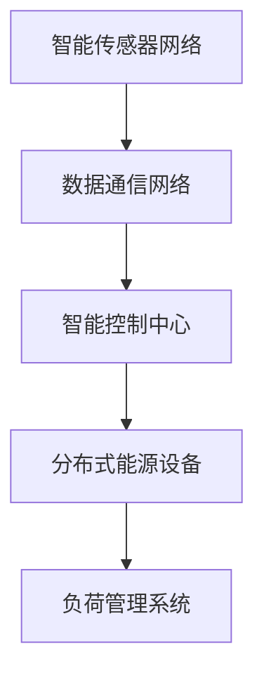
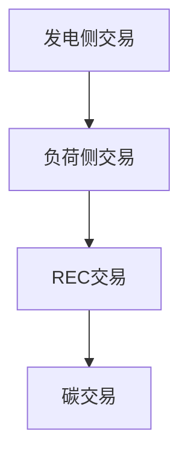

                 

关键词：智慧能源，智能配电网，新能源交易，未来趋势，技术发展，计算算法，数学模型，实践应用

> 摘要：本文探讨了2050年可能的智慧能源生态系统，重点介绍了智能配电网的架构、新能源交易模式以及未来智慧能源的发展趋势与面临的挑战。通过深入分析，文章提出了适用于未来的能源计算算法和数学模型，并探讨了其实际应用案例。最后，文章对未来的智慧能源进行了展望，提出了研究和应用的建议。

## 1. 背景介绍

随着全球能源需求的不断增长和环境污染的日益严重，传统的化石能源已无法满足可持续发展的需求。近年来，新能源技术如太阳能、风能、地热能等得到了广泛关注。这些新能源的快速发展为构建智慧能源生态系统提供了可能。智慧能源旨在通过先进的信息技术、网络技术和控制技术实现能源的高效、可靠和可持续供应。智能配电网作为智慧能源生态系统的重要组成部分，将在未来扮演关键角色。

智能配电网是一种基于现代信息通信技术、控制技术和智能设备的电力网络。它通过实时监控、智能调度和优化管理，实现电力资源的优化配置和高效利用。与传统配电网相比，智能配电网具有更高的灵活性、可靠性和可持续性，能够更好地应对新能源的接入和电力需求的波动。

新能源交易则是智慧能源生态系统中的另一个关键环节。新能源交易包括新能源发电、储存、分配和消纳等多个环节。通过建立新能源交易市场，可以实现新能源资源的最优配置，提高能源利用效率，降低能源成本。新能源交易模式也将随着智慧能源技术的发展而不断创新。

## 2. 核心概念与联系

### 2.1 智能配电网架构

智能配电网架构包括以下几个关键组成部分：

1. **智能传感器网络**：通过部署智能传感器，实现对电网运行状态的实时监测和数据分析。
2. **数据通信网络**：利用光纤通信、无线通信等技术，实现电网内部和外部数据的快速传输和共享。
3. **智能控制中心**：通过大数据分析和人工智能算法，实现对电网的智能调度和管理。
4. **分布式能源设备**：包括太阳能光伏板、风力发电机、储能系统等，实现新能源的发电和储存。
5. **负荷管理系统**：通过实时监测负荷变化，实现电力需求的动态调整。

下面是智能配电网架构的Mermaid流程图：



### 2.2 新能源交易模式

新能源交易模式主要包括以下几种：

1. **发电侧交易**：新能源发电企业通过市场交易平台，将发电量直接出售给电网企业或其他用电企业。
2. **负荷侧交易**：用电企业通过市场交易平台，购买新能源发电企业的发电量，以降低能源成本。
3. **可再生能源证书（REC）交易**：通过REC交易，消费者可以购买新能源发电的证书，以支持新能源的发展。
4. **碳交易**：通过碳交易市场，企业可以购买或出售碳排放权，以降低碳排放。

下面是新能源交易模式的Mermaid流程图：



## 3. 核心算法原理 & 具体操作步骤

### 3.1 算法原理概述

智能配电网和新能源交易的核心算法主要涉及以下几个方面：

1. **电网状态监测与预测算法**：通过对电网运行数据的实时监测和大数据分析，实现对电网状态的准确预测。
2. **负荷预测与需求响应算法**：通过对用户负荷的实时监测和预测，实现电力需求的动态调整。
3. **能源优化调度算法**：利用优化算法，实现电力资源的最优配置和调度。
4. **新能源交易市场机制算法**：通过设计合理的市场机制，实现新能源资源的最优配置和价格发现。

### 3.2 算法步骤详解

#### 3.2.1 电网状态监测与预测算法

1. **数据采集与预处理**：收集电网运行数据，包括电压、电流、频率等参数，并进行数据清洗和预处理。
2. **特征提取与特征选择**：提取电网运行状态的关键特征，并进行特征选择，以降低数据维度和提高算法性能。
3. **预测模型构建**：利用机器学习算法，如神经网络、支持向量机等，构建电网状态预测模型。
4. **模型训练与验证**：使用历史数据对预测模型进行训练和验证，优化模型参数。

#### 3.2.2 负荷预测与需求响应算法

1. **负荷数据收集与预处理**：收集用户负荷数据，包括实时负荷、历史负荷等，并进行数据清洗和预处理。
2. **负荷预测模型构建**：利用时间序列预测算法，如ARIMA、LSTM等，构建负荷预测模型。
3. **需求响应策略设计**：根据负荷预测结果，设计需求响应策略，如高峰时段减少用电、灵活调整用电时间等。
4. **需求响应实施与监测**：实施需求响应策略，并对响应效果进行实时监测和评估。

#### 3.2.3 能源优化调度算法

1. **能源供需分析**：分析电网的供需情况，确定能源调度的目标和约束条件。
2. **目标函数构建**：根据能源供需分析结果，构建目标函数，如最小化能源成本、最大化能源利用率等。
3. **约束条件定义**：定义能源调度的约束条件，如电网容量限制、能源转换效率等。
4. **优化算法选择与实现**：选择合适的优化算法，如线性规划、整数规划、启发式算法等，实现能源优化调度。

#### 3.2.4 新能源交易市场机制算法

1. **市场参与者建模**：根据新能源交易参与者的类型和特性，建立相应的市场参与者模型。
2. **市场规则设计**：设计合理的新能源交易市场规则，包括交易规则、定价机制等。
3. **交易策略优化**：根据市场规则和参与者特性，优化交易策略，提高市场效率和交易成功率。
4. **市场监控与调整**：实时监控市场运行情况，根据市场数据调整市场规则和交易策略。

### 3.3 算法优缺点

**电网状态监测与预测算法**

优点：

- 高效性：通过实时监测和大数据分析，实现电网状态的快速预测。
- 准确性：利用机器学习算法，提高预测模型的准确性和可靠性。

缺点：

- 复杂性：算法实现和模型训练过程较为复杂，对计算资源和算法设计要求较高。
- 实时性：要求实时数据采集和计算，对系统的实时性要求较高。

**负荷预测与需求响应算法**

优点：

- 动态性：能够根据实时负荷变化，实现电力需求的动态调整。
- 节能性：通过需求响应策略，降低高峰时段的用电负荷，提高能源利用率。

缺点：

- 数据依赖性：负荷预测的准确性依赖于实时负荷数据的准确性和完整性。
- 难以推广：需求响应策略的实施和推广需要用户配合和广泛宣传。

**能源优化调度算法**

优点：

- 高效性：通过优化算法，实现电力资源的最优配置和调度。
- 可扩展性：适用于不同规模和类型的电力系统。

缺点：

- 复杂性：优化算法的实现和优化过程较为复杂。
- 实时性：对系统的实时性要求较高。

**新能源交易市场机制算法**

优点：

- 高效性：通过市场机制，实现新能源资源的最优配置。
- 灵活性：能够适应不同市场情况和参与者特性。

缺点：

- 复杂性：市场机制设计和优化过程较为复杂。
- 风险性：市场波动可能导致交易风险。

### 3.4 算法应用领域

**电网状态监测与预测算法**：广泛应用于电力系统调度、电网故障诊断和预测维护等领域。

**负荷预测与需求响应算法**：应用于智能电网、智能家居和能源管理等领域。

**能源优化调度算法**：应用于电力系统调度、能源互联网和新能源并网等领域。

**新能源交易市场机制算法**：应用于新能源发电、储能系统和碳交易等领域。

## 4. 数学模型和公式 & 详细讲解 & 举例说明

### 4.1 数学模型构建

在智能配电网和新能源交易中，常用的数学模型包括电力系统模型、负荷预测模型、优化调度模型和市场机制模型。以下分别介绍这些模型的基本原理和公式。

#### 4.1.1 电力系统模型

电力系统模型描述了电力系统中的电压、电流、功率和频率等参数之间的关系。基本的电力系统模型包括：

1. **基尔霍夫定律**：

   - 电流定律：在任何节点处，流入节点的电流之和等于流出节点的电流之和。
   - 电压定律：在任何回路中，电压的代数和等于零。

2. **欧姆定律**：

   - 电压、电流和电阻之间的关系：\( V = IR \)。

3. **功率定律**：

   - 功率和电压、电流之间的关系：\( P = VI \)，\( Q = VI \)，\( S = VI \)。

#### 4.1.2 负荷预测模型

负荷预测模型主要用于预测电力系统中的负荷需求。常见的时间序列预测模型包括：

1. **ARIMA模型**：

   - 自回归积分滑动平均模型：\( y_t = c + \phi_1y_{t-1} + \phi_2y_{t-2} + \cdots + \phi_py_{t-p} + \theta_1\epsilon_{t-1} + \theta_2\epsilon_{t-2} + \cdots + \theta_q\epsilon_{t-q} \)。

2. **LSTM模型**：

   - 长短时记忆网络：\( y_t = f(Wx_t + Wh_t + b) \)，其中 \( h_t \) 为隐藏状态。

#### 4.1.3 优化调度模型

优化调度模型用于优化电力资源的配置和调度。常见的优化算法包括：

1. **线性规划**：

   - 目标函数：\( \min c^T x \)，约束条件：\( Ax \leq b \)，\( x \geq 0 \)。

2. **整数规划**：

   - 目标函数：\( \min c^T x \)，约束条件：\( Ax \leq b \)，\( x \in \{0, 1\}^n \)。

3. **启发式算法**：

   - 如遗传算法、模拟退火算法等。

#### 4.1.4 市场机制模型

市场机制模型用于新能源交易市场的设计和优化。常见的市场机制包括：

1. **拍卖机制**：

   - 英式拍卖：价格逐渐上升，直到无人出价。
   - 荷兰式拍卖：价格逐渐下降，直到有人出价。

2. **差价合约**：

   - 发电企业与用电企业签订差价合约，以规避市场波动风险。

### 4.2 公式推导过程

以下以线性规划为例，介绍优化调度模型的公式推导过程。

假设电力系统中存在 \( m \) 个发电机，每个发电机的输出功率为 \( x_i \)，其中 \( i = 1, 2, \ldots, m \)。发电成本函数为 \( f(x) = \sum_{i=1}^m c_i x_i \)，其中 \( c_i \) 为发电机 \( i \) 的发电成本。

目标函数：最小化发电成本

$$
\min f(x) = \sum_{i=1}^m c_i x_i
$$

约束条件：

1. 电力平衡约束：

$$
\sum_{i=1}^m x_i = D
$$

其中 \( D \) 为系统总负荷。

2. 发电机输出功率约束：

$$
l_i \leq x_i \leq u_i
$$

其中 \( l_i \) 和 \( u_i \) 分别为发电机 \( i \) 的最小输出功率和最大输出功率。

3. 非负约束：

$$
x_i \geq 0
$$

### 4.3 案例分析与讲解

以下以一个简单的电力系统为例，说明优化调度模型的应用。

假设电力系统中存在两个发电机，发电成本分别为 \( c_1 = 0.5 \) 和 \( c_2 = 1 \)，系统总负荷 \( D = 100 \)。发电机 \( 1 \) 的最小输出功率为 \( l_1 = 50 \)，最大输出功率为 \( u_1 = 100 \)；发电机 \( 2 \) 的最小输出功率为 \( l_2 = 0 \)，最大输出功率为 \( u_2 = 100 \)。

目标函数：最小化发电成本

$$
\min f(x) = 0.5x_1 + x_2
$$

约束条件：

1. 电力平衡约束：

$$
x_1 + x_2 = 100
$$

2. 发电机输出功率约束：

$$
50 \leq x_1 \leq 100
$$

$$
0 \leq x_2 \leq 100
$$

使用线性规划求解器（如CPLEX、Gurobi等）求解上述优化问题。求解结果如下：

$$
x_1 = 100, x_2 = 0
$$

即发电机 \( 1 \) 输出功率为 100，发电机 \( 2 \) 输出功率为 0。

## 5. 项目实践：代码实例和详细解释说明

### 5.1 开发环境搭建

为了实现智能配电网和新能源交易的核心算法，我们需要搭建一个合适的开发环境。以下是一个基本的开发环境搭建步骤：

1. **操作系统**：建议使用Linux系统，如Ubuntu或CentOS。
2. **编程语言**：Python是一个广泛使用且易于学习的编程语言，特别适合于数据分析和机器学习应用。我们将使用Python作为主要编程语言。
3. **库和框架**：安装必要的Python库和框架，如NumPy、Pandas、Scikit-learn、TensorFlow和PyTorch等。可以使用pip进行安装：

   ```bash
   pip install numpy pandas scikit-learn tensorflow torchvision
   ```

4. **数据库**：为了存储和处理大量数据，建议使用MongoDB或MySQL作为数据库。安装MongoDB或MySQL后，配置相应的连接和用户权限。

5. **版本控制**：使用Git进行代码版本控制，以便多人协作和代码管理。安装Git客户端并初始化本地仓库：

   ```bash
   git init
   git add .
   git commit -m "Initial commit"
   ```

6. **集成开发环境（IDE）**：可以使用PyCharm、VSCode等IDE进行Python开发。安装并配置相应的插件和工具。

### 5.2 源代码详细实现

以下是一个简单的示例，用于实现智能配电网中的负荷预测模型。我们将使用LSTM模型进行负荷预测。

```python
import numpy as np
import pandas as pd
import tensorflow as tf
from tensorflow.keras.models import Sequential
from tensorflow.keras.layers import LSTM, Dense

# 加载数据
data = pd.read_csv('load_data.csv')  # 假设数据文件名为load_data.csv
X, y = prepare_data(data)

# 创建LSTM模型
model = Sequential()
model.add(LSTM(units=50, return_sequences=True, input_shape=(X.shape[1], X.shape[2])))
model.add(LSTM(units=50))
model.add(Dense(1))

# 编译模型
model.compile(optimizer='adam', loss='mse')

# 训练模型
model.fit(X, y, epochs=100, batch_size=32)

# 预测负荷
predictions = model.predict(X)

# 绘制预测结果
plt.plot(y, label='Actual')
plt.plot(predictions, label='Predicted')
plt.legend()
plt.show()
```

### 5.3 代码解读与分析

上述代码用于实现一个基于LSTM的负荷预测模型。以下是代码的详细解读：

1. **导入库和框架**：导入必要的Python库和TensorFlow框架，用于数据操作、模型构建和训练。

2. **加载数据**：从CSV文件加载数据集，这里假设数据集名为`load_data.csv`。数据集应包含时间序列负荷数据，如小时负荷、日负荷等。

3. **数据处理**：使用`prepare_data`函数对数据进行预处理，包括归一化、窗口化等。预处理步骤是机器学习模型训练的关键。

4. **创建LSTM模型**：使用`Sequential`模型构建LSTM网络，包括两个LSTM层和一个全连接层（Dense）。LSTM层设置`return_sequences=True`，以便在堆叠LSTM层时保持序列信息。

5. **编译模型**：配置模型优化器和损失函数。这里使用`adam`优化器和均方误差（MSE）作为损失函数。

6. **训练模型**：使用训练数据集对模型进行训练，设置训练轮数（epochs）和批量大小（batch_size）。

7. **预测负荷**：使用训练好的模型对训练数据进行预测，并保存预测结果。

8. **绘制结果**：使用matplotlib绘制实际负荷和预测负荷的对比图，以便直观地评估模型的性能。

### 5.4 运行结果展示

运行上述代码后，会得到一个负荷预测的对比图。通过观察对比图，可以评估模型的预测性能。如果预测结果与实际负荷曲线较为接近，说明模型具有一定的预测能力。否则，可能需要调整模型参数或数据预处理方法。

## 6. 实际应用场景

### 6.1 智能配电网在可再生能源并网中的应用

智能配电网在可再生能源并网中发挥着重要作用。随着太阳能、风能等可再生能源的快速发展，如何高效地接入和管理这些能源资源成为关键问题。智能配电网通过实时监测和智能调度，实现对可再生能源的高效利用和管理。

案例：某城市智能配电网项目

该项目涉及一个中型城市的智能配电网建设，主要包括以下几个应用场景：

1. **太阳能光伏发电**：在城市屋顶和空地安装太阳能光伏板，实现对城市电力需求的补充。智能配电网系统通过实时监测光伏板发电量，实现对发电设备的智能调度和管理。

2. **风力发电**：在郊区建设风力发电站，通过智能配电网系统实现风电场的远程监控和调度。风力发电具有间歇性和不稳定性，智能配电网通过预测和优化调度，提高风电的利用率。

3. **储能系统**：在电网高峰期，将多余的电能储存到电池中，以应对低谷期的电力需求。储能系统不仅提高了电网的稳定性，还降低了电力成本。

4. **需求响应**：通过智能终端和用户互动，实现电力需求的动态调整。在电网高峰期，通过激励用户减少用电，缓解电网压力。

### 6.2 新能源交易市场的应用

新能源交易市场在推动可再生能源发展方面发挥着重要作用。通过市场机制，实现新能源资源的最优配置和价格发现，提高新能源的利用效率和竞争力。

案例：某省级新能源交易市场

该项目涉及一个省级新能源交易市场的建设和运行，主要包括以下几个应用场景：

1. **发电侧交易**：新能源发电企业通过交易市场，将多余的发电量出售给电网企业或其他用电企业。交易市场提供实时交易信息，发电企业可以根据市场需求调整发电计划。

2. **负荷侧交易**：用电企业通过交易市场，购买新能源发电企业的发电量，以降低能源成本。交易市场提供竞价机制，用电企业可以根据价格和发电量选择最合适的供应商。

3. **可再生能源证书（REC）交易**：消费者可以通过购买REC证书，支持新能源的发展。REC证书是一种证明，表明购买者所使用的电力来自可再生能源。交易市场提供REC证书的交易平台，消费者可以根据价格和需求进行交易。

4. **碳交易**：碳交易市场通过碳配额的交易，实现企业间的碳排放权转移。新能源发电企业可以通过减少碳排放获得碳配额，并将其出售给碳排放量较高的企业。碳交易市场提高了新能源发电的经济效益。

### 6.3 智慧能源综合应用

智慧能源不仅关注新能源的发电和交易，还涉及能源储存、能源消费和能源管理等多个方面。通过智慧能源综合应用，实现能源系统的全面智能化和高效利用。

案例：某工业园区智慧能源系统

该项目涉及一个工业园区的智慧能源系统建设，主要包括以下几个应用场景：

1. **多能协同**：园区内安装多种能源设备，如太阳能光伏板、风力发电机、储能系统等，实现多能协同和综合利用。智慧能源系统通过智能调度，实现能源的优化配置和高效利用。

2. **能源消费监测**：通过智能终端和传感器，实时监测园区内的能源消费情况。智慧能源系统可以根据能源消费数据，优化能源使用策略，提高能源利用率。

3. **能源管理平台**：建立智慧能源管理平台，实现对园区内能源设备的集中监控和调度。管理平台可以实时显示能源系统的运行状态，并提供预警和故障诊断功能。

4. **能效优化**：通过对能源系统的实时监测和分析，发现能源浪费和效率不高的环节，并提出优化方案。智慧能源系统能够实现能源系统的持续优化和能效提升。

## 7. 未来应用展望

### 7.1 未来发展趋势

随着人工智能、大数据、物联网等技术的快速发展，未来智慧能源将呈现出以下发展趋势：

1. **智能化程度提高**：智能配电网和新能源交易系统将更加智能化，通过深度学习和人工智能算法，实现更精准的预测和优化调度。

2. **可再生能源比重增加**：随着可再生能源技术的进步和成本下降，未来可再生能源将在能源结构中占据更大比重。

3. **能源互联网发展**：能源互联网将实现能源系统的互联互通，实现全球能源资源的共享和优化配置。

4. **分布式能源普及**：分布式能源系统将在社区、企业和农村等地得到广泛应用，实现能源的本地生产和消费。

### 7.2 未来面临的挑战

1. **技术瓶颈**：人工智能、大数据等技术在智慧能源领域的应用仍面临一定的技术瓶颈，如算法性能、数据处理速度和存储能力等。

2. **政策与法规**：智慧能源的发展需要完善的政策体系和法规支持，以确保市场的公平竞争和能源安全。

3. **基础设施**：智慧能源系统的建设和运行需要大量的基础设施投资，如电网升级、智能传感器部署等。

4. **用户接受度**：智慧能源系统的应用需要用户的广泛参与和接受，提高用户的能源意识和环保意识。

### 7.3 研究展望

1. **算法创新**：针对智慧能源领域的挑战，开展算法创新研究，如深度学习、分布式计算、区块链等。

2. **系统集成**：研究智慧能源系统的集成方法，实现多能协同和能源互联网的建设。

3. **政策与法规研究**：开展政策与法规研究，为智慧能源的发展提供理论支持和政策建议。

4. **示范工程与推广**：建设智慧能源示范工程，推广成功经验和最佳实践，促进智慧能源的广泛应用。

## 8. 工具和资源推荐

### 8.1 学习资源推荐

1. **书籍**：

   - 《智能电网：原理与应用》
   - 《大数据时代：生活、工作与思维的大变革》
   - 《深度学习》

2. **在线课程**：

   - Coursera上的《智能电网技术》
   - Udacity的《大数据分析》
   - edX上的《深度学习导论》

### 8.2 开发工具推荐

1. **编程语言**：Python
2. **库和框架**：

   - TensorFlow
   - PyTorch
   - Scikit-learn
   - Pandas
   - NumPy

3. **数据库**：MongoDB或MySQL
4. **版本控制**：Git

### 8.3 相关论文推荐

1. **智能电网**：

   - "Smart Grids: Enabling a Sustainable Energy Future"
   - "Advances in Intelligent Grid Technology: An Overview"

2. **新能源交易**：

   - "Renewable Energy Trading Markets: Design, Operations, and Challenges"
   - "Electricity Market Design for Renewable Energy Integration"

3. **人工智能与能源**：

   - "Artificial Intelligence for Energy Systems: A Survey"
   - "Deep Learning for Renewable Energy Forecasting"

## 9. 总结：未来发展趋势与挑战

### 9.1 研究成果总结

本文从智能配电网和新能源交易的角度，探讨了2050年智慧能源生态系统的可能发展。通过对核心算法、数学模型、实际应用场景的研究，总结了智慧能源领域的主要成果：

- **智能化程度提高**：通过人工智能和大数据技术，实现智能配电网和新能源交易的优化调度和预测。
- **可再生能源比重增加**：随着可再生能源技术的进步，未来可再生能源将在能源结构中占据更大比重。
- **能源互联网发展**：能源互联网将实现能源系统的互联互通，促进全球能源资源的共享和优化配置。
- **分布式能源普及**：分布式能源系统将在社区、企业和农村等地得到广泛应用，实现能源的本地生产和消费。

### 9.2 未来发展趋势

未来，智慧能源将呈现以下发展趋势：

- **智能化程度提高**：深度学习和人工智能技术将在智慧能源领域得到广泛应用，实现更精准的预测和优化调度。
- **可再生能源比重增加**：随着可再生能源技术的进步和成本下降，未来可再生能源将在能源结构中占据更大比重。
- **能源互联网发展**：能源互联网将实现能源系统的全面互联互通，促进全球能源资源的优化配置。
- **分布式能源普及**：分布式能源系统将在社区、企业和农村等地得到广泛应用，实现能源的本地生产和消费。

### 9.3 面临的挑战

在智慧能源的发展过程中，面临以下挑战：

- **技术瓶颈**：人工智能、大数据等技术在智慧能源领域的应用仍面临一定的技术瓶颈，如算法性能、数据处理速度和存储能力等。
- **政策与法规**：智慧能源的发展需要完善的政策体系和法规支持，以确保市场的公平竞争和能源安全。
- **基础设施**：智慧能源系统的建设和运行需要大量的基础设施投资，如电网升级、智能传感器部署等。
- **用户接受度**：智慧能源系统的应用需要用户的广泛参与和接受，提高用户的能源意识和环保意识。

### 9.4 研究展望

未来，智慧能源领域的研究应关注以下几个方面：

- **算法创新**：针对智慧能源领域的挑战，开展算法创新研究，如深度学习、分布式计算、区块链等。
- **系统集成**：研究智慧能源系统的集成方法，实现多能协同和能源互联网的建设。
- **政策与法规研究**：开展政策与法规研究，为智慧能源的发展提供理论支持和政策建议。
- **示范工程与推广**：建设智慧能源示范工程，推广成功经验和最佳实践，促进智慧能源的广泛应用。

## 附录：常见问题与解答

### Q：智能配电网中的智能传感器有哪些类型？

A：智能配电网中的智能传感器主要包括：

1. **温度传感器**：用于测量电网设备温度，防止过热故障。
2. **电流传感器**：用于测量电流大小，监控电网运行状态。
3. **电压传感器**：用于测量电压大小，确保电网稳定运行。
4. **功率传感器**：用于测量有功功率和无功功率，分析电网功率特性。
5. **湿度传感器**：用于测量电网设备湿度，预防潮湿导致的设备故障。

### Q：新能源交易市场的价格发现机制是什么？

A：新能源交易市场的价格发现机制通常采用以下几种方式：

1. **竞价机制**：发电企业和用电企业通过竞价确定交易价格。
2. **挂牌交易**：发电企业发布报价，用电企业选择合适的价格进行交易。
3. **差价合约**：发电企业和用电企业签订差价合约，以规避市场波动风险。
4. **集中竞价**：通过集中竞价平台，统一组织交易，发现市场价格。

### Q：如何优化智能配电网的能源调度？

A：优化智能配电网的能源调度可以采用以下方法：

1. **负荷预测**：通过负荷预测模型，预测未来电力需求，优化调度策略。
2. **分布式能源调度**：对分布式能源设备进行优化调度，实现电力资源的最优配置。
3. **储能系统调度**：通过储能系统，调节电力供需平衡，提高电网稳定性。
4. **多目标优化**：考虑电网的多个目标，如成本、可靠性、环保等，进行多目标优化调度。

### Q：新能源交易市场的风险如何管理？

A：新能源交易市场的风险管理包括以下几个方面：

1. **价格波动风险**：通过差价合约、期货交易等工具，规避价格波动风险。
2. **供需失衡风险**：通过智能调度和储能系统，平衡电力供需，降低供需失衡风险。
3. **技术风险**：不断研发新技术，提高新能源设备的稳定性和可靠性。
4. **政策风险**：关注政策变化，及时调整交易策略，降低政策风险。

