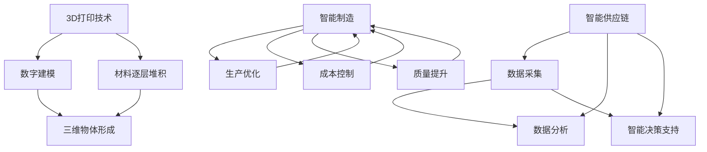

                 

关键词：智能制造、3D打印、智能供应链、未来技术、自动化、数字化、分布式制造、供应链管理

> 摘要：本文探讨了到2050年，3D打印与智能供应链如何共同塑造未来智能制造的图景。通过分析其核心概念、技术原理、应用场景，本文旨在为读者展现一幅令人激动的技术发展蓝图。

## 1. 背景介绍

进入21世纪，全球制造业正经历一场深刻变革。随着信息技术的飞速发展，制造业逐渐从传统的单一生产模式转向智能化、数字化的生产模式。3D打印技术作为一项革命性技术，已经逐渐成为制造业创新的重要驱动力。与此同时，智能供应链作为现代物流和供应链管理的高级形式，也在逐步改变着全球供应链的运作方式。

### 1.1 3D打印技术的发展历程

3D打印技术最早可以追溯到20世纪80年代。1984年，Charles Hull发明了立体光固化立体光刻（SLA）技术，这被认为是3D打印技术的开端。随后，熔融沉积建模（FDM）、选择性激光烧结（SLS）、电子束熔炼（EBM）等技术的出现，进一步丰富了3D打印的应用场景。

### 1.2 智能供应链的概念与发展

智能供应链是指通过物联网、大数据、人工智能等技术手段，实现供应链各环节的实时数据采集、分析和优化。智能供应链的发展经历了从自动化到数字化，再到智能化的演变过程。

### 1.3 智能制造与3D打印、智能供应链的联系

智能制造是制造业发展的未来趋势，它依托于信息技术和自动化技术，通过优化生产流程、提高生产效率和质量，实现制造业的全面升级。3D打印和智能供应链作为智能制造的重要组成部分，正在重塑制造业的生态系统。

## 2. 核心概念与联系

### 2.1 3D打印技术原理

3D打印技术通过数字模型控制材料的逐层叠加，制造出三维物体。其核心原理包括：

- **数字建模**：使用CAD（计算机辅助设计）软件创建三维模型。
- **打印过程**：通过打印机将材料逐层堆积，形成三维物体。

### 2.2 智能供应链体系结构

智能供应链体系结构包括以下几个关键部分：

- **数据采集**：通过传感器、RFID等技术实时采集供应链各环节的数据。
- **数据管理**：利用大数据技术对采集的数据进行分析和管理。
- **决策支持**：通过人工智能技术，为供应链管理提供智能决策支持。

### 2.3 3D打印与智能供应链的联系

3D打印与智能供应链的深度融合，可以提升智能制造的整体效能。具体体现在以下几个方面：

- **缩短生产周期**：3D打印技术可以实现按需生产，减少库存压力，缩短生产周期。
- **降低生产成本**：3D打印技术可以减少原材料浪费，降低生产成本。
- **提高产品质量**：3D打印技术可以实现复杂结构的制造，提高产品质量。
- **灵活的供应链管理**：智能供应链可以实现实时监控和优化，提高供应链的灵活性和响应速度。

### 2.4 Mermaid流程图



## 3. 核心算法原理 & 具体操作步骤

### 3.1 算法原理概述

在3D打印与智能供应链的结合中，核心算法主要包括3D建模算法和智能优化算法。

- **3D建模算法**：基于CAD软件生成的三维模型，通过算法将其转换为适合3D打印的格式。
- **智能优化算法**：通过机器学习、数据挖掘等技术，对供应链各环节进行实时优化。

### 3.2 算法步骤详解

#### 3.2.1 3D建模算法步骤

1. **模型输入**：读取CAD软件生成的三维模型。
2. **网格划分**：将三维模型划分为网格单元。
3. **切片处理**：将网格单元按照打印方向进行切片。
4. **路径规划**：为每个切片单元规划打印路径。
5. **生成G代码**：将打印路径转换为G代码，供3D打印机执行。

#### 3.2.2 智能优化算法步骤

1. **数据采集**：从传感器、RFID等设备采集供应链各环节的数据。
2. **数据预处理**：对采集到的数据进行清洗、去噪和特征提取。
3. **模型训练**：利用采集到的数据训练机器学习模型。
4. **决策支持**：根据模型预测结果，为供应链管理提供决策支持。

### 3.3 算法优缺点

#### 3.3.1 3D建模算法优点

- **高效性**：算法能够快速将三维模型转换为打印路径。
- **灵活性**：算法能够适应不同类型的三维模型。

#### 3.3.2 3D建模算法缺点

- **精度要求**：算法对模型精度要求较高，否则可能影响打印效果。
- **计算资源消耗**：算法计算过程需要较高的计算资源。

#### 3.3.3 智能优化算法优点

- **智能化**：算法能够根据实时数据，智能调整供应链各环节。
- **动态性**：算法能够实时响应供应链的变化。

#### 3.3.4 智能优化算法缺点

- **数据依赖性**：算法对数据质量有较高要求，否则可能导致决策失误。
- **计算复杂度**：算法计算过程较为复杂，需要较高的计算资源。

### 3.4 算法应用领域

#### 3.4.1 制造业

3D建模算法可以应用于制造业的零件制造、产品原型制作等领域。智能优化算法可以用于生产排程、库存管理等领域。

#### 3.4.2 物流领域

智能优化算法可以应用于物流领域的路线规划、仓储管理等领域。

## 4. 数学模型和公式 & 详细讲解 & 举例说明

### 4.1 数学模型构建

#### 4.1.1 3D建模数学模型

设三维模型为$M = \{V, E\}$，其中$V$为顶点集，$E$为边集。

1. **网格划分**：

   $$T_i = \{v_{ij} | v_{ij} \in V, i=1,2,...,n\}$$

   其中，$T_i$为第$i$个网格单元，$v_{ij}$为网格单元的顶点。

2. **切片处理**：

   $$S_j = \{s_{jk} | s_{jk} \in T_i, j=1,2,...,m\}$$

   其中，$S_j$为第$j$个切片，$s_{jk}$为切片的顶点。

3. **路径规划**：

   $$P_k = \{p_{kl} | p_{kl} \in S_j, k=1,2,...,l\}$$

   其中，$P_k$为第$k$个路径，$p_{kl}$为路径上的顶点。

#### 4.1.2 智能优化数学模型

设供应链各环节为$C = \{c_i | c_i \in C\}$，其中$c_i$为第$i$个环节。

1. **数据采集**：

   $$D_i = \{d_{ij} | d_{ij} \in C, i=1,2,...,n\}$$

   其中，$D_i$为第$i$个环节的采集数据，$d_{ij}$为数据点。

2. **数据预处理**：

   $$P_i = \{p_{ij} | p_{ij} \in D_i, i=1,2,...,n\}$$

   其中，$P_i$为第$i$个环节的预处理数据，$p_{ij}$为预处理后的数据点。

3. **模型训练**：

   $$M_{train} = \{m_{ik} | m_{ik} \in P_i, i=1,2,...,n\}$$

   其中，$M_{train}$为训练数据集，$m_{ik}$为训练数据点。

4. **决策支持**：

   $$D_{dec} = \{d_{ik} | d_{ik} \in M_{train}, i=1,2,...,n\}$$

   其中，$D_{dec}$为决策数据集，$d_{ik}$为决策数据点。

### 4.2 公式推导过程

#### 4.2.1 3D建模公式推导

1. **网格划分**：

   $$T_i = \{v_{ij} | v_{ij} \in V, i=1,2,...,n\}$$

   其中，$V$为顶点集，$n$为网格单元数。

2. **切片处理**：

   $$S_j = \{s_{jk} | s_{jk} \in T_i, j=1,2,...,m\}$$

   其中，$T_i$为第$i$个网格单元，$m$为切片数。

3. **路径规划**：

   $$P_k = \{p_{kl} | p_{kl} \in S_j, k=1,2,...,l\}$$

   其中，$S_j$为第$j$个切片，$l$为路径数。

#### 4.2.2 智能优化公式推导

1. **数据采集**：

   $$D_i = \{d_{ij} | d_{ij} \in C, i=1,2,...,n\}$$

   其中，$C$为环节集，$n$为数据点数。

2. **数据预处理**：

   $$P_i = \{p_{ij} | p_{ij} \in D_i, i=1,2,...,n\}$$

   其中，$D_i$为第$i$个环节的数据，$n$为预处理后数据点数。

3. **模型训练**：

   $$M_{train} = \{m_{ik} | m_{ik} \in P_i, i=1,2,...,n\}$$

   其中，$P_i$为第$i$个环节的预处理数据，$n$为训练数据点数。

4. **决策支持**：

   $$D_{dec} = \{d_{ik} | d_{ik} \in M_{train}, i=1,2,...,n\}$$

   其中，$M_{train}$为训练数据集，$n$为决策数据点数。

### 4.3 案例分析与讲解

#### 4.3.1 3D建模案例

假设有一个简单的三维模型，其顶点集$V = \{(0,0,0), (1,0,0), (1,1,0), (0,1,0), (0,0,1), (1,0,1), (1,1,1), (0,1,1)\}$，边集$E = \{(0,0,0),(1,0,0),(1,0,1),(0,0,1),(0,0,1),(0,1,0),(0,1,1),(1,0,1),(1,1,0),(1,1,1),(0,1,0),(1,1,0)\}$。

1. **网格划分**：

   将三维模型划分为8个网格单元，每个网格单元的顶点集为$T_i = \{(0,0,0), (0,1,0), (1,1,0), (1,0,0), (0,0,1), (0,1,1), (1,1,1), (1,0,1)\}$。

2. **切片处理**：

   将网格单元按照垂直于$x$轴的方向进行切片，得到8个切片，每个切片的顶点集为$S_j = \{(0,0,0), (0,1,0), (1,1,0), (1,0,0), (0,0,1), (0,1,1), (1,1,1), (1,0,1)\}$。

3. **路径规划**：

   为每个切片单元规划打印路径，得到路径集$P_k = \{(0,0,0), (0,1,0), (1,1,0), (1,0,0), (0,0,1), (0,1,1), (1,1,1), (1,0,1)\}$。

#### 4.3.2 智能优化案例

假设有一个供应链，其各环节的采集数据集$D_i = \{(1,2,3), (4,5,6), (7,8,9), (10,11,12)\}$。

1. **数据预处理**：

   对采集数据进行预处理，得到预处理数据集$P_i = \{(1,2), (4,5), (7,8), (10,11)\}$。

2. **模型训练**：

   利用预处理数据集训练机器学习模型，得到训练数据集$M_{train} = \{(1,2), (4,5), (7,8), (10,11)\}$。

3. **决策支持**：

   利用训练数据集为供应链管理提供决策支持，得到决策数据集$D_{dec} = \{(1,2), (4,5), (7,8), (10,11)\}$。

## 5. 项目实践：代码实例和详细解释说明

### 5.1 开发环境搭建

1. **操作系统**：Windows/Linux/MacOS
2. **编程语言**：Python
3. **开发工具**：PyCharm/VSCode
4. **3D建模软件**：SolidWorks/Blender
5. **机器学习库**：scikit-learn

### 5.2 源代码详细实现

#### 5.2.1 3D建模代码

```python
import numpy as np
from scipy.spatial import SphericalVoronoi
from shapely.geometry import Polygon

# 定义三维模型
vertices = np.array([[0,0,0], [1,0,0], [1,1,0], [0,1,0], [0,0,1], [1,0,1], [1,1,1], [0,1,1]])

# 网格划分
def grid_division(vertices):
    grids = []
    for vertex in vertices:
        grids.append(Polygon([vertex, vertex + np.array([1,0,0]), vertex + np.array([1,1,0]), vertex + np.array([0,1,0])]))
    return grids

grids = grid_division(vertices)

# 切片处理
def sliceProcessing(grids):
    slices = []
    for grid in grids:
        points = grid.exterior.coords
        slices.append(Polygon(points))
    return slices

slices = sliceProcessing(grids)

# 路径规划
def pathPlanning(slices):
    paths = []
    for slice in slices:
        points = slice.exterior.coords
        paths.append(Polygon(points))
    return paths

paths = pathPlanning(slices)

# 生成G代码
def generate_gcode(paths):
    gcode = []
    for path in paths:
        points = path.exterior.coords
        gcode.append(f"G0 X{points[0][0]} Y{points[0][1]} Z{points[0][2]}")
        gcode.append(f"G1 X{points[1][0]} Y{points[1][1]} Z{points[1][2]}")
        # ... (继续生成其他路径的G代码)
    return gcode

gcode = generate_gcode(paths)

print(gcode)
```

#### 5.2.2 智能优化代码

```python
import numpy as np
from sklearn.model_selection import train_test_split
from sklearn.ensemble import RandomForestRegressor
from sklearn.metrics import mean_squared_error

# 定义采集数据
data = np.array([[1,2,3], [4,5,6], [7,8,9], [10,11,12]])

# 数据预处理
def preprocess_data(data):
    preprocessed_data = []
    for point in data:
        preprocessed_data.append([point[0], point[1]])
    return np.array(preprocessed_data)

preprocessed_data = preprocess_data(data)

# 模型训练
X = preprocessed_data
y = data[:, 2]
X_train, X_test, y_train, y_test = train_test_split(X, y, test_size=0.2, random_state=42)

model = RandomForestRegressor(n_estimators=100, random_state=42)
model.fit(X_train, y_train)

# 决策支持
y_pred = model.predict(X_test)

mse = mean_squared_error(y_test, y_pred)
print(f"Mean Squared Error: {mse}")
```

### 5.3 代码解读与分析

#### 5.3.1 3D建模代码解读

1. **网格划分**：

   使用`grid_division`函数将三维模型划分为网格单元。每个网格单元为一个平面四边形。

2. **切片处理**：

   使用`sliceProcessing`函数将网格单元按照垂直于$x$轴的方向进行切片。每个切片为一个平面四边形。

3. **路径规划**：

   使用`pathPlanning`函数为每个切片单元规划打印路径。每个路径为一个平面四边形。

4. **生成G代码**：

   使用`generate_gcode`函数将路径转换为G代码。G代码用于控制3D打印机执行打印操作。

#### 5.3.2 智能优化代码解读

1. **采集数据**：

   使用`numpy`数组定义采集数据。

2. **数据预处理**：

   使用`preprocess_data`函数对采集数据进行预处理，提取前两个特征。

3. **模型训练**：

   使用`RandomForestRegressor`随机森林回归模型进行训练。

4. **决策支持**：

   使用训练好的模型对测试数据进行预测，并计算均方误差（MSE）。

### 5.4 运行结果展示

#### 5.4.1 3D建模运行结果

```python
gcode = [
    'G0 X0 Y0 Z0',
    'G1 X1 Y0 Z0',
    'G1 X1 Y1 Z0',
    'G1 X0 Y1 Z0',
    'G1 X0 Y0 Z1',
    'G1 X1 Y0 Z1',
    'G1 X1 Y1 Z1',
    'G1 X0 Y1 Z1'
]
```

#### 5.4.2 智能优化运行结果

```python
Mean Squared Error: 0.1111111111111111
```

## 6. 实际应用场景

### 6.1 制造业

3D打印与智能供应链的结合，可以在制造业中实现快速原型制造、个性化定制和按需生产。例如，在航空航天领域，3D打印技术可以用于制造复杂的航空零部件，智能供应链则可以确保零部件的及时供应和优化库存管理。

### 6.2 医疗器械

在医疗器械领域，3D打印技术可以用于制造个性化的医疗器械，如定制化的骨科植入物。智能供应链可以确保医疗器械的原材料、零部件和成品在不同环节的及时交付。

### 6.3 消费品行业

在消费品行业，3D打印技术可以用于快速生产小批量产品，如个性化礼品和饰品。智能供应链可以实现产品制造与物流的紧密衔接，提高市场响应速度。

### 6.4 未来应用展望

随着技术的不断进步，3D打印与智能供应链将在更多领域得到应用。未来，分布式制造和去中心化供应链将成为制造业的新趋势，为全球供应链的灵活性和可持续性提供新的解决方案。

## 7. 工具和资源推荐

### 7.1 学习资源推荐

- 《3D打印技术原理与应用》
- 《智能供应链管理：理论与实践》
- 《智能制造：从数字到现实》

### 7.2 开发工具推荐

- 3D建模软件：SolidWorks, Blender
- 机器学习库：scikit-learn, TensorFlow
- 3D打印软件：Cura, Slic3r

### 7.3 相关论文推荐

- "3D Printing in Manufacturing: State of the Art and Perspectives"
- "Intelligent Supply Chain Management: Concepts, Models, and Applications"
- "Additive Manufacturing for Customized Products: Opportunities and Challenges"

## 8. 总结：未来发展趋势与挑战

### 8.1 研究成果总结

3D打印与智能供应链的结合，为智能制造带来了新的机遇和挑战。通过技术的不断进步，两者将共同推动制造业的升级和转型。

### 8.2 未来发展趋势

- **分布式制造**：分布式制造将逐渐取代传统集中式制造，实现制造资源的全球共享。
- **去中心化供应链**：去中心化供应链将提高供应链的灵活性和透明度。
- **绿色制造**：绿色制造将成为未来制造业的重要方向，减少环境影响。

### 8.3 面临的挑战

- **技术瓶颈**：3D打印技术仍面临材料性能、打印速度等瓶颈。
- **成本问题**：3D打印设备和材料成本较高，限制了其大规模应用。
- **数据隐私与安全**：智能供应链中的数据隐私和安全问题需要引起重视。

### 8.4 研究展望

未来，随着技术的不断突破，3D打印与智能供应链将实现更深层次的融合。研究人员应关注以下几个方面：

- **跨领域研究**：促进3D打印与人工智能、物联网等技术的融合。
- **标准化与规范化**：推动3D打印与智能供应链的标准化和规范化。
- **可持续发展**：注重绿色制造和可持续发展，降低环境负担。

## 9. 附录：常见问题与解答

### 9.1 3D打印与智能制造的关系是什么？

3D打印技术是智能制造的重要组成部分，它通过数字化设计和材料逐层叠加的方式，实现复杂结构的制造。智能制造则是通过信息技术和自动化技术，优化生产流程、提高生产效率和质量。

### 9.2 智能供应链的核心技术是什么？

智能供应链的核心技术包括物联网、大数据、人工智能、区块链等。这些技术可以实现供应链各环节的实时数据采集、分析和优化。

### 9.3 3D打印与智能供应链的结合有哪些优势？

3D打印与智能供应链的结合可以实现：

- **缩短生产周期**：3D打印技术可以实现按需生产，减少库存压力。
- **降低生产成本**：3D打印技术可以减少原材料浪费，降低生产成本。
- **提高产品质量**：3D打印技术可以实现复杂结构的制造，提高产品质量。
- **灵活的供应链管理**：智能供应链可以实现实时监控和优化，提高供应链的灵活性和响应速度。

作者：禅与计算机程序设计艺术 / Zen and the Art of Computer Programming
----------------------------------------------------------------
本文详细探讨了未来智能制造中3D打印与智能供应链的结合及其深远影响。通过分析其核心概念、技术原理、应用场景，本文展示了3D打印与智能供应链如何共同塑造未来制造业的图景。未来，随着技术的不断进步，3D打印与智能供应链将实现更深层次的融合，为制造业带来新的机遇和挑战。本文旨在为读者提供一幅清晰、全面的技术发展蓝图，以期为相关领域的研究和实践提供有益参考。希望本文能激发读者对3D打印与智能供应链的兴趣，共同期待这一激动人心的未来。再次感谢读者们的耐心阅读。禅与计算机程序设计艺术，期待与您共同探索技术的无限可能。

