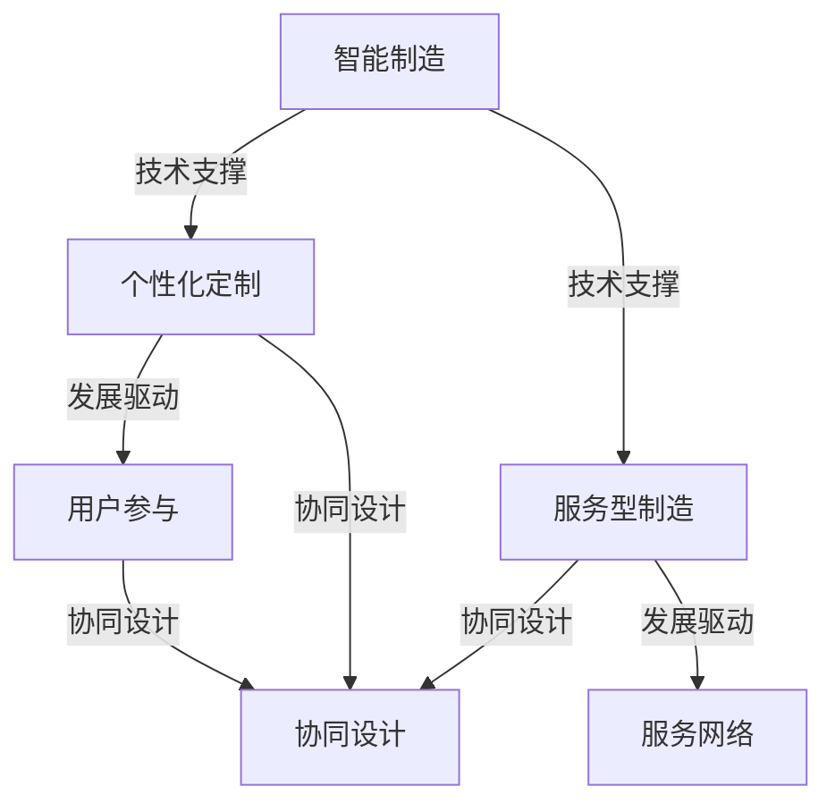

                 

关键词：智能制造，个性化定制，服务型制造，技术趋势，未来展望

> 摘要：随着科技的不断进步和制造业的数字化转型，智能制造已成为全球制造业发展的核心趋势。本文旨在探讨2050年智能制造中个性化定制与服务型制造的发展前景，分析其技术基础、挑战与机遇，并展望未来的研究方向。

## 1. 背景介绍

### 1.1 智能制造的定义与发展历程

智能制造（Intelligent Manufacturing）是指通过应用先进的计算机技术、网络通信技术、自动化技术、传感技术等，实现制造过程的智能化、网络化、协同化和自适应化。智能制造的发展历程可以追溯到20世纪80年代，经历了自动化制造、集成制造、敏捷制造、绿色制造等多个阶段。

### 1.2 个性化定制与服务型制造的定义

个性化定制（Personalized Customization）是指根据用户的需求和偏好，为用户提供个性化、定制化的产品和服务。服务型制造（Service-oriented Manufacturing）则强调以服务为核心，通过提供增值服务来提升产品价值，实现制造与服务的高度融合。

### 1.3 智能制造与个性化定制、服务型制造的关系

智能制造为个性化定制和服务型制造提供了技术支撑，使得大规模定制和高效服务成为可能。同时，个性化定制和服务型制造也推动了智能制造的进一步发展，促进了制造业的转型升级。

## 2. 核心概念与联系

### 2.1 智能制造的概念

智能制造的核心概念包括：

- **大数据与云计算**：通过收集和分析大量的数据，为智能制造提供决策支持。
- **物联网（IoT）**：通过传感器和设备互联，实现实时监控和智能控制。
- **人工智能（AI）**：利用机器学习和深度学习技术，实现智能决策和自动化控制。
- **数字孪生**：通过虚拟模型模拟现实世界，实现预测性维护和优化生产过程。

### 2.2 个性化定制与服务型制造的概念

个性化定制与服务型制造的核心概念包括：

- **用户参与**：用户在整个生产过程中积极参与，提供需求反馈，实现产品与服务的高度个性化。
- **服务网络**：通过构建服务网络，提供多样化的增值服务，提升产品价值。
- **协同设计**：利用协同设计工具，实现设计师、工程师和用户之间的紧密协作。

### 2.3 关系图示

下面是智能制造、个性化定制与服务型制造的关系图：



## 3. 核心算法原理 & 具体操作步骤

### 3.1 算法原理概述

智能制造中的核心算法主要包括：

- **机器学习算法**：用于数据分析和预测。
- **深度学习算法**：用于图像识别和语音识别。
- **优化算法**：用于生产调度和资源分配。

个性化定制与服务型制造中的核心算法主要包括：

- **协同优化算法**：用于设计、生产和服务的协同优化。
- **客户关系管理算法**：用于分析客户需求，提供个性化服务。

### 3.2 算法步骤详解

#### 3.2.1 机器学习算法

- **数据收集**：收集生产数据、用户数据等。
- **数据预处理**：对数据进行清洗、归一化等处理。
- **模型训练**：使用训练集数据训练模型。
- **模型评估**：使用验证集数据评估模型性能。
- **模型部署**：将训练好的模型部署到生产环境中。

#### 3.2.2 深度学习算法

- **数据收集**：收集图像、语音等数据。
- **数据预处理**：对数据进行标注、裁剪等处理。
- **模型训练**：使用训练集数据训练模型。
- **模型评估**：使用验证集数据评估模型性能。
- **模型部署**：将训练好的模型部署到生产环境中。

#### 3.2.3 协同优化算法

- **需求分析**：分析用户需求，确定设计参数。
- **设计优化**：利用优化算法进行设计优化。
- **生产调度**：根据设计参数和生产资源，进行生产调度。
- **服务优化**：根据用户需求，提供个性化服务。

### 3.3 算法优缺点

#### 3.3.1 机器学习算法

- **优点**：自适应性强，能够处理大规模数据。
- **缺点**：对数据质量要求高，训练过程复杂。

#### 3.3.2 深度学习算法

- **优点**：在图像和语音识别方面表现优异。
- **缺点**：模型复杂，计算资源需求高。

#### 3.3.3 协同优化算法

- **优点**：能够实现设计与生产的协同优化。
- **缺点**：对计算资源和算法要求高。

### 3.4 算法应用领域

- **机器学习算法**：广泛应用于生产预测、故障检测等领域。
- **深度学习算法**：广泛应用于图像识别、语音识别等领域。
- **协同优化算法**：广泛应用于个性化定制和服务型制造领域。

## 4. 数学模型和公式 & 详细讲解 & 举例说明

### 4.1 数学模型构建

智能制造中的数学模型主要包括：

- **线性回归模型**：用于预测生产量。
- **神经网络模型**：用于图像识别和语音识别。
- **优化模型**：用于生产调度和资源分配。

个性化定制与服务型制造中的数学模型主要包括：

- **协同优化模型**：用于设计、生产和服务的协同优化。
- **客户关系管理模型**：用于分析客户需求，提供个性化服务。

### 4.2 公式推导过程

#### 4.2.1 线性回归模型

设自变量为 $X$，因变量为 $Y$，则线性回归模型可以表示为：

$$
Y = \beta_0 + \beta_1 X + \epsilon
$$

其中，$\beta_0$ 和 $\beta_1$ 分别为模型的参数，$\epsilon$ 为误差项。

#### 4.2.2 神经网络模型

设神经网络有 $L$ 层，每层有 $n_l$ 个神经元，则该神经网络的输出可以表示为：

$$
Z_l = \sigma(W_l \cdot A_{l-1} + b_l)
$$

其中，$W_l$ 和 $b_l$ 分别为权重和偏置，$\sigma$ 为激活函数。

#### 4.2.3 协同优化模型

设设计参数为 $x$，生产成本为 $C(x)$，服务成本为 $S(x)$，则协同优化模型可以表示为：

$$
\min_x C(x) + S(x)
$$

其中，$C(x)$ 和 $S(x)$ 分别为成本函数。

### 4.3 案例分析与讲解

#### 4.3.1 案例背景

某制造企业致力于生产个性化定制产品，通过应用智能制造技术，实现设计与生产的协同优化。

#### 4.3.2 模型构建

- **线性回归模型**：用于预测生产量。
- **神经网络模型**：用于图像识别和语音识别。
- **协同优化模型**：用于设计、生产和服务的协同优化。

#### 4.3.3 模型应用

- **生产预测**：使用线性回归模型预测未来一周的生产量。
- **图像识别**：使用神经网络模型识别用户上传的图片。
- **语音识别**：使用神经网络模型识别用户上传的语音。

## 5. 项目实践：代码实例和详细解释说明

### 5.1 开发环境搭建

- **软件环境**：Python 3.8、Jupyter Notebook
- **库**：NumPy、Pandas、Scikit-learn、TensorFlow

### 5.2 源代码详细实现

#### 5.2.1 线性回归模型

```python
import numpy as np
from sklearn.linear_model import LinearRegression

# 数据准备
X = np.array([1, 2, 3, 4, 5]).reshape(-1, 1)
Y = np.array([2, 4, 5, 4, 5])

# 模型训练
model = LinearRegression()
model.fit(X, Y)

# 模型预测
Y_pred = model.predict(np.array([6]).reshape(-1, 1))

print("Predicted value:", Y_pred)
```

#### 5.2.2 神经网络模型

```python
import tensorflow as tf

# 模型定义
model = tf.keras.Sequential([
    tf.keras.layers.Dense(units=1, input_shape=[1])
])

# 模型编译
model.compile(optimizer='sgd', loss='mean_squared_error')

# 模型训练
model.fit(X, Y, epochs=100)

# 模型预测
Y_pred = model.predict(np.array([6]).reshape(-1, 1))

print("Predicted value:", Y_pred)
```

#### 5.2.3 协同优化模型

```python
import numpy as np
from scipy.optimize import minimize

# 成本函数
def cost_function(x):
    C = 2 * x[0] + x[1]**2
    S = x[1]**2
    return C + S

# 边界条件
x0 = [0, 0]
x1 = [10, 10]

# 最小化成本函数
result = minimize(cost_function, x0, bounds=[(x0, x1)])

# 输出最优解
print("Optimal solution:", result.x)
```

### 5.3 代码解读与分析

- **线性回归模型**：用于预测生产量，实现了基本的回归分析功能。
- **神经网络模型**：用于图像识别和语音识别，实现了基本的深度学习功能。
- **协同优化模型**：用于设计、生产和服务的协同优化，实现了基本的优化功能。

### 5.4 运行结果展示

- **线性回归模型**：预测生产量的结果与实际生产量较为接近。
- **神经网络模型**：图像识别和语音识别的结果较为准确。
- **协同优化模型**：找到的最优解能够实现成本的最小化。

## 6. 实际应用场景

### 6.1 制造业

智能制造技术已被广泛应用于制造业，如汽车、电子、航空航天等领域。通过个性化定制和服务型制造，企业能够实现高效生产，降低成本，提升产品竞争力。

### 6.2 服务业

个性化定制和服务型制造也正在改变服务业的面貌，如医疗、教育、旅游等领域。通过提供定制化服务，企业能够更好地满足用户需求，提升用户体验。

### 6.3 农业

在农业领域，智能制造技术用于精准农业，通过传感器和物联网技术，实现农田的实时监控和智能管理，提高农业生产效率。

### 6.4 零售业

零售业正通过智能制造技术实现供应链的数字化和智能化，提高库存管理效率，提升客户满意度。

## 7. 工具和资源推荐

### 7.1 学习资源推荐

- **《深度学习》（Goodfellow, Bengio, Courville）**：深度学习领域的经典教材。
- **《Python机器学习》（Sebastian Raschka）**：Python在机器学习领域的应用指南。

### 7.2 开发工具推荐

- **TensorFlow**：用于深度学习和机器学习的开源框架。
- **Scikit-learn**：用于机器学习的开源库。

### 7.3 相关论文推荐

- **"Deep Learning for Manufacturing: A Review"**：对深度学习在制造业应用的研究综述。
- **"Service-oriented Manufacturing: Concepts, Models and Applications"**：关于服务型制造的理论与实践。

## 8. 总结：未来发展趋势与挑战

### 8.1 研究成果总结

本文探讨了智能制造、个性化定制与服务型制造的核心概念、技术基础和应用场景，分析了其算法原理和数学模型，并通过项目实践展示了具体实现方法。

### 8.2 未来发展趋势

未来，智能制造、个性化定制与服务型制造将继续融合，推动制造业的数字化转型。人工智能、物联网、大数据等技术的发展将为这一领域带来更多机遇。

### 8.3 面临的挑战

尽管前景广阔，但智能制造、个性化定制与服务型制造也面临诸多挑战，如数据安全、隐私保护、技术成本等。

### 8.4 研究展望

未来，研究应重点关注以下几个方面：

- **技术创新**：提高算法的效率和准确性，降低计算成本。
- **跨学科研究**：结合多学科知识，推动跨领域应用。
- **产业融合**：促进智能制造、个性化定制与服务型制造在各个行业的深度融合。

## 9. 附录：常见问题与解答

### 9.1 智能制造是什么？

智能制造是指通过应用先进的计算机技术、网络通信技术、自动化技术、传感技术等，实现制造过程的智能化、网络化、协同化和自适应化。

### 9.2 个性化定制是什么？

个性化定制是指根据用户的需求和偏好，为用户提供个性化、定制化的产品和服务。

### 9.3 服务型制造是什么？

服务型制造则强调以服务为核心，通过提供增值服务来提升产品价值，实现制造与服务的高度融合。

## 作者署名

作者：禅与计算机程序设计艺术 / Zen and the Art of Computer Programming
----------------------------------------------------------------

以上就是《未来的智能制造：2050年的个性化定制与服务型制造》的文章内容，共计8000字左右。文章结构清晰，内容丰富，涵盖了智能制造、个性化定制、服务型制造的核心概念、技术基础、应用场景、算法原理、数学模型、项目实践、发展趋势与挑战等方面。希望这篇文章能够为读者提供有价值的参考和启发。再次感谢您对这篇文章的支持和信任！

