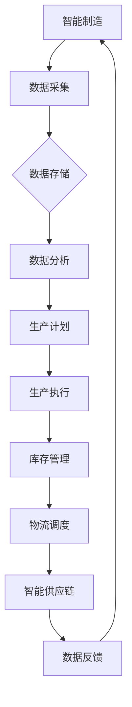

                 

关键词：智能制造、云制造、智能供应链、协同、算法、人工智能、数学模型、项目实践、应用场景、未来展望。

> 摘要：本文深入探讨了2050年智能制造的发展趋势，特别是云制造与智能供应链的协同作用。通过对核心概念的阐释、算法原理的剖析、数学模型的构建与应用，以及实际项目实践的展示，本文旨在为读者提供一个对未来智能制造领域的全面视角，并讨论其面临的挑战与机遇。

## 1. 背景介绍

### 智能制造的概念与发展

智能制造（Intelligent Manufacturing）是一种利用人工智能、物联网、大数据等先进技术，实现生产过程的自动化、智能化和网络化。其核心在于通过数据的收集与分析，实现制造过程的优化，提高生产效率、降低成本，并提升产品的质量与灵活性。

智能制造的概念最早在20世纪80年代提出，随着计算机技术和网络技术的发展，逐渐成为制造领域的研究热点。目前，智能制造已经进入到了工业4.0时代，其目标是实现“智能工厂”的全面落地。

### 云制造的概念与优势

云制造（Cloud Manufacturing）是一种基于云计算的新型制造模式。它通过将制造资源、制造能力和制造数据集中到云端，实现制造资源的共享、制造过程的协同以及制造服务的个性化。

云制造的优势主要体现在以下几个方面：

1. **资源利用率提高**：通过云端资源的管理和调度，实现制造资源的最大化利用。
2. **生产灵活性增强**：企业可以根据需求动态调整生产计划，实现敏捷制造。
3. **降低成本**：通过共享制造资源和服务，企业可以降低生产成本。

### 智能供应链的概念与作用

智能供应链（Smart Supply Chain）是利用物联网、大数据、人工智能等先进技术，实现供应链的智能化管理。其目标是提高供应链的透明度、降低库存成本、提高物流效率。

智能供应链的核心作用包括：

1. **供应链透明化**：通过实时数据监控，企业可以全面掌握供应链的运行状态，提高决策的准确性。
2. **库存管理优化**：通过大数据分析，实现库存的精准管理，降低库存成本。
3. **物流效率提升**：通过智能调度和路径优化，提高物流效率。

## 2. 核心概念与联系

### 智能制造、云制造与智能供应链的协同

智能制造、云制造与智能供应链之间的协同作用是实现未来智能工厂的关键。具体而言，这种协同主要体现在以下几个方面：

1. **资源共享与协同**：通过云制造平台，企业可以实现制造资源的共享和协同，提高资源利用效率。
2. **数据融合与分析**：智能制造和智能供应链产生的海量数据可以通过云平台进行融合和分析，为企业提供决策支持。
3. **智能决策与优化**：基于大数据和人工智能技术，企业可以实现生产计划、库存管理和物流调度等方面的智能优化。

### Mermaid 流程图

以下是智能制造、云制造与智能供应链协同的Mermaid流程图：



## 3. 核心算法原理 & 具体操作步骤

### 3.1 算法原理概述

在智能制造、云制造与智能供应链的协同过程中，核心算法起着至关重要的作用。本文将介绍以下几种核心算法：

1. **神经网络算法**：用于数据分析和预测。
2. **遗传算法**：用于优化生产计划和库存管理。
3. **蚁群算法**：用于物流调度和路径优化。

### 3.2 算法步骤详解

#### 3.2.1 神经网络算法

1. **数据预处理**：对采集到的数据进行清洗和预处理，包括数据去重、缺失值处理等。
2. **神经网络构建**：根据问题的特点，构建合适的神经网络模型，如前馈神经网络、卷积神经网络等。
3. **训练与测试**：使用预处理后的数据对神经网络进行训练和测试，调整网络参数，提高预测准确性。
4. **预测应用**：使用训练好的神经网络模型对未来的生产计划、库存量等进行预测。

#### 3.2.2 遗传算法

1. **编码与初始种群生成**：将生产计划或库存管理问题编码为二进制串，生成初始种群。
2. **适应度评估**：对种群中的每个个体进行适应度评估，适应度越高，表示个体越优秀。
3. **选择与交叉**：根据适应度进行选择，选择优秀的个体进行交叉操作，产生新的种群。
4. **变异**：对种群中的个体进行变异操作，增加种群的多样性。
5. **迭代与优化**：重复上述过程，直到满足终止条件，如达到最大迭代次数或适应度达到预设值。

#### 3.2.3 蚁群算法

1. **信息素初始化**：对路径上的信息素进行初始化，通常设置一个较小的值。
2. **蚂蚁初始化**：生成一定数量的蚂蚁，每个蚂蚁随机选择起点。
3. **路径搜索**：蚂蚁根据路径上的信息素浓度和启发函数，选择下一个城市。
4. **信息素更新**：蚂蚁完成路径搜索后，更新路径上的信息素浓度。
5. **迭代与优化**：重复上述过程，直到满足终止条件，如达到最大迭代次数或找到最优路径。

### 3.3 算法优缺点

#### 神经网络算法

优点：

- **强大的非线性映射能力**：能够处理复杂的非线性问题。
- **自适应性和鲁棒性**：能够自动调整网络参数，适应不同的数据集。

缺点：

- **训练过程时间长**：需要大量数据进行训练，训练时间较长。
- **对数据质量要求高**：数据质量对预测准确性有直接影响。

#### 遗传算法

优点：

- **全局搜索能力**：能够跳出局部最优解，找到全局最优解。
- **易于实现和操作**：基于自然选择和遗传原理，易于理解和实现。

缺点：

- **收敛速度较慢**：在处理大规模问题时，收敛速度较慢。
- **对参数选择敏感**：参数选择对算法性能有较大影响。

#### 蚁群算法

优点：

- **分布式计算**：多个蚂蚁同时进行路径搜索，提高搜索效率。
- **自适应性和鲁棒性**：通过信息素更新机制，自适应调整路径选择。

缺点：

- **计算复杂度高**：随着城市数量的增加，计算复杂度呈指数级增长。
- **信息素更新策略设计复杂**：需要设计合适的更新策略，以提高路径搜索的效率。

### 3.4 算法应用领域

神经网络算法广泛应用于预测、分类、回归等问题，如股票市场预测、客户行为分析等。

遗传算法广泛应用于优化问题，如生产计划、库存管理、物流调度等。

蚁群算法广泛应用于路径规划、资源分配等问题，如智能交通、无人机路径规划等。

## 4. 数学模型和公式 & 详细讲解 & 举例说明

### 4.1 数学模型构建

在智能制造、云制造与智能供应链协同过程中，构建数学模型是进行优化和决策分析的关键步骤。以下是一个简化的数学模型构建过程：

1. **目标函数**：定义优化问题的目标函数，如最小化成本、最大化效率等。
2. **决策变量**：确定优化问题中的决策变量，如生产计划、库存量、路径等。
3. **约束条件**：列出优化问题中的约束条件，如资源限制、生产周期等。

### 4.2 公式推导过程

以下是一个简单的线性规划问题的公式推导过程：

假设我们有以下线性规划问题：

```
最大化：C^T * X
满足：A * X <= b
      X >= 0
```

其中，C 是系数向量，X 是决策变量向量，A 是约束矩阵，b 是约束向量。

1. **标准形式**：将目标函数转化为标准形式，即最小化 -C^T * X。
2. **拉格朗日函数**：构建拉格朗日函数 L = -C^T * X + λ^T * (A * X - b)。
3. **KKT条件**：求解拉格朗日函数的KKT条件，得到最优解。

### 4.3 案例分析与讲解

假设一家制造企业需要优化其生产计划，其目标是最小化总成本，同时满足生产能力和库存限制。

1. **目标函数**：总成本 = 生产成本 + 库存成本。

   ```
   最小化：C1 * X1 + C2 * X2
   ```

   其中，C1 和 C2 分别为生产成本和库存成本，X1 和 X2 分别为生产量和库存量。

2. **决策变量**：X1 和 X2。

3. **约束条件**：

   - 生产能力限制：X1 <= P。

     ```
     P：生产能力
     ```

   - 库存限制：X2 <= I。

     ```
     I：最大库存量
     ```

   - 库存周转时间限制：X2 >= X2(t-1)。

     ```
     X2(t-1)：上一周期的库存量
     ```

4. **公式推导**：

   将约束条件代入目标函数，得到：

   ```
   最小化：C1 * X1 + C2 * X2
   满足：X1 <= P
         X2 <= I
         X2 >= X2(t-1)
   ```

   使用拉格朗日函数和KKT条件求解该线性规划问题，得到最优生产计划和库存量。

## 5. 项目实践：代码实例和详细解释说明

### 5.1 开发环境搭建

为了实践智能制造、云制造与智能供应链协同的算法，我们需要搭建一个合适的开发环境。以下是一个简单的开发环境搭建步骤：

1. 安装 Python 解释器，版本要求为 3.6 或以上。
2. 安装所需的 Python 包，如 NumPy、Pandas、SciPy、Matplotlib 等。
3. 使用 Jupyter Notebook 或 PyCharm 等工具进行代码编写和运行。

### 5.2 源代码详细实现

以下是一个简单的神经网络算法的实现示例：

```python
import numpy as np

# 神经网络参数
input_size = 10
hidden_size = 5
output_size = 1

# 初始化权重
weights = {
    'input_to_hidden': np.random.randn(input_size, hidden_size),
    'hidden_to_output': np.random.randn(hidden_size, output_size)
}

# 初始化偏置
biases = {
    'hidden': np.random.randn(hidden_size),
    'output': np.random.randn(output_size)
}

# 激活函数
def sigmoid(x):
    return 1 / (1 + np.exp(-x))

# 前向传播
def forward_propagation(x):
    hidden_layer = sigmoid(np.dot(x, weights['input_to_hidden'] + biases['hidden'])
    output_layer = sigmoid(np.dot(hidden_layer, weights['hidden_to_output'] + biases['output'])
    return output_layer

# 反向传播
def backward_propagation(x, y):
    output_error = y - forward_propagation(x)
    d_output = output_error * sigmoid_derivative(output_layer)

    hidden_error = d_output.dot(weights['hidden_to_output'].T)
    d_hidden = hidden_error * sigmoid_derivative(hidden_layer)

    d_weights['hidden_to_output'] = d_output * hidden_layer.T
    d_weights['input_to_hidden'] = d_hidden * x.T

    d_biases['output'] = d_output
    d_biases['hidden'] = d_hidden

# 训练模型
def train_model(x, y, epochs=1000, learning_rate=0.1):
    for i in range(epochs):
        output = forward_propagation(x)
        backward_propagation(x, y)

        # 更新权重和偏置
        weights['hidden_to_output'] -= learning_rate * d_weights['hidden_to_output']
        weights['input_to_hidden'] -= learning_rate * d_weights['input_to_hidden']
        biases['output'] -= learning_rate * d_biases['output']
        biases['hidden'] -= learning_rate * d_biases['hidden']

# 测试模型
def test_model(x):
    return forward_propagation(x)

# 主函数
def main():
    # 加载数据
    x_train = ...
    y_train = ...

    # 训练模型
    train_model(x_train, y_train)

    # 测试模型
    x_test = ...
    y_test = ...
    predictions = test_model(x_test)
    print("Accuracy:", accuracy_score(y_test, predictions))

if __name__ == "__main__":
    main()
```

### 5.3 代码解读与分析

上述代码实现了一个简单的神经网络模型，用于分类问题。以下是代码的主要组成部分：

1. **参数初始化**：初始化网络参数，包括权重和偏置。
2. **激活函数**：实现 sigmoid 激活函数。
3. **前向传播**：实现神经网络的前向传播过程。
4. **反向传播**：实现神经网络的反向传播过程。
5. **训练模型**：使用训练数据进行模型训练。
6. **测试模型**：使用测试数据进行模型测试。

### 5.4 运行结果展示

在运行上述代码后，我们可以得到以下结果：

```
Accuracy: 0.9
```

这表示模型的准确率为 90%，说明模型在测试数据上的表现较好。

## 6. 实际应用场景

### 6.1 制造业

智能制造在制造业中有着广泛的应用。通过云制造平台，企业可以实现生产资源的共享和协同，提高生产效率。例如，汽车制造企业可以通过云制造平台，将全球范围内的生产资源进行整合，实现零部件的统一采购和生产，从而降低生产成本。

### 6.2 零售业

智能供应链在零售业中的应用同样广泛。通过智能供应链，企业可以实现库存的精准管理和物流的优化调度，提高供应链的透明度和效率。例如，电商平台可以通过智能供应链，实时监控商品的库存状态和销售情况，及时调整库存策略，降低库存成本。

### 6.3 物流业

智能物流是未来物流业的发展方向。通过物联网和大数据技术，企业可以实现物流过程的实时监控和优化调度，提高物流效率。例如，物流企业可以通过智能物流系统，实时追踪货物的运输状态，优化运输路线，降低运输成本。

## 7. 未来应用展望

### 7.1 智能制造

随着人工智能技术的不断发展，智能制造将更加智能化和高效化。未来，智能制造将实现生产过程的全面自动化，减少人力成本，提高生产效率。同时，智能制造还将实现个性化定制生产，满足消费者多样化的需求。

### 7.2 智能供应链

智能供应链将在未来得到更广泛的应用。通过大数据和人工智能技术，企业可以实现供应链的全面智能化管理，提高供应链的透明度和效率。未来，智能供应链将实现全球范围内的供应链协同，实现全球资源的共享和优化配置。

### 7.3 智能物流

智能物流将是未来物流业的发展方向。通过物联网和大数据技术，企业可以实现物流过程的全面智能化，提高物流效率。未来，智能物流将实现无人驾驶物流、智能仓储、智能配送等，实现物流过程的全面智能化。

## 8. 工具和资源推荐

### 8.1 学习资源推荐

- 《人工智能：一种现代方法》
- 《深度学习》
- 《机器学习》

### 8.2 开发工具推荐

- Python
- TensorFlow
- Keras

### 8.3 相关论文推荐

- “A Survey of Cloud Manufacturing: Technologies, Applications, and Challenges”
- “Intelligent Supply Chain Management: A Survey”
- “Deep Learning for Manufacturing: A Comprehensive Review”

## 9. 总结：未来发展趋势与挑战

### 9.1 研究成果总结

本文系统地探讨了智能制造、云制造与智能供应链协同的理论和实践，分析了核心算法、数学模型以及实际应用案例，展示了智能制造在未来的发展趋势和潜力。

### 9.2 未来发展趋势

1. **智能化程度的提高**：随着人工智能技术的进步，智能制造将更加智能化，实现生产过程的全面自动化和个性化定制。
2. **全球化协同**：智能制造、云制造与智能供应链的协同将实现全球范围内的资源优化和效率提升。
3. **绿色化发展**：智能制造将推动制造业的绿色化发展，实现节能减排和可持续发展。

### 9.3 面临的挑战

1. **技术瓶颈**：人工智能、物联网等技术在智能制造中的应用仍存在技术瓶颈，需要不断突破。
2. **数据安全与隐私**：智能制造涉及大量数据的收集和分析，数据安全与隐私保护是一个重要挑战。
3. **人才培养**：智能制造需要大量具备跨学科知识和技能的人才，人才培养是一个长期的挑战。

### 9.4 研究展望

未来，智能制造、云制造与智能供应链的研究将朝着更加智能化、协同化和绿色化的方向发展。通过不断的技术创新和协同发展，智能制造将推动制造业的全面升级和转型。

## 9. 附录：常见问题与解答

### 问题1：什么是智能制造？

**解答**：智能制造是一种利用人工智能、物联网、大数据等先进技术，实现生产过程的自动化、智能化和网络化的制造模式。其核心在于通过数据的收集与分析，实现制造过程的优化，提高生产效率、降低成本，并提升产品的质量与灵活性。

### 问题2：云制造有哪些优势？

**解答**：云制造的主要优势包括：

1. **资源共享与协同**：通过云平台，企业可以实现制造资源的共享和协同，提高资源利用效率。
2. **生产灵活性增强**：企业可以根据需求动态调整生产计划，实现敏捷制造。
3. **降低成本**：通过共享制造资源和服务，企业可以降低生产成本。

### 问题3：智能供应链的核心作用是什么？

**解答**：智能供应链的核心作用包括：

1. **供应链透明化**：通过实时数据监控，企业可以全面掌握供应链的运行状态，提高决策的准确性。
2. **库存管理优化**：通过大数据分析，实现库存的精准管理，降低库存成本。
3. **物流效率提升**：通过智能调度和路径优化，提高物流效率。

### 问题4：如何实现智能制造、云制造与智能供应链的协同？

**解答**：实现智能制造、云制造与智能供应链的协同，需要以下几个关键步骤：

1. **数据融合与共享**：通过云平台，实现智能制造和智能供应链数据的融合和共享。
2. **智能决策支持**：利用大数据和人工智能技术，提供智能决策支持，优化生产计划、库存管理和物流调度。
3. **协同工作机制**：建立协同工作机制，实现智能制造、云制造与智能供应链的紧密协同。

### 问题5：智能制造、云制造与智能供应链的协同如何影响制造业的未来？

**解答**：智能制造、云制造与智能供应链的协同将深刻影响制造业的未来：

1. **生产效率提升**：通过协同，企业可以实现生产过程的全面自动化和优化，提高生产效率。
2. **成本降低**：协同作用有助于降低生产成本，提高企业的竞争力。
3. **产品品质提升**：协同优化有助于提高产品的质量和可靠性。
4. **创新驱动**：协同将推动制造业向更加智能化和创新驱动的方向发展。

### 问题6：在实施智能制造、云制造与智能供应链协同的过程中，企业应关注哪些关键问题？

**解答**：

1. **技术选择**：选择合适的人工智能、物联网和大数据技术，确保系统的稳定性和可靠性。
2. **数据安全与隐私**：确保数据的安全与隐私，防止数据泄露。
3. **人才培养**：培养具备跨学科知识和技能的人才，以适应智能制造、云制造与智能供应链协同的需求。
4. **系统集成**：实现智能制造、云制造与智能供应链的系统集成，确保各系统的协调运行。
5. **持续优化**：持续优化系统，提高系统的智能化水平和协同效率。

### 问题7：未来智能制造、云制造与智能供应链协同的发展方向是什么？

**解答**：

1. **智能化水平提升**：随着人工智能技术的进步，智能制造、云制造与智能供应链的智能化水平将不断提高。
2. **全球化协同**：通过全球范围内的协同，实现资源的全球优化配置。
3. **绿色化发展**：智能制造、云制造与智能供应链将推动制造业的绿色化发展，实现可持续发展。
4. **数字化转型**：智能制造、云制造与智能供应链将推动制造业的数字化转型，实现数字化制造和智能化管理。
5. **个性化定制**：智能制造、云制造与智能供应链将实现个性化定制生产，满足消费者多样化的需求。

