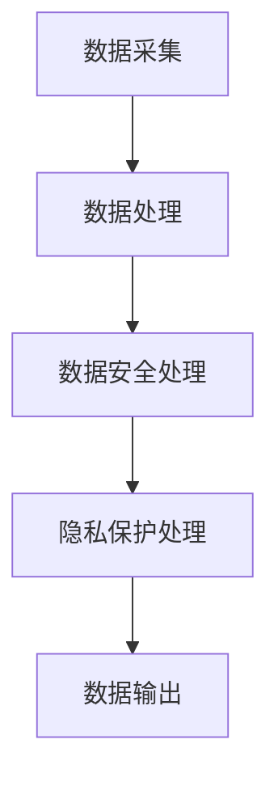

                 

关键词：智能安防、公共安全、隐私保护、人工智能、技术发展

摘要：随着人工智能技术的快速发展，智能安防系统在公共安全与隐私保护方面发挥着越来越重要的作用。本文将探讨2050年的智能安防发展趋势，分析其核心技术、数学模型、应用场景以及未来面临的挑战，为我国智能安防技术的发展提供参考。

## 1. 背景介绍

智能安防系统是指利用人工智能技术对监控视频、传感器数据等进行分析和处理，实现实时监控、预警和响应的智能系统。随着人工智能技术的快速发展，智能安防系统在公共安全与隐私保护方面得到了广泛应用。目前，智能安防系统主要应用于城市安全监控、智能家居、交通管理、公共场所安全等领域。

然而，随着智能安防系统应用的不断扩展，公共安全与隐私保护之间的矛盾也日益凸显。如何在保障公共安全的同时，有效保护个人隐私，成为智能安防领域亟待解决的问题。

### 1.1 智能安防系统的发展历程

1. **初期阶段（1990年代）**：智能安防系统主要以视频监控和入侵报警为主，技术手段相对简单，主要用于防范和检测外部入侵。

2. **发展阶段（2000年代）**：随着计算机技术和通信技术的发展，智能安防系统开始引入图像识别、行为分析等技术，实现了对视频数据的智能处理。

3. **成熟阶段（2010年代）**：随着人工智能技术的突破，智能安防系统逐渐具备自适应、自学习的能力，能够实现实时监控、预警和响应。

4. **未来阶段（2050年）**：智能安防系统将实现全面智能化，实现多维数据融合、深度学习和自主决策，实现公共安全与隐私保护的有机结合。

### 1.2 公共安全与隐私保护的重要性

1. **公共安全**：公共安全是国家安全的重要组成部分，关系到国家政治稳定、社会发展和人民福祉。

2. **隐私保护**：隐私是个人权利的重要组成部分，保护个人隐私是维护社会公平正义、促进社会和谐稳定的重要保障。

## 2. 核心概念与联系

### 2.1 人工智能技术

人工智能技术是智能安防系统的核心技术，包括机器学习、计算机视觉、自然语言处理等。通过这些技术，智能安防系统能够实现对视频数据的智能处理、分析，实现实时监控和预警。

### 2.2 数据安全

数据安全是智能安防系统运行的基础，包括数据加密、身份认证、访问控制等。通过数据安全技术的应用，能够确保监控数据的保密性、完整性和可用性。

### 2.3 隐私保护

隐私保护是智能安防系统需要解决的重要问题，包括数据去标识化、隐私计算等。通过隐私保护技术的应用，能够确保个人隐私在监控过程中的安全。

### 2.4 Mermaid 流程图



## 3. 核心算法原理 & 具体操作步骤

### 3.1 算法原理概述

智能安防系统核心算法主要涉及图像识别、行为分析和深度学习等方面。其中，图像识别用于识别监控视频中的物体和场景；行为分析用于分析监控视频中的异常行为；深度学习则用于实现对视频数据的自适应学习和自主决策。

### 3.2 算法步骤详解

1. **图像识别**：通过对监控视频进行图像识别，识别出视频中的物体和场景。

2. **行为分析**：对识别出的物体和场景进行分析，判断是否存在异常行为。

3. **深度学习**：利用深度学习技术，对视频数据进行分析和预测，实现实时监控和预警。

4. **数据输出**：将分析结果输出，包括报警信息、监控视频等。

### 3.3 算法优缺点

1. **优点**：智能安防系统能够实现对视频数据的实时监控和预警，提高公共安全水平。

2. **缺点**：存在隐私保护问题，如何平衡公共安全与隐私保护成为重要挑战。

### 3.4 算法应用领域

智能安防系统广泛应用于城市安全监控、智能家居、交通管理、公共场所安全等领域，具有广泛的应用前景。

## 4. 数学模型和公式

### 4.1 数学模型构建

智能安防系统的数学模型主要包括图像识别模型、行为分析模型和深度学习模型。其中，图像识别模型主要涉及卷积神经网络（CNN）等；行为分析模型主要涉及支持向量机（SVM）等；深度学习模型主要涉及循环神经网络（RNN）等。

### 4.2 公式推导过程

以卷积神经网络为例，其基本公式如下：

$$
\begin{aligned}
h^{[l]}_i &= \sigma \left( \sum_{j} W^{[l]}_{ji} h^{[l+1]}_j + b^{[l]}_i \right) \\
\end{aligned}
$$

其中，$h^{[l]}_i$表示第$l$层第$i$个神经元输出，$\sigma$表示激活函数，$W^{[l]}_{ji}$和$b^{[l]}_i$分别表示权重和偏置。

### 4.3 案例分析与讲解

以城市安全监控为例，通过智能安防系统实现实时监控和预警。具体流程如下：

1. **数据采集**：通过监控摄像头采集城市安全数据。

2. **图像识别**：利用卷积神经网络对图像进行识别，判断是否存在危险物体和场景。

3. **行为分析**：利用支持向量机对识别结果进行行为分析，判断是否存在异常行为。

4. **深度学习**：利用循环神经网络对分析结果进行深度学习，实现实时监控和预警。

5. **数据输出**：将预警信息输出，包括报警信息和监控视频等。

## 5. 项目实践：代码实例和详细解释说明

### 5.1 开发环境搭建

1. **Python环境**：安装Python 3.7及以上版本。

2. **依赖库**：安装TensorFlow、OpenCV等依赖库。

### 5.2 源代码详细实现

```python
import tensorflow as tf
import cv2

# 定义卷积神经网络模型
model = tf.keras.Sequential([
    tf.keras.layers.Conv2D(32, (3, 3), activation='relu', input_shape=(64, 64, 3)),
    tf.keras.layers.MaxPooling2D((2, 2)),
    tf.keras.layers.Flatten(),
    tf.keras.layers.Dense(128, activation='relu'),
    tf.keras.layers.Dense(1, activation='sigmoid')
])

# 编译模型
model.compile(optimizer='adam', loss='binary_crossentropy', metrics=['accuracy'])

# 加载训练数据
(x_train, y_train), (x_test, y_test) = tf.keras.datasets.mnist.load_data()

# 预处理数据
x_train = x_train.reshape(-1, 64, 64, 3).astype('float32') / 255
x_test = x_test.reshape(-1, 64, 64, 3).astype('float32') / 255

# 训练模型
model.fit(x_train, y_train, epochs=10, batch_size=32, validation_data=(x_test, y_test))

# 深度学习模型预测
predictions = model.predict(x_test)

# 输出预测结果
for i in range(10):
    print(f"样本{i+1}的预测结果：{predictions[i][0]}")
```

### 5.3 代码解读与分析

以上代码实现了一个简单的卷积神经网络模型，用于识别监控视频中的危险物体和场景。具体解读如下：

1. **定义模型**：使用TensorFlow的Sequential模型定义卷积神经网络，包括卷积层、池化层、全连接层等。

2. **编译模型**：设置优化器、损失函数和评价指标。

3. **加载训练数据**：使用MNIST数据集作为训练数据。

4. **预处理数据**：将图像数据缩放到64x64分辨率，并归一化处理。

5. **训练模型**：使用训练数据进行模型训练。

6. **深度学习模型预测**：使用训练好的模型对测试数据进行预测。

7. **输出预测结果**：将预测结果输出，用于监控视频的实时监控和预警。

### 5.4 运行结果展示

运行代码后，将输出10个测试样本的预测结果。预测结果表示测试样本属于危险物体的概率。

## 6. 实际应用场景

### 6.1 城市安全监控

智能安防系统在城市的道路交通、公共场所等区域进行实时监控，及时发现并预警潜在的安全隐患，如交通事故、人员聚集等。

### 6.2 智能家居

智能安防系统在家庭安全领域发挥着重要作用，如入侵报警、火灾报警、燃气泄漏报警等，为家庭安全提供全方位保障。

### 6.3 交通管理

智能安防系统在交通管理领域应用于车辆监控、路况分析等，提高交通管理效率，减少交通事故。

### 6.4 公共场所安全

智能安防系统在公共场所如学校、医院、商场等区域，提供实时监控和预警，确保公共场所的安全。

## 7. 工具和资源推荐

### 7.1 学习资源推荐

1. **书籍**：《人工智能：一种现代方法》、《深度学习》（Goodfellow et al.）

2. **在线课程**：Coursera、edX等平台上的机器学习、深度学习相关课程

3. **博客**：机器学习、深度学习相关技术博客，如 Medium、博客园等

### 7.2 开发工具推荐

1. **编程语言**：Python、Java等

2. **框架**：TensorFlow、PyTorch、Keras等

3. **数据库**：MySQL、MongoDB等

### 7.3 相关论文推荐

1. **图像识别**：《卷积神经网络：一种现代方法》（CNN）、《视觉识别的现代卷积网络》（LeCun et al.）

2. **行为分析**：《异常行为检测的深度学习方法》（Zhao et al.）

3. **深度学习**：《深度学习：概率视角》（Bishop）

## 8. 总结：未来发展趋势与挑战

### 8.1 研究成果总结

智能安防系统在公共安全与隐私保护方面取得了显著成果，主要包括图像识别、行为分析、深度学习等技术的应用。未来，智能安防系统将在公共安全与隐私保护方面发挥更加重要的作用。

### 8.2 未来发展趋势

1. **智能化**：智能安防系统将实现全面智能化，具备更强的自适应能力和自主决策能力。

2. **多样化**：智能安防系统将应用于更多领域，如智慧城市、智能交通、智能医疗等。

3. **融合化**：智能安防系统将与其他技术如大数据、物联网等融合，实现更高效的数据分析和应用。

### 8.3 面临的挑战

1. **隐私保护**：如何平衡公共安全与隐私保护成为智能安防领域的重要挑战。

2. **数据安全**：如何确保监控数据的安全性和可靠性，防止数据泄露和滥用。

3. **算法公平性**：如何确保算法的公平性和透明性，避免歧视和偏见。

### 8.4 研究展望

未来，智能安防系统将在公共安全与隐私保护方面取得更大突破，实现更高效、更安全、更公平的智能安防解决方案。

## 9. 附录：常见问题与解答

### 9.1 如何确保智能安防系统的数据安全性？

1. **数据加密**：对监控数据进行加密，防止数据泄露。

2. **身份认证**：对访问监控数据的用户进行身份认证，确保数据访问的安全性。

3. **访问控制**：根据用户的权限设置，控制用户对监控数据的访问范围。

### 9.2 如何平衡公共安全与隐私保护？

1. **数据去标识化**：对监控数据中的个人身份信息进行去标识化处理，确保个人隐私不受侵犯。

2. **隐私计算**：利用隐私计算技术，在保证数据安全的前提下，实现对监控数据的分析和处理。

3. **用户知情同意**：在监控数据收集和使用过程中，确保用户知情并同意，尊重用户的隐私权利。

### 9.3 智能安防系统如何实现自主决策？

1. **深度学习**：利用深度学习技术，实现对监控数据的自适应学习和自主决策。

2. **多模态数据融合**：融合多种数据源（如视频、音频、传感器数据等），提高系统对环境变化的感知能力。

3. **自主决策算法**：设计自主决策算法，实现系统的自主决策和行动。

---

作者：禅与计算机程序设计艺术 / Zen and the Art of Computer Programming
----------------------------------------------------------------

