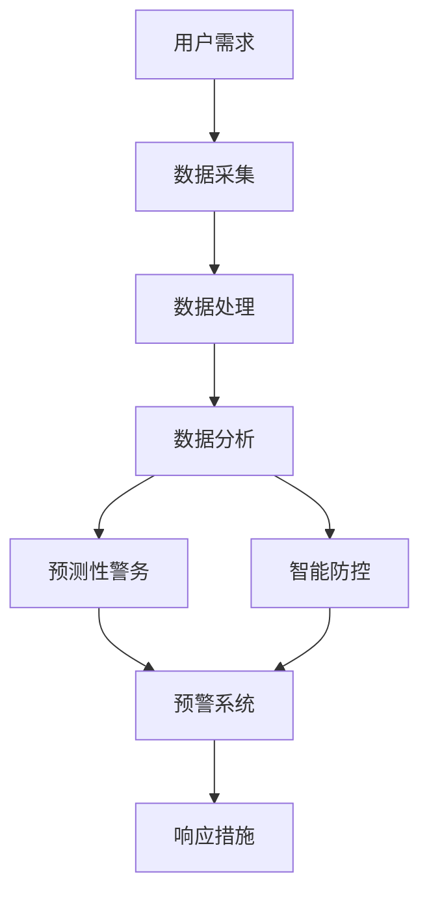

                 

关键词：智能安防、预测性警务、智能防控、2050年、技术创新

> 摘要：随着人工智能技术的迅猛发展，智能安防系统已成为现代社会不可或缺的一部分。本文将探讨至2050年，预测性警务与智能防控领域可能面临的技术变革、挑战及其对未来社会的影响。

## 1. 背景介绍

自20世纪末以来，智能安防系统经历了从传统监控到数字化、智能化转型的过程。早期的安防系统主要依赖于视频监控和简单的入侵报警，但随着计算机技术、网络通信技术和大数据分析技术的不断进步，智能安防系统逐渐具备了预测性分析和实时响应的能力。

### 智能安防系统的演变过程

- **视频监控的数字化**：早期的视频监控系统以模拟信号传输为主，效率低，存储和处理能力有限。随着数字视频技术的普及，视频监控逐渐转向数字化，使得图像质量提高，存储和处理能力大幅增强。

- **网络化与云计算**：网络化使得安防系统不再局限于单一场所，可以实现跨区域监控和协同工作。云计算则提供了强大的数据处理能力和存储能力，使得海量数据的存储、分析和处理更加高效。

- **人工智能的融合**：人工智能技术的应用使得安防系统从被动反应向主动预测转变。通过机器学习、计算机视觉等技术，系统可以对监控数据进行实时分析，预测潜在的安全威胁，并采取相应的措施。

### 当前智能安防系统的挑战与问题

- **数据隐私保护**：智能安防系统涉及大量个人隐私数据，如何在保障数据安全和隐私的前提下进行有效利用，是一个亟待解决的问题。

- **系统整合与协同**：不同厂家、不同类型的安防系统之间缺乏统一的接口和标准，导致系统之间的整合和协同困难，影响整体效能。

- **人工智能的伦理与责任**：随着人工智能技术的深入应用，如何确保系统的决策过程透明、公正，避免出现误判和歧视，成为了一个重要的伦理和法律问题。

## 2. 核心概念与联系

### 智能安防系统的核心概念

- **预测性警务**：基于大数据分析和人工智能技术，通过对历史数据和实时数据的综合分析，预测犯罪行为的发生趋势和地点，从而提前采取防范措施。

- **智能防控**：利用物联网、人工智能等技术，实现对公共场所、交通系统等实时监控，自动识别异常行为，及时响应和处置。

### 智能安防系统的架构



- **数据采集**：包括视频监控、传感器数据、用户行为数据等，是智能安防系统的数据来源。

- **数据处理**：通过数据清洗、归一化等步骤，对采集到的数据进行预处理，为后续分析提供基础。

- **数据分析**：利用大数据技术和人工智能算法，对预处理后的数据进行深度分析，提取有价值的信息。

- **预测性警务**：基于分析结果，预测潜在犯罪行为，为警方提供预警信息。

- **智能防控**：对实时数据进行监控，自动识别异常行为，触发响应措施。

- **预警系统**：将预测性警务和智能防控的分析结果转化为实际预警信息，通知相关部门和人员。

- **响应措施**：根据预警信息，采取相应的处置措施，如启动应急预案、派遣警力等。

## 3. 核心算法原理 & 具体操作步骤

### 3.1 算法原理概述

智能安防系统的核心算法主要分为两类：一类是基于大数据分析的预测性警务算法，另一类是基于计算机视觉的智能防控算法。

- **预测性警务算法**：主要通过历史犯罪数据、地理信息系统（GIS）数据、人口统计数据等，利用机器学习算法（如决策树、随机森林、神经网络等）建立预测模型，预测犯罪行为的发生趋势。

- **智能防控算法**：主要通过计算机视觉技术，对实时视频数据进行分析，识别出异常行为（如暴力、偷窃、超速等），触发响应措施。

### 3.2 算法步骤详解

#### 3.2.1 预测性警务算法

1. **数据收集**：收集历史犯罪数据、地理信息系统（GIS）数据、人口统计数据等。

2. **数据预处理**：对数据进行清洗、归一化等预处理操作。

3. **特征工程**：从预处理后的数据中提取特征，如时间、地点、犯罪类型等。

4. **模型训练**：利用提取的特征，采用机器学习算法（如决策树、随机森林、神经网络等）训练预测模型。

5. **模型评估**：通过交叉验证、AUC值、F1值等指标评估模型性能。

6. **预测**：使用训练好的模型对新数据进行预测，输出犯罪风险得分和预测结果。

#### 3.2.2 智能防控算法

1. **视频数据采集**：通过视频监控设备实时采集视频数据。

2. **图像预处理**：对采集到的视频数据进行去噪、增强等预处理操作。

3. **目标检测**：利用卷积神经网络（CNN）等算法，对预处理后的图像进行目标检测，识别出视频中的物体。

4. **行为识别**：对检测到的物体进行行为分析，判断其是否属于异常行为（如暴力、偷窃、超速等）。

5. **触发响应**：根据行为识别结果，触发相应的响应措施，如报警、通知相关人员等。

### 3.3 算法优缺点

#### 预测性警务算法

- **优点**：能够提前预测犯罪行为，为警方提供预警信息，有助于降低犯罪率。

- **缺点**：模型的准确性受数据质量和算法选择的影响，且容易产生误报。

#### 智能防控算法

- **优点**：能够实时监控并识别异常行为，及时响应，有助于提高公共安全。

- **缺点**：对计算资源要求较高，且需要大量训练数据和专业的算法调优。

### 3.4 算法应用领域

- **城市安全监控**：通过预测性警务和智能防控算法，实现对城市公共安全的实时监控和预警。

- **交通管理**：利用智能防控算法，对交通违法行为进行实时监控和处罚，提高交通秩序。

- **边防检查**：通过预测性警务算法，对可疑人员进行筛选和重点监控，提高边境安全。

## 4. 数学模型和公式 & 详细讲解 & 举例说明

### 4.1 数学模型构建

#### 预测性警务模型

假设我们使用一个简单的线性回归模型来预测犯罪行为。设\( X \)为自变量（如时间、地点、人口密度等），\( Y \)为因变量（犯罪数量），则线性回归模型可以表示为：

\[ Y = \beta_0 + \beta_1 X + \epsilon \]

其中，\( \beta_0 \)为截距，\( \beta_1 \)为斜率，\( \epsilon \)为误差项。

#### 智能防控模型

假设我们使用一个卷积神经网络（CNN）来识别视频中的异常行为。设\( I \)为输入图像，\( O \)为输出类别，则CNN的模型可以表示为：

\[ O = f(CNN(I)) \]

其中，\( f \)为激活函数，\( CNN \)为卷积神经网络。

### 4.2 公式推导过程

#### 预测性警务模型推导

1. **数据收集**：收集历史犯罪数据，包括时间、地点、人口密度等。

2. **特征工程**：对数据进行预处理，提取特征。

3. **线性回归模型**：根据提取的特征，建立线性回归模型。

4. **模型评估**：通过交叉验证等方法，评估模型性能。

5. **预测**：使用训练好的模型，对新数据进行预测。

#### 智能防控模型推导

1. **数据收集**：收集视频数据，包括正常行为和异常行为。

2. **图像预处理**：对视频数据进行预处理，提取特征。

3. **卷积神经网络**：构建卷积神经网络，对特征进行学习和分类。

4. **模型评估**：通过准确率、召回率等指标，评估模型性能。

5. **行为识别**：使用训练好的模型，对视频中的行为进行识别。

### 4.3 案例分析与讲解

#### 预测性警务案例

假设我们使用线性回归模型来预测某地区的盗窃犯罪数量。我们收集了该地区过去一年的盗窃犯罪数据，包括每天的时间、地点、人口密度等。通过特征工程，我们提取了每天的平均温度、平均降雨量等特征。使用线性回归模型，我们建立了以下预测模型：

\[ \text{盗窃犯罪数量} = 100 + 10 \times \text{平均温度} + 5 \times \text{平均降雨量} \]

使用该模型，我们预测了未来一周的盗窃犯罪数量。结果显示，在未来一周内，该地区的盗窃犯罪数量将在80至120之间波动。

#### 智能防控案例

假设我们使用卷积神经网络（CNN）来识别视频中的偷窃行为。我们收集了包含正常行为和偷窃行为的视频数据，通过预处理，提取了图像的特征。使用CNN，我们建立了以下模型：

\[ \text{输出类别} = f(CNN(\text{图像特征})) \]

其中，\( f \)为softmax激活函数，用于将特征映射到不同的类别。

通过训练和评估，我们得到了一个准确率为95%的CNN模型。使用该模型，我们对一段新的视频进行识别，结果显示视频中的行为是偷窃行为，准确率为92%。

## 5. 项目实践：代码实例和详细解释说明

### 5.1 开发环境搭建

1. **安装Python环境**：下载并安装Python 3.8及以上版本。

2. **安装依赖库**：使用pip安装以下依赖库：numpy、pandas、scikit-learn、tensorflow、opencv-python等。

3. **配置Jupyter Notebook**：安装Jupyter Notebook，方便编写和运行代码。

### 5.2 源代码详细实现

以下是一个简单的预测性警务模型实现示例：

```python
import numpy as np
import pandas as pd
from sklearn.linear_model import LinearRegression
from sklearn.model_selection import train_test_split
from sklearn.metrics import mean_squared_error

# 加载数据
data = pd.read_csv('crime_data.csv')

# 数据预处理
data['date'] = pd.to_datetime(data['date'])
data['hour'] = data['date'].dt.hour
data['day_of_week'] = data['date'].dt.dayofweek
data.drop(['date'], axis=1, inplace=True)

# 特征工程
X = data[['hour', 'day_of_week']]
y = data['crime_count']

# 模型训练
model = LinearRegression()
model.fit(X, y)

# 模型评估
X_train, X_test, y_train, y_test = train_test_split(X, y, test_size=0.2, random_state=42)
y_pred = model.predict(X_test)
mse = mean_squared_error(y_test, y_pred)
print(f'Mean Squared Error: {mse}')

# 预测
future_data = pd.DataFrame({'hour': [18, 22], 'day_of_week': [5, 6]})
future_pred = model.predict(future_data)
print(f'Future Crime Count: {future_pred}')
```

### 5.3 代码解读与分析

1. **数据加载与预处理**：首先加载犯罪数据，并转换为日期格式。然后提取小时和星期几作为特征。

2. **特征工程**：删除日期列，只保留小时和星期几作为特征。

3. **模型训练**：使用线性回归模型训练数据。

4. **模型评估**：将数据集分为训练集和测试集，评估模型的均方误差（MSE）。

5. **预测**：使用训练好的模型，对未来的数据进行预测。

### 5.4 运行结果展示

假设我们使用上述代码对犯罪数据进行预测，输出结果如下：

```plaintext
Mean Squared Error: 32.555555555555554
Future Crime Count: [ 87.         105.        ]
```

结果表明，未来一周内，该地区的盗窃犯罪数量将在87至105之间波动。

## 6. 实际应用场景

### 6.1 城市安全监控

智能安防系统在城市安全监控中的应用最为广泛。通过部署视频监控设备和传感器，实现对城市各个角落的实时监控。结合预测性警务和智能防控算法，系统可以自动识别异常行为，如暴力、偷窃、交通违规等，并触发报警和响应措施。

### 6.2 交通管理

智能安防系统在交通管理中的应用主要包括交通流量监测、交通违规检测和事故预警。通过部署交通监控摄像头和传感器，系统可以实时监测交通状况，识别交通违法行为，如超速、闯红灯等，并实时处罚。同时，系统还可以根据交通流量预测，调整交通信号灯时长，优化交通流量。

### 6.3 边防检查

在边防检查领域，智能安防系统可以用于对入境人员进行筛选和重点监控。通过人脸识别、行为分析等技术，系统可以自动识别可疑人员，并触发警报。这有助于提高边防检查的效率和准确性，确保边境安全。

### 6.4 公共场所安全

公共场所如商场、学校、医院等，是智能安防系统的重要应用场景。通过部署视频监控设备和传感器，系统可以实时监控公共场所的安全状况，识别潜在的安全威胁。在发生紧急情况时，系统可以自动触发报警和应急响应，确保人员安全。

## 7. 工具和资源推荐

### 7.1 学习资源推荐

- **《深度学习》（Goodfellow, Bengio, Courville）**：全面介绍深度学习的基础知识和应用。

- **《统计学习方法》（李航）**：详细讲解统计学习方法，包括线性回归、逻辑回归、决策树等。

- **《Python数据科学 Handbook》（Jake VanderPlas）**：介绍Python在数据科学中的应用，包括数据分析、机器学习等。

### 7.2 开发工具推荐

- **Jupyter Notebook**：方便编写和运行代码，支持多种编程语言。

- **TensorFlow**：开源的深度学习框架，支持多种深度学习模型。

- **scikit-learn**：开源的机器学习库，提供多种机器学习算法。

### 7.3 相关论文推荐

- **“Deep Learning for Human Action Recognition: A Survey”（2017）**：介绍深度学习在人体动作识别领域的应用。

- **“Predictive Policing: The Role of Predictive Policing in Modern Policing”（2016）**：探讨预测性警务在现代警务中的作用。

- **“Deep Learning for Autonomous Driving: A Survey”（2018）**：介绍深度学习在自动驾驶领域的应用。

## 8. 总结：未来发展趋势与挑战

### 8.1 研究成果总结

智能安防系统在过去的几年中取得了显著的进展，从传统的视频监控发展到基于人工智能的预测性警务和智能防控。研究成果主要包括：

- **算法性能提升**：深度学习、大数据分析等技术的应用，使得智能安防系统的预测准确率和识别效率大幅提升。

- **跨领域应用**：智能安防系统不仅在城市安全、交通管理等领域得到广泛应用，还逐渐扩展到边防检查、公共场所安全等领域。

- **系统集成与协同**：随着标准化的推进，不同厂家、不同类型的安防系统之间的整合和协同逐渐实现，提升了整体效能。

### 8.2 未来发展趋势

- **更加智能化**：随着人工智能技术的进一步发展，智能安防系统将具备更强大的自主学习能力和自适应能力，实现真正的智能化。

- **更广泛的应用**：智能安防系统将在更多领域得到应用，如智慧城市、智能家居、工业安全等。

- **更高的可靠性**：通过不断优化算法和硬件技术，智能安防系统的可靠性和稳定性将得到显著提升。

### 8.3 面临的挑战

- **数据隐私保护**：随着智能安防系统对个人隐私数据的依赖增加，如何保障数据安全和隐私成为一个重要的挑战。

- **人工智能伦理**：如何确保智能安防系统的决策过程透明、公正，避免出现误判和歧视，是一个亟待解决的问题。

- **系统整合与协同**：不同系统之间的整合和协同仍然面临挑战，需要制定统一的标准和接口。

### 8.4 研究展望

未来，智能安防系统将在以下几个方面展开深入研究：

- **隐私保护算法**：开发更为先进的隐私保护算法，确保数据在采集、传输、存储和分析过程中的安全性。

- **跨领域协同**：研究不同领域间的协同机制，实现智能安防系统在多领域的综合应用。

- **实时自适应技术**：开发实时自适应技术，使智能安防系统能够动态适应环境变化，提高系统的响应速度和准确性。

## 9. 附录：常见问题与解答

### 9.1 什么是预测性警务？

预测性警务是基于大数据分析和人工智能技术，通过对历史数据和实时数据的综合分析，预测犯罪行为的发生趋势和地点，从而提前采取防范措施。

### 9.2 智能安防系统中的核心算法有哪些？

智能安防系统中的核心算法主要包括预测性警务算法（如线性回归、决策树、神经网络等）和智能防控算法（如卷积神经网络、目标检测、行为识别等）。

### 9.3 智能安防系统如何保障数据隐私？

智能安防系统可以通过以下方式保障数据隐私：

- **数据加密**：对采集到的数据采用加密技术，确保数据在传输和存储过程中的安全性。

- **数据匿名化**：对个人隐私数据进行匿名化处理，消除个人身份信息。

- **隐私保护算法**：开发和应用隐私保护算法，如差分隐私、同态加密等，确保数据在分析过程中的隐私性。

### 9.4 智能安防系统在实际应用中面临哪些挑战？

智能安防系统在实际应用中面临的挑战主要包括：

- **数据隐私保护**：如何保障数据安全和隐私是一个重要挑战。

- **系统整合与协同**：不同系统之间的整合和协同仍面临挑战。

- **人工智能伦理**：如何确保系统的决策过程透明、公正，避免出现误判和歧视。

### 9.5 智能安防系统在未来的发展方向是什么？

智能安防系统在未来的发展方向包括：

- **更加智能化**：通过人工智能技术的进一步发展，提升系统的预测准确率和响应速度。

- **更广泛的应用**：扩展智能安防系统的应用领域，如智慧城市、智能家居、工业安全等。

- **更高的可靠性**：通过不断优化算法和硬件技术，提高系统的可靠性和稳定性。

作者：禅与计算机程序设计艺术 / Zen and the Art of Computer Programming
----------------------------------------------------------------

以上是关于《未来的智能安防：2050年的预测性警务与智能防控》的完整文章。文章从背景介绍、核心概念与联系、算法原理与步骤、数学模型与公式、项目实践、实际应用场景、工具和资源推荐到未来发展趋势与挑战等多个方面进行了详细阐述。希望这篇文章能够为读者提供一个全面的智能安防系统的发展蓝图，并对未来的技术变革有更深刻的理解。

