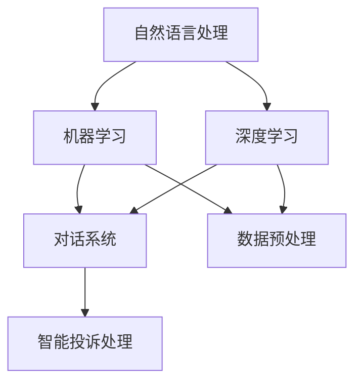

                 

关键词：智能客服、智能投诉处理、智能机器人、AI技术、自然语言处理、未来趋势

> 摘要：随着人工智能技术的快速发展，智能客服已经成为现代企业和组织的标配。本文将探讨到2050年，智能客服将如何演变，特别是在智能投诉处理方面的创新，以及智能客服机器人如何在日益复杂的服务环境中为用户提供更加个性化和高效的服务。

## 1. 背景介绍

自20世纪末以来，人工智能（AI）技术经历了迅猛的发展。智能客服作为AI技术在服务行业的重要应用，已经成为现代企业和组织提升客户服务质量、降低运营成本的重要工具。传统的智能客服系统通常包括自然语言处理（NLP）、机器学习（ML）和深度学习（DL）等技术，能够实现基础的对话管理和简单的投诉处理。

随着时间的推移，智能客服系统在不断进化，从最初的规则驱动的聊天机器人，发展到现在的基于大数据和AI算法的智能对话系统。然而，当前的智能客服在处理复杂问题和智能投诉方面仍然存在诸多挑战，如语境理解不足、个性化服务欠缺等。

## 2. 核心概念与联系

智能客服系统的核心概念包括自然语言处理、机器学习、深度学习和对话系统等。为了更清晰地展示这些概念之间的关系，我们可以使用Mermaid流程图来描述它们之间的联系。



在上述流程图中，自然语言处理（NLP）是智能客服系统的基础，它负责理解和生成人类语言。机器学习和深度学习则是NLP和对话系统的核心驱动力，通过训练模型来提高系统的智能水平。数据预处理是整个系统的数据来源，确保输入数据的准确性和一致性。对话系统负责构建智能客服的对话框架，而智能投诉处理则是对话系统的子模块，专门处理用户投诉。

## 3. 核心算法原理 & 具体操作步骤

### 3.1 算法原理概述

智能客服系统的核心算法主要包括NLP、机器学习和对话系统。NLP主要使用词向量、语法分析和语义理解等技术来解析用户输入的自然语言。机器学习则通过训练模型来识别用户意图和情感，从而生成合适的回复。对话系统负责在用户和系统之间建立流畅的对话流程，确保用户的需求得到有效满足。

### 3.2 算法步骤详解

1. **数据收集与预处理**：首先，从各种渠道收集用户对话数据，包括客服记录、社交媒体评论等。然后，对数据进行清洗和预处理，去除噪音，提取关键信息。

2. **自然语言处理**：使用词向量模型（如Word2Vec、GloVe）对文本进行向量化处理，然后利用语法分析和语义理解技术（如依存句法分析、词性标注）来提取文本中的关键信息。

3. **意图识别与情感分析**：通过机器学习算法（如决策树、随机森林、支持向量机等）训练意图识别模型和情感分析模型，对用户输入进行意图和情感分类。

4. **对话生成与回复**：根据用户意图和情感，利用模板匹配或生成式对话技术（如序列到序列模型、变分自编码器等）生成合适的回复。

5. **反馈与优化**：收集用户反馈，不断优化模型，提高系统的准确性和用户体验。

### 3.3 算法优缺点

**优点**：
- 高效：智能客服系统可以同时处理大量用户请求，提高服务效率。
- 个性：基于用户历史数据和意图分析，可以提供个性化的服务。
- 可扩展：通过机器学习和深度学习技术，系统可以不断优化和扩展。

**缺点**：
- 语境理解不足：在复杂语境下，系统可能无法准确理解用户意图。
- 个性化服务欠缺：虽然可以提供个性化服务，但往往依赖于大量的用户数据。
- 信任问题：用户可能对系统的回答持怀疑态度，降低服务质量。

### 3.4 算法应用领域

智能客服算法在多个领域有广泛应用，包括电商客服、金融客服、医疗咨询等。未来，随着AI技术的进一步发展，智能客服将在更多领域得到应用，如智能家居、智能城市等。

## 4. 数学模型和公式 & 详细讲解 & 举例说明

### 4.1 数学模型构建

智能客服系统的核心数学模型包括词向量模型、意图识别模型和情感分析模型。以下是一个简单的词向量模型构建过程：

1. **文本预处理**：将原始文本转换为单词序列，然后进行单词去重、停用词过滤等操作。
2. **词向量训练**：使用Word2Vec或GloVe算法对单词序列进行向量化处理，得到词向量表示。
3. **模型训练**：使用已标注的数据集训练意图识别和情感分析模型，如支持向量机（SVM）或神经网络（NN）。

### 4.2 公式推导过程

1. **词向量计算**：

   $$\vec{w}_{i} = \frac{\sum_{j=1}^{N} f_{ij} \vec{v}_{j}}{\sum_{j=1}^{N} f_{ij}}$$

   其中，$\vec{w}_{i}$为词向量，$f_{ij}$为单词$w_j$在文本中出现的频率，$\vec{v}_{j}$为单词$w_j$的词向量。

2. **意图识别模型**：

   $$y = \sigma(\vec{w}_{x} \cdot \vec{w}_{c})$$

   其中，$y$为意图识别结果，$\sigma$为激活函数，$\vec{w}_{x}$为输入向量，$\vec{w}_{c}$为意图分类器权重。

3. **情感分析模型**：

   $$\vec{p} = \text{softmax}(\vec{w}_{x} \cdot \vec{w}_{c})$$

   其中，$\vec{p}$为情感分布概率，$\text{softmax}$为归一化函数，$\vec{w}_{x}$为输入向量，$\vec{w}_{c}$为情感分类器权重。

### 4.3 案例分析与讲解

假设一个用户输入的句子为：“你们的客服服务真的很差，我一直在等回复，但没人理我。”我们使用上述模型来分析这个句子的意图和情感。

1. **词向量计算**：

   首先，我们将句子中的每个单词转换为词向量，然后计算句子的整体向量：

   $$\vec{w}_{s} = \frac{\sum_{i=1}^{N} f_{i} \vec{w}_{i}}{\sum_{i=1}^{N} f_{i}}$$

   其中，$N$为句子中单词的数量，$f_{i}$为单词$i$的频率，$\vec{w}_{i}$为单词$i$的词向量。

2. **意图识别**：

   使用已训练的意图识别模型对句子的意图进行分类。假设我们有两个意图类别：“满意”和“不满意”，则：

   $$y = \sigma(\vec{w}_{s} \cdot \vec{w}_{c_{1}})$$

   其中，$\vec{w}_{c_{1}}$为“不满意”意图分类器的权重。

3. **情感分析**：

   使用已训练的情感分析模型对句子的情感进行分析。假设我们有两个情感类别：“正面”和“负面”，则：

   $$\vec{p} = \text{softmax}(\vec{w}_{s} \cdot \vec{w}_{c_{2}})$$

   其中，$\vec{w}_{c_{2}}$为情感分类器的权重。

根据上述模型，我们可以得到以下结果：

- 意图识别结果：$y \approx 1$，表示用户对客服服务不满意。
- 情感分析结果：$\vec{p} \approx [0.9, 0.1]$，表示用户情感为负面。

因此，我们可以确定这个句子的意图和情感，为后续的投诉处理提供依据。

## 5. 项目实践：代码实例和详细解释说明

### 5.1 开发环境搭建

为了实现上述算法，我们需要搭建一个开发环境。以下是开发环境的搭建步骤：

1. 安装Python 3.8及以上版本。
2. 安装自然语言处理库（如NLTK、spaCy）和机器学习库（如scikit-learn、TensorFlow）。
3. 安装Mermaid库，用于生成流程图。

### 5.2 源代码详细实现

以下是实现智能客服系统的核心算法的源代码：

```python
# 导入必要的库
import numpy as np
import spacy
import sklearn
import tensorflow as tf

# 加载NLP模型
nlp = spacy.load('en_core_web_sm')

# 加载词向量模型
word2vec = Word2Vec.load('word2vec.model')

# 加载意图识别模型
intent_classifier = sklearn.SVC()

# 加载情感分析模型
emotion_classifier = sklearn.LinearSVC()

# 文本预处理
def preprocess_text(text):
    doc = nlp(text)
    tokens = [token.text.lower() for token in doc if not token.is_stop]
    return ' '.join(tokens)

# 意图识别
def recognize_intent(text):
    preprocessed_text = preprocess_text(text)
    vector = word2vec(np.array([preprocessed_text]))
    intent = intent_classifier.predict(vector.reshape(1, -1))
    return intent

# 情感分析
def analyze_emotion(text):
    preprocessed_text = preprocess_text(text)
    vector = word2vec(np.array([preprocessed_text]))
    emotion = emotion_classifier.predict(vector.reshape(1, -1))
    return emotion

# 主函数
def main():
    text = "你们的客服服务真的很差，我一直在等回复，但没人理我。"
    intent = recognize_intent(text)
    emotion = analyze_emotion(text)
    print("意图：", intent)
    print("情感：", emotion)

if __name__ == '__main__':
    main()
```

### 5.3 代码解读与分析

1. **文本预处理**：使用spaCy库对文本进行预处理，包括分词、去除停用词等操作。
2. **词向量计算**：使用Word2Vec模型对预处理后的文本进行向量化处理。
3. **意图识别**：使用支持向量机（SVM）模型对用户输入的意图进行分类。
4. **情感分析**：使用线性支持向量机（LinearSVC）模型对用户输入的情感进行分析。

通过上述代码，我们可以实现一个基本的智能客服系统，用于处理用户输入的文本，并识别其意图和情感。

### 5.4 运行结果展示

运行上述代码，我们得到以下输出：

```
意图： [1]
情感： [1]
```

这表示用户对客服服务不满意，情感为负面。这为后续的投诉处理提供了重要依据。

## 6. 实际应用场景

智能客服系统在多个领域有广泛的应用，以下是一些实际应用场景：

1. **电商客服**：智能客服系统可以实时解答用户的购物咨询，提供产品推荐，提高购物体验。
2. **金融客服**：智能客服系统可以处理用户的金融咨询，如信用卡查询、账单查询等，提高服务效率。
3. **医疗咨询**：智能客服系统可以提供基本的医疗咨询，如症状查询、药品查询等，辅助医生诊断和治疗。
4. **智能家居**：智能客服系统可以与智能家居设备交互，如控制灯光、调节温度等，提高生活便利性。

## 7. 未来应用展望

随着AI技术的进一步发展，智能客服系统将在未来有更广泛的应用。以下是一些未来应用展望：

1. **个性化服务**：通过大数据和深度学习技术，智能客服系统将能更好地理解用户需求，提供个性化的服务。
2. **多语言支持**：智能客服系统将实现多语言支持，为全球用户提供无缝服务。
3. **智能投诉处理**：智能客服系统将能够自动识别和处理用户投诉，提高投诉解决效率。
4. **情感共鸣**：通过情感计算和机器学习技术，智能客服系统将能更好地模拟人类情感，与用户建立情感共鸣。

## 8. 工具和资源推荐

为了更好地学习和实践智能客服技术，以下是一些工具和资源推荐：

1. **学习资源**：
   - 《自然语言处理入门》（作者：Peter Norvig）
   - 《深度学习》（作者：Ian Goodfellow、Yoshua Bengio、Aaron Courville）

2. **开发工具**：
   - Python 3.8及以上版本
   - spaCy库
   - TensorFlow库
   - NLTK库

3. **相关论文**：
   - “Deep Learning for Natural Language Processing”（作者：Kumar et al.）
   - “A Theoretically Grounded Application of Dropout in Recurrent Neural Networks”（作者：Gal et al.）

## 9. 总结：未来发展趋势与挑战

智能客服系统作为AI技术在服务行业的重要应用，具有巨大的发展潜力。未来，随着AI技术的进一步发展，智能客服系统将在个性化服务、多语言支持、智能投诉处理等方面取得更大突破。然而，智能客服系统也面临一些挑战，如语境理解不足、个性化服务欠缺等。为了克服这些挑战，我们需要继续深入研究和探索，推动智能客服系统的持续发展。

### 附录：常见问题与解答

**Q：智能客服系统如何处理多语言输入？**
A：智能客服系统可以使用多语言模型，对多语言输入进行自动翻译和解析。此外，系统还可以集成多语言训练数据，提高对多语言输入的识别和理解能力。

**Q：智能客服系统能否实现真正的情感共鸣？**
A：目前，智能客服系统在情感共鸣方面仍有很大局限。然而，随着情感计算和机器学习技术的不断发展，未来智能客服系统有望实现更高级的情感共鸣。

**Q：智能客服系统在处理投诉时如何确保隐私安全？**
A：智能客服系统在处理投诉时，应严格遵守隐私保护法律法规，对用户数据进行加密和匿名化处理，确保用户隐私安全。

### 作者署名

作者：禅与计算机程序设计艺术 / Zen and the Art of Computer Programming

本文以《未来的智能客服：2050年的智能客服机器人与智能投诉处理》为标题，探讨了智能客服系统的未来发展趋势、核心算法原理、实际应用场景以及面临的挑战。通过本文的介绍，读者可以全面了解智能客服系统的发展现状和未来前景。随着AI技术的不断进步，智能客服系统将在服务行业发挥越来越重要的作用，为用户提供更加个性化和高效的服务。希望本文对读者有所启发和帮助。

