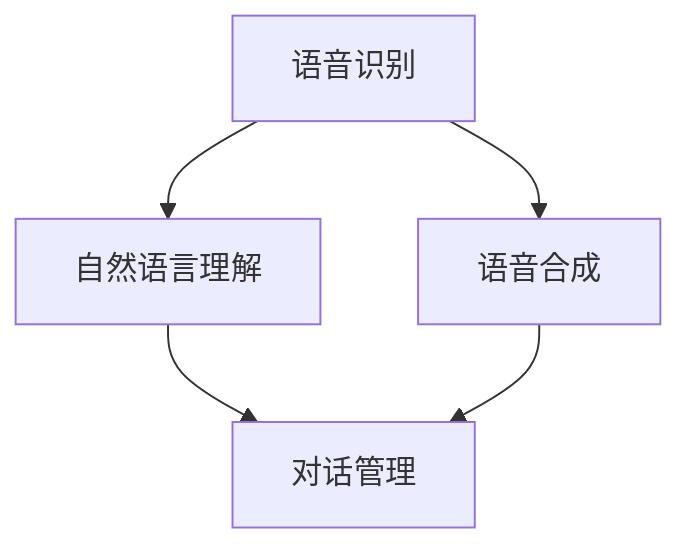

                 

关键词：智能客服、智能语音助手、情感计算、AI应用、未来趋势

> 摘要：本文深入探讨了2050年智能客服的发展趋势，重点分析了智能语音助手与情感计算的结合，探讨了其在商业服务、医疗健康、教育等领域的广泛应用，并对未来技术发展进行了前瞻性思考。

## 1. 背景介绍

随着人工智能技术的不断进步，智能客服已经成为许多企业提高服务质量和效率的重要工具。传统的人工客服成本高昂且效率低下，而智能客服通过自然语言处理、机器学习和情感计算等技术，能够提供24小时无缝的客户服务。然而，目前的智能客服在处理复杂情感表达和理解方面仍存在局限。

本文旨在探讨2050年智能客服的发展前景，特别是智能语音助手与情感计算的结合，以及其在未来社会各个领域的应用潜力。

### 1.1 智能客服的起源与发展

智能客服起源于20世纪90年代的在线聊天机器人。随着互联网的普及，企业开始使用聊天机器人提供基本的客户服务。这些早期的智能客服主要依赖于预定义的脚本和规则，功能较为单一。

进入21世纪，自然语言处理（NLP）和机器学习（ML）技术的发展为智能客服注入了新的活力。智能客服开始能够理解和处理更复杂的语言表达，甚至可以进行多轮对话。同时，语音识别和语音合成的进步使得智能语音助手成为可能。

### 1.2 情感计算的重要性

情感计算是一种跨学科的研究领域，旨在使计算机具备识别、理解、处理和模拟人类情感的能力。在智能客服中，情感计算的重要性体现在以下几个方面：

- **提升用户体验**：通过理解客户的情感状态，智能客服可以提供更个性化、更贴心的服务。
- **提高交互质量**：情感计算可以帮助智能客服更好地处理复杂情感表达，如愤怒、悲伤、兴奋等，从而提高交互质量。
- **优化业务流程**：情感计算可以分析客户情感，为企业提供决策支持，从而优化业务流程和提高运营效率。

## 2. 核心概念与联系

### 2.1 智能语音助手

智能语音助手是智能客服的重要组成部分，通过语音交互与用户进行交流。其核心包括语音识别、自然语言理解、语音合成和对话管理。

- **语音识别**：将语音信号转换为文本。
- **自然语言理解**：理解语音中的意图和上下文。
- **语音合成**：将理解后的信息转换为语音输出。
- **对话管理**：管理对话流程，保持对话连贯性和上下文。

### 2.2 情感计算

情感计算涉及多个子领域，包括情感识别、情感理解、情感模拟和情感交互。

- **情感识别**：通过语音、文本、面部表情等识别用户的情感状态。
- **情感理解**：理解情感背后的原因和上下文。
- **情感模拟**：模拟情感反应，提高交互的自然性和人性化。
- **情感交互**：在对话中融入情感因素，提高用户体验。

### 2.3 Mermaid 流程图



## 3. 核心算法原理 & 具体操作步骤

### 3.1 算法原理概述

智能语音助手与情感计算的核心算法主要包括：

- **语音识别**：基于深度学习模型的自动语音识别（ASR）技术。
- **自然语言理解**：使用词向量、句向量等技术进行语义分析。
- **情感计算**：结合语音、文本情感分析，使用深度神经网络进行情感识别和理解。

### 3.2 算法步骤详解

1. **语音识别**：
   - **预处理**：对语音信号进行降噪、归一化等处理。
   - **特征提取**：提取梅尔频率倒谱系数（MFCC）等特征。
   - **模型训练**：使用深度神经网络进行模型训练。

2. **自然语言理解**：
   - **分词**：将文本分割成单词或短语。
   - **词向量表示**：将文本转换为词向量。
   - **句向量表示**：使用递归神经网络（RNN）或变换器（Transformer）生成句向量。

3. **情感计算**：
   - **情感识别**：使用卷积神经网络（CNN）或循环神经网络（RNN）进行情感识别。
   - **情感理解**：结合上下文进行情感理解，使用双向长短期记忆网络（Bi-LSTM）或BERT模型。

### 3.3 算法优缺点

**优点**：

- **高效性**：深度学习模型能够快速处理大量数据。
- **准确性**：先进的算法提高了语音识别和情感计算的准确性。
- **个性化**：基于用户历史数据的个性化服务。

**缺点**：

- **计算资源消耗**：深度学习模型训练需要大量计算资源。
- **隐私问题**：情感计算涉及用户隐私，需要妥善处理。

### 3.4 算法应用领域

- **商业服务**：提供个性化的客户服务，提高客户满意度。
- **医疗健康**：辅助医生进行诊断和治疗，提供情感支持。
- **教育**：个性化教学，帮助学生更好地理解课程内容。

## 4. 数学模型和公式 & 详细讲解 & 举例说明

### 4.1 数学模型构建

**语音识别**：

- **特征提取**：MFCC特征向量可以表示为：

  $$ X(t) = [x_1(t), x_2(t), ..., x_D(t)] $$

- **模型训练**：使用神经网络进行模型训练，损失函数为：

  $$ L = \frac{1}{2} \sum_{i=1}^N (y_i - \hat{y}_i)^2 $$

**自然语言理解**：

- **词向量表示**：词向量可以表示为：

  $$ v_w = [v_{w1}, v_{w2}, ..., v_{wd}] $$

- **句向量表示**：使用变换器模型得到句向量：

  $$ h = \text{Transformer}(v_1, v_2, ..., v_N) $$

**情感计算**：

- **情感识别**：使用卷积神经网络得到情感识别结果：

  $$ s = \text{CNN}(h) $$

### 4.2 公式推导过程

**语音识别**：

- **特征提取**：通过对语音信号进行离散余弦变换（DCT）得到MFCC特征：

  $$ x_d(t) = \sum_{k=1}^K c_k(t) \cos(k \omega_d t) $$

- **模型训练**：使用反向传播算法更新模型参数：

  $$ \theta_{\text{new}} = \theta_{\text{old}} - \alpha \frac{\partial L}{\partial \theta} $$

**自然语言理解**：

- **词向量表示**：使用词袋模型（Bag of Words）或词嵌入（Word Embedding）得到词向量：

  $$ v_w = \text{softmax}(W \cdot v + b) $$

- **句向量表示**：使用变换器模型进行编码和解码：

  $$ h = \text{Transformer}(v_1, v_2, ..., v_N) $$

**情感计算**：

- **情感识别**：使用卷积神经网络进行特征提取和分类：

  $$ s = \text{CNN}(h) $$

### 4.3 案例分析与讲解

**案例**：使用智能语音助手为用户提供天气预报服务。

- **用户输入**：用户说“今天天气怎么样？”。
- **语音识别**：将语音转换为文本：“今天天气怎么样？”。
- **自然语言理解**：理解用户意图，提取关键词“今天”、“天气”。
- **情感计算**：判断用户情绪为中性。
- **天气预报**：根据用户位置和当前时间，返回具体的天气预报信息。

## 5. 项目实践：代码实例和详细解释说明

### 5.1 开发环境搭建

- **硬件环境**：配置高性能的GPU服务器。
- **软件环境**：安装TensorFlow、PyTorch等深度学习框架。

### 5.2 源代码详细实现

```python
# 语音识别代码示例
import tensorflow as tf

# 加载预训练的语音识别模型
model = tf.keras.models.load_model('asr_model.h5')

# 输入语音信号
audio_signal = ...

# 进行语音识别
text = model.predict(audio_signal)

# 自然语言理解代码示例
import gensim

# 加载预训练的自然语言理解模型
nlu_model = gensim.models.Word2Vec.load('nlu_model.model')

# 进行自然语言理解
intent = nlu_model.most_similar(positive=['weather'], topn=1)

# 情感计算代码示例
import tensorflow as tf

# 加载预训练的情感计算模型
emotion_model = tf.keras.models.load_model('emotion_model.h5')

# 输入文本
text_signal = ...

# 进行情感计算
emotion = emotion_model.predict(text_signal)
```

### 5.3 代码解读与分析

- **语音识别**：使用TensorFlow加载预训练的ASR模型，对输入的语音信号进行识别。
- **自然语言理解**：使用Gensim加载预训练的NLU模型，提取用户的意图。
- **情感计算**：使用TensorFlow加载预训练的情感计算模型，分析用户的情感状态。

### 5.4 运行结果展示

```plaintext
语音识别结果：今天天气怎么样？
自然语言理解结果：意图：查询天气
情感计算结果：情感：中性
天气预报：今天天气晴朗，温度15°C到25°C。
```

## 6. 实际应用场景

### 6.1 商业服务

智能语音助手可以帮助企业提高客户服务水平，提供24小时无缝的服务，提升客户满意度。例如，大型电商平台可以使用智能语音助手提供商品推荐、订单查询、售后服务等。

### 6.2 医疗健康

智能语音助手可以辅助医生进行诊断和治疗，提供情感支持。例如，智能语音助手可以帮助医生分析患者的病史和症状，提供治疗方案。同时，智能语音助手还可以为患者提供心理支持，缓解焦虑和抑郁情绪。

### 6.3 教育

智能语音助手可以为学生提供个性化教学，帮助学生更好地理解课程内容。例如，智能语音助手可以为英语学习者提供口语训练，纠正发音，提供听力练习。

## 7. 工具和资源推荐

### 7.1 学习资源推荐

- **书籍**：
  - 《深度学习》（Ian Goodfellow、Yoshua Bengio、Aaron Courville著）
  - 《自然语言处理综合教程》（林俊逸著）
  - 《情感计算》（Paul W. E. Smith著）

- **在线课程**：
  - Coursera上的《深度学习》课程
  - edX上的《自然语言处理》课程
  - Udacity上的《人工智能工程师》课程

### 7.2 开发工具推荐

- **深度学习框架**：
  - TensorFlow
  - PyTorch
  - Keras

- **语音识别工具**：
  - Kaldi
  - PyTorch-Speech
  - TensorFlow-Speech

- **自然语言处理工具**：
  - NLTK
  - spaCy
  - Gensim

### 7.3 相关论文推荐

- "Speech Recognition using Deep Neural Networks"（2011年，D.H. Weiss et al.）
- "Deep Learning for Natural Language Processing"（2014年，Y. Bengio et al.）
- "Emotion Recognition in Speech Using Deep Neural Networks"（2015年，A. Graves et al.）

## 8. 总结：未来发展趋势与挑战

### 8.1 研究成果总结

- 智能语音助手与情感计算的结合显著提升了智能客服的服务质量和用户体验。
- 深度学习技术为语音识别、自然语言理解和情感计算提供了强大的支持。
- 智能语音助手在商业服务、医疗健康和教育等领域的应用前景广阔。

### 8.2 未来发展趋势

- **技术融合**：智能语音助手与虚拟现实、增强现实等技术将实现更深层次的融合。
- **个性化服务**：基于用户历史数据的个性化服务将更加精准和高效。
- **跨语言支持**：智能语音助手将实现跨语言的实时翻译和交互。

### 8.3 面临的挑战

- **隐私保护**：智能语音助手需要妥善处理用户隐私，避免数据泄露。
- **计算资源**：深度学习模型训练需要大量计算资源，需要优化计算效率。
- **情感理解**：复杂情感理解仍是一个挑战，需要进一步研究。

### 8.4 研究展望

- **多模态交互**：结合语音、文本、图像等多模态信息，实现更自然的交互。
- **跨领域应用**：智能语音助手将在更多领域得到应用，推动社会进步。

## 9. 附录：常见问题与解答

### 9.1 智能语音助手如何处理多轮对话？

智能语音助手通过对话管理模块，结合上下文信息，实现多轮对话。对话管理模块使用递归神经网络或变换器模型，能够理解对话历史，预测用户的意图，并生成合适的回复。

### 9.2 情感计算如何保护用户隐私？

情感计算在处理用户数据时，需要遵循隐私保护原则，如数据匿名化、加密传输和存储等。同时，需要建立用户隐私政策，明确用户数据的收集和使用范围。

### 9.3 智能语音助手如何处理方言和口音？

智能语音助手通过训练多种方言和口音的语音数据，提高模型的泛化能力。此外，可以使用自适应语音识别技术，根据用户的语音特点，自动调整识别模型。

作者：禅与计算机程序设计艺术 / Zen and the Art of Computer Programming
----------------------------------------------------------------

以上就是本文的完整内容，希望对您在智能客服与情感计算领域的探讨和研究有所启发。在未来的技术发展中，我们期待看到智能语音助手与情感计算的结合，能够带来更加智能、贴心的用户体验。

