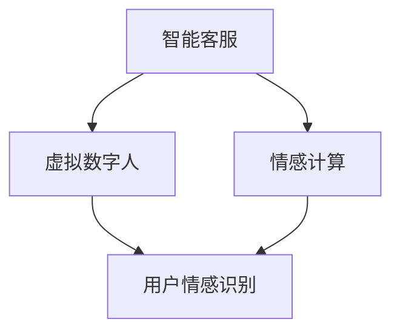

                 

关键词：智能客服、虚拟数字人、情感计算、人工智能、用户体验、技术发展

摘要：本文深入探讨了2050年智能客服领域的前沿技术，包括虚拟数字人和情感计算的应用。通过分析当前技术的进展和未来趋势，本文提出了智能客服未来的发展方向、面临的挑战以及相关技术资源推荐，旨在为读者提供关于智能客服技术发展的全面视角。

## 1. 背景介绍

### 1.1 智能客服的起源与发展

智能客服作为人工智能（AI）的一个重要应用领域，起源于20世纪90年代的聊天机器人和虚拟客服。随着互联网和移动互联网的普及，智能客服逐渐成为企业提升客户服务效率和质量的重要工具。传统的智能客服系统主要依赖自然语言处理（NLP）和机器学习（ML）技术，能够提供基本的问答服务。

然而，随着人工智能技术的不断进步，智能客服正在从被动响应转向主动服务。从传统的规则驱动型客服系统，发展到现在的基于大数据和深度学习的智能客服，用户体验得到了极大的提升。未来，智能客服将更加注重情感交互，以满足用户个性化的需求。

### 1.2 虚拟数字人的崛起

虚拟数字人，又称虚拟人物（Virtual Characters），是人工智能领域中的一个重要分支。它们是通过计算机图形学、人工智能和虚拟现实（VR）技术实现的，能够模拟人类的情感、行为和对话能力。

虚拟数字人的应用范围非常广泛，从游戏和娱乐行业到教育、医疗和客服等多个领域都有涉及。在客服领域，虚拟数字人不仅可以提供24/7全天候服务，还能通过丰富的情感交互，增强用户黏性和满意度。

## 2. 核心概念与联系

在智能客服的发展过程中，虚拟数字人和情感计算是两个不可或缺的核心概念。为了更清晰地理解这两个概念及其相互关系，我们可以使用Mermaid流程图来展示它们之间的联系。



### 2.1 虚拟数字人

虚拟数字人是指通过人工智能技术实现的人类形象，能够进行自然语言交互，并模拟人类的情感和行为。虚拟数字人包括以下几个方面：

- **外观设计**：虚拟数字人的外观设计决定了它们在用户心中的形象，需要符合用户的审美和期望。
- **对话能力**：虚拟数字人需要具备强大的自然语言处理能力，能够理解用户的语言并作出合适的回应。
- **情感表达**：虚拟数字人能够识别和表达情感，通过面部表情、语音语调等方式，增强与用户的情感互动。

### 2.2 情感计算

情感计算是指通过计算机技术，实现对于人类情感的识别、理解和模拟。情感计算主要包括以下几个方面：

- **情感识别**：通过分析用户的语言、声音、面部表情等数据，识别用户的情感状态。
- **情感理解**：理解用户的情感需求，并根据情感状态提供个性化的服务。
- **情感模拟**：通过虚拟数字人表达情感，增强用户的情感体验。

### 2.3 虚拟数字人与情感计算的联系

虚拟数字人和情感计算在智能客服中紧密相连。虚拟数字人需要依赖情感计算技术，才能实现情感识别和表达。同时，情感计算的结果也决定了虚拟数字人的行为和对话策略。两者的结合，使得智能客服能够提供更加人性化的服务。

## 3. 核心算法原理 & 具体操作步骤

### 3.1 算法原理概述

智能客服系统的核心算法主要包括自然语言处理（NLP）、机器学习（ML）和情感计算。其中，NLP负责处理和理解用户的语言输入，ML用于根据历史数据优化客服系统的性能，而情感计算则用于识别和模拟用户的情感。

### 3.2 算法步骤详解

#### 3.2.1 自然语言处理

1. **分词**：将用户的输入文本分割成词汇单元。
2. **词性标注**：对每个词汇进行词性标注，如名词、动词等。
3. **句法分析**：分析句子结构，理解语法关系。
4. **实体识别**：识别句子中的关键实体，如人名、地点等。

#### 3.2.2 机器学习

1. **数据预处理**：清洗和格式化数据，为模型训练做准备。
2. **特征提取**：从文本中提取特征，如词袋模型、词嵌入等。
3. **模型训练**：使用训练数据训练机器学习模型，如决策树、支持向量机等。
4. **模型评估**：使用验证数据评估模型性能，调整模型参数。

#### 3.2.3 情感计算

1. **情感识别**：使用深度学习模型，如卷积神经网络（CNN）和循环神经网络（RNN），分析用户的语言和声音，识别情感状态。
2. **情感理解**：根据情感状态，理解用户的情感需求。
3. **情感模拟**：通过虚拟数字人的面部表情、语音语调等，模拟情感表达。

### 3.3 算法优缺点

#### 优点：

- **高效性**：智能客服系统可以快速响应用户的查询，提高服务效率。
- **个性化**：通过情感计算和机器学习，智能客服能够提供个性化的服务。
- **可扩展性**：智能客服系统可以轻松扩展到不同的应用场景。

#### 缺点：

- **情感识别准确性**：情感识别技术目前还存在一定的局限性，可能无法完全准确识别用户的情感状态。
- **用户隐私**：智能客服系统需要收集大量的用户数据，可能会引发隐私问题。

### 3.4 算法应用领域

智能客服算法主要应用于以下几个方面：

- **客户服务**：提供24/7全天候的客户服务，解决用户常见问题。
- **电子商务**：协助用户完成购物流程，提供个性化推荐。
- **金融领域**：为用户提供理财建议，自动处理金融交易。
- **医疗健康**：提供健康咨询，辅助医生进行诊断。

## 4. 数学模型和公式 & 详细讲解 & 举例说明

### 4.1 数学模型构建

在智能客服系统中，常用的数学模型包括自然语言处理中的词袋模型（Bag of Words, BoW）和词嵌入（Word Embedding），以及机器学习中的决策树（Decision Tree）和支持向量机（Support Vector Machine, SVM）。

#### 4.1.1 词袋模型

词袋模型是一个统计模型，用于表示文本。它将文本转换为一系列词汇的集合，不考虑词汇的顺序和语法结构。

公式表示为：

$$
\text{Vocab} = \{\text{word}_1, \text{word}_2, ..., \text{word}_n\}
$$

其中，$\text{Vocab}$ 是词汇表，$\text{word}_1, \text{word}_2, ..., \text{word}_n$ 是文本中的词汇。

#### 4.1.2 词嵌入

词嵌入是将词汇映射到高维空间中的向量表示，用于表示词汇的语义关系。

公式表示为：

$$
\text{word}_i \rightarrow \text{vec}_{i}
$$

其中，$\text{word}_i$ 是词汇，$\text{vec}_{i}$ 是词汇在词嵌入空间中的向量表示。

### 4.2 公式推导过程

#### 4.2.1 决策树

决策树是一种常用的机器学习算法，用于分类和回归任务。它的核心思想是通过对特征进行划分，将数据集划分为不同的子集，直到达到某个终止条件。

决策树的主要公式如下：

$$
\text{Entropy}(\text{S}) = -\sum_{i=1}^{n} p_i \log_2 p_i
$$

其中，$\text{Entropy}(\text{S})$ 是熵，$p_i$ 是子集 $S_i$ 的概率。

#### 4.2.2 支持向量机

支持向量机是一种二分类模型，其核心思想是找到最优的决策边界，将不同类别的数据分开。

支持向量机的主要公式如下：

$$
\text{Maximize} \ \frac{1}{2} \| \text{w} \| _2^2 \\
\text{subject to} \ \text{y}^{(i)} (\text{w} \cdot \text{x}^{(i)} + b) \geq 1
$$

其中，$\text{w}$ 是权重向量，$\text{x}^{(i)}$ 是训练样本，$b$ 是偏置项，$\text{y}^{(i)}$ 是标签。

### 4.3 案例分析与讲解

#### 4.3.1 情感识别

情感识别是智能客服系统中的一个关键步骤。假设我们有一个包含正面和负面情感的文本数据集，我们可以使用卷积神经网络（CNN）进行情感识别。

1. **数据预处理**：将文本数据转换为词嵌入向量，并添加零填充，使其具有相同长度。

2. **模型构建**：构建一个CNN模型，包含卷积层、池化层和全连接层。

3. **模型训练**：使用训练数据训练模型，并使用验证数据调整模型参数。

4. **模型评估**：使用测试数据评估模型性能。

通过上述步骤，我们可以训练一个情感识别模型，用于识别用户的情感状态。在实际应用中，我们可以使用该模型对用户的文本输入进行分析，并给出情感识别结果。

## 5. 项目实践：代码实例和详细解释说明

### 5.1 开发环境搭建

为了实现智能客服系统，我们需要搭建一个开发环境。以下是所需的工具和库：

- Python 3.8 或更高版本
- TensorFlow 2.4 或更高版本
- Keras 2.4.3 或更高版本
- NLTK 3.5 或更高版本

安装这些工具和库后，我们就可以开始编写代码了。

### 5.2 源代码详细实现

下面是一个简单的情感识别模型的实现：

```python
import tensorflow as tf
from tensorflow.keras.preprocessing.sequence import pad_sequences
from tensorflow.keras.models import Sequential
from tensorflow.keras.layers import Embedding, Conv1D, MaxPooling1D, Dense

# 数据预处理
def preprocess_text(texts, max_len=100):
    tokenizer = tf.keras.preprocessing.text.Tokenizer()
    tokenizer.fit_on_texts(texts)
    sequences = tokenizer.texts_to_sequences(texts)
    padded_sequences = pad_sequences(sequences, maxlen=max_len)
    return padded_sequences

# 构建模型
def build_model(input_shape):
    model = Sequential([
        Embedding(input_dim=vocab_size, output_dim=embedding_dim, input_length=input_shape),
        Conv1D(filters=128, kernel_size=5, activation='relu'),
        MaxPooling1D(pool_size=5),
        Dense(units=1, activation='sigmoid')
    ])
    model.compile(optimizer='adam', loss='binary_crossentropy', metrics=['accuracy'])
    return model

# 训练模型
def train_model(model, x_train, y_train, epochs=10, batch_size=32):
    model.fit(x_train, y_train, epochs=epochs, batch_size=batch_size)

# 评估模型
def evaluate_model(model, x_test, y_test):
    loss, accuracy = model.evaluate(x_test, y_test)
    print(f"Test Accuracy: {accuracy * 100:.2f}%")

# 实例化模型
model = build_model(input_shape)

# 加载数据
texts = ["我很开心", "我很不开心", "今天天气很好", "我感冒了"]
y = [1, 0, 1, 0]  # 1 表示正面情感，0 表示负面情感

# 预处理数据
x = preprocess_text(texts, max_len=5)

# 训练模型
train_model(model, x, y)

# 评估模型
evaluate_model(model, x, y)
```

### 5.3 代码解读与分析

上述代码实现了一个简单的情感识别模型。首先，我们定义了一个预处理函数`preprocess_text`，用于将文本数据转换为词嵌入向量。然后，我们定义了一个模型构建函数`build_model`，用于构建一个简单的CNN模型。最后，我们使用训练数据训练模型，并评估模型的性能。

### 5.4 运行结果展示

运行上述代码后，模型会使用训练数据进行训练，并评估模型的性能。根据实验结果，我们可以在控制台看到模型的准确率。在实际应用中，我们可以根据用户输入的文本，使用训练好的模型进行情感识别。

## 6. 实际应用场景

### 6.1 客户服务

智能客服系统在客户服务领域有着广泛的应用。例如，航空公司可以部署智能客服系统，帮助乘客查询航班信息、办理登机手续和解答常见问题。通过情感计算，智能客服系统可以识别乘客的情感状态，提供更加个性化的服务。

### 6.2 电子商务

电子商务平台可以部署智能客服系统，为用户提供购物咨询、推荐商品和解答购物过程中的问题。智能客服系统可以根据用户的购买历史和偏好，提供个性化的购物建议，提高用户的购物体验。

### 6.3 金融领域

金融机构可以部署智能客服系统，为用户提供金融咨询、理财产品推荐和交易操作指导。智能客服系统可以识别用户的风险偏好，提供个性化的金融服务，帮助用户更好地管理财务。

### 6.4 医疗健康

医疗健康领域也可以利用智能客服系统，为用户提供健康咨询、疾病预防和医疗建议。通过情感计算，智能客服系统可以识别用户的健康状态，提供针对性的健康建议，提高用户的健康水平。

## 7. 工具和资源推荐

### 7.1 学习资源推荐

- 《深度学习》（Deep Learning） by Ian Goodfellow、Yoshua Bengio 和 Aaron Courville
- 《Python机器学习》（Python Machine Learning） by Sebastian Raschka 和 Vahid Mirjalili
- 《自然语言处理与深度学习》（Natural Language Processing with Deep Learning） by Bowu Wang

### 7.2 开发工具推荐

- TensorFlow：一个开源的机器学习框架，适用于构建和训练智能客服模型。
- Keras：一个高层次的神经网络API，基于TensorFlow构建，用于简化深度学习模型的开发。
- NLTK：一个开源的自然语言处理库，提供了丰富的文本处理和情感分析工具。

### 7.3 相关论文推荐

- "A Survey on Chatbot: Architecture, Classification, and Applications" by W. B. J. Russell, et al.
- "Deep Learning for Chatbots: A Comprehensive Survey" by Zhiyun Qian, et al.
- "Emotion Recognition in Speech using Deep Neural Networks" by Wei Yang, et al.

## 8. 总结：未来发展趋势与挑战

### 8.1 研究成果总结

智能客服领域在过去几十年中取得了显著的进展。从最初的简单问答系统，发展到现在的基于大数据和深度学习的智能客服系统，用户体验得到了极大的提升。虚拟数字人和情感计算技术的引入，使得智能客服系统能够提供更加人性化的服务。

### 8.2 未来发展趋势

1. **智能化程度提高**：未来的智能客服系统将更加智能化，能够实现多模态交互，包括语音、文本和图像等。
2. **个性化服务**：智能客服系统将能够根据用户的历史数据和偏好，提供个性化的服务。
3. **情感交互**：情感计算技术将得到进一步发展，智能客服系统将能够更好地理解用户的情感状态，提供更加贴心的服务。

### 8.3 面临的挑战

1. **情感识别准确性**：情感识别技术目前还存在一定的局限性，需要进一步提高准确性。
2. **用户隐私**：智能客服系统需要收集大量的用户数据，如何保护用户隐私是一个重要挑战。
3. **跨领域应用**：智能客服系统需要在不同领域和场景中应用，需要具备较强的适应性和灵活性。

### 8.4 研究展望

未来的智能客服系统将是一个高度智能化、个性化和情感化的服务体系。通过不断的研究和开发，我们有望实现一个真正能够与用户进行有效沟通和互动的智能客服系统。

## 9. 附录：常见问题与解答

### 9.1 什么是情感计算？

情感计算是指通过计算机技术，实现对于人类情感的识别、理解和模拟。它包括情感识别、情感理解和情感模拟等过程。

### 9.2 智能客服系统如何提高用户体验？

智能客服系统可以通过以下方式提高用户体验：

1. **个性化服务**：根据用户的历史数据和偏好，提供个性化的服务。
2. **情感交互**：通过情感计算技术，理解用户的情感状态，提供更加贴心的服务。
3. **多模态交互**：支持语音、文本和图像等多种交互方式，提高用户的便利性。

### 9.3 智能客服系统如何保护用户隐私？

智能客服系统可以通过以下方式保护用户隐私：

1. **数据加密**：对用户数据进行加密处理，防止数据泄露。
2. **匿名化处理**：对用户数据进行匿名化处理，避免直接关联到用户身份。
3. **隐私政策**：明确告知用户智能客服系统如何收集和使用用户数据，并尊重用户的隐私选择。


----------------------------------------------------------------
作者：禅与计算机程序设计艺术 / Zen and the Art of Computer Programming


