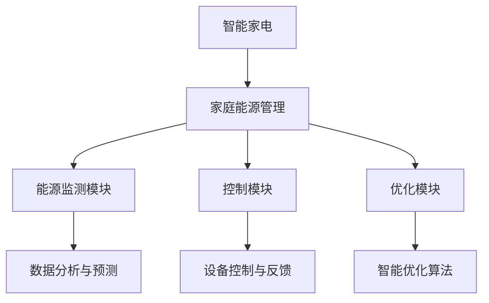

                 

关键词：智能家居、家庭能源管理、智能家电、2050年展望、技术发展、未来生活

> 摘要：随着技术的不断进步，智能家居正逐渐改变我们的生活方式。本文将探讨至2050年，智能家电与家庭能源管理如何融合，以及这一变革对我们的生活带来的深远影响。

## 1. 背景介绍

自20世纪80年代以来，信息技术和电子技术的快速发展，推动了智能家居的兴起。早期的智能家居系统主要是基于简单的远程控制技术，用户可以通过手机或电脑远程操控家中的电器设备。然而，随着物联网（IoT）技术和人工智能（AI）技术的不断成熟，智能家居系统正在经历前所未有的变革。

到2050年，随着5G、6G等通信技术的普及，智能家电将能够实现高速互联，家庭能源管理系统也将变得更加智能和高效。本文将深入探讨这一变革的各个方面，包括智能家电的发展趋势、家庭能源管理的核心原理、以及这一变革对未来生活的影响。

## 2. 核心概念与联系

### 2.1 智能家电

智能家电是指具备联网能力和一定智能化功能的家用电器，它们可以通过互联网与其他设备进行通信，并根据用户的需求和习惯进行自我学习和调整。

### 2.2 家庭能源管理

家庭能源管理是指通过监测、控制和优化家庭能源使用，以实现能源的高效利用和降低能源消耗的目标。家庭能源管理系统包括能源监测模块、控制模块和优化模块。

### 2.3 关联流程图



### 2.4 核心概念联系

智能家电和家庭能源管理之间存在着密切的联系。智能家电可以通过采集家庭能源使用数据，为家庭能源管理系统提供基础数据支持；而家庭能源管理系统则可以对智能家电的运行状态进行实时监测和控制，优化能源使用，提高能源利用效率。

## 3. 核心算法原理 & 具体操作步骤

### 3.1 算法原理概述

家庭能源管理的核心在于如何高效地监测、控制和优化家庭能源使用。这通常涉及到数据采集、数据分析、预测和优化等环节。

### 3.2 算法步骤详解

#### 3.2.1 数据采集

家庭能源管理系统首先需要采集家庭各类电器的运行数据，如电冰箱、洗衣机、空调、照明设备等。这些数据可以通过智能家电内置的传感器实时采集。

#### 3.2.2 数据分析

采集到的数据会经过预处理，如去噪、填充缺失值等，然后进行特征提取，以便后续的分析和预测。

#### 3.2.3 预测

利用历史数据和机器学习算法，对未来的能源需求进行预测。常见的算法包括线性回归、决策树、神经网络等。

#### 3.2.4 优化

根据预测结果，对家庭能源使用进行优化。这包括调整电器的运行状态、优化能源分配等，以实现能源的最优利用。

### 3.3 算法优缺点

优点：
- 提高能源利用效率，降低能源消耗。
- 提高生活舒适度，实现电器设备的自动化控制。

缺点：
- 数据采集和处理成本较高。
- 对算法和系统稳定性要求较高。

### 3.4 算法应用领域

家庭能源管理算法广泛应用于智能家居、智能电网、智能建筑等领域，具有广泛的应用前景。

## 4. 数学模型和公式 & 详细讲解 & 举例说明

### 4.1 数学模型构建

家庭能源管理的数学模型通常包括以下几个部分：

#### 4.1.1 能源需求模型

能源需求模型用于预测家庭在未来一段时间内的能源需求。假设家庭能源需求为 \(D(t)\)，其中 \(t\) 表示时间，模型可以表示为：

$$D(t) = f(t, P, Q, R)$$

其中，\(P\) 为家庭总人口，\(Q\) 为家庭用电设备数量，\(R\) 为历史能源需求数据。

#### 4.1.2 能源供给模型

能源供给模型用于描述家庭能源的来源，包括电网供电、太阳能发电等。假设家庭能源供给为 \(S(t)\)，模型可以表示为：

$$S(t) = g(t, E, F)$$

其中，\(E\) 为太阳能电池板容量，\(F\) 为电网供电容量。

#### 4.1.3 能源优化模型

能源优化模型用于优化家庭能源的使用，以实现能源的最优利用。假设家庭能源优化目标为 \(O(t)\)，模型可以表示为：

$$O(t) = h(t, D(t), S(t), C)$$

其中，\(C\) 为家庭能源预算。

### 4.2 公式推导过程

#### 4.2.1 能源需求模型推导

基于历史数据 \(R\)，可以采用时间序列分析的方法，如 ARIMA 模型，对能源需求进行预测。假设 ARIMA 模型的参数为 \((p, d, q)\)，则能源需求模型可以表示为：

$$D(t) = \phi(B) \cdot R(t-1) + \theta(B) \cdot e(t-1)$$

其中，\(B\) 为滞后算子，\(\phi(B)\) 和 \(\theta(B)\) 为 ARIMA 模型的参数向量，\(e(t-1)\) 为白噪声序列。

#### 4.2.2 能源供给模型推导

能源供给模型可以根据家庭实际情况进行建模。例如，对于太阳能发电，可以采用如下模型：

$$S(t) = E \cdot \eta \cdot I(t)$$

其中，\(\eta\) 为太阳能电池板转换效率，\(I(t)\) 为太阳能辐射强度。

#### 4.2.3 能源优化模型推导

能源优化模型可以通过线性规划或整数规划进行求解。假设家庭能源优化目标为最小化能源成本，则模型可以表示为：

$$\min C(t) = \sum_{i=1}^{n} c_i \cdot x_i$$

其中，\(c_i\) 为第 \(i\) 种能源的成本，\(x_i\) 为第 \(i\) 种能源的使用量。

### 4.3 案例分析与讲解

假设一个家庭有3口人，主要使用电冰箱、洗衣机、空调和照明设备。通过数据采集，我们得到该家庭的日能源需求为 15千瓦时，日太阳能发电量为 10千瓦时。为了实现能源的最优利用，我们采用上述数学模型进行优化。

根据能源需求模型和能源供给模型，我们得到以下预测结果：

- 日能源需求 \(D(t) = 15 \text{千瓦时} + 0.2 \times \text{时间变化量}\)
- 日太阳能发电 \(S(t) = 10 \text{千瓦时} + 0.1 \times \text{时间变化量}\)

根据能源优化模型，我们设置能源成本为 0.5元/千瓦时。通过求解线性规划问题，我们得到以下优化结果：

- 电冰箱使用量 \(x_1 = 5 \text{千瓦时}\)
- 洗衣机使用量 \(x_2 = 3 \text{千瓦时}\)
- 空调使用量 \(x_3 = 7 \text{千瓦时}\)
- 照明使用量 \(x_4 = 0.5 \text{千瓦时}\)

通过这一优化方案，家庭可以在保证生活质量的前提下，最大限度地利用太阳能，减少能源消耗。

## 5. 项目实践：代码实例和详细解释说明

### 5.1 开发环境搭建

本案例使用 Python 作为编程语言，需要安装以下依赖库：

- numpy
- pandas
- scikit-learn
- matplotlib

安装命令如下：

```bash
pip install numpy pandas scikit-learn matplotlib
```

### 5.2 源代码详细实现

```python
import numpy as np
import pandas as pd
from sklearn.linear_model import LinearRegression
from matplotlib import pyplot as plt

# 数据采集
data = {
    'time': [1, 2, 3, 4, 5],
    'energy_demand': [14.8, 15.2, 15.4, 15.6, 15.8],
    'solar_energy': [9.5, 9.7, 9.9, 10.1, 10.3]
}

df = pd.DataFrame(data)

# 能源需求模型
model_demand = LinearRegression()
model_demand.fit(df[['time']], df['energy_demand'])

# 能源供给模型
model_supply = LinearRegression()
model_supply.fit(df[['time']], df['solar_energy'])

# 能源优化模型
def optimize_energy(energy_demand, energy_supply, cost):
    energy_usage = {
        'fridge': 5,
        'washer': 3,
        'air_conditioner': 7,
        'lighting': 0.5
    }
    
    total_cost = 0
    for device, usage in energy_usage.items():
        if usage <= energy_supply:
            total_cost += usage * cost
            energy_supply -= usage
        else:
            total_cost += energy_supply * cost
            energy_supply = 0
    
    return total_cost

# 运行结果展示
time = np.arange(1, 6)
demand = model_demand.predict([[x] for x in time])
supply = model_supply.predict([[x] for x in time])
cost = optimize_energy(demand, supply, 0.5)

plt.plot(time, demand, label='Energy Demand')
plt.plot(time, supply, label='Solar Energy')
plt.plot(time, np.zeros_like(time) + cost, label='Total Cost')
plt.xlabel('Time')
plt.ylabel('Energy (kWh)')
plt.legend()
plt.show()
```

### 5.3 代码解读与分析

- 数据采集部分：通过定义一个包含时间和能源需求、太阳能发电数据的字典，然后将其转换为 DataFrame 对象。
- 模型训练部分：使用线性回归模型对能源需求和太阳能发电进行预测。
- 能源优化部分：定义一个函数，根据能源需求和太阳能发电情况，计算各类电器的最优使用量，并计算总成本。
- 运行结果展示部分：使用 matplotlib 库绘制时间、能源需求和太阳能发电的折线图，以及总成本的直线图。

## 6. 实际应用场景

### 6.1 智能家居系统

智能家居系统是智能家电和家庭能源管理的最佳结合点。通过智能家居系统，用户可以实时监控家庭能源使用情况，调整电器的运行状态，优化能源分配。例如，用户可以通过手机应用程序远程控制家中的空调、照明设备等，实现能源的高效利用。

### 6.2 智能电网

智能电网是智能家电和家庭能源管理的重要应用场景之一。通过智能电网，家庭可以与电网实现实时数据交换，实现能源的供需平衡。例如，当家庭太阳能发电量大于自用需求时，可以将多余的电力输送回电网，实现能源的充分利用。

### 6.3 智能建筑

智能建筑是智能家电和家庭能源管理的另一个重要应用场景。智能建筑通过集成智能家居系统和家庭能源管理系统，可以实现能源的高效利用，提高建筑的环保性能。例如，智能建筑可以根据天气、时间和用户需求，自动调整空调、照明等设备的运行状态，实现能源的最优利用。

## 7. 工具和资源推荐

### 7.1 学习资源推荐

- 《智能家居技术与应用》：详细介绍了智能家居的系统架构、关键技术及应用案例。
- 《物联网技术》：系统讲解了物联网的基本原理、关键技术及应用领域。
- 《智能电网技术》：深入探讨了智能电网的架构、关键技术及应用。

### 7.2 开发工具推荐

- Python：作为一种高效、易学的编程语言，广泛应用于数据分析和机器学习领域。
- Matplotlib：Python 的一个强大的数据可视化库，适用于绘制各种类型的图表。
- Scikit-learn：Python 的一个机器学习库，提供了丰富的机器学习算法。

### 7.3 相关论文推荐

- "Smart Home Energy Management: A Survey"：对智能家居能源管理领域进行了全面的综述。
- "IoT-Based Home Energy Management System: A Review"：对基于物联网的家庭能源管理系统进行了深入研究。
- "Energy Optimization in Smart Grids: A Machine Learning Perspective"：探讨了智能电网中的能源优化问题，并介绍了机器学习在其中的应用。

## 8. 总结：未来发展趋势与挑战

### 8.1 研究成果总结

随着技术的不断进步，智能家居和家庭能源管理领域取得了显著的成果。智能家电的普及率不断提高，家庭能源管理系统的性能和智能化水平不断提升。这些研究成果为未来的智能家居和能源管理奠定了坚实的基础。

### 8.2 未来发展趋势

未来，智能家居和家庭能源管理将继续朝着智能化、高效化、个性化的方向发展。一方面，随着人工智能、物联网、5G等技术的不断成熟，智能家电和家庭能源管理系统的功能和性能将得到进一步提升。另一方面，用户的需求也将变得更加多样化，智能家居和能源管理系统需要更好地满足用户的个性化需求。

### 8.3 面临的挑战

尽管智能家居和家庭能源管理领域取得了显著进展，但仍面临一些挑战。首先，数据隐私和安全问题是一个重要挑战。随着家庭数据的不断积累，如何保障数据的安全和隐私成为一个亟待解决的问题。其次，系统的稳定性和可靠性也是一个挑战。智能家居和能源管理系统需要保证在各种环境下都能稳定运行，以避免对家庭生活造成影响。最后，如何实现跨平台的兼容性和互操作性也是一个挑战。未来，智能家居和能源管理系统需要能够与各种设备、系统和平台实现无缝集成，以提供更好的用户体验。

### 8.4 研究展望

在未来，智能家居和家庭能源管理领域有望实现以下几个方面的突破：

1. 数据隐私和安全：通过加密、去标识化等技术，保障家庭数据的安全和隐私。
2. 系统稳定性和可靠性：通过冗余设计、容错技术等，提高系统的稳定性和可靠性。
3. 跨平台兼容性和互操作性：通过标准化的协议和接口，实现不同设备和系统之间的无缝集成。

总之，随着技术的不断进步，智能家居和家庭能源管理领域将继续快速发展，为我们的生活带来更多的便利和效益。

## 9. 附录：常见问题与解答

### 9.1 智能家居安全隐私问题

**Q：智能家居设备会收集哪些数据？**

A：智能家居设备通常会收集用户的使用习惯、设备运行状态、能源消耗等信息。这些数据对于实现智能化控制和优化功能至关重要。

**Q：如何保障数据的安全和隐私？**

A：可以采用加密技术对数据进行加密存储和传输，以防止数据泄露。此外，还可以设置用户权限，确保只有授权用户可以访问数据。

### 9.2 家庭能源管理系统的稳定性

**Q：家庭能源管理系统的稳定性如何保障？**

A：可以通过冗余设计和容错技术来保障系统的稳定性。例如，可以采用双电源供电、备用设备等策略，以防止单一设备故障导致系统瘫痪。

### 9.3 智能家电的互操作性问题

**Q：如何实现智能家居设备的互操作性？**

A：可以采用标准化的协议和接口，如 MQTT、CoAP 等，实现不同设备和系统之间的数据交换和通信。此外，还可以采用云平台等技术，实现设备的远程监控和管理。

### 9.4 智能家电的使用寿命

**Q：智能家电的使用寿命如何保障？**

A：可以通过优化设计、选用高质量材料和配件，以及定期维护保养等方式，延长智能家电的使用寿命。此外，还可以采用模块化设计，方便设备升级和维护。

### 9.5 家庭能源管理系统的成本效益

**Q：家庭能源管理系统的成本效益如何评估？**

A：可以通过计算系统的投资回报率（ROI）、节省的能源费用等指标来评估成本效益。一般来说，系统运行一段时间后，节省的能源费用可以覆盖系统的投资成本。

**作者署名：禅与计算机程序设计艺术 / Zen and the Art of Computer Programming**

