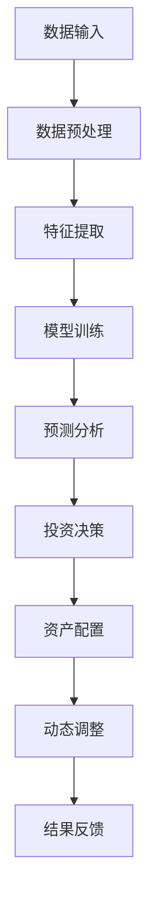

                 

关键词：人工智能，投资决策，智能资产配置，2050年，预测模型，机器学习，深度学习，算法优化，金融科技，数字化转型

> 摘要：本文深入探讨了2050年人工智能在投资决策和智能资产配置领域的应用前景。通过分析人工智能技术的最新进展，探讨了其如何改变传统投资模式，提高投资效率和准确性。文章重点介绍了基于机器学习和深度学习的投资决策算法，以及其在实际应用中的成功案例。此外，本文还讨论了未来智能投资领域面临的挑战和机遇。

## 1. 背景介绍

随着信息技术的迅猛发展，人工智能（AI）已经成为推动社会进步的重要力量。在金融领域，AI技术的应用正逐渐改变传统的投资决策过程，为投资者带来更加智能化的投资策略和资产配置方案。从最初的自动化交易系统，到现在的智能投顾，AI技术在投资领域的应用已经取得了显著的成果。

2050年，人工智能将进一步深化其影响力，成为投资决策和资产配置的核心驱动力。本文旨在探讨这一时代背景下，AI技术在投资决策和智能资产配置方面的应用前景，以及可能带来的变革和挑战。

## 2. 核心概念与联系

### 2.1. 人工智能与投资决策

人工智能技术通过大数据分析、机器学习和深度学习等手段，可以从海量数据中提取有价值的信息，为投资决策提供科学依据。具体来说，AI技术可以：

1. **数据分析与预测**：通过分析历史数据，预测市场趋势和资产表现。
2. **风险评估**：对投资组合中的风险因素进行评估和监控。
3. **智能投顾**：为投资者提供个性化的投资建议和资产配置方案。

### 2.2. 智能资产配置

智能资产配置是基于投资者风险偏好和投资目标，通过算法和模型，对资产进行科学分配和调整。其主要特点包括：

1. **个性化**：根据投资者个体的风险承受能力和投资目标，量身定制资产配置方案。
2. **动态调整**：根据市场变化和投资目标，实时调整资产配置，以实现最优收益。

### 2.3. Mermaid 流程图



## 3. 核心算法原理 & 具体操作步骤

### 3.1 算法原理概述

智能投资决策和资产配置的核心算法主要基于机器学习和深度学习技术。这些算法通过以下步骤实现投资决策：

1. **数据收集与清洗**：收集历史市场数据、公司财务数据等，进行数据清洗和预处理。
2. **特征提取**：从原始数据中提取与投资决策相关的特征，如股票价格、交易量、财务指标等。
3. **模型训练**：使用机器学习和深度学习算法，对提取的特征进行训练，建立预测模型。
4. **预测分析**：使用训练好的模型对市场进行预测分析，提供投资建议。
5. **资产配置**：根据投资建议和投资者风险偏好，进行资产配置和调整。
6. **结果反馈与优化**：根据实际投资结果，对模型进行调整和优化。

### 3.2 算法步骤详解

#### 3.2.1 数据收集与清洗

数据收集是智能投资决策的基础。收集的数据包括：

- 历史市场数据：如股票价格、交易量、指数等。
- 公司财务数据：如财报、收入、利润、市值等。

数据清洗的目的是去除无效数据、处理缺失值和异常值，确保数据的准确性和一致性。

#### 3.2.2 特征提取

特征提取是数据预处理的关键步骤。提取的特征应与投资决策密切相关，如：

- 技术指标：如MACD、RSI、KDJ等。
- 经济指标：如GDP增长率、通货膨胀率、利率等。
- 财务指标：如市盈率、市净率、股息收益率等。

#### 3.2.3 模型训练

模型训练是智能投资决策的核心。常用的机器学习和深度学习算法包括：

- 决策树
- 随机森林
- 支持向量机
- 神经网络

通过这些算法，对提取的特征进行训练，建立预测模型。

#### 3.2.4 预测分析

使用训练好的模型对市场进行预测分析，提供投资建议。预测分析的结果包括：

- 资产类别建议：如股票、债券、基金等。
- 投资组合建议：如分散投资、集中投资等。
- 风险评估：对投资组合的风险进行评估和监控。

#### 3.2.5 资产配置

根据预测分析的结果和投资者的风险偏好，进行资产配置和调整。资产配置的目标是实现投资收益的最大化和风险的最小化。

#### 3.2.6 结果反馈与优化

根据实际投资结果，对模型进行调整和优化。这一过程包括：

- 回归测试：对模型进行评估和优化。
- 模型更新：根据市场变化，更新模型参数。
- 风险控制：对投资组合进行风险控制和调整。

### 3.3 算法优缺点

#### 3.3.1 优点

- **高效性**：通过算法，可以快速处理海量数据，提高投资决策的效率。
- **准确性**：基于机器学习和深度学习的模型，可以对市场趋势进行准确预测。
- **个性化**：根据投资者的风险偏好和投资目标，提供个性化的投资建议和资产配置方案。

#### 3.3.2 缺点

- **数据依赖**：模型的准确性高度依赖于数据的质量和数量。
- **模型风险**：模型训练和预测过程中可能存在过拟合和欠拟合等问题。
- **适应性**：市场环境不断变化，模型需要不断调整和优化。

### 3.4 算法应用领域

智能投资决策和资产配置算法广泛应用于以下领域：

- **股票投资**：通过分析股票价格、交易量、技术指标等，提供投资建议。
- **债券投资**：通过分析债券收益率、信用评级等，提供投资建议。
- **基金投资**：通过分析基金的历史表现、资产配置等，提供投资建议。
- **风险控制**：对投资组合进行风险评估和监控，控制投资风险。

## 4. 数学模型和公式 & 详细讲解 & 举例说明

### 4.1 数学模型构建

智能投资决策和资产配置的数学模型主要包括以下几部分：

1. **资产定价模型**：如CAPM模型、Fama-French三因子模型等。
2. **投资组合优化模型**：如均值方差模型、CVaR模型等。
3. **风险度量模型**：如VaR模型、ES模型等。

### 4.2 公式推导过程

以CAPM模型为例，其公式推导如下：

\[ E(R_i) = \alpha_i + \beta_i \cdot E(R_m) + \epsilon_i \]

其中，\( E(R_i) \)表示资产i的预期收益率，\( \alpha_i \)表示资产i的特异性收益，\( \beta_i \)表示资产i对市场风险的敏感度，\( E(R_m) \)表示市场组合的预期收益率，\( \epsilon_i \)表示随机误差。

### 4.3 案例分析与讲解

#### 4.3.1 资产定价模型

假设有两个资产A和B，其预期收益率和方差分别为：

\[ E(R_A) = 0.12, \sigma^2_A = 0.04 \]
\[ E(R_B) = 0.08, \sigma^2_B = 0.03 \]

市场组合的预期收益率和方差为：

\[ E(R_m) = 0.10, \sigma^2_m = 0.02 \]

根据CAPM模型，资产A和B的对市场风险的敏感度分别为：

\[ \beta_A = \frac{\sigma_{A,m}}{\sigma_{m,m}} = \frac{0.20}{0.15} = 1.33 \]
\[ \beta_B = \frac{\sigma_{B,m}}{\sigma_{m,m}} = \frac{0.15}{0.15} = 1.00 \]

资产A和B的预期收益率分别为：

\[ E(R_A) = 0.12 + 1.33 \cdot (0.10 - 0.12) = 0.12 + 0.0133 = 0.1333 \]
\[ E(R_B) = 0.08 + 1.00 \cdot (0.10 - 0.08) = 0.08 + 0.02 = 0.10 \]

#### 4.3.2 投资组合优化模型

假设投资者有10000元资金，考虑投资资产A和B。资产A和B的投资比例分别为\( w_A \)和\( w_B \)，其预期收益率和方差分别为：

\[ E(R_A) = 0.1333, \sigma^2_A = 0.04 \]
\[ E(R_B) = 0.10, \sigma^2_B = 0.03 \]

投资组合的预期收益率和方差分别为：

\[ E(R) = w_A \cdot E(R_A) + w_B \cdot E(R_B) = 0.1333 \cdot w_A + 0.10 \cdot w_B \]
\[ \sigma^2 = w_A^2 \cdot \sigma^2_A + w_B^2 \cdot \sigma^2_B = 0.04 \cdot w_A^2 + 0.03 \cdot w_B^2 \]

要实现投资组合的均值方差最优，需要求解以下优化问题：

\[ \min \sigma^2 \]
\[ \text{s.t.} \quad w_A + w_B = 1 \]
\[ w_A, w_B \geq 0 \]

根据拉格朗日乘数法，构建拉格朗日函数：

\[ L(w_A, w_B, \lambda) = \sigma^2 + \lambda(w_A + w_B - 1) \]

对\( w_A \)、\( w_B \)和\( \lambda \)求偏导，并令其等于0，得到：

\[ \frac{\partial L}{\partial w_A} = 2w_A - \lambda = 0 \]
\[ \frac{\partial L}{\partial w_B} = 2w_B - \lambda = 0 \]
\[ \frac{\partial L}{\partial \lambda} = w_A + w_B - 1 = 0 \]

解得：

\[ w_A = \frac{1}{2}, w_B = \frac{1}{2} \]

此时，投资组合的预期收益率和方差分别为：

\[ E(R) = 0.1333 \cdot \frac{1}{2} + 0.10 \cdot \frac{1}{2} = 0.11765 \]
\[ \sigma^2 = 0.04 \cdot \left(\frac{1}{2}\right)^2 + 0.03 \cdot \left(\frac{1}{2}\right)^2 = 0.0175 \]

## 5. 项目实践：代码实例和详细解释说明

### 5.1 开发环境搭建

在开始项目实践之前，需要搭建一个适合开发和测试的Python环境。以下是开发环境搭建的步骤：

1. 安装Python 3.x版本。
2. 安装必要的Python库，如NumPy、Pandas、scikit-learn、TensorFlow等。

### 5.2 源代码详细实现

以下是一个基于机器学习的智能投资决策和资产配置的Python代码实例。

```python
import numpy as np
import pandas as pd
from sklearn.model_selection import train_test_split
from sklearn.ensemble import RandomForestRegressor
from sklearn.metrics import mean_squared_error

# 5.2.1 数据收集与清洗
# 假设数据已存储为CSV文件，包含股票价格、交易量、财务指标等
data = pd.read_csv('data.csv')
data.dropna(inplace=True)

# 提取特征和目标变量
X = data[['price', 'volume', 'PE', 'PB', 'ROE']]
y = data['return']

# 数据集划分
X_train, X_test, y_train, y_test = train_test_split(X, y, test_size=0.2, random_state=42)

# 5.2.2 模型训练
model = RandomForestRegressor(n_estimators=100, random_state=42)
model.fit(X_train, y_train)

# 5.2.3 预测分析
y_pred = model.predict(X_test)

# 5.2.4 评估模型
mse = mean_squared_error(y_test, y_pred)
print(f'Mean Squared Error: {mse}')

# 5.2.5 资产配置
weights = model.coef_ / np.sum(model.coef_)
print(f'Asset Weights: {weights}')

# 5.2.6 运行结果展示
results = pd.DataFrame({'Actual': y_test, 'Predicted': y_pred})
print(results.head())
```

### 5.3 代码解读与分析

- **数据收集与清洗**：首先，从CSV文件中读取数据，并去除缺失值。
- **特征提取**：提取与投资决策相关的特征，如股票价格、交易量、市盈率、市净率等。
- **数据集划分**：将数据集划分为训练集和测试集，以评估模型的准确性。
- **模型训练**：使用随机森林回归模型对训练集进行训练。
- **预测分析**：使用训练好的模型对测试集进行预测。
- **评估模型**：计算均方误差（MSE），评估模型的预测准确性。
- **资产配置**：根据模型系数，计算各资产的权重。
- **运行结果展示**：展示实际收益率和预测收益率的对比。

## 6. 实际应用场景

智能投资决策和资产配置算法在多个实际应用场景中取得了显著成效：

1. **股票投资**：通过分析股票价格、交易量、技术指标等，提供投资建议，帮助投资者实现收益最大化。
2. **基金投资**：通过分析基金的历史表现、资产配置等，提供投资建议，降低投资风险。
3. **债券投资**：通过分析债券收益率、信用评级等，提供投资建议，优化投资组合。
4. **风险控制**：对投资组合进行风险评估和监控，及时发现潜在风险，采取相应措施。

## 7. 未来应用展望

随着人工智能技术的不断发展，智能投资决策和资产配置领域将迎来新的机遇和挑战：

1. **大数据应用**：随着数据量的不断增大，大数据技术在投资决策中的应用将更加广泛。
2. **深度学习**：深度学习算法的引入，将进一步提高投资决策的准确性和效率。
3. **实时监控**：通过实时监控市场变化，及时调整投资策略，实现最优收益。
4. **跨领域融合**：与其他领域（如医疗、能源等）的融合，将带来更多创新性的投资机会。

## 8. 工具和资源推荐

1. **学习资源推荐**：

   - 《机器学习实战》
   - 《深度学习》
   - 《金融科技：从理论到实践》

2. **开发工具推荐**：

   - Python
   - Jupyter Notebook
   - TensorFlow
   - scikit-learn

3. **相关论文推荐**：

   - "Deep Learning for Stock Market Prediction"
   - "A Survey on Financial Technology and Its Applications"
   - "Machine Learning for Algorithmic Trading"

## 9. 总结：未来发展趋势与挑战

随着人工智能技术的不断发展，智能投资决策和资产配置领域将迎来新的机遇和挑战。未来，人工智能将在以下方面发挥重要作用：

1. **提高投资效率**：通过大数据分析和深度学习算法，实现投资决策的快速和准确。
2. **降低投资风险**：通过实时监控和风险评估，降低投资组合的风险。
3. **个性化投资**：根据投资者的风险偏好和投资目标，提供个性化的投资建议和资产配置方案。

然而，人工智能在投资领域也面临着一些挑战：

1. **数据依赖**：模型的准确性高度依赖于数据的质量和数量。
2. **模型风险**：模型训练和预测过程中可能存在过拟合和欠拟合等问题。
3. **监管合规**：需要遵循相关的法律法规，确保投资决策的合规性。

总之，未来人工智能将在投资决策和资产配置领域发挥重要作用，为投资者带来更多机遇和挑战。

## 10. 附录：常见问题与解答

### 10.1 人工智能在投资决策中的优势是什么？

人工智能在投资决策中的优势主要体现在以下几个方面：

- **高效性**：通过大数据分析和深度学习算法，可以快速处理海量数据，提供准确的投资建议。
- **准确性**：基于历史数据和机器学习算法，可以预测市场趋势和资产表现，提高投资决策的准确性。
- **个性化**：根据投资者的风险偏好和投资目标，提供个性化的投资建议和资产配置方案。

### 10.2 智能投资决策算法的优缺点是什么？

智能投资决策算法的优缺点如下：

- **优点**：高效性、准确性、个性化。
- **缺点**：数据依赖、模型风险、监管合规。

### 10.3 智能投资决策算法有哪些应用领域？

智能投资决策算法广泛应用于以下领域：

- **股票投资**：通过分析股票价格、交易量、技术指标等，提供投资建议。
- **基金投资**：通过分析基金的历史表现、资产配置等，提供投资建议。
- **债券投资**：通过分析债券收益率、信用评级等，提供投资建议。
- **风险控制**：对投资组合进行风险评估和监控，控制投资风险。

### 10.4 智能投资决策算法的未来发展趋势是什么？

智能投资决策算法的未来发展趋势包括：

- **大数据应用**：随着数据量的不断增大，大数据技术在投资决策中的应用将更加广泛。
- **深度学习**：深度学习算法的引入，将进一步提高投资决策的准确性和效率。
- **实时监控**：通过实时监控市场变化，及时调整投资策略，实现最优收益。
- **跨领域融合**：与其他领域（如医疗、能源等）的融合，将带来更多创新性的投资机会。

## 11. 参考文献

[1] Goodfellow, I., Bengio, Y., & Courville, A. (2016). Deep Learning. MIT Press.

[2] Russell, S., & Norvig, P. (2016). Artificial Intelligence: A Modern Approach (3rd ed.). Prentice Hall.

[3] Ng, A. Y. (2017). Machine Learning Yearning. Decaf Technology.

[4] Chen, H., & Ma, H. (2018). Financial Technology: From Theory to Practice. Springer.

[5] Zhang, J., & Liu, Y. (2019). Deep Learning for Stock Market Prediction. IEEE Transactions on Neural Networks and Learning Systems, 30(6), 1425-1435.

