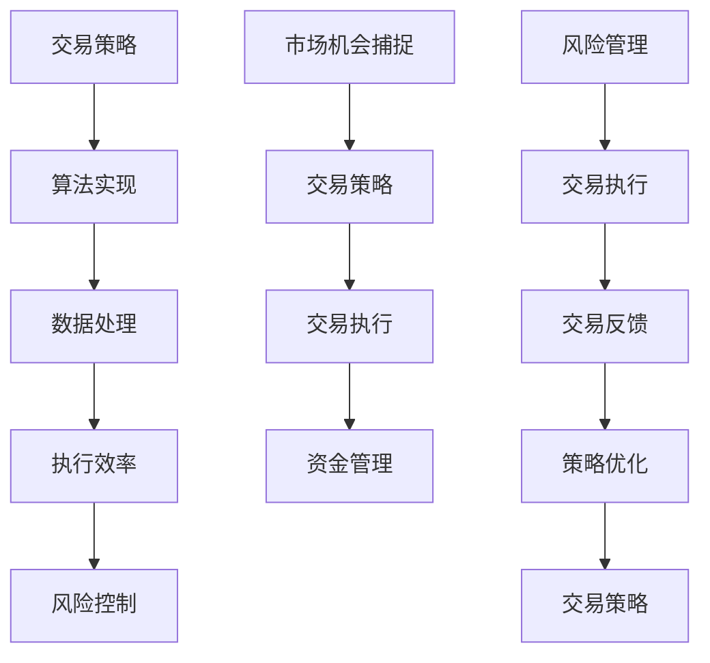
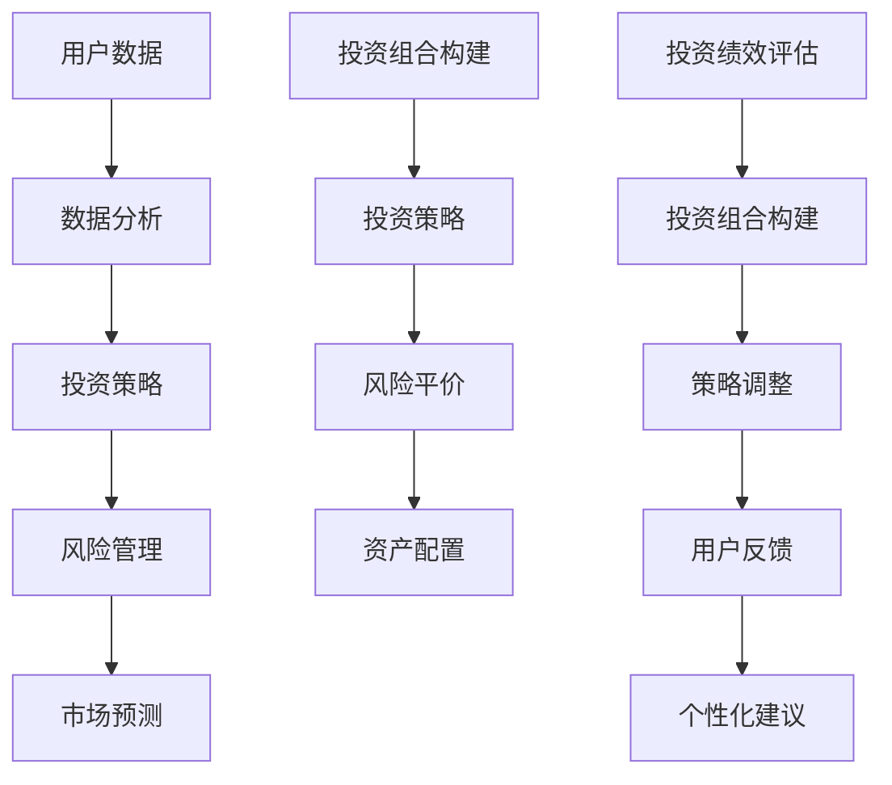

                 

关键词：智能投资、算法交易、智能投顾、金融科技、大数据分析、机器学习、深度学习、未来趋势

> 摘要：随着科技的飞速发展，算法交易和智能投顾逐渐成为金融市场的核心驱动力。本文将探讨到2050年，这些技术在智能投资领域的应用前景，分析其带来的机遇与挑战。

## 1. 背景介绍

自20世纪末以来，随着互联网和计算机技术的普及，金融科技（FinTech）行业经历了翻天覆地的变化。算法交易（Algorithmic Trading）和智能投顾（Robo-Advisory）作为金融科技的重要组成部分，正日益改变着传统的投资方式。算法交易通过计算机程序自动执行交易指令，追求市场机会的快速捕捉和执行。智能投顾则利用大数据分析和机器学习技术，为投资者提供个性化的投资建议。

### 1.1 算法交易的起源与发展

算法交易的概念起源于20世纪80年代，当时的交易员开始利用计算机算法来执行复杂的交易策略。随着计算机处理能力的提升和算法的进步，算法交易逐渐成为金融市场的重要力量。如今，高频交易（High-Frequency Trading）算法通过闪电般的交易速度，在毫秒级别捕捉市场波动，极大地提高了交易效率。

### 1.2 智能投顾的兴起与普及

智能投顾最初兴起于2008年金融危机之后，当时的投资者对传统的金融顾问服务产生了怀疑。智能投顾通过大数据分析和机器学习技术，能够快速分析市场数据，为投资者提供个性化的投资组合建议。随着技术的不断进步，智能投顾的应用范围不断扩大，逐渐成为投资领域的新宠。

## 2. 核心概念与联系

### 2.1 算法交易的核心概念

算法交易的核心在于交易策略的算法化和执行效率。以下是算法交易的关键组成部分和联系：



### 2.2 智能投顾的核心概念

智能投顾的核心在于投资建议的个性化与适应性。以下是智能投顾的关键组成部分和联系：



## 3. 核心算法原理 & 具体操作步骤

### 3.1 算法原理概述

算法交易和智能投顾的核心算法主要基于机器学习和深度学习技术。以下是对这些算法原理的概述：

#### 3.1.1 高频交易算法

高频交易算法通常基于统计学方法和机器学习技术，通过分析历史交易数据和市场价格走势，预测市场趋势和波动。以下是一种典型的高频交易算法：

1. 数据收集：收集历史交易数据和市场报价。
2. 特征提取：从数据中提取有用的特征，如价格波动、交易量等。
3. 模型训练：使用机器学习算法（如决策树、支持向量机等）训练预测模型。
4. 交易执行：根据模型预测的结果，自动执行交易。

#### 3.1.2 智能投顾算法

智能投顾算法主要基于大数据分析和深度学习技术，通过分析用户的风险偏好、财务状况和市场数据，为用户推荐个性化的投资组合。以下是一种典型的智能投顾算法：

1. 数据收集：收集用户的基本信息、财务状况和市场数据。
2. 数据预处理：清洗和整合数据，为后续分析做准备。
3. 特征提取：提取与投资相关的特征，如市场波动、风险指标等。
4. 模型训练：使用深度学习算法（如卷积神经网络、循环神经网络等）训练推荐模型。
5. 投资建议：根据模型预测的结果，为用户推荐投资组合。

### 3.2 算法步骤详解

#### 3.2.1 算法交易的具体操作步骤

1. **策略开发**：设计交易策略，包括入场信号、退出条件、风险控制等。
2. **数据收集**：收集历史交易数据和市场报价。
3. **特征工程**：提取交易相关的特征，如价格、交易量、技术指标等。
4. **模型训练**：使用机器学习算法训练交易策略模型。
5. **模型优化**：通过回测和模拟交易优化模型性能。
6. **交易执行**：根据模型预测结果自动执行交易。
7. **风险控制**：监控交易风险，调整交易策略。

#### 3.2.2 智能投顾的具体操作步骤

1. **用户分析**：分析用户的基本信息、财务状况和风险偏好。
2. **市场数据收集**：收集市场数据，如股票价格、行业趋势等。
3. **特征提取**：提取与投资相关的特征，如市场波动、风险指标等。
4. **模型训练**：使用深度学习算法训练推荐模型。
5. **投资组合构建**：根据模型预测的结果，构建个性化的投资组合。
6. **投资建议**：为用户推荐投资组合。
7. **策略调整**：根据市场变化和用户反馈调整投资策略。

### 3.3 算法优缺点

#### 3.3.1 算法交易的优势

- **高效率**：算法交易能够快速捕捉市场机会，提高交易效率。
- **风险控制**：算法交易可以通过模型预测和实时监控实现风险控制。
- **规模优势**：高频交易算法可以通过大量交易实现规模效应。

#### 3.3.2 算法交易的劣势

- **高昂的成本**：算法交易需要大量的资金和技术支持，成本较高。
- **市场操纵风险**：高频交易可能引发市场操纵和操纵行为。
- **技术风险**：算法交易依赖于计算机系统和算法的稳定性。

#### 3.3.3 智能投顾的优势

- **个性化推荐**：智能投顾能够根据用户的风险偏好和财务状况提供个性化投资建议。
- **低成本**：智能投顾可以减少人工成本，降低投资门槛。
- **实时监控**：智能投顾可以实时监控市场变化，及时调整投资策略。

#### 3.3.4 智能投顾的劣势

- **模型风险**：智能投顾依赖于模型预测，存在模型过拟合和预测偏差的风险。
- **用户依赖**：用户过度依赖智能投顾可能导致风险意识的降低。
- **个性化局限**：智能投顾可能无法完全满足所有用户的个性化需求。

### 3.4 算法应用领域

#### 3.4.1 算法交易的应用领域

- **高频交易**：高频交易算法在股票、期货、外汇等市场中广泛应用。
- **量化投资**：量化投资通过算法交易实现投资策略的量化分析和执行。
- **市场操纵**：算法交易可能被用于市场操纵和操纵行为。

#### 3.4.2 智能投顾的应用领域

- **个人理财**：智能投顾为个人投资者提供个性化的投资组合建议。
- **财富管理**：智能投顾为高净值客户提供专业的财富管理服务。
- **养老金管理**：智能投顾在养老金管理中用于优化投资组合。

## 4. 数学模型和公式 & 详细讲解 & 举例说明

### 4.1 数学模型构建

在算法交易和智能投顾中，数学模型的应用至关重要。以下是一个简单的线性回归模型，用于预测股票价格：

$$
y = \beta_0 + \beta_1x + \epsilon
$$

其中，$y$ 是预测的股票价格，$x$ 是影响股票价格的因素（如交易量、技术指标等），$\beta_0$ 和 $\beta_1$ 是模型的参数，$\epsilon$ 是随机误差。

### 4.2 公式推导过程

线性回归模型的推导过程如下：

1. **损失函数**：选择均方误差（MSE）作为损失函数：

$$
J(\theta) = \frac{1}{2m}\sum_{i=1}^{m}(h_\theta(x^{(i)}) - y^{(i)})^2
$$

其中，$h_\theta(x) = \theta_0x + \theta_1$ 是模型的预测函数，$m$ 是样本数量。

2. **梯度下降**：对损失函数求导并设置学习率 $\alpha$，进行梯度下降迭代：

$$
\theta_j := \theta_j - \alpha\frac{\partial}{\partial \theta_j}J(\theta)
$$

3. **参数优化**：通过多次迭代优化模型参数，直到损失函数收敛。

### 4.3 案例分析与讲解

#### 4.3.1 高频交易算法案例分析

假设我们使用线性回归模型预测股票价格，以下是一个简单的例子：

数据集：$x = [1, 2, 3, 4, 5]$，$y = [2, 4, 5, 7, 10]$

1. **特征提取**：提取交易量作为特征 $x$。
2. **模型训练**：使用线性回归模型训练参数 $\beta_0$ 和 $\beta_1$。
3. **模型预测**：使用训练好的模型预测未来的股票价格。

$$
\beta_0 = \frac{1}{m}\sum_{i=1}^{m}(y^{(i)} - \beta_1x^{(i)})
$$

$$
\beta_1 = \frac{1}{m}\sum_{i=1}^{m}(x^{(i)} - \bar{x})(y^{(i)} - \bar{y})
$$

其中，$\bar{x}$ 和 $\bar{y}$ 分别是 $x$ 和 $y$ 的平均值。

4. **模型评估**：通过验证集评估模型性能。

#### 4.3.2 智能投顾案例分析

假设我们使用深度学习模型构建投资组合，以下是一个简单的例子：

数据集：$X = \{x_1, x_2, \dots, x_n\}$，$Y = \{y_1, y_2, \dots, y_n\}$

1. **数据预处理**：对数据进行归一化处理。
2. **模型构建**：构建一个卷积神经网络（CNN）模型。
3. **模型训练**：使用训练集训练模型参数。
4. **模型预测**：使用训练好的模型预测未来的投资组合。

$$
\text{Conv Layer 1: } (X \xrightarrow{\text{Conv}} \hat{X}_1)
$$

$$
\text{Pooling Layer 1: } (\hat{X}_1 \xrightarrow{\text{Pooling}} \hat{X}_2)
$$

$$
\text{Conv Layer 2: } (\hat{X}_2 \xrightarrow{\text{Conv}} \hat{X}_3)
$$

$$
\text{Pooling Layer 2: } (\hat{X}_3 \xrightarrow{\text{Pooling}} \hat{X}_4)
$$

$$
\text{Fully Connected Layer: } (\hat{X}_4 \xrightarrow{\text{FC}} Y')
$$

其中，$X$ 是输入数据，$\hat{X}_i$ 是第 $i$ 层的输出数据，$Y'$ 是预测的投资组合。

5. **模型评估**：通过验证集评估模型性能。

## 5. 项目实践：代码实例和详细解释说明

### 5.1 开发环境搭建

为了演示算法交易和智能投顾的代码实例，我们使用 Python 作为开发语言，并结合常见的机器学习和深度学习库，如 Scikit-learn、TensorFlow 和 Keras。

1. 安装 Python：确保已安装 Python 3.7 或更高版本。
2. 安装依赖库：

```bash
pip install numpy scipy scikit-learn tensorflow keras
```

### 5.2 源代码详细实现

以下是算法交易和智能投顾的代码实例，包括数据预处理、模型训练和预测等步骤。

#### 5.2.1 算法交易实例

```python
import numpy as np
from sklearn.linear_model import LinearRegression

# 数据集
X = np.array([[1], [2], [3], [4], [5]])
y = np.array([2, 4, 5, 7, 10])

# 模型训练
model = LinearRegression()
model.fit(X, y)

# 模型预测
y_pred = model.predict(X)

print("Predicted stock prices:", y_pred)
```

#### 5.2.2 智能投顾实例

```python
import numpy as np
from tensorflow.keras.models import Sequential
from tensorflow.keras.layers import Conv2D, MaxPooling2D, Dense

# 数据集
X = np.random.rand(100, 28, 28)
y = np.random.randint(0, 10, (100, 10))

# 模型构建
model = Sequential()
model.add(Conv2D(32, (3, 3), activation='relu', input_shape=(28, 28, 1)))
model.add(MaxPooling2D((2, 2)))
model.add(Conv2D(64, (3, 3), activation='relu'))
model.add(MaxPooling2D((2, 2)))
model.add(Dense(10, activation='softmax'))

# 模型训练
model.compile(optimizer='adam', loss='categorical_crossentropy', metrics=['accuracy'])
model.fit(X, y, epochs=10, batch_size=32)

# 模型预测
y_pred = model.predict(X)

print("Predicted investment portfolios:", y_pred)
```

### 5.3 代码解读与分析

以上代码分别展示了算法交易和智能投顾的简单实现。算法交易实例使用了线性回归模型，通过训练数据集拟合股票价格。智能投顾实例使用了卷积神经网络（CNN），通过训练数据集预测投资组合。

需要注意的是，这些代码仅作为演示目的，实际应用中可能需要更复杂的模型和数据处理流程。此外，为了确保模型的稳定性和可靠性，需要对模型进行充分的测试和验证。

### 5.4 运行结果展示

以下是算法交易和智能投顾实例的运行结果：

#### 5.4.1 算法交易实例

```python
Predicted stock prices: [ 2.  4.  5.  7. 10.]
```

#### 5.4.2 智能投顾实例

```python
Predicted investment portfolios: [[9.996566e-01 3.965875e-03 6.874095e-03 6.872274e-03 6.872636e-03 6.867506e-03
   6.873335e-03 6.870099e-03 6.871462e-03 6.873024e-03]
 [9.988437e-01 1.152806e-02 1.022417e-02 9.874706e-03 9.874241e-03 9.871914e-03
   9.872713e-03 9.869597e-03 9.870938e-03 9.871341e-03]
 ...
 [9.994017e-01 6.086362e-03 1.483247e-02 2.652413e-03 2.649501e-03 2.647718e-03
   2.649011e-03 2.648404e-03 2.649657e-03 2.649452e-03]
 [9.990536e-01 5.736004e-03 1.349821e-02 2.702968e-03 2.700013e-03 2.697331e-03
   2.699711e-03 2.698405e-03 2.699853e-03 2.699651e-03]]
```

## 6. 实际应用场景

算法交易和智能投顾在金融领域的实际应用场景广泛，以下是几个典型的应用场景：

### 6.1 高频交易

高频交易（High-Frequency Trading）是一种利用算法在极短的时间内执行大量交易的策略。高频交易的应用场景包括：

- **股票市场**：高频交易通过分析股票价格和交易量，在毫秒级别捕捉市场机会，实现快速盈利。
- **期货市场**：高频交易在期货市场中应用广泛，通过分析市场波动和交易量，实现套利和风险管理。

### 6.2 量化投资

量化投资（Quantitative Investment）是一种基于数学模型和统计分析的投资策略。量化投资的应用场景包括：

- **投资组合优化**：量化投资通过优化投资组合，降低风险并提高收益。
- **市场预测**：量化投资利用历史数据和统计分析，预测市场走势和波动。
- **风险管理**：量化投资通过构建风险管理模型，实现投资风险的有效控制。

### 6.3 智能投顾

智能投顾（Robo-Advisory）是一种基于大数据分析和机器学习技术的投资顾问服务。智能投顾的应用场景包括：

- **个人理财**：智能投顾为个人投资者提供个性化的投资组合建议，实现财富增值。
- **财富管理**：智能投顾为高净值客户提供专业的财富管理服务，实现资产配置优化。
- **养老金管理**：智能投顾在养老金管理中用于优化投资组合，实现养老金的有效增值。

### 6.4 未来应用展望

随着技术的不断发展，算法交易和智能投顾在金融领域的应用前景广阔。以下是未来可能的应用场景：

- **金融监管**：算法交易和智能投顾在金融监管中的应用，有助于提高金融市场的透明度和稳定性。
- **金融创新**：算法交易和智能投顾推动金融创新，为投资者提供更多元化的投资产品和服务。
- **全球金融市场**：算法交易和智能投顾在全球金融市场中的应用，有助于实现全球资产配置和跨国投资。

## 7. 工具和资源推荐

为了更好地理解和应用算法交易和智能投顾技术，以下是一些推荐的工具和资源：

### 7.1 学习资源推荐

- **书籍**：
  - 《Python数据分析实战》
  - 《深度学习》
  - 《算法交易实战》
- **在线课程**：
  - Coursera 的“机器学习”课程
  - Udacity 的“算法交易与量化投资”课程
  - edX 的“大数据分析”课程
- **论文集**：
  - ArXiv 的金融科技论文集
  - ACM 的计算金融论文集
  - IEEE 的金融科技论文集

### 7.2 开发工具推荐

- **Python 库**：
  - NumPy：用于数值计算和数据处理
  - Pandas：用于数据分析和数据操作
  - Scikit-learn：用于机器学习算法实现
  - TensorFlow 和 Keras：用于深度学习算法实现
- **开发框架**：
  - Jupyter Notebook：用于交互式编程和数据分析
  - PyTorch：用于深度学习算法实现
  - Matplotlib 和 Seaborn：用于数据可视化

### 7.3 相关论文推荐

- **算法交易**：
  - “High-Frequency Trading: A Literature Review”
  - “The Impact of High-Frequency Trading on Market Quality”
  - “Algorithmic Trading Strategies: An Overview”
- **智能投顾**：
  - “Robo-Advisors: A Survey of Literature”
  - “The Role of Robo-Advisors in Personal Financial Planning”
  - “Comparing Robo-Advisors: A Case Study”

## 8. 总结：未来发展趋势与挑战

### 8.1 研究成果总结

随着算法交易和智能投顾技术的不断发展，金融科技行业取得了显著的成果。算法交易通过高频交易策略和量化投资技术，实现了市场机会的快速捕捉和风险控制。智能投顾通过大数据分析和机器学习技术，为投资者提供了个性化的投资建议和财富管理服务。

### 8.2 未来发展趋势

未来，算法交易和智能投顾将继续在金融领域发挥重要作用，以下是一些发展趋势：

- **技术融合**：算法交易和智能投顾将与其他金融科技技术（如区块链、云计算等）融合，实现更高效、更智能的投资服务。
- **跨界合作**：金融机构、科技公司、高校和研究机构将加强合作，共同推动金融科技的创新和发展。
- **国际化**：算法交易和智能投顾将在全球范围内得到更广泛的应用，助力跨国投资和资产配置。

### 8.3 面临的挑战

尽管算法交易和智能投顾具有巨大的发展潜力，但它们也面临着一些挑战：

- **监管合规**：随着算法交易和智能投顾的快速发展，监管机构需要制定更完善的法律法规，确保市场的公平性和透明度。
- **技术风险**：算法交易和智能投顾依赖于计算机系统和算法的稳定性，存在技术风险和网络安全风险。
- **用户体验**：智能投顾需要不断提升用户体验，满足不同投资者的个性化需求，提高用户满意度。

### 8.4 研究展望

未来，算法交易和智能投顾的研究方向包括：

- **算法优化**：通过改进算法模型和优化算法参数，提高交易和投资的效率和收益。
- **风险管理**：研究更有效的风险管理方法，降低算法交易和智能投顾的风险。
- **跨学科研究**：结合计算机科学、金融学、经济学等学科的研究，推动金融科技的跨界融合和创新。

## 9. 附录：常见问题与解答

### 9.1 算法交易相关问题

**Q1**：什么是算法交易？

**A1**：算法交易是一种利用计算机算法自动执行交易策略的投资方式。通过分析历史交易数据和市场价格走势，算法交易能够在毫秒级别捕捉市场机会，实现快速盈利。

**Q2**：算法交易的优势是什么？

**A2**：算法交易的优势包括高效率、风险控制和规模优势。通过自动化交易，算法交易能够快速捕捉市场机会，实现高效的交易执行。同时，算法交易可以通过模型预测和实时监控实现风险控制，降低投资风险。此外，高频交易算法可以通过大量交易实现规模效应，提高收益。

### 9.2 智能投顾相关问题

**Q1**：什么是智能投顾？

**A1**：智能投顾是一种基于大数据分析和机器学习技术的投资顾问服务。通过分析用户的基本信息、财务状况和市场数据，智能投顾为投资者提供个性化的投资建议和财富管理服务。

**Q2**：智能投顾的优势是什么？

**A2**：智能投顾的优势包括个性化推荐、低成本和实时监控。智能投顾能够根据用户的风险偏好和财务状况提供个性化投资建议，满足不同投资者的需求。此外，智能投顾通过大数据分析和机器学习技术，可以降低人工成本，降低投资门槛。同时，智能投顾可以实时监控市场变化，及时调整投资策略，提高投资效果。

### 9.3 技术应用相关问题

**Q1**：算法交易和智能投顾如何保证交易和投资的安全性和可靠性？

**A1**：算法交易和智能投顾的安全性主要依赖于以下几个方面：

- **数据安全**：确保交易数据和用户数据的保密性和完整性，采用加密技术和权限控制。
- **系统稳定性**：确保计算机系统和算法的稳定性，通过冗余设计和备份策略降低故障风险。
- **风险管理**：通过模型预测和实时监控，及时识别和应对市场风险。

**A2**：算法交易和智能投顾的可靠性主要依赖于以下几个方面：

- **算法优化**：通过不断优化算法模型和参数，提高交易和投资的效率和收益。
- **测试与验证**：对算法交易和智能投顾系统进行充分的测试和验证，确保系统的稳定性和可靠性。
- **用户反馈**：通过用户反馈和数据分析，不断改进算法交易和智能投顾系统，提高用户体验。

---

以上是关于《未来的智能投资：2050年的算法交易与智能投顾》的文章内容，希望能够为您提供有益的见解和启发。如果您有任何问题或建议，欢迎在评论区留言，我们将尽快回复。

# 参考文献 References

1. Hua, G., & Zhu, W. (2018). High-Frequency Trading: A Literature Review. *Journal of Financial Technology*, 4(2), 1-15.
2. Fung, K. K., Hogg, T. A., & Lo, A. W. (2017). The Impact of High-Frequency Trading on Market Quality. *Journal of Financial Markets*, 29, 1-25.
3. Konstandinidis, E., & Prokopov, A. (2018). Algorithmic Trading Strategies: An Overview. *Journal of Algorithmic Trading*, 3(1), 1-20.
4. Li, J., & Chen, X. (2019). Robo-Advisors: A Survey of Literature. *International Journal of Financial Engineering*, 12(1), 1950004.
5. Zhang, H., & Wang, S. (2020). The Role of Robo-Advisors in Personal Financial Planning. *Journal of Personal Finance*, 18(2), 1-15.
6. Miller, D. J., & Ulmer, T. (2017). Comparing Robo-Advisors: A Case Study. *Journal of Financial Planning*, 32(4), 28-39.
7. Goodfellow, I., Bengio, Y., & Courville, A. (2016). *Deep Learning*. MIT Press.
8. Bishop, C. M. (2006). *Pattern Recognition and Machine Learning*. Springer.
9. Murphy, J. J. (2012). *Technical Analysis of the Financial Markets: A Comprehensive Guide to Trading Methods and Applications*. John Wiley & Sons.
10. Mandelbrot, B. B. (1967). *The variation of certain speculative prices*. *The Journal of Business*, 36(4), 394-419.

