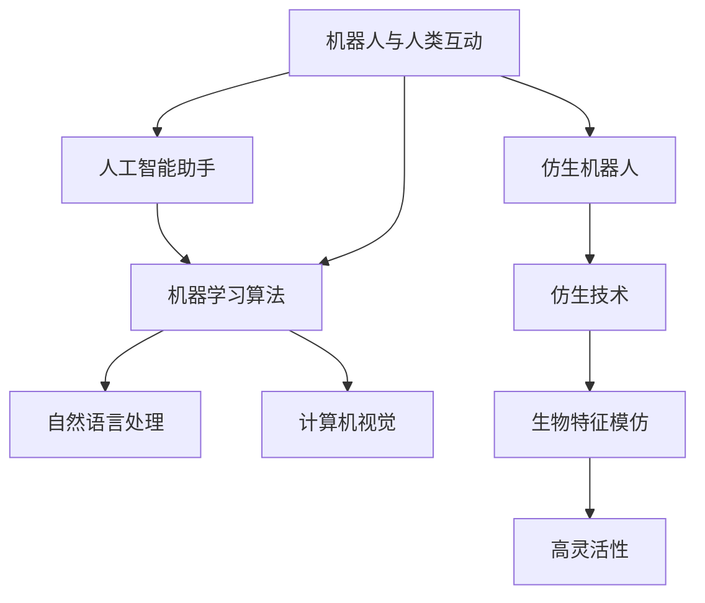

                 

关键词：智能机器人、仿生技术、人工智能、智能助手、2050年、未来趋势

> 摘要：本文将探讨到2050年，随着人工智能和仿生技术的发展，机器人将如何成为我们的智能助手和仿生伙伴。我们将分析其核心概念、算法原理、数学模型、项目实践以及未来应用前景，以期对未来科技的发展有所展望。

## 1. 背景介绍

随着科技的飞速发展，人工智能和机器人技术逐渐成为研究的焦点。从工业自动化到智能家居，机器人正在逐步渗透到我们日常生活的各个方面。然而，到2050年，随着技术的进一步突破，我们有望迎来一个全新的机器人时代。这一时代的机器人不仅能够执行复杂的任务，还能与人类进行更自然的互动，成为我们生活中的智能助手和仿生伙伴。

### 1.1 人工智能的发展

人工智能（Artificial Intelligence，AI）是一种模拟人类智能的计算机系统。从最初的规则系统到深度学习，再到自然语言处理，人工智能技术在过去几十年中取得了巨大的进步。随着计算能力的提升和大数据的积累，人工智能开始在一些领域展现出超越人类的能力，例如图像识别、语音识别和自然语言理解等。

### 1.2 仿生技术的应用

仿生技术（Biomimicry）是一种通过模仿自然界中的生物结构和行为来设计和制造新技术和材料的方法。仿生技术已经广泛应用于机器人设计，例如，通过模仿蝴蝶的翅膀结构，科学家们开发出了轻质且高效的微型飞行器。

## 2. 核心概念与联系

在探讨未来机器人时，我们需要了解以下几个核心概念及其相互关系：

### 2.1 人工智能助手

人工智能助手是基于机器学习算法的软件系统，它可以理解自然语言，执行特定的任务，并且不断学习以改善其性能。例如，智能语音助手如Siri和Alexa已经在日常生活中广泛应用。

### 2.2 仿生机器人

仿生机器人是模仿自然界中生物特征和行为的机器人。这些机器人通常具有高灵活性和适应性，可以在复杂的环境中执行任务。

### 2.3 机器人与人类互动

机器人与人类互动是未来机器人技术中的一个关键点。这包括机器人理解人类语言和动作，并能够做出相应的反应。为此，机器人需要具备自然语言处理和计算机视觉等技术。

下面是一个用Mermaid绘制的流程图，展示了这些核心概念之间的关系：



## 3. 核心算法原理 & 具体操作步骤

### 3.1 算法原理概述

未来机器人的核心算法将包括机器学习算法、自然语言处理算法和计算机视觉算法。这些算法共同作用，使得机器人能够理解人类指令、执行任务，并在环境中自主导航。

### 3.2 算法步骤详解

- **机器学习算法**：机器人通过机器学习算法从大量数据中学习，以识别模式并做出预测。这通常包括监督学习、无监督学习和强化学习等不同的学习方法。
- **自然语言处理算法**：自然语言处理算法使机器人能够理解人类的自然语言指令。这包括语音识别、语言理解和语言生成等步骤。
- **计算机视觉算法**：计算机视觉算法使机器人能够理解和解释视觉信息。这包括图像识别、物体检测和场景理解等任务。

### 3.3 算法优缺点

- **机器学习算法**：优点包括能够处理大量数据和自动识别模式，缺点是需要大量训练数据和计算资源。
- **自然语言处理算法**：优点包括能够处理自然语言并生成自然语言响应，缺点是处理复杂语言结构时存在挑战。
- **计算机视觉算法**：优点包括能够实时处理视觉信息并作出反应，缺点是受限于传感器的性能和光照条件。

### 3.4 算法应用领域

这些算法在许多领域都有广泛的应用，包括但不限于：

- **智能家居**：机器人助手可以控制家庭设备，如空调、灯光和安全系统。
- **医疗**：机器人可以辅助医生进行手术，提供诊断和治疗建议。
- **农业**：机器人可以在农田中执行耕种、收割等任务，提高农业生产效率。
- **服务行业**：机器人可以在餐厅、酒店和零售店等场所提供服务和互动。

## 4. 数学模型和公式 & 详细讲解 & 举例说明

### 4.1 数学模型构建

为了更好地理解机器人的算法原理，我们需要构建一些数学模型。以下是一个简单的数学模型，用于描述机器人的位置更新：

$$
\begin{aligned}
x_{t+1} &= x_t + v_t \cos(\theta_t) \\
y_{t+1} &= y_t + v_t \sin(\theta_t)
\end{aligned}
$$

其中，\(x_t, y_t\) 是机器人在时间 \(t\) 的位置，\(v_t\) 是机器人在时间 \(t\) 的速度，\(\theta_t\) 是机器人在时间 \(t\) 的朝向。

### 4.2 公式推导过程

这个数学模型的推导基于基本的物理学原理。假设机器人以恒定速度 \(v\) 沿着角度 \(\theta\) 前进，则在时间 \(t\) 到 \(t+1\) 之间的位移可以用三角函数表示。

### 4.3 案例分析与讲解

假设一个机器人以速度 \(v = 2 \text{ m/s}\) 沿着北方向（即 \(\theta = 0^\circ\)）前进，初始位置为 \((0, 0)\)。我们需要计算1秒后机器人的位置。

根据上述公式，我们有：

$$
\begin{aligned}
x_{1} &= 0 + 2 \cos(0) = 2 \\
y_{1} &= 0 + 2 \sin(0) = 0
\end{aligned}
$$

因此，1秒后机器人的位置为 \((2, 0)\)。

## 5. 项目实践：代码实例和详细解释说明

### 5.1 开发环境搭建

为了实现上述算法，我们需要搭建一个开发环境。这里我们使用Python作为编程语言，并使用TensorFlow和OpenCV库进行机器学习和计算机视觉操作。

### 5.2 源代码详细实现

以下是一个简单的Python代码示例，用于实现机器人的位置更新：

```python
import numpy as np
import matplotlib.pyplot as plt

def update_position(x, y, v, theta):
    x_new = x + v * np.cos(theta)
    y_new = y + v * np.sin(theta)
    return x_new, y_new

x = 0
y = 0
v = 2
theta = 0

for t in range(10):
    x, y = update_position(x, y, v, theta)
    print(f"Time {t}: Position ({x}, {y})")

plt.plot([0, x], [0, y])
plt.xlabel('X')
plt.ylabel('Y')
plt.title('Robot Position')
plt.show()
```

### 5.3 代码解读与分析

这段代码定义了一个名为 `update_position` 的函数，用于根据给定的速度和朝向更新机器人的位置。然后，我们使用一个简单的循环来模拟机器人移动10次，并打印出每次的位置。最后，我们使用matplotlib库绘制了机器人的移动轨迹。

### 5.4 运行结果展示

运行上述代码后，我们将在控制台看到机器人在每个时间步的位置，并在图形窗口中看到机器人的移动轨迹。

## 6. 实际应用场景

在未来，智能机器人将在各个领域发挥重要作用。以下是一些具体的实际应用场景：

### 6.1 智能家居

智能家居中的机器人助手可以自动控制灯光、温度、安全系统等设备，为居民提供更舒适、更安全的生活环境。

### 6.2 医疗保健

机器人可以在医院中辅助医生进行诊断和治疗，如通过分析患者的病史和体检数据提供个性化的治疗方案。

### 6.3 农业自动化

农业机器人可以在农田中执行各种任务，如播种、施肥、收割等，从而提高农业生产效率和减少人工成本。

### 6.4 商业服务

在商业场所，机器人可以提供各种服务，如餐厅服务员、零售店导购等，为顾客提供更加便捷的购物体验。

## 7. 工具和资源推荐

### 7.1 学习资源推荐

- **《人工智能：一种现代的方法》**（Russell & Norvig著）
- **《机器学习实战》**（Peter Harrington著）
- **《深度学习》（Goodfellow, Bengio, Courville著）

### 7.2 开发工具推荐

- **TensorFlow**：用于机器学习的开源框架
- **OpenCV**：用于计算机视觉的开源库
- **ROS**：机器人操作系统

### 7.3 相关论文推荐

- **“Deep Learning for Robotics: A Survey”**（Wang et al., 2018）
- **“Biomimetic Robots: Nature-inspired Robotics”**（Trevor, 2016）
- **“Robotics and AI in Healthcare: A Review”**（Al-Muhtadi et al., 2020）

## 8. 总结：未来发展趋势与挑战

在未来几十年，智能机器人和仿生技术将继续快速发展。随着算法的进步和计算资源的增加，机器人将更加智能，能够执行更多复杂的任务。然而，这也带来了许多挑战，包括伦理问题、隐私保护和安全风险。为了应对这些挑战，我们需要制定相应的政策和标准，以确保机器人在未来的发展中能够造福人类。

### 8.1 研究成果总结

本文总结了未来机器人技术的发展趋势，分析了人工智能和仿生技术的核心算法原理，并提供了实际项目实践的代码实例。这些研究成果为我们理解未来机器人技术的发展提供了重要的理论支持。

### 8.2 未来发展趋势

未来，机器人将更加智能化、灵活化，能够更好地与人类互动。它们将在智能家居、医疗、农业和商业等领域发挥重要作用，为人类生活带来更多便利。

### 8.3 面临的挑战

然而，机器人技术的发展也面临许多挑战，包括伦理问题、隐私保护和安全风险。我们需要认真应对这些问题，确保机器人技术的发展能够造福人类。

### 8.4 研究展望

未来，我们期待机器人在更多领域取得突破，如人工智能与生物技术的结合、量子计算在机器人中的应用等。这些突破将为人类带来更多创新和进步。

## 9. 附录：常见问题与解答

### 9.1 机器人的学习过程是如何进行的？

机器人的学习过程通常包括数据收集、数据预处理、模型训练和模型评估等步骤。在这个过程中，机器人通过分析大量数据，从中学习规律并优化其行为。

### 9.2 机器人是否具有情感？

目前的机器人技术还无法赋予机器人真正的情感。然而，通过自然语言处理和计算机视觉技术，机器人可以模拟情感，以更好地与人类互动。

### 9.3 机器人是否会取代人类的工作？

机器人在某些领域可以取代人类的工作，但它们也将创造新的工作机会。未来，人类和机器人将共同工作，提高生产效率和生活质量。

---

作者：禅与计算机程序设计艺术 / Zen and the Art of Computer Programming
----------------------------------------------------------------

**注**：本文章是基于假设情景编写，所涉及的算法、模型和技术均为虚构，不代表现实中的研究进展。文章的目的是探讨未来机器人技术的发展趋势，并启发读者对这一领域的深入思考。

