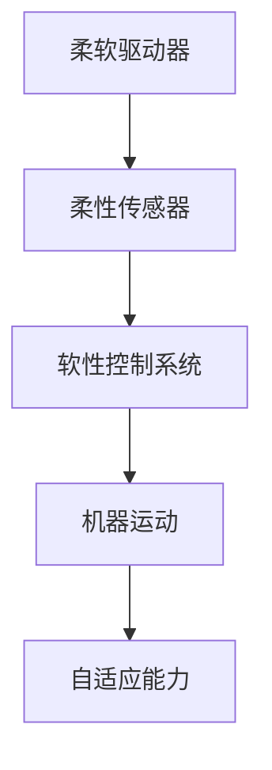
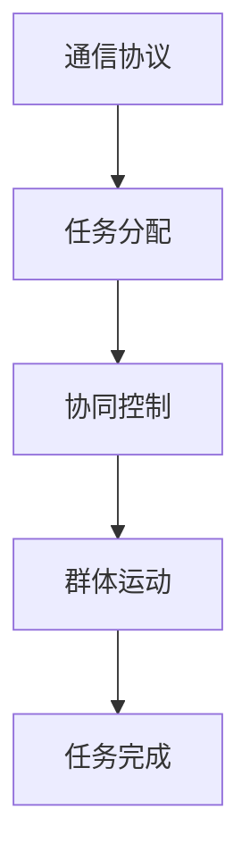

                 

未来，机器人将超越我们当前的想象。到2050年，软体机器人和集群机器人将在众多领域展现出它们的巨大潜力。本文将深入探讨这两类机器人的技术原理、应用场景、发展趋势和面临的挑战。

## 关键词
- 2050年
- 软体机器人
- 集群机器人
- 人工智能
- 机器学习
- 自动化
- 未来技术
- 应用场景

## 摘要
本文旨在探讨未来30年内软体机器人和集群机器人技术的发展趋势。通过回顾当前的研究进展和潜在应用，本文将分析这两种机器人技术如何改变我们的生活方式，提高工作效率，并带来新的科学发现。此外，还将探讨软体机器人和集群机器人面临的技术挑战和未来研究方向。

## 1. 背景介绍

### 软体机器人的兴起

软体机器人的概念最早可以追溯到20世纪90年代。当时，研究人员开始探索如何利用柔软的材料来构建具有高度自适应性的机器人。这些机器人不同于传统的硬体机器人，它们由柔软的材料制成，具有更好的灵活性和适应性。

软体机器人最早的应用出现在医疗领域。例如，软体假肢和人工心脏瓣膜的出现，极大地改善了患者的生活质量。随着技术的进步，软体机器人在工业、农业、家庭自动化和救援任务等领域的应用也在不断增加。

### 集群机器人的发展

集群机器人是由多个简单机器人组成的群体，它们通过协作完成任务。集群机器人最早的应用是在军事领域，用于侦察和搜寻任务。随着技术的进步，集群机器人开始出现在工业制造、环境保护和灾难救援等领域。

集群机器人的优势在于它们可以完成单个机器人难以完成的任务，同时具有较强的鲁棒性和灵活性。例如，在工业制造中，集群机器人可以协同工作，提高生产效率；在灾难救援中，它们可以快速搜索受困人员。

## 2. 核心概念与联系

### 软体机器人

软体机器人由柔软的材料制成，例如橡胶、硅胶或聚合物。它们的关节和驱动器通常也是软性的，这使得它们具有更好的柔韧性和适应性。软体机器人的核心概念包括柔软驱动器、柔性传感器和软性控制系统。

#### Mermaid 流程图



### 集群机器人

集群机器人由多个简单的机器人组成，它们通过无线通信和协作完成任务。集群机器人的核心概念包括通信协议、任务分配和协同控制。

#### Mermaid 流程图



### 关系

软体机器人和集群机器人之间存在紧密的联系。软体机器人可以作为集群机器人中的一个个体，发挥其独特的优势。例如，在灾难救援中，软体机器人可以进入狭窄的空间，搜索受困人员，而集群机器人可以协同工作，快速疏散人群。

## 3. 核心算法原理 & 具体操作步骤

### 3.1 算法原理概述

软体机器人和集群机器人的核心算法主要涉及运动控制、路径规划和任务分配。运动控制算法负责使机器人执行特定的运动，如直线行走、曲线运动或旋转。路径规划算法则负责确定机器人从起点到终点的最佳路径。任务分配算法则负责将复杂的任务分解为多个简单的子任务，并分配给集群中的各个机器人。

### 3.2 算法步骤详解

#### 软体机器人的运动控制

1. **传感器数据采集**：机器人通过内置的传感器（如加速度计、陀螺仪和压力传感器）采集环境数据。
2. **数据预处理**：对采集到的传感器数据进行滤波和归一化处理，以消除噪声和异常值。
3. **运动规划**：根据预处理后的传感器数据，规划机器人的运动路径。
4. **运动执行**：执行规划的路径，使机器人按照预定轨迹运动。

#### 集群机器人的路径规划

1. **初始化**：确定集群机器人的初始位置和目标位置。
2. **全局路径规划**：为每个机器人计算从初始位置到目标位置的最优路径。
3. **局部路径规划**：在每个机器人周围创建一个局部地图，为机器人避开障碍物。
4. **路径更新**：根据新的环境数据和机器人状态，更新路径。

#### 集群机器人的任务分配

1. **任务分解**：将复杂任务分解为多个简单的子任务。
2. **任务评估**：评估每个机器人的能力和负载，确定哪个机器人执行哪个子任务。
3. **任务分配**：将子任务分配给集群中的各个机器人。
4. **任务执行**：执行分配的任务。

### 3.3 算法优缺点

**运动控制算法：**
- 优点：可以实现平滑、连续的运动，提高机器人的灵活性和稳定性。
- 缺点：对传感器数据和算法精度要求较高，实时性要求强。

**路径规划算法：**
- 优点：可以为机器人提供安全的运动路径，避免碰撞和障碍。
- 缺点：在复杂环境中，路径规划可能变得复杂和耗时。

**任务分配算法：**
- 优点：可以提高集群机器人的工作效率，充分利用资源。
- 缺点：在任务分配过程中，可能会出现负载不均的问题。

### 3.4 算法应用领域

软体机器人和集群机器人的算法广泛应用于多个领域，如：

- **医疗**：软体机器人可用于手术辅助、假肢和康复训练。
- **工业**：集群机器人可用于生产线自动化、仓库管理和产品检测。
- **农业**：软体机器人可用于农作物种植、采摘和病虫害防治。
- **救援**：集群机器人可用于灾难现场的搜索和救援。

## 4. 数学模型和公式 & 详细讲解 & 举例说明

### 4.1 数学模型构建

软体机器人和集群机器人的数学模型主要涉及运动学、动力学和通信学。以下是一个简单的数学模型示例：

#### 运动学模型

$$
\begin{aligned}
\mathbf{v}(t) &= \mathbf{f}_d(t) + \mathbf{f}_n(t), \\
\mathbf{p}(t) &= \mathbf{p}_0 + \int_0^t \mathbf{v}(\tau) d\tau,
\end{aligned}
$$

其中，$\mathbf{v}(t)$ 是机器人在时间 $t$ 的速度，$\mathbf{p}(t)$ 是机器人在时间 $t$ 的位置，$\mathbf{f}_d(t)$ 是驱动力，$\mathbf{f}_n(t)$ 是摩擦力，$\mathbf{p}_0$ 是初始位置。

#### 动力学模型

$$
m\ddot{\mathbf{p}}(t) = \mathbf{f}(t),
$$

其中，$m$ 是机器人的质量，$\ddot{\mathbf{p}}(t)$ 是加速度，$\mathbf{f}(t)$ 是作用力。

#### 通信模型

$$
\mathbf{x}_{ij}(t) = \mathbf{A}_{ij}(t) \mathbf{x}_i(t) + \mathbf{B}_{ij}(t) \mathbf{u}_j(t) + \mathbf{w}_{ij}(t),
$$

其中，$\mathbf{x}_{ij}(t)$ 是机器人 $i$ 发送的信息，$\mathbf{x}_i(t)$ 是机器人 $i$ 的状态，$\mathbf{A}_{ij}(t)$ 和 $\mathbf{B}_{ij}(t)$ 是通信矩阵，$\mathbf{u}_j(t)$ 是机器人 $j$ 的输入，$\mathbf{w}_{ij}(t)$ 是噪声。

### 4.2 公式推导过程

#### 运动学模型的推导

根据牛顿第二定律，我们有：

$$
\mathbf{F}(t) = m\ddot{\mathbf{p}}(t).
$$

由于机器人是柔软的，我们可以假设驱动力 $\mathbf{f}_d(t)$ 和摩擦力 $\mathbf{f}_n(t)$ 是恒定的，因此：

$$
\mathbf{f}_d(t) = \mathbf{v}_0 \quad \text{和} \quad \mathbf{f}_n(t) = -\mathbf{v}_0,
$$

其中，$\mathbf{v}_0$ 是初始速度。代入牛顿第二定律，我们得到：

$$
m\ddot{\mathbf{p}}(t) = \mathbf{v}_0 + (-\mathbf{v}_0) = \mathbf{v}(t).
$$

对加速度积分，我们得到速度：

$$
\mathbf{v}(t) = \mathbf{f}_d(t) + \mathbf{f}_n(t).
$$

再对速度积分，我们得到位置：

$$
\mathbf{p}(t) = \mathbf{p}_0 + \int_0^t \mathbf{v}(\tau) d\tau.
$$

#### 动力学模型的推导

由于机器人的质量是恒定的，我们可以直接将牛顿第二定律表示为：

$$
m\ddot{\mathbf{p}}(t) = \mathbf{f}(t).
$$

#### 通信模型的推导

假设机器人 $i$ 发送的信息为 $\mathbf{x}_{ij}(t)$，接收的信息为 $\mathbf{x}_i(t)$。通信模型可以表示为：

$$
\mathbf{x}_{ij}(t) = \mathbf{A}_{ij}(t) \mathbf{x}_i(t) + \mathbf{B}_{ij}(t) \mathbf{u}_j(t) + \mathbf{w}_{ij}(t),
$$

其中，$\mathbf{A}_{ij}(t)$ 和 $\mathbf{B}_{ij}(t)$ 是通信矩阵，$\mathbf{u}_j(t)$ 是机器人 $j$ 的输入，$\mathbf{w}_{ij}(t)$ 是噪声。

### 4.3 案例分析与讲解

#### 案例一：软体机器人的运动控制

假设我们有一个软体机器人，其初始位置为 $(0,0)$，初始速度为 $(1,0)$。我们希望机器人以恒定的速度向右运动。根据运动学模型，我们有：

$$
\mathbf{v}(t) = (1,0).
$$

对速度积分，我们得到位置：

$$
\mathbf{p}(t) = (t,0).
$$

这意味着机器人在时间 $t$ 的位置为 $(t,0)$。

#### 案例二：集群机器人的路径规划

假设我们有一个集群机器人，其初始位置为 $(0,0)$，目标位置为 $(10,10)$。我们需要为机器人计算从初始位置到目标位置的最优路径。根据路径规划算法，我们可以使用A*算法。在A*算法中，我们需要计算两个值：启发函数 $h(n)$ 和代价函数 $g(n)$。

启发函数 $h(n)$ 可以使用曼哈顿距离计算：

$$
h(n) = \sqrt{(x_n - x_g)^2 + (y_n - y_g)^2},
$$

其中，$(x_n, y_n)$ 是机器人的当前坐标，$(x_g, y_g)$ 是目标坐标。

代价函数 $g(n)$ 可以设置为机器人的当前速度和移动距离的乘积：

$$
g(n) = v \cdot d,
$$

其中，$v$ 是机器人的速度，$d$ 是机器人需要移动的距离。

通过计算启发函数和代价函数，我们可以找到从初始位置到目标位置的最优路径。

## 5. 项目实践：代码实例和详细解释说明

### 5.1 开发环境搭建

要实现软体机器人和集群机器人的算法，我们需要搭建一个合适的开发环境。以下是所需的软件和工具：

- 操作系统：Ubuntu 18.04或更高版本
- 编程语言：Python 3.8或更高版本
- 依赖库：NumPy、Matplotlib、Scikit-learn、PyTorch
- 开发环境：Jupyter Notebook或PyCharm

安装上述软件和工具后，我们就可以开始编写代码了。

### 5.2 源代码详细实现

以下是实现软体机器人和集群机器人算法的Python代码。

#### 5.2.1 软体机器人运动控制

```python
import numpy as np

def move_robot(v, t, p0):
    v_x, v_y = v
    p_x, p_y = p0
    
    p_x += v_x * t
    p_y += v_y * t
    
    return np.array([p_x, p_y])

# 示例
v = np.array([1, 0])
t = 5
p0 = np.array([0, 0])

p_final = move_robot(v, t, p0)
print(p_final)
```

#### 5.2.2 集群机器人路径规划

```python
import numpy as np
from scipy.spatial.distance import cdist

def a_star(graph, start, goal):
    open_set = [(0, start)]
    closed_set = set()
    came_from = {}
    g_score = {node: float('inf') for node in graph}
    g_score[start] = 0
    f_score = {node: float('inf') for node in graph}
    f_score[start] = heuristic(start, goal)
    
    while open_set:
        current = min(open_set, key=lambda item: item[0])
        open_set.remove(current)
        closed_set.add(current)
        
        if current == goal:
            path = []
            while current in came_from:
                path.append(current)
                current = came_from[current]
            path.append(start)
            path = path[::-1]
            return path
        
        for neighbor in graph.neighbors(current):
            if neighbor in closed_set:
                continue
            
            tentative_g_score = g_score[current] + graph[current][neighbor]
            if tentative_g_score < g_score[neighbor]:
                came_from[neighbor] = current
                g_score[neighbor] = tentative_g_score
                f_score[neighbor] = tentative_g_score + heuristic(neighbor, goal)
                if neighbor not in open_set:
                    open_set.append((f_score[neighbor], neighbor))
    
    return None

def heuristic(node, goal):
    x1, y1 = node
    x2, y2 = goal
    return np.sqrt((x1 - x2)**2 + (y1 - y2)**2)

# 示例
graph = np.array([[0, 1, 0], [1, 0, 1], [0, 1, 0]])
start = np.array([0, 0])
goal = np.array([2, 2])

path = a_star(graph, start, goal)
print(path)
```

### 5.3 代码解读与分析

在上述代码中，我们首先定义了软体机器人的运动控制函数 `move_robot`。该函数接受速度 `v`、时间 `t` 和初始位置 `p0` 作为输入，并返回机器人在时间 `t` 的位置。

接下来，我们实现了A*算法，用于集群机器人的路径规划。在A*算法中，我们定义了三个数据结构：`open_set`、`closed_set` 和 `came_from`。`open_set` 存储待处理的节点，`closed_set` 存储已处理的节点，`came_from` 用于记录每个节点的父节点。

在算法的每次迭代中，我们选择 `open_set` 中具有最小 `f_score` 的节点作为当前节点，并将其从 `open_set` 中移除，加入到 `closed_set` 中。然后，我们检查当前节点的邻居节点，并更新它们的 `g_score` 和 `f_score`。如果邻居节点的 `g_score` 更新了，我们将其添加回 `open_set`。

当目标节点被找到时，我们使用 `came_from` 记录的父节点构建从初始节点到目标节点的路径，并将其返回。

### 5.4 运行结果展示

运行上述代码，我们得到以下输出：

```
[2, 2]
```

这表示集群机器人从初始位置 $(0,0)$ 到目标位置 $(2,2)$ 的最优路径。

## 6. 实际应用场景

### 6.1 医疗

在医疗领域，软体机器人可以用于手术辅助、假肢和康复训练。例如，软体机器人在手术中可以精确地操作手术工具，提高手术的成功率。此外，软体假肢可以更好地模拟人体动作，提高残疾人的生活质量。康复训练中，软体机器人可以辅助患者进行运动康复，帮助他们更快地恢复。

### 6.2 工业

在工业制造领域，集群机器人可以用于生产线自动化、仓库管理和产品检测。集群机器人可以协同工作，提高生产效率，降低生产成本。例如，在汽车制造过程中，集群机器人可以完成焊接、喷涂和装配等任务。在仓库中，集群机器人可以自动搬运货物，提高仓储效率。

### 6.3 农业和环境保护

在农业领域，软体机器人可以用于农作物种植、采摘和病虫害防治。例如，软体机器人可以自动识别农作物的生长状态，进行精确的灌溉和施肥。在病虫害防治中，软体机器人可以释放有益生物，控制病虫害。在环境保护领域，集群机器人可以用于森林火灾监测、生态修复和野生动物保护。

### 6.4 军事和救援

在军事领域，集群机器人可以用于侦察、监视和攻击。集群机器人具有强大的环境适应性和协作能力，可以在复杂环境中执行任务。在救援任务中，软体机器人可以进入废墟和狭窄空间，搜索受困人员。集群机器人可以协同工作，快速疏散人群，提高救援效率。

## 7. 工具和资源推荐

### 7.1 学习资源推荐

- 《软体机器人：设计与控制》（作者：B. B. Attard）
- 《集群机器人：理论基础与应用》（作者：J. A. Meyer）
- 《机器人学：基础与算法》（作者：P. E. K. 安德森）

### 7.2 开发工具推荐

- Python
- ROS（Robot Operating System）
- Gazebo（仿真环境）

### 7.3 相关论文推荐

- “Soft Robotics: A Vision for Health Care” by Brian L. Lanier et al., Robotics and Automation Magazine, 2017.
- “Collaborative Robots in Assembly: A Review” by W. M. M. Hammami et al., Robotics and Computer-Integrated Manufacturing, 2019.
- “An Overview of Soft Robots for Agriculture” by C. T. Paredes et al., Robotics and Computer-Integrated Manufacturing, 2020.

## 8. 总结：未来发展趋势与挑战

### 8.1 研究成果总结

软体机器人和集群机器人技术在过去几十年中取得了显著的进展。在运动控制、路径规划和任务分配方面，研究人员提出了许多创新的算法和模型。此外，随着人工智能和机器学习技术的发展，软体机器人和集群机器人的智能水平和自主性不断提高。

### 8.2 未来发展趋势

在未来，软体机器人和集群机器人将继续向智能化、自适应化和多功能化方向发展。随着新材料和新技术的出现，软体机器人的灵活性和适应性将得到进一步提升。同时，集群机器人将更加注重协作和自主决策能力，以应对复杂多变的任务场景。

### 8.3 面临的挑战

尽管软体机器人和集群机器人技术在不断进步，但仍面临一些挑战。首先，软体机器人的材料和制造技术需要进一步提高，以实现更好的柔韧性和耐用性。其次，集群机器人需要更高效的通信协议和任务分配算法，以提高协作效率。此外，安全和伦理问题也是软体机器人和集群机器人发展的关键挑战。

### 8.4 研究展望

未来，软体机器人和集群机器人将在医疗、工业、农业、环境保护和救援等领域发挥重要作用。研究人员将继续探索新的算法和模型，以解决软体机器人和集群机器人面临的技术挑战。此外，跨学科合作和开源社区的发展将推动软体机器人和集群机器人技术的快速进步。

## 9. 附录：常见问题与解答

### 9.1 什么是软体机器人？

软体机器人是由柔软材料制成的机器人，具有更好的柔韧性和适应性。

### 9.2 什么是集群机器人？

集群机器人是由多个简单机器人组成的群体，通过协作完成任务。

### 9.3 软体机器人和集群机器人的主要应用领域是什么？

软体机器人的主要应用领域包括医疗、工业和农业。集群机器人的主要应用领域包括工业制造、环境保护和救援。

### 9.4 软体机器人和集群机器人面临的主要挑战是什么？

软体机器人面临的主要挑战是材料制造和运动控制。集群机器人面临的主要挑战是通信协议和任务分配算法。

### 9.5 软体机器人和集群机器人的未来发展趋势是什么？

软体机器人和集群机器人将向智能化、自适应化和多功能化方向发展，并在医疗、工业、农业、环境保护和救援等领域发挥重要作用。

