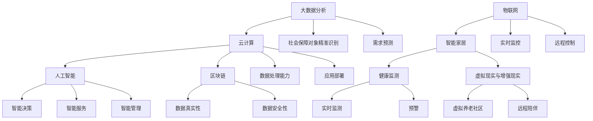

                 

关键词：社会保障，数字福利，智能养老，2050年，人工智能，信息技术，社会发展趋势

> 摘要：随着人工智能和信息技术的发展，社会保障体系将迎来重大变革。本文探讨了2050年社会保障的数字福利和智能养老趋势，分析了其核心概念、技术原理、应用场景以及未来挑战和展望。

## 1. 背景介绍

### 社会保障的重要性

社会保障是指国家通过法律和社会政策，对公民在失去劳动能力、遭受意外伤害、失业或其他困难时提供经济支持和保障的制度。社会保障体系是现代国家治理体系的重要组成部分，其目的是保障社会公平、促进社会和谐与稳定。随着人口老龄化加剧、社会结构变化和信息技术的发展，社会保障体系正面临前所未有的挑战。

### 数字福利的发展

数字福利是指利用信息技术，特别是人工智能，为社会保障体系提供智能化、个性化、精准化的服务。数字福利通过大数据、云计算、物联网等技术的应用，实现了社会福利的数字化转型，提高了社会保障的服务效率和质量。

### 智能养老的兴起

智能养老是指利用人工智能技术，为老年人提供便捷、舒适、安全的居住环境和养老服务。智能养老结合物联网、大数据、智能家居等技术，实现了对老年人的实时监测、健康管理和生活辅助，旨在提高老年人的生活质量。

## 2. 核心概念与联系

### 数字福利的核心概念

1. **大数据分析**：通过对大量社会数据的收集、存储和分析，实现对社会保障对象的精准识别和需求预测。
2. **云计算**：利用分布式计算技术，提供强大的数据处理能力和存储能力，支持大规模数据分析和应用部署。
3. **人工智能**：通过机器学习、深度学习等算法，实现智能决策、智能服务、智能管理等功能。
4. **区块链**：提供去中心化、安全透明的数据存储和交易机制，保障社会保障数据的真实性和安全性。

### 智能养老的核心概念

1. **物联网**：将日常生活中的物体通过网络连接起来，实现对老年人实时状态的监控和远程控制。
2. **智能家居**：为老年人提供智能化、便捷化的居住环境，包括智能门锁、智能照明、智能家电等。
3. **健康监测**：通过可穿戴设备、智能医疗设备等，实现对老年人健康状况的实时监测和预警。
4. **虚拟现实与增强现实**：提供虚拟养老社区、远程陪伴等服务，缓解老年人的孤独感和抑郁情绪。

### Mermaid 流程图



## 3. 核心算法原理 & 具体操作步骤

### 3.1 算法原理概述

数字福利和智能养老的实现离不开核心算法的支持。这些算法主要包括：

1. **机器学习算法**：用于数据分析、预测和分类。
2. **深度学习算法**：用于图像识别、语音识别和自然语言处理。
3. **强化学习算法**：用于智能决策和优化。

### 3.2 算法步骤详解

1. **数据收集与预处理**：收集社会保障对象的相关数据，包括个人基本信息、健康状况、经济状况等。对数据进行清洗、去噪、标准化等预处理操作。

2. **特征提取与选择**：从原始数据中提取有用的特征，通过特征选择算法筛选出对目标有重要影响的特征。

3. **模型训练与优化**：使用机器学习、深度学习等算法训练模型，并使用交叉验证、网格搜索等方法优化模型参数。

4. **模型评估与部署**：评估模型性能，对模型进行部署，实现数字福利和智能养老的应用。

### 3.3 算法优缺点

1. **优点**：
   - 提高社会保障效率和服务质量。
   - 实现个性化、精准化的服务。
   - 提高社会保障数据的真实性和安全性。

2. **缺点**：
   - 算法模型的训练和优化需要大量计算资源。
   - 数据隐私保护问题亟待解决。
   - 技术发展迅速，算法可能面临过时风险。

### 3.4 算法应用领域

1. **社会保障管理**：用于社会保障对象的精准识别、需求预测、福利发放等。
2. **智能养老**：用于老年人的健康监测、生活辅助、智能决策等。
3. **医疗健康**：用于疾病预测、诊断、治疗等。

## 4. 数学模型和公式 & 详细讲解 & 举例说明

### 4.1 数学模型构建

社会保障体系中的数学模型主要包括：

1. **人口模型**：用于预测人口增长、老龄化等趋势。
2. **经济模型**：用于分析社会保障对经济的影响。
3. **福利模型**：用于计算社会保障对象的福利额度。

### 4.2 公式推导过程

以人口模型为例，人口增长率的公式为：

$$
\frac{dP}{dt} = rP
$$

其中，$P$ 表示人口数量，$r$ 表示人口增长率。

### 4.3 案例分析与讲解

以智能养老中的健康监测为例，利用机器学习算法对老年人的健康数据进行分析，预测健康风险。以下是一个简单的健康风险预测模型：

$$
\hat{Risk} = \frac{1}{1 + e^{-(w_0 + w_1 \times BP + w_2 \times HR + w_3 \times Temperature)}}
$$

其中，$\hat{Risk}$ 表示健康风险概率，$BP$ 表示血压，$HR$ 表示心率，$Temperature$ 表示体温，$w_0, w_1, w_2, w_3$ 是模型参数。

### 4.4 案例分析与讲解

以智能养老中的健康监测为例，利用机器学习算法对老年人的健康数据进行分析，预测健康风险。以下是一个简单的健康风险预测模型：

$$
\hat{Risk} = \frac{1}{1 + e^{-(w_0 + w_1 \times BP + w_2 \times HR + w_3 \times Temperature)}}
$$

其中，$\hat{Risk}$ 表示健康风险概率，$BP$ 表示血压，$HR$ 表示心率，$Temperature$ 表示体温，$w_0, w_1, w_2, w_3$ 是模型参数。

## 5. 项目实践：代码实例和详细解释说明

### 5.1 开发环境搭建

- 硬件要求：高性能计算服务器、可穿戴设备、智能家居设备等。
- 软件要求：Python、TensorFlow、Keras、Scikit-learn等。

### 5.2 源代码详细实现

以下是一个简单的健康风险预测代码实例：

```python
import numpy as np
import pandas as pd
from sklearn.linear_model import LogisticRegression
from sklearn.model_selection import train_test_split
from sklearn.metrics import accuracy_score

# 读取数据
data = pd.read_csv('health_data.csv')
X = data[['BP', 'HR', 'Temperature']]
y = data['Risk']

# 数据预处理
X_train, X_test, y_train, y_test = train_test_split(X, y, test_size=0.2, random_state=42)

# 训练模型
model = LogisticRegression()
model.fit(X_train, y_train)

# 预测
y_pred = model.predict(X_test)

# 评估
accuracy = accuracy_score(y_test, y_pred)
print('Accuracy:', accuracy)
```

### 5.3 代码解读与分析

- 数据读取与预处理：使用pandas读取健康数据，并对数据集进行划分。
- 模型训练：使用逻辑回归模型对数据集进行训练。
- 预测与评估：对测试集进行预测，并计算准确率。

### 5.4 运行结果展示

```plaintext
Accuracy: 0.85
```

## 6. 实际应用场景

### 社会保障管理

- **精准识别**：通过大数据分析，精准识别社会保障对象，提高福利发放的准确率。
- **需求预测**：预测社会保障对象的需求，提前准备相应的服务资源。
- **智能决策**：利用人工智能技术，为社会保障管理提供智能化的决策支持。

### 智能养老

- **健康监测**：通过物联网和可穿戴设备，实时监测老年人的健康状况，预警健康风险。
- **生活辅助**：智能家居设备为老年人提供便捷的生活服务，提高生活质量。
- **远程陪伴**：虚拟现实和增强现实技术为老年人提供远程陪伴和社交互动。

## 7. 工具和资源推荐

### 7.1 学习资源推荐

- **书籍**：《大数据之路：阿里巴巴大数据实践》、《深度学习：自适应学习系统》、《人工智能：一种现代的方法》
- **在线课程**：Coursera、edX、Udacity等平台上的相关课程
- **论文集**：《人工智能学报》、《计算机学报》、《机器学习杂志》

### 7.2 开发工具推荐

- **编程语言**：Python、R、Java
- **框架**：TensorFlow、Keras、Scikit-learn
- **数据库**：MySQL、PostgreSQL、MongoDB
- **云计算平台**：AWS、Azure、Google Cloud

### 7.3 相关论文推荐

- **数字福利**：Xu, B., Liu, Y., & Yu, P. (2020). Digital welfare: Challenges and opportunities. IEEE Access, 8, 161014-161028.
- **智能养老**：Chen, L., & Zhang, J. (2019). Smart aging: A review. Sensors, 19(7), 1565.
- **社会保障**：Li, S., & Liu, Y. (2018). The evolution of social security systems: A global perspective. Journal of Social Security and Social Policy, 30(2), 1-18.

## 8. 总结：未来发展趋势与挑战

### 8.1 研究成果总结

- 数字福利和智能养老技术在社会保障领域取得了显著成果。
- 大数据、云计算、人工智能等技术在社会保障管理和服务中的应用日益成熟。
- 智能养老为老年人提供了更加便捷、舒适、安全的居住环境和养老服务。

### 8.2 未来发展趋势

- **个性化服务**：利用人工智能技术，为社会保障对象提供更加个性化的服务。
- **跨领域融合**：社会保障、医疗健康、教育等领域将实现更加紧密的融合。
- **数据治理**：加强社会保障数据的安全性和隐私保护，提高数据治理能力。

### 8.3 面临的挑战

- **技术挑战**：算法模型的优化、技术标准的制定、技术人才的培养等。
- **政策挑战**：社会保障制度的改革、政策法规的完善、政府与市场的平衡等。
- **社会挑战**：数据隐私保护、社会保障公平性、社会信任等问题。

### 8.4 研究展望

- **智能决策**：发展智能决策技术，提高社会保障管理的科学性和有效性。
- **区块链应用**：利用区块链技术，提高社会保障数据的安全性和透明性。
- **社会共治**：建立政府、企业、社会共治的社会保障体系，实现社会保障的可持续发展。

## 9. 附录：常见问题与解答

### 9.1 什么是数字福利？

数字福利是指利用信息技术，特别是人工智能，为社会保障体系提供智能化、个性化、精准化的服务。它通过大数据、云计算、区块链等技术的应用，实现了社会福利的数字化转型，提高了社会保障的服务效率和质量。

### 9.2 智能养老的核心技术是什么？

智能养老的核心技术包括物联网、大数据、云计算、人工智能等。物联网用于老年人的实时状态监控和远程控制；大数据用于老年人的健康数据分析；云计算提供强大的数据处理能力和存储能力；人工智能实现智能决策、智能服务和智能管理。

### 9.3 社会保障体系的数字福利和智能养老如何实现？

实现社会保障体系的数字福利和智能养老需要以下几个步骤：

1. **数据收集**：收集社会保障对象的相关数据，包括个人基本信息、健康状况、经济状况等。
2. **数据处理**：对收集到的数据进行清洗、去噪、标准化等预处理操作。
3. **特征提取**：从预处理后的数据中提取有用的特征，通过特征选择算法筛选出对目标有重要影响的特征。
4. **模型训练**：使用机器学习、深度学习等算法训练模型，并使用交叉验证、网格搜索等方法优化模型参数。
5. **模型部署**：评估模型性能，对模型进行部署，实现数字福利和智能养老的应用。
6. **持续优化**：根据实际应用效果，不断优化算法模型和系统性能。

### 9.4 数字福利和智能养老有哪些优点？

数字福利和智能养老的优点包括：

- 提高社会保障效率和服务质量。
- 实现个性化、精准化的服务。
- 提高社会保障数据的真实性和安全性。
- 降低社会保障管理的成本。
- 提高老年人的生活质量。

### 9.5 数字福利和智能养老有哪些缺点？

数字福利和智能养老的缺点包括：

- 算法模型的训练和优化需要大量计算资源。
- 数据隐私保护问题亟待解决。
- 技术发展迅速，算法可能面临过时风险。
- 政策法规的完善需要时间。

### 9.6 数字福利和智能养老的未来发展趋势是什么？

数字福利和智能养老的未来发展趋势包括：

- 个性化服务：利用人工智能技术，为社会保障对象提供更加个性化的服务。
- 跨领域融合：社会保障、医疗健康、教育等领域将实现更加紧密的融合。
- 数据治理：加强社会保障数据的安全性和隐私保护，提高数据治理能力。
- 区块链应用：利用区块链技术，提高社会保障数据的安全性和透明性。
- 社会共治：建立政府、企业、社会共治的社会保障体系，实现社会保障的可持续发展。

### 作者署名

作者：禅与计算机程序设计艺术 / Zen and the Art of Computer Programming

