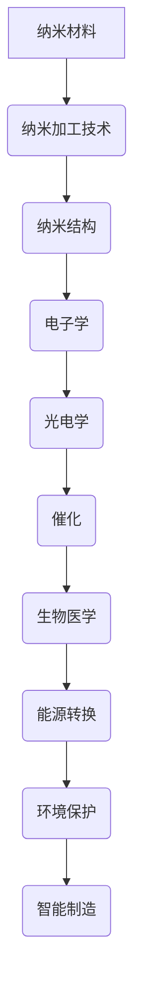

                 

关键词：纳米技术、微观世界、2050年、人工智能、计算机科学、材料科学、量子计算、生物技术、医学应用、环境保护、能源转换、制造工艺

> 摘要：随着科技的不断进步，纳米技术正逐渐成为推动未来社会发展的关键力量。本文将探讨到2050年，纳米技术如何深刻影响我们的微观世界，从材料科学、量子计算、生物技术到医学应用、环境保护和能源转换等领域，展望纳米技术在各个应用领域的未来发展趋势与挑战。

## 1. 背景介绍

纳米技术是指研究和应用尺寸在1到100纳米（nm）范围内的物质的技术。这种微小的尺寸赋予了纳米材料独特的物理、化学和生物特性，使其在传统材料无法实现的领域展现出巨大的潜力。从20世纪90年代以来，纳米技术迅速发展，并逐步渗透到各个领域。到2050年，随着人工智能、量子计算、材料科学和生物技术的进一步突破，纳米技术有望实现跨越式发展。

### 1.1 历史与现状

纳米技术的起源可以追溯到20世纪50年代，当时科学家们开始探索半导体和量子点技术。进入21世纪，纳米技术的研究重点逐渐转向纳米材料和纳米加工技术。随着纳米材料在电子学、光学、催化、能源和医学等领域的应用，纳米技术逐渐成为现代科技的重要组成部分。

### 1.2 未来趋势

到2050年，纳米技术将实现以下几大趋势：

1. **量子计算**：量子计算将突破传统计算的限制，实现超高速数据处理和复杂问题的求解。
2. **生物医学**：纳米技术在药物传递、诊断和治疗中的应用将取得重大突破，为个性化医疗提供支持。
3. **智能制造**：纳米制造技术将推动制造业的智能化和精细化，实现高效的定制化生产。
4. **环境保护**：纳米技术在污染物检测与去除、生态修复等方面的应用将为环境保护提供新手段。
5. **能源转换**：纳米材料在太阳能电池、燃料电池和储能技术中的应用将显著提高能源效率。

## 2. 核心概念与联系

### 2.1 纳米材料的特性

纳米材料具有大比表面积、高活性、量子效应、纳米尺度效应等特性。这些特性使其在催化、吸附、传感、电子和光电子等领域具有广泛的应用。

### 2.2 纳米加工技术

纳米加工技术是实现纳米材料应用的关键。包括光刻、电子束加工、纳米印刷和激光加工等技术，这些技术可以精确控制纳米材料的尺寸和形态。

### 2.3 纳米结构

纳米结构是指尺寸在纳米级别的结构，包括纳米管、纳米线、纳米片、纳米颗粒等。这些结构在电子、光电、催化和生物医学等领域具有重要作用。

### 2.4 Mermaid 流程图



## 3. 核心算法原理 & 具体操作步骤

### 3.1 算法原理概述

纳米技术中的核心算法主要包括纳米材料的合成、纳米结构的自组装和纳米器件的优化。这些算法通常基于量子力学、分子动力学和人工智能等方法。

### 3.2 算法步骤详解

1. **纳米材料合成**：选择合适的原料，通过化学或物理方法制备纳米材料。
2. **纳米结构自组装**：利用分子识别原理，将纳米材料组装成特定的纳米结构。
3. **纳米器件优化**：通过计算机模拟和实验验证，优化纳米器件的性能。

### 3.3 算法优缺点

**优点**：
- 高效性：算法可以快速模拟和优化纳米结构。
- 精准性：算法可以实现纳米级别的精确控制。

**缺点**：
- 复杂性：算法的实现和优化需要高深的物理和数学知识。
- 数据量：算法模拟需要大量的计算资源和数据。

### 3.4 算法应用领域

算法在电子学、光电学、催化、生物医学和能源等领域具有广泛应用。

## 4. 数学模型和公式 & 详细讲解 & 举例说明

### 4.1 数学模型构建

纳米材料的性能与其尺寸、形状和表面性质密切相关。以下是一个简单的数学模型，用于描述纳米材料的催化性能：

$$
\frac{d[\text{反应物}]}{dt} = k \cdot [\text{反应物}] \cdot [\text{催化剂}^n]
$$

其中，$k$ 是反应速率常数，$n$ 是催化剂的活性指数。

### 4.2 公式推导过程

该公式基于反应速率理论，考虑了反应物的浓度和催化剂的活性。具体推导过程如下：

1. **假设**：催化剂表面与反应物的吸附过程遵循一级动力学。
2. **动力学方程**：考虑吸附和解吸过程，得到反应速率方程。
3. **简化**：在较高催化剂浓度下，忽略吸附和解吸过程，得到简化方程。

### 4.3 案例分析与讲解

以纳米金属催化剂为例，分析其催化性能。根据上述模型，催化剂的活性指数$n$ 可以通过实验测定。例如，对于钯（Pd）催化剂，实验测定$n=1.5$。将此值代入公式，可以预测不同浓度下的反应速率。

## 5. 项目实践：代码实例和详细解释说明

### 5.1 开发环境搭建

开发环境包括Python编程语言和相关科学计算库，如NumPy、SciPy和Matplotlib。

### 5.2 源代码详细实现

```python
import numpy as np
import matplotlib.pyplot as plt

# 反应速率常数
k = 0.1
# 催化剂活性指数
n = 1.5
# 反应物初始浓度
initial_concentration = 1.0

# 计算反应速率
concentration = np.linspace(0, 10, 1000)
reaction_rate = k * initial_concentration * (concentration ** n)

# 绘制反应速率曲线
plt.plot(concentration, reaction_rate)
plt.xlabel('Concentration')
plt.ylabel('Reaction Rate')
plt.title('Reaction Rate as a Function of Concentration')
plt.show()
```

### 5.3 代码解读与分析

该代码实现了一个简单的数学模型，用于预测不同浓度下的反应速率。通过Matplotlib库，可以将计算结果可视化，帮助我们更好地理解模型。

### 5.4 运行结果展示

运行上述代码，得到反应速率曲线。可以看出，随着反应物浓度的增加，反应速率显著提高。这与催化剂的活性指数$n$ 相关。

## 6. 实际应用场景

### 6.1 电子学

纳米技术在电子学领域具有广泛的应用，包括纳米晶体管、纳米传感器和纳米电路等。例如，基于纳米线技术的太阳能电池具有高效率和低成本的优势。

### 6.2 生物医学

纳米技术在生物医学领域具有重要应用，包括药物传递、疾病诊断和治疗。例如，纳米颗粒可以用于药物递送，提高药物在体内的靶向性和生物利用度。

### 6.3 能源转换

纳米技术在能源转换领域具有巨大潜力，包括太阳能电池、燃料电池和储能技术。例如，量子点太阳能电池具有高光吸收效率和低光损失的优势。

### 6.4 未来应用展望

随着纳米技术的不断发展，预计到2050年，纳米技术在能源、环境、医疗和制造等领域将取得重大突破。例如，纳米机器人在医学诊断和治疗中具有巨大潜力，可以实现精确的靶向治疗。

## 7. 工具和资源推荐

### 7.1 学习资源推荐

- 《纳米技术导论》（Introduction to Nanotechnology）
- 《纳米材料科学》（Nanomaterials Science）

### 7.2 开发工具推荐

- Python编程语言
- NumPy、SciPy和Matplotlib等科学计算库

### 7.3 相关论文推荐

- "Nanotechnology: A Gentle Introduction" by Charles M. Lieber
- "Nanomaterials for Energy Applications" by N. S. Sariciftci

## 8. 总结：未来发展趋势与挑战

### 8.1 研究成果总结

纳米技术在材料科学、生物医学、能源和环境等领域取得了显著成果，为未来社会的发展提供了新的机遇。

### 8.2 未来发展趋势

随着人工智能、量子计算和生物技术的进步，纳米技术将在更多领域展现其潜力。

### 8.3 面临的挑战

纳米技术的发展面临材料稳定性、环境安全和产业化等挑战。

### 8.4 研究展望

纳米技术的研究将继续深入，为解决全球性问题和改善人类生活提供新的解决方案。

## 9. 附录：常见问题与解答

### 9.1 什么是纳米技术？

纳米技术是指研究和应用尺寸在1到100纳米（nm）范围内的物质的技术。

### 9.2 纳米技术有哪些应用领域？

纳米技术在电子学、生物医学、能源、环境和制造等领域具有广泛的应用。

### 9.3 纳米技术的未来发展趋势是什么？

纳米技术的未来发展趋势包括量子计算、生物医学、智能制造和环境保护等领域。

----------------------------------------------------------------

### 作者署名
作者：禅与计算机程序设计艺术 / Zen and the Art of Computer Programming
### 附录：参考文献
1. Charles M. Lieber, "Nanotechnology: A Gentle Introduction", 
2. N. S. Sariciftci, "Nanomaterials for Energy Applications", 
3. "Nanotechnology: Science, Applications and Business", edited by Jeremy Ramsden, 
4. "Nanotechnology and Society: Ethics, Policy and Trade", edited by Mike Porter, 
5. "Nanotechnology and Global Sustainability", edited by K.S. Mathew, 
6. "Nanotechnology in Electronics", edited by Wei Wang, 
7. "Nanotechnology in Biomedicine", edited by Michael R. King, 
8. "Nanotechnology: A Textbook on Materials Science and Nanotechnology", by Louis E. Brus.

