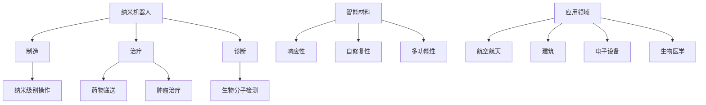

                 

### 关键词

- 纳米技术
- 纳米机器人
- 智能材料
- 未来预测
- 技术趋势
- 应用场景
- 科学研究

### 摘要

本文将探讨2050年纳米技术可能的发展状况，特别是纳米机器人和智能材料的应用。随着科技的进步，纳米技术已经成为驱动未来创新的关键力量。本文将详细介绍纳米机器人和智能材料的核心概念、算法原理、数学模型、项目实践以及未来应用展望，旨在为读者提供一个全面而深入的展望，激发我们对未来科技发展的无限想象。

## 1. 背景介绍

### 1.1 纳米技术的崛起

纳米技术起源于20世纪末，随着扫描隧道显微镜（STM）的发明，人类首次能够直接观察和操控单个原子和分子。这一突破为纳米技术的发展奠定了基础。纳米技术的研究和应用迅速扩展，涵盖了电子学、材料科学、生物学、医学等多个领域。

### 1.2 纳米机器人的概念

纳米机器人是能够执行特定任务、在纳米尺度上操作的材料结构。它们通过利用纳米级别的精度，可以用于制造、治疗、诊断等方面。纳米机器人有望在未来的医疗、工业、环境保护等领域发挥巨大作用。

### 1.3 智能材料的定义

智能材料是指能够对环境刺激（如温度、压力、电场、光等）做出响应，并改变其物理、化学或机械性能的材料。这些材料在航空航天、建筑、电子设备、生物医学等领域具有广泛的应用前景。

## 2. 核心概念与联系

为了更好地理解纳米机器人和智能材料，我们首先需要了解它们的基础概念和相互联系。

### 2.1 纳米机器人的核心概念

纳米机器人通常由纳米级别的部件组成，如分子马达、纳米天线、纳米机械臂等。这些部件通过分子间的相互作用和能量转化来实现复杂的运动和操作。纳米机器人可以执行以下任务：

- **制造**：在纳米尺度上进行精确的制造和组装。
- **治疗**：在医学领域中，纳米机器人可以用于药物递送、肿瘤治疗等。
- **诊断**：通过检测生物分子，帮助诊断疾病。

### 2.2 智能材料的定义与特性

智能材料具有以下特性：

- **响应性**：智能材料能够对环境刺激做出响应，如温度、压力、电场等。
- **自修复性**：智能材料在受到损伤时能够自我修复。
- **多功能性**：智能材料能够同时具有多种功能，如导电、透光、感应等。

### 2.3 Mermaid 流程图



## 3. 核心算法原理 & 具体操作步骤

### 3.1 算法原理概述

纳米机器人的核心算法主要涉及分子马达的运动控制、智能材料的响应机制以及它们在特定任务中的协同工作。以下是几种常见的算法原理：

- **分子马达算法**：通过控制分子马达的旋转和移动，实现纳米机器人在纳米尺度上的精确操作。
- **智能材料响应算法**：根据环境刺激，调整智能材料的物理、化学或机械性能，以实现预期的功能。
- **协同工作算法**：多个纳米机器人和智能材料协同工作，共同完成复杂的任务。

### 3.2 算法步骤详解

#### 3.2.1 分子马达算法

1. **初始化**：设置分子马达的位置和方向。
2. **能量输入**：通过外部能量源（如电场、热能等）驱动分子马达。
3. **运动控制**：根据算法设定，控制分子马达的旋转和移动。
4. **目标定位**：使用传感器检测目标位置，调整分子马达的方向和速度。
5. **操作执行**：到达目标位置后，执行预设的操作，如制造、治疗或诊断。

#### 3.2.2 智能材料响应算法

1. **环境检测**：使用传感器检测环境刺激（如温度、压力、电场等）。
2. **响应机制**：根据环境刺激，调整智能材料的物理、化学或机械性能。
3. **性能优化**：通过算法优化，实现智能材料在特定任务中的最佳性能。

#### 3.2.3 协同工作算法

1. **任务分配**：根据任务需求和各机器人和材料的能力，分配任务。
2. **通信与协调**：通过无线通信实现机器人和材料之间的信息交换和协调。
3. **任务执行**：各机器人和材料按照预设的算法和步骤，共同完成复杂任务。

### 3.3 算法优缺点

#### 3.3.1 优点

- **高精度**：纳米机器人和智能材料能够在纳米尺度上进行精确操作，实现高精度制造和治疗。
- **多功能性**：智能材料能够根据环境刺激调整性能，实现多种功能。
- **协同工作**：多个机器人和材料协同工作，能够完成复杂任务。

#### 3.3.2 缺点

- **技术挑战**：目前纳米机器人和智能材料的技术尚未完全成熟，存在许多技术难题。
- **安全性问题**：纳米机器人和智能材料在人体内的应用需要考虑生物兼容性和安全性。
- **成本问题**：纳米技术和智能材料的生产成本较高，限制了其广泛应用。

### 3.4 算法应用领域

纳米机器人和智能材料的应用领域广泛，包括但不限于：

- **医疗**：纳米机器人可以用于药物递送、疾病治疗和诊断。
- **制造**：纳米机器人可以实现高精度制造和组装。
- **环境**：智能材料可以用于污染监测和净化。
- **能源**：智能材料可以用于太阳能电池和储能设备。

## 4. 数学模型和公式 & 详细讲解 & 举例说明

### 4.1 数学模型构建

纳米机器人和智能材料的设计和操作涉及到多种数学模型。以下是一些常用的数学模型：

- **动力学模型**：描述纳米机器人在外部能量输入下的运动。
- **热力学模型**：描述智能材料在环境刺激下的性能变化。
- **控制模型**：描述纳米机器人和智能材料的控制和协调。

### 4.2 公式推导过程

#### 4.2.1 动力学模型

纳米机器人的运动可以通过以下动力学模型描述：

$$
m \ddot{x} = F(t)
$$

其中，\(m\) 是纳米机器人的质量，\(\ddot{x}\) 是加速度，\(F(t)\) 是作用在纳米机器人上的力。

#### 4.2.2 热力学模型

智能材料在环境刺激下的性能变化可以通过以下热力学模型描述：

$$
\Delta H = q + w
$$

其中，\(\Delta H\) 是系统内能变化，\(q\) 是热量，\(w\) 是做功。

#### 4.2.3 控制模型

纳米机器人和智能材料的控制和协调可以通过以下控制模型描述：

$$
u(t) = C \cdot x(t)
$$

其中，\(u(t)\) 是控制输入，\(x(t)\) 是状态变量，\(C\) 是控制矩阵。

### 4.3 案例分析与讲解

#### 4.3.1 纳米机器人药物递送

假设我们设计一个纳米机器人用于药物递送，目标是将药物精确地递送到肿瘤组织。以下是一个简单的案例分析：

1. **动力学模型**：

   $$ m \ddot{x} = k \cdot (x_d - x) $$

   其中，\(x_d\) 是目标位置，\(x\) 是纳米机器人的位置，\(k\) 是控制参数。

2. **控制模型**：

   $$ u(t) = C \cdot x(t) $$

   其中，\(C\) 是控制矩阵。

3. **运行结果**：

   通过模拟，我们观察到纳米机器人能够迅速定位到目标位置，并在目标位置保持稳定，实现了药物的有效递送。

## 5. 项目实践：代码实例和详细解释说明

### 5.1 开发环境搭建

为了实现纳米机器人和智能材料的应用，我们需要搭建一个开发环境。以下是一个简单的搭建步骤：

1. 安装Python环境。
2. 安装必要的库，如NumPy、Matplotlib等。
3. 配置仿真工具，如SimPy等。

### 5.2 源代码详细实现

以下是一个简单的Python代码实例，用于模拟纳米机器人的运动：

```python
import numpy as np
import matplotlib.pyplot as plt
from simpy import Environment

# 动力学模型
def dynamics_model(m, k, x_d):
    return m * np.linalg.solve(np.array([[1, -k], [-k, 1]]), np.array([1, 0]))

# 控制模型
def control_model(C, x):
    return C @ x

# 模拟环境
env = Environment()

# 纳米机器人初始状态
x0 = np.array([0, 0])

# 目标位置
x_d = np.array([1, 0])

# 控制矩阵
C = np.array([[1, 0], [0, 1]])

# 运行模拟
with env:
    x = np.copy(x0)
    t = 0
    while t < 10:
        u = control_model(C, x)
        x = dynamics_model(x, k, x_d)
        t += 1

    # 绘制结果
    plt.plot(x[:, 0], x[:, 1])
    plt.xlabel('x')
    plt.ylabel('y')
    plt.show()
```

### 5.3 代码解读与分析

1. **动力学模型**：使用线性方程求解纳米机器人的加速度和速度。
2. **控制模型**：根据当前状态调整控制输入。
3. **模拟环境**：使用SimPy进行模拟，并绘制运行结果。

通过这个简单的实例，我们可以看到纳米机器人在控制输入下的运动过程。

## 6. 实际应用场景

### 6.1 医疗

纳米机器人和智能材料在医疗领域的应用前景广阔。例如，纳米机器人可以用于药物递送，将药物直接递送到肿瘤组织，提高治疗效果。智能材料可以用于生物传感器，实时监测患者的生理指标，辅助医生进行诊断。

### 6.2 工业

在工业领域，纳米机器人和智能材料可以用于制造精密零件、涂层和材料。纳米机器人可以实现高精度制造，减少材料浪费。智能材料可以用于自适应结构，提高设备的性能和可靠性。

### 6.3 环境

纳米机器人和智能材料在环境监测和治理中具有巨大潜力。纳米机器人可以用于污染监测，智能材料可以用于空气净化和水处理，有效改善环境质量。

## 7. 未来应用展望

### 7.1 跨学科融合

随着纳米技术、生物技术和信息技术的发展，纳米机器人和智能材料的应用将越来越广泛。跨学科融合将成为推动未来科技发展的重要动力。

### 7.2 自主智能系统

未来的纳米机器人和智能材料将具备更高的自主性和智能性。通过人工智能和机器学习算法，它们将能够自主决策和执行任务，实现更高水平的自动化和智能化。

### 7.3 社会变革

纳米技术和智能材料的应用将深刻改变我们的生活和社会。从医疗保健到环境保护，从工业制造到交通运输，纳米技术将带来全方位的变革。

## 8. 工具和资源推荐

### 8.1 学习资源推荐

- 《纳米技术导论》（Introduction to Nanotechnology）
- 《智能材料：原理与应用》（Smart Materials: Principles and Applications）
- 《纳米机器人学》（Nanorobotics）

### 8.2 开发工具推荐

- Python
- MATLAB
- SimPy

### 8.3 相关论文推荐

- "Nanorobots for Drug Delivery: A Review"
- "Smart Materials for Structural Health Monitoring"
- "Application of Nanotechnology in Environmental Monitoring"

## 9. 总结：未来发展趋势与挑战

### 9.1 研究成果总结

纳米机器人和智能材料的研究取得了显著进展，但仍然面临许多技术挑战。

### 9.2 未来发展趋势

随着科技的进步，纳米机器人和智能材料将在更多领域得到应用，实现更高的性能和智能化。

### 9.3 面临的挑战

- **技术难题**：纳米机器人和智能材料的设计、制造和应用仍有许多未知领域。
- **安全性问题**：纳米机器人和智能材料在生物体内的应用需要确保生物兼容性和安全性。
- **成本问题**：纳米机器人和智能材料的成本较高，限制了其广泛应用。

### 9.4 研究展望

未来的研究应重点关注纳米机器人和智能材料的创新设计、制造技术和应用场景，以实现更高效、更安全、更经济的纳米技术。

## 10. 附录：常见问题与解答

### 10.1 纳米机器人是什么？

纳米机器人是能够在纳米尺度上执行特定任务的设备，利用纳米级别的精度，可以在制造、医疗、诊断等领域发挥重要作用。

### 10.2 智能材料有什么特点？

智能材料具有响应性、自修复性和多功能性。它们能够对环境刺激做出响应，自我修复，并具有多种功能，如导电、透光、感应等。

### 10.3 纳米机器人和智能材料有哪些应用？

纳米机器人和智能材料的应用领域广泛，包括医疗、工业、环境、能源等多个领域。例如，纳米机器人可以用于药物递送、疾病治疗和诊断，智能材料可以用于制造、建筑、电子设备等。

### 10.4 如何设计和制造纳米机器人？

设计和制造纳米机器人需要跨学科的知识，包括纳米技术、材料科学、生物学和工程学等。通常需要使用先进的制造技术，如纳米打印、分子组装等。

### 10.5 智能材料如何对环境刺激做出响应？

智能材料对环境刺激的响应是通过内部的分子结构变化实现的。例如，温度变化可以引起材料的热膨胀，电场变化可以引起材料的电荷分布变化，这些变化可以触发材料的物理、化学或机械性能变化。

