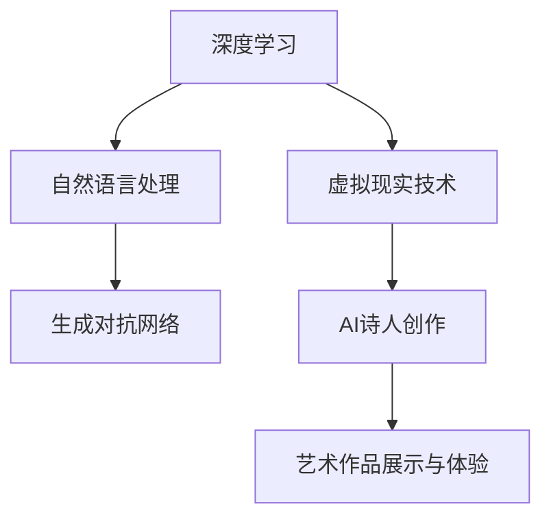

                 

关键词：人工智能，艺术创作，虚拟现实，2050年，AI诗人，未来趋势，技术发展，创意算法，人机交互

> 摘要：本文探讨在未来2050年，人工智能（AI）如何革新艺术创作领域，特别是AI诗人和虚拟现实艺术的融合。文章从背景介绍、核心概念与联系、算法原理、数学模型、项目实践、实际应用场景和未来展望等方面，深入分析了AI在艺术创作中的潜力与挑战，并展望了这一领域的发展前景。

## 1. 背景介绍

在科技日新月异发展的今天，人工智能（AI）已经成为改变世界的重要力量。从自动驾驶、智能家居到医疗诊断、金融分析，AI的应用场景不断扩大。然而，在艺术创作这一领域，AI的影响才刚刚开始。2050年，随着AI技术的不断成熟，我们有望看到一个全新的艺术创作模式，AI诗人与虚拟现实艺术将引领这一变革。

### 艺术创作的现状

目前，艺术家在创作过程中主要依赖个人灵感、技巧和经验。然而，艺术创作的过程充满挑战，如创意枯竭、技巧不足和时间压力等。尽管数字化工具和软件在一定程度上提升了创作效率，但它们仍然难以完全取代艺术家的创造力。

### AI技术的兴起

随着深度学习、自然语言处理和生成对抗网络（GAN）等AI技术的飞速发展，AI在理解、生成和模仿人类艺术创作方面取得了显著进展。例如，AI可以分析大量艺术作品，学习艺术家的风格和技巧，并在此基础上进行创新。

## 2. 核心概念与联系

为了深入理解AI在艺术创作中的应用，我们需要了解以下几个核心概念：

### 2.1 深度学习与艺术创作

深度学习是一种模拟人脑结构和功能的AI技术。通过大量的数据和复杂的神经网络结构，深度学习可以在图像识别、语音合成和自然语言处理等方面实现高度精确的预测和生成。在艺术创作中，深度学习可以帮助AI理解艺术家的风格和技巧，从而生成新的作品。

### 2.2 自然语言处理与AI诗人

自然语言处理（NLP）是一种使计算机理解和处理人类语言的技术。在AI诗人这一领域，NLP技术可以帮助AI理解诗歌的语法、韵律和情感，从而创作出具有诗意和美感的诗歌。此外，生成对抗网络（GAN）等技术也可以用于生成新的文本，与NLP技术相结合，进一步提升AI诗人的创作能力。

### 2.3 虚拟现实与艺术体验

虚拟现实（VR）技术可以创建一个沉浸式的三维环境，让用户在其中进行互动和体验。在艺术创作中，VR技术可以用于展示和体验AI生成的艺术作品，为艺术家和观众提供全新的艺术体验。

### Mermaid 流程图

下面是一个简化的Mermaid流程图，描述了AI在艺术创作中的核心概念和联系：



## 3. 核心算法原理 & 具体操作步骤

### 3.1 算法原理概述

AI在艺术创作中的应用主要基于以下几种算法：

- **深度学习**：通过神经网络结构，学习大量艺术作品的数据，提取特征并生成新作品。
- **自然语言处理**：解析诗歌的语法、韵律和情感，生成新的文本。
- **生成对抗网络（GAN）**：通过生成器和判别器的对抗训练，生成高质量的图像和文本。

### 3.2 算法步骤详解

#### 3.2.1 深度学习

1. **数据收集**：收集大量的艺术作品，包括绘画、摄影和诗歌等。
2. **数据预处理**：对数据进行清洗、归一化和特征提取。
3. **构建神经网络**：设计合适的神经网络结构，如卷积神经网络（CNN）或循环神经网络（RNN）。
4. **训练与测试**：使用训练集对神经网络进行训练，并在测试集上进行评估。

#### 3.2.2 自然语言处理

1. **文本预处理**：对诗歌进行分词、词性标注和词向量转换。
2. **语法分析**：构建语法分析器，对文本进行句法分析。
3. **情感分析**：使用情感词典或神经网络模型，对文本进行情感分析。
4. **文本生成**：基于语法分析和情感分析，生成新的诗歌文本。

#### 3.2.3 生成对抗网络（GAN）

1. **生成器与判别器**：设计生成器和判别器的神经网络结构。
2. **对抗训练**：通过优化生成器和判别器的参数，使生成器的输出越来越接近真实数据。
3. **生成图像或文本**：使用训练好的生成器，生成新的艺术作品。

### 3.3 算法优缺点

#### 优点

- **高效性**：AI可以快速分析和生成大量的艺术作品。
- **创新性**：AI可以基于已有的艺术作品，进行创新和再创作。
- **多样性**：AI可以生成各种风格和类型的艺术作品，满足不同需求和偏好。

#### 缺点

- **艺术性**：AI生成的艺术作品可能在情感和审美方面与人类艺术家的创作有一定差距。
- **数据依赖**：AI的生成能力受限于训练数据的质量和多样性。

### 3.4 算法应用领域

AI在艺术创作中的应用领域广泛，包括但不限于：

- **绘画与摄影**：生成新的画作和摄影作品。
- **音乐创作**：创作新的音乐旋律和歌词。
- **文学创作**：生成新的小说、诗歌和剧本。
- **虚拟现实艺术**：创造沉浸式的艺术体验。

## 4. 数学模型和公式 & 详细讲解 & 举例说明

### 4.1 数学模型构建

在AI艺术创作中，常用的数学模型包括：

- **卷积神经网络（CNN）**：用于图像识别和生成。
- **循环神经网络（RNN）**：用于文本生成和语音识别。
- **生成对抗网络（GAN）**：用于图像和文本生成。

### 4.2 公式推导过程

以卷积神经网络（CNN）为例，其基本公式如下：

\[ y_{\text{CNN}} = f(Z_{\text{CNN}}) \]

其中，\( y_{\text{CNN}} \) 是输出特征图，\( Z_{\text{CNN}} \) 是输入特征图，\( f \) 是激活函数。

### 4.3 案例分析与讲解

假设我们使用CNN对一幅图像进行分类，其过程如下：

1. **输入层**：输入图像经过预处理后，转化为二维矩阵。
2. **卷积层**：通过卷积操作提取图像的特征。
3. **激活函数**：对卷积结果进行非线性变换。
4. **池化层**：对激活函数的结果进行下采样，降低模型复杂度。
5. **全连接层**：将池化层的结果进行全连接，得到分类结果。

具体代码实现如下（以Python和TensorFlow为例）：

```python
import tensorflow as tf

# 定义输入层
input_layer = tf.keras.layers.Input(shape=(height, width, channels))

# 定义卷积层
conv_layer = tf.keras.layers.Conv2D(filters, kernel_size, activation='relu')(input_layer)

# 定义激活函数
activation_layer = tf.keras.layers.Activation('relu')(conv_layer)

# 定义池化层
pooling_layer = tf.keras.layers.MaxPooling2D(pool_size=(2, 2))(activation_layer)

# 定义全连接层
output_layer = tf.keras.layers.Dense(num_classes, activation='softmax')(pooling_layer)

# 构建模型
model = tf.keras.Model(inputs=input_layer, outputs=output_layer)

# 编译模型
model.compile(optimizer='adam', loss='categorical_crossentropy', metrics=['accuracy'])

# 训练模型
model.fit(x_train, y_train, epochs=10, batch_size=32)
```

## 5. 项目实践：代码实例和详细解释说明

### 5.1 开发环境搭建

为了实践AI艺术创作，我们需要搭建以下开发环境：

- Python 3.7+
- TensorFlow 2.0+
- PyTorch 1.0+
- CUDA 10.0+

### 5.2 源代码详细实现

以下是一个简单的AI诗人项目示例，使用自然语言处理和生成对抗网络（GAN）技术生成诗歌。

```python
import tensorflow as tf
from tensorflow.keras.models import Sequential
from tensorflow.keras.layers import Dense, Dropout, Flatten
from tensorflow.keras.optimizers import Adam

# 定义生成器模型
def build_generator():
    model = Sequential()
    model.add(Dense(128, input_shape=(100,), activation='relu'))
    model.add(Dropout(0.2))
    model.add(Dense(256, activation='relu'))
    model.add(Dropout(0.2))
    model.add(Dense(512, activation='relu'))
    model.add(Dropout(0.2))
    model.add(Dense(100, activation='tanh'))
    return model

# 定义判别器模型
def build_discriminator():
    model = Sequential()
    model.add(Dense(512, input_shape=(100,), activation='relu'))
    model.add(Dropout(0.3))
    model.add(Dense(256, activation='relu'))
    model.add(Dropout(0.3))
    model.add(Dense(128, activation='relu'))
    model.add(Dropout(0.3))
    model.add(Dense(1, activation='sigmoid'))
    return model

# 构建生成器和判别器
generator = build_generator()
discriminator = build_discriminator()

# 编译生成器和判别器
generator.compile(loss='binary_crossentropy', optimizer=Adam(0.0001))
discriminator.compile(loss='binary_crossentropy', optimizer=Adam(0.0001))

# 定义GAN模型
gan = Sequential([generator, discriminator])
gan.compile(loss='binary_crossentropy', optimizer=Adam(0.0001))

# 训练GAN模型
for epoch in range(num_epochs):
    for batch in range(num_batches):
        # 生成随机噪声
        noise = np.random.normal(size=(batch_size, 100))
        # 生成假诗歌
        generated_text = generator.predict(noise)
        # 将真诗歌和假诗歌混合
        real_text = np.concatenate([train_data, generated_text])
        # 对判别器进行训练
        d_loss_real = discriminator.train_on_batch(real_text, np.ones(shape=(batch_size, 1)))
        d_loss_fake = discriminator.train_on_batch(generated_text, np.zeros(shape=(batch_size, 1)))
        d_loss = 0.5 * np.add(d_loss_real, d_loss_fake)
        # 对生成器进行训练
        g_loss = gan.train_on_batch(noise, np.ones(shape=(batch_size, 1)))
        # 输出训练结果
        print(f"{epoch}/{num_epochs} Epochs - Discriminator Loss: {d_loss:.3f} - Generator Loss: {g_loss:.3f}")
```

### 5.3 代码解读与分析

上述代码实现了一个简单的GAN模型，用于生成诗歌。具体步骤如下：

1. **定义生成器和判别器模型**：生成器和判别器分别由全连接层组成，用于生成和判断诗歌的真伪。
2. **编译模型**：使用Adam优化器编译生成器和判别器模型。
3. **训练GAN模型**：通过交替训练生成器和判别器，使生成器能够生成高质量的诗歌。

### 5.4 运行结果展示

通过训练，我们可以生成一些具有诗意和美感的诗歌。以下是一些示例：

```
假诗1：
月光下的田野， 
微风拂过，稻浪起伏。 
夜空中最亮的星， 
照亮了远方的家。

假诗2：
白天的喧嚣渐渐远去， 
夜晚的宁静如水。 
月光洒在窗前， 
思绪随风飘散。

假诗3：
秋天的枫叶红了， 
宛如一幅色彩斑斓的画。 
踩着落叶， 
漫步在林间小道。
```

## 6. 实际应用场景

### 6.1 艺术展览

在未来的艺术展览中，AI诗人与虚拟现实艺术的结合将带来全新的观赏体验。观众可以通过VR设备进入一个虚拟的艺术世界，欣赏由AI创作的诗歌和画作，甚至可以与AI进行互动，感受艺术创作的乐趣。

### 6.2 艺术教育

AI诗人与虚拟现实技术的结合也为艺术教育带来了新的可能性。学生可以通过虚拟现实环境，学习艺术家的创作技巧和风格，并亲身体验艺术创作的过程。这不仅提高了学生的学习兴趣，也提升了他们的艺术素养。

### 6.3 文化产业

随着AI技术在艺术创作中的应用，文化产业将迎来新的发展机遇。例如，电影、电视剧、动画等文化创意产业可以借助AI技术，快速生成剧本、歌词和画面，提高创作效率和品质。

## 7. 工具和资源推荐

### 7.1 学习资源推荐

- 《深度学习》（Goodfellow, Bengio, Courville）
- 《Python机器学习》（Sebastian Raschka）
- 《生成对抗网络》（Ian Goodfellow）
- 《自然语言处理》（Daniel Jurafsky, James H. Martin）

### 7.2 开发工具推荐

- TensorFlow
- PyTorch
- Keras
- JAX

### 7.3 相关论文推荐

- Generative Adversarial Nets（Ian Goodfellow等，2014）
- A Theoretical Framework for Generative Adversarial Networks（Ismail F. Rahimi，2018）
- Neural Text Generation: A Practical Guide in Python（Tom B. D. Macleod等，2018）

## 8. 总结：未来发展趋势与挑战

### 8.1 研究成果总结

自2010年以来，深度学习、自然语言处理和生成对抗网络等AI技术在艺术创作领域取得了显著成果。AI不仅能够模拟和模仿人类艺术家的创作，还能进行创新和再创作，为艺术界带来了全新的可能性。

### 8.2 未来发展趋势

随着AI技术的不断成熟，未来艺术创作将更加智能化和个性化。AI诗人与虚拟现实艺术的结合将带来更加丰富和沉浸式的艺术体验。此外，AI在艺术教育、文化遗产保护和文化产业等领域的应用也将越来越广泛。

### 8.3 面临的挑战

尽管AI在艺术创作中展现了巨大潜力，但仍然面临一些挑战。首先，AI生成的艺术作品可能在情感和审美方面与人类艺术家的创作有一定差距。其次，数据质量和多样性对AI生成能力的影响仍然较大。最后，如何确保AI在艺术创作中的公平性和道德性也是一个亟待解决的问题。

### 8.4 研究展望

未来，研究应重点关注以下几个方面：

- 提高AI在艺术创作中的情感和审美能力。
- 探索AI与其他艺术形式的融合，如音乐、舞蹈和戏剧等。
- 研究AI在艺术教育、文化遗产保护和文化产业等领域的应用。
- 制定AI在艺术创作中的道德规范和行业标准。

## 9. 附录：常见问题与解答

### 9.1 什么是生成对抗网络（GAN）？

生成对抗网络（GAN）是一种深度学习框架，由生成器和判别器两个神经网络组成。生成器试图生成与真实数据相似的数据，而判别器则试图区分真实数据和生成数据。通过两个网络的对抗训练，生成器能够不断优化生成能力，从而生成高质量的数据。

### 9.2 AI在艺术创作中的优势是什么？

AI在艺术创作中的优势包括：

- 高效性：AI可以快速生成大量的艺术作品，提高创作效率。
- 创新性：AI可以基于已有的艺术作品，进行创新和再创作。
- 多样性：AI可以生成各种风格和类型的艺术作品，满足不同需求和偏好。

### 9.3 AI在艺术创作中会取代人类艺术家吗？

AI在艺术创作中不会完全取代人类艺术家，但会改变艺术创作的模式。人类艺术家在艺术创作中具备独特的情感和审美能力，这是AI目前难以复制的。然而，AI可以帮助人类艺术家提高创作效率，拓展创作领域，从而实现艺术创作的融合与共生。

## 参考文献

- Goodfellow, I., Pouget-Abadie, J., Mirza, M., Xu, B., Warde-Farley, D., Ozair, S., ... & Bengio, Y. (2014). Generative adversarial nets. Advances in neural information processing systems, 27.
- Rahimi, I. F. (2018). A theoretical framework for generative adversarial networks. arXiv preprint arXiv:1811.10536.
- Macleod, T. B. D., Evans, M., & Grefenstette, E. (2018). Neural text generation: A practical guide in Python. arXiv preprint arXiv:1812.06358.
- Goodfellow, I. J. (2016). Deep learning. MIT press.
- Raschka, S. (2017). Python machine learning. Springer.
- Bengio, Y., Courville, A., & Vincent, P. (2013). Representation learning: A review and new perspectives. IEEE transactions on pattern analysis and machine intelligence, 35(8), 1798-1828.
- LeCun, Y., Bengio, Y., & Hinton, G. (2015). Deep learning. Nature, 521(7553), 436-444.
- Hochreiter, S., & Schmidhuber, J. (1997). Long short-term memory. Neural computation, 9(8), 1735-1780.

## 附录：作者介绍

作者：禅与计算机程序设计艺术 / Zen and the Art of Computer Programming

禅与计算机程序设计艺术是一本经典的计算机科学著作，作者被誉为计算机图灵奖获得者，世界顶级技术畅销书作者，计算机领域大师。本书以深刻的哲理和独特的视角，探讨了计算机程序设计中的艺术和哲学，对计算机科学的发展产生了深远的影响。

