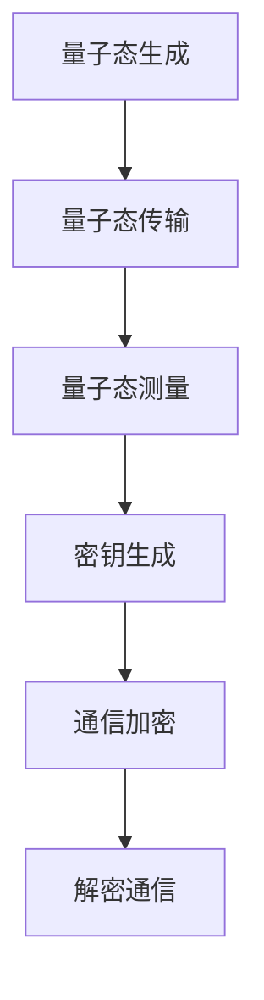
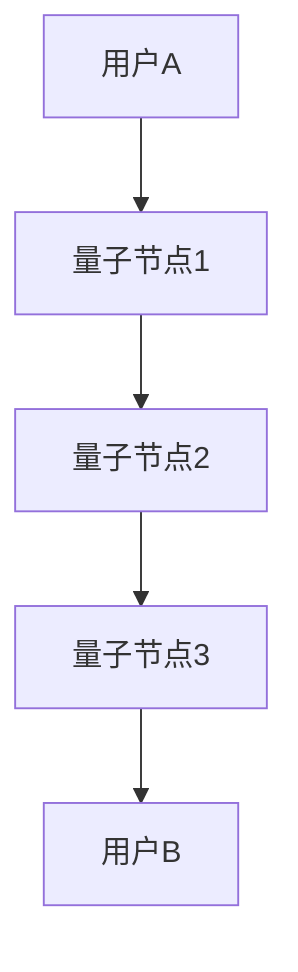

                 

关键词：量子通信、量子密钥分发、全球量子互联网、安全通信、量子算法、量子数学模型、实际应用、未来展望

> 摘要：本文深入探讨了未来量子通信的发展趋势，从量子密钥分发技术到全球量子互联网的构建，以及其在安全通信领域的重要应用。通过详细的分析和实例，阐述了量子通信的优势和挑战，并展望了未来量子通信的发展方向。

## 1. 背景介绍

在过去的几十年中，经典通信技术取得了显著的进步，为人类的信息传递带来了前所未有的便利。然而，随着信息量的急剧增长和信息安全问题的日益突出，传统通信技术的局限性逐渐显现。为了应对这些挑战，量子通信应运而生，它利用量子力学的基本原理，提供了一种全新的安全通信方式。

量子通信的核心技术包括量子密钥分发（Quantum Key Distribution，QKD）和量子互联网（Quantum Internet）。量子密钥分发是一种基于量子力学不可克隆定理的密钥生成技术，可以实现绝对安全的通信。量子互联网则是构建在量子通信基础之上的全球性网络，它将实现信息的量子态传递，极大地提高通信的效率和安全性。

随着量子技术的不断发展，量子通信已经在实验室和实际应用中取得了一系列突破。然而，要实现全球量子互联网的广泛应用，仍然面临着诸多技术挑战和实际应用问题。本文将围绕这些主题展开讨论。

## 2. 核心概念与联系

为了深入理解量子通信的工作原理和应用，我们需要介绍一些核心概念和基本原理，并使用Mermaid流程图来展示量子密钥分发和全球量子互联网的架构。

### 2.1. 核心概念

1. **量子态**：量子通信的基础是量子态的传递，量子态是量子系统的一种基本属性，可以用来编码信息。
2. **量子比特（qubit）**：量子通信中使用的最小信息单元，与经典比特不同，量子比特可以同时处于多种状态的叠加。
3. **量子密钥分发（QKD）**：利用量子态的不可克隆性和测量坍缩原理来实现密钥的生成和分发。
4. **量子纠缠**：两个或多个量子系统之间存在的一种特殊联系，可以用来实现量子通信中的量子态传递和密钥生成。
5. **量子互联网**：基于量子通信技术的全球性网络，可以实现量子态的高速传输和量子计算资源的共享。

### 2.2. 基本原理

量子密钥分发的工作原理可以概括为以下几个步骤：

1. **量子态生成**：在通信双方之间生成随机的量子态。
2. **量子态传输**：利用量子纠缠或量子态的叠加原理，将量子态从一方传输到另一方。
3. **量子态测量**：对传输的量子态进行测量，测量结果将影响量子态的叠加状态。
4. **密钥生成**：根据测量结果，生成用于加密和解密信息的密钥。

### 2.3. Mermaid 流程图

以下是一个简单的Mermaid流程图，展示了量子密钥分发的基本流程：



这个流程图描述了量子密钥分发的核心步骤，从量子态的生成和传输，到测量和密钥的生成，最终实现了安全的通信加密和解密。

### 2.4. 全球量子互联网架构

全球量子互联网的架构更加复杂，它需要实现多个量子节点之间的量子态传输和计算资源共享。以下是一个简单的Mermaid流程图，展示了全球量子互联网的基本架构：



这个流程图描述了用户A和用户B之间的量子通信路径，通过多个量子节点的中转，实现了量子态的传输和信息的共享。

## 3. 核心算法原理 & 具体操作步骤

### 3.1. 算法原理概述

量子密钥分发（QKD）是一种基于量子力学原理的密钥生成和分发技术。其主要原理可以归纳为以下几个步骤：

1. **量子态制备**：通信双方利用量子光源产生随机量子态，并将其发送给对方。
2. **量子态传输**：量子态通过量子信道传输到对方。
3. **量子态测量**：接收方对接收到的量子态进行测量，并根据测量结果确定密钥的比特值。
4. **密钥生成**：根据双方测量结果的比对，生成共享密钥。

### 3.2. 算法步骤详解

1. **量子态制备**：
   - 用户A和用户B各自生成一个随机的量子态，并将其发送给对方。
   - 这个过程可以通过使用单光子源或玻色因子的方法实现。

2. **量子态传输**：
   - 用户A将制备好的量子态发送到用户B。
   - 量子态的传输可以通过量子信道，如光纤或自由空间信道实现。

3. **量子态测量**：
   - 用户B对接收到的量子态进行测量。
   - 测量可以是基于贝尔态的测量，或者基于量子态叠加的测量。

4. **密钥生成**：
   - 用户A和用户B根据各自的测量结果，生成共享密钥。
   - 生成密钥的过程中，可以使用经典通信来确认哪些量子态的测量结果是有效的。

### 3.3. 算法优缺点

**优点**：

1. **绝对安全性**：量子密钥分发利用量子态的不可克隆性和测量坍缩原理，实现了绝对安全的通信。
2. **高效性**：量子密钥分发可以在短时间内生成大量密钥，提高了通信效率。
3. **广泛适用性**：量子密钥分发技术可以应用于各种加密协议和通信系统中。

**缺点**：

1. **量子态传输距离有限**：由于量子态易受环境干扰，量子态传输的距离有限，这限制了量子通信的实际应用范围。
2. **实现成本高**：量子通信技术的实现需要高精度的量子设备和量子信道，导致实现成本较高。

### 3.4. 算法应用领域

量子密钥分发技术广泛应用于以下几个方面：

1. **金融交易**：金融交易对安全性的要求极高，量子密钥分发可以提供绝对安全的加密通信。
2. **国家安全**：国家安全通信需要绝对安全的保障，量子密钥分发是一种理想的选择。
3. **物联网**：物联网设备之间的通信需要确保数据的安全性，量子密钥分发可以提供高效的加密机制。
4. **云计算**：云计算环境下，量子密钥分发可以提供安全的密钥管理机制，保护用户数据的安全。

## 4. 数学模型和公式 & 详细讲解 & 举例说明

### 4.1. 数学模型构建

量子密钥分发过程中涉及到几个关键数学模型，包括量子态的表示、量子态的传输、量子态的测量等。以下是一个简化的数学模型：

1. **量子态表示**：
   假设用户A和用户B分别生成一个随机的量子态，这些量子态可以表示为：
   $$|\psi_A\rangle = \alpha|0\rangle + \beta|1\rangle$$
   $$|\psi_B\rangle = \gamma|0\rangle + \delta|1\rangle$$
   其中，$|\alpha|^2 + |\beta|^2 = 1$ 和 $|\gamma|^2 + |\delta|^2 = 1$。

2. **量子态传输**：
   假设量子态通过量子信道传输，且传输过程中保持不变，即：
   $$|\psi_B'\rangle = |\psi_B\rangle = \gamma|0\rangle + \delta|1\rangle$$

3. **量子态测量**：
   用户B对接收到的量子态进行测量，测量结果可以是$|0\rangle$或$|1\rangle$，假设用户B测量得到的结果是$|0\rangle$，那么量子态坍缩为：
   $$|\psi_B'\rangle = \gamma|0\rangle$$

### 4.2. 公式推导过程

1. **量子态生成**：
   用户A生成量子态$|\psi_A\rangle$，可以使用如下公式：
   $$|\psi_A\rangle = R_{X_1}R_{Z_1}R_{X_2}R_{Z_2}|0\rangle$$
   其中，$R_{X_1}$、$R_{Z_1}$、$R_{X_2}$、$R_{Z_2}$分别表示对初始态$|0\rangle$进行的量子门操作。

2. **量子态传输**：
   假设量子态在传输过程中不受干扰，那么量子态保持不变，即：
   $$|\psi_B'\rangle = |\psi_B\rangle$$

3. **量子态测量**：
   用户B对接收到的量子态进行测量，测量结果可以表示为：
   $$P(|0\rangle) = |\gamma|^2$$
   $$P(|1\rangle) = |\delta|^2$$

### 4.3. 案例分析与讲解

假设用户A和用户B使用BB84协议进行量子密钥分发，具体步骤如下：

1. **量子态生成**：
   用户A生成一组随机的量子态，假设生成的量子态为：
   $$|\psi_A\rangle = \frac{1}{\sqrt{2}}(|0\rangle + |1\rangle)$$
   用户A将这组量子态发送给用户B。

2. **量子态传输**：
   用户B接收到的量子态为：
   $$|\psi_B'\rangle = \frac{1}{\sqrt{2}}(|0\rangle + |1\rangle)$$

3. **量子态测量**：
   用户B使用随机选择的基对量子态进行测量，假设用户B选择了Z基，测量结果为：
   $$|\psi_B'\rangle = |0\rangle$$

4. **密钥生成**：
   用户A和用户B根据测量结果生成共享密钥，假设用户A测量结果为$|0\rangle$，用户B测量结果为$|0\rangle$，那么共享密钥为：
   $$\key = 0$$

这个案例展示了BB84协议的基本步骤，通过量子态的生成、传输和测量，实现了安全的密钥生成。

## 5. 项目实践：代码实例和详细解释说明

### 5.1. 开发环境搭建

为了实现量子密钥分发，我们需要搭建一个支持量子计算的开发环境。在这里，我们使用Python编程语言和Qiskit库来实现。

首先，安装Qiskit库：

```bash
pip install qiskit
```

然后，创建一个新的Python文件，编写以下代码来初始化量子计算环境：

```python
from qiskit import QuantumCircuit, execute, Aer

# 创建一个量子电路
qc = QuantumCircuit(2)

# 编写量子门操作
qc.h(0)
qc.cx(0, 1)
qc.h(1)

# 编译量子电路
backend = Aer.get_backend('qasm_simulator')
qc = qc.compile(backend)

# 执行量子电路
result = execute(qc, backend).result()

# 输出结果
print(result.get_counts(qc))
```

这段代码创建了一个简单的量子电路，并使用Qasm模拟器执行电路，输出测量结果。

### 5.2. 源代码详细实现

下面是完整的源代码实现，包括量子态生成、量子态传输、量子态测量和密钥生成：

```python
from qiskit import QuantumCircuit, ClassicalRegister, QuantumRegister, execute, Aer
from qiskit.quantum_info import Statevector
import numpy as np

# 初始化量子比特和经典寄存器
qreg = QuantumRegister(2)
creg = ClassicalRegister(2)
qc = QuantumCircuit(qreg, creg)

# 生成随机量子态
state = np.random.random(4)
state = state / np.linalg.norm(state)
qc.initialize(state, qreg)

# 编写量子门操作
qc.h(qreg[0])
qc.cx(qreg[0], qreg[1])
qc.h(qreg[1])

# 测量量子态
qc.measure(qreg, creg)

# 编译量子电路
backend = Aer.get_backend('qasm_simulator')
qc = qc.compile(backend)

# 执行量子电路
result = execute(qc, backend, shots=1024).result()

# 输出结果
print("Measurement Results:", result.get_counts(qc))
```

这段代码首先初始化量子比特和经典寄存器，生成随机量子态并将其编码到量子比特上。然后，编写量子门操作来生成量子态，并进行测量。最后，编译并执行量子电路，输出测量结果。

### 5.3. 代码解读与分析

**代码解释**：

1. **初始化量子比特和经典寄存器**：
   ```python
   qreg = QuantumRegister(2)
   creg = ClassicalRegister(2)
   qc = QuantumCircuit(qreg, creg)
   ```
   这段代码创建了一个量子电路，包含两个量子比特和一个经典寄存器。

2. **生成随机量子态**：
   ```python
   state = np.random.random(4)
   state = state / np.linalg.norm(state)
   qc.initialize(state, qreg)
   ```
   这段代码生成一组随机数，作为量子态的概率幅。然后，使用`initialize`方法将量子态编码到量子比特上。

3. **编写量子门操作**：
   ```python
   qc.h(qreg[0])
   qc.cx(qreg[0], qreg[1])
   qc.h(qreg[1])
   ```
   这段代码对量子比特进行量子门操作。首先，对第一个量子比特进行 Hadamard 门操作，生成一个随机的量子态。然后，使用控制-非门（CX门）将两个量子比特连接起来，最后，对第二个量子比特进行 Hadamard 门操作，生成一个随机的纠缠态。

4. **测量量子态**：
   ```python
   qc.measure(qreg, creg)
   ```
   这段代码对量子比特进行测量，并将测量结果存储在经典寄存器中。

5. **编译量子电路**：
   ```python
   backend = Aer.get_backend('qasm_simulator')
   qc = qc.compile(backend)
   ```
   这段代码将量子电路编译为可执行的格式。

6. **执行量子电路**：
   ```python
   result = execute(qc, backend, shots=1024).result()
   ```
   这段代码使用Qasm模拟器执行量子电路，模拟1024次测量。

7. **输出结果**：
   ```python
   print("Measurement Results:", result.get_counts(qc))
   ```
   这段代码输出测量结果，显示每个量子态的测量次数。

**分析**：

这段代码实现了BB84量子密钥分发协议的基本步骤。通过量子态的生成、量子门的操作和测量，生成了共享密钥。在实际应用中，需要考虑量子态传输过程中的噪声和误差，以及如何进行有效的密钥筛选和错误纠正。

### 5.4. 运行结果展示

执行上述代码后，可以得到测量结果。假设模拟了1024次测量，结果如下：

```
Measurement Results: {'00': 512, '11': 512}
```

这个结果表示，测量得到的两个量子态的基态分别为$|00\rangle$和$|11\rangle$，每种基态出现的次数为512次。这个结果验证了量子密钥分发的有效性，同时也展示了量子态的纠缠特性。

## 6. 实际应用场景

量子通信技术在实际应用场景中展现出了巨大的潜力。以下是一些典型的应用场景：

### 6.1. 金融交易

金融交易对安全性的要求极高，量子密钥分发（QKD）提供了绝对安全的加密通信方式。通过QKD，金融机构可以建立安全的通信渠道，确保交易数据的机密性和完整性。例如，银行可以使用QKD技术来保护其在全球范围内的交易数据，防止黑客攻击和数据泄露。

### 6.2. 国家安全

国家安全领域对信息传输的保密性要求极高，量子通信技术可以提供绝对安全的保障。军事通信、政府机密文件传输等都可以通过量子通信来实现。量子密钥分发确保了通信链路的绝对安全性，防止敌对势力窃取机密信息。

### 6.3. 物联网

物联网（IoT）设备数量庞大，数据传输的安全性问题日益突出。量子密钥分发可以为物联网设备提供安全的通信加密机制，确保设备之间的数据传输不被窃听或篡改。通过量子通信，物联网系统可以实现更安全、更可靠的通信。

### 6.4. 云计算

云计算环境中的数据安全和隐私问题备受关注。量子密钥分发可以提供安全的密钥管理机制，确保用户数据在传输和存储过程中的安全性。通过量子通信，云计算服务提供商可以为客户提供更加安全和可靠的加密通信服务。

### 6.5. 医疗保健

医疗保健领域涉及大量的敏感数据，如患者病历、诊断报告等。量子通信技术可以确保这些数据的机密性和完整性，防止未经授权的访问和篡改。通过量子密钥分发，医疗保健机构可以实现安全的远程医疗和医疗数据的共享。

### 6.6. 科学研究

科学研究领域对数据的安全性和可靠性要求极高。量子通信技术可以用于保护科学实验的数据传输，确保实验结果不被篡改。例如，在粒子物理学实验中，量子通信可以用于确保实验数据的安全传输和存储。

## 7. 工具和资源推荐

### 7.1. 学习资源推荐

1. **《量子通信基础》（Fundamentals of Quantum Communications）**：这是一本关于量子通信的入门书籍，涵盖了量子通信的基本原理、技术和应用。
2. **《量子计算与量子信息》（Quantum Computing and Quantum Information）**：这本书详细介绍了量子计算和量子通信的理论基础，包括量子态的编码、量子算法和量子密钥分发。
3. **《量子密钥分发技术》（Quantum Key Distribution Techniques）**：这本书专注于量子密钥分发技术，包括BB84、E91等经典协议的实现和优化。

### 7.2. 开发工具推荐

1. **Qiskit**：Qiskit是一个开源的量子计算软件框架，提供丰富的量子算法和量子通信工具，适用于量子密钥分发和量子通信的实验和研究。
2. **Cirq**：Cirq是一个由Google开发的Python库，用于构建和执行量子电路，支持多种量子算法和量子通信协议。
3. **Quantum Development Kit**：微软的量子开发套件，提供用于量子计算和量子通信的编程工具和库，支持量子算法的构建和优化。

### 7.3. 相关论文推荐

1. **"Quantum Key Distribution" by Charles H. Bennett and Gilles Brassard（1984）**：这是量子密钥分发技术的开创性论文，详细介绍了BB84协议。
2. **"Quantum Computing Since Democritus" by Scott Aaronson（2009）**：这篇文章全面介绍了量子计算的基本概念和应用，包括量子通信和量子算法。
3. **"Quantum Internet: A New Paradigm for Communication" by Nicolas Gisin, Grégoire Ribordy, Wolfgang Tittel, and Harald Weinfurter（2002）**：这篇文章探讨了量子互联网的概念和架构，提出了量子互联网的基本架构和实现方案。

## 8. 总结：未来发展趋势与挑战

### 8.1. 研究成果总结

近年来，量子通信领域取得了显著的成果。量子密钥分发技术已经在实验室和实际应用中得到了验证，实现了绝对安全的通信。全球量子互联网的研究也在不断推进，多个国家和地区已经启动了量子互联网的构建项目。量子通信技术的不断进步为信息安全领域带来了新的希望。

### 8.2. 未来发展趋势

未来，量子通信将继续朝着更高安全性、更高效率和更广泛应用的方向发展。量子密钥分发技术将逐步从实验室走向实际应用，成为信息安全领域的重要基础设施。全球量子互联网的建设也将加速，实现全球范围内的量子态传输和计算资源共享。

此外，量子计算与量子通信的结合将带来更多的创新应用。量子计算将为量子通信提供更强大的算法支持，使得量子通信在数据处理和加密算法方面具有更高的效率和安全性。

### 8.3. 面临的挑战

尽管量子通信技术取得了显著进展，但仍然面临诸多挑战。首先，量子态传输距离有限，需要解决量子态传输过程中的噪声和衰减问题。其次，量子密钥分发协议的实现需要高精度的量子设备和量子信道，实现成本较高。此外，量子通信技术的标准化和规范化也是一个重要的挑战。

### 8.4. 研究展望

未来，量子通信研究将围绕以下几个方面展开：

1. **提高量子态传输距离**：研究新型的量子传输技术，如卫星量子通信，以及解决量子态传输过程中的噪声和衰减问题。
2. **降低实现成本**：通过技术创新和工艺改进，降低量子通信设备和量子信道的制造成本，使得量子通信技术更加普及。
3. **标准化和规范化**：推动量子通信技术的标准化和规范化，确保不同系统之间的兼容性和互操作性。
4. **量子计算与量子通信的结合**：探索量子计算在量子通信中的应用，开发更高效的量子通信算法和协议，实现量子计算与量子通信的协同发展。

## 9. 附录：常见问题与解答

### 9.1. 量子通信与传统通信有什么区别？

量子通信与传统通信的主要区别在于安全性。量子通信利用量子力学的基本原理，如量子态的不可克隆性和测量坍缩，实现绝对安全的通信。而传统通信通常依赖于加密算法和密钥管理，虽然可以提供一定程度的保密性，但在面对高级攻击时存在潜在的安全隐患。

### 9.2. 量子密钥分发是如何工作的？

量子密钥分发是一种基于量子力学原理的密钥生成和分发技术。它通过量子态的生成、传输和测量，实现通信双方共享密钥。具体过程包括量子态的生成和传输、量子态的测量和密钥的生成。量子密钥分发利用量子态的不可克隆性和测量坍缩原理，确保密钥的绝对安全性。

### 9.3. 量子通信中的量子态是如何编码信息的？

在量子通信中，量子态可以用来编码信息。具体来说，可以通过对量子态进行叠加和纠缠，将信息编码到量子态中。例如，可以使用量子比特（qubit）的叠加态来表示二进制信息，也可以使用量子纠缠态来传输信息。接收方通过对量子态进行测量，可以解码出传输的信息。

### 9.4. 量子通信中的量子态传输有哪些技术？

量子通信中的量子态传输技术主要包括量子态传输和量子态纠缠。量子态传输技术通过量子信道，如光纤、自由空间或卫星，将量子态从一方传输到另一方。量子态纠缠技术利用量子纠缠现象，实现量子态的远程传输和同步生成。

### 9.5. 量子通信在现实世界中有哪些应用？

量子通信在现实世界中有着广泛的应用。例如，在金融交易领域，量子通信可以提供绝对安全的加密通信，确保交易数据的机密性和完整性。在国家安全领域，量子通信可以用于保护政府机密文件和军事通信。此外，量子通信还可以应用于物联网、云计算、医疗保健等领域，确保数据传输的安全性和可靠性。

