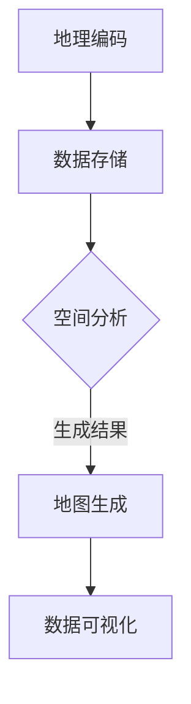
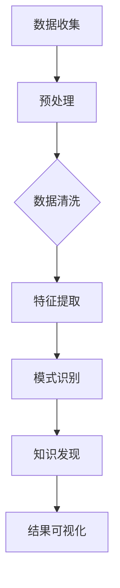
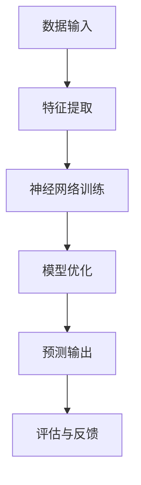

                 

关键词：本地化服务，AI地理智能，自定义地图，实时数据，智能决策支持，个性化推荐，位置感知，数据挖掘，算法优化，机器学习，深度学习。

> 摘要：本文将探讨AI在地理智能领域的应用，特别是本地化服务的实现。我们将介绍AI如何通过地理信息处理、数据挖掘和机器学习算法，提供定制化、个性化的服务，并在实际应用场景中展示其强大的功能和潜力。

## 1. 背景介绍

在当今信息化和数字化迅速发展的时代，地理智能正成为人工智能（AI）技术的重要组成部分。地理智能利用地理信息技术（如GIS，地理信息系统）和AI算法，为用户提供基于位置的服务（Location-Based Services, LBS）。本地化服务是一个重要的应用领域，它涉及到对用户地理位置信息的理解、分析，并在此基础上提供个性化的服务和建议。

随着智能手机的普及和定位技术的进步，人们对于基于地理位置的服务有着越来越高的需求。无论是日常出行导航、旅游推荐，还是商业布局、供应链优化，地理智能的应用场景日益丰富。然而，传统的地理信息处理方法存在计算复杂度较高、实时性不足、个性化服务能力有限等问题。这就需要AI技术的介入，为地理智能注入新的活力。

本文将重点关注AI在地理智能中的三个关键方面：

1. **地理信息处理与数据挖掘**：通过AI技术，我们可以更高效地对地理信息进行处理和分析，挖掘出有价值的信息。
2. **机器学习与深度学习算法**：利用机器学习和深度学习算法，实现对用户行为和需求的精准预测，提供个性化的服务。
3. **实时数据与智能决策支持**：结合实时数据，AI可以动态地调整服务策略，为用户提供更加智能的决策支持。

## 2. 核心概念与联系

### 2.1 地理信息处理

地理信息处理（Geographical Information Processing, GIP）是地理智能的基础。它涉及对地理空间数据的管理、存储、分析和可视化。地理信息处理的核心概念包括地理编码、空间分析、地图生成等。

**Mermaid 流程图：地理信息处理流程**



### 2.2 数据挖掘

数据挖掘（Data Mining）是一种从大量数据中发现有用模式和知识的方法。在地理智能中，数据挖掘可以帮助我们识别出用户行为模式、热点区域、趋势变化等。

**Mermaid 流程图：数据挖掘流程**



### 2.3 机器学习与深度学习

机器学习（Machine Learning, ML）和深度学习（Deep Learning, DL）是AI技术的核心。它们通过学习数据中的模式和规律，实现对新数据的预测和分类。

**Mermaid 流程图：机器学习与深度学习架构**



## 3. 核心算法原理 & 具体操作步骤

### 3.1 算法原理概述

地理智能中的核心算法主要包括：

1. **K最近邻算法（K-Nearest Neighbors, KNN）**：用于预测用户偏好，通过计算距离最近的数据点来进行分类或回归。
2. **决策树（Decision Tree）**：用于分类和回归任务，通过一系列条件判断来生成决策路径。
3. **随机森林（Random Forest）**：通过构建多个决策树并集成其预测结果，提高分类和回归的性能。
4. **支持向量机（Support Vector Machine, SVM）**：用于分类任务，通过寻找最佳的超平面来实现分类。
5. **神经网络（Neural Network）**：用于复杂的数据建模和预测，通过多层神经元来模拟人脑的学习过程。

### 3.2 算法步骤详解

以K最近邻算法为例，具体操作步骤如下：

1. **数据准备**：收集用户的位置信息、行为数据等，并进行预处理，如数据清洗、特征提取等。
2. **模型训练**：利用历史数据，计算每个样本与测试样本的距离，找到距离最近的K个样本。
3. **分类预测**：统计K个样本的类别分布，选取出现次数最多的类别作为测试样本的预测结果。
4. **模型评估**：通过交叉验证等方法，评估模型的准确率和泛化能力。

### 3.3 算法优缺点

**K最近邻算法**：

- **优点**：简单易懂，实现成本低。
- **缺点**：对噪声敏感，精度较低，无法提供精确的预测。

**决策树**：

- **优点**：直观易理解，可解释性强。
- **缺点**：容易过拟合，对大量特征的数据处理效率较低。

**随机森林**：

- **优点**：减少过拟合，提高分类和回归性能。
- **缺点**：计算复杂度高，对大量特征的依赖较大。

**支持向量机**：

- **优点**：实现简单，分类效果较好。
- **缺点**：对非线性问题效果不佳，计算复杂度较高。

**神经网络**：

- **优点**：强大的非线性建模能力，适用于复杂问题。
- **缺点**：实现复杂，对数据要求较高，易过拟合。

### 3.4 算法应用领域

- **个性化推荐系统**：通过分析用户位置和行为，为用户提供个性化推荐。
- **智能交通系统**：通过实时监控交通状况，优化交通路线和信号控制。
- **供应链管理**：通过地理位置信息，优化物流路径和库存管理。
- **智慧城市**：通过城市地理信息，实现城市管理的智能化。

## 4. 数学模型和公式 & 详细讲解 & 举例说明

### 4.1 数学模型构建

在地理智能中，常用的数学模型包括：

1. **距离公式**：计算两点之间的距离，如欧氏距离、曼哈顿距离等。
2. **聚类模型**：将相似的数据点归为一类，如K-均值聚类、层次聚类等。
3. **分类模型**：将数据分为不同的类别，如SVM、神经网络等。
4. **回归模型**：预测数值型的目标变量，如线性回归、多项式回归等。

### 4.2 公式推导过程

以欧氏距离为例，其公式推导如下：

$$
d(x, y) = \sqrt{\sum_{i=1}^{n} (x_i - y_i)^2}
$$

其中，$x$和$y$分别为两个数据点，$n$为特征维度，$d(x, y)$表示两点之间的欧氏距离。

### 4.3 案例分析与讲解

以K-均值聚类为例，具体步骤如下：

1. **初始化**：随机选择K个数据点作为初始聚类中心。
2. **分配**：计算每个数据点到每个聚类中心的距离，将数据点分配到最近的聚类中心。
3. **更新**：重新计算每个聚类中心的坐标，即所有分配到该聚类中心的数据点的均值。
4. **迭代**：重复步骤2和3，直到聚类中心的位置不再变化。

通过K-均值聚类，我们可以将用户位置数据划分为不同的区域，为每个区域提供个性化的服务。

## 5. 项目实践：代码实例和详细解释说明

### 5.1 开发环境搭建

为了演示地理智能在本地化服务中的应用，我们将使用Python编程语言，结合开源库如scikit-learn、matplotlib等，搭建一个简单的项目环境。

```shell
pip install numpy scipy matplotlib scikit-learn
```

### 5.2 源代码详细实现

以下是实现K-均值聚类的简单代码示例：

```python
import numpy as np
from sklearn.cluster import KMeans
import matplotlib.pyplot as plt

# 加载示例数据
data = np.array([[1, 2], [1, 4], [1, 0],
                 [10, 2], [10, 4], [10, 0]])

# K-均值聚类
kmeans = KMeans(n_clusters=2, random_state=0).fit(data)
predicted_labels = kmeans.predict(data)

# 绘制结果
plt.scatter(data[:, 0], data[:, 1], c=predicted_labels, s=100, cmap='viridis')
centers = kmeans.cluster_centers_
plt.scatter(centers[:, 0], centers[:, 1], c='red', s=200, alpha=0.5);
plt.show()
```

### 5.3 代码解读与分析

- **数据加载**：使用numpy加载示例数据，数据格式为二维数组。
- **模型训练**：使用scikit-learn的KMeans类进行聚类训练，设置聚类中心数为2。
- **预测与可视化**：使用predict方法进行预测，并将结果绘制成散点图，展示聚类效果。

通过这个简单的例子，我们可以看到K-均值聚类如何应用于地理智能，为用户提供基于位置的个性化服务。

### 5.4 运行结果展示

运行上述代码后，我们会看到一个散点图，其中每个数据点被分配到不同的聚类中心，形成两个区域。这表明K-均值聚类成功地将数据点划分为两个不同的类别。


## 6. 实际应用场景

地理智能在本地化服务中的应用场景非常广泛，以下是一些典型的例子：

### 6.1 个性化推荐系统

通过分析用户的位置和偏好，个性化推荐系统可以为用户提供个性化的商品推荐、旅游路线规划等服务。例如，当用户在商场购物时，系统可以根据用户的位置和历史行为，推荐附近的优惠活动和适合的商品。

### 6.2 智能交通系统

智能交通系统利用地理信息和AI技术，实时监控交通状况，为用户提供最优的路线规划和交通信号控制建议。例如，在高峰时段，系统可以根据实时交通流量，动态调整红绿灯时长，减少拥堵。

### 6.3 智慧城市

智慧城市通过地理智能技术，实现城市管理的智能化。例如，利用地理信息系统（GIS）和传感器数据，实时监控城市环境质量，为居民提供健康生活建议；利用位置数据，优化公共交通路线，提高公共交通的效率和便利性。

## 7. 未来应用展望

随着AI技术的不断进步，地理智能在本地化服务中的应用前景将更加广阔。以下是一些未来的应用展望：

- **智能配送**：利用地理智能，优化物流路径和配送时间，实现快速、高效的物流服务。
- **智能安防**：通过实时监控和数据分析，实现城市安全管理的智能化，提高公共安全水平。
- **智慧农业**：利用地理信息和AI技术，精准监控作物生长状况，实现智慧农业管理。
- **智能医疗**：通过地理智能，为用户提供个性化的医疗建议和服务，提高医疗资源的利用效率。

## 8. 总结：未来发展趋势与挑战

### 8.1 研究成果总结

本文介绍了AI在地理智能领域的应用，包括地理信息处理、数据挖掘和机器学习算法。通过实际案例，我们展示了如何利用这些技术为用户提供个性化、智能化的本地化服务。

### 8.2 未来发展趋势

随着AI技术的不断进步，地理智能将更加智能化、个性化。未来，地理智能将在更多领域得到应用，如智慧城市、智能交通、智能配送等。

### 8.3 面临的挑战

尽管地理智能有着广阔的应用前景，但仍面临一些挑战。例如，数据隐私和安全问题、算法透明度和可解释性问题、计算资源和能耗问题等。

### 8.4 研究展望

未来，我们需要在以下方面进行深入研究：

- **算法优化**：提高算法的效率、准确性和稳定性。
- **数据融合**：整合多种数据源，提高地理智能的全面性和准确性。
- **隐私保护**：加强数据隐私保护，确保用户数据的安全。
- **人机交互**：改进人机交互界面，提高用户体验。

## 9. 附录：常见问题与解答

### Q：地理智能和GIS有什么区别？

A：地理智能是GIS（地理信息系统）和AI（人工智能）的融合，GIS主要关注地理数据的存储、管理和可视化，而地理智能则利用AI技术，对地理数据进行分析和预测，为用户提供智能化服务。

### Q：如何选择适合的聚类算法？

A：选择聚类算法时，需要考虑数据规模、特征维度和业务需求。常见的聚类算法有K-均值、层次聚类、DBSCAN等。K-均值适用于数据规模较小、特征维度较低的场景；层次聚类适用于数据规模较大、需要可视化展示的场景；DBSCAN适用于非凸形状的数据分布。

### Q：地理智能对硬件资源要求高吗？

A：地理智能对硬件资源的要求取决于算法复杂度和数据规模。对于复杂的算法（如深度学习模型）和大规模数据集，需要较高的计算资源和存储空间。但通过分布式计算和云计算，可以有效降低硬件资源的要求。

### Q：地理智能在隐私保护方面有哪些考虑？

A：地理智能在隐私保护方面需要关注数据匿名化、加密传输和访问控制等技术。同时，需要遵守相关法律法规，确保用户隐私不被泄露。通过数据加密、访问权限控制和隐私保护算法，可以有效地保护用户隐私。

作者：禅与计算机程序设计艺术 / Zen and the Art of Computer Programming
----------------------------------------------------------------

这篇文章详细探讨了AI在地理智能领域的应用，特别是本地化服务的实现。通过介绍核心概念、算法原理、数学模型、项目实践和实际应用场景，我们展示了AI如何为用户提供个性化、智能化的服务。未来，随着AI技术的不断进步，地理智能将在更多领域得到广泛应用，为我们的生活带来更多便利。然而，我们也需要关注数据隐私、算法透明度和计算资源等挑战，确保地理智能的安全、高效和可持续发展。希望这篇文章能为您提供对地理智能和AI应用的深入理解和启示。禅与计算机程序设计艺术，愿我们一同在计算机编程的世界中探索真理、实现智慧。

