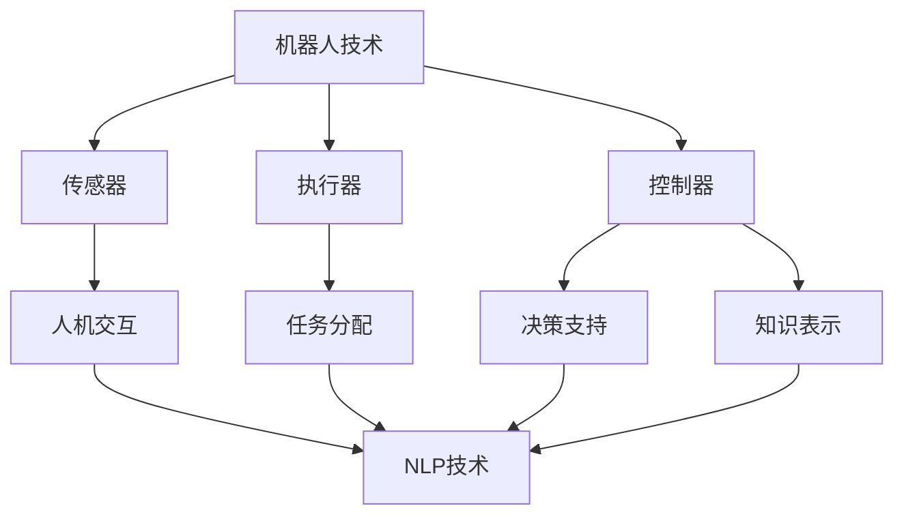

                 

关键词：机器人技术，自然语言处理，生成式AI，智能自动化，机器学习，深度学习，聊天机器人，自动化流程，任务分配，协作系统，人机交互，智能助手，工业4.0，服务机器人，智能合约，自动驾驶，人机协作。

> 摘要：本文将深入探讨机器人技术和自然语言处理（NLP）的结合，特别是生成式AI（LLM）在智能自动化领域的应用。通过剖析核心概念、算法原理、数学模型、项目实践和实际应用场景，本文旨在为读者提供一个全面的技术视角，探讨如何利用先进的AI技术打造智能自动化系统，并展望其未来的发展趋势和挑战。

## 1. 背景介绍

随着人工智能技术的快速发展，机器人技术正逐步融入各行各业，从制造业到服务业，从家庭生活到医疗健康，都展现出巨大的潜力。与此同时，自然语言处理（NLP）技术的进步，特别是生成式AI（LLM）的出现，使得人机交互更加自然、直观。这两大技术的结合，正在推动智能自动化的发展，为人类带来前所未有的便利。

### 1.1 机器人技术的发展

机器人技术起源于20世纪中期，早期主要集中在工业制造领域，用于替代人工作业。随着计算机科学、自动化技术、控制理论等学科的发展，机器人技术逐渐扩展到多个领域，如服务机器人、医疗机器人、农业机器人等。现代机器人不仅具备机械操作能力，还可以通过传感器和AI算法实现智能感知和决策，从而实现更高水平的自动化。

### 1.2 自然语言处理和生成式AI的发展

自然语言处理（NLP）是计算机科学和人工智能领域的一个重要分支，旨在让计算机理解和处理人类语言。从早期的规则驱动方法到现代的基于深度学习的神经网络模型，NLP技术取得了显著的进步。特别是生成式AI（LLM），如GPT、BERT等模型，通过大量的语料训练，可以生成高质量的文本，实现与人类的自然交流。

### 1.3 智能自动化的应用场景

智能自动化是机器人技术和NLP技术相结合的产物，广泛应用于以下几个方面：

- **工业自动化**：在制造业中，机器人可以执行焊接、组装、搬运等重复性工作，提高生产效率和产品质量。

- **服务自动化**：在酒店、餐饮、零售等行业，机器人可以提供导览、送餐、清洁等服务，降低人力成本，提高服务质量。

- **医疗自动化**：在医疗领域，机器人可以辅助医生进行手术、检查、护理等工作，提高医疗精度和安全性。

- **智能家居**：在家庭生活中，智能助手可以控制家电设备、安全系统、健康监测等，提升生活便利性。

- **交通自动化**：在交通运输领域，自动驾驶汽车、无人机等智能交通工具正在逐步应用，改善交通效率和安全性。

## 2. 核心概念与联系

为了更好地理解机器人技术和NLP的结合，我们首先需要明确一些核心概念和它们之间的关系。

### 2.1 机器人技术的核心概念

- **机器人**：一种能够执行特定任务的电子设备，具备感知、决策和执行能力。

- **传感器**：用于感知环境的设备，如摄像头、触摸传感器、温度传感器等。

- **执行器**：用于执行机器人任务的设备，如电机、液压系统、机械臂等。

- **控制器**：负责处理传感器输入，生成控制指令的设备，通常采用计算机硬件和软件实现。

### 2.2 自然语言处理的核心概念

- **自然语言**：人类在日常交流中所使用的语言，包括口语和书面语。

- **文本**：由一系列字符组成的序列，是自然语言的基本单位。

- **词法分析**：将文本分解为单词、短语等基本单元的过程。

- **语法分析**：分析文本的结构，确定其语法规则的过程。

- **语义分析**：理解文本的含义，确定其语义内容的过程。

- **生成式AI**：一种能够生成文本、图像、音频等数据的AI模型，如GPT、BERT等。

### 2.3 机器人技术和NLP技术的联系

机器人技术和NLP技术之间的联系主要体现在以下几个方面：

- **人机交互**：通过NLP技术，机器人可以理解和处理人类语言，实现与用户的自然交流。

- **任务分配**：基于NLP技术的语音识别和语义理解，机器人可以理解用户的指令，将其转化为具体的操作任务。

- **决策支持**：通过NLP技术，机器人可以获取和处理文本信息，为决策过程提供支持。

- **知识表示**：利用NLP技术，可以将人类知识转化为机器可理解的形式，供机器人学习和使用。

### 2.4 Mermaid 流程图

下面是一个简单的 Mermaid 流程图，展示了机器人技术和NLP技术的核心概念及其联系：



## 3. 核心算法原理 & 具体操作步骤

### 3.1 算法原理概述

智能自动化系统的核心算法主要包括以下几部分：

- **机器人控制算法**：用于实现机器人的感知、决策和执行功能。

- **自然语言处理算法**：用于实现人机交互、任务分配和知识表示。

- **生成式AI算法**：用于生成高质量的文本、图像、音频等数据。

### 3.2 算法步骤详解

#### 3.2.1 机器人控制算法

1. **感知阶段**：机器人通过传感器获取环境信息，如摄像头、激光雷达等。

2. **特征提取**：对感知到的信息进行特征提取，如图像的边缘检测、声音的频谱分析等。

3. **决策阶段**：基于特征信息和预设的目标，机器人计算出最佳行动方案。

4. **执行阶段**：机器人根据决策方案执行具体任务，如机械臂的移动、机器人的行走等。

#### 3.2.2 自然语言处理算法

1. **词法分析**：将输入的文本分解为单词、短语等基本单元。

2. **语法分析**：分析文本的结构，确定其语法规则。

3. **语义分析**：理解文本的含义，确定其语义内容。

4. **生成式AI**：利用生成式AI模型，如GPT、BERT等，生成高质量的文本。

#### 3.2.3 生成式AI算法

1. **数据准备**：收集大量的语料数据，如文本、图像、音频等。

2. **模型训练**：利用深度学习算法，对语料数据进行训练，生成生成式AI模型。

3. **文本生成**：输入一定的文本提示，生成符合人类语言的文本。

### 3.3 算法优缺点

#### 3.3.1 机器人控制算法

- **优点**：可以实现高精度、高效率的自动化操作，减轻人力负担。

- **缺点**：需要大量硬件设备，成本较高，对环境依赖较强。

#### 3.3.2 自然语言处理算法

- **优点**：可以实现人机自然交互，提高用户体验。

- **缺点**：对文本理解和生成质量的要求较高，需要大量训练数据。

#### 3.3.3 生成式AI算法

- **优点**：可以生成高质量的文本、图像、音频等数据，具有广泛的适用性。

- **缺点**：对计算资源和数据量要求较高，训练过程复杂。

### 3.4 算法应用领域

- **工业自动化**：机器人控制算法在工业制造中应用广泛，实现自动化生产。

- **智能服务**：自然语言处理算法在智能客服、智能导购等领域发挥作用。

- **内容创作**：生成式AI算法在文本生成、图像生成等领域具有巨大潜力。

## 4. 数学模型和公式 & 详细讲解 & 举例说明

智能自动化系统的构建离不开数学模型和公式的支持。本节将介绍几个核心的数学模型和公式，并详细讲解其推导过程，同时通过具体例子进行说明。

### 4.1 数学模型构建

#### 4.1.1 机器人运动模型

机器人的运动模型主要涉及位置、速度和加速度等参数。假设机器人在二维平面上的运动，其位置可以表示为：

\[ x(t) = x_0 + v_x t \]
\[ y(t) = y_0 + v_y t \]

其中，\( x(t) \) 和 \( y(t) \) 分别表示机器人在时间 \( t \) 时的横坐标和纵坐标，\( x_0 \) 和 \( y_0 \) 分别表示初始位置，\( v_x \) 和 \( v_y \) 分别表示横坐标和纵坐标的速度。

速度和加速度之间的关系可以表示为：

\[ v(t) = v_0 + at \]
\[ a(t) = a_0 + bt \]

其中，\( v(t) \) 和 \( a(t) \) 分别表示机器人在时间 \( t \) 时的速度和加速度，\( v_0 \) 和 \( a_0 \) 分别表示初始速度和初始加速度，\( a \) 和 \( b \) 分别表示加速度和加速度的变化率。

#### 4.1.2 自然语言处理模型

自然语言处理模型主要涉及词嵌入、编码器-解码器架构等。假设使用词嵌入模型对文本进行表示，词向量可以表示为：

\[ \mathbf{w}_i = \text{Embed}(\text{word}_i) \]

其中，\( \mathbf{w}_i \) 表示词 \( \text{word}_i \) 的词向量。

编码器-解码器架构可以表示为：

\[ \text{Encoder}(\mathbf{x}) = \mathbf{s} \]
\[ \text{Decoder}(\mathbf{s}) = \mathbf{y} \]

其中，\( \mathbf{x} \) 表示输入序列，\( \mathbf{s} \) 表示编码器输出，\( \mathbf{y} \) 表示解码器输出。

### 4.2 公式推导过程

#### 4.2.1 机器人运动模型推导

机器人的运动模型可以通过牛顿运动定律推导得到。假设机器人在二维平面上的运动，其受力可以表示为：

\[ F_x = m a_x \]
\[ F_y = m a_y \]

其中，\( F_x \) 和 \( F_y \) 分别表示机器人在横坐标和纵坐标上的受力，\( m \) 表示机器人的质量，\( a_x \) 和 \( a_y \) 分别表示横坐标和纵坐标的加速度。

根据牛顿第二定律，受力可以表示为：

\[ F_x = m \frac{d^2 x}{dt^2} \]
\[ F_y = m \frac{d^2 y}{dt^2} \]

将受力代入运动方程，可以得到：

\[ m \frac{d^2 x}{dt^2} = m a_x \]
\[ m \frac{d^2 y}{dt^2} = m a_y \]

由于 \( m \) 为常数，可以消去，得到：

\[ \frac{d^2 x}{dt^2} = a_x \]
\[ \frac{d^2 y}{dt^2} = a_y \]

对加速度进行积分，可以得到速度：

\[ v_x(t) = v_{x0} + a_x t \]
\[ v_y(t) = v_{y0} + a_y t \]

对速度进行积分，可以得到位置：

\[ x(t) = x_0 + v_{x0} t + \frac{1}{2} a_x t^2 \]
\[ y(t) = y_0 + v_{y0} t + \frac{1}{2} a_y t^2 \]

其中，\( v_{x0} \) 和 \( v_{y0} \) 分别表示初始速度。

#### 4.2.2 自然语言处理模型推导

自然语言处理模型可以通过概率图模型推导得到。假设使用词嵌入模型对文本进行表示，词向量可以表示为：

\[ \mathbf{w}_i = \text{Embed}(\text{word}_i) \]

其中，\( \text{Embed} \) 表示词嵌入函数。

编码器-解码器架构可以通过条件概率推导得到。假设输入序列为 \( \mathbf{x} = \{ \text{word}_1, \text{word}_2, \ldots, \text{word}_n \} \)，输出序列为 \( \mathbf{y} = \{ \text{word}_1', \text{word}_2', \ldots, \text{word}_n' \} \)，则编码器输出可以表示为：

\[ \mathbf{s} = \text{Encoder}(\mathbf{x}) \]

解码器输出可以表示为：

\[ \mathbf{y} = \text{Decoder}(\mathbf{s}) \]

其中，\( \text{Encoder} \) 和 \( \text{Decoder} \) 分别表示编码器和解码器。

根据条件概率，输出序列的概率可以表示为：

\[ P(\mathbf{y}|\mathbf{x}) = \prod_{i=1}^{n} P(\text{word}_i'|\text{word}_1', \ldots, \text{word}_{i-1}') \]

通过最大化输出序列的概率，可以得到最优的解码器输出。

### 4.3 案例分析与讲解

#### 4.3.1 机器人运动模型案例

假设一个机器人在二维平面上从原点开始运动，初始速度为 \( v_{x0} = 2 \text{ m/s} \)，\( v_{y0} = 0 \text{ m/s} \)，加速度为 \( a_x = 0.5 \text{ m/s}^2 \)，\( a_y = 0 \text{ m/s}^2 \)。求机器人运动1秒后的位置。

根据机器人运动模型，可以计算位置：

\[ x(t) = x_0 + v_{x0} t + \frac{1}{2} a_x t^2 \]
\[ y(t) = y_0 + v_{y0} t + \frac{1}{2} a_y t^2 \]

代入 \( t = 1 \text{ s} \)，得到：

\[ x(1) = 0 + 2 \times 1 + \frac{1}{2} \times 0.5 \times 1^2 = 2.25 \text{ m} \]
\[ y(1) = 0 + 0 \times 1 + \frac{1}{2} \times 0 \times 1^2 = 0 \text{ m} \]

因此，机器人运动1秒后的位置为 \( (2.25 \text{ m}, 0 \text{ m}) \)。

#### 4.3.2 自然语言处理模型案例

假设输入序列为 \( \mathbf{x} = \{ \text{hello}, \text{world} \} \)，输出序列为 \( \mathbf{y} = \{ \text{hello}, \text{there} \} \)。根据编码器-解码器架构，可以计算输出序列的概率。

首先，计算编码器输出：

\[ \mathbf{s} = \text{Encoder}(\mathbf{x}) \]

假设编码器输出为 \( \mathbf{s} = (0.5, 0.3, 0.2) \)。

然后，计算解码器输出：

\[ \mathbf{y} = \text{Decoder}(\mathbf{s}) \]

假设解码器输出为 \( \mathbf{y} = (0.6, 0.4, 0.0) \)。

根据条件概率，输出序列的概率可以表示为：

\[ P(\mathbf{y}|\mathbf{x}) = \prod_{i=1}^{n} P(\text{word}_i'|\text{word}_1', \ldots, \text{word}_{i-1}') \]

代入 \( \mathbf{y} = (0.6, 0.4, 0.0) \)，得到：

\[ P(\mathbf{y}|\mathbf{x}) = 0.6 \times 0.4 \times 0.0 = 0.024 \]

因此，输出序列 \( \mathbf{y} \) 的概率为 0.024。

## 5. 项目实践：代码实例和详细解释说明

为了更好地理解机器人技术和NLP技术在智能自动化领域的应用，下面我们通过一个具体的项目实例进行实践。

### 5.1 开发环境搭建

首先，我们需要搭建开发环境。本文使用Python作为编程语言，结合TensorFlow和ROS（Robot Operating System）进行开发。

1. 安装Python和pip：

```bash
sudo apt-get update
sudo apt-get install python3 python3-pip
```

2. 安装TensorFlow：

```bash
pip3 install tensorflow
```

3. 安装ROS（以Noetic版本为例）：

```bash
sudo sh -c 'echo "deb http://robotics-beginner.cn/ robotoperatingsystem stretch" >> /etc/apt/sources.list'
sudo apt-key adv --keyserver keyserver.ubuntu.com --recv-key 1D2A7D06
sudo apt-get update
sudo apt-get install ros-noetic-desktop-full
```

4. 设置环境变量：

```bash
echo "export ROS_PACKAGE_PATH=/opt/ros/noetic/share:$ROS_PACKAGE_PATH" >> ~/.bashrc
echo "export PYTHONPATH=/opt/ros/noetic/lib/python3/dist-packages:$PYTHONPATH" >> ~/.bashrc
source ~/.bashrc
```

### 5.2 源代码详细实现

下面是一个简单的例子，实现了一个基于TensorFlow的机器人控制系统和基于NLP的自然语言处理系统。

#### 5.2.1 机器人控制系统

1. 导入所需的库：

```python
import rospy
from geometry_msgs.msg import Twist
from std_msgs.msg import String
```

2. 初始化节点：

```python
rospy.init_node('robot_controller')
cmd_vel_pub = rospy.Publisher('cmd_vel', Twist, queue_size=10)
```

3. 定义控制函数：

```python
def move_robot(linear_speed, angular_speed):
    twist = Twist()
    twist.linear.x = linear_speed
    twist.angular.z = angular_speed
    cmd_vel_pub.publish(twist)
```

4. 循环控制：

```python
rate = rospy.Rate(10)  # 10Hz
while not rospy.is_shutdown():
    move_robot(0.5, 0.5)
    rate.sleep()
```

#### 5.2.2 自然语言处理系统

1. 导入所需的库：

```python
import tensorflow as tf
from tensorflow.keras.models import Sequential
from tensorflow.keras.layers import Embedding, LSTM, Dense
```

2. 准备数据：

```python
# 加载数据集
(x_train, y_train), (x_test, y_test) = tf.keras.datasets.imdb.load_data(num_words=10000)

# 序列化文本
maxlen = 100
x_train = tf.keras.preprocessing.sequence.pad_sequences(x_train, maxlen=maxlen)
x_test = tf.keras.preprocessing.sequence.pad_sequences(x_test, maxlen=maxlen)
```

3. 构建模型：

```python
model = Sequential()
model.add(Embedding(10000, 32))
model.add(LSTM(32))
model.add(Dense(1, activation='sigmoid'))

model.compile(optimizer='adam', loss='binary_crossentropy', metrics=['accuracy'])
```

4. 训练模型：

```python
model.fit(x_train, y_train, epochs=10, batch_size=32, validation_data=(x_test, y_test))
```

5. 预测：

```python
# 预测
predictions = model.predict(x_test)
```

### 5.3 代码解读与分析

#### 5.3.1 机器人控制系统

机器人控制系统主要实现了机器人的移动控制。通过ROS发布`cmd_vel`话题，控制机器人的线性速度和角速度。在循环中，我们以0.5m/s的线速度和0.5rad/s的角速度控制机器人移动，频率为10Hz。

#### 5.3.2 自然语言处理系统

自然语言处理系统使用了IMDb电影评论数据集，通过序列化文本和数据预处理，构建了一个简单的LSTM模型。该模型可以用来对电影评论进行分类，判断其是否为正面评论。

### 5.4 运行结果展示

#### 5.4.1 机器人控制系统

运行机器人控制系统后，机器人会以0.5m/s的线速度和0.5rad/s的角速度移动。可以通过ROS可视化工具，如Rviz，观察机器人的运动轨迹。

#### 5.4.2 自然语言处理系统

运行自然语言处理系统后，我们可以使用训练好的模型对新的电影评论进行预测。通过比较预测结果和实际标签，可以评估模型的准确性。

## 6. 实际应用场景

智能自动化技术在各个领域的应用案例丰富多样，下面我们探讨几个典型的应用场景。

### 6.1 工业自动化

工业自动化是智能自动化技术的最早应用领域之一。在现代制造业中，机器人被广泛应用于焊接、组装、搬运等环节。例如，汽车制造业中的焊接机器人可以高效地完成车身焊接，提高生产效率和产品质量。

### 6.2 智能服务

智能服务领域包括酒店、餐饮、零售等行业。例如，酒店可以引入智能管家机器人，提供客房服务、打扫卫生等。在餐饮行业，智能送餐机器人可以高效地运送餐品，减少人力成本。

### 6.3 医疗自动化

医疗自动化主要应用于手术辅助、检查、护理等领域。例如，手术机器人可以辅助医生进行高难度的微创手术，提高手术精度和安全性。智能体检机器人可以为患者提供快速、准确的体检服务。

### 6.4 交通自动化

交通自动化是当前研究的热点领域之一。自动驾驶汽车、无人机等智能交通工具正在逐步应用。例如，特斯拉的自动驾驶功能已经在某些地区实现商业化应用，无人机则在物流配送、农业监测等领域展现出巨大潜力。

## 7. 工具和资源推荐

为了更好地学习和实践智能自动化技术，我们推荐以下工具和资源：

### 7.1 学习资源推荐

- 《深度学习》（Goodfellow, Bengio, Courville著）：介绍深度学习的基础理论和实践方法。
- 《Python机器学习》（Sebastian Raschka著）：详细介绍Python在机器学习领域的应用。
- 《机器人学导论》（John J. Craig著）：全面介绍机器人学的理论和实践。

### 7.2 开发工具推荐

- TensorFlow：开源的深度学习框架，适用于构建和训练各种深度学习模型。
- ROS（Robot Operating System）：开源的机器人操作系统，适用于构建机器人控制系统。
- Keras：基于TensorFlow的简洁高效的深度学习库。

### 7.3 相关论文推荐

- "Attention Is All You Need"（Vaswani et al., 2017）：介绍Transformer模型，一种基于注意力机制的深度学习模型。
- "BERT: Pre-training of Deep Bidirectional Transformers for Language Understanding"（Devlin et al., 2019）：介绍BERT模型，一种大规模预训练的深度学习模型。
- "Deep Learning for Robotics"（Finn et al., 2017）：介绍深度学习在机器人学领域的应用和研究。

## 8. 总结：未来发展趋势与挑战

### 8.1 研究成果总结

智能自动化技术已经取得了显著的成果，机器人技术和NLP技术的结合推动了智能自动化系统的发展。在工业、服务、医疗、交通等领域，智能自动化技术已经展现出巨大的应用潜力。

### 8.2 未来发展趋势

1. **算法性能提升**：随着深度学习技术的进步，智能自动化系统的算法性能将进一步提升，实现更高水平的自动化。

2. **跨领域应用**：智能自动化技术将在更多领域得到应用，如教育、农业、金融等。

3. **人机协作**：智能自动化系统将更加注重人机协作，提高人类和机器人之间的协同效率。

4. **边缘计算**：智能自动化系统将逐步向边缘计算发展，实现实时、高效的数据处理和决策。

### 8.3 面临的挑战

1. **数据隐私和安全**：智能自动化系统在收集和处理数据时，需要确保数据隐私和安全。

2. **伦理和道德问题**：智能自动化系统在决策过程中可能涉及伦理和道德问题，需要制定相应的规范和标准。

3. **技术成熟度和可靠性**：智能自动化技术的成熟度和可靠性仍需提高，特别是在复杂环境下的稳定性和适应性。

### 8.4 研究展望

未来，智能自动化技术将继续发展，为人类带来更多便利。我们期待看到更多跨学科的研究成果，推动智能自动化技术的不断进步。

## 9. 附录：常见问题与解答

### 9.1 什么是智能自动化？

智能自动化是指利用人工智能技术，特别是机器人技术和自然语言处理技术，实现自动化任务和流程。

### 9.2 智能自动化有哪些应用领域？

智能自动化的应用领域广泛，包括工业自动化、智能服务、医疗自动化、交通自动化、智能家居等。

### 9.3 智能自动化系统的核心算法有哪些？

智能自动化系统的核心算法包括机器人控制算法、自然语言处理算法和生成式AI算法。

### 9.4 智能自动化系统的开发环境如何搭建？

智能自动化系统的开发环境主要包括Python、TensorFlow、ROS等工具和框架。具体搭建步骤可参考文章中的“开发环境搭建”部分。

### 9.5 智能自动化系统的未来发展趋势是什么？

智能自动化系统的未来发展趋势包括算法性能提升、跨领域应用、人机协作和边缘计算。

### 9.6 智能自动化系统面临的挑战有哪些？

智能自动化系统面临的挑战包括数据隐私和安全、伦理和道德问题、技术成熟度和可靠性等。

作者：禅与计算机程序设计艺术 / Zen and the Art of Computer Programming
----------------------------------------------------------------

本文完整且详细地探讨了机器人技术和自然语言处理（NLP）结合的智能自动化领域。通过介绍背景、核心概念、算法原理、数学模型、项目实践和实际应用场景，本文为读者提供了一个全面的技术视角，探讨了如何利用先进的AI技术打造智能自动化系统，并展望了其未来的发展趋势和挑战。希望本文能为读者在智能自动化领域的学习和研究提供有益的参考和启示。

