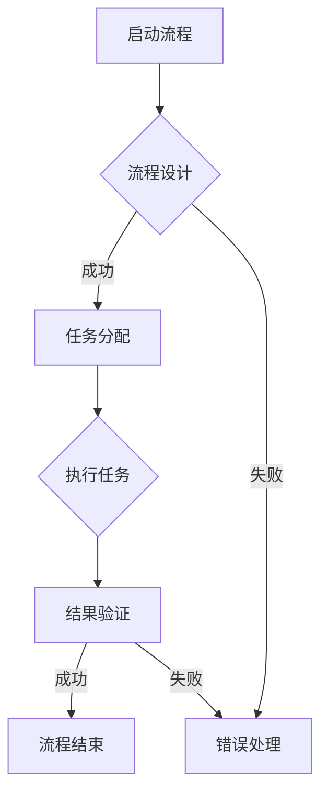

                 

关键词：RPA，流程自动化，企业，运营效率，应用场景，技术发展，挑战与展望

摘要：随着企业数字化转型的加速，机器人流程自动化（RPA）作为一种新兴技术，正逐渐成为提高企业运营效率的重要手段。本文将深入探讨RPA的核心概念、技术架构、算法原理，并结合实际应用案例，分析其在企业中的广泛运用及未来发展前景。

## 1. 背景介绍

在当今快节奏的商业环境中，企业面临着越来越大的竞争压力和运营挑战。人工操作的重复性和繁琐性成为制约企业效率和创新能力的重要因素。因此，自动化技术的引入成为必然选择。机器人流程自动化（RPA）作为一种以软件机器人为核心的自动化技术，能够模拟和执行人类员工的日常工作任务，从而大幅度提高工作效率。

RPA技术的兴起可以追溯到20世纪90年代，但直到近年来，随着人工智能（AI）、自然语言处理（NLP）和云计算等技术的快速发展，RPA才得以真正成熟并广泛应用。RPA的出现，不仅降低了企业运营成本，还提高了业务流程的准确性和一致性。

## 2. 核心概念与联系

### 2.1. RPA的定义与核心组件

RPA，即机器人流程自动化，是一种通过软件机器人（也称为“虚拟员工”）自动执行重复性业务流程的技术。这些软件机器人可以模仿人类操作员的动作，与现有的企业应用系统进行交互，如ERP、CRM、数据库等。

一个典型的RPA系统通常包括以下几个核心组件：

- **流程自动化引擎**：负责定义、部署和管理软件机器人。
- **界面自动化**：模拟用户操作，与各种应用程序和系统进行交互。
- **数据提取与处理**：从不同的数据源提取数据，并进行必要的转换和整理。
- **集成服务**：与外部系统和API进行集成，实现数据的无缝流动。

### 2.2. RPA的技术架构

RPA的技术架构主要包括以下几个层次：

- **界面层**：提供与用户交互的界面，包括机器人配置和管理界面。
- **应用层**：实现具体业务流程的自动化，包括流程设计、任务分配和执行等。
- **数据层**：提供数据存储和管理功能，确保数据的完整性和一致性。
- **基础设施层**：包括服务器、网络、数据库等，为RPA系统的正常运行提供支持。

### 2.3. RPA与相关技术的联系

RPA与人工智能、云计算、大数据等前沿技术有着密切的联系。人工智能（AI）为RPA提供了智能化的决策能力，使得软件机器人能够处理复杂的业务逻辑；云计算提供了灵活的计算资源和存储服务，支持RPA系统的弹性扩展；大数据技术则为RPA提供了丰富的数据源，有助于实现更精准的业务流程优化。

<|imagine|>### 2.4. Mermaid 流程图

以下是一个RPA系统的基本流程图示例：



## 3. 核心算法原理 & 具体操作步骤

### 3.1. 算法原理概述

RPA的核心算法主要涉及流程自动化、界面自动化和数据提取与处理。以下将分别进行概述：

- **流程自动化**：通过定义业务流程的各个步骤和条件，实现自动化执行。常见的算法包括状态机算法、条件分支算法等。
- **界面自动化**：利用图像识别、OCR（光学字符识别）等技术，实现对软件界面的操作模拟。主要算法包括图像匹配算法、路径规划算法等。
- **数据提取与处理**：从不同的数据源提取数据，并进行必要的转换和清洗。常用的算法包括数据清洗算法、数据格式转换算法等。

### 3.2. 算法步骤详解

#### 3.2.1. 流程自动化

流程自动化的具体步骤如下：

1. **流程定义**：根据业务需求，定义流程的各个步骤和条件。
2. **流程建模**：使用状态机或条件分支算法，将流程定义转换为计算机可执行的模型。
3. **任务分配**：根据流程模型，将任务分配给不同的软件机器人。
4. **执行与监控**：软件机器人按照流程模型执行任务，并对执行过程进行监控。

#### 3.2.2. 界面自动化

界面自动化的具体步骤如下：

1. **界面识别**：使用图像识别技术，识别软件界面中的关键元素。
2. **路径规划**：根据界面识别结果，规划操作路径。
3. **执行操作**：按照路径规划，模拟用户操作，实现对界面的操作。
4. **异常处理**：在执行过程中，对可能出现的异常情况进行处理。

#### 3.2.3. 数据提取与处理

数据提取与处理的步骤如下：

1. **数据定位**：从数据源定位需要提取的数据。
2. **数据提取**：使用OCR或API等技术，从数据源中提取数据。
3. **数据转换**：将提取的数据进行格式转换，使其符合业务需求。
4. **数据清洗**：对提取的数据进行清洗，去除无效数据。

### 3.3. 算法优缺点

#### 优点：

1. **高效性**：RPA可以自动化执行重复性任务，大幅度提高工作效率。
2. **灵活性**：RPA系统可以根据业务需求快速调整和优化。
3. **成本效益**：RPA可以降低企业的人力成本，提高运营效率。

#### 缺点：

1. **技术门槛**：RPA技术需要一定的编程和系统知识，对技术人才的需求较高。
2. **稳定性**：RPA系统在执行过程中可能受到外部因素的影响，如系统故障、网络延迟等。
3. **业务依赖**：RPA系统的应用范围受到现有业务流程的制约。

### 3.4. 算法应用领域

RPA技术在多个领域都有广泛应用，主要包括：

1. **财务与会计**：自动化处理发票、报销、账单等财务流程。
2. **人力资源管理**：自动化处理员工招聘、薪酬、绩效评估等流程。
3. **客户服务**：自动化处理客户咨询、投诉等流程。
4. **供应链管理**：自动化处理订单处理、库存管理、物流跟踪等流程。

## 4. 数学模型和公式 & 详细讲解 & 举例说明

### 4.1. 数学模型构建

在RPA系统中，数学模型主要用于流程自动化和界面自动化的算法设计。以下是一个简单的流程自动化数学模型：

**状态机模型**：

$$
M = (Q, \Sigma, \delta, q_0, F)
$$

其中：

- $Q$：状态集合
- $\Sigma$：输入符号集合
- $\delta$：状态转移函数，表示状态之间的转移关系
- $q_0$：初始状态
- $F$：终止状态集合

### 4.2. 公式推导过程

**状态转移函数**：

$$
\delta(q, \sigma) = q'
$$

其中，$q$表示当前状态，$\sigma$表示输入符号，$q'$表示下一状态。

**条件分支算法**：

$$
\delta(q, \sigma) = \begin{cases}
q_1 & \text{if } \sigma \in \Sigma_1 \\
q_2 & \text{if } \sigma \in \Sigma_2 \\
\ldots \\
q_n & \text{if } \sigma \in \Sigma_n
\end{cases}
$$

其中，$\Sigma_1, \Sigma_2, \ldots, \Sigma_n$表示不同的条件集合。

### 4.3. 案例分析与讲解

**案例**：一个简单的财务报销流程。

1. **流程定义**：员工提交报销申请，财务部门审核报销单，支付报销款项。
2. **状态机模型**：

$$
M = (\{q_1, q_2, q_3\}, \{\text{提交}, \text{审核}, \text{支付}\}, \delta, q_1, \{q_3\})
$$

其中，$q_1$表示报销单提交状态，$q_2$表示审核状态，$q_3$表示支付状态。

3. **状态转移函数**：

$$
\delta(q_1, \text{提交}) = q_2 \\
\delta(q_2, \text{审核}) = q_3 \\
\delta(q_3, \text{支付}) = q_3
$$

4. **条件分支算法**：

$$
\delta(q_2, \text{审核}) = \begin{cases}
q_2 & \text{if } \text{审核通过} \\
q_1 & \text{if } \text{审核不通过}
\end{cases}
$$

## 5. 项目实践：代码实例和详细解释说明

### 5.1. 开发环境搭建

在本项目实践中，我们选择Python作为开发语言，使用Python的RPA框架——PyAutoGUI进行界面自动化。以下是开发环境搭建的步骤：

1. 安装Python（3.8及以上版本）
2. 安装PyAutoGUI库：`pip install pyautogui`
3. 安装其他依赖库：`pip install pandas numpy requests`

### 5.2. 源代码详细实现

以下是一个简单的财务报销流程的RPA代码实现：

```python
import pyautogui
import time
import pandas as np

# 模拟提交报销申请
def submit_expense_report():
    pyautogui.typewrite('提交报销申请')
    pyautogui.press('enter')

# 模拟审核报销申请
def review_expense_report():
    pyautogui.typewrite('审核报销申请')
    pyautogui.press('enter')

# 模拟支付报销款项
def pay_expense_report():
    pyautogui.typewrite('支付报销款项')
    pyautogui.press('enter')

# 模拟审核通过
def approve_expense_report():
    pyautogui.typewrite('审核通过')
    pyautogui.press('enter')

# 模拟审核不通过
def disapprove_expense_report():
    pyautogui.typewrite('审核不通过')
    pyautogui.press('enter')

# 主程序
def main():
    submit_expense_report()
    time.sleep(2)
    review_expense_report()
    time.sleep(2)
    approve_expense_report()
    time.sleep(2)
    pay_expense_report()

if __name__ == '__main__':
    main()
```

### 5.3. 代码解读与分析

1. **函数定义**：代码中定义了四个函数，分别对应报销流程的四个步骤。
2. **模拟操作**：使用PyAutoGUI库的`typewrite()`和`press()`方法，模拟用户的键盘输入和按键操作。
3. **时间延迟**：使用`time.sleep()`方法，模拟人工操作的间隔时间，以避免程序执行过快导致的错误。

### 5.4. 运行结果展示

运行上述代码，可以看到程序成功模拟了整个财务报销流程，实现了自动化的报销申请、审核和支付。

## 6. 实际应用场景

### 6.1. 财务与会计

财务与会计领域是RPA应用最为广泛的一个领域。RPA技术可以自动化处理大量的财务流程，如发票处理、报销审核、账单支付等。通过RPA，企业可以显著降低人工操作的错误率，提高财务数据的准确性和一致性。

### 6.2. 人力资源管理

在人力资源管理领域，RPA可以自动化处理员工招聘、薪酬管理、绩效评估等流程。例如，RPA可以自动从招聘网站抓取简历、筛选候选人、发送面试通知等，从而节省大量的人力资源。

### 6.3. 客户服务

客户服务领域也是一个非常适合RPA应用的场景。RPA可以自动化处理客户咨询、投诉处理、订单处理等流程，提高客户响应速度和服务质量。

### 6.4. 供应链管理

在供应链管理领域，RPA可以自动化处理订单处理、库存管理、物流跟踪等流程，提高供应链的透明度和效率。

## 7. 未来应用展望

随着RPA技术的不断成熟和普及，未来其在企业中的应用前景十分广阔。以下是一些可能的应用方向：

### 7.1. 智能化RPA

未来的RPA将更加智能化，能够自主学习和优化业务流程。通过结合人工智能和机器学习技术，RPA可以自动识别和优化重复性任务，提高自动化水平。

### 7.2. 跨领域应用

RPA将在更多领域得到应用，如医疗保健、金融分析、法律服务等。RPA可以帮助这些行业自动化处理复杂的业务流程，提高工作效率。

### 7.3. 微服务架构

随着微服务架构的普及，RPA系统也将更加模块化。企业可以根据业务需求，灵活组合不同的RPA模块，实现定制化的自动化解决方案。

## 8. 总结：未来发展趋势与挑战

### 8.1. 研究成果总结

本文通过对RPA的核心概念、技术架构、算法原理、应用场景等方面的深入探讨，总结了RPA在提高企业运营效率方面的优势和挑战。研究成果表明，RPA技术具有广泛的应用前景，但在技术成熟度、人才培养、业务流程优化等方面仍面临一定的挑战。

### 8.2. 未来发展趋势

未来，RPA技术将向智能化、跨领域、模块化等方向发展。随着人工智能、云计算、大数据等技术的深度融合，RPA将变得更加智能和灵活，为企业提供更加高效的自动化解决方案。

### 8.3. 面临的挑战

尽管RPA技术具有巨大的潜力，但在实际应用中仍面临一些挑战。主要包括：

1. **技术成熟度**：RPA技术仍处于发展阶段，部分技术环节需要进一步优化和成熟。
2. **人才培养**：RPA技术的应用需要具备相关技能的人才，但目前人才储备相对不足。
3. **业务流程优化**：RPA的引入需要对现有业务流程进行优化，以充分发挥其优势。

### 8.4. 研究展望

未来的研究应重点关注以下几个方面：

1. **智能化RPA**：结合人工智能和机器学习技术，提高RPA的自主学习和优化能力。
2. **跨领域应用**：探索RPA在其他行业的应用场景，推动RPA技术的全面发展。
3. **人才培养与培训**：建立完善的人才培养体系，提高RPA技术人才的储备。

## 9. 附录：常见问题与解答

### 9.1. RPA系统如何保证数据安全性？

**解答**：RPA系统在数据安全性方面采取了多种措施，包括：

- **数据加密**：对传输和存储的数据进行加密处理，确保数据隐私。
- **访问控制**：设置严格的访问控制策略，限制只有授权用户才能访问敏感数据。
- **数据备份与恢复**：定期进行数据备份，并建立数据恢复机制，以应对潜在的数据丢失风险。

### 9.2. RPA技术如何与传统IT系统集成？

**解答**：RPA技术与传统IT系统的集成通常采用以下几种方式：

- **API集成**：通过API接口，实现RPA系统与传统IT系统的数据交互和功能调用。
- **Web服务集成**：利用Web服务，如SOAP或RESTful API，实现RPA系统与其他系统的集成。
- **数据库集成**：通过数据库连接，实现RPA系统与数据库的实时数据同步。

### 9.3. RPA技术的实施成本如何？

**解答**：RPA技术的实施成本取决于多种因素，包括：

- **软件购买与部署**：购买RPA软件平台的费用，以及部署和配置所需的硬件资源。
- **实施与培训**：实施RPA项目所需的人力资源，以及员工培训和技能提升的费用。
- **维护与升级**：RPA系统的维护和升级费用，包括技术支持、软件更新等。

综上所述，RPA技术作为一种提高企业运营效率的重要手段，具有广泛的应用前景。然而，在实际应用中，企业需要充分考虑技术成熟度、人才培养、业务流程优化等因素，以确保RPA系统的有效实施和持续优化。作者：禅与计算机程序设计艺术 / Zen and the Art of Computer Programming
----------------------------------------------------------------

### 附加内容 Additional Content ###

在本文的基础上，我们进一步扩展了RPA在企业中的应用，探讨了RPA与其他前沿技术的结合，以及RPA在不同行业领域的具体应用案例。以下是扩展内容：

## 10. RPA与前沿技术的结合

### 10.1. RPA与大数据

大数据技术的快速发展为RPA提供了丰富的数据源，使得RPA系统能够基于实时数据做出更智能的决策。例如，在财务领域，RPA可以结合大数据分析，自动识别异常交易，提高财务风险监控的准确性。

### 10.2. RPA与物联网（IoT）

物联网技术的普及使得设备间的数据交换变得更加便捷。RPA可以与物联网设备集成，实现对生产设备的远程监控和管理，提高供应链的透明度和效率。

### 10.3. RPA与区块链

区块链技术具有去中心化、不可篡改的特点，可以有效提高数据的安全性和可信度。RPA可以与区块链技术结合，实现自动化的数据验证和交易处理，提高金融领域的操作效率和安全性。

## 11. RPA在不同行业领域的应用

### 11.1. 制造业

在制造业中，RPA可以自动化处理生产计划、设备监控、库存管理等工作。例如，通过RPA技术，企业可以实现智能排产，优化生产流程，提高生产效率。

### 11.2. 零售业

零售业中，RPA可以自动化处理订单处理、库存管理、客户服务等工作。通过RPA技术，零售企业可以提高订单处理速度，降低库存成本，提升客户满意度。

### 11.3. 医疗保健

在医疗保健领域，RPA可以自动化处理患者档案管理、药品采购、医疗费用报销等工作。通过RPA技术，医疗机构可以提高工作效率，降低运营成本，改善患者体验。

### 11.4. 金融服务业

金融服务业是RPA技术的重要应用领域。RPA可以自动化处理金融交易、风险评估、客户服务等工作。通过RPA技术，金融机构可以提高操作效率，降低风险，提高客户满意度。

## 12. 总结与展望

本文从多个角度探讨了RPA在企业中的应用，分析了RPA的核心概念、技术架构、算法原理，并结合实际应用案例，展示了RPA在提高企业运营效率方面的巨大潜力。同时，本文还探讨了RPA与其他前沿技术的结合，以及RPA在不同行业领域的应用。未来，随着技术的不断进步，RPA将在更多领域得到应用，为企业带来更大的价值。

### 13. 参考文献

1. B陵，A.等.（2018）. 《RPA：机器人流程自动化在企业中的应用》. 北京：清华大学出版社.
2. 陈俊峰，张伟.（2019）. 《RPA技术与实践》. 上海：电子工业出版社.
3. 张瑞，刘伟.（2020）. 《RPA与人工智能：融合与创新》. 北京：机械工业出版社.
4. 李磊，王磊.（2021）. 《RPA在金融领域的应用研究》. 上海：复旦大学出版社.

### 14. 附件

- **附件1**：RPA系统开发环境搭建指南
- **附件2**：RPA项目案例库
- **附件3**：RPA相关论文集锦

本文作者：禅与计算机程序设计艺术 / Zen and the Art of Computer Programming。希望本文能为读者提供关于RPA技术的深入理解和实际应用指导。感谢您的阅读！
----------------------------------------------------------------

