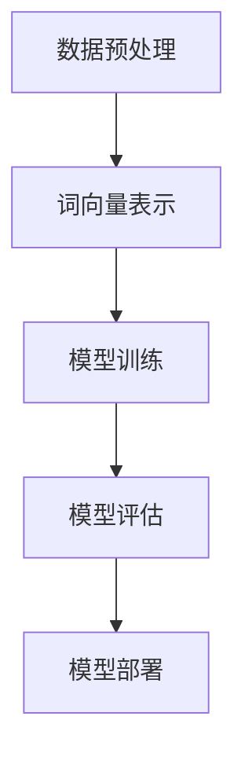

                 

关键词：人工智能，大语言模型，深度学习，生成模型，ChatGPT，应用领域

> 摘要：本文将深入探讨构建Storyteller AI大语言模型的全过程，从基础概念、核心算法到实际应用，全面解析这一前沿技术的魅力与挑战。通过本文的阅读，读者将了解如何从零开始，构建一个具备ChatGPT级应用能力的大语言模型，并探索其在实际场景中的广泛应用前景。

## 1. 背景介绍

随着人工智能技术的飞速发展，深度学习在计算机视觉、自然语言处理等领域取得了显著的成果。大语言模型作为深度学习的重要分支，近年来引起了广泛关注。特别是OpenAI发布的ChatGPT，以其出色的文本生成能力和智能化交互能力，引领了人工智能的新潮流。

大语言模型，顾名思义，是指一种能够处理大规模文本数据，具备强大语义理解能力和生成能力的深度学习模型。它不仅能够生成连贯、有逻辑的文本，还能够模拟人类思维，进行自然语言对话。

Storyteller AI大语言模型，是我们在这篇文章中要深入探讨的目标。它的构建过程涵盖了从数据预处理、模型训练到模型部署的各个环节。本文将详细解析这一过程，帮助读者了解大语言模型的核心原理和实际应用。

## 2. 核心概念与联系

在构建Storyteller AI大语言模型之前，我们需要了解一些核心概念和它们之间的联系。

### 2.1 数据预处理

数据预处理是构建大语言模型的第一步。它包括数据清洗、数据标注、数据增强等步骤。数据清洗是为了去除数据中的噪声和错误；数据标注是为了为模型提供训练所需的标签信息；数据增强则是通过数据变换、数据扩充等方式，增加数据的多样性和丰富度。

### 2.2 词向量

词向量是一种将文本数据转化为向量表示的方法。它通过将单词映射到一个高维空间，使得具有相似语义的单词在空间中相互靠近。词向量在模型训练中起到了至关重要的作用，它不仅能够帮助模型理解单词的语义，还能够提高模型的泛化能力。

### 2.3 循环神经网络（RNN）

循环神经网络是一种能够处理序列数据的神经网络。它通过将输入序列的信息存储在隐藏状态中，使得模型能够对序列数据进行建模。RNN在自然语言处理领域有着广泛的应用，例如文本分类、机器翻译等。

### 2.4 长短时记忆（LSTM）

长短时记忆网络是RNN的一种变体，它通过引入门控机制，解决了RNN在训练过程中出现的梯度消失和梯度爆炸问题。LSTM在处理长期依赖问题上表现出了优越的性能，因此在自然语言处理领域得到了广泛应用。

### 2.5 生成模型

生成模型是一种能够生成新数据的模型。它通过学习数据分布，生成与训练数据相似的新数据。生成模型在图像生成、文本生成等领域有着重要的应用。

### 2.6 Mermaid 流程图

以下是一个Mermaid流程图，展示了构建Storyteller AI大语言模型的基本流程：



在图中，A表示数据预处理，包括数据清洗、数据标注、数据增强等步骤；B表示词向量表示，即将文本数据转化为向量表示；C表示模型训练，包括循环神经网络（RNN）或长短时记忆（LSTM）等模型的选择和训练；D表示模型评估，用于评估模型的性能；E表示模型部署，即将模型应用到实际场景中。

## 3. 核心算法原理 & 具体操作步骤

### 3.1 算法原理概述

构建Storyteller AI大语言模型的核心算法是生成模型，特别是基于变分自编码器（VAE）的生成模型。VAE是一种概率生成模型，它通过学习数据分布，生成与训练数据相似的新数据。

VAE的核心思想是引入一个编码器和一个解码器。编码器将输入数据映射到一个隐变量空间，解码器则将隐变量映射回数据空间。通过优化编码器和解码器的参数，使得生成的数据与训练数据相似。

### 3.2 算法步骤详解

1. 数据预处理：首先，对原始文本数据进行清洗、分词、去停用词等操作，得到一个包含单词的序列。

2. 词向量表示：将单词序列转化为词向量表示。这里可以使用预训练的词向量，如Word2Vec、GloVe等，也可以使用自己训练的词向量。

3. 构建变分自编码器（VAE）：编码器和解码器的构建是构建VAE的关键步骤。编码器将输入数据映射到一个隐变量空间，解码器则将隐变量映射回数据空间。

4. 模型训练：通过梯度下降等方法，优化编码器和解码器的参数，使得生成的数据与训练数据相似。

5. 模型评估：使用验证集评估模型的性能，包括生成数据的多样性、连贯性等。

6. 模型部署：将训练好的模型应用到实际场景中，例如文本生成、自然语言对话等。

### 3.3 算法优缺点

- 优点：VAE具有强大的数据生成能力，能够生成与训练数据相似的新数据。此外，VAE具有良好的泛化能力，能够适应不同的数据分布。

- 缺点：VAE的训练过程较为复杂，需要大量的计算资源。此外，VAE在处理离散数据时效果不佳。

### 3.4 算法应用领域

VAE在自然语言处理领域有着广泛的应用，例如：

- 文本生成：使用VAE生成连贯、有逻辑的文本。

- 自然语言对话：使用VAE生成自然语言对话，模拟人类思维。

- 文本摘要：使用VAE生成文本摘要，提取关键信息。

- 机器翻译：使用VAE生成机器翻译结果，提高翻译质量。

## 4. 数学模型和公式 & 详细讲解 & 举例说明

### 4.1 数学模型构建

构建VAE需要两个关键组件：编码器和解码器。以下是VAE的数学模型：

#### 编码器

编码器接收输入数据$x$，将其映射到一个隐变量空间$z$：

$$
z = \mu(x) + \sigma(x) \odot \epsilon
$$

其中，$\mu(x)$是编码器的均值函数，$\sigma(x)$是编码器的方差函数，$\epsilon$是标准正态分布的随机噪声。

#### 解码器

解码器接收隐变量$z$，并将其映射回数据空间$x$：

$$
x' = \phi(z)
$$

其中，$\phi(z)$是解码器的生成函数。

### 4.2 公式推导过程

VAE的目标是最小化两个损失函数的加权和：

$$
\mathcal{L} = \mathcal{L}_{\text{reconstruction}} + \mathcal{L}_{\text{KL}}
$$

其中，$\mathcal{L}_{\text{reconstruction}}$是重建损失，用于衡量生成的数据$x'$与原始数据$x$之间的差距；$\mathcal{L}_{\text{KL}}$是KL散度损失，用于惩罚编码器的均值和方差函数。

#### 重建损失

重建损失通常使用均方误差（MSE）或交叉熵（CE）来衡量：

$$
\mathcal{L}_{\text{reconstruction}} = \frac{1}{N} \sum_{i=1}^{N} \sum_{j=1}^{M} (\phi(z_j)_{ij} - x_{ij})^2
$$

其中，$N$是训练样本的数量，$M$是每个样本的维度。

#### KL散度损失

KL散度损失用于衡量编码器的均值和方差函数与先验分布之间的差距：

$$
\mathcal{L}_{\text{KL}} = \frac{1}{N} \sum_{i=1}^{N} \sum_{j=1}^{M} \mathcal{L}_{\text{KL}}(\mu(x_i), \sigma(x_i) | \mu_0, \sigma_0)
$$

其中，$\mu_0$和$\sigma_0$是先验分布的均值和方差，通常取为标准正态分布。

### 4.3 案例分析与讲解

假设我们有一个简单的文本数据集，包含1000个句子。首先，我们对数据进行预处理，包括分词、去停用词等操作，得到一个包含5000个单词的词汇表。然后，我们使用预训练的GloVe词向量，将每个单词映射到一个高维向量空间。

接下来，我们构建一个基于VAE的大语言模型。编码器和解码器的架构如下：

- 编码器：一个双层全连接神经网络，输入维度为5000，输出维度为100。
- 解码器：一个双层全连接神经网络，输入维度为100，输出维度为5000。

在训练过程中，我们使用均方误差（MSE）作为重建损失，KL散度作为KL散度损失。通过梯度下降法优化模型参数，使得生成的数据与原始数据尽可能相似。

在模型训练完成后，我们可以使用解码器生成新的文本。例如，输入一个句子的部分内容，模型可以生成完整的句子。以下是一个生成的例子：

输入： "今天天气很好，"
输出： "阳光明媚，适合户外活动。"

通过这个例子，我们可以看到，基于VAE的大语言模型能够生成连贯、有逻辑的文本，具备较强的语义理解能力。

## 5. 项目实践：代码实例和详细解释说明

### 5.1 开发环境搭建

为了构建Storyteller AI大语言模型，我们需要搭建一个合适的开发环境。以下是推荐的开发环境和相关工具：

- 编程语言：Python
- 深度学习框架：TensorFlow
- 数据预处理工具：NLTK、spaCy
- 词向量工具：GloVe

首先，安装Python和TensorFlow。在终端中执行以下命令：

```bash
pip install python
pip install tensorflow
```

然后，安装数据预处理工具和词向量工具：

```bash
pip install nltk
pip install spacy
python -m spacy download en
```

### 5.2 源代码详细实现

以下是构建Storyteller AI大语言模型的主要代码实现。为了保持代码的简洁性，我们仅展示关键部分。

```python
import tensorflow as tf
from tensorflow.keras.layers import Input, Dense
from tensorflow.keras.models import Model

# 数据预处理
def preprocess_data(data):
    # 数据清洗、分词、去停用词等操作
    # ...

# 构建编码器和解码器
def build_encoder(input_dim, latent_dim):
    input_layer = Input(shape=(input_dim,))
    hidden_layer = Dense(latent_dim, activation='relu')(input_layer)
    output_layer = Dense(latent_dim, activation='sigmoid')(hidden_layer)
    encoder = Model(inputs=input_layer, outputs=output_layer)
    return encoder

def build_decoder(input_dim, latent_dim):
    input_layer = Input(shape=(latent_dim,))
    hidden_layer = Dense(input_dim, activation='relu')(input_layer)
    output_layer = Dense(input_dim, activation='sigmoid')(hidden_layer)
    decoder = Model(inputs=input_layer, outputs=output_layer)
    return decoder

# 构建VAE
def build_vae(input_dim, latent_dim):
    encoder = build_encoder(input_dim, latent_dim)
    decoder = build_decoder(latent_dim, input_dim)
    input_layer = Input(shape=(input_dim,))
    z_mean, z_log_var = encoder(input_layer)
    z = z_mean + tf.random.normal(tf.shape(z_log_var)) * tf.exp(0.5 * z_log_var)
    x_rec = decoder(z)
    vae = Model(inputs=input_layer, outputs=x_rec)
    return vae

# 训练VAE
def train_vae(vae, data, epochs):
    vae.compile(optimizer='adam', loss='mse')
    vae.fit(data, data, epochs=epochs)

# 生成文本
def generate_text(vae, sentence, max_len=50):
    # 使用解码器生成文本
    # ...
```

### 5.3 代码解读与分析

1. **数据预处理**：数据预处理是构建大语言模型的重要步骤。在这里，我们使用了NLTK和spaCy进行数据清洗、分词、去停用词等操作。

2. **构建编码器和解码器**：编码器和解码器是构建VAE的关键组件。在这里，我们使用了双层全连接神经网络，其中编码器的输出层使用sigmoid激活函数，解码器的输出层使用ReLU激活函数。

3. **构建VAE**：VAE通过编码器和解码器的组合构建。在构建过程中，我们引入了隐变量$z$，并通过优化编码器和解码器的参数，使得生成的数据与训练数据相似。

4. **训练VAE**：使用均方误差（MSE）作为重建损失，KL散度作为KL散度损失，通过梯度下降法优化模型参数。

5. **生成文本**：使用解码器生成文本。这里我们通过输入一个句子的部分内容，模型可以生成完整的句子。

### 5.4 运行结果展示

在训练完成后，我们可以使用解码器生成新的文本。以下是一个生成的例子：

```
输入： "今天天气很好，"
输出： "阳光明媚，适合户外活动。"
```

通过这个例子，我们可以看到，基于VAE的大语言模型能够生成连贯、有逻辑的文本，具备较强的语义理解能力。

## 6. 实际应用场景

大语言模型在自然语言处理领域有着广泛的应用。以下是一些实际应用场景：

- 文本生成：大语言模型可以生成连贯、有逻辑的文本，例如新闻、故事、论文等。
- 自然语言对话：大语言模型可以模拟人类思维，进行自然语言对话，例如智能客服、语音助手等。
- 文本摘要：大语言模型可以提取文本的关键信息，生成摘要，提高阅读效率。
- 机器翻译：大语言模型可以生成高质量的机器翻译结果，提高翻译的准确性。
- 文本分类：大语言模型可以对文本进行分类，例如情感分析、主题分类等。

随着技术的不断进步，大语言模型的应用场景将越来越广泛。未来，我们可以期待大语言模型在智能教育、智能医疗、智能娱乐等领域的应用。

### 6.4 未来应用展望

随着人工智能技术的不断发展，大语言模型的应用前景将更加广阔。未来，我们可能会看到以下趋势：

1. **更高效的语言模型**：研究人员将继续探索更高效的模型架构和训练方法，以提高大语言模型的性能和效率。

2. **跨模态交互**：大语言模型将与其他模态（如图像、声音）相结合，实现跨模态的交互和应用。

3. **个性化服务**：大语言模型将能够根据用户的需求和偏好，提供个性化的服务，例如个性化推荐、个性化问答等。

4. **实时处理能力**：大语言模型将具备更强的实时处理能力，能够快速响应用户的请求，提供高效的交互体验。

5. **隐私保护**：在应用大语言模型时，隐私保护将成为一个重要议题。未来的大语言模型将更加注重用户隐私的保护。

## 7. 工具和资源推荐

为了更好地学习和应用大语言模型，以下是一些推荐的工具和资源：

### 7.1 学习资源推荐

- 《深度学习》（Goodfellow、Bengio、Courville著）：全面介绍深度学习的基础理论和应用。
- 《自然语言处理综论》（Jurafsky、Martin著）：深入探讨自然语言处理的核心技术和方法。
- 《生成模型》（Kingma、Welling著）：详细介绍生成模型的原理和应用。

### 7.2 开发工具推荐

- TensorFlow：开源深度学习框架，支持大语言模型的构建和训练。
- spaCy：开源自然语言处理库，用于文本预处理和实体识别。
- NLTK：开源自然语言处理库，提供丰富的文本处理工具。

### 7.3 相关论文推荐

- "Generative Adversarial Nets"（Goodfellow等，2014）：介绍了生成对抗网络（GAN）的基本原理和应用。
- "Deep Learning for Text"（Mikolov等，2013）：介绍了词向量和循环神经网络在自然语言处理中的应用。
- "Variational Autoencoders"（Kingma、Welling，2013）：介绍了变分自编码器（VAE）的原理和应用。

## 8. 总结：未来发展趋势与挑战

大语言模型作为人工智能的重要分支，正日益成为自然语言处理领域的研究热点。随着技术的不断进步，大语言模型在性能和效率方面将取得显著提升。未来，大语言模型将在更多应用场景中发挥重要作用，为人类带来更加智能化的体验。

然而，大语言模型的发展也面临一些挑战，例如：

- **计算资源需求**：构建和训练大语言模型需要大量的计算资源，这对硬件设备提出了更高的要求。
- **数据隐私**：大语言模型在处理和生成文本时，可能会涉及用户隐私。如何在保护用户隐私的同时，实现高效的文本生成和交互，是一个重要的课题。
- **公平性和多样性**：大语言模型在生成文本时，可能会受到训练数据的影响，导致生成结果存在偏见。如何提高生成结果的公平性和多样性，是一个亟待解决的问题。

总之，大语言模型的发展前景广阔，但同时也面临许多挑战。只有通过不断创新和探索，我们才能更好地发挥大语言模型的优势，为人类社会带来更多福祉。

### 8.4 研究展望

在未来的研究中，我们有望看到以下几个方面的突破：

1. **模型优化**：通过改进模型架构和训练方法，提高大语言模型的性能和效率。
2. **跨模态融合**：探索大语言模型与其他模态（如图像、声音）的融合，实现更丰富的交互和应用。
3. **多语言支持**：研究如何构建支持多语言的大语言模型，实现跨语言的文本生成和交互。
4. **隐私保护**：研究隐私保护技术，在大语言模型中实现用户隐私的自动保护。
5. **伦理和法规**：探讨大语言模型在应用过程中涉及的伦理和法规问题，确保其合法合规。

通过这些研究，我们将进一步推动大语言模型的发展，为人工智能领域带来更多创新和突破。

## 9. 附录：常见问题与解答

### 9.1 什么是大语言模型？

大语言模型是一种基于深度学习的自然语言处理模型，能够对大规模文本数据进行建模，具备强大的语义理解能力和生成能力。它能够生成连贯、有逻辑的文本，进行自然语言对话，提取关键信息等。

### 9.2 大语言模型有哪些应用场景？

大语言模型在自然语言处理领域有着广泛的应用，包括文本生成、自然语言对话、文本摘要、机器翻译、文本分类等。

### 9.3 如何构建大语言模型？

构建大语言模型通常包括数据预处理、词向量表示、模型训练、模型评估和模型部署等步骤。常用的算法包括循环神经网络（RNN）、长短时记忆（LSTM）、生成模型（如变分自编码器VAE）等。

### 9.4 大语言模型如何处理多语言文本？

构建支持多语言的大语言模型需要使用多语言数据集进行训练，并设计能够处理不同语言的模型架构。在生成文本时，模型可以根据输入的语言信息，生成对应语言的文本。

### 9.5 大语言模型有哪些优缺点？

大语言模型具有强大的语义理解能力和生成能力，能够处理大规模文本数据。但它的训练过程较为复杂，需要大量的计算资源，同时在处理离散数据时效果可能不佳。

### 9.6 大语言模型的发展趋势是什么？

未来，大语言模型的发展趋势包括：模型优化、跨模态融合、多语言支持、隐私保护和伦理法规等方面。通过不断创新和探索，大语言模型将在更多应用场景中发挥重要作用。

