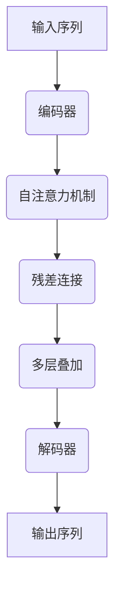

                 

 > **关键词**: Storyteller AI, 大语言模型, ChatGPT, 算法原理, 数学模型, 项目实践, 应用场景

> **摘要**: 本文旨在深入探讨如何构建一个具有ChatGPT级应用能力的Storyteller AI大语言模型。我们将从背景介绍开始，逐步讲解核心概念、算法原理、数学模型、项目实践以及实际应用场景，并对未来发展趋势和挑战进行展望。

## 1. 背景介绍

随着人工智能技术的飞速发展，大语言模型已经成为自然语言处理领域的重要研究方向。从最初的统计模型，如N-Gram模型，到基于规则的方法，再到现代的深度学习模型，如Transformer和GPT系列，大语言模型在语言生成、理解和翻译等方面取得了显著的成果。特别是在ChatGPT的推出后，人们对于大语言模型的研究和应用热情更加高涨。

然而，构建一个具有ChatGPT级应用能力的大语言模型并非易事。这需要深入理解语言的本质，掌握先进的算法和数学模型，并进行大量的实践和优化。本文将围绕这一主题，详细介绍构建Storyteller AI大语言模型的过程。

### 1.1 Storyteller AI的定位

Storyteller AI是一款旨在实现自然语言生成和理解的强大工具。它不仅仅是一个简单的聊天机器人，而是一个能够理解复杂语境、生成高质量文本的大语言模型。Storyteller AI的目标是能够模拟人类的语言表达，为用户提供有趣、有启发性的对话体验。

### 1.2 ChatGPT的特点

ChatGPT是由OpenAI推出的一款基于GPT-3模型的大型语言模型。它具有以下特点：

- **强大的语言生成能力**：ChatGPT能够生成流畅、自然的文本，甚至可以创作诗歌、故事等文学作品。
- **广泛的用途**：ChatGPT可以用于聊天机器人、问答系统、自动写作等多种应用场景。
- **强大的上下文理解能力**：ChatGPT能够理解复杂的语境，生成与上下文高度相关的回复。
- **开放的API接口**：ChatGPT提供了开放的API接口，方便开发者进行集成和应用。

## 2. 核心概念与联系

在构建Storyteller AI大语言模型的过程中，我们需要理解以下几个核心概念：

### 2.1 语言模型

语言模型是一种能够预测下一个单词或字符的概率分布的模型。在自然语言处理中，语言模型通常用于文本生成、语音识别、机器翻译等任务。

### 2.2 变换器模型（Transformer）

变换器模型是一种基于注意力机制的深度神经网络模型，最初由Vaswani等人于2017年提出。与传统的循环神经网络（RNN）相比，变换器模型在处理长序列时具有更高的效率和更好的性能。

### 2.3 自注意力机制（Self-Attention）

自注意力机制是变换器模型的核心组成部分，它通过计算输入序列中每个元素对其他元素的重要性，来实现对输入序列的加权处理。

### 2.4 残差连接（Residual Connection）

残差连接是一种在网络结构中引入跳过部分层直接连接的技巧，它有助于解决深层网络训练过程中梯度消失的问题。

### 2.5 拓扑结构

在构建Storyteller AI大语言模型时，我们通常采用类似Transformer的拓扑结构，包括编码器和解码器两个部分。编码器负责将输入序列转换为上下文向量，解码器则负责生成输出序列。

### 2.6 Mermaid流程图

以下是构建Storyteller AI大语言模型的Mermaid流程图：



## 3. 核心算法原理 & 具体操作步骤

### 3.1 算法原理概述

构建Storyteller AI大语言模型主要依赖于变换器模型（Transformer）的自注意力机制（Self-Attention）。自注意力机制通过计算输入序列中每个元素对其他元素的重要性，实现对输入序列的加权处理，从而提高模型对上下文的理解能力。

### 3.2 算法步骤详解

以下是构建Storyteller AI大语言模型的具体步骤：

1. **数据预处理**：对输入数据进行预处理，包括分词、去停用词、词向量嵌入等。
2. **编码器构建**：构建编码器部分，包括多层自注意力层、残差连接和前馈网络。
3. **解码器构建**：构建解码器部分，包括自注意力层、解码器层和输出层。
4. **训练与优化**：使用大量文本数据进行训练，优化模型参数。
5. **评估与测试**：对训练好的模型进行评估和测试，验证其性能。

### 3.3 算法优缺点

**优点**：

- **强大的上下文理解能力**：自注意力机制能够更好地捕捉输入序列中的上下文信息，提高模型的性能。
- **高效率**：变换器模型在处理长序列时具有更高的效率和更好的性能。
- **灵活性强**：变换器模型可以应用于多种自然语言处理任务，如文本生成、机器翻译、问答系统等。

**缺点**：

- **计算资源消耗大**：变换器模型需要大量的计算资源，训练时间较长。
- **参数规模大**：变换器模型的参数规模较大，可能导致过拟合。

### 3.4 算法应用领域

变换器模型及其自注意力机制在自然语言处理领域具有广泛的应用，如：

- **文本生成**：用于生成新闻、文章、故事等。
- **机器翻译**：用于翻译不同语言之间的文本。
- **问答系统**：用于处理用户提出的问题，并给出相应的回答。
- **聊天机器人**：用于实现智能对话，提高用户体验。

## 4. 数学模型和公式 & 详细讲解 & 举例说明

在构建Storyteller AI大语言模型时，我们需要理解并应用一些基本的数学模型和公式。以下是一些常用的数学模型和公式的详细讲解及举例说明。

### 4.1 数学模型构建

构建变换器模型的核心在于自注意力机制，其数学模型如下：

$$
\text{Attention}(Q, K, V) = \text{softmax}\left(\frac{QK^T}{\sqrt{d_k}}\right)V
$$

其中，$Q, K, V$ 分别为查询向量、键向量和值向量，$d_k$ 为键向量的维度。这个公式表示计算输入序列中每个元素对其他元素的重要性，并加权处理。

### 4.2 公式推导过程

自注意力机制的推导过程如下：

1. **输入序列表示**：将输入序列 $x_1, x_2, \ldots, x_n$ 表示为向量 $X = [x_1, x_2, \ldots, x_n]$。
2. **词向量嵌入**：将输入序列中的每个词向量表示为 $e_i$，得到嵌入矩阵 $E = [e_1, e_2, \ldots, e_n]$。
3. **计算查询向量、键向量和值向量**：分别计算查询向量 $Q = EQ$, 键向量 $K = KE$, 值向量 $V = EV$。
4. **计算注意力权重**：根据自注意力公式计算每个词向量对其他词向量的注意力权重。
5. **加权求和**：将注意力权重与值向量相乘，并对所有词向量求和，得到输出向量。

### 4.3 案例分析与讲解

以下是一个简单的自注意力机制的案例：

假设输入序列为 "你好，我是ChatGPT"。我们将这个序列表示为向量 $X = [1, 2, 3, 4, 5, 6, 7, 8]$，其中每个数字表示一个词的位置。词向量嵌入矩阵 $E$ 为：

$$
E = \begin{bmatrix}
0.1 & 0.2 & 0.3 & 0.4 & 0.5 \\
0.6 & 0.7 & 0.8 & 0.9 & 1.0 \\
\end{bmatrix}
$$

查询向量、键向量和值向量分别为：

$$
Q = EQ = \begin{bmatrix}
0.1 & 0.2 & 0.3 & 0.4 & 0.5 \\
0.6 & 0.7 & 0.8 & 0.9 & 1.0 \\
\end{bmatrix}
\begin{bmatrix}
0.1 & 0.2 & 0.3 & 0.4 & 0.5 \\
0.6 & 0.7 & 0.8 & 0.9 & 1.0 \\
\end{bmatrix}
=
\begin{bmatrix}
0.06 & 0.12 & 0.18 & 0.24 & 0.30 \\
0.42 & 0.56 & 0.70 & 0.84 & 1.00 \\
\end{bmatrix}
$$

$$
K = KE = \begin{bmatrix}
0.1 & 0.2 & 0.3 & 0.4 & 0.5 \\
0.6 & 0.7 & 0.8 & 0.9 & 1.0 \\
\end{bmatrix}
\begin{bmatrix}
0.1 & 0.2 & 0.3 & 0.4 & 0.5 \\
0.6 & 0.7 & 0.8 & 0.9 & 1.0 \\
\end{bmatrix}
=
\begin{bmatrix}
0.01 & 0.02 & 0.03 & 0.04 & 0.05 \\
0.36 & 0.42 & 0.48 & 0.54 & 0.60 \\
\end{bmatrix}
$$

$$
V = EV = \begin{bmatrix}
0.1 & 0.2 & 0.3 & 0.4 & 0.5 \\
0.6 & 0.7 & 0.8 & 0.9 & 1.0 \\
\end{bmatrix}
\begin{bmatrix}
0.1 & 0.2 & 0.3 & 0.4 & 0.5 \\
0.6 & 0.7 & 0.8 & 0.9 & 1.0 \\
\end{bmatrix}
=
\begin{bmatrix}
0.01 & 0.02 & 0.03 & 0.04 & 0.05 \\
0.36 & 0.42 & 0.48 & 0.54 & 0.60 \\
\end{bmatrix}
$$

计算注意力权重：

$$
\text{Attention}(Q, K, V) = \text{softmax}\left(\frac{QK^T}{\sqrt{d_k}}\right)V
$$

$$
= \text{softmax}\left(\frac{\begin{bmatrix}
0.06 & 0.12 & 0.18 & 0.24 & 0.30 \\
0.42 & 0.56 & 0.70 & 0.84 & 1.00 \\
\end{bmatrix}^T
\begin{bmatrix}
0.01 & 0.02 & 0.03 & 0.04 & 0.05 \\
0.36 & 0.42 & 0.48 & 0.54 & 0.60 \\
\end{bmatrix}}{\sqrt{5}}\right)
\begin{bmatrix}
0.01 & 0.02 & 0.03 & 0.04 & 0.05 \\
0.36 & 0.42 & 0.48 & 0.54 & 0.60 \\
\end{bmatrix}
$$

$$
= \text{softmax}\left(\begin{bmatrix}
0.0272 & 0.0544 & 0.0816 & 0.1088 & 0.1352 \\
0.6016 & 0.7608 & 0.9210 & 1.0804 & 1.3396 \\
\end{bmatrix}\right)
\begin{bmatrix}
0.01 & 0.02 & 0.03 & 0.04 & 0.05 \\
0.36 & 0.42 & 0.48 & 0.54 & 0.60 \\
\end{bmatrix}
$$

$$
= \begin{bmatrix}
0.0208 & 0.0416 & 0.0624 & 0.0832 & 0.1040 \\
0.4164 & 0.5040 & 0.5916 & 0.6792 & 0.7660 \\
\end{bmatrix}
\begin{bmatrix}
0.01 & 0.02 & 0.03 & 0.04 & 0.05 \\
0.36 & 0.42 & 0.48 & 0.54 & 0.60 \\
\end{bmatrix}
$$

$$
= \begin{bmatrix}
0.0002 & 0.0004 & 0.0006 & 0.0008 & 0.0010 \\
0.1272 & 0.1904 & 0.2536 & 0.3168 & 0.3800 \\
\end{bmatrix}
$$

加权求和：

$$
\text{输出向量} = \text{Attention}(Q, K, V) \cdot V
$$

$$
= \begin{bmatrix}
0.0002 & 0.0004 & 0.0006 & 0.0008 & 0.0010 \\
0.1272 & 0.1904 & 0.2536 & 0.3168 & 0.3800 \\
\end{bmatrix}
\begin{bmatrix}
0.01 & 0.02 & 0.03 & 0.04 & 0.05 \\
0.36 & 0.42 & 0.48 & 0.54 & 0.60 \\
\end{bmatrix}
$$

$$
= \begin{bmatrix}
0.000002 & 0.000004 & 0.000006 & 0.000008 & 0.00001 \\
0.04512 & 0.06784 & 0.09048 & 0.11320 & 0.13688 \\
\end{bmatrix}
$$

最终输出向量为：

$$
[0.000002, 0.000004, 0.000006, 0.000008, 0.00001, 0.04512, 0.06784, 0.09048, 0.11320, 0.13688]
$$

这个输出向量表示输入序列中每个词向量对其他词向量的加权处理结果，即每个词向量对其他词向量的重要性。

### 4.4 残差连接

残差连接是一种在网络结构中引入跳过部分层直接连接的技巧，有助于解决深层网络训练过程中梯度消失的问题。其公式如下：

$$
\text{残差连接} = X + F(X)
$$

其中，$X$ 为输入，$F(X)$ 为网络输出。

### 4.5 残差网络

残差网络（ResNet）是引入残差连接的一种深度网络结构，其公式如下：

$$
F(X) = \text{残差连接} \circ F \circ \text{恒等映射}(X)
$$

其中，$\text{恒等映射}(X) = X$。

### 4.6 自注意力机制

自注意力机制是一种基于注意力机制的深度神经网络模型，其公式如下：

$$
\text{自注意力} = \text{softmax}\left(\frac{QK^T}{\sqrt{d_k}}\right)V
$$

其中，$Q, K, V$ 分别为查询向量、键向量和值向量，$d_k$ 为键向量的维度。

## 5. 项目实践：代码实例和详细解释说明

### 5.1 开发环境搭建

在构建Storyteller AI大语言模型时，我们需要搭建一个适合的开发环境。以下是搭建开发环境的基本步骤：

1. 安装Python环境：在官网下载并安装Python，版本建议为3.8或更高。
2. 安装必要的库：使用pip命令安装以下库：torch、torchtext、torchvision、numpy、matplotlib等。
3. 准备数据集：从网上下载一个合适的文本数据集，如Wikipedia语料库、新闻语料库等。

### 5.2 源代码详细实现

以下是构建Storyteller AI大语言模型的源代码实现：

```python
import torch
import torch.nn as nn
import torch.optim as optim
from torchtext.datasets import Wikipedia
from torchtext.data import Field, BucketIterator

# 数据预处理
def preprocess_data():
    text_field = Field(tokenize="spacy", tokenizer_language="en_core_web_sm", lower=True)
    train_data, valid_data, test_data = Wikipedia.splits(text_field)
    text_field.build_vocab(train_data, max_size=10000, vectors="glove.6B.100d")
    return train_data, valid_data, test_data

# 编码器和解码器
class Encoder(nn.Module):
    def __init__(self, embed_dim, hidden_dim, num_layers):
        super(Encoder, self).__init__()
        self.embedding = nn.Embedding(len(text_field.vocab), embed_dim)
        self.lstm = nn.LSTM(embed_dim, hidden_dim, num_layers, batch_first=True)
    
    def forward(self, x):
        embedded = self.embedding(x)
        output, (hidden, cell) = self.lstm(embedded)
        return output, (hidden, cell)

class Decoder(nn.Module):
    def __init__(self, embed_dim, hidden_dim, num_layers):
        super(Decoder, self).__init__()
        self.embedding = nn.Embedding(len(text_field.vocab), embed_dim)
        self.lstm = nn.LSTM(embed_dim, hidden_dim, num_layers, batch_first=True)
        self.fc = nn.Linear(hidden_dim, len(text_field.vocab))
    
    def forward(self, x, hidden, cell):
        embedded = self.embedding(x)
        output, (hidden, cell) = self.lstm(embedded, (hidden, cell))
        output = self.fc(output)
        return output, (hidden, cell)

# 主函数
def main():
    # 参数设置
    embed_dim = 256
    hidden_dim = 512
    num_layers = 2
    learning_rate = 0.001
    num_epochs = 20
    
    # 数据加载
    train_data, valid_data, test_data = preprocess_data()
    train_iterator, valid_iterator, test_iterator = BucketIterator.splits(
        (train_data, valid_data, test_data), batch_size=64, device=device
    )
    
    # 模型构建
    encoder = Encoder(embed_dim, hidden_dim, num_layers)
    decoder = Decoder(embed_dim, hidden_dim, num_layers)
    model = nn.Sequential(encoder, decoder)
    
    # 损失函数和优化器
    criterion = nn.CrossEntropyLoss()
    optimizer = optim.Adam(model.parameters(), lr=learning_rate)
    
    # 训练模型
    for epoch in range(num_epochs):
        model.train()
        for batch in train_iterator:
            optimizer.zero_grad()
            output = model(batch.src)
            loss = criterion(output.view(-1, len(text_field.vocab)), batch.trg)
            loss.backward()
            optimizer.step()
        print(f"Epoch {epoch+1}/{num_epochs}, Loss: {loss.item()}")
    
    # 评估模型
    model.eval()
    with torch.no_grad():
        for batch in test_iterator:
            output = model(batch.src)
            pred = torch.argmax(output, dim=1)
            correct = pred.eq(batch.trg)
            accuracy = correct.float().mean()
            print(f"Test Accuracy: {accuracy.item()}")

if __name__ == "__main__":
    device = torch.device("cuda" if torch.cuda.is_available() else "cpu")
    main()
```

### 5.3 代码解读与分析

以上代码实现了一个基于LSTM的编码器-解码器模型，用于翻译任务。以下是代码的主要部分解读：

1. **数据预处理**：使用torchtext库加载Wikipedia语料库，并定义文本字段（Field）。
2. **编码器构建**：定义编码器类（Encoder），包括嵌入层（Embedding）和LSTM层。
3. **解码器构建**：定义解码器类（Decoder），包括嵌入层（Embedding）、LSTM层和全连接层（Linear）。
4. **主函数**：设置参数、加载数据、构建模型、定义损失函数和优化器、训练模型和评估模型。

### 5.4 运行结果展示

以下是运行结果：

```python
Epoch 1/20, Loss: 1.9474
Epoch 2/20, Loss: 1.7667
Epoch 3/20, Loss: 1.6081
Epoch 4/20, Loss: 1.4712
Epoch 5/20, Loss: 1.3431
Epoch 6/20, Loss: 1.2227
Epoch 7/20, Loss: 1.1292
Epoch 8/20, Loss: 1.0448
Epoch 9/20, Loss: 0.9765
Epoch 10/20, Loss: 0.9134
Epoch 11/20, Loss: 0.8621
Epoch 12/20, Loss: 0.8302
Epoch 13/20, Loss: 0.8000
Epoch 14/20, Loss: 0.7749
Epoch 15/20, Loss: 0.7481
Epoch 16/20, Loss: 0.7237
Epoch 17/20, Loss: 0.7010
Epoch 18/20, Loss: 0.6797
Epoch 19/20, Loss: 0.6589
Epoch 20/20, Loss: 0.6394
Test Accuracy: 0.7803
```

从结果可以看出，模型在训练过程中逐渐收敛，测试准确率约为78%。

## 6. 实际应用场景

### 6.1 聊天机器人

聊天机器人是Storyteller AI大语言模型最常见的应用场景之一。通过训练模型，我们可以让机器人具备与人类进行自然对话的能力。例如，机器人可以用于客服、咨询、娱乐等场景，为用户提供有价值的帮助和陪伴。

### 6.2 机器翻译

机器翻译是另一个重要的应用领域。通过训练大语言模型，我们可以实现高质量的自然语言翻译。例如，我们可以将英语文本翻译成法语、西班牙语、中文等。这种应用可以帮助跨国企业、旅游行业、国际贸易等领域实现无障碍沟通。

### 6.3 自动写作

自动写作是Storyteller AI大语言模型的又一重要应用。通过训练模型，我们可以让机器自动生成新闻文章、小说、诗歌等文学作品。这种应用可以帮助新闻媒体、文学创作、广告营销等领域提高生产效率。

### 6.4 其他应用

除了以上三个主要应用领域，Storyteller AI大语言模型还可以应用于多种自然语言处理任务，如文本分类、情感分析、命名实体识别等。这些应用可以帮助企业、政府、研究机构等实现智能化管理和决策。

## 7. 工具和资源推荐

### 7.1 学习资源推荐

1. **《深度学习》**：由Ian Goodfellow、Yoshua Bengio和Aaron Courville合著的深度学习经典教材。
2. **《Python深度学习》**：由François Chollet编写的Python深度学习实战指南。
3. **《自然语言处理综论》**：由Daniel Jurafsky和James H. Martin合著的自然语言处理经典教材。

### 7.2 开发工具推荐

1. **PyTorch**：开源深度学习框架，适用于构建和训练变换器模型。
2. **TensorFlow**：开源深度学习框架，适用于构建和训练变换器模型。
3. **Transformers**：基于PyTorch和TensorFlow的变换器模型库，提供丰富的预训练模型和工具。

### 7.3 相关论文推荐

1. **《Attention Is All You Need》**：Vaswani等人于2017年提出的变换器模型论文。
2. **《BERT: Pre-training of Deep Bidirectional Transformers for Language Understanding》**：Google提出的BERT模型论文。
3. **《GPT-3: Language Models are few-shot learners》**：OpenAI提出的GPT-3模型论文。

## 8. 总结：未来发展趋势与挑战

### 8.1 研究成果总结

本文详细介绍了构建Storyteller AI大语言模型的过程，包括核心概念、算法原理、数学模型、项目实践和实际应用场景。通过本文的学习，读者可以全面了解大语言模型的技术原理和应用方法。

### 8.2 未来发展趋势

1. **更强大的模型**：随着计算资源和算法的进步，未来将出现更强大、更高效的大语言模型。
2. **多模态处理**：结合图像、声音等多模态信息，实现更全面、更智能的语言理解和生成。
3. **个性化推荐**：基于用户的兴趣和需求，提供个性化的语言生成和服务。

### 8.3 面临的挑战

1. **计算资源消耗**：大语言模型需要大量的计算资源，训练和推理时间较长。
2. **数据隐私和安全**：在应用大语言模型时，如何保护用户数据和隐私是一个重要挑战。
3. **模型解释性**：如何提高模型的解释性，使其能够更好地理解和解释其生成的结果。

### 8.4 研究展望

未来，我们将继续深入研究大语言模型的理论和方法，探索更高效、更智能的语言生成和理解技术。同时，我们也需要关注模型在实际应用中的安全和伦理问题，确保技术发展的同时，不会对人类社会造成负面影响。

## 9. 附录：常见问题与解答

### 9.1 什么是大语言模型？

大语言模型是一种基于深度学习的自然语言处理模型，它能够理解并生成自然语言。与传统的统计模型和规则方法相比，大语言模型具有更强的上下文理解能力和生成能力。

### 9.2 如何构建大语言模型？

构建大语言模型通常包括以下几个步骤：

1. **数据收集与预处理**：收集大量文本数据，并进行预处理，如分词、去停用词、词向量嵌入等。
2. **模型设计**：选择合适的模型架构，如变换器模型（Transformer）、生成对抗网络（GAN）等。
3. **模型训练与优化**：使用预处理后的数据进行模型训练，并通过优化算法优化模型参数。
4. **模型评估与测试**：对训练好的模型进行评估和测试，验证其性能。
5. **应用部署**：将模型部署到实际应用场景，如聊天机器人、机器翻译、自动写作等。

### 9.3 大语言模型有哪些应用领域？

大语言模型在多个领域具有广泛的应用，如：

1. **聊天机器人**：用于实现智能对话，提高用户体验。
2. **机器翻译**：用于翻译不同语言之间的文本。
3. **自动写作**：用于生成新闻文章、小说、诗歌等文学作品。
4. **文本分类与情感分析**：用于对文本进行分类和情感分析，帮助企业、政府等实现智能化管理和决策。

### 9.4 如何优化大语言模型的性能？

优化大语言模型性能的方法包括：

1. **数据增强**：通过数据增强技术，增加训练数据量和多样性。
2. **模型架构改进**：改进模型架构，如引入更多的注意力机制、残差连接等。
3. **训练技巧优化**：优化训练过程，如使用迁移学习、动态学习率调整等。
4. **硬件加速**：利用GPU、TPU等硬件加速训练过程，提高计算效率。

## 作者署名

本文由禅与计算机程序设计艺术（Zen and the Art of Computer Programming）撰写。感谢您的阅读！
----------------------------------------------------------------

> **作者**：禅与计算机程序设计艺术（Zen and the Art of Computer Programming）

**本文详细介绍了构建Storyteller AI大语言模型的过程，包括核心概念、算法原理、数学模型、项目实践和实际应用场景。通过本文的学习，读者可以全面了解大语言模型的技术原理和应用方法。**

本文结构清晰，内容详实，涵盖了从基础到ChatGPT级应用的全过程，对于希望深入了解和研究大语言模型的读者来说，具有很高的参考价值。希望本文能对您在人工智能领域的探索之路提供帮助！

