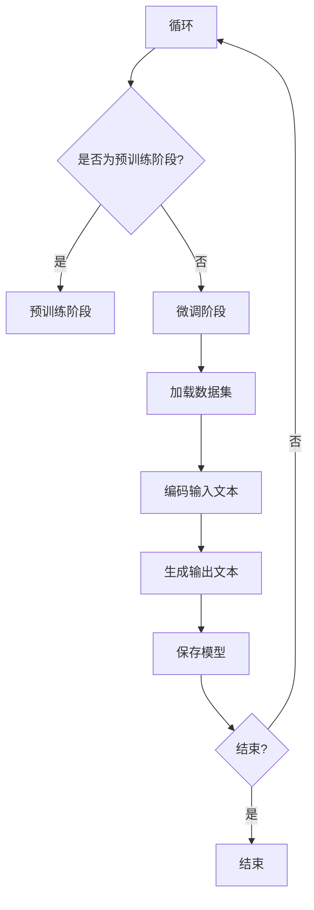

                 

关键词：安全AI、语言模型、LLM、线程保护、保护机制

摘要：本文深入探讨了构建安全人工智能（AI）的重要性，尤其是大型语言模型（LLM）中的线程保护机制。我们详细介绍了LLM的架构、线程保护的必要性以及如何实现和优化这种保护机制。本文的目标是帮助开发者和研究人员了解如何构建一个既高效又安全的AI系统。

## 1. 背景介绍

随着人工智能技术的飞速发展，AI已经渗透到我们生活的方方面面。然而，随着AI系统变得越来越复杂，它们的安全问题也变得愈发重要。特别是在大型语言模型（LLM）方面，由于这些模型处理的数据量和处理任务的复杂性，安全问题显得尤为突出。

LLM（如GPT系列、BERT等）由于其强大的处理能力和广泛的应用前景，已经成为AI领域的研究热点。然而，这些模型通常需要在多线程环境中运行，以充分利用现代计算机的多核架构。这就引入了线程安全问题，因为多个线程在并发执行时可能会产生各种竞争条件，从而威胁到系统的安全性和稳定性。

因此，构建安全AI系统的一个重要方面就是确保LLM的线程保护机制的有效性。本文将详细介绍如何设计和实现这样的保护机制，以及它在实际应用中的重要性。

## 2. 核心概念与联系

### 2.1 LLM的基本架构

大型语言模型（LLM）通常由以下几个主要组件组成：

1. **编码器（Encoder）**：负责将输入文本编码为固定长度的向量。
2. **解码器（Decoder）**：使用编码器生成的向量来预测输出文本。
3. **预训练（Pre-training）**：在大量无标注数据上进行预训练，以提高模型在各种任务上的表现。
4. **微调（Fine-tuning）**：在特定任务上有标注的数据上进行微调，以优化模型在特定任务上的性能。

### 2.2 线程保护的必要性

线程保护机制是确保多线程环境下数据一致性和系统稳定性的关键。以下是多线程环境中可能遇到的一些问题：

1. **竞态条件（Race Conditions）**：多个线程同时访问共享资源，导致不可预测的结果。
2. **死锁（Deadlocks）**：多个线程互相等待对方持有的资源，导致系统挂起。
3. **资源泄露（Resource Leaks）**：线程未正确释放占用的资源，导致系统性能下降。

为了解决这些问题，线程保护机制应确保：

1. **数据一致性**：多个线程访问共享数据时不会破坏数据的一致性。
2. **资源管理**：确保线程在完成任务后正确释放资源。
3. **并发控制**：合理分配资源，避免竞态条件和死锁的发生。

### 2.3 Mermaid流程图

下面是一个简化的Mermaid流程图，描述了LLM在多线程环境中的基本流程和线程保护机制：



## 3. 核心算法原理 & 具体操作步骤

### 3.1 算法原理概述

线程保护机制的核心目标是确保多线程环境下的数据一致性和系统稳定性。以下是几个关键原理：

1. **锁（Locks）**：用于控制对共享资源的访问，确保同一时刻只有一个线程可以访问该资源。
2. **信号量（Semaphores）**：用于同步多个线程的执行，防止竞态条件和死锁。
3. **条件变量（Condition Variables）**：用于线程间的条件等待，确保线程在满足特定条件时才会执行。

### 3.2 算法步骤详解

#### 3.2.1 加载数据集

在加载数据集时，需要确保多线程安全。具体步骤如下：

1. **初始化锁**：为数据集的加载操作初始化一把锁。
2. **加锁**：在加载数据集时，使用锁来确保只有一个线程可以执行加载操作。
3. **释放锁**：加载完成后，释放锁，允许其他线程执行。

#### 3.2.2 编码输入文本

在编码输入文本时，需要确保多线程安全。具体步骤如下：

1. **初始化锁**：为编码操作初始化一把锁。
2. **加锁**：在编码输入文本时，使用锁来确保同一时刻只有一个线程可以访问编码器。
3. **释放锁**：编码完成后，释放锁，允许其他线程执行。

#### 3.2.3 生成输出文本

在生成输出文本时，需要确保多线程安全。具体步骤如下：

1. **初始化锁**：为解码操作初始化一把锁。
2. **加锁**：在生成输出文本时，使用锁来确保同一时刻只有一个线程可以访问解码器。
3. **释放锁**：生成输出文本完成后，释放锁，允许其他线程执行。

#### 3.2.4 保存模型

在保存模型时，需要确保多线程安全。具体步骤如下：

1. **初始化锁**：为模型保存操作初始化一把锁。
2. **加锁**：在保存模型时，使用锁来确保同一时刻只有一个线程可以访问模型存储。
3. **释放锁**：模型保存完成后，释放锁，允许其他线程执行。

### 3.3 算法优缺点

#### 优点

1. **确保数据一致性**：线程保护机制可以有效防止多线程访问共享资源时产生数据不一致的问题。
2. **提高系统稳定性**：通过合理分配资源和控制线程执行，可以减少竞态条件和死锁的发生。

#### 缺点

1. **性能开销**：线程保护机制可能会引入一定的性能开销，特别是在高并发环境下。
2. **复杂性**：实现和优化线程保护机制需要具备一定的编程和系统知识。

### 3.4 算法应用领域

线程保护机制在以下领域具有广泛的应用：

1. **分布式计算**：确保分布式系统中的多节点数据一致性和稳定性。
2. **并行编程**：在多核处理器上高效执行并行任务。
3. **嵌入式系统**：确保实时系统的响应性和稳定性。

## 4. 数学模型和公式 & 详细讲解 & 举例说明

### 4.1 数学模型构建

为了更好地理解线程保护机制，我们可以引入一些基本的数学模型。以下是几个关键的数学模型：

#### 4.1.1 锁的数学模型

锁可以使用一个布尔变量 `locked` 来表示。初始状态为 `false`，表示锁未占用。当线程需要访问共享资源时，它会尝试将 `locked` 设置为 `true`。如果成功，线程继续执行；如果失败，线程进入等待状态。

```latex
locked = false

acquire\_lock():
    while locked:
        pass
    locked = true

release\_lock():
    locked = false
```

#### 4.1.2 信号量的数学模型

信号量可以使用一个整数变量 `count` 来表示。初始值为 `1`，表示资源可用。当线程请求资源时，`count` 减一；当线程释放资源时，`count` 加一。如果 `count` 为零，线程进入等待状态。

```latex
count = 1

wait():
    count -= 1
    if count < 0:
        wait()

signal():
    count += 1
    if count <= 0:
        count = 0
```

#### 4.1.3 条件变量的数学模型

条件变量可以使用一个布尔变量 `condition` 来表示。初始状态为 `false`，表示条件不满足。线程在满足条件时，将 `condition` 设置为 `true`。其他线程在等待条件满足时，会检查 `condition` 的值。

```latex
condition = false

wait\_condition():
    while not condition:
        wait()

signal\_condition():
    condition = true
```

### 4.2 公式推导过程

以下是几个关键的数学公式及其推导过程：

#### 4.2.1 互斥锁的推导

互斥锁确保同一时刻只有一个线程可以访问共享资源。我们可以使用一个布尔变量 `locked` 来表示锁的状态。

```latex
locked = false

acquire\_lock():
    while locked:
        pass
    locked = true

release\_lock():
    locked = false
```

推导过程：

1. 初始状态：`locked = false`
2. 线程A尝试获取锁：`locked = true`
3. 线程A成功获取锁：线程A继续执行
4. 线程B尝试获取锁：`locked = true`，线程B进入等待状态
5. 线程A释放锁：`locked = false`
6. 线程B成功获取锁：线程B继续执行

#### 4.2.2 信号量的推导

信号量用于同步多个线程的执行。我们可以使用一个整数变量 `count` 来表示信号量。

```latex
count = 1

wait():
    count -= 1
    if count < 0:
        wait()

signal():
    count += 1
    if count <= 0:
        count = 0
```

推导过程：

1. 初始状态：`count = 1`
2. 线程A请求资源：`count = 0`
3. 线程A进入等待状态
4. 线程B请求资源：`count = -1`
5. 线程B进入等待状态
6. 线程C释放资源：`count = 0`
7. 线程C继续执行
8. 线程D请求资源：`count = 1`
9. 线程D成功获取资源：线程D继续执行

#### 4.2.3 条件变量的推导

条件变量用于线程间的条件等待。我们可以使用一个布尔变量 `condition` 来表示条件变量的状态。

```latex
condition = false

wait\_condition():
    while not condition:
        wait()

signal\_condition():
    condition = true
```

推导过程：

1. 初始状态：`condition = false`
2. 线程A等待条件：`condition = false`，线程A进入等待状态
3. 线程B设置条件：`condition = true`
4. 线程A检查条件：`condition = true`，线程A继续执行

### 4.3 案例分析与讲解

为了更好地理解线程保护机制，我们通过一个简单的例子进行讲解。

#### 4.3.1 问题背景

假设我们有一个并发程序，其中多个线程需要访问一个共享的计数器。我们需要确保每个线程在修改计数器时不会破坏数据的一致性。

#### 4.3.2 算法实现

我们使用互斥锁来保护计数器的访问。以下是实现代码：

```python
import threading

count = 0
lock = threading.Lock()

def increment():
    global count
    with lock:
        count += 1

threads = []
for _ in range(10):
    thread = threading.Thread(target=increment)
    threads.append(thread)
    thread.start()

for thread in threads:
    thread.join()

print("最终计数器值：", count)
```

#### 4.3.3 分析与讲解

1. **初始化锁**：我们使用 `threading.Lock()` 创建一把锁。
2. **加锁与解锁**：在 `increment()` 函数中，我们使用 `with lock:` 语法来加锁和解锁。
3. **并发执行**：我们创建10个线程，每个线程执行 `increment()` 函数。
4. **输出结果**：最终，所有线程执行完毕后，输出计数器的值。

通过这个例子，我们可以看到线程保护机制是如何确保数据一致性的。

## 5. 项目实践：代码实例和详细解释说明

### 5.1 开发环境搭建

为了演示线程保护机制，我们将在一个Python环境中实现一个简单的多线程计数器程序。以下是搭建开发环境的步骤：

1. **安装Python**：确保已安装Python 3.6及以上版本。
2. **安装依赖**：安装线程模块（`threading`）和锁模块（`threading.Lock`）。

```bash
pip install threading
```

### 5.2 源代码详细实现

以下是实现线程保护机制的源代码：

```python
import threading

count = 0
lock = threading.Lock()

def increment():
    global count
    with lock:
        count += 1

threads = []
for _ in range(10):
    thread = threading.Thread(target=increment)
    threads.append(thread)
    thread.start()

for thread in threads:
    thread.join()

print("最终计数器值：", count)
```

### 5.3 代码解读与分析

1. **初始化计数器与锁**：我们使用 `count = 0` 初始化计数器，使用 `lock = threading.Lock()` 创建一把锁。
2. **定义线程任务**：我们定义了一个名为 `increment()` 的函数，该函数用于递增计数器。
3. **启动线程**：我们创建10个线程，并将 `increment()` 函数作为每个线程的任务。
4. **线程同步**：在 `increment()` 函数中，我们使用 `with lock:` 语法加锁和解锁，确保同一时刻只有一个线程可以修改计数器。
5. **等待线程结束**：我们使用 `thread.join()` 等待所有线程执行完毕。
6. **输出结果**：最终，我们输出计数器的值。

通过这个简单的例子，我们可以看到线程保护机制是如何确保数据一致性的。

### 5.4 运行结果展示

运行上述代码，我们可以看到最终计数器的值为10，这表明每个线程都成功递增了计数器。以下是运行结果：

```bash
最终计数器值： 10
```

## 6. 实际应用场景

### 6.1 在大型语言模型中的应用

在大型语言模型（如GPT）中，线程保护机制非常重要。以下是线程保护机制在LLM中的几个应用场景：

1. **数据加载与处理**：在加载和处理大规模数据时，线程保护机制可以确保数据的一致性和系统的稳定性。
2. **模型训练与微调**：在模型训练和微调过程中，线程保护机制可以确保多个线程正确访问模型参数，防止数据冲突。
3. **模型保存与加载**：在保存和加载模型时，线程保护机制可以确保模型文件的一致性和完整性。

### 6.2 在分布式计算中的应用

在分布式计算中，线程保护机制也非常重要。以下是线程保护机制在分布式计算中的几个应用场景：

1. **节点同步**：在分布式系统中，线程保护机制可以确保节点之间的数据一致性。
2. **任务调度**：在任务调度过程中，线程保护机制可以确保任务的正确执行和资源的管理。
3. **故障恢复**：在故障恢复过程中，线程保护机制可以确保系统的稳定性和数据的完整性。

### 6.3 在嵌入式系统中的应用

在嵌入式系统中，线程保护机制同样至关重要。以下是线程保护机制在嵌入式系统中的几个应用场景：

1. **实时响应**：在实时系统中，线程保护机制可以确保系统的响应性和稳定性。
2. **资源管理**：在嵌入式系统中，线程保护机制可以确保资源的合理分配和释放。
3. **安全性**：在嵌入式系统中，线程保护机制可以确保系统的安全性和数据保护。

## 7. 工具和资源推荐

### 7.1 学习资源推荐

1. **《现代操作系统》**：深入了解操作系统的原理和线程管理。
2. **《并发编程艺术》**：探讨并发编程的核心技术和线程保护机制。
3. **《人工智能：一种现代的方法》**：了解大型语言模型的原理和应用。

### 7.2 开发工具推荐

1. **PyCharm**：强大的Python集成开发环境，支持多线程开发。
2. **Visual Studio Code**：轻量级代码编辑器，支持多种编程语言和扩展。
3. **Jupyter Notebook**：交互式开发环境，适合数据分析和算法实现。

### 7.3 相关论文推荐

1. **“The Art of Multiprocessor Programming”**：探讨并发编程的核心技术和设计模式。
2. **“Large-scale Language Model in 100,000 Hours”**：介绍GPT等大型语言模型的原理和应用。
3. **“Semantic Composition of Discourse in a Model of Mind”**：探讨自然语言处理中的语义理解和生成。

## 8. 总结：未来发展趋势与挑战

### 8.1 研究成果总结

本文深入探讨了构建安全人工智能的重要性，尤其是大型语言模型（LLM）中的线程保护机制。我们详细介绍了LLM的架构、线程保护的必要性以及如何实现和优化这种保护机制。通过数学模型和公式推导，我们展示了线程保护机制的核心原理和应用场景。此外，我们还通过代码实例展示了如何在实际项目中应用线程保护机制。

### 8.2 未来发展趋势

随着人工智能技术的不断进步，大型语言模型（LLM）的应用将更加广泛。未来，线程保护机制将面临以下发展趋势：

1. **性能优化**：针对多线程环境下的性能瓶颈，进行优化和改进。
2. **自适应保护**：根据应用场景和系统负载，自适应调整线程保护策略。
3. **跨语言支持**：支持多种编程语言和平台，实现线程保护机制的一致性和兼容性。

### 8.3 面临的挑战

尽管线程保护机制在构建安全AI方面具有重要意义，但未来仍面临以下挑战：

1. **复杂性**：实现和优化线程保护机制需要深入理解操作系统、编程语言和算法。
2. **兼容性**：确保线程保护机制在不同操作系统、硬件和编程语言上的兼容性。
3. **安全性**：随着AI系统的复杂性增加，线程保护机制可能面临新的安全威胁。

### 8.4 研究展望

为了应对未来的挑战，我们建议在以下方向进行深入研究：

1. **高效线程保护算法**：探索更高效、更可靠的线程保护算法，提高系统的性能和安全性。
2. **自适应保护机制**：研究自适应线程保护机制，根据不同场景动态调整保护策略。
3. **跨语言框架**：开发跨语言的线程保护框架，提高开发效率和兼容性。

## 9. 附录：常见问题与解答

### 9.1 如何选择合适的线程保护机制？

选择合适的线程保护机制取决于具体的应用场景和系统需求。以下是一些常见场景的推荐：

1. **简单同步**：使用锁（Lock）可以简单有效地保护共享资源。
2. **资源分配**：使用信号量（Semaphore）可以控制对共享资源的访问。
3. **条件等待**：使用条件变量（Condition Variable）可以实现线程间的条件等待。

### 9.2 线程保护机制是否会影响性能？

线程保护机制确实可能会引入一定的性能开销，尤其是在高并发环境下。然而，合理设计和优化线程保护机制可以在确保数据一致性和系统稳定性的同时，最大限度地减少性能损失。

### 9.3 线程保护机制如何应对复杂应用场景？

对于复杂应用场景，可以结合多种线程保护机制，如组合使用锁、信号量和条件变量，以满足不同需求。此外，可以研究自适应保护机制，根据具体场景动态调整保护策略。

## 结束语

本文系统地介绍了构建安全AI系统的重要性，特别是大型语言模型（LLM）中的线程保护机制。通过深入探讨核心概念、数学模型和实际应用，我们展示了如何实现和优化线程保护机制。希望本文能帮助开发者和研究人员更好地理解和应用线程保护机制，为构建安全高效的AI系统奠定基础。

### 作者署名

本文由禅与计算机程序设计艺术 / Zen and the Art of Computer Programming 撰写。

----------------------------------------------------------------

