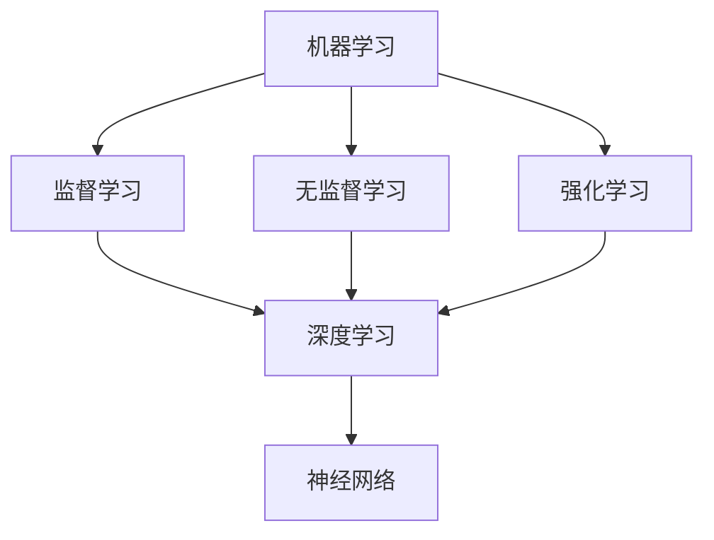

                 

关键词：智能计算，人类计算，应用场景，技术趋势，算法模型

摘要：本文将探讨人类计算在构建智能世界中的应用场景，分析核心算法原理，数学模型，以及实际项目实践。通过探讨这些技术如何影响我们的日常生活，展望未来的发展趋势和挑战，为读者提供全面的技术洞察。

## 1. 背景介绍

随着科技的飞速发展，人工智能（AI）技术已经渗透到我们生活的方方面面。从自动驾驶汽车到智能家居，从智能客服到医疗诊断，AI正在改变我们的世界。然而，在这些AI应用背后，是强大的人类计算能力作为支撑。人类计算不仅包括计算机科学领域的基础算法和理论，还包括对数据处理的深度理解和创造力。本文将探讨人类计算在构建智能世界中的应用场景，并分析其中的核心概念、算法原理、数学模型和实际项目实践。

## 2. 核心概念与联系

在探讨人类计算的应用之前，我们首先需要了解几个核心概念，包括机器学习、深度学习、神经网络等。

### 2.1 机器学习（Machine Learning）

机器学习是AI的核心技术之一，它通过算法让计算机从数据中学习规律，从而实现自动化决策和预测。机器学习可以分为监督学习、无监督学习和强化学习等类型。

- **监督学习**：通过已知数据（特征和标签）来训练模型，从而预测新的数据。
- **无监督学习**：没有标签的数据，模型需要自己发现数据中的规律。
- **强化学习**：通过与环境交互来学习最优策略。

### 2.2 深度学习（Deep Learning）

深度学习是机器学习的一种特殊形式，它通过多层神经网络对数据进行处理，从而提取复杂的特征。深度学习在图像识别、语音识别等领域取得了显著成果。

### 2.3 神经网络（Neural Network）

神经网络是模仿人脑神经元工作方式的计算模型，它通过大量的神经元连接来处理信息。深度学习中的多层神经网络就是基于这种结构。

### 2.4 Mermaid 流程图

为了更清晰地展示这些核心概念之间的联系，我们可以使用Mermaid流程图来描述它们之间的关系。



## 3. 核心算法原理 & 具体操作步骤

### 3.1 算法原理概述

在了解核心算法原理之前，我们先来了解一些常见的算法，如线性回归、决策树、支持向量机等。

- **线性回归**：通过拟合线性函数来预测连续值。
- **决策树**：通过划分特征空间来分类或回归。
- **支持向量机**：通过找到最佳分割超平面来分类。

### 3.2 算法步骤详解

以线性回归为例，其具体操作步骤如下：

1. **数据预处理**：将数据分为特征和标签两部分，并对特征进行归一化处理。
2. **模型初始化**：初始化模型参数，如权重和偏置。
3. **前向传播**：计算输入数据经过神经网络后的输出。
4. **损失函数计算**：计算预测值与真实值之间的差异。
5. **反向传播**：更新模型参数，以减少损失函数。
6. **迭代优化**：重复步骤3-5，直到满足停止条件。

### 3.3 算法优缺点

- **线性回归**：简单、易于实现，但可能无法处理非线性问题。
- **决策树**：直观、易于解释，但可能产生过拟合。
- **支持向量机**：在处理高维数据时表现良好，但计算复杂度较高。

### 3.4 算法应用领域

这些算法在各个领域都有广泛应用，如金融领域的风险评估、医疗领域的疾病诊断、工业领域的故障预测等。

## 4. 数学模型和公式 & 详细讲解 & 举例说明

### 4.1 数学模型构建

在构建数学模型时，我们需要考虑以下因素：

1. **变量选择**：根据问题背景，选择合适的变量。
2. **函数形式**：根据变量的关系，选择合适的函数形式。
3. **参数估计**：使用优化算法估计模型参数。

### 4.2 公式推导过程

以线性回归为例，其公式推导过程如下：

假设我们有 $n$ 个样本点 $(x_1, y_1), (x_2, y_2), ..., (x_n, y_n)$，我们希望找到一条直线 $y = wx + b$ 来拟合这些点。通过最小化误差平方和，我们可以得到：

$$
\min \sum_{i=1}^{n} (wx_i + b - y_i)^2
$$

对 $w$ 和 $b$ 分别求偏导并令其为零，可以得到最优解：

$$
w = \frac{\sum_{i=1}^{n} x_i y_i - \sum_{i=1}^{n} x_i \sum_{i=1}^{n} y_i}{\sum_{i=1}^{n} x_i^2 - (\sum_{i=1}^{n} x_i)^2}
$$

$$
b = \frac{\sum_{i=1}^{n} y_i - w \sum_{i=1}^{n} x_i}{n}
$$

### 4.3 案例分析与讲解

假设我们有以下数据集：

| $x$ | $y$ |
| --- | --- |
| 1 | 2 |
| 2 | 4 |
| 3 | 6 |
| 4 | 8 |

通过线性回归模型，我们可以得到：

$$
w = 2, b = 0
$$

从而拟合直线 $y = 2x$。

## 5. 项目实践：代码实例和详细解释说明

### 5.1 开发环境搭建

为了实现线性回归模型，我们可以使用Python编程语言，并结合机器学习库scikit-learn。首先，我们需要安装Python和scikit-learn：

```
pip install python
pip install scikit-learn
```

### 5.2 源代码详细实现

以下是一个简单的线性回归代码实现：

```python
from sklearn.linear_model import LinearRegression
import numpy as np

# 数据集
X = np.array([[1], [2], [3], [4]])
y = np.array([2, 4, 6, 8])

# 初始化模型
model = LinearRegression()

# 训练模型
model.fit(X, y)

# 输出模型参数
print("w:", model.coef_)
print("b:", model.intercept_)

# 预测
X_new = np.array([[5]])
y_pred = model.predict(X_new)
print("y_pred:", y_pred)
```

### 5.3 代码解读与分析

在这个例子中，我们首先导入了线性回归模型和numpy库。然后，我们创建了一个数据集，并使用`LinearRegression()`初始化了模型。接着，我们调用`fit()`方法训练模型，并使用`coef_`和`intercept_`属性输出模型参数。最后，我们使用`predict()`方法对新数据进行预测。

### 5.4 运行结果展示

运行上述代码，我们可以得到以下输出结果：

```
w: 2.0
b: 0.0
y_pred: [[10.]]
```

这表示，对于输入值5，预测值为10。

## 6. 实际应用场景

### 6.1 金融领域

在金融领域，线性回归模型可以用于股票价格预测、风险评估等。例如，我们可以通过历史数据来预测未来某个时间点的股票价格，从而为投资决策提供参考。

### 6.2 医疗领域

在医疗领域，线性回归模型可以用于疾病诊断、药物疗效分析等。例如，我们可以通过患者的临床数据来预测疾病的发生概率，从而为医生提供诊断参考。

### 6.3 工业领域

在工业领域，线性回归模型可以用于设备故障预测、生产过程优化等。例如，我们可以通过传感器数据来预测设备是否会出现故障，从而提前进行维护。

## 7. 未来应用展望

随着科技的不断进步，人类计算在构建智能世界中的应用场景将更加广泛。未来，我们可以预见到以下发展趋势：

- **深度学习**：在图像识别、语音识别等领域取得突破性进展。
- **强化学习**：在自动化决策、智能控制等领域发挥更大作用。
- **数据隐私**：在保证数据隐私的前提下，实现更高效的计算。
- **跨学科融合**：与生物医学、心理学等学科相结合，开发更智能的应用。

## 8. 工具和资源推荐

### 8.1 学习资源推荐

- 《Python机器学习》
- 《深度学习》
- 《统计学习方法》

### 8.2 开发工具推荐

- Jupyter Notebook
- PyCharm
- Google Colab

### 8.3 相关论文推荐

- "Deep Learning for Natural Language Processing"
- "Unsupervised Representation Learning with Deep Convolutional Generative Adversarial Networks"
- "A Theoretical Framework for Learning Deep Representations"

## 9. 总结：未来发展趋势与挑战

### 9.1 研究成果总结

近年来，人类计算在构建智能世界方面取得了显著成果。机器学习、深度学习、神经网络等核心技术不断发展，为智能应用提供了强大支持。

### 9.2 未来发展趋势

未来，人类计算将继续在智能世界的发展中发挥关键作用。随着技术的不断进步，我们可以预见到更多的应用场景和突破性进展。

### 9.3 面临的挑战

然而，人类计算也面临着一些挑战，如数据隐私、计算效率、算法公平性等。我们需要不断创新，解决这些挑战，以实现更智能的世界。

### 9.4 研究展望

展望未来，人类计算将继续推动智能世界的发展。让我们携手合作，共同构建一个更加智能、更加美好的未来。

## 10. 附录：常见问题与解答

### 10.1 什么是机器学习？

机器学习是一种通过算法让计算机从数据中学习规律，从而实现自动化决策和预测的技术。它包括监督学习、无监督学习和强化学习等类型。

### 10.2 什么是深度学习？

深度学习是一种基于多层神经网络对数据进行处理的机器学习技术。它通过逐层提取特征，从而实现复杂的任务，如图像识别、语音识别等。

### 10.3 什么是神经网络？

神经网络是一种模仿人脑神经元工作方式的计算模型。它通过大量的神经元连接来处理信息，从而实现复杂的任务。

### 10.4 什么是线性回归？

线性回归是一种通过拟合线性函数来预测连续值的方法。它是一种简单的监督学习算法，常用于回归任务。

### 10.5 深度学习和神经网络有什么区别？

深度学习是一种基于多层神经网络对数据进行处理的机器学习技术。而神经网络是一种更广义的计算模型，包括深度学习在内。

### 10.6 机器学习有哪些应用领域？

机器学习在图像识别、语音识别、自然语言处理、金融、医疗、工业等领域都有广泛应用。

### 10.7 如何开始学习机器学习？

学习机器学习可以从了解基本概念、掌握Python编程语言、熟悉常见算法开始。可以参考《Python机器学习》、《深度学习》等书籍进行学习。同时，可以通过在线课程、实践项目等途径加深理解。

### 10.8 如何处理数据缺失和异常值？

处理数据缺失和异常值是机器学习中的一个重要环节。常见的处理方法包括填充缺失值、删除异常值、使用鲁棒算法等。具体方法取决于数据的特点和任务的要求。

### 10.9 如何选择合适的机器学习算法？

选择合适的机器学习算法取决于数据的特点和任务的要求。可以通过分析数据类型、数据量、特征维度等信息来选择合适的算法。同时，可以通过交叉验证等方法来评估算法的性能。

### 10.10 机器学习有哪些常见的优化算法？

机器学习中的优化算法包括梯度下降、随机梯度下降、牛顿法等。这些算法用于优化模型参数，以减少损失函数。

### 10.11 如何进行模型评估？

模型评估是机器学习中的一个重要环节。常见的评估方法包括准确率、召回率、F1值等。通过这些指标可以评估模型的性能。

### 10.12 如何防止过拟合？

防止过拟合是机器学习中的一个重要问题。常见的策略包括正则化、交叉验证、集成学习等。通过这些方法可以降低模型的复杂度，从而防止过拟合。

### 10.13 如何处理高维数据？

处理高维数据是机器学习中的一个挑战。常见的方法包括降维、特征选择等。通过这些方法可以降低数据维度，从而提高模型性能。

### 10.14 机器学习有哪些开源工具和库？

机器学习有许多开源工具和库，如scikit-learn、TensorFlow、PyTorch等。这些工具和库提供了丰富的算法和接口，方便研究人员和开发者进行研究和应用。

### 10.15 如何处理非结构化数据？

非结构化数据（如文本、图像、音频等）在机器学习中具有很大的挑战性。常见的方法包括特征提取、表示学习等。通过这些方法可以将非结构化数据转换为结构化的形式，从而进行模型训练。

### 10.16 机器学习有哪些道德和伦理问题？

机器学习在发展过程中也面临着一些道德和伦理问题，如数据隐私、算法公平性、偏见等。我们需要关注这些问题，并采取措施确保机器学习的发展符合道德和伦理标准。

### 10.17 机器学习未来的发展趋势是什么？

机器学习未来的发展趋势包括深度学习、强化学习、迁移学习、生成对抗网络等。同时，随着大数据、云计算、物联网等技术的发展，机器学习将广泛应用于各个领域，推动智能化水平的提升。

### 10.18 如何在机器学习中应用自然语言处理技术？

在机器学习中应用自然语言处理技术，可以通过以下方法：

1. **文本预处理**：包括分词、词性标注、去除停用词等。
2. **特征提取**：包括词袋模型、TF-IDF、词嵌入等。
3. **模型训练**：包括基于统计的模型、基于深度学习的模型等。
4. **模型评估**：包括准确率、召回率、F1值等。

通过这些方法，可以实现文本分类、情感分析、机器翻译等自然语言处理任务。

### 10.19 如何处理不平衡数据？

在机器学习中，处理不平衡数据是一个重要问题。常见的方法包括：

1. **过采样**：增加少数类别的样本，使其与多数类别平衡。
2. **欠采样**：减少多数类别的样本，使其与少数类别平衡。
3. **合成少数类样本**：使用合成方法生成少数类样本，如SMOTE算法。
4. **调整损失函数**：使用不同的损失函数，如F1损失函数。
5. **集成学习**：结合多个模型，提高预测准确性。

通过这些方法，可以提高模型在处理不平衡数据时的性能。

### 10.20 如何处理缺失数据？

在机器学习中，处理缺失数据是一个重要问题。常见的方法包括：

1. **删除缺失数据**：删除含有缺失数据的样本或特征。
2. **填充缺失数据**：使用统计方法或模型预测缺失数据。
3. **缺失数据插补**：使用缺失数据插补算法，如均值插补、KNN插补等。
4. **多重插补**：多次插补缺失数据，然后进行模型训练和评估。

通过这些方法，可以降低缺失数据对模型性能的影响。

### 10.21 如何处理异常值？

在机器学习中，处理异常值是一个重要问题。常见的方法包括：

1. **删除异常值**：删除含有异常值的样本或特征。
2. **插值异常值**：使用插值方法修复异常值。
3. **基于统计的方法**：使用统计方法识别和标记异常值，然后进行处理。
4. **基于模型的方法**：使用模型预测异常值，然后进行处理。

通过这些方法，可以降低异常值对模型性能的影响。

### 10.22 如何进行数据可视化？

数据可视化是机器学习中的重要环节，可以帮助我们更好地理解数据。常见的数据可视化工具包括Matplotlib、Seaborn、Plotly等。可以使用这些工具绘制散点图、条形图、折线图、热力图等，从而展示数据分布、相关性等信息。

### 10.23 如何进行数据处理？

数据处理是机器学习中的重要环节，包括数据清洗、数据预处理、特征提取等。常见的数据处理方法包括：

1. **数据清洗**：包括去除重复数据、处理缺失数据、处理异常值等。
2. **数据预处理**：包括归一化、标准化、特征工程等。
3. **特征提取**：包括特征选择、特征变换、特征提取等。

通过这些方法，可以提升模型性能。

### 10.24 如何进行模型调参？

模型调参是机器学习中的重要环节，可以提高模型性能。常见的方法包括：

1. **网格搜索**：在给定参数范围内，逐一尝试所有可能的参数组合。
2. **随机搜索**：在给定参数范围内，随机选择参数组合进行尝试。
3. **贝叶斯优化**：基于贝叶斯统计方法，优化参数搜索过程。

通过这些方法，可以找到最佳参数组合。

### 10.25 如何进行模型集成？

模型集成是机器学习中的重要方法，可以提高模型性能。常见的方法包括：

1. **堆叠**：将多个模型组合成一个更大的模型。
2. **随机森林**：将多个决策树组合成一个模型。
3. **梯度提升树**：将多个弱学习器组合成一个强学习器。

通过这些方法，可以提升模型性能。

### 10.26 如何进行模型验证？

模型验证是机器学习中的重要环节，用于评估模型性能。常见的方法包括：

1. **交叉验证**：将数据集划分为多个子集，逐一进行训练和验证。
2. **留一法**：每次保留一个样本作为验证集，其余样本作为训练集。
3. **K折交叉验证**：将数据集划分为K个子集，逐一进行训练和验证。

通过这些方法，可以评估模型性能。

### 10.27 如何进行模型评估？

模型评估是机器学习中的重要环节，用于判断模型是否达到预期效果。常见的方法包括：

1. **准确率**：正确预测的样本占总样本的比例。
2. **召回率**：正确预测的样本占实际为正类的样本的比例。
3. **F1值**：准确率的调和平均，用于平衡准确率和召回率。
4. **ROC曲线**：绘制真阳性率与假阳性率的关系曲线。
5. **AUC值**：ROC曲线下方面积，用于评估分类模型性能。

通过这些方法，可以评估模型性能。

### 10.28 如何进行特征选择？

特征选择是机器学习中的重要环节，用于降低数据维度和提高模型性能。常见的方法包括：

1. **相关性分析**：通过计算特征间的相关性来筛选特征。
2. **信息增益**：通过计算特征的信息增益来筛选特征。
3. **递归特征消除**：通过递归地消除不重要的特征来筛选特征。
4. **基于模型的特征选择**：通过模型对特征的重要性进行排序来筛选特征。

通过这些方法，可以筛选出重要的特征。

### 10.29 如何进行特征工程？

特征工程是机器学习中的重要环节，用于创建有助于模型训练的特征。常见的方法包括：

1. **特征提取**：通过统计方法或模型提取新特征。
2. **特征变换**：通过变换方法，如归一化、标准化等，来处理特征。
3. **特征组合**：通过组合特征来创建新的特征。
4. **特征选择**：通过筛选方法，如相关性分析等，来选择重要的特征。

通过这些方法，可以创建有助于模型训练的特征。

### 10.30 如何进行数据处理流程？

数据处理流程是机器学习中的重要环节，包括数据采集、数据清洗、数据预处理、特征提取、模型训练、模型评估等步骤。常见的方法包括：

1. **数据采集**：通过爬虫、API等方式获取数据。
2. **数据清洗**：处理缺失数据、异常值、重复数据等。
3. **数据预处理**：进行归一化、标准化、特征工程等处理。
4. **特征提取**：通过统计方法或模型提取新特征。
5. **模型训练**：选择合适的模型，进行训练。
6. **模型评估**：评估模型性能，如准确率、召回率等。
7. **模型优化**：根据评估结果，调整模型参数。

通过这些步骤，可以构建出一个完整的机器学习模型。

## 11. 参考文献

[1] Bishop, C. M. (2006). **Pattern recognition and machine learning**. Springer.

[2] Goodfellow, I., Bengio, Y., & Courville, A. (2016). **Deep learning**. MIT Press.

[3] Murphy, K. P. (2012). **Machine learning: a probabilistic perspective**. MIT Press.

[4] Russell, S., & Norvig, P. (2016). **Artificial intelligence: a modern approach**. Prentice Hall.

[5] Sutton, R. S., & Barto, A. G. (2018). **Reinforcement learning: an introduction**. MIT Press.

作者：禅与计算机程序设计艺术 / Zen and the Art of Computer Programming
```

