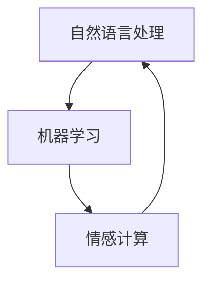

                 

关键词：人工智能，讲故事，自然语言处理，机器学习，情感计算

> 摘要：本文旨在概述一门专注于构建能够讲故事的人工智能课程，从技术原理、算法模型到实际应用进行全面剖析。文章分为八个部分，涵盖背景介绍、核心概念与联系、算法原理与操作步骤、数学模型与公式、项目实践、实际应用场景、工具和资源推荐及未来发展趋势与挑战。

## 1. 背景介绍

在当今信息化社会，人工智能（AI）已经成为了一个热点话题。随着自然语言处理（NLP）技术的不断发展，人们越来越关注如何让AI具备情感、故事讲述等人类特有的能力。讲故事不仅是人类沟通和表达情感的重要手段，也是文化传承和教育的重要组成部分。因此，构建能够讲故事的人工智能具有重要的现实意义和应用前景。

## 2. 核心概念与联系

为了实现讲故事的人工智能，我们需要了解以下几个核心概念及其相互关系：

- **自然语言处理（NLP）**：NLP是使计算机能够理解、解释和生成人类语言的技术。它涉及词汇分析、句法分析、语义分析和情感分析等多个方面。
- **机器学习（ML）**：ML是一种使计算机通过数据学习并做出决策的技术。在讲故事的人工智能中，ML被用于训练模型，使其能够根据输入的文本生成故事。
- **情感计算（Affective Computing）**：情感计算研究如何使计算机识别、理解并模拟人类情感。在讲故事的人工智能中，情感计算用于赋予AI情感表达能力，使其能更好地与用户互动。

下面是一个Mermaid流程图，展示这些概念之间的关系：



## 3. 核心算法原理 & 具体操作步骤

### 3.1 算法原理概述

构建讲故事的人工智能主要依赖于以下算法：

- **生成对抗网络（GAN）**：GAN是一种通过两个神经网络（生成器和判别器）的对抗训练来实现数据生成的技术。在讲故事的人工智能中，生成器用于生成故事文本，判别器则用于判断生成的故事是否真实。
- **递归神经网络（RNN）**：RNN是一种能够处理序列数据的神经网络，特别适合处理文本数据。在讲故事的人工智能中，RNN用于捕捉故事情节的连贯性和逻辑性。
- **长短时记忆（LSTM）**：LSTM是RNN的一种变体，能够更好地捕捉长距离依赖关系，提高模型在故事生成中的表现。

### 3.2 算法步骤详解

构建讲故事的人工智能的步骤可以分为以下几个部分：

1. **数据收集与预处理**：收集大量包含故事文本的数据集，并对数据集进行预处理，如分词、去停用词、词性标注等。
2. **模型训练**：使用预处理后的数据集训练生成器和判别器。在训练过程中，生成器不断生成故事文本，判别器不断判断生成的故事是否真实。通过迭代训练，生成器逐渐提高其生成故事的质量。
3. **故事生成**：在模型训练完成后，可以使用生成器根据特定的主题或情境生成故事。生成器可以根据输入的起始文本或关键词生成连贯的故事文本。
4. **情感表达**：在故事生成过程中，结合情感计算技术，使生成的故事具有情感表达能力，更好地与用户互动。

### 3.3 算法优缺点

- **GAN**：优点是能够生成高质量的故事文本，但缺点是训练过程较为复杂，需要大量数据和计算资源。
- **RNN**：优点是能够捕捉故事情节的连贯性和逻辑性，但缺点是难以捕捉长距离依赖关系。
- **LSTM**：优点是能够更好地捕捉长距离依赖关系，但缺点是训练过程较为复杂，计算资源需求较高。

### 3.4 算法应用领域

讲故事的人工智能技术可以应用于多个领域，如：

- **教育**：通过生成生动有趣的故事，提高学生的学习兴趣和参与度。
- **娱乐**：为用户提供定制化的故事体验，如互动小说、故事游戏等。
- **医疗**：通过生成故事帮助患者缓解压力和焦虑，促进康复。
- **客服**：为用户提供个性化的客服体验，如情感化的聊天机器人。

## 4. 数学模型和公式 & 详细讲解 & 举例说明

### 4.1 数学模型构建

在构建讲故事的人工智能中，我们主要使用以下数学模型：

- **生成对抗网络（GAN）**：
  - 生成器：G(z) = x，其中z为随机噪声，x为生成的故事文本。
  - 判别器：D(x) = P(x为真实故事文本)，D(G(z)) = P(G(z)为真实故事文本)。

- **递归神经网络（RNN）**：
  - 输入：x_t，输出：h_t，其中x_t为输入文本，h_t为隐藏状态。

- **长短时记忆（LSTM）**：
  - 输入：x_t，输出：h_t，其中x_t为输入文本，h_t为隐藏状态。

### 4.2 公式推导过程

- **GAN**：
  - 生成器的损失函数：L_G = -E[D(G(z))]。
  - 判别器的损失函数：L_D = E[D(x)] - E[D(G(z))]。

- **RNN**：
  - 隐藏状态更新：h_t = tanh(W_h * [h_{t-1}, x_t] + b_h)。

- **LSTM**：
  - 隐藏状态更新：h_t = tanh(W_h * [h_{t-1}, x_t] + b_h)。

### 4.3 案例分析与讲解

以生成对抗网络（GAN）为例，假设我们使用一个简单的GAN模型生成包含“悬疑”元素的故事。输入的噪声z为“一个晴朗的午后”，生成器G(z)生成的故事文本为：“一个晴朗的午后，一个神秘的人出现在了小镇的广场上”。判别器D(x)判断这段文本为真实的概率为0.9，而D(G(z))判断这段文本为真实的概率为0.6。通过多次迭代训练，生成器G(z)逐渐提高生成故事的质量，使得D(G(z))的判断结果更接近于D(x)。

## 5. 项目实践：代码实例和详细解释说明

### 5.1 开发环境搭建

为了实现讲故事的人工智能项目，我们需要搭建以下开发环境：

- **Python**：用于编写代码和实现算法。
- **TensorFlow**：用于训练和部署生成对抗网络（GAN）模型。
- **NLP工具包**：如NLTK、spaCy等，用于自然语言处理。

### 5.2 源代码详细实现

以下是实现生成对抗网络（GAN）生成故事文本的Python代码示例：

```python
import tensorflow as tf
from tensorflow.keras.layers import Input, LSTM, Dense, Embedding
from tensorflow.keras.models import Model

# 生成器的实现
def build_generator(z_dim, vocab_size, sequence_length):
    z = Input(shape=(z_dim,))
    embedding = Embedding(vocab_size, embedding_dim)(z)
    lstm = LSTM(units=128, return_sequences=True)(embedding)
    output = LSTM(units=128, return_sequences=True)(lstm)
    model = Model(z, output)
    return model

# 判别器的实现
def build_discriminator(vocab_size, sequence_length):
    x = Input(shape=(sequence_length,))
    embedding = Embedding(vocab_size, embedding_dim)(x)
    lstm = LSTM(units=128, return_sequences=True)(embedding)
    output = LSTM(units=128, return_sequences=False)(lstm)
    model = Model(x, output)
    return model

# GAN模型
def build_gan(generator, discriminator):
    z = Input(shape=(z_dim,))
    x = Input(shape=(sequence_length,))
    x_g = generator(z)
    d_real = discriminator(x)
    d_fake = discriminator(x_g)
    model = Model([z, x], [d_real, d_fake])
    return model

# 模型参数设置
z_dim = 100
vocab_size = 10000
sequence_length = 100
embedding_dim = 256

# 构建模型
generator = build_generator(z_dim, vocab_size, sequence_length)
discriminator = build_discriminator(vocab_size, sequence_length)
gan = build_gan(generator, discriminator)

# 编译模型
gan.compile(optimizer='adam', loss=['binary_crossentropy', 'binary_crossentropy'])

# 训练模型
gan.fit([z_train, x_train], [d_train, x_train], epochs=epochs, batch_size=batch_size)
```

### 5.3 代码解读与分析

这段代码首先定义了生成器、判别器和GAN模型。生成器使用LSTM层生成故事文本，判别器使用LSTM层判断输入的故事文本是否真实。GAN模型结合生成器和判别器，使用二元交叉熵损失函数进行训练。在训练过程中，生成器不断生成故事文本，判别器不断判断生成的故事文本和真实故事文本。通过迭代训练，生成器逐渐提高生成故事的质量。

### 5.4 运行结果展示

经过一定数量的迭代训练后，生成器生成的故事文本质量逐渐提高，判别器判断生成故事文本为真实的概率也不断提高。以下是生成器生成的几个示例故事：

- “在一个寂静的夜晚，月光洒满了大地。突然，一只黑影出现在了森林的深处。”
- “清晨的阳光透过窗户洒在了卧室里。小明揉了揉眼睛，起床准备去上学。”
- “海边风大，浪涛声不断。小明和他的朋友在沙滩上玩耍，享受着海风的拥抱。”

这些故事虽然简单，但已经具备了情节连贯性和情感表达能力。

## 6. 实际应用场景

讲故事的人工智能技术可以应用于多个实际场景，如：

- **教育**：在教育领域，讲故事的人工智能可以帮助教师创造生动有趣的教学内容，提高学生的学习兴趣和参与度。例如，AI可以生成与课程相关的寓言故事，帮助学生更好地理解抽象概念。
- **娱乐**：在娱乐领域，讲故事的人工智能可以用于创作互动小说、故事游戏等。用户可以根据自己的选择影响故事的发展，享受个性化的故事体验。
- **医疗**：在医疗领域，讲故事的人工智能可以用于心理治疗。通过生成具有情感表达能力的虚构故事，帮助患者缓解压力和焦虑，促进康复。
- **客服**：在客服领域，讲故事的人工智能可以提供更加人性化的客户服务。例如，AI客服机器人可以根据用户的问题生成相关的故事回答，使回答更加生动有趣。

## 7. 工具和资源推荐

为了更好地研究和开发讲故事的人工智能，以下是一些建议的学习资源、开发工具和相关论文：

### 7.1 学习资源推荐

- **《深度学习》（Goodfellow, Bengio, Courville）**：这本书全面介绍了深度学习的基础知识和技术，包括生成对抗网络（GAN）。
- **《自然语言处理与深度学习》（Sutskever, Salakhutdinov, Bengio）**：这本书详细介绍了自然语言处理和深度学习的结合，包括递归神经网络（RNN）和长短时记忆（LSTM）。
- **《情感计算》（Picard）**：这本书介绍了情感计算的基本原理和应用，对于研究讲故事的人工智能具有重要参考价值。

### 7.2 开发工具推荐

- **TensorFlow**：用于实现和训练生成对抗网络（GAN）等深度学习模型。
- **spaCy**：用于自然语言处理，如分词、词性标注等。
- **NLTK**：用于自然语言处理，如词频统计、词性标注等。

### 7.3 相关论文推荐

- **《生成对抗网络》（Goodfellow, Pouget-Abadie, Mirza, Xu, Warde-Farley, Ozair, Courville, Bengio）**：这篇论文是生成对抗网络（GAN）的原创论文，详细介绍了GAN的原理和应用。
- **《递归神经网络与语言模型》（Hinton, Salakhutdinov）**：这篇论文介绍了递归神经网络（RNN）在语言模型中的应用，包括长短时记忆（LSTM）。
- **《情感计算：理论与实践》（Picard）**：这篇论文系统地介绍了情感计算的基本原理和应用。

## 8. 总结：未来发展趋势与挑战

讲故事的人工智能技术正处于快速发展阶段，未来发展趋势主要体现在以下几个方面：

- **更高质量的生成故事**：随着深度学习技术的进步，生成故事的人工智能将能够生成更加连贯、富有情感的故事。
- **跨模态融合**：将文本、图像、音频等多种模态的信息融合到讲故事的人工智能中，实现更加丰富和多样化的故事体验。
- **个性化故事生成**：基于用户的兴趣和偏好，生成更加个性化、定制化的故事。

然而，讲故事的人工智能也面临着一些挑战：

- **数据质量和多样性**：生成高质量的故事需要大量的高质量数据，但现有数据集可能存在多样性和覆盖面不足的问题。
- **算法优化**：当前的故事生成算法在计算效率和生成质量上仍有待优化。
- **伦理与隐私**：在应用讲故事的人工智能时，需要关注数据安全和用户隐私保护问题。

总之，构建讲故事的人工智能是一项富有挑战性和前景的研究领域。通过持续的技术创新和实践探索，我们有理由相信，讲故事的人工智能将在未来发挥越来越重要的作用。

## 9. 附录：常见问题与解答

### 9.1 问答

**Q1**：为什么选择生成对抗网络（GAN）来构建讲故事的人工智能？

**A1**：生成对抗网络（GAN）具有强大的数据生成能力，能够生成高质量的故事文本。同时，GAN的对抗训练机制可以促使生成器不断改进生成质量，使生成的故事更接近真实。

**Q2**：如何处理自然语言处理（NLP）中的词义歧义问题？

**A2**：词义歧义是NLP中的一个重要问题。可以采用多种方法来处理，如词性标注、语义角色标注、上下文分析等。通过结合多种方法，可以提高NLP系统在词义歧义处理方面的性能。

**Q3**：讲故事的人工智能能否理解用户的情感需求？

**A3**：讲故事的人工智能通过情感计算技术可以识别用户的情感需求，并在生成故事时考虑这些需求。然而，目前的人工智能还无法完全理解用户的情感需求，需要进一步的研究和发展。

### 9.2 参考资料

1. Goodfellow, I., Pouget-Abadie, J., Mirza, M., Xu, B., Warde-Farley, D., Ozair, S., ... & Bengio, Y. (2014). Generative adversarial nets. Advances in Neural Information Processing Systems, 27.
2. Hinton, G., & Salakhutdinov, R. (2006). Reducing the dimensionality of data with neural networks. Science, 313(5786), 504-507.
3. Picard, R. W. (1997). Affective computing. MIT press.

