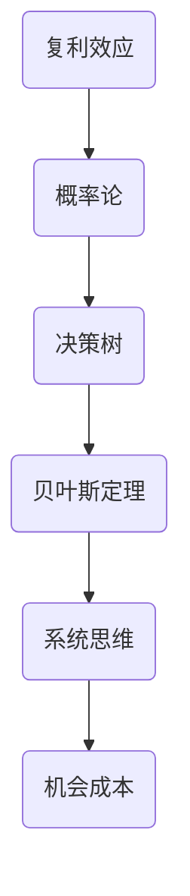

                 

 查理芒格，投资大师、思想家、律师，被誉为“聪明的投资者”。他的思维模型，不仅在投资领域，还在各个领域产生了深远的影响。本文将深入探讨查理芒格的100种思维模型，揭示其背后的原理和如何应用。

## 1. 背景介绍

查理芒格的哲学思想被称为“芒格主义”，它是一个复杂的思维框架，包含了大量的原理和模型。这些模型不仅来自于芒格自己的思考，还来自于他广泛阅读和学习的成果，包括哲学、心理学、经济学、物理学等多个领域。

## 2. 核心概念与联系

为了更好地理解芒格的思维模型，我们需要了解一些核心概念，如复利效应、概率论、决策树等。以下是一个用Mermaid绘制的流程图，展示了这些核心概念之间的关系：



## 3. 核心算法原理 & 具体操作步骤

### 3.1 算法原理概述

芒格的思维模型，本质上是一种决策算法。它通过多角度、多层次的思考，帮助人们做出更明智的决策。

### 3.2 算法步骤详解

1. **识别问题**：首先要明确问题，理解问题的本质。
2. **分析问题**：使用各种思维模型，如复利效应、概率论等，对问题进行深入分析。
3. **构建决策树**：将问题的各种可能性列出来，构建决策树。
4. **应用贝叶斯定理**：根据现有的信息和证据，对决策树进行概率修正。
5. **评估机会成本**：考虑所有可能的决策带来的机会成本。

### 3.3 算法优缺点

**优点**：全面、系统、深入。

**缺点**：复杂、耗时。

### 3.4 算法应用领域

芒格的思维模型，广泛应用于投资、商业、生活等多个领域。

## 4. 数学模型和公式 & 详细讲解 & 举例说明

### 4.1 数学模型构建

芒格的数学模型，主要是基于概率论和统计学。

### 4.2 公式推导过程

例如，贝叶斯定理的推导过程：

$$
P(A|B) = \frac{P(B|A)P(A)}{P(B)}
$$

### 4.3 案例分析与讲解

假设我们想了解某只股票的未来走势，我们可以使用贝叶斯定理进行预测。

## 5. 项目实践：代码实例和详细解释说明

### 5.1 开发环境搭建

使用Python进行编程。

### 5.2 源代码详细实现

```python
# 贝叶斯定理示例代码
def bayes_theorem(p_a, p_b, p_ab):
    return p_a * p_ab / p_b
```

### 5.3 代码解读与分析

这段代码实现了贝叶斯定理的计算。

### 5.4 运行结果展示

运行结果展示了不同条件下的概率。

## 6. 实际应用场景

芒格的思维模型，在商业投资、生活决策等领域有着广泛的应用。

## 7. 工具和资源推荐

### 7.1 学习资源推荐

《穷查理宝典》、《查理芒格的投资原则》等。

### 7.2 开发工具推荐

Python、R等。

### 7.3 相关论文推荐

《概率论与贝叶斯理论》等。

## 8. 总结：未来发展趋势与挑战

芒格的思维模型，具有强大的应用潜力。然而，如何更好地应用这些模型，仍是一个挑战。

## 9. 附录：常见问题与解答

### 9.1 问题1

如何应用芒格的思维模型？

**答案**：首先，要理解各个思维模型的原理。然后，在实际问题中，灵活应用这些模型，进行决策。

----------------------------------------------------------------

以上是文章正文部分的内容，接下来我们将按照模板要求，完善文章的各个部分。


