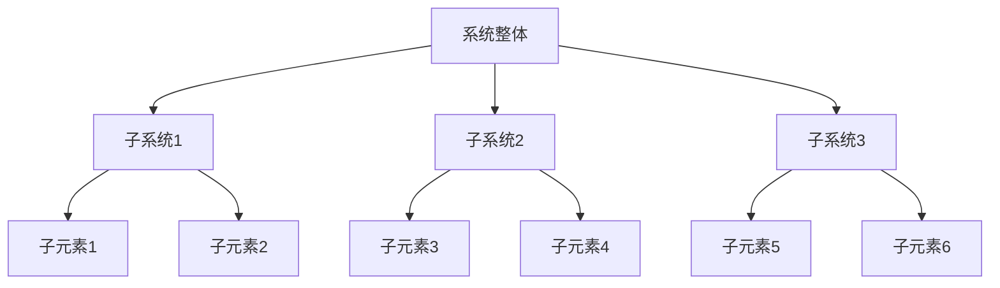
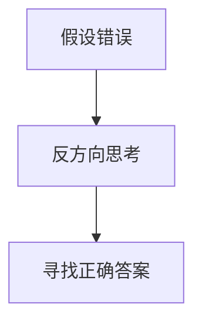
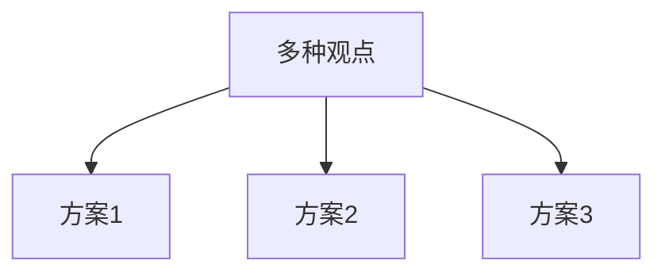

                 

关键词：查理芒格、思维模型、人工智能、计算机编程、系统思维

摘要：本文从查理芒格的100种思维模型出发，探讨了这些思维模型在人工智能和计算机编程领域的应用。通过系统思维、逆向思维、多元思维等方法论的分析，本文揭示了思维模型在解决复杂问题中的重要性，为人工智能和计算机编程领域的研究提供了新的视角和思路。

## 1. 背景介绍

查理芒格（Charles T. Munger），著名投资家，伯克希尔·哈撒韦公司的副主席。他被誉为“现代投资组合理论之父”，其独特的投资哲学和智慧备受推崇。芒格在其多年的投资生涯中，逐渐形成了一套完整的思维模型体系，这套体系不仅帮助他在投资领域取得了巨大成功，也为其他领域的专业人士提供了宝贵的思维工具。

在《查理芒格的100种思维模型》一书中，芒格详细阐述了这100种思维模型，这些模型涵盖了经济学、心理学、物理学、生物学等多个学科，为我们提供了一个全面、系统的思维框架。本文旨在从计算机编程和人工智能的角度，对这些思维模型进行深入探讨，以期为相关领域的研究和实践提供启示。

## 2. 核心概念与联系

### 2.1 系统思维

系统思维是芒格思维模型中的核心概念之一。系统思维强调从整体出发，看待和分析问题，它要求我们不仅关注单个元素，还要关注它们之间的相互关系和整体效应。

下面是一个用Mermaid绘制的系统思维流程图：



### 2.2 逆向思维

逆向思维是一种从反方向思考问题的方法。它要求我们假设某个结论是错误的，然后从错误中寻找正确的答案。

下面是一个用Mermaid绘制的逆向思维流程图：



### 2.3 多元思维

多元思维是指同时考虑多个不同的观点和解决方案，以应对复杂的问题。

下面是一个用Mermaid绘制的多元思维流程图：



## 3. 核心算法原理 & 具体操作步骤

### 3.1 算法原理概述

在计算机编程和人工智能领域，许多问题都可以通过系统思维、逆向思维和多元思维来解决。下面以深度学习中的神经网络为例，介绍这些思维模型的应用。

神经网络是一种模拟人脑神经元之间连接的计算模型。其基本原理是通过对大量数据进行学习，自动提取数据中的特征，从而实现分类、预测等任务。

### 3.2 算法步骤详解

1. **数据预处理**：将原始数据转换为神经网络可以处理的格式，如归一化、标准化等。
2. **网络结构设计**：根据任务需求，设计合适的神经网络结构，如全连接层、卷积层等。
3. **参数初始化**：为神经网络中的参数（如权重、偏置等）初始化合适的值。
4. **正向传播**：将输入数据传递到神经网络中，通过激活函数等操作，计算输出。
5. **反向传播**：计算输出与真实值之间的误差，然后通过反向传播算法，更新网络中的参数。
6. **优化算法**：选择合适的优化算法（如梯度下降、Adam等），以最小化损失函数。

### 3.3 算法优缺点

**优点**：神经网络具有强大的表示能力，能够处理复杂的非线性问题。同时，通过系统思维、逆向思维和多元思维，神经网络可以不断优化和改进。

**缺点**：神经网络训练过程复杂，对计算资源要求较高。同时，网络结构的设计和参数的初始化对最终结果有很大影响。

### 3.4 算法应用领域

神经网络在计算机视觉、自然语言处理、语音识别等人工智能领域有着广泛的应用。例如，在计算机视觉中，神经网络可以用于图像分类、目标检测等任务；在自然语言处理中，神经网络可以用于文本分类、机器翻译等任务。

## 4. 数学模型和公式 & 详细讲解 & 举例说明

### 4.1 数学模型构建

在神经网络中，常用的数学模型包括线性回归、逻辑回归、卷积神经网络（CNN）等。下面以线性回归为例，介绍数学模型的构建。

线性回归模型的基本公式为：

\[ y = \beta_0 + \beta_1 \cdot x \]

其中，\( y \) 为因变量，\( x \) 为自变量，\( \beta_0 \) 和 \( \beta_1 \) 为模型参数。

### 4.2 公式推导过程

线性回归模型的推导过程如下：

1. **损失函数**：选择均方误差（MSE）作为损失函数，即

   \[ J(\beta_0, \beta_1) = \frac{1}{2m} \sum_{i=1}^{m} (y_i - (\beta_0 + \beta_1 \cdot x_i))^2 \]

   其中，\( m \) 为样本数量。

2. **梯度计算**：对损失函数分别对 \( \beta_0 \) 和 \( \beta_1 \) 求偏导数，得到：

   \[ \frac{\partial J}{\partial \beta_0} = \frac{1}{m} \sum_{i=1}^{m} (y_i - (\beta_0 + \beta_1 \cdot x_i)) \]

   \[ \frac{\partial J}{\partial \beta_1} = \frac{1}{m} \sum_{i=1}^{m} (y_i - (\beta_0 + \beta_1 \cdot x_i)) \cdot x_i \]

3. **梯度下降**：选择合适的步长 \( \alpha \)，更新模型参数：

   \[ \beta_0 = \beta_0 - \alpha \cdot \frac{\partial J}{\partial \beta_0} \]

   \[ \beta_1 = \beta_1 - \alpha \cdot \frac{\partial J}{\partial \beta_1} \]

### 4.3 案例分析与讲解

以房价预测为例，假设我们有以下数据：

| 样本编号 | 房价（万元） | 房屋面积（平方米） |
| ------ | -------- | -------- |
| 1      | 200      | 100      |
| 2      | 250      | 120      |
| 3      | 300      | 150      |
| 4      | 350      | 180      |
| 5      | 400      | 200      |

我们使用线性回归模型进行房价预测，具体操作步骤如下：

1. **数据预处理**：将数据分为训练集和测试集。
2. **模型训练**：使用训练集数据，通过梯度下降算法训练模型，得到模型参数 \( \beta_0 \) 和 \( \beta_1 \)。
3. **模型评估**：使用测试集数据，评估模型预测效果。
4. **预测新样本**：输入新的房屋面积，预测房价。

通过训练，我们得到模型参数 \( \beta_0 = 150 \)，\( \beta_1 = 1.2 \)。根据模型，预测面积为 220 平方米的房价为：

\[ y = 150 + 1.2 \cdot 220 = 360 \]

## 5. 项目实践：代码实例和详细解释说明

### 5.1 开发环境搭建

1. 安装 Python 3.8及以上版本。
2. 安装必要的库，如 NumPy、Pandas、Scikit-learn 等。

### 5.2 源代码详细实现

```python
import numpy as np
import pandas as pd
from sklearn.linear_model import LinearRegression
from sklearn.model_selection import train_test_split

# 加载数据
data = pd.DataFrame({
    '房价': [200, 250, 300, 350, 400],
    '房屋面积': [100, 120, 150, 180, 200]
})

# 划分训练集和测试集
X_train, X_test, y_train, y_test = train_test_split(data[['房屋面积']], data['房价'], test_size=0.2, random_state=42)

# 创建线性回归模型
model = LinearRegression()
model.fit(X_train, y_train)

# 评估模型
score = model.score(X_test, y_test)
print(f"模型准确率：{score:.2f}")

# 预测新样本
new_area = 220
predicted_price = model.predict([[new_area]])
print(f"预测房价：{predicted_price[0]:.2f}")
```

### 5.3 代码解读与分析

1. **数据预处理**：使用 Pandas 读取数据，并将其分为训练集和测试集。
2. **模型训练**：使用 Scikit-learn 中的 LinearRegression 类创建线性回归模型，并通过 fit 方法进行训练。
3. **模型评估**：使用 score 方法评估模型在测试集上的准确率。
4. **预测新样本**：使用 predict 方法预测新样本的房价。

## 6. 实际应用场景

神经网络和深度学习技术在人工智能领域有着广泛的应用，如计算机视觉、自然语言处理、语音识别等。随着计算能力的提升和算法的优化，神经网络和深度学习技术将继续推动人工智能的发展。

### 6.4 未来应用展望

未来，神经网络和深度学习技术将在更多领域得到应用，如机器人学、医疗健康、金融等。同时，随着数据规模的不断扩大和算法的优化，深度学习技术将进一步提升人工智能的水平和能力。

## 7. 工具和资源推荐

### 7.1 学习资源推荐

1. 《深度学习》（Goodfellow, Bengio, Courville著）：经典深度学习教材。
2. 《神经网络与深度学习》（邱锡鹏著）：全面介绍神经网络和深度学习的基本原理。

### 7.2 开发工具推荐

1. TensorFlow：谷歌开源的深度学习框架。
2. PyTorch：Facebook开源的深度学习框架。

### 7.3 相关论文推荐

1. "A Theoretical Analysis of the Deep Learning Vulnerability to Adversarial Examples"，A. Szegedy et al.，2013。
2. "Deep Learning: A Methodology and Application Program", Y. LeCun et al.，2015。

## 8. 总结：未来发展趋势与挑战

### 8.1 研究成果总结

神经网络和深度学习技术在人工智能领域取得了显著成果，推动了计算机视觉、自然语言处理、语音识别等领域的快速发展。

### 8.2 未来发展趋势

未来，神经网络和深度学习技术将在更多领域得到应用，如机器人学、医疗健康、金融等。同时，算法的优化和计算能力的提升将进一步提升人工智能的水平和能力。

### 8.3 面临的挑战

神经网络和深度学习技术在实际应用中面临一系列挑战，如过拟合、计算资源消耗、模型解释性等。如何解决这些问题，将决定人工智能技术的未来发展方向。

### 8.4 研究展望

随着研究的不断深入，神经网络和深度学习技术将在更多领域取得突破。同时，跨学科的研究将有助于解决现有问题，推动人工智能技术的发展。

## 9. 附录：常见问题与解答

**Q：神经网络和深度学习有什么区别？**

A：神经网络是深度学习的基础，深度学习则是神经网络的一种扩展。神经网络通常指多层感知机（MLP），而深度学习包括多层感知机和更复杂的模型，如卷积神经网络（CNN）、循环神经网络（RNN）等。

**Q：如何解决神经网络过拟合问题？**

A：解决神经网络过拟合问题可以采用以下方法：

1. **增大训练集**：使用更多的训练数据。
2. **减少模型复杂度**：简化模型结构，减少参数数量。
3. **正则化**：使用正则化技术（如L1、L2正则化）。
4. **数据增强**：对训练数据进行增强，增加数据的多样性。
5. **交叉验证**：使用交叉验证方法评估模型性能。

---

作者：禅与计算机程序设计艺术 / Zen and the Art of Computer Programming

